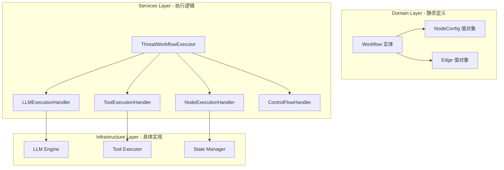

# 工作流节点体系架构重构分析

## 1. 当前架构问题分析

### 1.1 节点类型混乱

当前系统中存在多种节点类型，职责不清晰：

| 节点类型 | 文件位置 | 当前实现 | 问题 |
|---------|---------|---------|------|
| **StartNode** | `src/services/workflow/nodes/start-node.ts` | Node实体，包含初始化逻辑 | 逻辑多余，应由执行引擎负责 |
| **EndNode** | `src/services/workflow/nodes/end-node.ts` | Node实体，包含清理逻辑 | 逻辑多余，应由执行引擎负责 |
| **LoopStartNode** | `src/services/workflow/nodes/loop/loop-start-node.ts` | Node实体，包含循环初始化 | 逻辑多余，应由执行引擎负责 |
| **LoopEndNode** | `src/services/workflow/nodes/loop/loop-end-node.ts` | Node实体，包含循环控制 | 逻辑多余，应由执行引擎负责 |
| **ForkNode** | `src/services/workflow/nodes/parallel/fork-node.ts` | Node实体，包含MarkerNode | 混合了实体和值对象 |
| **JoinNode** | `src/services/workflow/nodes/parallel/join-node.ts` | Node实体，包含MarkerNode | 混合了实体和值对象 |
| **SubWorkflowNode** | `src/services/workflow/nodes/subworkflow/subworkflow-node.ts` | Node实体，包含MarkerNode | 混合了实体和值对象 |
| **UserInteractionNode** | `src/services/workflow/nodes/user-interaction-node.ts` | Node实体，包含交互逻辑 | 应该委派给专门的LLM交互模块 |
| **ConditionNode** | `src/services/workflow/nodes/condition-node.ts` | Node实体，包含条件判断逻辑 | 逻辑应该由路由器处理 |
| **DataTransformNode** | `src/services/workflow/nodes/data-transform-node.ts` | Node实体，包含数据转换逻辑 | 可能需要保留，或移到执行器 |
| **PlaceholderNode** | `src/domain/workflow/value-objects/node/placeholder-node.ts` | 值对象，存储LLM/Tool配置 | 设计正确，但类型有限 |
| **MarkerNode** | `src/domain/workflow/value-objects/node/marker-node.ts` | 值对象，存储标记信息 | 设计正确，但与PlaceholderNode重复 |

### 1.2 核心问题

1. **职责混乱**：节点既包含配置信息，又包含执行逻辑
2. **类型重复**：MarkerNode 和 PlaceholderNode 本质相同，都是配置节点
3. **逻辑分散**：初始化、清理、控制流逻辑分散在各个节点中
4. **违反DDD原则**：Node实体承担了太多职责
5. **难以扩展**：添加新节点类型需要创建新的实体类

### 1.3 违反的设计原则

- **单一职责原则（SRP）**：节点既负责存储配置，又负责执行逻辑
- **开闭原则（OCP）**：添加新节点类型需要修改多个地方
- **依赖倒置原则（DIP）**：高层模块（Thread）依赖低层模块（具体节点实现）
- **接口隔离原则（ISP）**：Node接口过于庞大，包含太多方法

## 2. 新架构设计

### 2.1 核心设计理念

**将节点的处理逻辑与节点定义完全分离**

- **节点定义**：仅作为值对象，存储配置信息
- **节点执行**：所有执行逻辑在 Thread 层定义
- **工作流**：完全专注于静态定义，不包含执行逻辑

### 2.2 架构分层



### 2.3 统一的节点配置值对象

合并 `MarkerNode` 和 `PlaceholderNode`，创建统一的 `NodeConfig` 值对象：

```typescript
// src/domain/workflow/value-objects/node/node-config.ts

/**
 * 节点配置类型枚举
 */
export enum NodeConfigType {
  // 控制流节点
  START = 'start',
  END = 'end',
  FORK = 'fork',
  JOIN = 'join',
  LOOP_START = 'loop_start',
  LOOP_END = 'loop_end',
  SUBWORKFLOW = 'subworkflow',

  // 执行节点
  LLM = 'llm',
  TOOL = 'tool',
  CONTEXT_PROCESSOR = 'context_processor',
  USER_INTERACTION = 'user_interaction',

  // 数据处理节点
  CONDITION = 'condition',
  DATA_TRANSFORM = 'data_transform',
}

/**
 * 节点配置值对象
 *
 * 职责：
 * 1. 存储节点配置信息
 * 2. 提供类型安全的配置访问
 * 3. 标记节点类型
 *
 * 特性：
 * - 不可变值对象
 * - 不包含任何执行逻辑
 * - 所有配置在创建时验证
 */
export class NodeConfig {
  private readonly _id: NodeId;
  private readonly _type: NodeConfigType;
  private readonly _name: string;
  private readonly _description: string;
  private readonly _config: Record<string, any>;

  // 静态工厂方法
  static start(id: NodeId, config?: StartNodeConfig): NodeConfig { }
  static end(id: NodeId, config?: EndNodeConfig): NodeConfig { }
  static fork(id: NodeId, branches: BranchConfig[]): NodeConfig { }
  static join(id: NodeId): NodeConfig { }
  static loopStart(id: NodeId, maxIterations: number): NodeConfig { }
  static loopEnd(id: NodeId): NodeConfig { }
  static subworkflow(id: NodeId, config: SubWorkflowConfig): NodeConfig { }
  static llm(id: NodeId, config: LLMNodeConfig): NodeConfig { }
  static tool(id: NodeId, config: ToolNodeConfig): NodeConfig { }
  static contextProcessor(id: NodeId, config: ContextProcessorConfig): NodeConfig { }
  static userInteraction(id: NodeId, config: UserInteractionConfig): NodeConfig { }
  static condition(id: NodeId, config: ConditionConfig): NodeConfig { }
  static dataTransform(id: NodeId, config: DataTransformConfig): NodeConfig { }

  // 类型检查方法
  isControlFlow(): boolean { }
  isExecutable(): boolean { }
  isMarker(): boolean { }

  // 配置访问方法
  getLLMConfig(): LLMNodeConfig { }
  getToolConfig(): ToolNodeConfig { }
  getBranches(): BranchConfig[] { }
  // ... 其他配置访问方法
}
```

### 2.4 简化的 Workflow 实体

Workflow 实体不再包含 Node 实体，只包含 NodeConfig 值对象：

```typescript
// src/domain/workflow/entities/workflow.ts

export interface WorkflowGraphData {
  readonly nodes: Map<string, NodeConfig>;  // 改为 NodeConfig
  readonly edges: Map<string, EdgeValueObject>;
}

export class Workflow extends Entity {
  private readonly props: WorkflowProps;

  // 节点管理方法
  public addNode(config: NodeConfig, updatedBy?: ID): Workflow {
    // 添加 NodeConfig 值对象
  }

  public getNode(nodeId: NodeId): NodeConfig | null {
    // 返回 NodeConfig 值对象
  }

  // ... 其他方法保持不变
}
```

### 2.5 Thread 层的节点执行处理器

在 Thread 层创建专门的执行处理器：

```typescript
// src/services/threads/node-execution-handlers/

/**
 * 节点执行处理器接口
 */
export interface INodeExecutionHandler {
  canHandle(config: NodeConfig): boolean;
  execute(
    config: NodeConfig,
    context: WorkflowExecutionContext
  ): Promise<NodeExecutionResult>;
}

/**
 * LLM节点执行处理器
 */
export class LLMExecutionHandler implements INodeExecutionHandler {
  constructor(
    private readonly llmEngine: LLMEngine,
    private readonly promptBuilder: PromptBuilder
  ) {}

  canHandle(config: NodeConfig): boolean {
    return config.type === NodeConfigType.LLM;
  }

  async execute(
    config: NodeConfig,
    context: WorkflowExecutionContext
  ): Promise<NodeExecutionResult> {
    const llmConfig = config.getLLMConfig();
    // 执行 LLM 交互逻辑
  }
}

/**
 * 工具节点执行处理器
 */
export class ToolExecutionHandler implements INodeExecutionHandler {
  constructor(
    private readonly toolExecutor: ToolExecutor
  ) {}

  canHandle(config: NodeConfig): boolean {
    return config.type === NodeConfigType.TOOL;
  }

  async execute(
    config: NodeConfig,
    context: WorkflowExecutionContext
  ): Promise<NodeExecutionResult> {
    const toolConfig = config.getToolConfig();
    // 执行工具调用逻辑
  }
}

/**
 * 控制流节点执行处理器
 */
export class ControlFlowHandler implements INodeExecutionHandler {
  canHandle(config: NodeConfig): boolean {
    return config.isControlFlow();
  }

  async execute(
    config: NodeConfig,
    context: WorkflowExecutionContext
  ): Promise<NodeExecutionResult> {
    switch (config.type) {
      case NodeConfigType.START:
        return this.handleStart(config, context);
      case NodeConfigType.END:
        return this.handleEnd(config, context);
      case NodeConfigType.FORK:
        return this.handleFork(config, context);
      case NodeConfigType.JOIN:
        return this.handleJoin(config, context);
      case NodeConfigType.LOOP_START:
        return this.handleLoopStart(config, context);
      case NodeConfigType.LOOP_END:
        return this.handleLoopEnd(config, context);
      case NodeConfigType.SUBWORKFLOW:
        return this.handleSubworkflow(config, context);
    }
  }

  private async handleStart(
    config: NodeConfig,
    context: WorkflowExecutionContext
  ): Promise<NodeExecutionResult> {
    // 初始化上下文变量
    // 记录开始时间
    // 初始化执行统计
    return { success: true, output: {} };
  }

  private async handleEnd(
    config: NodeConfig,
    context: WorkflowExecutionContext
  ): Promise<NodeExecutionResult> {
    // 记录结束时间
    // 更新执行统计
    // 收集结果
    // 清理临时资源
    return { success: true, output: {} };
  }

  // ... 其他控制流处理方法
}
```

### 2.6 更新后的 ThreadWorkflowExecutor

```typescript
// src/services/threads/thread-workflow-executor.ts

export class ThreadWorkflowExecutor {
  private readonly handlers: INodeExecutionHandler[];

  constructor(
    private readonly stateManager: ThreadStateManager,
    private readonly historyManager: ThreadHistoryManager,
    private readonly checkpointManagement: CheckpointManagement,
    private readonly router: ThreadConditionalRouter,
    // 注入所有执行处理器
    llmHandler: LLMExecutionHandler,
    toolHandler: ToolExecutionHandler,
    controlFlowHandler: ControlFlowHandler,
    // ... 其他处理器
  ) {
    this.handlers = [llmHandler, toolHandler, controlFlowHandler];
  }

  async execute(
    workflow: Workflow,
    threadId: string,
    initialState: Record<string, any>,
    options: WorkflowExecutionOptions = {}
  ): Promise<WorkflowExecutionResult> {
    // 初始化状态
    this.stateManager.initialize(threadId, workflow.workflowId, initialState);

    // 查找起始节点
    const startConfig = this.findStartNode(workflow);
    if (!startConfig) {
      throw new Error('工作流没有起始节点');
    }

    // 执行循环
    let currentConfig = startConfig;
    while (currentConfig) {
      // 查找合适的处理器
      const handler = this.findHandler(currentConfig);
      if (!handler) {
        throw new Error(`没有找到节点 ${currentConfig.id} 的执行处理器`);
      }

      // 执行节点
      const result = await handler.execute(currentConfig, context);

      // 更新状态
      this.stateManager.updateState(threadId, result.output || {});

      // 路由决策
      currentConfig = await this.routeToNext(workflow, currentConfig, context);
    }

    // 返回结果
  }

  private findHandler(config: NodeConfig): INodeExecutionHandler | null {
    return this.handlers.find(h => h.canHandle(config)) || null;
  }
}
```

## 3. 重构方案对比

### 方案1：渐进式重构（推荐）

**优点**：
- 风险低，可以逐步验证
- 不影响现有功能
- 可以分阶段实施

**步骤**：
1. 创建统一的 `NodeConfig` 值对象
2. 创建执行处理器接口和基础实现
3. 逐步迁移节点类型：
   - 第一阶段：迁移 StartNode 和 EndNode
   - 第二阶段：迁移 LoopStartNode 和 LoopEndNode
   - 第三阶段：迁移 ForkNode 和 JoinNode
   - 第四阶段：迁移 SubWorkflowNode
   - 第五阶段：迁移 UserInteractionNode
   - 第六阶段：迁移其他节点
4. 删除旧的节点实现
5. 更新测试

**时间线**：
- 第一阶段：1-2天
- 第二阶段：1-2天
- 第三阶段：2-3天
- 第四阶段：1-2天
- 第五阶段：2-3天
- 第六阶段：2-3天
- 测试和验证：3-5天

**总计**：12-20天

### 方案2：一次性重构

**优点**：
- 架构统一，没有过渡期
- 代码更清晰

**缺点**：
- 风险高，可能引入大量bug
- 需要大量测试
- 可能影响现有功能

**不推荐**，除非有充分的测试覆盖和回滚计划。

## 4. 迁移策略

### 4.1 向后兼容性

为了确保平滑迁移，可以保留旧的 Node 实体作为适配器：

```typescript
// src/services/workflow/nodes/legacy-node-adapter.ts

/**
 * 旧节点适配器
 * 用于向后兼容，逐步迁移到新架构
 */
export class LegacyNodeAdapter extends Node {
  private readonly config: NodeConfig;
  private readonly handler: INodeExecutionHandler;

  constructor(config: NodeConfig, handler: INodeExecutionHandler) {
    super(
      config.id,
      NodeType.fromConfigType(config.type),
      config.name,
      config.description
    );
    this.config = config;
    this.handler = handler;
  }

  async execute(context: WorkflowExecutionContext): Promise<NodeExecutionResult> {
    return this.handler.execute(this.config, context);
  }

  // ... 其他方法委托给 config
}
```

### 4.2 数据迁移

如果工作流数据持久化在数据库中，需要迁移数据：

```typescript
// src/services/workflow/workflow-migration-service.ts

export class WorkflowMigrationService {
  async migrateWorkflow(workflow: Workflow): Promise<Workflow> {
    const newNodes = new Map<string, NodeConfig>();

    for (const [nodeId, node] of workflow.getNodes()) {
      const config = this.convertNodeToConfig(node);
      newNodes.set(nodeId, config);
    }

    // 创建新的工作流实例
    return Workflow.fromProps({
      ...workflow.toProps(),
      graph: {
        nodes: newNodes,
        edges: workflow.getEdges(),
      },
    });
  }

  private convertNodeToConfig(node: Node): NodeConfig {
    // 根据节点类型转换为 NodeConfig
    switch (node.type.value) {
      case NodeTypeValue.START:
        return NodeConfig.start(node.nodeId, this.extractStartConfig(node));
      case NodeTypeValue.END:
        return NodeConfig.end(node.nodeId, this.extractEndConfig(node));
      // ... 其他类型
    }
  }
}
```

## 5. 优势分析

### 5.1 架构优势

1. **职责清晰**：
   - NodeConfig：只负责存储配置
   - ExecutionHandler：只负责执行逻辑
   - Workflow：只负责静态定义

2. **易于扩展**：
   - 添加新节点类型：只需添加新的 NodeConfig 类型和 ExecutionHandler
   - 不需要修改核心架构

3. **易于测试**：
   - NodeConfig：纯值对象，易于测试
   - ExecutionHandler：独立的执行逻辑，易于单元测试
   - Workflow：纯静态定义，易于验证

4. **符合DDD原则**：
   - 值对象不可变
   - 实体职责单一
   - 依赖关系清晰

### 5.2 性能优势

1. **内存占用**：值对象比实体更轻量
2. **序列化**：值对象更容易序列化和反序列化
3. **缓存**：配置可以缓存，不需要重复创建

### 5.3 维护优势

1. **代码组织**：相关逻辑集中在一起
2. **依赖管理**：清晰的依赖关系
3. **文档化**：每个处理器都有明确的职责

## 6. 风险和挑战

### 6.1 技术风险

1. **向后兼容性**：需要确保现有工作流可以正常运行
2. **性能影响**：需要评估新架构的性能
3. **测试覆盖**：需要充分的测试覆盖

### 6.2 实施风险

1. **时间成本**：重构需要大量时间
2. **团队协作**：需要团队理解和接受新架构
3. **文档更新**：需要更新所有相关文档

### 6.3 缓解措施

1. **渐进式迁移**：分阶段实施，降低风险
2. **充分测试**：每个阶段都有充分的测试
3. **回滚计划**：准备回滚方案
4. **文档先行**：先更新文档，再实施代码

## 7. 推荐方案

**推荐采用方案1：渐进式重构**

理由：
1. 风险可控，可以逐步验证
2. 不影响现有功能
3. 可以根据实际情况调整进度
4. 团队可以逐步适应新架构

**第一阶段重点**：
1. 创建统一的 `NodeConfig` 值对象
2. 创建执行处理器接口
3. 迁移 StartNode 和 EndNode
4. 验证基本功能

**后续阶段**：
根据第一阶段的经验，逐步迁移其他节点类型。

## 8. 下一步行动

1. **团队讨论**：与团队讨论这个重构方案
2. **技术评审**：进行技术评审，确认可行性
3. **制定详细计划**：制定详细的实施计划
4. **开始实施**：从第一阶段开始实施
5. **持续验证**：每个阶段都进行充分验证

## 9. 附录

### 9.1 相关文件清单

需要修改的文件：
- `src/domain/workflow/entities/node.ts` - 可能需要简化或删除
- `src/domain/workflow/entities/workflow.ts` - 修改为使用 NodeConfig
- `src/domain/workflow/value-objects/node/marker-node.ts` - 合并到 NodeConfig
- `src/domain/workflow/value-objects/node/placeholder-node.ts` - 合并到 NodeConfig
- `src/services/workflow/nodes/*.ts` - 所有节点实现文件
- `src/services/workflow/nodes/node-factory.ts` - 修改为创建 NodeConfig
- `src/services/threads/thread-workflow-executor.ts` - 修改为使用执行处理器

需要创建的文件：
- `src/domain/workflow/value-objects/node/node-config.ts` - 统一的节点配置
- `src/services/threads/node-execution-handlers/` - 执行处理器目录
- `src/services/threads/node-execution-handlers/node-execution-handler.ts` - 处理器接口
- `src/services/threads/node-execution-handlers/llm-execution-handler.ts` - LLM处理器
- `src/services/threads/node-execution-handlers/tool-execution-handler.ts` - 工具处理器
- `src/services/threads/node-execution-handlers/control-flow-handler.ts` - 控制流处理器
- `src/services/workflow/workflow-migration-service.ts` - 数据迁移服务

### 9.2 测试策略

1. **单元测试**：每个执行处理器都有单元测试
2. **集成测试**：测试整个执行流程
3. **回归测试**：确保现有功能不受影响
4. **性能测试**：评估新架构的性能

### 9.3 文档更新

需要更新的文档：
- 架构文档
- API文档
- 开发指南
- 迁移指南