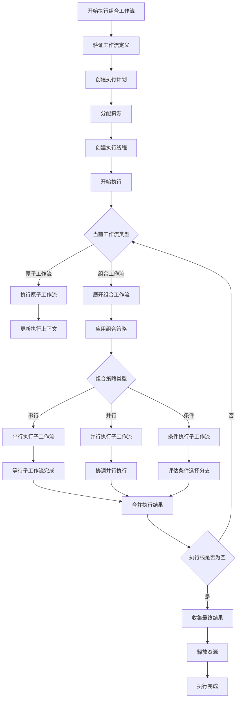
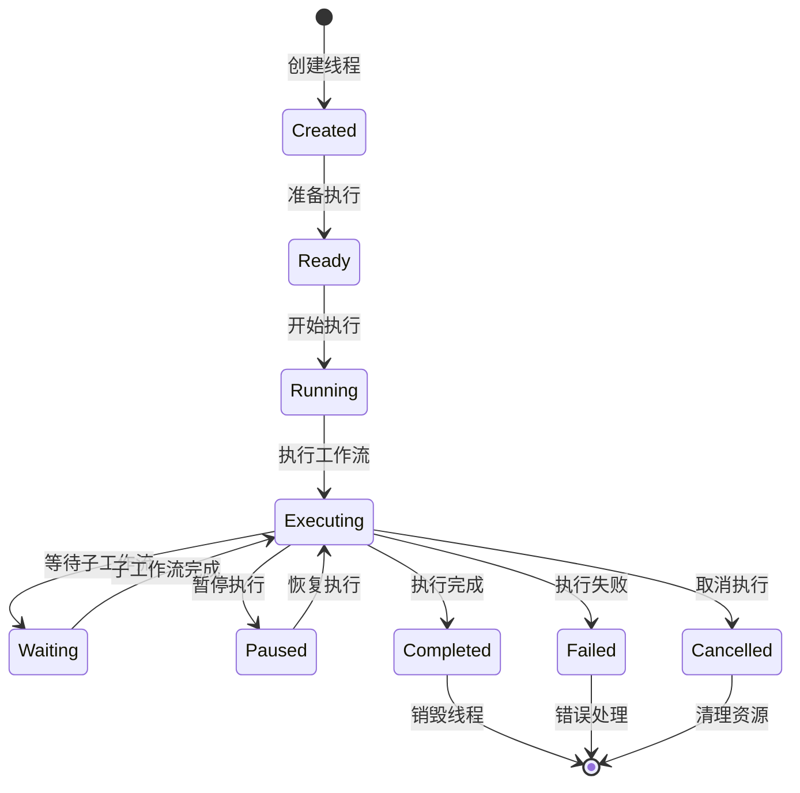

# 组合工作流执行流程设计

## 概述

本文档分析如何设计组合多个工作流的执行流程，探讨在这种复杂场景下Thread和Session应该发挥的作用。组合工作流是指将多个子工作流组合成一个更大的执行流程，支持串行、并行、条件分支等复杂的执行模式。

## 组合工作流场景分析

### 典型使用场景

1. **业务流程编排**: 将多个业务步骤组合成完整业务流程
2. **数据处理管道**: 多个数据处理步骤的串行或并行执行
3. **微服务协调**: 协调多个微服务的调用顺序和依赖关系
4. **批处理作业**: 复杂批处理任务的分解和组合

### 组合模式

1. **串行组合**: 子工作流按顺序依次执行
2. **并行组合**: 子工作流同时执行
3. **条件组合**: 根据条件选择执行不同的子工作流
4. **循环组合**: 重复执行某个子工作流
5. **嵌套组合**: 子工作流本身也是组合工作流

## 架构设计

### 核心概念重新定义

#### 1. Workflow层次结构

```typescript
/**
 * 工作流类型枚举
 */
export enum WorkflowType {
  ATOMIC = 'atomic',      // 原子工作流，不可再分
  COMPOSITE = 'composite'  // 组合工作流，包含子工作流
}

/**
 * 工作流基类
 */
export abstract class Workflow extends AggregateRoot {
  protected readonly props: WorkflowProps;
  
  /**
   * 执行工作流
   */
  public abstract execute(context: ExecutionContext): Promise<WorkflowResult>;
  
  /**
   * 验证执行条件
   */
  public abstract validate(context: ExecutionContext): boolean;
  
  /**
   * 获取工作流类型
   */
  public abstract getType(): WorkflowType;
}

/**
 * 原子工作流
 */
export class AtomicWorkflow extends Workflow {
  private readonly steps: ExecutionStep[];
  
  public getType(): WorkflowType {
    return WorkflowType.ATOMIC;
  }
  
  public async execute(context: ExecutionContext): Promise<WorkflowResult> {
    // 原子工作流的执行逻辑
    // 专注于单个业务逻辑的执行
  }
}

/**
 * 组合工作流
 */
export class CompositeWorkflow extends Workflow {
  private readonly children: Workflow[];
  private readonly compositionStrategy: CompositionStrategy;
  
  public getType(): WorkflowType {
    return WorkflowType.COMPOSITE;
  }
  
  public async execute(context: ExecutionContext): Promise<WorkflowResult> {
    // 委托给组合策略执行
    return await this.compositionStrategy.execute(this.children, context);
  }
}
```

#### 2. 组合策略设计

```typescript
/**
 * 组合策略接口
 */
export interface ICompositionStrategy {
  execute(children: Workflow[], context: ExecutionContext): Promise<WorkflowResult>;
  validate(children: Workflow[], context: ExecutionContext): boolean;
}

/**
 * 串行组合策略
 */
export class SerialCompositionStrategy implements ICompositionStrategy {
  public async execute(children: Workflow[], context: ExecutionContext): Promise<WorkflowResult> {
    const results: WorkflowResult[] = [];
    let currentContext = context;
    
    for (const child of children) {
      // 验证子工作流执行条件
      if (!child.validate(currentContext)) {
        throw new Error(`子工作流 ${child.id} 执行条件不满足`);
      }
      
      // 执行子工作流
      const result = await child.execute(currentContext);
      results.push(result);
      
      // 更新执行上下文
      currentContext = this.updateContext(currentContext, result);
      
      // 检查是否需要终止
      if (result.shouldTerminate) {
        break;
      }
    }
    
    return this.combineResults(results);
  }
  
  private updateContext(context: ExecutionContext, result: WorkflowResult): ExecutionContext {
    // 将子工作流的输出作为下一个子工作流的输入
    return context.withData(result.output);
  }
  
  private combineResults(results: WorkflowResult[]): WorkflowResult {
    // 合并所有子工作流的结果
    return {
      output: results.reduce((acc, result) => ({ ...acc, ...result.output }), {}),
      metadata: {
        totalSteps: results.length,
        executionTime: results.reduce((sum, result) => sum + result.executionTime, 0),
        ...results[results.length - 1]?.metadata
      }
    };
  }
}

/**
 * 并行组合策略
 */
export class ParallelCompositionStrategy implements ICompositionStrategy {
  public async execute(children: Workflow[], context: ExecutionContext): Promise<WorkflowResult> {
    // 为每个子工作流创建独立的执行上下文
    const childContexts = children.map(child => 
      this.createChildContext(context, child)
    );
    
    // 并行执行所有子工作流
    const promises = children.map((child, index) => 
      child.execute(childContexts[index])
    );
    
    const results = await Promise.all(promises);
    
    return this.combineResults(results);
  }
  
  private createChildContext(parentContext: ExecutionContext, child: Workflow): ExecutionContext {
    // 为子工作流创建独立的执行上下文
    return parentContext.fork(child.id);
  }
  
  private combineResults(results: WorkflowResult[]): WorkflowResult {
    // 合并并行执行的结果
    return {
      output: results.reduce((acc, result) => ({ ...acc, ...result.output }), {}),
      metadata: {
        parallelSteps: results.length,
        maxExecutionTime: Math.max(...results.map(r => r.executionTime)),
        ...results[0]?.metadata
      }
    };
  }
}

/**
 * 条件组合策略
 */
export class ConditionalCompositionStrategy implements ICompositionStrategy {
  constructor(
    private readonly conditionEvaluator: IConditionEvaluator,
    private readonly branches: Map<string, Workflow[]>
  ) {}
  
  public async execute(children: Workflow[], context: ExecutionContext): Promise<WorkflowResult> {
    // 评估条件
    const condition = this.conditionEvaluator.evaluate(context);
    
    // 选择对应的分支
    const selectedBranches = this.branches.get(condition) || [];
    
    if (selectedBranches.length === 0) {
      throw new Error(`没有找到条件 ${condition} 对应的执行分支`);
    }
    
    // 执行选中的分支
    const serialStrategy = new SerialCompositionStrategy();
    return await serialStrategy.execute(selectedBranches, context);
  }
}
```

### Thread在组合工作流中的角色

#### 1. Thread作为执行上下文管理器

```typescript
/**
 * 组合工作流执行器
 */
export class CompositeWorkflowExecutor extends ThreadExecutor {
  private readonly executionStack: ExecutionFrame[];
  private readonly contextManager: ExecutionContextManager;
  
  constructor(workflow: CompositeWorkflow, sessionContext: SessionContext) {
    super(workflow, sessionContext);
    this.executionStack = [];
    this.contextManager = new ExecutionContextManager(sessionContext);
  }
  
  /**
   * 执行组合工作流
   */
  public async executeComposite(inputData: unknown): Promise<ExecutionResult> {
    try {
      // 1. 初始化执行栈
      this.initializeExecutionStack(this.workflow as CompositeWorkflow);
      
      // 2. 执行工作流栈
      while (!this.executionStack.isEmpty()) {
        const frame = this.executionStack.peek();
        
        if (frame.isAtomic()) {
          // 执行原子工作流
          await this.executeAtomicWorkflow(frame);
        } else {
          // 展开组合工作流
          await this.expandCompositeWorkflow(frame);
        }
      }
      
      // 3. 收集执行结果
      return this.collectExecutionResults();
    } catch (error) {
      return await this.handleExecutionError(error);
    }
  }
  
  /**
   * 执行原子工作流
   */
  private async executeAtomicWorkflow(frame: ExecutionFrame): Promise<void> {
    const workflow = frame.getWorkflow() as AtomicWorkflow;
    const context = this.contextManager.getContext(workflow.id);
    
    // 执行原子工作流
    const result = await workflow.execute(context);
    
    // 更新执行上下文
    this.contextManager.updateContext(workflow.id, result);
    
    // 弹出执行栈
    this.executionStack.pop();
  }
  
  /**
   * 展开组合工作流
   */
  private async expandCompositeWorkflow(frame: ExecutionFrame): Promise<void> {
    const workflow = frame.getWorkflow() as CompositeWorkflow;
    const strategy = workflow.getCompositionStrategy();
    const children = workflow.getChildren();
    
    // 根据策略展开子工作流
    const executionPlan = await strategy.createExecutionPlan(children, this.contextManager.getCurrentContext());
    
    // 将子工作流压入执行栈
    for (const child of executionPlan.getOrderedChildren()) {
      this.executionStack.push(new ExecutionFrame(child, frame.getDepth() + 1));
    }
    
    // 弹出当前组合工作流
    this.executionStack.pop();
  }
}
```

#### 2. Thread作为并行协调器

```typescript
/**
 * 并行执行协调器
 */
export class ParallelExecutionCoordinator extends ThreadExecutor {
  private readonly parallelContexts: Map<string, ExecutionContext>;
  private readonly executionMonitor: ExecutionMonitor;
  
  constructor(workflow: CompositeWorkflow, sessionContext: SessionContext) {
    super(workflow, sessionContext);
    this.parallelContexts = new Map();
    this.executionMonitor = new ExecutionMonitor();
  }
  
  /**
   * 协调并行执行
   */
  public async coordinateParallelExecution(children: Workflow[]): Promise<ExecutionResult> {
    // 1. 为每个子工作流创建独立的执行上下文
    for (const child of children) {
      const childContext = this.createParallelContext(child);
      this.parallelContexts.set(child.id, childContext);
    }
    
    // 2. 创建并行执行任务
    const tasks = children.map(child => 
      this.createParallelTask(child, this.parallelContexts.get(child.id)!)
    );
    
    // 3. 启动并行监控
    this.executionMonitor.startMonitoring(tasks);
    
    try {
      // 4. 等待所有任务完成
      const results = await Promise.all(tasks);
      
      // 5. 合并执行结果
      return this.combineParallelResults(results);
    } finally {
      // 6. 停止监控
      this.executionMonitor.stopMonitoring();
      
      // 7. 清理并行上下文
      this.cleanupParallelContexts();
    }
  }
  
  /**
   * 创建并行任务
   */
  private async createParallelTask(
    workflow: Workflow, 
    context: ExecutionContext
  ): Promise<WorkflowResult> {
    // 为每个并行任务创建独立的Thread
    const parallelThread = new ThreadExecutor(workflow, context.getSessionContext());
    
    // 执行任务
    return await parallelThread.execute(context.getData());
  }
  
  /**
   * 处理并行执行错误
   */
  private async handleParallelError(error: Error, failedTaskId: string): Promise<void> {
    // 1. 记录错误信息
    this.executionMonitor.recordError(failedTaskId, error);
    
    // 2. 取消其他正在执行的任务
    await this.cancelOtherTasks(failedTaskId);
    
    // 3. 清理资源
    await this.cleanupFailedExecution(failedTaskId);
  }
}
```

### Session在组合工作流中的角色

#### 1. Session作为工作流编排器

```typescript
/**
 * 工作流编排会话
 */
export class WorkflowOrchestrationSession extends Session {
  private readonly workflowRegistry: WorkflowRegistry;
  private readonly executionPlanner: ExecutionPlanner;
  private readonly resourceManager: ResourceManager;
  
  constructor(props: SessionProps) {
    super(props);
    this.workflowRegistry = new WorkflowRegistry();
    this.executionPlanner = new ExecutionPlanner();
    this.resourceManager = new ResourceManager();
  }
  
  /**
   * 编排组合工作流执行
   */
  public async orchestrateCompositeWorkflow(
    workflowId: ID,
    executionPlan: ExecutionPlan
  ): Promise<OrchestrationResult> {
    try {
      // 1. 验证工作流定义
      const workflow = await this.workflowRegistry.getWorkflow(workflowId);
      this.validateCompositeWorkflow(workflow);
      
      // 2. 创建执行计划
      const detailedPlan = await this.executionPlanner.createDetailedPlan(
        workflow, 
        executionPlan
      );
      
      // 3. 分配资源
      const resourceAllocation = await this.resourceManager.allocateResources(
        detailedPlan.getResourceRequirements()
      );
      
      // 4. 创建执行线程
      const threads = await this.createExecutionThreads(workflow, detailedPlan);
      
      // 5. 启动执行
      const results = await this.startExecution(threads, resourceAllocation);
      
      // 6. 收集结果
      return this.collectOrchestrationResults(results);
    } catch (error) {
      await this.handleOrchestrationError(error);
      throw error;
    }
  }
  
  /**
   * 创建执行线程
   */
  private async createExecutionThreads(
    workflow: CompositeWorkflow, 
    plan: ExecutionPlan
  ): Promise<ThreadExecutor[]> {
    const threads: ThreadExecutor[] = [];
    
    // 1. 创建主执行线程
    const mainThread = new CompositeWorkflowExecutor(workflow, this.getContext());
    threads.push(mainThread);
    
    // 2. 根据执行计划创建并行线程
    const parallelSteps = plan.getParallelSteps();
    for (const step of parallelSteps) {
      const parallelThread = new ParallelExecutionCoordinator(
        step.getWorkflow(), 
        this.getContext()
      );
      threads.push(parallelThread);
    }
    
    return threads;
  }
  
  /**
   * 管理线程生命周期
   */
  private async manageThreadLifecycle(threads: ThreadExecutor[]): Promise<void> {
    // 1. 监控线程状态
    const monitor = new ThreadLifecycleMonitor(threads);
    
    // 2. 处理线程事件
    monitor.onThreadCompleted((thread, result) => {
      this.handleThreadCompletion(thread, result);
    });
    
    monitor.onThreadFailed((thread, error) => {
      this.handleThreadFailure(thread, error);
    });
    
    // 3. 启动监控
    await monitor.start();
  }
}
```

#### 2. Session作为资源协调器

```typescript
/**
 * 资源协调会话
 */
export class ResourceCoordinationSession extends Session {
  private readonly resourcePool: ResourcePool;
  private readonly allocationStrategy: ResourceAllocationStrategy;
  
  /**
   * 协调组合工作流资源分配
   */
  public async coordinateCompositeResources(
    workflow: CompositeWorkflow
  ): Promise<ResourceAllocation> {
    // 1. 分析资源需求
    const requirements = this.analyzeResourceRequirements(workflow);
    
    // 2. 创建资源分配计划
    const allocationPlan = await this.allocationStrategy.createPlan(requirements);
    
    // 3. 预留资源
    const reservation = await this.resourcePool.reserve(allocationPlan);
    
    // 4. 监控资源使用
    this.monitorResourceUsage(reservation);
    
    return reservation;
  }
  
  /**
   * 分析组合工作流资源需求
   */
  private analyzeResourceRequirements(workflow: CompositeWorkflow): ResourceRequirements {
    const analyzer = new CompositeResourceAnalyzer();
    
    // 1. 分析串行部分资源需求
    const serialRequirements = analyzer.analyzeSerialRequirements(workflow);
    
    // 2. 分析并行部分资源需求
    const parallelRequirements = analyzer.analyzeParallelRequirements(workflow);
    
    // 3. 合并资源需求
    return this.combineResourceRequirements(serialRequirements, parallelRequirements);
  }
  
  /**
   * 处理资源竞争
   */
  private async handleResourceContention(
    contention: ResourceContention
  ): Promise<Resolution> {
    // 1. 识别竞争的工作流
    const competingWorkflows = this.identifyCompetingWorkflows(contention);
    
    // 2. 应用解决策略
    const strategy = this.selectContentionResolutionStrategy(contention);
    
    // 3. 执行解决方案
    return await strategy.resolve(competingWorkflows, contention);
  }
}
```

## 执行流程设计

### 组合工作流执行流程



### 线程生命周期管理



## 优势与挑战

### 优势

1. **灵活性**: 支持复杂的组合模式和执行策略
2. **可扩展性**: 易于添加新的组合策略和执行模式
3. **资源优化**: 智能的资源分配和管理
4. **错误隔离**: 子工作流错误不会影响其他部分

### 挑战

1. **复杂性**: 系统复杂度显著增加
2. **调试困难**: 多层嵌套的执行流程难以调试
3. **性能开销**: 组合和协调带来的性能开销
4. **状态管理**: 复杂的状态同步和一致性保证

## 实施建议

### 分阶段实施

1. **第一阶段**: 实现基本的组合工作流支持
2. **第二阶段**: 添加并行执行和资源管理
3. **第三阶段**: 优化性能和错误处理

### 关键技术点

1. **执行上下文管理**: 设计高效的上下文传递机制
2. **资源调度**: 实现智能的资源分配算法
3. **错误处理**: 建立完善的错误传播和恢复机制
4. **监控体系**: 构建全面的执行监控和调试工具

## 结论

组合工作流的执行流程设计需要在灵活性和复杂性之间找到平衡。通过合理的架构设计和职责分工，可以构建一个既强大又易于维护的组合工作流执行系统。Thread作为执行上下文管理器和并行协调器，Session作为工作流编排器和资源协调器，共同支撑起复杂的组合工作流执行需求。