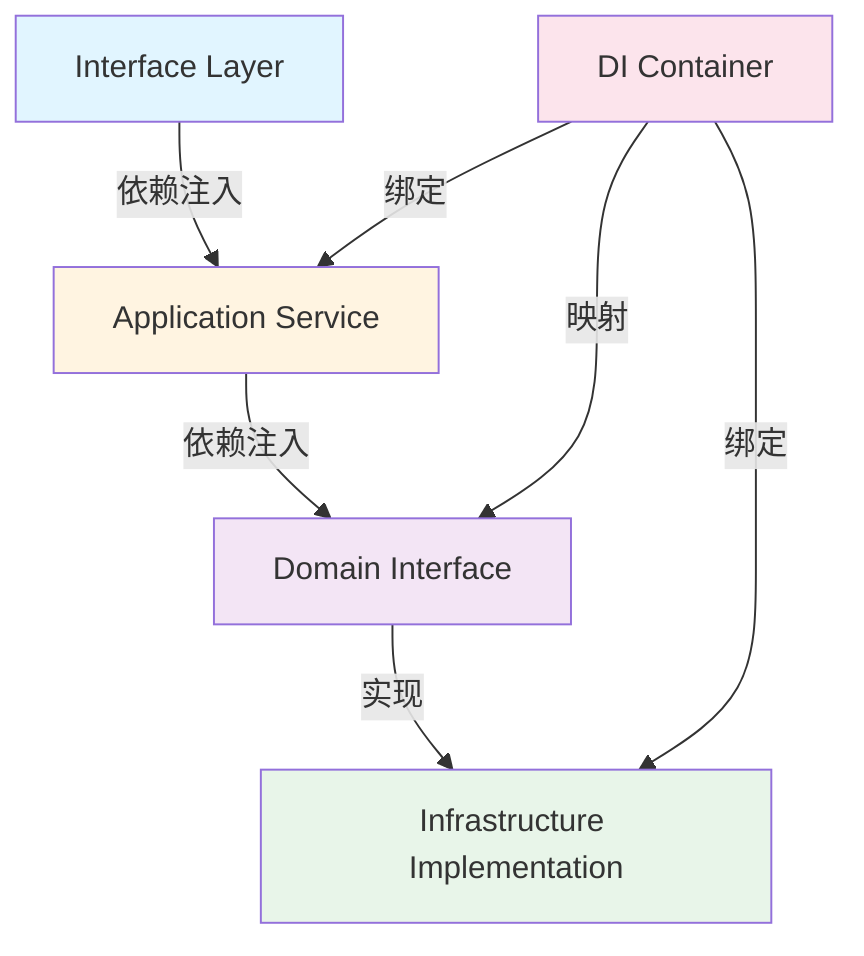
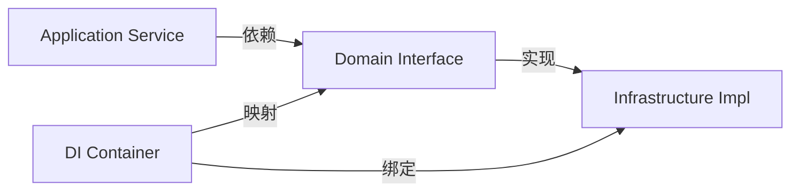

# 跨层导入分析报告

## 📋 执行摘要

本报告对Modular Agent Framework项目的跨层导入实现进行了全面分析。分析结果表明，项目在跨层导入管理方面表现优秀，严格遵循了DDD分层架构原则，通过依赖注入容器实现了良好的解耦。

**总体评价**：✅ **优秀** - 当前实现合理，架构清晰，符合最佳实践

---

## 🏗️ 项目架构概览

### 分层架构设计

项目采用标准的4层DDD架构：

```
┌─────────────────────────────────────────┐
│         Interface Layer (接口层)         │
│  - HTTP Controllers                      │
│  - DTOs                                  │
│  - Routes                                │
└──────────────┬──────────────────────────┘
               │ 只依赖
               ↓
┌─────────────────────────────────────────┐
│      Application Layer (应用层)          │
│  - Application Services                  │
│  - DTOs                                  │
│  - Business Orchestration                │
└──────────────┬──────────────────────────┘
               │ 只依赖
               ↓
┌─────────────────────────────────────────┐
│       Domain Layer (领域层)              │
│  - Entities                              │
│  - Value Objects                         │
│  - Repository Interfaces                 │
│  - Service Interfaces                    │
└──────────────┬──────────────────────────┘
               ↑              ↑
               │              │
               │              │ 只依赖
               │              │
┌──────────────┴──────────────┴──────────┐
│   Infrastructure Layer (基础设施层)      │
│  - Repository Implementations           │
│  - Service Implementations              │
│  - External Integrations                │
│  - Technical Details                    │
└─────────────────────────────────────────┘
```

### 依赖规则（来自AGENTS.md）

| 层级 | 允许依赖的层 | 禁止依赖的层 |
|------|------------|------------|
| **Domain** | 无（独立层） | Application, Infrastructure, Interface |
| **Infrastructure** | Domain | Application, Interface |
| **Application** | Domain | Infrastructure, Interface |
| **Interface** | Application | Domain, Infrastructure |

---

## 🔍 各层导入情况分析

### 1. Domain层（领域层）

#### ✅ 导入合规性：完全合规

**分析结果**：
- Domain层**完全没有**跨层导入
- 所有导入都是同层内的模块
- 保持了领域层的纯粹性

**示例分析** - [`workflow.ts`](src/domain/workflow/entities/workflow.ts:1)：
```typescript
// ✅ 只导入同层模块
import { Entity } from '../../common/base/entity';
import { ID } from '../../common/value-objects/id';
import { WorkflowDefinition } from '../value-objects/workflow-definition';
import { WorkflowStatus } from '../value-objects/workflow-status';
// ... 其他同层导入
```

**关键发现**：
- ✅ 没有导入Application层
- ✅ 没有导入Infrastructure层
- ✅ 没有导入Interface层
- ✅ 只导入Domain层的common、entities、value-objects、repositories等模块

**评价**：Domain层完全符合DDD原则，保持了业务逻辑的纯粹性，不依赖任何技术实现细节。

---

### 2. Application层（应用层）

#### ✅ 导入合规性：完全合规

**分析结果**：
- Application层**只依赖**Domain层
- 没有直接依赖Infrastructure层或Interface层
- 通过依赖注入获取Infrastructure实现

**示例分析** - [`workflow-service.ts`](src/application/workflow/services/workflow-service.ts:1)：
```typescript
// ✅ 只导入Domain层
import { Workflow } from '../../../domain/workflow/entities/workflow';
import { WorkflowRepository } from '../../../domain/workflow/repositories/workflow-repository';
import { ID } from '../../../domain/common/value-objects/id';
import { WorkflowStatus } from '../../../domain/workflow/value-objects/workflow-status';
// ... 其他Domain层导入

// ✅ 同层DTOs
import { WorkflowDto, WorkflowSummaryDto } from '../dtos/workflow.dto';
```

**示例分析** - [`session-orchestration-service.ts`](src/application/sessions/services/session-orchestration-service.ts:1)：
```typescript
// ✅ 只导入Domain层接口
import { SessionRepository } from '../../../domain/sessions/repositories/session-repository';
import { ThreadRepository } from '../../../domain/threads/repositories/thread-repository';
import { ThreadCoordinatorService } from '../../../domain/threads/services/thread-coordinator-service.interface';

// ✅ 通过依赖注入获取实现
constructor(
  @inject(TYPES.SessionRepository) private readonly sessionRepository: SessionRepository,
  @inject(TYPES.ThreadCoordinatorService) private readonly threadCoordinator: ThreadCoordinatorService
) {}
```

**关键发现**：
- ✅ 所有业务逻辑依赖都来自Domain层
- ✅ 通过依赖注入获取Infrastructure实现（不直接导入）
- ✅ DTOs定义在Application层内部
- ✅ 没有违反依赖规则

**评价**：Application层正确地扮演了编排者的角色，只依赖Domain层的抽象，通过DI容器获取具体实现。

---

### 3. Infrastructure层（基础设施层）

#### ✅ 导入合规性：完全合规

**分析结果**：
- Infrastructure层**只依赖**Domain层
- 实现了Domain层定义的接口
- 没有依赖Application层或Interface层

**示例分析** - [`node-executor.ts`](src/infrastructure/workflow/nodes/node-executor.ts:1)：
```typescript
// ✅ 只导入Domain层
import { NodeValueObject } from '../../../domain/workflow/value-objects/node-value-object';
import { ILogger } from '../../../domain/common/types/logger-types';

// ✅ 同层模块
import { ValueObjectExecutor } from '../functions/executors/value-object-executor';
```

**示例分析** - [`thread-coordinator-service.ts`](src/infrastructure/threads/services/thread-coordinator-service.ts:1)：
```typescript
// ✅ 只导入Domain层
import { ID } from '../../../domain/common/value-objects/id';
import { ThreadExecution } from '../../../domain/threads/value-objects/thread-execution';
import { Workflow } from '../../../domain/workflow/entities/workflow';
import { ThreadRepository } from '../../../domain/threads/repositories/thread-repository';

// ✅ 实现Domain层接口
import {
  ThreadCoordinatorService as DomainThreadCoordinatorService,
  ThreadExecutionContext,
  ExecutionStatus,
  ExecutionResult,
  ThreadPoolStatus
} from '../../../domain/threads/services/thread-coordinator-service.interface';

// ✅ 同层模块
import { ThreadExecutionEngine } from '../execution/thread-execution-engine';
import { NodeExecutor } from '../../workflow/nodes/node-executor';
```

**示例分析** - [`graph-algorithm-service.ts`](src/infrastructure/workflow/services/graph-algorithm-service.ts:1)：
```typescript
// ✅ 只导入Domain层
import { GraphAlgorithmService, GraphComplexity } from '../../../domain/workflow/services/graph-algorithm-service.interface';
import { Workflow } from '../../../domain/workflow/entities/workflow';
import { NodeValueObject } from '../../../domain/workflow/value-objects/node-value-object';
import { ID } from '../../../domain/common/value-objects/id';
```

**关键发现**：
- ✅ 所有实现都基于Domain层的接口
- ✅ 只使用Domain层的类型和值对象
- ✅ 没有依赖Application层或Interface层
- ✅ 技术实现细节完全封装在Infrastructure层

**评价**：Infrastructure层正确地实现了Domain层的接口，提供了具体的技术实现，保持了良好的封装性。

---

### 4. Interface层（接口层）

#### ✅ 导入合规性：完全合规

**分析结果**：
- Interface层**只依赖**Application层
- 没有直接依赖Domain层或Infrastructure层
- 通过Application服务访问业务逻辑

**示例分析** - [`session.controller.ts`](src/interfaces/http/sessions/controllers/session.controller.ts:1)：
```typescript
// ✅ 只导入Application层
import { SessionService } from '../../../../application/sessions/services/session-service';
import { SessionConverter, SessionInfo } from '../dtos';

// ✅ HTTP框架（外部依赖）
import { Request, Response } from 'express';
```

**关键发现**：
- ✅ 只导入Application层的服务
- ✅ DTOs定义在Interface层内部
- ✅ 没有直接导入Domain层或Infrastructure层
- � HTTP框架等外部依赖是合理的

**评价**：Interface层正确地作为外部接口适配器，只依赖Application层，保持了良好的分层。

---

## 🔧 依赖注入实现分析

### DI容器架构

项目使用InversifyJS实现依赖注入，通过[`di/container.ts`](src/di/container.ts:1)统一管理：

```typescript
// 容器初始化顺序
1. 加载Infrastructure层绑定
2. 加载Application层绑定
```

### 绑定策略

#### Infrastructure绑定 ([`infrastructure-bindings.ts`](src/di/bindings/infrastructure-bindings.ts:1))

```typescript
// ✅ 绑定Infrastructure实现
bind(TYPES.SessionRepositoryImpl)
  .to(SessionInfrastructureRepository)
  .inSingletonScope();

bind(TYPES.GraphAlgorithmServiceImpl)
  .to(GraphAlgorithmServiceImpl)
  .inSingletonScope();
```

#### Application绑定 ([`application-bindings.ts`](src/di/bindings/application-bindings.ts:1))

```typescript
// ✅ 使用toDynamicValue将Domain接口映射到Infrastructure实现
bind(TYPES.SessionRepository)
  .toDynamicValue((context: any) => {
    return context.container.get(TYPES.SessionRepositoryImpl);
  })
  .inSingletonScope();

bind(TYPES.ThreadCoordinatorService)
  .toDynamicValue((context: any) => {
    return context.container.get(TYPES.ThreadCoordinatorServiceImpl);
  })
  .inSingletonScope();
```

### 依赖流程图



### 关键设计亮点

1. **接口与实现分离**：
   - Domain层定义接口
   - Infrastructure层提供实现
   - Application层通过接口使用

2. **动态值绑定**：
   - 使用`toDynamicValue`实现延迟解析
   - 避免循环依赖
   - 支持复杂的依赖关系

3. **单例模式**：
   - 所有服务默认为单例
   - 提高性能
   - 保持状态一致性

---

## ✅ 合规性检查结果

### 跨层导入违规检查

使用正则表达式搜索所有可能的跨层导入：

```bash
# 检查Domain层是否导入其他层
src/domain: import.*from.*\.\./\.\./(application|infrastructure|interfaces)
结果: ✅ 无违规

# 检查Application层是否导入Infrastructure或Interface层
src/application: import.*from.*\.\./\.\./(infrastructure|interfaces)
结果: ✅ 无违规

# 检查Infrastructure层是否导入Application或Interface层
src/infrastructure: import.*from.*\.\./\.\./(application|interfaces)
结果: ✅ 无违规

# 检查Interface层是否直接导入Domain或Infrastructure层
src/interfaces: import.*from.*\.\./\.\./(domain|infrastructure)
结果: ✅ 无违规
```

### 依赖规则遵守情况

| 层级 | 规则 | 实际情况 | 状态 |
|------|------|---------|------|
| Domain | 不依赖任何层 | 只导入同层模块 | ✅ 合规 |
| Infrastructure | 只依赖Domain | 只导入Domain层 | ✅ 合规 |
| Application | 只依赖Domain | 只导入Domain层 | ✅ 合规 |
| Interface | 只依赖Application | 只导入Application层 | ✅ 合规 |

---

## 📊 架构质量评估

### 优势分析

#### 1. ✅ 严格的分层隔离
- 每层职责清晰
- 依赖方向明确
- 没有循环依赖

#### 2. ✅ 良好的抽象设计
- Domain层定义清晰的接口
- Infrastructure层提供具体实现
- 易于替换和测试

#### 3. ✅ 依赖注入解耦
- 使用InversifyJS管理依赖
- 接口与实现分离
- 支持单元测试

#### 4. ✅ 符合DDD原则
- 领域逻辑纯粹
- 技术细节隔离
- 业务规则集中

#### 5. ✅ 可维护性强
- 代码组织清晰
- 修改影响范围可控
- 易于扩展

### 潜在改进点

#### 1. ⚠️ DI绑定复杂度
**问题**：
- 使用`toDynamicValue`增加了理解成本
- 绑定逻辑分散在多个文件中

**影响**：中等
**建议**：
- 考虑使用更简单的绑定方式
- 添加详细的注释说明绑定关系
- 创建绑定关系文档

#### 2. ⚠️ 缺少自动化检查
**问题**：
- 目前依赖规则靠人工遵守
- 没有自动化工具强制执行

**影响**：中等
**建议**：
- 引入ESLint规则检查跨层导入
- 使用`import/order`规则强制导入顺序
- 添加pre-commit hook

#### 3. ⚠️ 服务标识符管理
**问题**：
- `TYPES`定义在`service-keys.ts`中
- 需要手动维护接口和实现的映射

**影响**：低
**建议**：
- 考虑使用装饰器自动注册
- 或使用更现代的DI框架（如TSyringe）

#### 4. ⚠️ 文档不足
**问题**：
- 缺少架构决策记录（ADR）
- 依赖关系图不够详细

**影响**：低
**建议**：
- 添加ADR文档
- 创建详细的架构图
- 补充依赖关系说明

---

## 💡 改进建议

### 优先级1：高优先级

#### 1.1 添加自动化依赖检查

**目标**：防止未来的跨层导入违规

**实施方案**：

1. **配置ESLint规则**
```typescript
// .eslintrc.js
module.exports = {
  rules: {
    'no-restricted-imports': [
      'error',
      {
        patterns: [
          {
            group: ['src/domain/**/*'],
            message: 'Domain层不能导入其他层'
          },
          {
            group: ['src/application/**/*'],
            message: 'Application层只能导入Domain层'
          },
          {
            group: ['src/infrastructure/**/*'],
            message: 'Infrastructure层只能导入Domain层'
          },
          {
            group: ['src/interfaces/**/*'],
            message: 'Interface层只能导入Application层'
          }
        ]
      }
    ]
  }
}
```

2. **使用import/order规则**
```typescript
'import/order': [
  'error',
  {
    groups: [
      'builtin',
      'external',
      'internal',
      'parent',
      'sibling',
      'index'
    ],
    'newlines-between': 'always',
    alphabetize: {
      order: 'asc',
      caseInsensitive: true
    }
  }
]
```

3. **添加pre-commit hook**
```json
// package.json
{
  "husky": {
    "hooks": {
      "pre-commit": "npm run lint && npm run type-check"
    }
  }
}
```

**预期收益**：
- ✅ 自动检测跨层导入违规
- ✅ 在提交前发现问题
- ✅ 保持代码质量

---

#### 1.2 创建架构决策记录（ADR）

**目标**：记录重要的架构决策和理由

**实施方案**：

创建`docs/architecture/adr/`目录，记录以下决策：

1. **ADR-001: 选择4层DDD架构**
   - 决策：采用Domain + Application + Infrastructure + Interface架构
   - 理由：清晰的职责分离，符合DDD原则
   - 后果：需要严格管理依赖关系

2. **ADR-002: 使用InversifyJS作为DI容器**
   - 决策：使用InversifyJS管理依赖注入
   - 理由：TypeScript原生支持，功能强大
   - 后果：需要维护绑定配置

3. **ADR-003: Domain层定义服务接口**
   - 决策：业务服务接口定义在Domain层
   - 理由：保持业务逻辑的纯粹性
   - 后果：Infrastructure层实现这些接口

**预期收益**：
- ✅ 记录架构决策历史
- ✅ 帮助新成员理解设计
- ✅ 便于未来评估和调整

---

### 优先级2：中优先级

#### 2.1 优化DI绑定配置

**目标**：简化依赖注入配置，提高可读性

**实施方案**：

1. **创建绑定关系图**


2. **添加详细注释**
```typescript
// application-bindings.ts

/**
 * Application层服务绑定
 *
 * 绑定策略：
 * 1. 绑定Application层服务实现
 * 2. 将Domain接口映射到Infrastructure实现
 *
 * 依赖流程：
 * Interface -> Application Service -> Domain Interface -> Infrastructure Implementation
 */
export const applicationBindings = new ContainerModule((bind: any) => {
  // ... 绑定代码
});
```

3. **考虑使用装饰器**
```typescript
// 可选：使用装饰器简化绑定
@injectable()
@bind(TYPES.SessionRepository)
export class SessionInfrastructureRepository implements SessionRepository {
  // ...
}
```

**预期收益**：
- ✅ 提高代码可读性
- ✅ 降低维护成本
- ✅ 便于新人理解

---

#### 2.2 创建依赖关系文档

**目标**：提供清晰的依赖关系说明

**实施方案**：

创建`docs/architecture/dependencies.md`：

```markdown
# 依赖关系文档

## 层级依赖规则

### Domain层
- **职责**：定义业务逻辑和领域模型
- **依赖**：无（独立层）
- **被依赖**：Application、Infrastructure

### Application层
- **职责**：业务流程编排
- **依赖**：Domain层
- **被依赖**：Interface层

### Infrastructure层
- **职责**：技术实现和外部集成
- **依赖**：Domain层
- **被依赖**：通过DI容器

### Interface层
- **职责**：外部接口适配
- **依赖**：Application层
- **被依赖**：外部系统

## 关键依赖关系

### 1. Repository模式
```
Domain: SessionRepository (interface)
Infrastructure: SessionRepositoryImpl (implementation)
Application: 通过DI获取SessionRepository
```

### 2. Service模式
```
Domain: ThreadCoordinatorService (interface)
Infrastructure: ThreadCoordinatorInfrastructureService (implementation)
Application: 通过DI获取ThreadCoordinatorService
```

## 依赖注入流程

1. Infrastructure层实现绑定到容器
2. Application层通过toDynamicValue映射Domain接口
3. Interface层通过DI获取Application服务
```

**预期收益**：
- ✅ 提供清晰的依赖说明
- ✅ 帮助理解架构设计
- ✅ 便于维护和扩展

---

### 优先级3：低优先级

#### 3.1 考虑替代DI框架

**目标**：评估是否需要更现代的DI解决方案

**可选方案**：

1. **TSyringe**
   - 优点：装饰器驱动，更简洁
   - 缺点：功能相对简单

2. **Awilix**
   - 优点：功能强大，支持函数式风格
   - 缺点：学习曲线较陡

3. **保持InversifyJS**
   - 优点：功能完整，社区活跃
   - 缺点：配置较复杂

**建议**：
- 当前InversifyJS满足需求，暂不需要更换
- 如果团队有强烈需求，可以考虑评估TSyringe

---

#### 3.2 添加架构可视化工具

**目标**：自动生成架构图和依赖关系图

**可选工具**：

1. **dependency-cruiser**
   - 生成依赖关系图
   - 检测循环依赖
   - 集成到CI/CD

2. **madge**
   - 生成模块依赖图
   - 检测未使用的模块
   - 支持多种输出格式

**实施方案**：

```bash
# 安装工具
npm install --save-dev dependency-cruiser

# 生成依赖图
depcruise --include-only "^src" --output-type dot src | dot -T svg > dependency-graph.svg

# 检查循环依赖
depcruise --validate .dependency-cruiser.js src
```

**预期收益**：
- ✅ 可视化依赖关系
- ✅ 自动检测问题
- ✅ 便于架构评审

---

## 📈 实施路线图

### 阶段1：立即实施（1-2周）

- [x] 完成跨层导入分析
- [ ] 添加ESLint依赖检查规则
- [ ] 配置pre-commit hook
- [ ] 创建ADR-001文档

### 阶段2：短期改进（2-4周）

- [ ] 创建ADR-002和ADR-003
- [ ] 优化DI绑定注释
- [ ] 创建依赖关系文档
- [ ] 添加架构图

### 阶段3：长期优化（1-2个月）

- [ ] 评估依赖可视化工具
- [ ] 考虑DI框架优化
- [ ] 完善架构文档
- [ ] 建立架构评审流程

---

## 🎯 总结

### 当前状态评估

| 评估维度 | 评分 | 说明 |
|---------|------|------|
| **架构合规性** | ⭐⭐⭐⭐⭐ | 完全符合DDD分层原则 |
| **代码质量** | ⭐⭐⭐⭐⭐ | 代码组织清晰，职责明确 |
| **可维护性** | ⭐⭐⭐⭐☆ | 整体良好，文档可加强 |
| **可扩展性** | ⭐⭐⭐⭐⭐ | 依赖注入设计优秀 |
| **可测试性** | ⭐⭐⭐⭐⭐ | 接口与实现分离，易于测试 |

### 关键发现

1. ✅ **零违规**：没有发现任何跨层导入违规
2. ✅ **严格分层**：每层职责清晰，依赖方向正确
3. ✅ **优秀设计**：依赖注入实现优雅，解耦良好
4. ⚠️ **可改进**：自动化检查和文档可以加强

### 最终建议

**当前实现非常优秀，建议保持现有架构，重点加强以下方面：**

1. **立即实施**：添加自动化依赖检查，防止未来违规
2. **短期改进**：完善文档和注释，提高可维护性
3. **长期优化**：考虑架构可视化工具，持续改进

**不需要进行大规模重构**，当前架构设计合理，实现质量高。

---

## 📚 附录

### A. 参考文档

- [AGENTS.md](../AGENTS.md) - 项目架构规则
- [InversifyJS文档](https://inversify.io/) - 依赖注入框架
- [DDD分层架构](https://martinfowler.com/bliki/PresentationDomainDataLayering.html) - 分层架构原则

### B. 工具推荐

- **ESLint** - 代码质量检查
- **dependency-cruiser** - 依赖关系分析
- **madge** - 模块依赖图生成
- **husky** - Git hooks管理

### C. 相关文件

- [`src/di/container.ts`](../src/di/container.ts) - DI容器配置
- [`src/di/bindings/application-bindings.ts`](../src/di/bindings/application-bindings.ts) - Application层绑定
- [`src/di/bindings/infrastructure-bindings.ts`](../src/di/bindings/infrastructure-bindings.ts) - Infrastructure层绑定

---

**报告生成时间**：2025-01-09
**分析人员**：Architect Mode
**报告版本**：1.0