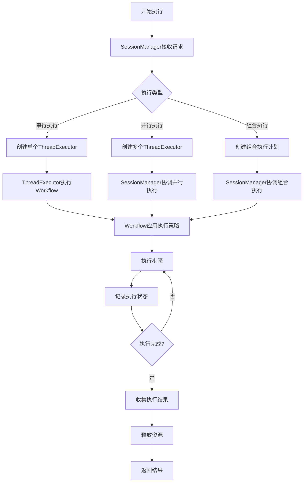

# 最终架构分析与设计方案

## 概述

本文档是对当前项目Workflow、Thread、Session关系的最终分析，基于深入的架构评估，提出了简化的设计方案。通过重新定义各组件的职责分工，实现一个更清晰、高效、可维护的架构。

## 当前架构问题总结

### 核心问题

1. **概念过多且职责重叠**：
   - Workflow、Thread、Session、Graph四个概念
   - Workflow和Graph存在抽象重叠
   - Thread和WorkflowOrchestrator职责重叠

2. **状态管理分散**：
   - Workflow管理业务状态
   - Thread管理执行状态
   - Session管理会话状态
   - 状态同步复杂且容易出错

3. **执行路径复杂**：
   - 多种执行模式并存
   - 协调逻辑分散在多个组件
   - 错误处理和恢复机制复杂

4. **扩展性受限**：
   - 新增功能需要修改多个组件
   - 组合工作流支持不完善
   - 并行执行能力有限

## 最终架构设计方案

### 设计原则

1. **简化优先**：减少概念数量，统一职责分工
2. **职责清晰**：每个组件有明确的单一职责
3. **执行高效**：优化执行路径，减少不必要开销
4. **扩展友好**：支持未来功能扩展和性能优化

### 核心组件重新定义

#### 1. Workflow（统一工作流）

**职责**：
- 工作流定义（结构+业务配置）
- 执行逻辑编排
- 错误处理策略

**设计**：
```typescript
export class Workflow extends AggregateRoot {
  // 结构定义
  private readonly nodes: Map<string, WorkflowNode>;
  private readonly edges: Map<string, WorkflowEdge>;
  
  // 业务配置
  private readonly config: WorkflowConfig;
  private readonly errorHandlingStrategy: ErrorHandlingStrategy;
  
  // 执行编排
  private readonly executionStrategy: ExecutionStrategy;
  
  /**
   * 执行工作流
   */
  public async execute(context: ExecutionContext): Promise<WorkflowResult> {
    // 1. 准备执行环境
    const executionContext = this.prepareExecutionContext(context);
    
    // 2. 执行编排策略
    return await this.executionStrategy.execute(
      this.nodes, 
      this.edges, 
      executionContext
    );
  }
  
  /**
   * 获取执行定义
   */
  public getExecutionDefinition(): ExecutionDefinition {
    return {
      structure: { nodes: this.nodes, edges: this.edges },
      business: {
        config: this.config,
        errorHandling: this.errorHandlingStrategy
      }
    };
  }
}
```

#### 2. ThreadExecutor（线程执行器）

**职责**：
- 单线程串行执行
- 执行上下文管理
- 执行状态跟踪
- 错误处理和恢复

**设计**：
```typescript
export class ThreadExecutor extends AggregateRoot {
  private readonly workflow: Workflow;
  private readonly executionContext: ExecutionContext;
  private readonly executionState: ThreadExecutionState;
  
  /**
   * 串行执行工作流
   */
  public async executeSequentially(inputData: unknown): Promise<ExecutionResult> {
    try {
      // 1. 初始化执行状态
      this.executionState.start();
      
      // 2. 获取执行步骤
      const steps = this.workflow.getExecutionSteps();
      
      // 3. 串行执行每个步骤
      for (const step of steps) {
        await this.executeStep(step);
        
        // 4. 检查执行条件
        if (this.shouldPause()) {
          await this.pauseExecution();
          break;
        }
      }
      
      // 5. 完成执行
      return this.executionState.complete();
    } catch (error) {
      return this.executionState.fail(error);
    }
  }
  
  /**
   * 执行单个步骤
   */
  private async executeStep(step: ExecutionStep): Promise<void> {
    const stepContext = this.executionContext.createStepContext(step);
    const result = await step.execute(stepContext);
    this.executionState.recordStepResult(step, result);
  }
}
```

#### 3. SessionManager（会话管理器）

**职责**：
- 多线程并行协调
- 线程生命周期管理
- 资源分配和调度
- 会话上下文管理

**设计**：
```typescript
export class SessionManager extends AggregateRoot {
  private readonly threadPool: ThreadPool;
  private readonly resourceScheduler: ResourceScheduler;
  private readonly executionCoordinator: ExecutionCoordinator;
  
  /**
   * 协调并行执行
   */
  public async coordinateParallelExecution(
    workflow: Workflow,
    executionPlan: ParallelExecutionPlan
  ): Promise<ExecutionResult> {
    // 1. 分配资源
    const resources = await this.resourceScheduler.allocate(executionPlan.getResourceRequirements());
    
    // 2. 创建执行线程
    const threads = await this.createExecutionThreads(workflow, executionPlan);
    
    // 3. 启动并行执行
    const results = await this.executionCoordinator.executeParallel(threads, resources);
    
    // 4. 合并执行结果
    return this.mergeExecutionResults(results);
  }
  
  /**
   * 管理线程生命周期
   */
  public async manageThreadLifecycle(threadId: ID, action: ThreadAction): Promise<void> {
    const thread = this.threadPool.getThread(threadId);
    
    switch (action) {
      case 'create':
        await this.createThread(thread);
        break;
      case 'destroy':
        await this.destroyThread(thread);
        break;
      case 'pause':
        await thread.pause();
        break;
      case 'resume':
        await thread.resume();
        break;
    }
  }
}
```

### 统一执行模型

#### 执行层次结构

```
SessionManager (会话层)
├── ThreadExecutor (执行层)
│   ├── Workflow (定义层)
│   │   ├── ExecutionStrategy (策略层)
│   │   └── ErrorHandlingStrategy (错误处理层)
│   └── ExecutionContext (上下文层)
└── ResourceScheduler (资源层)
```

#### 执行流程



## 关键设计决策

### 1. 合并Graph和Workflow

**决策**：将Graph和Workflow合并为Workflow

**理由**：
- 消除不必要的抽象层次
- 简化概念模型
- 提高操作效率
- 保证数据一致性

**实施**：
- 在Workflow中同时管理结构和业务配置
- 使用策略模式支持不同的执行模式
- 保持模块化设计便于未来扩展

### 2. Thread专注串行执行

**决策**：Thread专注于单线程串行执行

**理由**：
- 职责单一，易于理解和维护
- 避免并发复杂性
- 支持精确的执行控制
- 便于错误处理和调试

**实施**：
- ThreadExecutor负责串行执行流程
- SessionManager负责并行协调
- 使用Fork机制支持分支执行

### 3. Session作为协调中心

**决策**：Session作为多线程协调中心

**理由**：
- 统一的资源管理
- 全局的执行协调
- 一致的生命周期管理
- 简化并行编程模型

**实施**：
- SessionManager管理线程池
- 统一的资源调度策略
- 集中的状态监控

### 4. 策略模式支持扩展

**决策**：使用策略模式支持不同的执行模式

**理由**：
- 灵活的执行策略
- 易于添加新的执行模式
- 保持核心逻辑稳定
- 支持A/B测试

**实施**：
- ExecutionStrategy接口定义执行策略
- 具体策略实现不同的执行模式
- 运行时策略选择和切换

## 实施计划

### 第一阶段：基础重构（1-2个月）

**目标**：建立新的架构基础

**任务**：
1. 创建Workflow实体
2. 实现ThreadExecutor基础功能
3. 建立SessionManager框架
4. 创建迁移工具和适配器

**里程碑**：
- 新架构基础代码完成
- 基本功能验证通过
- 迁移工具可用

### 第二阶段：功能完善（2-3个月）

**目标**：完善核心功能

**任务**：
1. 实现完整的执行策略
2. 完善线程生命周期管理
3. 建立资源调度机制
4. 实现错误处理和恢复

**里程碑**：
- 核心功能完整
- 性能基准达标
- 稳定性验证通过

**里程碑**：
- 性能目标达成
- 监控体系完善
- 文档完整

### 第四阶段：清理收尾（1个月）

**目标**：完成架构迁移

**任务**：
1. 移除旧的架构代码
2. 清理冗余功能
3. 最终测试和验证
4. 经验总结和分享

**里程碑**：
- 旧代码完全移除
- 系统稳定运行
- 团队适应新架构

## 预期收益

### 短期收益（1-3个月）

1. **开发效率提升**：
   - 概念简化，学习成本降低
   - 操作统一，开发速度提升
   - 调试简化，问题定位更快

2. **代码质量改善**：
   - 职责清晰，代码更易理解
   - 结构简化，维护成本降低
   - 测试完善，质量更有保障

### 中期收益（3-6个月）

1. **性能优化**：
   - 执行路径优化，性能提升
   - 资源利用改善，吞吐量增加
   - 并发能力增强，响应时间缩短

2. **功能扩展**：
   - 组合工作流支持完善
   - 并行执行能力增强
   - 错误处理机制健全

## 结论

通过深入分析当前架构的问题，我们提出了一个简化、清晰、高效的架构设计方案。新架构通过合并Graph和Workflow、明确Thread的串行执行职责、强化Session的协调功能，实现了概念简化、职责清晰、执行高效的目标。

采用渐进式的实施策略，可以在保证系统稳定性的前提下，逐步完成架构迁移。预期新架构将显著提升开发效率、系统性能和可维护性，为项目的长期发展奠定坚实基础。

## 附录

### 相关文档

1. [Workflow与Thread关系架构分析](workflow-thread-relationship-analysis.md)
2. [组合工作流执行流程设计](composite-workflow-execution-design.md)
3. [线程生命周期管理](thread-lifecycle-management.md)
4. [Graph与Workflow抽象划分分析](graph-workflow-abstraction-analysis.md)

### 代码示例

详细的实现代码示例请参考各分析文档中的附件部分。

### 性能基准

新架构的性能目标和基准测试结果将在实施过程中持续更新。