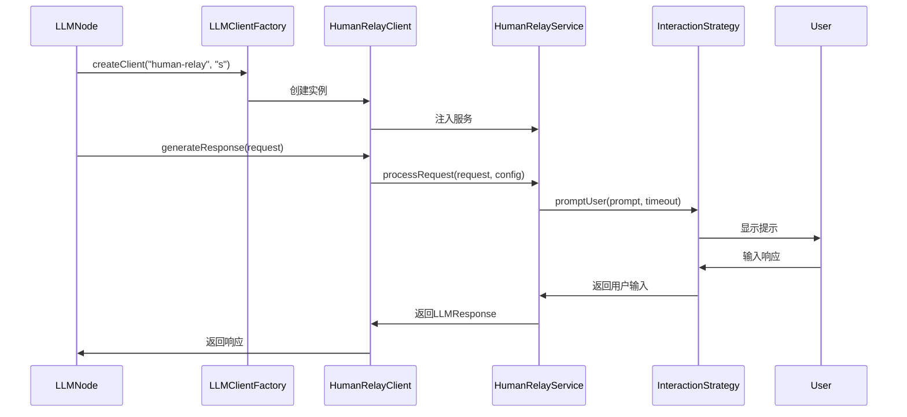

# HumanRelay架构重构设计文档

## 1. 问题分析

### 1.1 当前架构问题

**违反DDD分层原则**：
- `HumanRelayClient`位于`infrastructure/llm/clients/`，但包含了用户交互逻辑
- `TerminalInteraction`和`PromptRenderingService`也位于infrastructure层
- Infrastructure层应该只依赖domain层，不应包含应用逻辑

**职责混乱**：
- Infrastructure层承担了太多职责：LLM客户端实现 + 用户交互 + 提示渲染
- 违反单一职责原则

**扩展性差**：
- 用户交互方式硬编码为TerminalInteraction
- 难以支持Web界面、API等其他交互方式
- 配置文件中定义了多种前端类型（tui、web、api），但代码中未实现

### 1.2 配置文件与代码不匹配

配置文件`configs/llms/provider/human_relay/common.toml`定义了：
```toml
[frontend]
type = "tui"                       # tui, web, api
fallback_order = ["tui", "web", "api"]

[frontend.web]
port = 8080
path = "/human-relay"

[frontend.api]
endpoint = "/api/human-relay"
```

但代码中只实现了TerminalInteraction，没有Web和API的实现。

## 2. 架构设计

### 2.1 分层架构重构

遵循项目的DDD架构原则：

```
┌─────────────────────────────────────────────────────────┐
│                    Interface Layer                       │
│  ┌──────────────┐  ┌──────────────┐  ┌──────────────┐  │
│  │ HTTP Adapter │  │ WebSocket    │  │ Terminal     │  │
│  │ (Web交互)    │  │ Adapter      │  │ Adapter      │  │
│  └──────────────┘  └──────────────┘  └──────────────┘  │
└─────────────────────────────────────────────────────────┘
                            ↓
┌─────────────────────────────────────────────────────────┐
│                   Application Layer                      │
│  ┌──────────────────────────────────────────────────┐  │
│  │         HumanRelayService                        │  │
│  │  - 业务逻辑编排                                   │  │
│  │  - 用户交互策略管理                               │  │
│  │  - 提示渲染服务                                   │  │
│  │  - 历史记录管理                                   │  │
│  └──────────────────────────────────────────────────┘  │
│  ┌──────────────┐  ┌──────────────┐  ┌──────────────┐  │
│  │ Interaction  │  │ Prompt       │  │ History      │  │
│  │ Strategy     │  │ Rendering    │  │ Manager      │  │
│  │ Interface    │  │ Service      │  │              │  │
│  └──────────────┘  └──────────────┘  └──────────────┘  │
└─────────────────────────────────────────────────────────┘
                            ↓
┌─────────────────────────────────────────────────────────┐
│                  Infrastructure Layer                    │
│  ┌──────────────────────────────────────────────────┐  │
│  │         HumanRelayClient                         │  │
│  │  - 实现BaseLLMClient接口                         │  │
│  │  - 调用HumanRelayService                         │  │
│  │  - 不包含具体交互逻辑                             │  │
│  └──────────────────────────────────────────────────┘  │
└─────────────────────────────────────────────────────────┘
                            ↓
┌─────────────────────────────────────────────────────────┐
│                      Domain Layer                        │
│  - HumanRelayMode (值对象)                              │
│  - HumanRelayClient接口（可选）                         │
│  - LLMRequest, LLMResponse (实体)                       │
└─────────────────────────────────────────────────────────┘
```

### 2.2 依赖关系

```
Interface Layer
    ↓ depends on
Application Layer
    ↓ depends on
Domain Layer

Infrastructure Layer
    ↓ depends on
Domain Layer
```

**关键点**：
- Infrastructure层不依赖Application层
- HumanRelayClient通过依赖注入获取HumanRelayService
- 或者使用事件/消息机制进行解耦

## 3. 详细设计

### 3.1 Domain层

保持现有设计，无需修改：

```typescript
// src/domain/llm/value-objects/human-relay-mode.ts
export enum HumanRelayMode {
  SINGLE = 'single',
  MULTI = 'multi'
}
```

### 3.2 Application层

#### 3.2.1 HumanRelayService

**职责**：
- HumanRelay业务逻辑编排
- 管理用户交互策略
- 协调提示渲染和历史记录管理

```typescript
// src/application/llm/services/human-relay-service.ts
export interface IHumanRelayService {
  /**
   * 处理HumanRelay请求
   */
  processRequest(request: LLMRequest, config: HumanRelayConfig): Promise<LLMResponse>;

  /**
   * 设置交互策略
   */
  setInteractionStrategy(strategy: IInteractionStrategy): void;

  /**
   * 获取当前交互策略
   */
  getInteractionStrategy(): IInteractionStrategy;
}

@injectable()
export class HumanRelayService implements IHumanRelayService {
  constructor(
    @inject('IInteractionStrategy')
    private interactionStrategy: IInteractionStrategy,
    @inject('IPromptRenderingService')
    private promptRenderingService: IPromptRenderingService,
    @inject('IHistoryManager')
    private historyManager: IHistoryManager
  ) {}

  async processRequest(request: LLMRequest, config: HumanRelayConfig): Promise<LLMResponse> {
    // 1. 构建提示
    const prompt = await this.promptRenderingService.buildPrompt(request, config);

    // 2. 通过交互策略获取用户输入
    const userInput = await this.interactionStrategy.promptUser(prompt, config.timeout);

    // 3. 更新历史记录
    await this.historyManager.updateHistory(request, userInput, prompt);

    // 4. 构建响应
    return this.buildResponse(userInput, request);
  }

  setInteractionStrategy(strategy: IInteractionStrategy): void {
    this.interactionStrategy = strategy;
  }

  getInteractionStrategy(): IInteractionStrategy {
    return this.interactionStrategy;
  }

  private async buildResponse(userInput: string, request: LLMRequest): Promise<LLMResponse> {
    // 构建LLMResponse
  }
}
```

#### 3.2.2 交互策略接口

```typescript
// src/application/llm/strategies/interaction-strategy.interface.ts
export interface IInteractionStrategy {
  /**
   * 提示用户并获取输入
   */
  promptUser(prompt: string, timeout: number): Promise<string>;

  /**
   * 关闭交互
   */
  close(): Promise<void>;

  /**
   * 获取策略类型
   */
  getType(): InteractionType;
}

export enum InteractionType {
  TERMINAL = 'terminal',
  WEB = 'web',
  API = 'api'
}
```

#### 3.2.3 具体交互策略实现

**TerminalInteraction**：
```typescript
// src/application/llm/strategies/terminal-interaction.strategy.ts
@injectable()
export class TerminalInteraction implements IInteractionStrategy {
  private readlineInterface: any;

  async promptUser(prompt: string, timeout: number): Promise<string> {
    // 使用readline实现终端交互
  }

  async close(): Promise<void> {
    // 关闭readline接口
  }

  getType(): InteractionType {
    return InteractionType.TERMINAL;
  }
}
```

**WebInteraction**（新增）：
```typescript
// src/application/llm/strategies/web-interaction.strategy.ts
@injectable()
export class WebInteraction implements IInteractionStrategy {
  private wsServer: any;

  constructor(
    @inject('WebSocketServer')
    wsServer: any
  ) {
    this.wsServer = wsServer;
  }

  async promptUser(prompt: string, timeout: number): Promise<string> {
    // 通过WebSocket等待Web客户端响应
    return new Promise((resolve, reject) => {
      const timer = setTimeout(() => {
        reject(new Error('Timeout'));
      }, timeout);

      this.wsServer.once('user-response', (response: string) => {
        clearTimeout(timer);
        resolve(response);
      });

      this.wsServer.emit('prompt', prompt);
    });
  }

  async close(): Promise<void> {
    // 关闭WebSocket连接
  }

  getType(): InteractionType {
    return InteractionType.WEB;
  }
}
```

**APIInteraction**（新增）：
```typescript
// src/application/llm/strategies/api-interaction.strategy.ts
@injectable()
export class APIInteraction implements IInteractionStrategy {
  private pendingRequests: Map<string, { resolve: Function; reject: Function }> = new Map();

  async promptUser(prompt: string, timeout: number): Promise<string> {
    const requestId = ID.generate().value;

    return new Promise((resolve, reject) => {
      const timer = setTimeout(() => {
        this.pendingRequests.delete(requestId);
        reject(new Error('Timeout'));
      }, timeout);

      this.pendingRequests.set(requestId, { resolve, reject });

      // 存储prompt，等待API调用
      // 实际实现需要配合HTTP接口
    });
  }

  handleResponse(requestId: string, response: string): void {
    const pending = this.pendingRequests.get(requestId);
    if (pending) {
      pending.resolve(response);
      this.pendingRequests.delete(requestId);
    }
  }

  async close(): Promise<void> {
    // 清理所有pending请求
  }

  getType(): InteractionType {
    return InteractionType.API;
  }
}
```

#### 3.2.4 提示渲染服务

```typescript
// src/application/llm/services/prompt-rendering-service.ts
export interface IPromptRenderingService {
  buildPrompt(request: LLMRequest, config: HumanRelayConfig): Promise<string>;
}

@injectable()
export class PromptRenderingService implements IPromptRenderingService {
  async buildPrompt(request: LLMRequest, config: HumanRelayConfig): Promise<string> {
    // 根据配置渲染提示
    const template = config.mode === HumanRelayMode.SINGLE
      ? config.templates.single
      : config.templates.multi;

    // 替换模板变量
    return this.renderTemplate(template, request, config);
  }

  private renderTemplate(template: string, request: LLMRequest, config: HumanRelayConfig): string {
    // 模板渲染逻辑
  }
}
```

#### 3.2.5 历史记录管理

```typescript
// src/application/llm/services/history-manager.service.ts
export interface IHistoryManager {
  updateHistory(request: LLMRequest, response: string, prompt: string): Promise<void>;
  getHistory(sessionId: string): Promise<HistoryEntry[]>;
}

@injectable()
export class HistoryManager implements IHistoryManager {
  private history: Map<string, HistoryEntry[]> = new Map();

  async updateHistory(request: LLMRequest, response: string, prompt: string): Promise<void> {
    // 更新历史记录
  }

  async getHistory(sessionId: string): Promise<HistoryEntry[]> {
    return this.history.get(sessionId) || [];
  }
}
```

### 3.3 Infrastructure层

#### 3.3.1 HumanRelayClient（简化版）

```typescript
// src/infrastructure/llm/clients/human-relay-client.ts
@injectable()
export class HumanRelayClient extends BaseLLMClient {
  constructor(
    @inject(LLM_DI_IDENTIFIERS.HttpClient)
    protected override httpClient: any,
    @inject(LLM_DI_IDENTIFIERS.TokenBucketLimiter)
    protected override rateLimiter: any,
    @inject(LLM_DI_IDENTIFIERS.TokenCalculator)
    protected override tokenCalculator: any,
    @inject(LLM_DI_IDENTIFIERS.ConfigLoadingModule)
    protected override configLoadingModule: ConfigLoadingModule,
    @inject('IHumanRelayService')
    private humanRelayService: IHumanRelayService,
    clientConfig: HumanRelayClientConfig
  ) {
    super(httpClient, rateLimiter, tokenCalculator, configLoadingModule, baseConfig);
  }

  public override async generateResponse(request: LLMRequest): Promise<LLMResponse> {
    // 加载配置
    const config = await this.loadConfig();

    // 委托给应用层服务
    return await this.humanRelayService.processRequest(request, config);
  }

  private async loadConfig(): Promise<HumanRelayConfig> {
    // 从配置文件加载配置
  }
}
```

### 3.4 Interface层

#### 3.4.1 HTTP Adapter（Web交互）

```typescript
// src/interfaces/http/human-relay/controllers/human-relay.controller.ts
@injectable()
export class HumanRelayController {
  constructor(
    @inject('IHumanRelayService')
    private humanRelayService: IHumanRelayService
  ) {}

  @Post('/prompt')
  async handlePrompt(@Body() dto: PromptDto): Promise<ResponseDto> {
    // 处理HTTP请求
  }

  @Post('/response/:requestId')
  async handleResponse(@Param('requestId') requestId: string, @Body() dto: ResponseDto): Promise<void> {
    // 处理用户响应
  }
}
```

#### 3.4.2 WebSocket Adapter

```typescript
// src/interfaces/websocket/human-relay/human-relay-socket.adapter.ts
@injectable()
export class HumanRelaySocketAdapter {
  constructor(
    @inject('IHumanRelayService')
    private humanRelayService: IHumanRelayService
  ) {}

  handleConnection(socket: any): void {
    socket.on('user-response', (data: any) => {
      // 处理WebSocket响应
    });
  }
}
```

## 4. 配置驱动实现

### 4.1 配置文件解析

```typescript
// src/application/llm/config/human-relay-config-loader.ts
@injectable()
export class HumanRelayConfigLoader {
  constructor(
    @inject('ConfigLoadingModule')
    private configLoadingModule: ConfigLoadingModule
  ) {}

  async loadConfig(model: string): Promise<HumanRelayConfig> {
    // 从configs/llms/provider/human_relay/加载配置
    const commonConfig = await this.configLoadingModule.load('llms/provider/human_relay/common.toml');
    const modelConfig = await this.configLoadingModule.load(`llms/provider/human_relay/${model}.toml`);

    // 合并配置
    return this.mergeConfigs(commonConfig, modelConfig);
  }

  private mergeConfigs(common: any, model: any): HumanRelayConfig {
    // 配置合并逻辑
  }
}
```

### 4.2 交互策略工厂

```typescript
// src/application/llm/factories/interaction-strategy.factory.ts
@injectable()
export class InteractionStrategyFactory {
  constructor(
    @inject('TerminalInteraction')
    private terminalInteraction: TerminalInteraction,
    @inject('WebInteraction')
    private webInteraction: WebInteraction,
    @inject('APIInteraction')
    private apiInteraction: APIInteraction
  ) {}

  createStrategy(type: InteractionType): IInteractionStrategy {
    switch (type) {
      case InteractionType.TERMINAL:
        return this.terminalInteraction;
      case InteractionType.WEB:
        return this.webInteraction;
      case InteractionType.API:
        return this.apiInteraction;
      default:
        throw new Error(`Unsupported interaction type: ${type}`);
    }
  }
}
```

## 5. 依赖注入配置

### 5.1 Application层绑定

```typescript
// src/application/container/bindings/application-llm-bindings.ts
export function registerApplicationLLMBindings(container: Container): void {
  // HumanRelay服务
  container.bind<IHumanRelayService>('IHumanRelayService')
    .to(HumanRelayService)
    .inSingletonScope();

  // 交互策略
  container.bind<IInteractionStrategy>('TerminalInteraction')
    .to(TerminalInteraction)
    .inSingletonScope();

  container.bind<IInteractionStrategy>('WebInteraction')
    .to(WebInteraction)
    .inSingletonScope();

  container.bind<IInteractionStrategy>('APIInteraction')
    .to(APIInteraction)
    .inSingletonScope();

  // 提示渲染服务
  container.bind<IPromptRenderingService>('IPromptRenderingService')
    .to(PromptRenderingService)
    .inSingletonScope();

  // 历史记录管理
  container.bind<IHistoryManager>('IHistoryManager')
    .to(HistoryManager)
    .inSingletonScope();

  // 策略工厂
  container.bind<InteractionStrategyFactory>('InteractionStrategyFactory')
    .to(InteractionStrategyFactory)
    .inSingletonScope();
}
```

### 5.2 Infrastructure层绑定

```typescript
// src/infrastructure/container/bindings/infrastructure-llm-bindings.ts
export function registerInfrastructureLLMBindings(container: Container): void {
  // HumanRelay客户端
  container.bind<HumanRelayClient>(LLM_DI_IDENTIFIERS.HumanRelayClient)
    .to(HumanRelayClient)
    .inSingletonScope();
}
```

## 6. LLM Node集成

### 6.1 配置文件示例

```toml
# workflow配置示例
[[nodes]]
id = "llm-node"
type = "llm"
name = "LLM节点"

[nodes.config]
model = "human-relay:s"
provider = "human-relay"
prompt = "请分析以下内容：{{input.text}}"

[nodes.config.human_relay]
mode = "single"
frontend_type = "web"
timeout = 600
```

### 6.2 客户端创建流程



## 7. 迁移计划

### 7.1 阶段一：创建Application层结构
- [ ] 创建HumanRelayService接口和实现
- [ ] 创建IInteractionStrategy接口
- [ ] 创建TerminalInteraction实现
- [ ] 创建PromptRenderingService
- [ ] 创建HistoryManager
- [ ] 配置依赖注入

### 7.2 阶段二：重构Infrastructure层
- [ ] 简化HumanRelayClient，移除交互逻辑
- [ ] 通过依赖注入获取HumanRelayService
- [ ] 更新LLMClientFactory

### 7.3 阶段三：实现Interface层
- [ ] 创建HTTP Adapter
- [ ] 创建WebSocket Adapter
- [ ] 实现WebInteraction策略
- [ ] 实现APIInteraction策略

### 7.4 阶段四：配置驱动
- [ ] 创建HumanRelayConfigLoader
- [ ] 创建InteractionStrategyFactory
- [ ] 更新配置文件解析逻辑

### 7.5 阶段五：测试和文档
- [ ] 编写单元测试
- [ ] 编写集成测试
- [ ] 更新文档

## 8. 优势总结

### 8.1 符合DDD原则
- **分层清晰**：每层职责明确，依赖关系正确
- **单一职责**：每个类只负责一个功能
- **依赖倒置**：Infrastructure层不依赖Application层

### 8.2 可扩展性强
- **策略模式**：易于添加新的交互方式
- **配置驱动**：通过配置文件切换交互方式
- **接口抽象**：便于替换实现

### 8.3 可测试性好
- **依赖注入**：便于mock和测试
- **职责分离**：每个组件可独立测试
- **接口抽象**：便于创建测试实现

### 8.4 配置与代码一致
- 配置文件中定义的所有前端类型都有对应实现
- 支持运行时切换交互方式
- 支持多种交互方式并存

## 9. 风险和注意事项

### 9.1 依赖注入复杂性
- Infrastructure层依赖Application层服务需要特殊处理
- 可能需要使用事件总线或消息队列进行解耦

### 9.2 性能考虑
- WebSocket连接管理
- 历史记录存储和查询性能
- 并发请求处理

### 9.3 向后兼容
- 需要确保现有工作流配置仍然可用
- 需要提供迁移指南

## 10. 结论

本重构方案遵循DDD架构原则，将HumanRelay的用户交互逻辑从Infrastructure层移到Application层和Interface层，实现了：

1. **分层清晰**：每层职责明确，依赖关系正确
2. **可扩展性强**：支持多种交互方式，易于添加新功能
3. **配置驱动**：通过配置文件控制行为
4. **符合项目架构**：与现有的DDD架构保持一致

建议按照迁移计划逐步实施，确保每个阶段都经过充分测试。