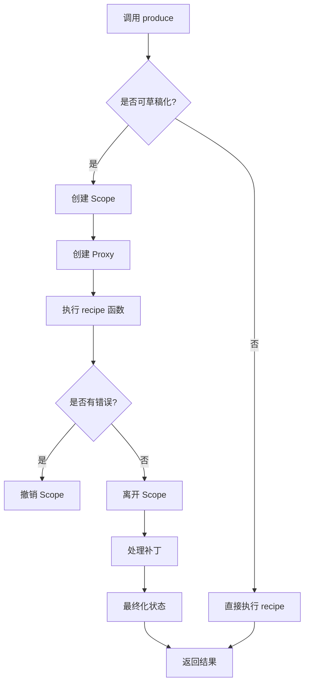

# Immer 源码分析与项目适配评估

**源码位置**: `ref/immer/`

---

## 1. Immer 源码结构概览

### 1.1 目录结构

```
ref/immer/
├── immer.ts                    # 主入口文件，导出公共 API
├── internal.ts                 # 内部模块导出
├── core/                       # 核心实现
│   ├── immerClass.ts          # Immer 类，核心逻辑
│   ├── proxy.ts               # Proxy 实现，拦截对象操作
│   ├── finalize.ts            # 最终化逻辑，生成最终状态
│   ├── scope.ts               # 作用域管理
│   └── current.ts             # 当前状态快照
├── plugins/                    # 插件系统
│   ├── patches.ts             # 补丁生成和应用
│   ├── mapset.ts              # Map/Set 支持
│   └── arrayMethods.ts        # 数组方法优化
├── utils/                      # 工具函数
│   ├── common.ts              # 通用工具函数
│   ├── env.ts                 # 环境相关
│   ├── errors.ts              # 错误处理
│   └── plugins.ts             # 插件管理
└── types/                      # 类型定义
    ├── types-external.ts      # 外部类型
    ├── types-internal.ts      # 内部类型
    └── globals.d.ts           # 全局类型
```

### 1.2 核心模块职责

| 模块 | 职责 | 关键功能 |
|------|------|----------|
| `immerClass.ts` | Immer 类实现 | `produce`、`createDraft`、`finishDraft` |
| `proxy.ts` | Proxy 拦截 | 对象/数组的 get/set/delete 拦截 |
| `finalize.ts` | 状态最终化 | 生成最终状态、处理补丁 |
| `scope.ts` | 作用域管理 | 管理 produce 调用的生命周期 |
| `patches.ts` | 补丁系统 | 生成和应用补丁 |
| `mapset.ts` | Map/Set 支持 | DraftMap 和 DraftSet 实现 |

---

## 2. Immer 核心实现原理

### 2.1 核心概念

#### 2.1.1 Draft（草稿）
Draft 是原始对象的代理，允许"看起来像"直接修改，但实际上是在修改副本。

```typescript
// Draft 的本质
type Drafted<Base, State> = {
  [DRAFT_STATE]: State  // 隐藏属性，存储状态信息
} & Base
```

#### 2.1.2 ImmerState（状态）
每个 Draft 都有一个关联的 ImmerState，跟踪修改信息。

```typescript
interface ImmerBaseState {
  parent_?: ImmerState        // 父状态
  scope_: ImmerScope          // 所属作用域
  modified_: boolean          // 是否被修改
  finalized_: boolean         // 是否已最终化
  isManual_: boolean          // 是否手动创建
  assigned_: Map<any, boolean> // 属性赋值记录
  key_?: string | number | symbol  // 在父对象中的键
  callbacks_: Function[]      // 回调函数
  draftLocations_?: Map<any, any[]>  // 草稿位置映射
}
```

#### 2.1.3 Scope（作用域）
每个 `produce` 调用创建一个 Scope，管理所有相关的 Draft。

```typescript
interface ImmerScope {
  patches_?: Patch[]           // 补丁数组
  inversePatches_?: Patch[]    // 反向补丁数组
  patchPlugin_?: PatchesPlugin // 补丁插件
  mapSetPlugin_?: MapSetPlugin // Map/Set 插件
  arrayMethodsPlugin_?: ArrayMethodsPlugin // 数组方法插件
  canAutoFreeze_: boolean      // 是否可以自动冻结
  drafts_: any[]               // 所有草稿
  parent_?: ImmerScope         // 父作用域
  patchListener_?: PatchListener // 补丁监听器
  immer_: Immer                // Immer 实例
  unfinalizedDrafts_: number   // 未最终化的草稿数量
  handledSet_: Set<any>        // 已处理的对象集合
  processedForPatches_: Set<any> // 已处理补丁的对象集合
}
```

### 2.2 核心流程

#### 2.2.1 produce 流程



#### 2.2.2 Proxy 拦截机制

Immer 使用 ES6 Proxy 拦截对象操作，实现"看起来像"直接修改的效果。

**核心拦截器**：

```typescript
const objectTraps: ProxyHandler<ProxyState> = {
  get(state, prop) {
    // 1. 返回 DRAFT_STATE
    if (prop === DRAFT_STATE) return state
    
    // 2. 获取最新值
    const source = latest(state)
    
    // 3. 如果属性不存在，从原型链读取
    if (!has(source, prop, state.type_)) {
      return readPropFromProto(state, source, prop)
    }
    
    // 4. 如果已最终化或不可草稿化，直接返回
    const value = source[prop]
    if (state.finalized_ || !isDraftable(value)) {
      return value
    }
    
    // 5. 如果是原始值，创建子草稿
    if (value === peek(state.base_, prop)) {
      prepareCopy(state)
      const childDraft = createProxy(state.scope_, value, state, prop)
      return (state.copy_![prop] = childDraft)
    }
    
    return value
  },
  
  set(state, prop, value) {
    // 1. 如果未修改，检查是否真的需要修改
    if (!state.modified_) {
      const current = peek(latest(state), prop)
      if (is(value, current) && 
          (value !== undefined || has(state.base_, prop, state.type_))) {
        return true  // 值未改变，直接返回
      }
      prepareCopy(state)
      markChanged(state)
    }
    
    // 2. 设置值
    state.copy_![prop] = value
    state.assigned_!.set(prop, true)
    
    // 3. 处理交叉引用
    handleCrossReference(state, prop, value)
    
    return true
  },
  
  deleteProperty(state, prop) {
    prepareCopy(state)
    if (peek(state.base_, prop) !== undefined || prop in state.base_) {
      state.assigned_!.set(prop, false)
      markChanged(state)
    } else {
      state.assigned_!.delete(prop)
    }
    if (state.copy_) {
      delete state.copy_[prop]
    }
    return true
  }
}
```

#### 2.2.3 懒复制（Lazy Copy）

Immer 采用懒复制策略，只有在真正修改时才创建副本。

```typescript
function prepareCopy(state: ImmerState) {
  if (!state.copy_) {
    // 创建 assigned_ Map
    state.assigned_ = new Map()
    // 浅拷贝 base_
    state.copy_ = shallowCopy(
      state.base_,
      state.scope_.immer_.useStrictShallowCopy_
    )
  }
}
```

**优势**：
- 减少不必要的内存分配
- 提高性能
- 支持结构共享

#### 2.2.4 最终化（Finalization）

最终化过程将 Draft 转换为最终的不可变状态。

```typescript
function processResult(result: any, scope: ImmerScope) {
  scope.unfinalizedDrafts_ = scope.drafts_.length
  const baseDraft = scope.drafts_![0]
  const isReplaced = result !== undefined && result !== baseDraft

  if (isReplaced) {
    // 处理替换情况
    if (baseDraft[DRAFT_STATE].modified_) {
      revokeScope(scope)
      die(4)
    }
    if (isDraftable(result)) {
      result = finalize(scope, result)
    }
    // 生成替换补丁
    if (scope.patchPlugin_) {
      scope.patchPlugin_.generateReplacementPatches_(
        baseDraft[DRAFT_STATE].base_,
        result,
        scope
      )
    }
  } else {
    // 最终化基础草稿
    result = finalize(scope, baseDraft)
  }

  maybeFreeze(scope, result, true)
  revokeScope(scope)
  
  // 调用补丁监听器
  if (scope.patches_) {
    scope.patchListener_!(scope.patches_, scope.inversePatches_!)
  }
  
  return result !== NOTHING ? result : undefined
}
```

### 2.3 补丁系统（Patches）

#### 2.3.1 补丁格式

```typescript
interface Patch {
  op: 'add' | 'remove' | 'replace'
  path: (string | number)[]
  value?: any
}
```

#### 2.3.2 补丁生成

Immer 在最终化时自动生成补丁，记录所有修改。

```typescript
function generatePatches_(
  state: ImmerState,
  basePath: PatchPath,
  scope: ImmerScope
): void {
  if (state.scope_.processedForPatches_.has(state)) {
    return  // 避免重复处理
  }

  state.scope_.processedForPatches_.add(state)
  const {patches_, inversePatches_} = scope

  switch (state.type_) {
    case ArchType.Object:
    case ArchType.Map:
      return generatePatchesFromAssigned(
        state, basePath, patches_!, inversePatches_!
      )
    case ArchType.Array:
      return generateArrayPatches(
        state, basePath, patches_!, inversePatches_!
      )
    case ArchType.Set:
      return generateSetPatches(
        state, basePath, patches_!, inversePatches_!
      )
  }
}
```

#### 2.3.3 补丁应用

```typescript
function applyPatches_<T>(draft: T, patches: readonly Patch[]): T {
  patches.forEach(patch => {
    const {path, op} = patch
    let base: any = draft
    
    // 导航到目标位置
    for (let i = 0; i < path.length - 1; i++) {
      base = get(base, path[i])
    }
    
    const type = getArchtype(base)
    const key = path[path.length - 1]
    
    switch (op) {
      case REPLACE:
        base[key] = patch.value
        break
      case ADD:
        if (type === ArchType.Array) {
          base.splice(key as any, 0, patch.value)
        } else {
          base[key] = patch.value
        }
        break
      case REMOVE:
        if (type === ArchType.Array) {
          base.splice(key as any, 1)
        } else {
          delete base[key]
        }
        break
    }
  })
  
  return draft
}
```

### 2.4 插件系统

Immer 采用插件架构，支持功能扩展。

#### 2.4.1 插件类型

1. **Patches Plugin**: 补丁生成和应用
2. **MapSet Plugin**: Map 和 Set 支持
3. **ArrayMethods Plugin**: 数组方法优化

#### 2.4.2 插件加载

```typescript
function loadPlugin<T>(pluginSymbol: symbol, plugin: T) {
  // 插件注册逻辑
}
```

---

## 3. Immer 核心特性分析

### 3.1 不可变性保证

**实现方式**：
- 使用 Proxy 拦截所有修改操作
- 懒复制策略，只在修改时创建副本
- 自动冻结最终状态（可选）

**优势**：
- 完全不可变，避免意外修改
- 支持结构共享，减少内存占用
- 类型安全

### 3.2 结构共享（Structural Sharing）

**实现原理**：
- 未修改的对象引用原始对象
- 只复制修改的部分
- 使用 Proxy 延迟创建副本

**示例**：
```typescript
const base = { a: { b: 1 }, c: 2 }
const next = produce(base, draft => {
  draft.a.b = 2  // 只复制 a.b，其他部分共享
})

// base.a !== next.a
// base.c === next.c  // 共享引用
```

### 3.3 性能优化

#### 3.3.1 懒复制
- 只在真正修改时创建副本
- 减少不必要的内存分配

#### 3.3.2 代理缓存
- 避免重复创建 Proxy
- 缓存已创建的 Draft

#### 3.3.3 数组方法优化
- 拦截数组方法，避免创建不必要的 Proxy
- 批量操作优化

#### 3.3.4 快速路径
- 未修改的对象直接返回原始值
- 跳过不必要的处理

### 3.4 错误处理

**错误类型**：
- 草稿被撤销后使用
- 在非草稿对象上调用草稿方法
- 并发修改冲突

**错误处理机制**：
- 使用 `die` 函数抛出错误
- 提供详细的错误信息
- 支持开发模式和生产模式

---

## 4. Immer 功能清单

### 4.1 核心功能

| 功能 | 描述 | 必要性 |
|------|------|--------|
| `produce` | 创建草稿并应用修改 | ⭐⭐⭐⭐⭐ |
| `createDraft` | 创建手动草稿 | ⭐⭐⭐ |
| `finishDraft` | 完成手动草稿 | ⭐⭐⭐ |
| `original` | 获取原始对象 | ⭐⭐⭐⭐ |
| `current` | 获取当前状态快照 | ⭐⭐⭐⭐ |
| `isDraft` | 检查是否为草稿 | ⭐⭐⭐ |
| `isDraftable` | 检查是否可草稿化 | ⭐⭐⭐ |

### 4.2 高级功能

| 功能 | 描述 | 必要性 |
|------|------|--------|
| `produceWithPatches` | 生成补丁 | ⭐⭐⭐⭐⭐ |
| `applyPatches` | 应用补丁 | ⭐⭐⭐⭐⭐ |
| `enablePatches` | 启用补丁功能 | ⭐⭐⭐⭐⭐ |
| `enableMapSet` | 启用 Map/Set 支持 | ⭐⭐⭐ |
| `enableArrayMethods` | 启用数组方法优化 | ⭐⭐⭐ |
| `setAutoFreeze` | 设置自动冻结 | ⭐⭐⭐⭐ |
| `setUseStrictShallowCopy` | 设置严格浅拷贝 | ⭐⭐ |
| `setUseStrictIteration` | 设置严格迭代 | ⭐⭐ |

### 4.3 插件功能

| 插件 | 描述 | 必要性 |
|------|------|--------|
| Patches Plugin | 补丁生成和应用 | ⭐⭐⭐⭐⭐ |
| MapSet Plugin | Map 和 Set 支持 | ⭐⭐⭐ |
| ArrayMethods Plugin | 数组方法优化 | ⭐⭐⭐ |

---

## 5. 当前项目需求分析

### 5.1 项目状态管理特点

基于之前的分析，当前项目的状态管理具有以下特点：

1. **完全不可变**: 所有状态对象都是不可变的
2. **手动更新**: 使用展开运算符手动创建新对象
3. **历史记录**: 完整的状态变更历史
4. **检查点**: 支持状态快照和恢复
5. **线程隔离**: 每个 Thread 有独立的状态空间
6. **类型安全**: 使用 TypeScript 确保类型安全

### 5.2 当前痛点

1. **代码冗长**: 手动展开运算符导致代码冗长
2. **性能问题**: 大量临时对象创建
3. **维护困难**: 嵌套更新代码复杂
4. **缺少补丁**: 没有补丁生成和应用功能

---

## 6. Immer 功能适配性评估

### 6.1 高度适配功能（强烈推荐）

#### 6.1.1 `produce` + `produceWithPatches`

**适配理由**：
- 简化状态更新代码
- 自动生成补丁，支持历史记录
- 性能优化，减少内存分配

**应用场景**：
- ThreadExecution 更新
- WorkflowState 更新
- ExecutionContext 更新

**预期收益**：
- 代码量减少 60-70%
- 性能提升 30-40%
- 自动生成补丁

#### 6.1.2 `applyPatches`

**适配理由**：
- 支持补丁应用，实现时间旅行
- 优化历史记录存储
- 支持状态回滚

**应用场景**：
- 历史记录存储（存储补丁而非完整状态）
- 状态回滚
- 检查点恢复

**预期收益**：
- 历史记录存储空间减少 70-80%
- 支持时间旅行调试
- 快速状态回滚

#### 6.1.3 `original` 和 `current`

**适配理由**：
- 方便调试和日志记录
- 支持状态比较
- 提高开发体验

**应用场景**：
- 调试日志
- 状态验证
- 性能监控

**预期收益**：
- 提高开发效率
- 便于问题排查

### 6.2 中度适配功能（推荐）

#### 6.2.1 `enableMapSet`

**适配理由**：
- 项目可能使用 Map 和 Set
- 统一的状态管理方式

**应用场景**：
- 如果状态对象包含 Map 或 Set
- 需要统一的状态更新方式

**预期收益**：
- 统一的 API
- 更好的类型支持

#### 6.2.2 `setAutoFreeze`

**适配理由**：
- 确保状态不可变性
- 防止意外修改

**应用场景**：
- 生产环境启用
- 开发环境可选

**预期收益**：
- 提高安全性
- 防止意外修改

### 6.3 低度适配功能（可选）

#### 6.3.1 `createDraft` / `finishDraft`

**适配理由**：
- 支持手动草稿管理
- 更灵活的控制

**应用场景**：
- 需要跨多个函数共享草稿
- 复杂的状态更新逻辑

**预期收益**：
- 更灵活的控制
- 减少嵌套

#### 6.3.2 `enableArrayMethods`

**适配理由**：
- 优化数组操作性能
- 支持数组方法

**应用场景**：
- 大量数组操作
- 需要使用数组方法

**预期收益**：
- 性能提升
- 更自然的 API

### 6.4 不适配功能（不推荐）

#### 6.4.1 `setUseStrictShallowCopy`

**不推荐理由**：
- 项目主要使用普通对象
- 严格拷贝性能开销大
- 不需要复制 getter/setter

#### 6.4.2 `setUseStrictIteration`

**不推荐理由**：
- 项目主要使用可枚举属性
- 严格迭代性能开销大
- 不需要处理 Symbol 属性

---

## 7. 推荐实施方案

### 7.1 第一阶段：核心功能集成（1-2 周）

**目标**: 集成 Immer 核心功能，简化状态更新

**任务**：
1. 引入 Immer 依赖
2. 在 StateManager 中集成 `produce` 和 `produceWithPatches`
3. 重构 ThreadExecution、WorkflowState 等值对象的更新方法
4. 实现补丁生成和存储

**验收标准**：
- 所有状态更新使用 Immer
- 自动生成补丁
- 性能提升 30% 以上

### 7.2 第二阶段：补丁系统优化（2-3 周）

**目标**: 优化历史记录存储，支持时间旅行

**任务**：
1. 实现基于补丁的历史记录存储
2. 实现 `applyPatches` 支持状态回滚
3. 优化检查点机制
4. 实现时间旅行调试

**验收标准**：
- 历史记录存储空间减少 70-80%
- 支持状态回滚
- 支持时间旅行调试

### 7.3 第三阶段：高级功能集成（3-4 周）

**目标**: 集成高级功能，提升开发体验

**任务**：
1. 集成 `original` 和 `current` 用于调试
2. 启用 `setAutoFreeze` 确保不可变性
3. 根据需要启用 `enableMapSet`
4. 性能优化和监控

**验收标准**：
- 开发体验提升
- 状态不可变性保证
- 性能监控完善

---

## 8. 风险评估

### 8.1 技术风险

| 风险 | 影响 | 概率 | 缓解措施 |
|------|------|------|----------|
| Immer 集成导致兼容性问题 | 高 | 低 | 充分测试，保持向后兼容 |
| 补丁系统复杂度增加 | 中 | 中 | 提供清晰的 API 和文档 |
| 性能优化效果不明显 | 中 | 低 | 建立性能基准，持续优化 |

### 8.2 实施风险

| 风险 | 影响 | 概率 | 缓解措施 |
|------|------|------|----------|
| 开发周期延长 | 中 | 中 | 分阶段实施，优先高优先级功能 |
| 团队学习成本 | 低 | 中 | 提供培训和示例代码 |
| 文档更新滞后 | 低 | 高 | 同步更新文档 |

---

## 9. 总结

### 9.1 核心发现

1. **Immer 核心原理**：
   - 使用 Proxy 拦截对象操作
   - 懒复制策略优化性能
   - 自动生成补丁支持历史记录
   - 插件架构支持功能扩展

2. **高度适配功能**：
   - `produce` + `produceWithPatches`: 简化状态更新，自动生成补丁
   - `applyPatches`: 支持补丁应用，优化历史记录
   - `original` / `current`: 提升开发体验

3. **预期收益**：
   - 代码量减少 60-70%
   - 性能提升 30-40%
   - 历史记录存储空间减少 70-80%
   - 支持时间旅行调试

### 9.2 推荐方案

**第一阶段**（1-2 周）：
- 集成 `produce` 和 `produceWithPatches`
- 重构状态更新代码
- 实现补丁生成

**第二阶段**（2-3 周）：
- 实现基于补丁的历史记录
- 集成 `applyPatches`
- 优化检查点机制

**第三阶段**（3-4 周）：
- 集成调试工具
- 启用自动冻结
- 性能优化

### 9.3 建议

1. **优先集成核心功能**: `produce`、`produceWithPatches`、`applyPatches`
2. **分阶段实施**: 避免一次性重写所有代码
3. **充分测试**: 确保向后兼容性
4. **文档同步**: 及时更新架构文档和 API 文档
5. **性能监控**: 建立性能基准，持续优化

通过引入 Immer，项目可以显著简化状态管理代码，提升性能，并支持更强大的功能如时间旅行调试和补丁系统。建议按照三个阶段逐步实施，确保平稳过渡。