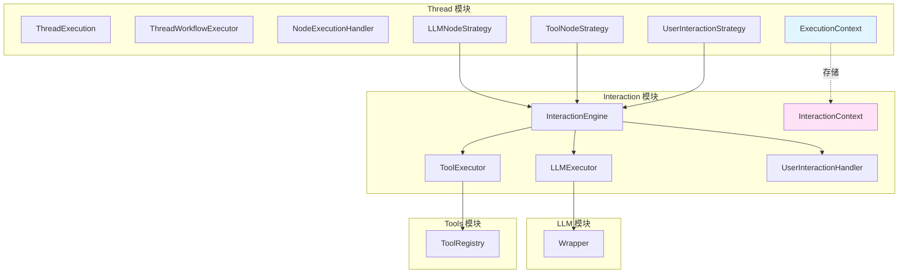
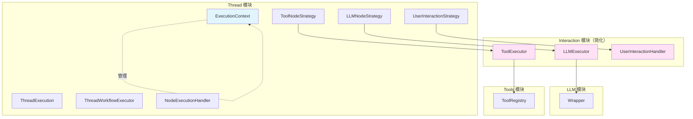

# Interaction 模块循环依赖问题分析

## 一、问题描述

当前架构中，Thread 模块通过策略（LLMNodeStrategy、ToolNodeStrategy、UserInteractionStrategy）调用 Interaction 模块，但存在潜在的循环依赖问题：

```
Thread → Interaction（通过策略调用 InteractionEngine）
Interaction → Thread（如果需要访问 Thread 的上下文或状态）
```

## 二、当前架构分析

### 2.1 当前调用链路

```
ThreadExecution
    ↓
ThreadWorkflowExecutor
    ↓
NodeExecutionHandler
    ↓
NodeExecutionStrategy (LLM/Tool/UserInteraction)
    ↓
InteractionEngine
    ↓
Executors (LLMExecutor/ToolExecutor/UserInteractionHandler)
```

### 2.2 上下文传递机制

**当前实现**：
```typescript
// LLMNodeStrategy 中
let interactionContext = context.getMetadata('interactionContext') as IInteractionContext;
if (!interactionContext) {
  interactionContext = this.interactionEngine.createContext();
  context.setMetadata('interactionContext', interactionContext);
}
```

**问题**：
- InteractionContext 存储在 ExecutionContext 的 metadata 中
- ExecutionContext 是 Thread 模块的上下文
- Interaction 模块需要了解 ExecutionContext 的结构

### 2.3 依赖关系图



## 三、核心问题识别

### 3.1 问题 1：上下文耦合

**问题描述**：
- InteractionContext 存储在 ExecutionContext 的 metadata 中
- Interaction 模块需要了解 ExecutionContext 的结构
- 违反了模块间的解耦原则

**影响**：
- Interaction 模块无法独立使用
- 修改 ExecutionContext 可能影响 Interaction 模块
- 难以进行单元测试

### 3.2 问题 2：职责不清

**问题描述**：
- InteractionEngine 的职责不清晰
- 当前只是简单的委托，缺少协调逻辑
- InteractionContext 的生命周期管理不明确

**影响**：
- Interaction 模块的价值不明确
- 难以扩展新的交互类型
- 代码重复（每个策略都要创建和管理 InteractionContext）

### 3.3 问题 3：潜在的循环依赖

**问题描述**：
- 如果 Executor 需要访问 Thread 的状态或服务
- 就会形成 Thread → Interaction → Thread 的循环依赖

**示例场景**：
```typescript
// 假设 ToolExecutor 需要访问 Thread 的状态
class ToolExecutor {
  async execute(config: ToolConfig, context: IInteractionContext) {
    // 需要访问 Thread 的状态
    const threadState = context.getThreadState(); // 这会导致循环依赖
    // ...
  }
}
```

### 3.4 问题 4：AgentLoop 的定位不清

**问题描述**：
- AgentLoop 位于 Interaction 模块
- 但它实际上是一个完整的执行流程
- 与 Thread 的职责重叠

**影响**：
- 职责划分不清
- 可能导致功能重复
- 难以维护

## 四、架构改进方案

### 4.1 方案 1：引入统一的上下文接口

**核心思想**：
- 定义一个通用的上下文接口
- Thread 和 Interaction 都实现这个接口
- 通过接口进行交互，避免直接依赖

**实现**：

```typescript
// src/domain/common/interfaces/execution-context-interface.ts
export interface IExecutionContext {
  // 变量管理
  getVariable(key: string): any;
  setVariable(key: string, value: any): void;
  
  // 元数据管理
  getMetadata(key: string): any;
  setMetadata(key: string, value: any): void;
  
  // 消息管理（用于 Interaction）
  getMessages(): Message[];
  addMessage(message: Message): void;
  
  // 工具调用管理（用于 Interaction）
  getToolCalls(): ToolCall[];
  addToolCall(toolCall: ToolCall): void;
}
```

**优势**：
- 解耦 Thread 和 Interaction
- 统一的上下文接口
- 易于测试和扩展

**劣势**：
- 需要重构现有代码
- 接口设计需要考虑所有场景

### 4.2 方案 2：Interaction 模块完全独立

**核心思想**：
- Interaction 模块不依赖任何 Thread 相关的上下文
- Interaction 模块只负责执行具体的交互操作
- Thread 模块负责所有上下文管理

**实现**：

```typescript
// Interaction 模块只接收配置，返回结果
interface IInteractionEngine {
  executeLLM(config: LLMConfig): Promise<LLMExecutionResult>;
  executeTool(config: ToolConfig): Promise<ToolExecutionResult>;
  handleUserInteraction(config: UserInteractionConfig): Promise<UserInteractionResult>;
}

// Thread 模块负责上下文管理
class LLMNodeStrategy {
  async execute(node: Node, context: ExecutionContext): Promise<NodeExecutionResult> {
    // 1. 从 ExecutionContext 提取配置
    const config = this.buildConfig(node, context);
    
    // 2. 调用 InteractionEngine（不传递上下文）
    const result = await this.interactionEngine.executeLLM(config);
    
    // 3. 将结果更新到 ExecutionContext
    this.updateContext(context, result);
    
    return result;
  }
}
```

**优势**：
- 完全解耦
- Interaction 模块可以独立使用
- 职责清晰

**劣势**：
- 需要重构现有代码
- 上下文管理逻辑分散

### 4.3 方案 3：引入上下文适配器

**核心思想**：
- 创建一个适配器，将 ExecutionContext 转换为 InteractionContext
- Interaction 模块只依赖 InteractionContext
- 适配器负责上下文转换

**实现**：

```typescript
// src/services/interaction/context-adapter.ts
export class ContextAdapter {
  static toInteractionContext(executionContext: ExecutionContext): IInteractionContext {
    return {
      getMessages: () => executionContext.getVariable('messages') || [],
      addMessage: (msg) => {
        const messages = executionContext.getVariable('messages') || [];
        messages.push(msg);
        executionContext.setVariable('messages', messages);
      },
      // ... 其他方法
    };
  }
}

// LLMNodeStrategy 中使用
class LLMNodeStrategy {
  async execute(node: Node, context: ExecutionContext): Promise<NodeExecutionResult> {
    // 使用适配器转换上下文
    const interactionContext = ContextAdapter.toInteractionContext(context);
    
    // 调用 InteractionEngine
    const result = await this.interactionEngine.executeLLM(config, interactionContext);
    
    return result;
  }
}
```

**优势**：
- 解耦 Thread 和 Interaction
- 适配器可以处理复杂的转换逻辑
- 易于测试

**劣势**：
- 增加了一层抽象
- 需要维护适配器代码

### 4.4 方案 4：重新定义 Interaction 模块职责

**核心思想**：
- Interaction 模块只提供底层的交互能力
- 不包含任何上下文管理逻辑
- Thread 模块负责所有编排和上下文管理

**实现**：

```typescript
// Interaction 模块只提供底层能力
interface ILLMExecutor {
  execute(request: LLMRequest): Promise<LLMResponse>;
}

interface IToolExecutor {
  execute(toolId: string, parameters: Record<string, any>): Promise<ToolResult>;
}

interface IUserInteractionHandler {
  handle(config: UserInteractionConfig): Promise<UserInteractionResult>;
}

// Thread 模块负责编排
class LLMNodeStrategy {
  async execute(node: Node, context: ExecutionContext): Promise<NodeExecutionResult> {
    // 1. 从上下文构建请求
    const request = this.buildRequest(node, context);
    
    // 2. 直接调用底层 Executor
    const response = await this.llmExecutor.execute(request);
    
    // 3. 处理响应并更新上下文
    this.processResponse(response, context);
    
    return this.buildResult(response);
  }
}
```

**优势**：
- 职责最清晰
- 完全解耦
- 易于理解和维护

**劣势**：
- 需要大量重构
- InteractionEngine 可能变得多余

## 五、推荐方案

### 5.1 推荐方案：方案 2 + 方案 4 的结合

**核心思想**：
1. Interaction 模块只提供底层的交互能力
2. 不依赖任何 Thread 相关的上下文
3. Thread 模块负责所有编排和上下文管理
4. 移除 InteractionEngine，直接使用 Executor

**架构图**：



**实现细节**：

```typescript
// 1. 简化 Interaction 模块
// src/services/interaction/executors/llm-executor.ts
export interface ILLMExecutor {
  execute(request: LLMRequest): Promise<LLMResponse>;
}

@injectable()
export class LLMExecutor implements ILLMExecutor {
  constructor(
    @inject('Logger') private readonly logger: ILogger,
    @inject('Wrapper') private readonly wrapper: Wrapper
  ) {}

  async execute(request: LLMRequest): Promise<LLMResponse> {
    // 直接执行，不依赖任何上下文
    const client = this.llmClientFactory.createClient(request.provider, request.model);
    return client.generateResponse(request);
  }
}

// 2. Thread 模块负责编排
// src/services/threads/execution/strategies/llm-node-strategy.ts
@injectable()
export class LLMNodeStrategy implements INodeExecutionStrategy {
  constructor(
    @inject('Logger') private readonly logger: ILogger,
    @inject('LLMExecutor') private readonly llmExecutor: ILLMExecutor
  ) {}

  async execute(node: Node, context: ExecutionContext): Promise<NodeExecutionResult> {
    // 1. 从上下文构建请求
    const request = this.buildRequest(node, context);
    
    // 2. 直接调用 LLMExecutor
    const response = await this.llmExecutor.execute(request);
    
    // 3. 处理响应并更新上下文
    this.updateContext(context, response);
    
    // 4. 返回结果
    return this.buildResult(response);
  }

  private buildRequest(node: LLMNode, context: ExecutionContext): LLMRequest {
    // 从上下文提取消息
    const messages = this.extractMessages(context);
    
    // 构建 LLM 请求
    return LLMRequest.create(node.model, messages, {
      temperature: node.temperature,
      maxTokens: node.maxTokens,
      // ... 其他参数
    });
  }

  private updateContext(context: ExecutionContext, response: LLMResponse): void {
    // 更新上下文中的消息
    const messages = context.getVariable('messages') || [];
    messages.push(this.convertToMessage(response));
    context.setVariable('messages', messages);
    
    // 更新 token 使用情况
    context.setVariable('tokenUsage', {
      promptTokens: response.getPromptTokens(),
      completionTokens: response.getCompletionTokens(),
      totalTokens: response.getTotalTokens(),
    });
  }

  private buildResult(response: LLMResponse): NodeExecutionResult {
    return {
      success: true,
      output: response.getContent(),
      metadata: {
        tokenUsage: {
          promptTokens: response.getPromptTokens(),
          completionTokens: response.getCompletionTokens(),
          totalTokens: response.getTotalTokens(),
        },
      },
    };
  }
}
```

### 5.2 迁移步骤

**阶段 1：准备**
1. 创建新的 Executor 接口（不依赖上下文）
2. 实现新的 Executor 类
3. 编写单元测试

**阶段 2：重构策略**
1. 修改 LLMNodeStrategy，直接使用 LLMExecutor
2. 修改 ToolNodeStrategy，直接使用 ToolExecutor
3. 修改 UserInteractionStrategy，直接使用 UserInteractionHandler
4. 移除 InteractionEngine 的依赖

**阶段 3：清理**
1. 删除 InteractionEngine
2. 删除 InteractionContext
3. 更新依赖注入配置
4. 更新文档

**阶段 4：验证**
1. 运行所有测试
2. 进行集成测试
3. 性能测试

## 六、优势分析

### 6.1 解耦
- Thread 和 Interaction 完全解耦
- Interaction 模块可以独立使用
- 易于测试和维护

### 6.2 职责清晰
- Interaction 模块：提供底层交互能力
- Thread 模块：负责编排和上下文管理
- 职责单一，易于理解

### 6.3 可扩展性
- 新增交互类型只需添加新的 Executor
- 不影响现有代码
- 易于扩展

### 6.4 性能
- 减少了一层抽象
- 减少上下文转换开销
- 提高执行效率

## 七、风险评估

### 7.1 重构风险
- 需要大量重构现有代码
- 可能引入新的 bug
- 需要充分的测试

### 7.2 兼容性风险
- 可能影响现有功能
- 需要更新依赖注入配置
- 需要更新文档

### 7.3 学习成本
- 新的架构需要团队学习
- 需要更新开发规范
- 需要培训

## 八、总结

当前架构存在循环依赖问题，主要原因是 Interaction 模块依赖 Thread 的上下文。推荐采用方案 2 + 方案 4 的结合，即：

1. Interaction 模块只提供底层的交互能力
2. 不依赖任何 Thread 相关的上下文
3. Thread 模块负责所有编排和上下文管理
4. 移除 InteractionEngine，直接使用 Executor

这个方案可以完全解耦 Thread 和 Interaction，职责清晰，易于维护和扩展。但需要大量的重构工作，需要充分的测试和验证。