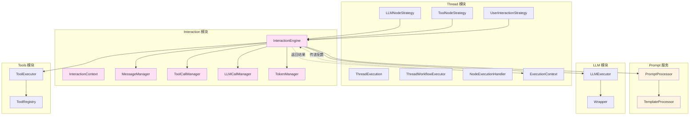

# Interaction 模块重新设计

## 一、核心职责定义

### 1.1 Prompt 服务职责
- 提示词的加载和存储
- 提示词模板的处理和渲染
- 提示词版本管理
- 提示词验证

### 1.2 Interaction 模块职责
- **消息管理**：管理交互消息历史（Message）
- **工具调用管理**：管理工具调用历史（ToolCall）
- **LLM 调用管理**：管理 LLM 调用历史（LLMCall）
- **Token 管理**：管理 token 使用情况
- **LLM 交互**：执行 LLM 调用
- **工具交互**：执行工具调用
- **用户交互**：处理用户交互

### 1.3 Thread 模块职责
- 工作流执行编排
- 节点执行协调
- 执行状态管理
- 上下文管理（ExecutionContext）
- 调用 Interaction 模块执行交互

## 二、架构设计

### 2.1 模块依赖关系



### 2.2 调用链路

```
ThreadExecution
    ↓
ThreadWorkflowExecutor
    ↓
NodeExecutionHandler
    ↓
NodeExecutionStrategy (LLM/Tool/UserInteraction)
    ↓
InteractionEngine (传递配置和上下文数据)
    ↓
MessageManager / ToolCallManager / LLMCallManager
    ↓
LLMExecutor / ToolExecutor / UserInteractionHandler
    ↓
返回结果
    ↓
NodeExecutionStrategy 更新 ExecutionContext
```

## 三、核心组件设计

### 3.1 InteractionEngine

**职责**：
- 协调消息、工具调用、LLM 调用的管理
- 执行 LLM 交互
- 执行工具交互
- 处理用户交互
- 管理 InteractionContext

**接口设计**：

```typescript
// src/services/interaction/interaction-engine.ts
export interface IInteractionEngine {
  /**
   * 执行 LLM 交互
   * @param config LLM 配置
   * @param messages 消息历史
   * @param toolSchemas 工具 Schema（可选）
   * @returns 交互结果
   */
  executeLLM(
    config: LLMConfig,
    messages: Message[],
    toolSchemas?: Record<string, any>[]
  ): Promise<LLMInteractionResult>;

  /**
   * 执行工具交互
   * @param config 工具配置
   * @param toolCalls 工具调用历史
   * @returns 交互结果
   */
  executeTool(
    config: ToolConfig,
    toolCalls: ToolCall[]
  ): Promise<ToolInteractionResult>;

  /**
   * 处理用户交互
   * @param config 用户交互配置
   * @param messages 消息历史
   * @returns 交互结果
   */
  handleUserInteraction(
    config: UserInteractionConfig,
    messages: Message[]
  ): Promise<UserInteractionResult>;

  /**
   * 创建交互上下文
   * @returns 交互上下文
   */
  createContext(): IInteractionContext;
}
```

**实现**：

```typescript
@injectable()
export class InteractionEngine implements IInteractionEngine {
  constructor(
    @inject('Logger') private readonly logger: ILogger,
    @inject('MessageManager') private readonly messageManager: MessageManager,
    @inject('ToolCallManager') private readonly toolCallManager: ToolCallManager,
    @inject('LLMCallManager') private readonly llmCallManager: LLMCallManager,
    @inject('TokenManager') private readonly tokenManager: TokenManager,
    @inject('LLMExecutor') private readonly llmExecutor: ILLMExecutor,
    @inject('ToolExecutor') private readonly toolExecutor: IToolExecutor,
    @inject('UserInteractionHandler') private readonly userInteractionHandler: IUserInteractionHandler,
    @inject('PromptProcessor') private readonly promptProcessor: IPromptProcessor
  ) {}

  async executeLLM(
    config: LLMConfig,
    messages: Message[],
    toolSchemas?: Record<string, any>[]
  ): Promise<LLMInteractionResult> {
    this.logger.debug('InteractionEngine 开始执行 LLM 交互', {
      provider: config.provider,
      model: config.model,
      messageCount: messages.length,
    });

    try {
      // 1. 处理提示词（如果有模板引用）
      let processedPrompt = config.prompt;
      if (config.promptTemplate) {
        const templateResult = await this.promptProcessor.processTemplate(
          config.promptTemplate.category,
          config.promptTemplate.name,
          config.promptTemplate.variables || {}
        );
        processedPrompt = templateResult.content;
      }

      // 2. 构建 LLM 请求
      const llmRequest = this.buildLLMRequest(config, messages, processedPrompt, toolSchemas);

      // 3. 执行 LLM 调用
      const llmResponse = await this.llmExecutor.execute(llmRequest);

      // 4. 处理响应
      const result = this.processLLMResponse(llmResponse, config);

      // 5. 更新管理器
      this.messageManager.addMessages(result.messages);
      this.llmCallManager.addLLMCall(result.llmCall);
      this.tokenManager.updateTokenUsage(result.tokenUsage);

      return result;
    } catch (error) {
      this.logger.error('LLM 交互失败', error instanceof Error ? error : new Error(String(error)));
      throw error;
    }
  }

  async executeTool(
    config: ToolConfig,
    toolCalls: ToolCall[]
  ): Promise<ToolInteractionResult> {
    this.logger.debug('InteractionEngine 开始执行工具交互', {
      toolId: config.toolId,
    });

    try {
      // 1. 执行工具
      const toolResult = await this.toolExecutor.execute(config);

      // 2. 创建工具调用记录
      const toolCall = new ToolCall({
        id: `tool_${Date.now()}`,
        name: config.toolId,
        arguments: config.parameters,
        result: toolResult.success ? toolResult.content : toolResult.error,
        executionTime: toolResult.executionTime,
        timestamp: new Date().toISOString(),
      });

      // 3. 更新管理器
      this.toolCallManager.addToolCall(toolCall);

      return {
        success: toolResult.success,
        output: toolResult.content,
        error: toolResult.error,
        toolCall,
        executionTime: toolResult.executionTime,
      };
    } catch (error) {
      this.logger.error('工具交互失败', error instanceof Error ? error : new Error(String(error)));
      throw error;
    }
  }

  async handleUserInteraction(
    config: UserInteractionConfig,
    messages: Message[]
  ): Promise<UserInteractionResult> {
    this.logger.debug('InteractionEngine 开始处理用户交互', {
      interactionType: config.interactionType,
    });

    try {
      // 1. 处理用户交互
      const result = await this.userInteractionHandler.handle(config);

      // 2. 创建用户消息
      const userMessage = new Message({
        role: MessageRole.USER,
        content: result.output || '',
      });

      // 3. 更新管理器
      this.messageManager.addMessage(userMessage);

      return result;
    } catch (error) {
      this.logger.error('用户交互失败', error instanceof Error ? error : new Error(String(error)));
      throw error;
    }
  }

  createContext(): IInteractionContext {
    return new InteractionContext(
      this.messageManager,
      this.toolCallManager,
      this.llmCallManager,
      this.tokenManager
    );
  }

  private buildLLMRequest(
    config: LLMConfig,
    messages: Message[],
    processedPrompt: string,
    toolSchemas?: Record<string, any>[]
  ): LLMRequest {
    // 构建消息列表
    const llmMessages: LLMMessage[] = [];

    // 添加系统消息
    if (config.systemPrompt) {
      llmMessages.push(LLMMessage.createSystem(config.systemPrompt));
    }

    // 添加历史消息
    for (const msg of messages) {
      llmMessages.push(this.convertToLLMMessage(msg));
    }

    // 添加当前用户消息
    llmMessages.push(LLMMessage.createUser(processedPrompt));

    // 构建 LLM 请求
    return LLMRequest.create(config.model, llmMessages, {
      temperature: config.temperature,
      maxTokens: config.maxTokens,
      topP: config.topP,
      frequencyPenalty: config.frequencyPenalty,
      presencePenalty: config.presencePenalty,
      stop: config.stopSequences,
      tools: toolSchemas,
    });
  }

  private processLLMResponse(
    llmResponse: LLMResponse,
    config: LLMConfig
  ): LLMInteractionResult {
    // 提取输出内容
    const output = llmResponse.getContent();

    // 构建消息列表
    const messages: Message[] = [];

    // 提取工具调用
    const toolCalls: ToolCall[] = [];
    if (llmResponse.hasToolCalls()) {
      const responseToolCalls = llmResponse.getToolCalls();
      for (const tc of responseToolCalls) {
        const toolCall = new ToolCall({
          id: tc.id,
          name: tc.function.name,
          arguments: JSON.parse(tc.function.arguments),
        });
        toolCalls.push(toolCall);
      }
    }

    // 创建助手消息
    const assistantMessage = new Message({
      role: MessageRole.ASSISTANT,
      content: output,
      toolCalls: toolCalls.length > 0 ? toolCalls : undefined,
    });
    messages.push(assistantMessage);

    // 构建 Token 使用情况
    const tokenUsage = new TokenUsage({
      promptTokens: llmResponse.getPromptTokens(),
      completionTokens: llmResponse.getCompletionTokens(),
      totalTokens: llmResponse.getTotalTokens(),
    });

    // 创建 LLM 调用记录
    const llmCall = new LLMCall({
      id: `llm_${Date.now()}`,
      provider: config.provider,
      model: config.model,
      messages: messages,
      response: output,
      toolCalls: toolCalls.length > 0 ? toolCalls : undefined,
      usage: tokenUsage,
      timestamp: new Date().toISOString(),
      executionTime: llmResponse.duration,
    });

    return {
      success: true,
      output,
      messages,
      toolCalls,
      llmCall,
      tokenUsage,
    };
  }

  private convertToLLMMessage(message: Message): LLMMessage {
    switch (message.role) {
      case MessageRole.SYSTEM:
        return LLMMessage.createSystem(message.content);
      case MessageRole.USER:
        return LLMMessage.createUser(message.content);
      case MessageRole.ASSISTANT:
        if (message.toolCalls && message.toolCalls.length > 0) {
          const toolCalls = message.toolCalls.map(tc => ({
            id: tc.id,
            type: 'function',
            function: {
              name: tc.name,
              arguments: JSON.stringify(tc.arguments),
            },
          }));
          return LLMMessage.fromInterface({
            role: LLMMessageRole.ASSISTANT,
            content: message.content,
            toolCalls,
          });
        }
        return LLMMessage.createAssistant(message.content);
      case MessageRole.TOOL:
        return LLMMessage.fromInterface({
          role: LLMMessageRole.TOOL,
          content: message.content,
          toolCallId: message.toolCallId,
        });
      default:
        return LLMMessage.createUser(message.content);
    }
  }
}
```

### 3.2 管理器设计

#### 3.2.1 MessageManager

```typescript
// src/services/interaction/managers/message-manager.ts
export interface IMessageManager {
  addMessage(message: Message): void;
  addMessages(messages: Message[]): void;
  getMessages(): Message[];
  getMessage(index: number): Message | undefined;
  clearMessages(): void;
  getMessageCount(): number;
}

@injectable()
export class MessageManager implements IMessageManager {
  private messages: Message[] = [];

  constructor(@inject('Logger') private readonly logger: ILogger) {}

  addMessage(message: Message): void {
    this.messages.push(message);
    this.logger.debug('添加消息', { role: message.role, contentLength: message.content.length });
  }

  addMessages(messages: Message[]): void {
    this.messages.push(...messages);
    this.logger.debug('批量添加消息', { count: messages.length });
  }

  getMessages(): Message[] {
    return [...this.messages];
  }

  getMessage(index: number): Message | undefined {
    return this.messages[index];
  }

  clearMessages(): void {
    this.messages = [];
    this.logger.debug('清空消息历史');
  }

  getMessageCount(): number {
    return this.messages.length;
  }
}
```

#### 3.2.2 ToolCallManager

```typescript
// src/services/interaction/managers/tool-call-manager.ts
export interface IToolCallManager {
  addToolCall(toolCall: ToolCall): void;
  getToolCalls(): ToolCall[];
  getToolCall(id: string): ToolCall | undefined;
  clearToolCalls(): void;
  getToolCallCount(): number;
}

@injectable()
export class ToolCallManager implements IToolCallManager {
  private toolCalls: ToolCall[] = [];

  constructor(@inject('Logger') private readonly logger: ILogger) {}

  addToolCall(toolCall: ToolCall): void {
    this.toolCalls.push(toolCall);
    this.logger.debug('添加工具调用', { toolId: toolCall.name });
  }

  getToolCalls(): ToolCall[] {
    return [...this.toolCalls];
  }

  getToolCall(id: string): ToolCall | undefined {
    return this.toolCalls.find(tc => tc.id === id);
  }

  clearToolCalls(): void {
    this.toolCalls = [];
    this.logger.debug('清空工具调用历史');
  }

  getToolCallCount(): number {
    return this.toolCalls.length;
  }
}
```

#### 3.2.3 LLMCallManager

```typescript
// src/services/interaction/managers/llm-call-manager.ts
export interface ILLMCallManager {
  addLLMCall(llmCall: LLMCall): void;
  getLLMCalls(): LLMCall[];
  getLLMCall(id: string): LLMCall | undefined;
  clearLLMCalls(): void;
  getLLMCallCount(): number;
  getTotalTokenUsage(): TokenUsage;
}

@injectable()
export class LLMCallManager implements ILLMCallManager {
  private llmCalls: LLMCall[] = [];

  constructor(@inject('Logger') private readonly logger: ILogger) {}

  addLLMCall(llmCall: LLMCall): void {
    this.llmCalls.push(llmCall);
    this.logger.debug('添加 LLM 调用', { model: llmCall.model });
  }

  getLLMCalls(): LLMCall[] {
    return [...this.llmCalls];
  }

  getLLMCall(id: string): LLMCall | undefined {
    return this.llmCalls.find(call => call.id === id);
  }

  clearLLMCalls(): void {
    this.llmCalls = [];
    this.logger.debug('清空 LLM 调用历史');
  }

  getLLMCallCount(): number {
    return this.llmCalls.length;
  }

  getTotalTokenUsage(): TokenUsage {
    let promptTokens = 0;
    let completionTokens = 0;

    for (const call of this.llmCalls) {
      if (call.usage) {
        promptTokens += call.usage.promptTokens;
        completionTokens += call.usage.completionTokens;
      }
    }

    return new TokenUsage({
      promptTokens,
      completionTokens,
      totalTokens: promptTokens + completionTokens,
    });
  }
}
```

#### 3.2.4 TokenManager

```typescript
// src/services/interaction/managers/token-manager.ts
export interface ITokenManager {
  updateTokenUsage(tokenUsage: TokenUsage): void;
  getTokenUsage(): TokenUsage;
  resetTokenUsage(): void;
  getTokenLimit(): number;
  setTokenLimit(limit: number): void;
  isTokenLimitExceeded(): boolean;
}

@injectable()
export class TokenManager implements ITokenManager {
  private tokenUsage: TokenUsage = new TokenUsage({
    promptTokens: 0,
    completionTokens: 0,
    totalTokens: 0,
  });
  private tokenLimit: number = 80000;

  constructor(@inject('Logger') private readonly logger: ILogger) {}

  updateTokenUsage(tokenUsage: TokenUsage): void {
    this.tokenUsage = new TokenUsage({
      promptTokens: this.tokenUsage.promptTokens + tokenUsage.promptTokens,
      completionTokens: this.tokenUsage.completionTokens + tokenUsage.completionTokens,
      totalTokens: this.tokenUsage.totalTokens + tokenUsage.totalTokens,
    });
    this.logger.debug('更新 Token 使用情况', {
      totalTokens: this.tokenUsage.totalTokens,
    });
  }

  getTokenUsage(): TokenUsage {
    return this.tokenUsage;
  }

  resetTokenUsage(): void {
    this.tokenUsage = new TokenUsage({
      promptTokens: 0,
      completionTokens: 0,
      totalTokens: 0,
    });
    this.logger.debug('重置 Token 使用情况');
  }

  getTokenLimit(): number {
    return this.tokenLimit;
  }

  setTokenLimit(limit: number): void {
    this.tokenLimit = limit;
    this.logger.debug('设置 Token 限制', { limit });
  }

  isTokenLimitExceeded(): boolean {
    return this.tokenUsage.totalTokens > this.tokenLimit;
  }
}
```

### 3.3 InteractionContext

```typescript
// src/services/interaction/interaction-context.ts
export interface IInteractionContext {
  getMessageManager(): IMessageManager;
  getToolCallManager(): IToolCallManager;
  getLLMCallManager(): ILLMCallManager;
  getTokenManager(): ITokenManager;
}

export class InteractionContext implements IInteractionContext {
  constructor(
    private readonly messageManager: IMessageManager,
    private readonly toolCallManager: IToolCallManager,
    private readonly llmCallManager: ILLMCallManager,
    private readonly tokenManager: ITokenManager
  ) {}

  getMessageManager(): IMessageManager {
    return this.messageManager;
  }

  getToolCallManager(): IToolCallManager {
    return this.toolCallManager;
  }

  getLLMCallManager(): ILLMCallManager {
    return this.llmCallManager;
  }

  getTokenManager(): ITokenManager {
    return this.tokenManager;
  }
}
```

## 四、策略层改造

### 4.1 LLMNodeStrategy

```typescript
// src/services/threads/execution/strategies/llm-node-strategy.ts
@injectable()
export class LLMNodeStrategy implements INodeExecutionStrategy {
  constructor(
    @inject('Logger') private readonly logger: ILogger,
    @inject('InteractionEngine') private readonly interactionEngine: IInteractionEngine
  ) {}

  canExecute(node: Node): boolean {
    return node instanceof LLMNode;
  }

  async execute(node: Node, context: ExecutionContext): Promise<NodeExecutionResult> {
    if (!(node instanceof LLMNode)) {
      return {
        success: false,
        error: '节点类型不匹配，期望 LLMNode',
        metadata: {
          nodeId: node.nodeId.toString(),
          nodeType: node.type.toString(),
        },
      };
    }

    const startTime = Date.now();

    this.logger.debug('LLMNodeStrategy 开始执行 LLM 节点', {
      nodeId: node.nodeId.toString(),
      model: node.model,
    });

    try {
      // 1. 从 ExecutionContext 获取消息历史
      const messages = context.getVariable('messages') || [];

      // 2. 构建 LLM 配置
      const config = new LLMConfig({
        provider: node.provider || 'openai',
        model: node.model,
        prompt: node.prompt,
        systemPrompt: node.systemPrompt,
        temperature: node.temperature,
        maxTokens: node.maxTokens,
        topP: node.topP,
        frequencyPenalty: node.frequencyPenalty,
        presencePenalty: node.presencePenalty,
        stopSequences: node.stopSequences,
        promptTemplate: node.promptTemplate, // 可选的模板引用
      });

      // 3. 获取工具 Schema（如果有）
      const toolSchemas = context.getVariable('toolSchemas');

      // 4. 调用 InteractionEngine 执行 LLM 交互
      const result = await this.interactionEngine.executeLLM(config, messages, toolSchemas);

      const executionTime = Date.now() - startTime;

      if (result.success) {
        // 5. 更新 ExecutionContext
        context.setVariable('messages', result.messages);
        context.setVariable('output', result.output);
        context.setVariable('toolCalls', result.toolCalls);
        context.setVariable('llmCalls', context.getVariable('llmCalls') || []);
        context.getVariable('llmCalls').push(result.llmCall);
        context.setVariable('tokenUsage', result.tokenUsage);

        return {
          success: true,
          output: result.output,
          executionTime,
          metadata: {
            nodeId: node.nodeId.toString(),
            model: node.model,
            llmCalls: context.getVariable('llmCalls').length,
            tokenUsage: result.tokenUsage,
          },
        };
      } else {
        return {
          success: false,
          error: result.error,
          executionTime,
          metadata: {
            nodeId: node.nodeId.toString(),
            model: node.model,
          },
        };
      }
    } catch (error) {
      const executionTime = Date.now() - startTime;

      this.logger.error('LLM 节点执行失败', error instanceof Error ? error : new Error(String(error)), {
        nodeId: node.nodeId.toString(),
        model: node.model,
      });

      return {
        success: false,
        error: error instanceof Error ? error.message : String(error),
        executionTime,
        metadata: {
          nodeId: node.nodeId.toString(),
          model: node.model,
          errorType: error instanceof Error ? error.constructor.name : 'Unknown',
        },
      };
    }
  }
}
```

### 4.2 ToolNodeStrategy

```typescript
// src/services/threads/execution/strategies/tool-node-strategy.ts
@injectable()
export class ToolNodeStrategy implements INodeExecutionStrategy {
  constructor(
    @inject('Logger') private readonly logger: ILogger,
    @inject('InteractionEngine') private readonly interactionEngine: IInteractionEngine
  ) {}

  canExecute(node: Node): boolean {
    return node instanceof ToolNode;
  }

  async execute(node: Node, context: ExecutionContext): Promise<NodeExecutionResult> {
    if (!(node instanceof ToolNode)) {
      return {
        success: false,
        error: '节点类型不匹配，期望 ToolNode',
        metadata: {
          nodeId: node.nodeId.toString(),
          nodeType: node.type.toString(),
        },
      };
    }

    const startTime = Date.now();

    this.logger.debug('ToolNodeStrategy 开始执行工具节点', {
      nodeId: node.nodeId.toString(),
      toolId: node.toolId,
    });

    try {
      // 1. 从 ExecutionContext 获取工具调用历史
      const toolCalls = context.getVariable('toolCalls') || [];

      // 2. 构建工具配置
      const config = new ToolConfig({
        toolId: node.toolId,
        parameters: node.parameters,
        timeout: node.timeout,
      });

      // 3. 调用 InteractionEngine 执行工具交互
      const result = await this.interactionEngine.executeTool(config, toolCalls);

      const executionTime = Date.now() - startTime;

      if (result.success) {
        // 4. 更新 ExecutionContext
        context.setVariable('output', result.output);
        context.setVariable('toolCalls', context.getVariable('toolCalls') || []);
        context.getVariable('toolCalls').push(result.toolCall);

        return {
          success: true,
          output: result.output,
          executionTime,
          metadata: {
            nodeId: node.nodeId.toString(),
            toolId: node.toolId,
          },
        };
      } else {
        return {
          success: false,
          error: result.error,
          executionTime,
          metadata: {
            nodeId: node.nodeId.toString(),
            toolId: node.toolId,
          },
        };
      }
    } catch (error) {
      const executionTime = Date.now() - startTime;

      this.logger.error('工具节点执行失败', error instanceof Error ? error : new Error(String(error)), {
        nodeId: node.nodeId.toString(),
        toolId: node.toolId,
      });

      return {
        success: false,
        error: error instanceof Error ? error.message : String(error),
        executionTime,
        metadata: {
          nodeId: node.nodeId.toString(),
          toolId: node.toolId,
          errorType: error instanceof Error ? error.constructor.name : 'Unknown',
        },
      };
    }
  }
}
```

## 五、优势分析

### 5.1 职责清晰
- **Prompt 服务**：负责提示词的静态管理
- **Interaction 模块**：负责消息管理和交互执行
- **Thread 模块**：负责工作流编排和上下文管理

### 5.2 解耦
- Interaction 模块不依赖 Thread 的任何东西
- 只通过配置和数据传递进行交互
- 易于测试和维护

### 5.3 可扩展性
- 新增交互类型只需扩展 InteractionEngine
- 新增管理器不影响现有代码
- 易于添加新功能

### 5.4 可复用性
- Interaction 模块可以独立使用
- 不依赖 Thread 模块
- 可以在其他场景中复用

## 六、迁移步骤

### 6.1 阶段 1：创建管理器
1. 创建 MessageManager
2. 创建 ToolCallManager
3. 创建 LLMCallManager
4. 创建 TokenManager
5. 编写单元测试

### 6.2 阶段 2：重构 InteractionEngine
1. 修改 InteractionEngine 接口
2. 实现新的 InteractionEngine
3. 集成管理器
4. 编写单元测试

### 6.3 阶段 3：重构策略
1. 修改 LLMNodeStrategy
2. 修改 ToolNodeStrategy
3. 修改 UserInteractionStrategy
4. 编写集成测试

### 6.4 阶段 4：清理
1. 删除旧的 InteractionContext
2. 更新依赖注入配置
3. 更新文档
4. 性能测试

## 七、总结

重新设计的 Interaction 模块：

1. **核心职责**：消息管理、工具调用管理、LLM 调用管理、Token 管理、交互执行
2. **解耦设计**：不依赖 Thread 模块，只通过配置和数据传递
3. **职责清晰**：Prompt 服务负责静态管理，Interaction 模块负责动态交互
4. **易于扩展**：新增功能只需扩展管理器或 InteractionEngine
5. **可复用**：可以独立使用，不依赖 Thread 模块

这个设计完全避免了循环依赖，职责清晰，易于维护和扩展。