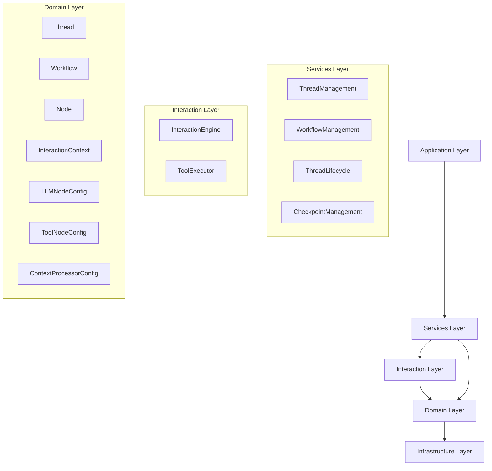
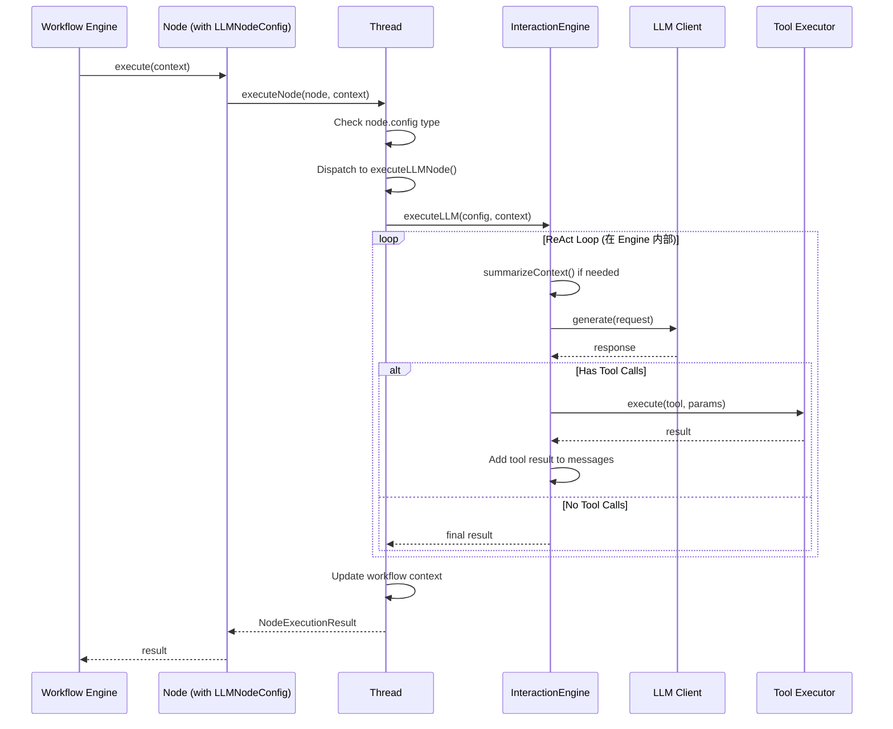
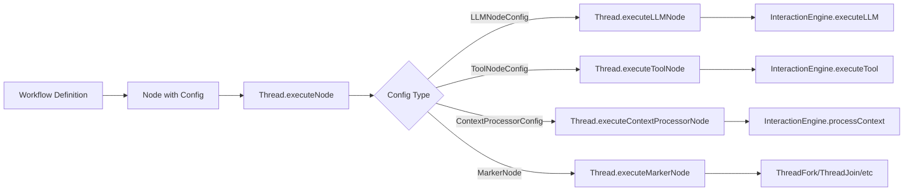

# LLM Interaction 架构设计文档 V2

## 一、核心设计目标

### 1.1 解耦目标
- **Workflow 静态定义** 与 **执行引擎** 完全解耦
- **Thread 执行协调** 与 **LLM 交互逻辑** 分离
- **节点配置** 与 **节点执行** 分离

### 1.2 命名规范
为避免混淆，采用以下命名：
- **Interaction Layer**：LLM 交互层
- **InteractionEngine**：LLM 交互引擎
- **InteractionContext**：LLM 交互上下文

### 1.3 节点设计原则
参考 [`MarkerNode`](src/domain/workflow/value-objects/node/marker-node.ts:90) 的设计模式：
- 节点是**值对象**，不可变，没有身份标识
- 节点**不执行业务逻辑**，只负责存储配置
- 节点的配置由 **Thread** 处理

## 二、架构分层



## 三、节点设计（基于 MarkerNode 模式）

### 3.1 LLM 节点配置（值对象）

```typescript
/**
 * LLM节点配置值对象
 * 
 * 参考 MarkerNode 设计模式：
 * - 不可变值对象
 * - 不包含执行逻辑
 * - 仅存储配置信息
 * - 由 Thread 处理执行
 */
export class LLMNodeConfig {
  private readonly _provider: string;
  private readonly _model: string;
  private readonly _temperature?: number;
  private readonly _maxTokens?: number;
  private readonly _systemPrompt?: string;
  private readonly _userPrompt: string;
  private readonly _stream?: boolean;
  private readonly _toolMode: 'none' | 'auto' | 'required';
  private readonly _availableTools?: string[];
  private readonly _maxIterations?: number;

  private constructor(props: {
    provider: string;
    model: string;
    temperature?: number;
    maxTokens?: number;
    systemPrompt?: string;
    userPrompt: string;
    stream?: boolean;
    toolMode?: 'none' | 'auto' | 'required';
    availableTools?: string[];
    maxIterations?: number;
  }) {
    this._provider = props.provider;
    this._model = props.model;
    this._temperature = props.temperature;
    this._maxTokens = props.maxTokens;
    this._systemPrompt = props.systemPrompt;
    this._userPrompt = props.userPrompt;
    this._stream = props.stream;
    this._toolMode = props.toolMode || 'none';
    this._availableTools = props.availableTools;
    this._maxIterations = props.maxIterations;
  }

  // Getters
  get provider(): string { return this._provider; }
  get model(): string { return this._model; }
  get temperature(): number | undefined { return this._temperature; }
  get maxTokens(): number | undefined { return this._maxTokens; }
  get systemPrompt(): string | undefined { return this._systemPrompt; }
  get userPrompt(): string { return this._userPrompt; }
  get stream(): boolean | undefined { return this._stream; }
  get toolMode(): 'none' | 'auto' | 'required' { return this._toolMode; }
  get availableTools(): string[] | undefined { return this._availableTools; }
  get maxIterations(): number | undefined { return this._maxIterations; }

  /**
   * 创建 LLM 节点配置
   */
  static create(props: {
    provider: string;
    model: string;
    temperature?: number;
    maxTokens?: number;
    systemPrompt?: string;
    userPrompt: string;
    stream?: boolean;
    toolMode?: 'none' | 'auto' | 'required';
    availableTools?: string[];
    maxIterations?: number;
  }): LLMNodeConfig {
    if (!props.provider) {
      throw new Error('provider is required');
    }
    if (!props.model) {
      throw new Error('model is required');
    }
    if (!props.userPrompt) {
      throw new Error('userPrompt is required');
    }

    return new LLMNodeConfig(props);
  }

  /**
   * 从属性创建
   */
  static fromProps(props: Record<string, any>): LLMNodeConfig {
    return LLMNodeConfig.create({
      provider: props.provider,
      model: props.model,
      temperature: props.temperature,
      maxTokens: props.maxTokens,
      systemPrompt: props.systemPrompt,
      userPrompt: props.userPrompt,
      stream: props.stream,
      toolMode: props.toolMode,
      availableTools: props.availableTools,
      maxIterations: props.maxIterations
    });
  }

  /**
   * 转换为 JSON
   */
  toJSON(): Record<string, any> {
    return {
      provider: this._provider,
      model: this._model,
      temperature: this._temperature,
      maxTokens: this._maxTokens,
      systemPrompt: this._systemPrompt,
      userPrompt: this._userPrompt,
      stream: this._stream,
      toolMode: this._toolMode,
      availableTools: this._availableTools,
      maxIterations: this._maxIterations
    };
  }

  /**
   * 判断相等
   */
  equals(other: LLMNodeConfig): boolean {
    return JSON.stringify(this.toJSON()) === JSON.stringify(other.toJSON());
  }
}
```

### 3.2 工具节点配置（值对象）

```typescript
/**
 * 工具节点配置值对象
 * 
 * 参考 MarkerNode 设计模式
 */
export class ToolNodeConfig {
  private readonly _toolName: string;
  private readonly _parameters: Record<string, any>;
  private readonly _timeout?: number;

  private constructor(props: {
    toolName: string;
    parameters: Record<string, any>;
    timeout?: number;
  }) {
    this._toolName = props.toolName;
    this._parameters = { ...props.parameters };
    this._timeout = props.timeout;
  }

  get toolName(): string { return this._toolName; }
  get parameters(): Record<string, any> { return { ...this._parameters }; }
  get timeout(): number | undefined { return this._timeout; }

  /**
   * 创建工具节点配置
   */
  static create(props: {
    toolName: string;
    parameters: Record<string, any>;
    timeout?: number;
  }): ToolNodeConfig {
    if (!props.toolName) {
      throw new Error('toolName is required');
    }

    return new ToolNodeConfig(props);
  }

  /**
   * 从属性创建
   */
  static fromProps(props: Record<string, any>): ToolNodeConfig {
    return ToolNodeConfig.create({
      toolName: props.toolName,
      parameters: props.parameters || {},
      timeout: props.timeout
    });
  }

  /**
   * 转换为 JSON
   */
  toJSON(): Record<string, any> {
    return {
      toolName: this._toolName,
      parameters: this._parameters,
      timeout: this._timeout
    };
  }

  /**
   * 判断相等
   */
  equals(other: ToolNodeConfig): boolean {
    return JSON.stringify(this.toJSON()) === JSON.stringify(other.toJSON());
  }
}
```

### 3.3 上下文处理器配置（值对象）

```typescript
/**
 * 上下文处理器配置值对象
 * 
 * 参考 MarkerNode 设计模式
 */
export class ContextProcessorConfig {
  private readonly _processorName: string;
  private readonly _processorConfig: Record<string, unknown>;

  private constructor(props: {
    processorName: string;
    processorConfig?: Record<string, unknown>;
  }) {
    this._processorName = props.processorName;
    this._processorConfig = { ...props.processorConfig };
  }

  get processorName(): string { return this._processorName; }
  get processorConfig(): Record<string, unknown> { return { ...this._processorConfig }; }

  /**
   * 创建上下文处理器配置
   */
  static create(props: {
    processorName: string;
    processorConfig?: Record<string, unknown>;
  }): ContextProcessorConfig {
    if (!props.processorName) {
      throw new Error('processorName is required');
    }

    return new ContextProcessorConfig(props);
  }

  /**
   * 从属性创建
   */
  static fromProps(props: Record<string, any>): ContextProcessorConfig {
    return ContextProcessorConfig.create({
      processorName: props.processorName,
      processorConfig: props.processorConfig || {}
    });
  }

  /**
   * 转换为 JSON
   */
  toJSON(): Record<string, any> {
    return {
      processorName: this._processorName,
      processorConfig: this._processorConfig
    };
  }

  /**
   * 判断相等
   */
  equals(other: ContextProcessorConfig): boolean {
    return JSON.stringify(this.toJSON()) === JSON.stringify(other.toJSON());
  }
}
```

### 3.4 节点类型扩展

```typescript
/**
 * 节点类型枚举
 */
export enum NodeType {
  /** LLM 节点 */
  LLM = 'llm',
  /** 工具节点 */
  TOOL = 'tool',
  /** 上下文处理器节点 */
  CONTEXT_PROCESSOR = 'context_processor',
  /** 标记节点 */
  MARKER = 'marker',
  /** 其他节点类型... */
}

/**
 * 节点配置联合类型
 */
export type NodeConfig = 
  | LLMNodeConfig 
  | ToolNodeConfig 
  | ContextProcessorConfig 
  | MarkerNode;
```

## 四、Thread 层（执行协调）

### 4.1 Thread 接口

```typescript
/**
 * Thread 接口
 * 
 * 负责协调 workflow 执行和管理 InteractionEngine
 * 所有节点的执行逻辑都由 Thread 处理
 */
export interface IThread {
  /**
   * 执行节点（统一入口）
   * @param node 节点
   * @param context 执行上下文
   * @returns 执行结果
   */
  executeNode(
    node: Node,
    context: WorkflowExecutionContext
  ): Promise<NodeExecutionResult>;

  /**
   * 执行 LLM 节点
   * @param config LLM 节点配置
   * @param context 执行上下文
   * @returns 执行结果
   */
  executeLLMNode(
    config: LLMNodeConfig,
    context: WorkflowExecutionContext
  ): Promise<NodeExecutionResult>;

  /**
   * 执行工具节点
   * @param config 工具节点配置
   * @param context 执行上下文
   * @returns 执行结果
   */
  executeToolNode(
    config: ToolNodeConfig,
    context: WorkflowExecutionContext
  ): Promise<NodeExecutionResult>;

  /**
   * 执行上下文处理器节点
   * @param config 上下文处理器配置
   * @param context 执行上下文
   * @returns 执行结果
   */
  executeContextProcessorNode(
    config: ContextProcessorConfig,
    context: WorkflowExecutionContext
  ): Promise<NodeExecutionResult>;

  /**
   * 获取 InteractionEngine
   */
  getInteractionEngine(): InteractionEngine;
}
```

### 4.2 Thread 实现

```typescript
/**
 * Thread 实现
 * 
 * 负责协调 workflow 执行和管理 InteractionEngine
 */
export class Thread implements IThread {
  private interactionEngine: InteractionEngine;
  private executionState: ExecutionState;

  constructor(
    private threadId: string,
    private workflowId: string,
    private sessionId: string,
    interactionEngine?: InteractionEngine
  ) {
    this.interactionEngine = interactionEngine || new InteractionEngine();
    this.executionState = new ExecutionState();
  }

  /**
   * 执行节点（统一入口）
   * 
   * 根据 node.config 的类型分发到对应的执行方法
   */
  async executeNode(
    node: Node,
    context: WorkflowExecutionContext
  ): Promise<NodeExecutionResult> {
    const startTime = Date.now();

    try {
      // 获取节点配置
      const config = node.config;

      // 根据配置类型分发
      if (config instanceof LLMNodeConfig) {
        return this.executeLLMNode(config, context);
      } else if (config instanceof ToolNodeConfig) {
        return this.executeToolNode(config, context);
      } else if (config instanceof ContextProcessorConfig) {
        return this.executeContextProcessorNode(config, context);
      } else if (config instanceof MarkerNode) {
        return this.executeMarkerNode(config, context);
      } else {
        return {
          success: false,
          error: `Unknown node config type: ${config.constructor.name}`,
          executionTime: Date.now() - startTime
        };
      }
    } catch (error) {
      return {
        success: false,
        error: error.message,
        executionTime: Date.now() - startTime
      };
    }
  }

  /**
   * 执行 LLM 节点
   */
  async executeLLMNode(
    config: LLMNodeConfig,
    context: WorkflowExecutionContext
  ): Promise<NodeExecutionResult> {
    const startTime = Date.now();

    try {
      // 1. 准备 InteractionContext
      const interactionContext = this.prepareInteractionContext(context);

      // 2. 调用 InteractionEngine 执行 LLM
      const result = await this.interactionEngine.executeLLM(config, interactionContext);

      // 3. 更新 Workflow 上下文
      context.setVariable('output', result.output);
      context.setVariable('messages', result.context.messages);
      context.setVariable('llmCalls', result.context.llmCalls);
      context.setVariable('toolCalls', result.context.toolCalls);

      const executionTime = Date.now() - startTime;

      return {
        success: result.success,
        output: result.output,
        executionTime,
        metadata: {
          llmCalls: result.context.llmCalls.length,
          toolCalls: result.context.toolCalls.length,
          tokenUsage: result.context.tokenUsage
        }
      };
    } catch (error) {
      const executionTime = Date.now() - startTime;

      return {
        success: false,
        error: error.message,
        executionTime
      };
    }
  }

  /**
   * 执行工具节点
   */
  async executeToolNode(
    config: ToolNodeConfig,
    context: WorkflowExecutionContext
  ): Promise<NodeExecutionResult> {
    const startTime = Date.now();

    try {
      // 1. 准备参数（支持表达式求值）
      const parameters = this.evaluateParameters(config.parameters, context);

      // 2. 调用 InteractionEngine 执行工具
      const result = await this.interactionEngine.executeTool(
        config.toolName,
        parameters
      );

      // 3. 更新 Workflow 上下文
      context.setVariable('output', result.output);

      const executionTime = Date.now() - startTime;

      return {
        success: result.success,
        output: result.output,
        executionTime,
        metadata: {
          toolName: config.toolName,
          executionTime
        }
      };
    } catch (error) {
      const executionTime = Date.now() - startTime;

      return {
        success: false,
        error: error.message,
        executionTime
      };
    }
  }

  /**
   * 执行上下文处理器节点
   */
  async executeContextProcessorNode(
    config: ContextProcessorConfig,
    context: WorkflowExecutionContext
  ): Promise<NodeExecutionResult> {
    const startTime = Date.now();

    try {
      // 1. 调用 InteractionEngine 处理上下文
      const result = await this.interactionEngine.processContext(
        config.processorName,
        config.processorConfig,
        this.interactionEngine.getContext()
      );

      // 2. 更新 Workflow 上下文
      if (result.processedContext) {
        context.setVariable('context', result.processedContext);
      }

      const executionTime = Date.now() - startTime;

      return {
        success: result.success,
        output: result.output,
        executionTime,
        metadata: {
          processorName: config.processorName
        }
      };
    } catch (error) {
      const executionTime = Date.now() - startTime;

      return {
        success: false,
        error: error.message,
        executionTime
      };
    }
  }

  /**
   * 执行标记节点
   */
  async executeMarkerNode(
    config: MarkerNode,
    context: WorkflowExecutionContext
  ): Promise<NodeExecutionResult> {
    const startTime = Date.now();

    try {
      // 标记节点由相应的服务处理
      // Fork -> ThreadFork
      // Join -> ThreadJoin
      // SubWorkflow -> WorkflowMerger
      // LoopStart/LoopEnd -> LoopExecution

      if (config.isFork()) {
        const threadFork = context.getService<ThreadFork>('ThreadFork');
        const result = await threadFork.executeFork({
          parentThread: this,
          forkPoint: config.id,
          branches: config.getBranches()
        });
        return {
          success: true,
          output: result,
          executionTime: Date.now() - startTime
        };
      } else if (config.isJoin()) {
        const threadJoin = context.getService<ThreadJoin>('ThreadJoin');
        const result = await threadJoin.executeJoin({
          parentThread: this,
          joinPoint: config.id,
          childThreadIds: context.getVariable('child_thread_ids') || []
        });
        return {
          success: true,
          output: result,
          executionTime: Date.now() - startTime
        };
      } else {
        return {
          success: false,
          error: `Unsupported marker node type: ${config.type}`,
          executionTime: Date.now() - startTime
        };
      }
    } catch (error) {
      return {
        success: false,
        error: error.message,
        executionTime: Date.now() - startTime
      };
    }
  }

  /**
   * 准备 InteractionContext
   */
  private prepareInteractionContext(
    context: WorkflowExecutionContext
  ): InteractionContext {
    return {
      messages: context.getVariable('messages') || [],
      variables: context.getVariables(),
      toolCalls: [],
      llmCalls: [],
      tokenUsage: {
        promptTokens: 0,
        completionTokens: 0,
        totalTokens: 0
      }
    };
  }

  /**
   * 参数求值（支持表达式）
   */
  private evaluateParameters(
    parameters: Record<string, any>,
    context: WorkflowExecutionContext
  ): Record<string, any> {
    const evaluated: Record<string, any> = {};

    for (const [key, value] of Object.entries(parameters)) {
      if (typeof value === 'string' && value.startsWith('{{')) {
        // 表达式求值
        evaluated[key] = this.evaluateExpression(value, context);
      } else {
        evaluated[key] = value;
      }
    }

    return evaluated;
  }

  /**
   * 表达式求值
   */
  private evaluateExpression(
    expression: string,
    context: WorkflowExecutionContext
  ): any {
    // 简单的表达式求值实现
    const expr = expression.slice(2, -2).trim(); // 移除{{}}
    return context.getVariable(expr);
  }

  getInteractionEngine(): InteractionEngine {
    return this.interactionEngine;
  }
}
```

## 五、Interaction 层（LLM 交互引擎）

### 5.1 InteractionEngine 接口

```typescript
/**
 * InteractionEngine 接口
 * 
 * 负责所有 LLM 交互逻辑
 */
export interface IInteractionEngine {
  /**
   * 执行 LLM 调用
   * @param config LLM 节点配置
   * @param context Interaction 上下文
   * @returns 执行结果
   */
  executeLLM(
    config: LLMNodeConfig,
    context: InteractionContext
  ): Promise<InteractionLLMResult>;

  /**
   * 执行工具调用
   * @param toolName 工具名称
   * @param parameters 工具参数
   * @returns 执行结果
   */
  executeTool(
    toolName: string,
    parameters: Record<string, any>
  ): Promise<InteractionToolResult>;

  /**
   * 处理上下文
   * @param processorName 处理器名称
   * @param config 处理器配置
   * @param context Interaction 上下文
   * @returns 处理结果
   */
  processContext(
    processorName: string,
    config: Record<string, unknown>,
    context: InteractionContext
  ): Promise<InteractionContextResult>;

  /**
   * 获取当前上下文
   */
  getContext(): InteractionContext;

  /**
   * 更新上下文
   */
  updateContext(
    updater: (context: InteractionContext) => InteractionContext
  ): void;

  /**
   * 摘要上下文（防止 token 溢出）
   */
  summarizeContext(): Promise<void>;
}
```

### 5.2 InteractionEngine 实现

```typescript
/**
 * InteractionEngine 实现
 * 
 * 参考 Mini-Agent 的设计
 */
export class InteractionEngine implements IInteractionEngine {
  private context: InteractionContext;
  private llmClient: LLMClient;
  private toolExecutor: ToolExecutor;
  private tokenLimit: number;

  constructor(
    llmClient: LLMClient,
    toolExecutor: ToolExecutor,
    tokenLimit: number = 80000
  ) {
    this.llmClient = llmClient;
    this.toolExecutor = toolExecutor;
    this.tokenLimit = tokenLimit;

    this.context = {
      messages: [],
      variables: new Map(),
      toolCalls: [],
      llmCalls: [],
      tokenUsage: {
        promptTokens: 0,
        completionTokens: 0,
        totalTokens: 0
      }
    };
  }

  /**
   * 执行 LLM 调用（核心方法）
   */
  async executeLLM(
    config: LLMNodeConfig,
    context: InteractionContext
  ): Promise<InteractionLLMResult> {
    const startTime = Date.now();

    // 1. 检查 token 使用量，必要时进行摘要
    await this.summarizeContext();

    // 2. 构建 LLM 请求
    const llmRequest = this.buildLLMRequest(config, context);

    // 3. 调用 LLM
    const llmResponse = await this.llmClient.generate(llmRequest);

    // 4. 记录 LLM 调用
    const llmCall = this.createLLMCall(llmRequest, llmResponse);
    context.llmCalls.push(llmCall);

    // 5. 添加助手消息到上下文
    const assistantMessage: Message = {
      role: 'assistant',
      content: llmResponse.content,
      toolCalls: llmResponse.toolCalls
    };
    context.messages.push(assistantMessage);

    // 6. 处理工具调用（如果有）
    if (llmResponse.toolCalls && llmResponse.toolCalls.length > 0) {
      for (const toolCall of llmResponse.toolCalls) {
        // 执行工具调用
        const toolResult = await this.executeTool(
          toolCall.function.name,
          toolCall.function.arguments
        );

        // 添加工具结果到上下文
        const toolMessage: Message = {
          role: 'tool',
          toolCallId: toolCall.id,
          content: toolResult.output
        };
        context.messages.push(toolMessage);
      }

      // 如果有工具调用，继续下一轮 LLM 调用（ReAct 模式）
      if (config.toolMode === 'auto') {
        return this.executeLLM(config, context);
      }
    }

    const executionTime = Date.now() - startTime;

    return {
      success: true,
      output: llmResponse.content,
      executionTime,
      context
    };
  }

  /**
   * 执行工具调用
   */
  async executeTool(
    toolName: string,
    parameters: Record<string, any>
  ): Promise<InteractionToolResult> {
    const startTime = Date.now();

    try {
      // 调用 ToolExecutor 执行工具
      const result = await this.toolExecutor.execute(toolName, parameters);

      // 记录工具调用
      const toolCall: ToolCall = {
        id: `tool_${Date.now()}`,
        name: toolName,
        parameters,
        result: result.output,
        executionTime: Date.now() - startTime
      };
      this.context.toolCalls.push(toolCall);

      return {
        success: result.success,
        output: result.output,
        executionTime: Date.now() - startTime
      };
    } catch (error) {
      return {
        success: false,
        error: error.message,
        executionTime: Date.now() - startTime
      };
    }
  }

  /**
   * 处理上下文
   */
  async processContext(
    processorName: string,
    config: Record<string, unknown>,
    context: InteractionContext
  ): Promise<InteractionContextResult> {
    const startTime = Date.now();

    try {
      // 获取上下文处理器
      const processor = this.getContextProcessor(processorName);

      // 执行处理器
      const processedContext = await processor.execute(context, config);

      return {
        success: true,
        output: processedContext,
        processedContext,
        executionTime: Date.now() - startTime
      };
    } catch (error) {
      return {
        success: false,
        error: error.message,
        executionTime: Date.now() - startTime
      };
    }
  }

  /**
   * 摘要上下文（防止 token 溢出，参考 Mini-Agent）
   */
  async summarizeContext(): Promise<void> {
    // 估算 token 使用量
    const estimatedTokens = this.estimateTokens(this.context.messages);

    if (estimatedTokens <= this.tokenLimit) {
      return; // 不需要摘要
    }

    console.log(`Token usage ${estimatedTokens}/${this.tokenLimit}, triggering summarization...`);

    // 找到所有用户消息的位置（跳过系统消息）
    const userIndices = this.context.messages
      .map((msg, idx) => ({ msg, idx }))
      .filter(({ msg, idx }) => msg.role === 'user' && idx > 0)
      .map(({ idx }) => idx);

    if (userIndices.length < 1) {
      console.log('Insufficient messages for summarization');
      return;
    }

    // 构建新的消息列表
    const newMessages: Message[] = [this.context.messages[0]]; // 保留系统消息
    let summaryCount = 0;

    // 为每个用户消息区间创建摘要
    for (let i = 0; i < userIndices.length; i++) {
      const userIdx = userIndices[i];

      // 添加用户消息
      newMessages.push(this.context.messages[userIdx]);

      // 确定要摘要的消息范围
      const nextUserIdx = i < userIndices.length - 1
        ? userIndices[i + 1]
        : this.context.messages.length;

      // 提取执行消息
      const executionMessages = this.context.messages.slice(userIdx + 1, nextUserIdx);

      // 如果有执行消息，创建摘要
      if (executionMessages.length > 0) {
        const summary = await this.createSummary(executionMessages, i + 1);
        if (summary) {
          newMessages.push({
            role: 'user',
            content: `[Assistant Execution Summary]\n\n${summary}`
          });
          summaryCount++;
        }
      }
    }

    // 替换消息列表
    this.context.messages = newMessages;

    // 重新估算 token 使用量
    const newTokens = this.estimateTokens(this.context.messages);
    console.log(`Summarization completed: ${estimatedTokens} -> ${newTokens} tokens`);
    console.log(`Structure: system + ${userIndices.length} user messages + ${summaryCount} summaries`);
  }

  /**
   * 创建摘要（参考 Mini-Agent）
   */
  private async createSummary(
    messages: Message[],
    roundNum: number
  ): Promise<string> {
    if (!messages || messages.length === 0) {
      return '';
    }

    // 构建摘要内容
    let summaryContent = `Round ${roundNum} execution process:\n\n`;
    for (const msg of messages) {
      if (msg.role === 'assistant') {
        summaryContent += `Assistant: ${msg.content}\n`;
        if (msg.toolCalls) {
          const toolNames = msg.toolCalls.map(tc => tc.function.name);
          summaryContent += `  → Called tools: ${toolNames.join(', ')}\n`;
        }
      } else if (msg.role === 'tool') {
        const resultPreview = typeof msg.content === 'string'
          ? msg.content.substring(0, 100)
          : JSON.stringify(msg.content).substring(0, 100);
        summaryContent += `  ← Tool returned: ${resultPreview}...\n`;
      }
    }

    // 调用 LLM 生成简洁摘要
    try {
      const summaryPrompt = `Please provide a concise summary of the following execution process:\n\n${summaryContent}\n\nRequirements:\n1. Focus on completed tasks and tool calls\n2. Keep key results and findings\n3. Be concise and clear, within 1000 words\n4. Do not include user content, only summarize the execution process`;

      const summaryRequest: LLMRequest = {
        messages: [
          {
            role: 'system',
            content: 'You are skilled at summarizing execution processes.'
          },
          {
            role: 'user',
            content: summaryPrompt
          }
        ]
      };

      const summaryResponse = await this.llmClient.generate(summaryRequest);
      console.log(`Summary for round ${roundNum} generated successfully`);

      return summaryResponse.content;
    } catch (error) {
      console.log(`Summary generation failed for round ${roundNum}: ${error.message}`);
      // 失败时返回简单文本摘要
      return summaryContent;
    }
  }

  /**
   * 估算 token 使用量
   */
  private estimateTokens(messages: Message[]): number {
    // 简化的 token 估算
    let totalChars = 0;
    for (const msg of messages) {
      const content = typeof msg.content === 'string' ? msg.content : JSON.stringify(msg.content);
      totalChars += content.length;
    }
    // 假设：平均 2.5 字符 = 1 token
    return Math.floor(totalChars / 2.5);
  }

  /**
   * 构建 LLM 请求
   */
  private buildLLMRequest(
    config: LLMNodeConfig,
    context: InteractionContext
  ): LLMRequest {
    // 构建消息列表
    const messages: Message[] = [];

    // 添加系统消息
    if (config.systemPrompt) {
      messages.push({
        role: 'system',
        content: config.systemPrompt
      });
    }

    // 添加上下文中的消息
    messages.push(...context.messages);

    // 添加当前用户消息（处理模板变量）
    const userPrompt = this.processTemplate(config.userPrompt, context.variables);
    messages.push({
      role: 'user',
      content: userPrompt
    });

    // 构建 LLM 请求
    return {
      messages,
      provider: config.provider,
      model: config.model,
      temperature: config.temperature,
      maxTokens: config.maxTokens,
      stream: config.stream,
      tools: this.getAvailableTools(config.availableTools)
    };
  }

  /**
   * 处理模板变量
   */
  private processTemplate(
    template: string,
    variables: Map<string, any>
  ): string {
    // 简单的模板替换
    let result = template;
    for (const [key, value] of variables) {
      const placeholder = `{{${key}}}`;
      result = result.replace(new RegExp(placeholder, 'g'), String(value));
    }
    return result;
  }

  /**
   * 获取可用工具
   */
  private getAvailableTools(availableTools?: string[]): any[] {
    if (!availableTools || availableTools.length === 0) {
      return [];
    }

    // 从 ToolExecutor 获取工具 schema
    return this.toolExecutor.getToolSchemas(availableTools);
  }

  /**
   * 创建 LLM 调用记录
   */
  private createLLMCall(
    request: LLMRequest,
    response: LLMResponse
  ): LLMCall {
    return {
      id: `llm_${Date.now()}`,
      provider: request.provider,
      model: request.model,
      messages: request.messages,
      response: response.content,
      toolCalls: response.toolCalls,
      usage: response.usage,
      timestamp: new Date().toISOString()
    };
  }

  /**
   * 获取上下文处理器
   */
  private getContextProcessor(processorName: string): ContextProcessor {
    // 从注册表中获取处理器
    const processors = new Map<string, ContextProcessor>();
    return processors.get(processorName);
  }

  getContext(): InteractionContext {
    return this.context;
  }

  updateContext(
    updater: (context: InteractionContext) => InteractionContext
  ): void {
    this.context = updater(this.context);
  }
}
```

## 六、执行流程

### 6.1 LLM 节点执行流程



### 6.2 节点配置与执行分离



## 七、与 MarkerNode 的对比

### 7.1 设计模式一致性

| 特性 | MarkerNode | LLMNodeConfig | ToolNodeConfig | ContextProcessorConfig |
|------|-----------|---------------|----------------|----------------------|
| **类型** | 值对象 | 值对象 | 值对象 | 值对象 |
| **可变性** | 不可变 | 不可变 | 不可变 | 不可变 |
| **执行逻辑** | 无 | 无 | 无 | 无 |
| **配置存储** | 是 | 是 | 是 | 是 |
| **执行处理** | Thread | Thread | Thread | Thread |

### 7.2 优势

1. **一致性**：所有节点配置都采用相同的设计模式
2. **简洁性**：节点配置只关心配置，不关心执行
3. **可测试性**：配置可以独立测试
4. **可维护性**：职责清晰，易于维护

## 八、实施计划

### 阶段 1：创建节点配置值对象（1 天）

- [ ] 创建 `src/domain/workflow/value-objects/node/configs/` 目录
- [ ] 实现 `LLMNodeConfig` 值对象
- [ ] 实现 `ToolNodeConfig` 值对象
- [ ] 实现 `ContextProcessorConfig` 值对象
- [ ] 编写单元测试

### 阶段 2：创建 Interaction 层基础（2 天）

- [ ] 创建 `src/domain/interaction/` 目录结构
- [ ] 定义 `InteractionContext` 接口
- [ ] 定义 `Message`、`ToolCall`、`LLMCall` 等值对象
- [ ] 定义 `IInteractionEngine` 接口

### 阶段 3：实现 InteractionEngine 核心（3 天）

- [ ] 实现 `InteractionEngine` 类
- [ ] 实现 LLM 调用逻辑
- [ ] 实现工具调用协调
- [ ] 实现上下文摘要逻辑（参考 Mini-Agent）
- [ ] 实现 Token 使用监控
- [ ] 编写单元测试

### 阶段 4：重构 Thread 层（2 天）

- [ ] 在 Thread 中集成 InteractionEngine
- [ ] 实现 `Thread.executeNode()` 统一入口
- [ ] 实现 `Thread.executeLLMNode()`
- [ ] 实现 `Thread.executeToolNode()`
- [ ] 实现 `Thread.executeContextProcessorNode()`
- [ ] 实现 `Thread.executeMarkerNode()`
- [ ] 更新 ThreadLifecycle

### 阶段 5：重构 Workflow 节点（1 天）

- [ ] 重构 `LLMNode`（使用 LLMNodeConfig）
- [ ] 重构 `ToolCallNode`（使用 ToolNodeConfig）
- [ ] 重构 `ContextProcessorNode`（使用 ContextProcessorConfig）
- [ ] 更新节点验证逻辑
- [ ] 更新节点类型定义

### 阶段 6：集成测试（2 天）

- [ ] 编写集成测试
- [ ] 测试 LLM 节点执行
- [ ] 测试工具调用
- [ ] 测试上下文处理
- [ ] 测试上下文摘要功能
- [ ] 性能测试

**总计：11 天**

## 九、关键决策

### 9.1 为什么采用 MarkerNode 模式？

**理由**：
1. **一致性**：与现有 MarkerNode 设计保持一致
2. **简洁性**：节点配置只关心配置，不关心执行
3. **可测试性**：配置可以独立测试
4. **可维护性**：职责清晰，易于维护

### 9.2 为什么需要 Thread 层？

**理由**：
1. Thread 管理 workflow 执行生命周期
2. Thread 协调多个 InteractionEngine 调用
3. Thread 维护跨节点的执行状态
4. Thread 处理并行、分支等复杂流程
5. Thread 集成检查点和恢复功能
6. Thread 负责节点分发和结果聚合

### 9.3 InteractionEngine 是否只处理 LLM 交互？

**是的**，InteractionEngine 的职责：
- ✅ 维护提示词上下文
- ✅ 执行 LLM API 调用
- ✅ 协调工具调用
- ✅ 管理上下文摘要
- ❌ 不包含流程控制
- ❌ 不包含节点路由
- ❌ 不包含并行协调

## 十、后续扩展

### 10.1 支持更多节点配置类型

```typescript
// 循环节点配置
export class LoopNodeConfig {
  // 配置循环条件和最大次数
}

// 并行节点配置
export class ParallelNodeConfig {
  // 配置并行执行的分支
}

// 条件节点配置
export class ConditionNodeConfig {
  // 配置条件表达式
}
```

### 10.2 支持多种 InteractionEngine 策略

```typescript
// ReAct InteractionEngine
class ReActInteractionEngine implements IInteractionEngine {
  // 实现 ReAct 逻辑
}

// Plan-and-Execute InteractionEngine
class PlanAndExecuteInteractionEngine implements IInteractionEngine {
  // 先规划，后执行
}

// Multi-LLM InteractionEngine
class MultiLLMInteractionEngine implements IInteractionEngine {
  // 多个 LLM 协作
}
```

### 10.3 增强监控和调试

```typescript
interface ExecutionMonitor {
  // 监控 LLM 调用
  onLLMCall(call: LLMCall): void;

  // 监控工具调用
  onToolCall(call: ToolCall): void;

  // 监控 Token 使用
  onTokenUsage(usage: TokenUsage): void;

  // 监控上下文摘要
  onContextSummarized(originalTokens: number, newTokens: number): void;
}
```

---

**设计完成日期**：2024年
**审核状态**：待审核
**关键改进**：
1. 采用 MarkerNode 模式设计节点配置
2. 节点配置是值对象，不可变，无执行逻辑
3. Thread 负责所有节点执行
4. InteractionEngine 专注于 LLM 交互，参考 Mini-Agent 设计
5. 命名调整避免混淆