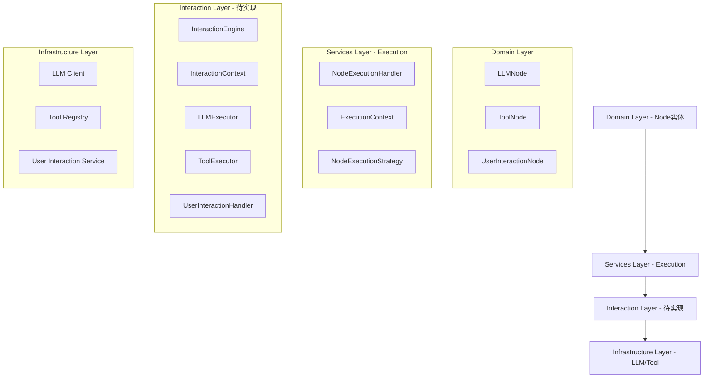
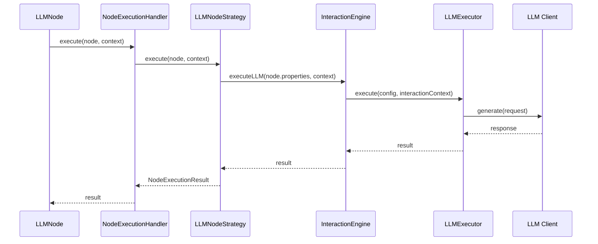
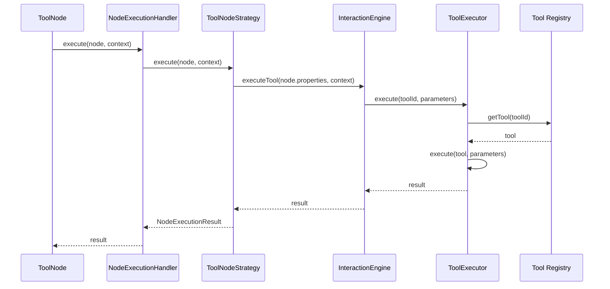
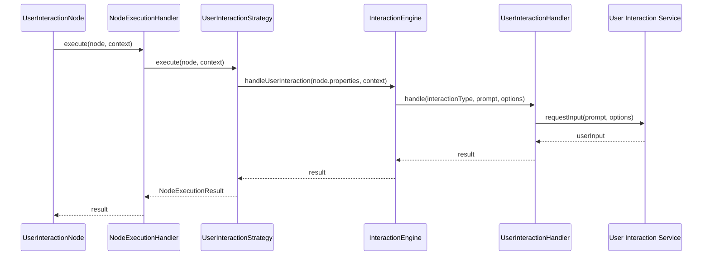

# Node 与 Interaction 模块集成设计

## 一、当前架构状态

### 1.1 Node 重构完成
所有节点已重构为**纯实体**，只负责存储配置，不包含执行逻辑：

- **LLMNode**: 存储 LLM 配置（model、prompt、temperature 等）
- **ToolNode**: 存储工具配置（toolId、parameters、timeout）
- **UserInteractionNode**: 存储用户交互配置（interactionType、prompt、options）

### 1.2 Execution 框架已建立
`src/services/workflow/execution` 目录提供执行框架：

- **NodeExecutionHandler**: 节点执行处理器（接口已定义，实现待完成）
- **ExecutionContext**: 执行上下文（变量管理、节点结果管理、服务访问）
- **具体执行策略**: 待实现

### 1.3 Interaction 模块待实现
Interaction 模块尚未创建，需要设计并实现。

## 二、架构分层设计



## 三、Interaction 模块设计

### 3.1 模块位置
```
src/services/interaction/
├── index.ts
├── interaction-engine.ts
├── interaction-context.ts
├── executors/
│   ├── llm-executor.ts
│   ├── tool-executor.ts
│   └── user-interaction-handler.ts
└── types/
    └── interaction-types.ts
```

### 3.2 核心组件

#### InteractionEngine
- **职责**: 协调 LLM、Tool、UserInteraction 的执行
- **位置**: `src/services/interaction/interaction-engine.ts`
- **依赖**: LLMExecutor、ToolExecutor、UserInteractionHandler

#### InteractionContext
- **职责**: 维护交互上下文（消息历史、变量、状态）
- **位置**: `src/services/interaction/interaction-context.ts`

#### Executors
- **LLMExecutor**: 执行 LLM 调用
- **ToolExecutor**: 执行工具调用
- **UserInteractionHandler**: 处理用户交互

## 四、集成方案

### 4.1 LLM Node 集成



**实现要点**:
1. `LLMNodeStrategy` 从 `NodeExecutionHandler` 接收 LLMNode
2. 提取 `node.properties` 中的配置（model、prompt 等）
3. 调用 `InteractionEngine.executeLLM()`
4. `InteractionEngine` 委托给 `LLMExecutor` 执行
5. 返回 `NodeExecutionResult`

### 4.2 Tool Node 集成



**实现要点**:
1. `ToolNodeStrategy` 从 `NodeExecutionHandler` 接收 ToolNode
2. 提取 `node.properties` 中的配置（toolId、parameters）
3. 调用 `InteractionEngine.executeTool()`
4. `InteractionEngine` 委托给 `ToolExecutor` 执行
5. 返回 `NodeExecutionResult`

### 4.3 User Interaction Node 集成



**实现要点**:
1. `UserInteractionStrategy` 从 `NodeExecutionHandler` 接收 UserInteractionNode
2. 提取 `node.properties` 中的配置（interactionType、prompt、options）
3. 调用 `InteractionEngine.handleUserInteraction()`
4. `InteractionEngine` 委托给 `UserInteractionHandler` 处理
5. 返回 `NodeExecutionResult`

## 五、执行策略设计

### 5.1 策略接口

```typescript
// src/services/workflow/execution/strategies/node-execution-strategy.ts

export interface INodeExecutionStrategy {
  /**
   * 执行节点
   */
  execute(node: Node, context: ExecutionContext): Promise<NodeExecutionResult>;
  
  /**
   * 验证是否可以执行
   */
  canExecute(node: Node): boolean;
}
```

### 5.2 具体策略

```typescript
// LLM Node 执行策略
export class LLMNodeStrategy implements INodeExecutionStrategy {
  constructor(
    private interactionEngine: IInteractionEngine
  ) {}
  
  canExecute(node: Node): boolean {
    return node instanceof LLMNode;
  }
  
  async execute(node: LLMNode, context: ExecutionContext): Promise<NodeExecutionResult> {
    const config = {
      model: node.model,
      prompt: node.prompt,
      temperature: node.temperature,
      maxTokens: node.maxTokens,
      // ... 其他配置
    };
    
    const result = await this.interactionEngine.executeLLM(config, context);
    
    return {
      success: result.success,
      output: result.output,
      error: result.error,
      metadata: result.metadata
    };
  }
}

// Tool Node 执行策略
export class ToolNodeStrategy implements INodeExecutionStrategy {
  constructor(
    private interactionEngine: IInteractionEngine
  ) {}
  
  canExecute(node: Node): boolean {
    return node instanceof ToolNode;
  }
  
  async execute(node: ToolNode, context: ExecutionContext): Promise<NodeExecutionResult> {
    const result = await this.interactionEngine.executeTool(
      node.toolId,
      node.parameters,
      context
    );
    
    return {
      success: result.success,
      output: result.output,
      error: result.error,
      metadata: result.metadata
    };
  }
}

// User Interaction Node 执行策略
export class UserInteractionStrategy implements INodeExecutionStrategy {
  constructor(
    private interactionEngine: IInteractionEngine
  ) {}
  
  canExecute(node: Node): boolean {
    return node instanceof UserInteractionNode;
  }
  
  async execute(node: UserInteractionNode, context: ExecutionContext): Promise<NodeExecutionResult> {
    const result = await this.interactionEngine.handleUserInteraction(
      node.interactionType,
      node.prompt,
      node.options,
      context
    );
    
    return {
      success: result.success,
      output: result.output,
      error: result.error,
      metadata: result.metadata
    };
  }
}
```

### 5.3 策略注册

```typescript
// src/services/workflow/execution/strategies/strategy-registry.ts

export class NodeExecutionStrategyRegistry {
  private strategies: Map<NodeType, INodeExecutionStrategy> = new Map();
  
  register(nodeType: NodeType, strategy: INodeExecutionStrategy): void {
    this.strategies.set(nodeType, strategy);
  }
  
  get(nodeType: NodeType): INodeExecutionStrategy | undefined {
    return this.strategies.get(nodeType);
  }
  
  has(nodeType: NodeType): boolean {
    return this.strategies.has(nodeType);
  }
}
```

## 六、NodeExecutionHandler 实现

```typescript
// src/services/workflow/execution/handlers/node-execution-handler.ts

@injectable()
export class NodeExecutionHandler implements INodeExecutionHandler {
  constructor(
    @inject('Logger') private readonly logger: ILogger,
    @inject('StrategyRegistry') private readonly strategyRegistry: NodeExecutionStrategyRegistry
  ) {}
  
  async execute(node: Node, context: ExecutionContext): Promise<NodeExecutionResult> {
    this.logger.debug('开始执行节点', {
      nodeId: node.nodeId.toString(),
      nodeType: node.type.toString(),
    });
    
    try {
      // 获取对应的执行策略
      const strategy = this.strategyRegistry.get(node.type);
      
      if (!strategy) {
        return {
          success: false,
          error: `节点类型 ${node.type.toString()} 没有对应的执行策略`,
          metadata: {
            nodeId: node.nodeId.toString(),
            nodeType: node.type.toString(),
          },
        };
      }
      
      // 执行节点
      const result = await strategy.execute(node, context);
      
      return result;
    } catch (error) {
      this.logger.error('节点执行失败', error instanceof Error ? error : new Error(String(error)), {
        nodeId: node.nodeId.toString(),
        nodeType: node.type.toString(),
      });
      
      return {
        success: false,
        error: error instanceof Error ? error.message : String(error),
        metadata: {
          nodeId: node.nodeId.toString(),
          nodeType: node.type.toString(),
        },
      };
    }
  }
  
  async canExecute(node: Node, context: ExecutionContext): Promise<boolean> {
    const strategy = this.strategyRegistry.get(node.type);
    return strategy ? strategy.canExecute(node) : false;
  }
}
```

## 七、依赖注入配置

```typescript
// src/di/interaction-container.ts

import { Container } from 'inversify';
import { IInteractionEngine, InteractionEngine } from '../services/interaction/interaction-engine';
import { ILLMExecutor, LLMExecutor } from '../services/interaction/executors/llm-executor';
import { IToolExecutor, ToolExecutor } from '../services/interaction/executors/tool-executor';
import { IUserInteractionHandler, UserInteractionHandler } from '../services/interaction/executors/user-interaction-handler';

export function configureInteractionContainer(container: Container): void {
  // Interaction Engine
  container.bind<IInteractionEngine>('InteractionEngine').to(InteractionEngine).inSingletonScope();
  
  // Executors
  container.bind<ILLMExecutor>('LLMExecutor').to(LLMExecutor).inSingletonScope();
  container.bind<IToolExecutor>('ToolExecutor').to(ToolExecutor).inSingletonScope();
  container.bind<IUserInteractionHandler>('UserInteractionHandler').to(UserInteractionHandler).inSingletonScope();
}
```

## 八、实施步骤

### 阶段 1: 创建 Interaction 模块基础
- [ ] 创建 `src/services/interaction/` 目录结构
- [ ] 定义 `InteractionContext` 接口和实现
- [ ] 定义 `IInteractionEngine` 接口

### 阶段 2: 实现 Executors
- [ ] 实现 `LLMExecutor`
- [ ] 实现 `ToolExecutor`
- [ ] 实现 `UserInteractionHandler`

### 阶段 3: 实现 InteractionEngine
- [ ] 实现 `InteractionEngine` 类
- [ ] 实现上下文管理
- [ ] 实现执行协调逻辑

### 阶段 4: 实现执行策略
- [ ] 创建 `NodeExecutionStrategy` 接口
- [ ] 实现 `LLMNodeStrategy`
- [ ] 实现 `ToolNodeStrategy`
- [ ] 实现 `UserInteractionStrategy`
- [ ] 实现 `NodeExecutionStrategyRegistry`

### 阶段 5: 集成到 Execution 层
- [ ] 更新 `NodeExecutionHandler` 使用策略注册表
- [ ] 配置依赖注入
- [ ] 编写单元测试

### 阶段 6: 集成测试
- [ ] 测试 LLM Node 执行流程
- [ ] 测试 Tool Node 执行流程
- [ ] 测试 User Interaction Node 执行流程
- [ ] 测试错误处理和重试

## 九、关键设计原则

1. **职责分离**: Node 只存储配置，Execution 负责协调，Interaction 负责执行
2. **策略模式**: 不同节点类型使用不同的执行策略
3. **依赖注入**: 所有组件通过依赖注入管理
4. **可扩展性**: 新增节点类型只需添加新的执行策略
5. **可测试性**: 每个组件都可以独立测试

## 十、与原设计文档的差异

| 方面 | 原设计 | 当前设计 |
|------|--------|----------|
| Node 设计 | 值对象（MarkerNode 模式） | 实体（Node 基类） |
| 执行位置 | Thread.executeNode() | NodeExecutionHandler + Strategy |
| Interaction 层 | 独立层 | Services 层的子模块 |
| 策略管理 | Thread 内部分发 | 策略注册表统一管理 |

**核心差异**:
- 原设计将 Node 设计为值对象，当前设计为实体
- 原设计在 Thread 中直接分发执行，当前设计使用策略模式
- 当前设计更符合 DDD 的分层架构原则