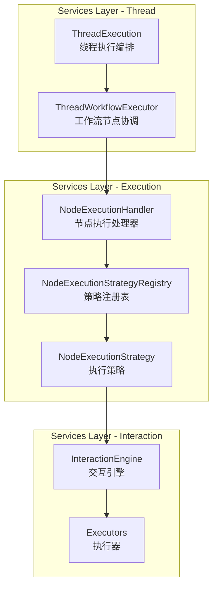
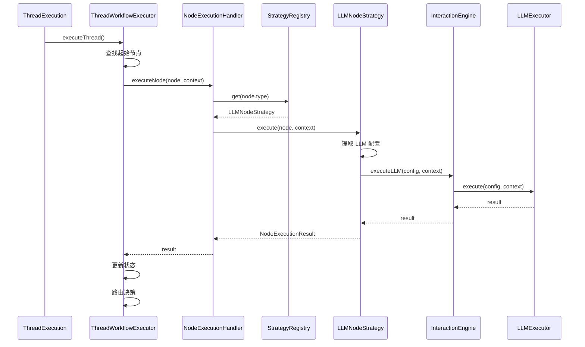

# Thread、Executor、Interaction 集成说明

## 一、集成架构



## 二、集成流程

### 2.1 完整执行链路

```
ThreadExecution
    ↓
ThreadWorkflowExecutor
    ↓
NodeExecutionHandler
    ↓
NodeExecutionStrategyRegistry
    ↓
NodeExecutionStrategy (LLM/Tool/UserInteraction)
    ↓
InteractionEngine
    ↓
Executors (LLMExecutor/ToolExecutor/UserInteractionHandler)
```

### 2.2 各层职责

#### Thread 层
- **ThreadExecution** ([`src/services/threads/thread-execution.ts`](src/services/threads/thread-execution.ts:46))
  - 负责线程执行编排
  - 管理线程生命周期（启动、完成、失败）
  - 创建检查点
  - 调用 ThreadWorkflowExecutor 执行工作流

- **ThreadWorkflowExecutor** ([`src/services/threads/thread-workflow-executor.ts`](src/services/threads/thread-workflow-executor.ts:88))
  - 协调工作流节点的执行顺序
  - 管理执行状态和历史记录
  - 处理节点执行错误
  - 调用 NodeExecutionHandler 执行单个节点

#### Execution 层
- **NodeExecutionHandler** ([`src/services/workflow/execution/handlers/node-execution-handler.ts`](src/services/workflow/execution/handlers/node-execution-handler.ts:39))
  - 接收节点执行请求
  - 从 StrategyRegistry 获取对应的执行策略
  - 委托给策略执行节点

- **NodeExecutionStrategyRegistry** ([`src/services/workflow/execution/strategies/strategy-registry.ts`](src/services/workflow/execution/strategies/strategy-registry.ts:13))
  - 管理不同节点类型的执行策略
  - 根据节点类型返回对应的策略

- **NodeExecutionStrategy** ([`src/services/workflow/execution/strategies/`](src/services/workflow/execution/strategies/))
  - LLMNodeStrategy - 处理 LLM 节点
  - ToolNodeStrategy - 处理工具节点
  - UserInteractionStrategy - 处理用户交互节点
  - 提取节点配置，调用 InteractionEngine

#### Interaction 层
- **InteractionEngine** ([`src/services/interaction/interaction-engine-impl.ts`](src/services/interaction/interaction-engine-impl.ts:23))
  - 协调 LLM、Tool、UserInteraction 的执行
  - 管理交互上下文
  - 委托给具体的 Executor

- **Executors** ([`src/services/interaction/executors/`](src/services/interaction/executors/))
  - LLMExecutor - 执行 LLM 调用
  - ToolExecutor - 执行工具调用
  - UserInteractionHandler - 处理用户交互

## 三、关键集成点

### 3.1 ThreadWorkflowExecutor → NodeExecutionHandler

**位置**: [`src/services/threads/thread-workflow-executor.ts:186`](src/services/threads/thread-workflow-executor.ts:186)

```typescript
const nodeResult = await this.executeNodeWithRetry(node, currentState, threadId, {
  timeout: nodeTimeout,
  maxRetries: maxNodeRetries,
  retryDelay: nodeRetryDelay,
});
```

**说明**: ThreadWorkflowExecutor 调用 NodeExecutionHandler 执行节点，支持重试和超时配置。

### 3.2 NodeExecutionHandler → NodeExecutionStrategy

**位置**: [`src/services/workflow/execution/handlers/node-execution-handler.ts:50`](src/services/workflow/execution/handlers/node-execution-handler.ts:50)

```typescript
const strategy = this.strategyRegistry.get(node.type);
const result = await strategy.execute(node, context);
```

**说明**: NodeExecutionHandler 从策略注册表获取对应的策略，然后调用策略执行节点。

### 3.3 NodeExecutionStrategy → InteractionEngine

**位置**: [`src/services/workflow/execution/strategies/llm-node-strategy.ts:88`](src/services/workflow/execution/strategies/llm-node-strategy.ts:88)

```typescript
const result = await this.interactionEngine.executeLLM(config, interactionContext);
```

**说明**: 策略提取节点配置，调用 InteractionEngine 执行具体逻辑。

### 3.4 InteractionEngine → Executors

**位置**: [`src/services/interaction/interaction-engine-impl.ts:48`](src/services/interaction/interaction-engine-impl.ts:48)

```typescript
const result = await this.llmExecutor.execute(config, context);
```

**说明**: InteractionEngine 委托给具体的 Executor 执行。

## 四、上下文传递

### 4.1 上下文类型

| 上下文类型 | 定义位置 | 用途 |
|-----------|---------|------|
| ThreadWorkflowState | [`src/domain/threads/value-objects/thread-workflow-state.ts`](src/domain/threads/value-objects/thread-workflow-state.ts) | 线程工作流状态 |
| ExecutionContext | [`src/services/workflow/execution/context/execution-context.ts`](src/services/workflow/execution/context/execution-context.ts) | 节点执行上下文 |
| InteractionContext | [`src/services/interaction/interaction-context.ts`](src/services/interaction/interaction-context.ts) | 交互上下文 |

### 4.2 上下文转换

```
ThreadWorkflowState (线程状态)
    ↓ buildNodeContext()
ExecutionContext (节点执行上下文)
    ↓ getMetadata('interactionContext')
InteractionContext (交互上下文)
```

**说明**: 
- ThreadWorkflowExecutor 将 ThreadWorkflowState 转换为 ExecutionContext
- NodeExecutionStrategy 从 ExecutionContext 中获取或创建 InteractionContext
- InteractionContext 存储在 ExecutionContext 的 metadata 中

## 五、依赖注入配置

**位置**: [`src/di/bindings/services-bindings.ts`](src/di/bindings/services-bindings.ts:158)

```typescript
// Interaction 模块绑定
bind('InteractionEngine').to(InteractionEngine).inSingletonScope();
bind('LLMExecutor').to(LLMExecutor).inSingletonScope();
bind('ToolExecutor').to(ToolExecutor).inSingletonScope();
bind('UserInteractionHandler').to(UserInteractionHandler).inSingletonScope();

// 策略注册表
bind('NodeExecutionStrategyRegistry').to(NodeExecutionStrategyRegistry).inSingletonScope();

// 策略
bind('LLMNodeStrategy').to(LLMNodeStrategy).inSingletonScope();
bind('ToolNodeStrategy').to(ToolNodeStrategy).inSingletonScope();
bind('UserInteractionStrategy').to(UserInteractionStrategy).inSingletonScope();

// 注册策略到注册表
bind('NodeExecutionStrategyRegistryInitializer').toDynamicValue((context: any) => {
  const strategyRegistry = context.container.get('NodeExecutionStrategyRegistry');
  const llmStrategy = context.container.get('LLMNodeStrategy');
  const toolStrategy = context.container.get('ToolNodeStrategy');
  const userInteractionStrategy = context.container.get('UserInteractionStrategy');

  strategyRegistry.register(NodeType.llm(), llmStrategy);
  strategyRegistry.register(NodeType.tool(), toolStrategy);
  strategyRegistry.register(NodeType.userInteraction(), userInteractionStrategy);

  return strategyRegistry;
}).inSingletonScope();
```

## 六、执行示例

### 6.1 LLM 节点执行流程



### 6.2 关键代码片段

**ThreadWorkflowExecutor 执行节点**:
```typescript
// src/services/threads/thread-workflow-executor.ts:186
const nodeResult = await this.executeNodeWithRetry(node, currentState, threadId, {
  timeout: nodeTimeout,
  maxRetries: maxNodeRetries,
  retryDelay: nodeRetryDelay,
});
```

**NodeExecutionHandler 分发策略**:
```typescript
// src/services/workflow/execution/handlers/node-execution-handler.ts:50
const strategy = this.strategyRegistry.get(node.type);
const result = await strategy.execute(node, context);
```

**LLMNodeStrategy 调用 InteractionEngine**:
```typescript
// src/services/workflow/execution/strategies/llm-node-strategy.ts:88
const result = await this.interactionEngine.executeLLM(config, interactionContext);
```

## 七、设计优势

1. **职责分离**: 每层都有明确的职责，易于维护和测试
2. **策略模式**: 不同节点类型使用不同的执行策略，易于扩展
3. **依赖注入**: 所有组件通过依赖注入管理，易于替换和测试
4. **上下文隔离**: 不同层使用不同的上下文，避免耦合
5. **可扩展性**: 新增节点类型只需添加新的策略和 Executor

## 八、当前状态

- ✅ 框架已建立
- ✅ 依赖注入已配置
- ✅ 策略注册表已实现
- ⏳ Executors 具体实现待完成
- ⏳ InteractionEngine 协调逻辑待完善