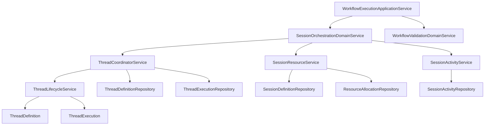
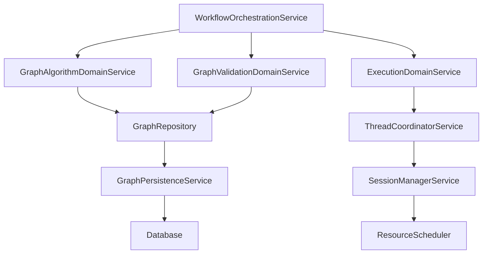

# 优化架构设计方案

## 概述

基于您对Workflow重构的反馈，本文档重新设计了一个更合理的架构方案。核心思想是避免单一实体过于庞大，通过合理的职责拆分和模块化设计，实现可维护、可扩展的架构。

## Thread和Session模块优化分析

### Thread实体职责分析

从[`src/domain/threads/entities/thread.ts`](src/domain/threads/entities/thread.ts:1)可以看出，当前Thread实体承担了过多职责：

1. **生命周期管理**：创建、启动、暂停、恢复、完成、失败、取消
2. **状态管理**：状态转换、时间管理、错误处理
3. **元数据管理**：标题、描述、优先级、元数据
4. **验证逻辑**：状态转换验证、时间逻辑验证

### Session实体职责分析

从[`src/domain/sessions/entities/session.ts`](src/domain/sessions/entities/session.ts:1)可以看出，当前Session实体也存在职责过重问题：

1. **会话管理**：创建、状态变更、配置管理
2. **资源管理**：消息数量限制、超时检查
3. **活动跟踪**：最后活动时间、消息计数
4. **验证逻辑**：状态转换验证、配置限制验证

## Thread模块优化拆分方案

### Thread实体拆分设计

#### 1. ThreadDefinition（线程定义）
**职责**：线程的基本定义和元数据管理

```typescript
interface ThreadDefinition {
  // 基本属性
  id: ID;
  sessionId: ID;
  workflowId?: ID;
  title?: string;
  description?: string;
  priority: ThreadPriority;
  metadata: Record<string, unknown>;
  
  // 创建信息
  createdAt: Timestamp;
  createdBy?: ID;
}
```

#### 2. ThreadExecution（线程执行）
**职责**：线程的执行状态和进度管理

```typescript
interface ThreadExecution {
  // 执行状态
  status: ThreadStatus;
  progress: number;
  currentStep?: string;
  
  // 时间信息
  startedAt?: Timestamp;
  completedAt?: Timestamp;
  estimatedCompletionTime?: Timestamp;
  
  // 错误处理
  errorMessage?: string;
  retryCount: number;
  
  // 执行上下文
  executionContext: ExecutionContext;
}
```

#### 3. ThreadLifecycleService（线程生命周期服务）
**职责**：管理线程的生命周期操作

```typescript
interface ThreadLifecycleService {
  // 生命周期操作
  start(threadId: ID, context: ExecutionContext): Promise<void>;
  pause(threadId: ID, reason?: string): Promise<void>;
  resume(threadId: ID, reason?: string): Promise<void>;
  complete(threadId: ID, result?: ExecutionResult): Promise<void>;
  fail(threadId: ID, error: Error): Promise<void>;
  cancel(threadId: ID, reason?: string): Promise<void>;
  
  // 状态查询
  getStatus(threadId: ID): Promise<ThreadStatus>;
  getProgress(threadId: ID): Promise<number>;
  getExecutionContext(threadId: ID): Promise<ExecutionContext>;
}
```

#### 4. ThreadCoordinatorService（线程协调服务）
**职责**：协调多个线程的执行

```typescript
interface ThreadCoordinatorService {
  // 线程协调
  coordinateExecution(workflowId: ID, context: ExecutionContext): Promise<ID>;
  forkThread(parentThreadId: ID, forkPoint: string): Promise<ID>;
  joinThreads(threadIds: ID[]): Promise<ExecutionResult>;
  
  // 资源管理
  allocateResources(threadId: ID, requirements: ResourceRequirement[]): Promise<void>;
  releaseResources(threadId: ID): Promise<void>;
  
  // 监控
  monitorThreadPool(sessionId: ID): Promise<ThreadPoolStatus>;
}
```

## Session模块优化拆分方案

### Session实体拆分设计

#### 1. SessionDefinition（会话定义）
**职责**：会话的基本定义和配置管理

```typescript
interface SessionDefinition {
  // 基本属性
  id: ID;
  userId?: ID;
  title?: string;
  config: SessionConfig;
  
  // 创建信息
  createdAt: Timestamp;
  createdBy?: ID;
  
  // 元数据
  metadata: Record<string, unknown>;
}
```

#### 2. SessionActivity（会话活动）
**职责**：会话的活动跟踪和统计

```typescript
interface SessionActivity {
  // 活动跟踪
  lastActivityAt: Timestamp;
  messageCount: number;
  threadCount: number;
  
  // 统计信息
  totalExecutionTime: number;
  successCount: number;
  failureCount: number;
  
  // 性能指标
  averageResponseTime: number;
  throughput: number;
}
```

#### 3. SessionResourceService（会话资源服务）
**职责**：管理会话的资源分配和限制

```typescript
interface SessionResourceService {
  // 资源分配
  allocateResources(sessionId: ID, requirements: ResourceRequirement[]): Promise<ResourceAllocation>;
  releaseResources(sessionId: ID, allocation: ResourceAllocation): Promise<void>;
  
  // 限制检查
  checkResourceLimits(sessionId: ID): Promise<ResourceLimits>;
  canCreateThread(sessionId: ID): Promise<boolean>;
  canSendMessage(sessionId: ID): Promise<boolean>;
  
  // 配额管理
  getRemainingQuota(sessionId: ID): Promise<SessionQuota>;
  updateQuotaUsage(sessionId: ID, usage: QuotaUsage): Promise<void>;
}
```

#### 4. SessionOrchestrationService（会话编排服务）
**职责**：编排会话内的多个线程执行

```typescript
interface SessionOrchestrationService {
  // 会话编排
  orchestrateWorkflowExecution(sessionId: ID, workflowId: ID, context: ExecutionContext): Promise<ExecutionResult>;
  orchestrateParallelExecution(sessionId: ID, workflowIds: ID[], context: ExecutionContext): Promise<ExecutionResult[]>;
  
  // 线程管理
  createThread(sessionId: ID, workflowId?: ID): Promise<ID>;
  manageThreadLifecycle(sessionId: ID, threadId: ID, action: ThreadAction): Promise<void>;
  
  // 状态同步
  syncSessionState(sessionId: ID): Promise<void>;
  broadcastStateChange(sessionId: ID, change: StateChange): Promise<void>;
}
```

## Thread和Session协作机制

### 协作架构设计

#### 1. 层次关系
```
SessionOrchestrationService (会话层)
├── ThreadCoordinatorService (线程协调层)
│   ├── ThreadLifecycleService (线程生命周期层)
│   │   ├── ThreadDefinition (线程定义)
│   │   └── ThreadExecution (线程执行)
│   └── SessionResourceService (资源服务层)
└── SessionActivity (会话活动层)
```

#### 2. 协作流程

**工作流执行流程**：
1. SessionOrchestrationService接收执行请求
2. 通过SessionResourceService检查资源可用性
3. 调用ThreadCoordinatorService创建线程
4. ThreadLifecycleService管理线程执行
5. 返回执行结果

**线程生命周期流程**：
1. ThreadLifecycleService处理状态变更
2. 通知ThreadCoordinatorService协调相关线程
3. SessionResourceService更新资源使用情况
4. SessionActivity记录活动信息

#### 3. 事件驱动协作

```typescript
// 线程状态变更事件
interface ThreadStatusChangedEvent {
  threadId: ID;
  sessionId: ID;
  oldStatus: ThreadStatus;
  newStatus: ThreadStatus;
  timestamp: Timestamp;
}

// 会话活动更新事件
interface SessionActivityUpdatedEvent {
  sessionId: ID;
  activityType: 'message' | 'thread' | 'execution';
  count: number;
  timestamp: Timestamp;
}

// 资源分配事件
interface ResourceAllocatedEvent {
  sessionId: ID;
  threadId: ID;
  resources: ResourceRequirement[];
  timestamp: Timestamp;
}
```

### Service模块协作设计

#### 1. 领域服务协作

```typescript
@injectable()
export class SessionOrchestrationDomainService {
  constructor(
    private readonly threadCoordinator: ThreadCoordinatorService,
    private readonly sessionResource: SessionResourceService,
    private readonly sessionActivity: SessionActivityService
  ) {}
  
  async executeWorkflow(sessionId: ID, workflowId: ID, context: ExecutionContext): Promise<ExecutionResult> {
    // 1. 检查资源限制
    const canExecute = await this.sessionResource.canCreateThread(sessionId);
    if (!canExecute) {
      throw new ResourceLimitExceededError('会话资源限制');
    }
    
    // 2. 创建线程
    const threadId = await this.threadCoordinator.coordinateExecution(workflowId, context);
    
    // 3. 记录活动
    await this.sessionActivity.recordThreadCreation(sessionId, threadId);
    
    // 4. 等待执行完成
    return await this.threadCoordinator.waitForCompletion(threadId);
  }
}
```

#### 2. 应用服务协作

```typescript
@injectable()
export class WorkflowExecutionApplicationService {
  constructor(
    private readonly sessionOrchestration: SessionOrchestrationDomainService,
    private readonly workflowValidation: WorkflowValidationDomainService
  ) {}
  
  async execute(sessionId: ID, workflowId: ID, input: unknown): Promise<ExecutionResult> {
    // 1. 验证工作流
    await this.workflowValidation.validate(workflowId);
    
    // 2. 创建执行上下文
    const context = ExecutionContext.create(sessionId, workflowId, input);
    
    // 3. 执行工作流
    return await this.sessionOrchestration.executeWorkflow(sessionId, workflowId, context);
  }
}
```

## 整体架构设计方案

### 模块依赖关系



### 实施路径

#### 第一阶段：实体拆分（2-3周）
- 拆分Thread实体为ThreadDefinition和ThreadExecution
- 拆分Session实体为SessionDefinition和SessionActivity
- 创建相应的仓储接口

#### 第二阶段：服务重构（2-3周）
- 实现ThreadLifecycleService和ThreadCoordinatorService
- 实现SessionResourceService和SessionOrchestrationService
- 重构现有代码使用新服务

#### 第三阶段：集成优化（1-2周）
- 集成测试新架构
- 性能优化
- 文档更新

## 优势分析

### 1. 职责清晰
- 每个实体和服务都有明确的单一职责
- 避免了单一实体过于庞大的问题

### 2. 可维护性
- 模块化设计便于理解和修改
- 每个模块都可以独立测试

### 3. 扩展性
- 支持新增功能而不修改现有代码
- 插件化架构便于功能扩展

### 4. 性能优化
- 专门的资源服务优化资源分配
- 并行处理支持高性能执行

## 总结

通过合理的Thread和Session模块拆分，我们实现了：

1. **职责分离**：将庞大的实体拆分为多个专注的组件
2. **协作机制**：清晰的服务协作和事件驱动机制
3. **可扩展性**：支持未来的功能扩展和性能优化
4. **可维护性**：每个模块都相对简单，易于理解和维护

这种设计既解决了单一实体过于庞大的问题，又为Thread和Session的协作提供了清晰的架构基础。

## 当前WorkflowGraph实体分析

### 职责范围分析

从[`src/domain/workflow/entities/workflow-graph.ts`](src/domain/workflow/entities/workflow-graph.ts:1)可以看出，当前WorkflowGraph实体承担了过多职责：

1. **图结构管理**：节点和边的增删改查
2. **图算法实现**：拓扑排序、循环检测、连通分量
3. **图验证逻辑**：结构验证、有效性验证
4. **图定义和布局**：定义和布局信息管理

### 问题识别

1. **单一职责原则违反**：一个实体承担了图结构、算法、验证等多个职责
2. **可维护性差**：实体过于庞大，修改一个功能可能影响其他功能
3. **扩展性受限**：新增图算法或验证规则需要修改核心实体
4. **测试困难**：庞大的实体难以进行单元测试

## 优化实体拆分方案

### 核心设计原则

1. **单一职责原则**：每个实体只负责一个明确的职责
2. **高内聚低耦合**：相关功能聚合在一起，不同模块间松耦合
3. **可扩展性**：支持新增功能而不修改现有代码
4. **可测试性**：每个模块都可以独立测试

### 实体拆分设计

#### 1. WorkflowDefinition（工作流定义）
**职责**：工作流的基本定义和元数据管理

```typescript
interface WorkflowDefinition {
  // 基本属性
  id: ID;
  name: string;
  description: string;
  type: WorkflowType;
  config: WorkflowConfig;
  
  // 元数据
  tags: string[];
  metadata: Record<string, unknown>;
  
  // 统计信息
  executionCount: number;
  successRate: number;
  averageExecutionTime: number;
}
```

#### 2. WorkflowGraph（图结构）
**职责**：纯粹的图结构管理，不包含算法逻辑

```typescript
interface WorkflowGraph {
  // 图结构
  nodes: Map<string, Node>;
  edges: Map<string, Edge>;
  
  // 基本操作
  addNode(node: Node): void;
  removeNode(nodeId: ID): void;
  addEdge(edge: Edge): void;
  removeEdge(edgeId: ID): void;
  
  // 结构查询
  getNode(nodeId: ID): Node | null;
  getEdge(edgeId: ID): Edge | null;
  getIncomingEdges(nodeId: ID): Edge[];
  getOutgoingEdges(nodeId: ID): Edge[];
}
```

#### 3. GraphAlgorithmService（图算法服务）
**职责**：提供各种图算法功能

```typescript
interface GraphAlgorithmService {
  // 拓扑相关
  topologicalSort(graph: WorkflowGraph): Node[];
  hasCycle(graph: WorkflowGraph): boolean;
  
  // 路径相关
  findPath(graph: WorkflowGraph, start: ID, end: ID): Node[];
  findAllPaths(graph: WorkflowGraph, start: ID, end: ID): Node[][];
  
  // 连通性相关
  getConnectedComponents(graph: WorkflowGraph): Node[][];
  isConnected(graph: WorkflowGraph): boolean;
  
  // 分析相关
  analyzeGraphComplexity(graph: WorkflowGraph): GraphComplexity;
}
```

#### 4. GraphValidationService（图验证服务）
**职责**：提供图结构验证功能

```typescript
interface GraphValidationService {
  // 结构验证
  validateGraphStructure(graph: WorkflowGraph): ValidationResult;
  validateNodeConnections(graph: WorkflowGraph): ValidationResult;
  
  // 业务规则验证
  validateBusinessRules(graph: WorkflowGraph, rules: BusinessRule[]): ValidationResult;
  validateExecutionConstraints(graph: WorkflowGraph): ValidationResult;
  
  // 完整性验证
  validateGraphIntegrity(graph: WorkflowGraph): ValidationResult;
}
```

#### 5. WorkflowExecutionPlan（执行计划）
**职责**：基于图结构生成执行计划

```typescript
interface WorkflowExecutionPlan {
  // 执行步骤
  steps: ExecutionStep[];
  
  // 执行策略
  strategy: ExecutionStrategy;
  
  // 资源需求
  resourceRequirements: ResourceRequirement[];
  
  // 生成执行计划
  generatePlan(graph: WorkflowGraph, context: ExecutionContext): ExecutionPlan;
  optimizePlan(plan: ExecutionPlan): ExecutionPlan;
}
```

## Service模块架构设计

### 分层架构设计

#### 1. 领域服务层（Domain Services）
位于领域层，专注于业务逻辑实现

```typescript
// 图算法领域服务
@injectable()
export class GraphAlgorithmDomainService {
  constructor(
    private readonly graphRepository: GraphRepository
  ) {}
  
  async topologicalSort(workflowId: ID): Promise<Node[]> {
    const graph = await this.graphRepository.findById(workflowId);
    return this.topologicalSortAlgorithm(graph);
  }
  
  private topologicalSortAlgorithm(graph: WorkflowGraph): Node[] {
    // 实现拓扑排序算法
  }
}

// 图验证领域服务
@injectable()
export class GraphValidationDomainService {
  async validateGraph(workflowId: ID): Promise<ValidationResult> {
    const graph = await this.graphRepository.findById(workflowId);
    return this.validateGraphStructure(graph);
  }
}
```

#### 2. 应用服务层（Application Services）
位于应用层，协调多个领域服务完成业务用例

```typescript
// 工作流编排服务
@injectable()
export class WorkflowOrchestrationService {
  constructor(
    private readonly algorithmService: GraphAlgorithmDomainService,
    private readonly validationService: GraphValidationDomainService,
    private readonly executionService: ExecutionDomainService
  ) {}
  
  async executeWorkflow(workflowId: ID, context: ExecutionContext): Promise<ExecutionResult> {
    // 1. 验证图结构
    const validationResult = await this.validationService.validateGraph(workflowId);
    if (!validationResult.isValid) {
      throw new ValidationError(validationResult.errors);
    }
    
    // 2. 生成执行计划
    const executionPlan = await this.generateExecutionPlan(workflowId, context);
    
    // 3. 执行工作流
    return await this.executionService.execute(executionPlan, context);
  }
  
  private async generateExecutionPlan(workflowId: ID, context: ExecutionContext): Promise<ExecutionPlan> {
    const topologicalOrder = await this.algorithmService.topologicalSort(workflowId);
    // 基于拓扑排序生成执行计划
  }
}
```

#### 3. 基础设施服务层（Infrastructure Services）
位于基础设施层，提供技术实现

```typescript
// 图算法基础设施服务（可替换的具体实现）
@injectable()
export class GraphAlgorithmInfrastructureService implements GraphAlgorithmService {
  // 实现具体的图算法
}

// 图持久化服务
@injectable()
export class GraphPersistenceService {
  async saveGraph(graph: WorkflowGraph): Promise<void> {
    // 实现图结构的持久化
  }
  
  async loadGraph(workflowId: ID): Promise<WorkflowGraph> {
    // 实现图结构的加载
  }
}
```

### Service模块交互设计

#### 模块依赖关系



#### 执行流程

1. **接收执行请求**：WorkflowOrchestrationService接收执行请求
2. **验证图结构**：调用GraphValidationDomainService验证图有效性
3. **生成执行计划**：调用GraphAlgorithmDomainService生成拓扑排序
4. **协调执行**：调用ExecutionDomainService协调Thread执行
5. **返回结果**：返回执行结果

## 简化的实施路径

### 第一阶段：实体拆分（2-3周）

#### 目标
将庞大的WorkflowGraph实体拆分为多个专注的实体

#### 实施步骤
1. **创建新实体**
   - WorkflowDefinition：工作流定义实体
   - WorkflowGraph：纯粹的图结构实体
   - GraphAlgorithmService：图算法服务
   - GraphValidationService：图验证服务

2. **迁移现有功能**
   - 将图算法功能迁移到GraphAlgorithmService
   - 将验证逻辑迁移到GraphValidationService
   - 保留WorkflowGraph只负责图结构管理

3. **更新依赖关系**
   - 更新现有代码使用新的服务
   - 确保向后兼容性

### 第二阶段：Service模块重构（2-3周）

#### 目标
建立清晰的分层Service架构

#### 实施步骤
1. **创建领域服务**
   - GraphAlgorithmDomainService
   - GraphValidationDomainService
   - ExecutionDomainService

2. **创建应用服务**
   - WorkflowOrchestrationService
   - WorkflowManagementService

3. **重构基础设施**
   - GraphPersistenceService
   - GraphAlgorithmInfrastructureService

### 第三阶段：集成和优化（1-2周）

#### 目标
集成新架构，优化性能

#### 实施步骤
1. **集成测试**
   - 确保新架构与现有系统集成
   - 验证功能完整性

2. **性能优化**
   - 优化图算法性能
   - 优化服务调用链

3. **文档更新**
   - 更新架构文档
   - 编写使用指南

## 优势分析

### 1. 可维护性提升
- **职责清晰**：每个实体和服务都有明确的单一职责
- **模块化**：功能模块化，便于理解和修改
- **测试友好**：每个模块都可以独立测试

### 2. 扩展性增强
- **插件化架构**：新的图算法可以作为插件添加
- **策略模式**：支持不同的执行策略
- **接口抽象**：便于替换具体实现

### 3. 性能优化
- **算法优化**：专门的图算法服务可以优化性能
- **缓存策略**：可以针对不同服务实现缓存
- **并行处理**：算法服务可以并行执行

### 4. 团队协作
- **清晰边界**：不同团队可以负责不同模块
- **并行开发**：多个模块可以并行开发
- **知识传递**：模块化设计便于知识传递

## 总结

通过合理的实体拆分和Service模块设计，我们实现了：

1. **职责分离**：将庞大的WorkflowGraph实体拆分为多个专注的实体和服务
2. **分层架构**：清晰的领域层、应用层、基础设施层分离
3. **可扩展性**：支持新增功能而不修改现有代码
4. **可维护性**：每个模块都相对简单，易于理解和维护

这种设计既解决了单一实体过于庞大的问题，又为未来的功能扩展提供了良好的基础。实施路径采用渐进式重构，确保系统稳定性。

## 下一步行动

1. **详细设计**：为每个新实体和服务进行详细设计
2. **实施计划**：制定更详细的实施时间表
3. **团队培训**：确保团队理解新架构设计
4. **工具支持**：提供必要的开发工具和模板