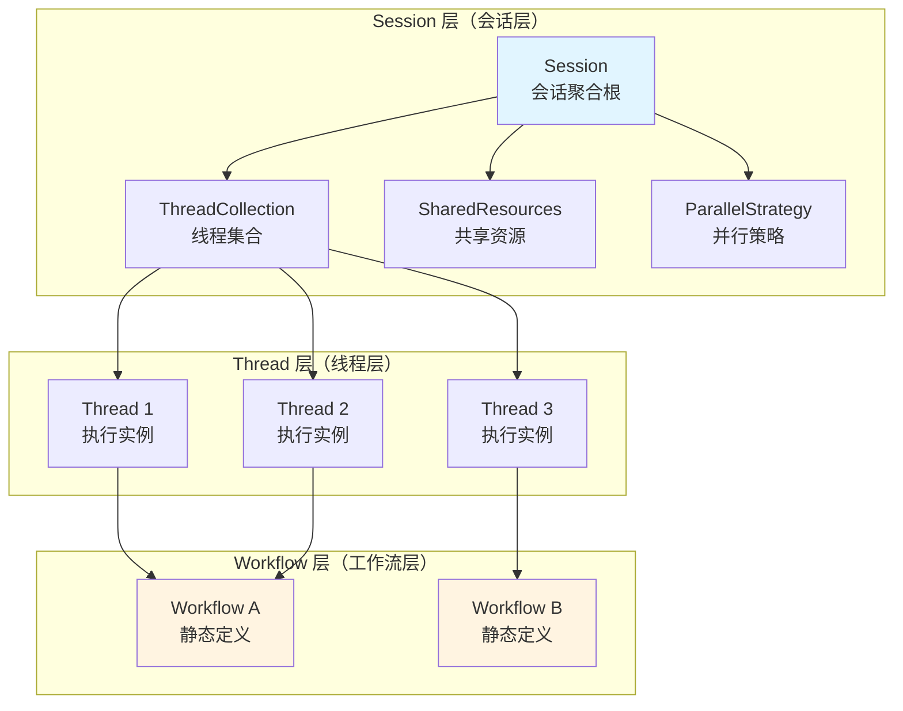
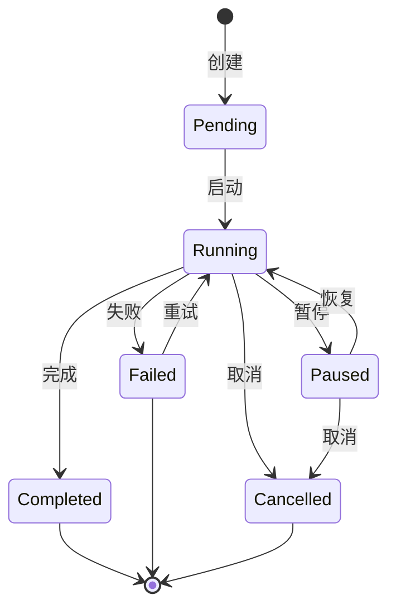
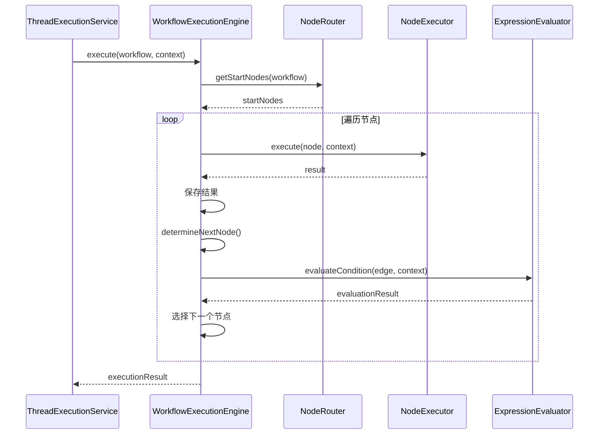
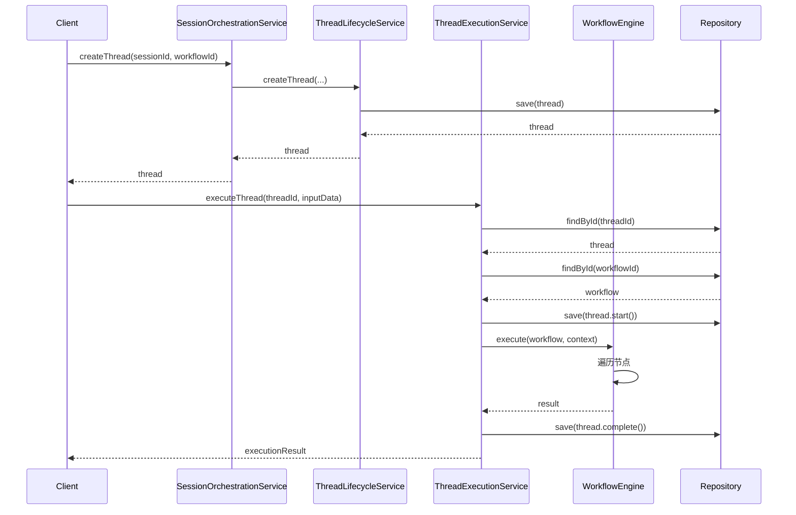
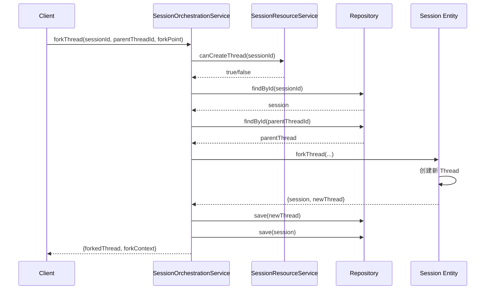
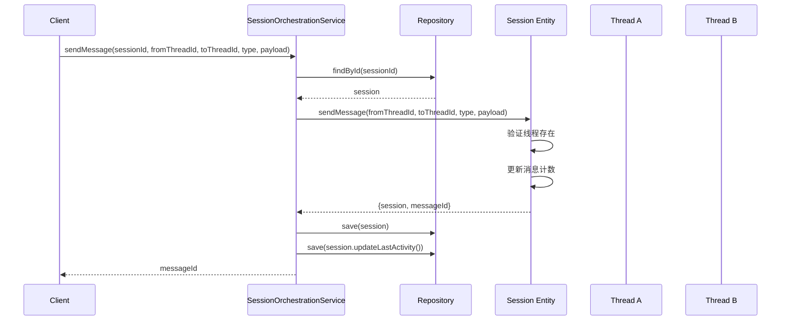

# Session、Thread、Workflow 三层关系分析

## 概述

本文档详细分析了 Modular Agent Framework 中 Session、Thread、Workflow 三层架构的关系和交互模式。

## 架构层次



## 一、Domain 层实体分析

### 1.1 Workflow（工作流）

**位置**：[`src/domain/workflow/entities/workflow.ts`](../../src/domain/workflow/entities/workflow.ts)

**核心职责**：
- 工作流图的静态定义
- 节点和边的结构管理
- 工作流元数据和配置

**关键特性**：
- **聚合根实体**：是工作流聚合的唯一根
- **不可变性**：所有修改操作返回新实例
- **编辑限制**：只能在草稿（draft）状态下编辑
- **静态定义**：不包含执行状态或进度信息

**核心属性**：
```typescript
interface WorkflowProps {
  readonly id: ID;
  readonly definition: WorkflowDefinition;  // 工作流定义
  readonly graph: WorkflowGraphData;        // 节点和边
  readonly subWorkflowReferences: Map<string, WorkflowReference>;
  readonly createdAt: Timestamp;
  readonly updatedAt: Timestamp;
  readonly version: Version;
}
```

**不负责**：
- ❌ 执行状态管理（由 Thread 负责）
- ❌ 进度跟踪（由 Thread 负责）
- ❌ 复杂的验证逻辑（由 GraphValidationService 负责）
- ❌ 图遍历算法（由 GraphAlgorithmService 负责）

### 1.2 Thread（线程）

**位置**：[`src/domain/threads/entities/thread.ts`](../../src/domain/threads/entities/thread.ts)

**核心职责**：
- 工作流的执行实例
- 执行状态管理
- 执行上下文维护
- 进度跟踪

**关键特性**：
- **聚合根实体**：是线程聚合的唯一根
- **执行导向**：专注于串行执行流程协调
- **状态驱动**：管理完整的执行生命周期
- **上下文隔离**：每个线程有独立的执行上下文

**核心属性**：
```typescript
interface ThreadProps {
  readonly id: ID;
  readonly sessionId: ID;           // 所属会话
  readonly workflowId: ID;          // 关联的工作流
  readonly status: ThreadStatus;    // 执行状态
  readonly priority: ThreadPriority;
  readonly definition: ThreadDefinition;
  readonly execution: ThreadExecution;  // 执行信息
  readonly deletionStatus: DeletionStatus;
  readonly createdAt: Timestamp;
  readonly updatedAt: Timestamp;
  readonly version: Version;
}
```

**执行状态流转**：


**核心方法**：
- `start()`: 启动线程
- `pause()`: 暂停线程
- `resume()`: 恢复线程
- `complete()`: 完成线程
- `fail()`: 标记失败
- `cancel()`: 取消线程
- `updateProgress()`: 更新进度

### 1.3 Session（会话）

**位置**：[`src/domain/sessions/entities/session.ts`](../../src/domain/sessions/entities/session.ts)

**核心职责**：
- 多线程管理器
- 线程集合管理
- 共享资源管理
- 线程间通信协调
- 并行策略控制

**关键特性**：
- **聚合根实体**：是会话聚合的唯一根
- **容器角色**：作为线程的容器和管理者
- **资源共享**：管理线程间的共享资源
- **通信协调**：支持线程间消息传递

**核心属性**：
```typescript
interface SessionProps {
  readonly id: ID;
  readonly userId?: ID;
  readonly status: SessionStatus;
  readonly config: SessionConfig;
  readonly activity: SessionActivity;
  readonly threads: ThreadCollection;        // 线程集合
  readonly sharedResources: SharedResources; // 共享资源
  readonly parallelStrategy: ParallelStrategy; // 并行策略
  readonly deletionStatus: DeletionStatus;
  readonly createdAt: Timestamp;
  readonly updatedAt: Timestamp;
  readonly version: Version;
}
```

**核心方法**：
- `addThread()`: 添加线程
- `removeThread()`: 移除线程
- `forkThread()`: 分支线程
- `sendMessage()`: 发送线程间消息
- `broadcastMessage()`: 广播消息
- `setSharedResource()`: 设置共享资源
- `updateParallelStrategy()`: 更新并行策略

## 二、Application 层服务分析

### 2.1 SessionOrchestrationService

**位置**：[`src/application/sessions/services/session-orchestration-service.ts`](../../src/application/sessions/services/session-orchestration-service.ts)

**核心职责**：
- 会话级别的编排和管理
- 线程创建和生命周期管理
- 线程 fork 操作
- 资源配额管理
- 线程间通信协调

**关键方法**：
```typescript
// 创建线程
async createThread(sessionId, workflowId, priority?, title?, description?, metadata?)

// 管理线程生命周期
async manageThreadLifecycle(sessionId, threadId, action, userId?, reason?)

// Fork 线程
async forkThread(sessionId, parentThreadId, forkPoint, forkStrategy?, forkOptions?)

// 发送线程间消息
async sendMessage(sessionId, fromThreadId, toThreadId, type, payload)

// 广播消息
async broadcastMessage(sessionId, fromThreadId, type, payload)

// 共享资源管理
async setSharedResource(sessionId, key, value)
async getSharedResource(sessionId, key)
```

**依赖关系**：
- `ISessionRepository`: 会话持久化
- `IThreadRepository`: 线程持久化
- `SessionResourceService`: 资源配额管理
- `ThreadLifecycleService`: 线程生命周期管理

### 2.2 ThreadExecutionService

**位置**：[`src/application/threads/services/thread-execution-service.ts`](../../src/application/threads/services/thread-execution-service.ts)

**核心职责**：
- 线程执行编排
- 工作流执行调用
- 线程状态管理
- 执行结果处理
- 检查点恢复
- 子工作流执行

**关键方法**：
```typescript
// 执行线程
async executeThread(threadId, inputData, options?)

// 从检查点恢复
async resumeThreadFromCheckpoint(threadId, checkpointId, options?)

// 获取检查点
async getThreadCheckpoints(threadId)
async getLatestCheckpoint(threadId)

// 取消执行
async cancelThreadExecution(threadId, userId?, reason?)

// 执行子工作流
async executeSubWorkflow(parentThread, referenceId, config, parentContext)
```

**依赖关系**：
- `IThreadRepository`: 线程持久化
- `IWorkflowRepository`: 工作流持久化
- `WorkflowEngine`: 工作流执行引擎
- `StateManager`: 状态管理
- `HistoryManager`: 历史记录
- `CheckpointManager`: 检查点管理
- `ConditionalRouter`: 条件路由

### 2.3 WorkflowManagementService

**位置**：[`src/application/workflow/services/workflow-management-service.ts`](../../src/application/workflow/services/workflow-management-service.ts)

**核心职责**：
- 工作流查询和列表
- 工作流更新
- 标签管理
- 批量状态更新
- 工作流搜索

**关键方法**：
```typescript
// 获取工作流
async getWorkflow(params)

// 列出工作流
async listWorkflows(params)

// 更新工作流
async updateWorkflow(params)

// 标签管理
async addWorkflowTag(params)
async removeWorkflowTag(params)

// 批量更新状态
async batchUpdateWorkflowStatus(params)

// 搜索工作流
async searchWorkflows(params)
```

## 三、Infrastructure 层实现分析

### 3.1 WorkflowExecutionEngine

**位置**：[`src/infrastructure/workflow/services/workflow-execution-engine.ts`](../../src/infrastructure/workflow/services/workflow-execution-engine.ts)

**核心职责**：
- 工作流图的遍历和执行
- 节点路由决策
- 边条件评估
- 执行上下文管理
- 执行结果收集

**执行流程**：


**关键特性**：
- 技术性执行引擎，不包含业务逻辑
- 支持条件路由和优先级排序
- 提供执行统计信息
- 错误处理和日志记录

### 3.2 持久化模型

#### SessionModel
**位置**：[`src/infrastructure/persistence/models/session.model.ts`](../../src/infrastructure/persistence/models/session.model.ts)

```typescript
@Entity('sessions')
export class SessionModel {
  @PrimaryGeneratedColumn('uuid')
  id!: string;

  @Column({ nullable: true })
  userId?: string;

  @Column('simple-array')
  threadIds!: string[];

  @Column({ type: 'enum', enum: Object.values(SessionStatusValue) })
  state!: SessionStatusValue;

  @Column('jsonb')
  context!: any;

  @Column('jsonb', { nullable: true })
  metadata?: any;

  @OneToMany(() => ThreadModel, thread => thread.session)
  threads?: ThreadModel[];
}
```

#### ThreadModel
**位置**：[`src/infrastructure/persistence/models/thread.model.ts`](../../src/infrastructure/persistence/models/thread.model.ts)

```typescript
@Entity('threads')
export class ThreadModel {
  @PrimaryGeneratedColumn('uuid')
  id!: string;

  @Column()
  sessionId!: string;

  @Column({ nullable: true })
  workflowId?: string;

  @Column({ type: 'enum', enum: Object.values(ThreadStatusValue) })
  state!: ThreadStatusValue;

  @Column({ type: 'enum', enum: Object.values(ThreadPriorityValue) })
  priority!: ThreadPriorityValue;

  // 执行状态字段
  @Column({ type: 'int', default: 0 })
  progress!: number;

  @Column({ nullable: true })
  currentStep?: string;

  @Column({ type: 'timestamp', nullable: true })
  startedAt?: Date;

  @Column({ type: 'timestamp', nullable: true })
  completedAt?: Date;

  @Column({ type: 'text', nullable: true })
  errorMessage?: string;

  @Column('jsonb')
  executionContext!: Record<string, unknown>;

  @Column('jsonb', { nullable: true })
  workflowState?: Record<string, unknown>;

  @ManyToOne(() => SessionModel, session => session.threads)
  session?: SessionModel;
}
```

#### WorkflowModel
**位置**：[`src/infrastructure/persistence/models/workflow.model.ts`](../../src/infrastructure/persistence/models/workflow.model.ts)

```typescript
@Entity('workflows')
export class WorkflowModel {
  @PrimaryGeneratedColumn('uuid')
  id!: string;

  @Column()
  name!: string;

  @Column({ nullable: true })
  description?: string;

  @Column({ type: 'enum', enum: Object.values(WorkflowStatusValue) })
  state!: WorkflowStatusValue;

  @Column({ type: 'enum', enum: Object.values(WorkflowTypeValue) })
  executionMode!: WorkflowTypeValue;

  @Column('jsonb', { nullable: true })
  nodes?: any;

  @Column('jsonb', { nullable: true })
  edges?: any;

  @Column('jsonb', { nullable: true })
  definition?: any;

  @Column('jsonb')
  metadata!: any;

  @Column('jsonb', { nullable: true })
  configuration?: any;
}
```

## 四、三层关系详解

### 4.1 层级结构

```
┌─────────────────────────────────────────────────────────┐
│                     Session（会话层）                      │
│  - 多线程管理器                                           │
│  - 线程集合管理                                           │
│  - 共享资源管理                                           │
│  - 线程间通信协调                                         │
└─────────────────────────────────────────────────────────┘
                            │
                            │ 包含
                            ▼
┌─────────────────────────────────────────────────────────┐
│                     Thread（线程层）                      │
│  - 工作流执行实例                                         │
│  - 执行状态管理                                           │
│  - 执行上下文维护                                         │
│  - 进度跟踪                                               │
└─────────────────────────────────────────────────────────┘
                            │
                            │ 关联
                            ▼
┌─────────────────────────────────────────────────────────┐
│                   Workflow（工作流层）                     │
│  - 工作流静态定义                                         │
│  - 节点和边结构                                           │
│  - 执行流程定义                                           │
│  - 可重复使用                                             │
└─────────────────────────────────────────────────────────┘
```

### 4.2 关联关系

#### Session ↔ Thread
- **关系类型**：一对多（1:N）
- **关联方式**：Session 包含 ThreadCollection
- **生命周期**：Session 管理多个 Thread 的生命周期
- **数据流**：Session 提供共享资源给 Thread，Thread 向 Session 报告状态

#### Thread ↔ Workflow
- **关系类型**：多对一（N:1）
- **关联方式**：Thread 持有 workflowId 引用
- **生命周期**：Thread 是 Workflow 的执行实例，Workflow 可被多个 Thread 引用
- **数据流**：Thread 执行 Workflow 定义的流程

#### Session ↔ Workflow
- **关系类型**：间接关联
- **关联方式**：通过 Thread 间接关联
- **特点**：Session 不直接管理 Workflow，只管理 Thread

### 4.3 生命周期对比

| 层级 | 生命周期特点 | 状态管理 | 可重用性 |
|------|-------------|---------|---------|
| **Workflow** | 静态定义，长期存在 | 版本管理 | ✅ 高度可重用 |
| **Thread** | 动态执行，短期存在 | 执行状态 | ❌ 一次性执行 |
| **Session** | 用户会话，中期存在 | 会话状态 | ⚠️ 可包含多个 Thread |

### 4.4 数据流


## 五、关键交互场景

### 5.1 创建并执行线程



### 5.2 线程 Fork 操作



### 5.3 线程间通信



## 六、设计原则和最佳实践

### 6.1 职责分离

| 层级 | 核心职责 | 不负责 |
|------|---------|--------|
| **Workflow** | 静态定义、结构管理 | 执行状态、进度跟踪 |
| **Thread** | 执行实例、状态管理 | 工作流定义、线程管理 |
| **Session** | 线程管理、资源共享 | 工作流执行、节点逻辑 |

### 6.2 依赖方向

```
Session → Thread → Workflow
   ↓        ↓         ↓
Application Services
   ↓        ↓         ↓
Infrastructure
```

- **单向依赖**：上层依赖下层，下层不依赖上层
- **松耦合**：通过接口和值对象解耦
- **可测试性**：每层可独立测试

### 6.3 状态管理

#### Workflow 状态
- `draft`: 草稿，可编辑
- `active`: 活跃，可执行
- `archived`: 已归档
- `deleted`: 已删除

#### Thread 状态
- `pending`: 待执行
- `running`: 运行中
- `paused`: 已暂停
- `completed`: 已完成
- `failed`: 失败
- `cancelled`: 已取消

#### Session 状态
- `active`: 活跃
- `inactive`: 非活跃
- `terminated`: 已终止
- `deleted`: 已删除

### 6.4 并发控制

#### 并行策略
- `sequential`: 顺序执行
- `parallel`: 并行执行
- `hybrid`: 混合执行

#### 资源配额
- 最大线程数限制
- 消息数量限制
- 超时控制
- 内存使用限制

## 七、总结

### 7.1 核心概念

1. **Workflow（工作流）**：静态的流程定义，描述"做什么"
2. **Thread（线程）**：动态的执行实例，描述"怎么做"
3. **Session（会话）**：多线程容器，描述"谁在做"

### 7.2 关键关系

- **Session 包含 Thread**：一个会话可以包含多个线程
- **Thread 关联 Workflow**：一个线程执行一个工作流
- **Workflow 可重用**：一个工作流可被多个线程执行

### 7.3 设计优势

1. **清晰的职责分离**：每层有明确的职责边界
2. **高度可重用**：Workflow 可被多次执行
3. **灵活的并发控制**：Session 支持多种并行策略
4. **良好的扩展性**：易于添加新的功能和服务
5. **强类型安全**：使用 TypeScript 确保类型安全

### 7.4 适用场景

- ✅ 需要执行复杂工作流的场景
- ✅ 需要多线程协作的场景
- ✅ 需要工作流版本管理的场景
- ✅ 需要执行状态跟踪的场景
- ✅ 需要线程间通信的场景

## 八、相关文档

- [Session-Thread-Workflow 设计文档](./session-thread-workflow-design.md)
- [执行引擎架构分析](./execution-engine-architecture-analysis.md)
- [Checkpoint 实体设计分析](./checkpoint-entity-design-analysis.md)
- [组合分析报告](./composition-analysis-report.md)

---

**文档版本**：1.0.0
**最后更新**：2025-01-15
**维护者**：架构团队