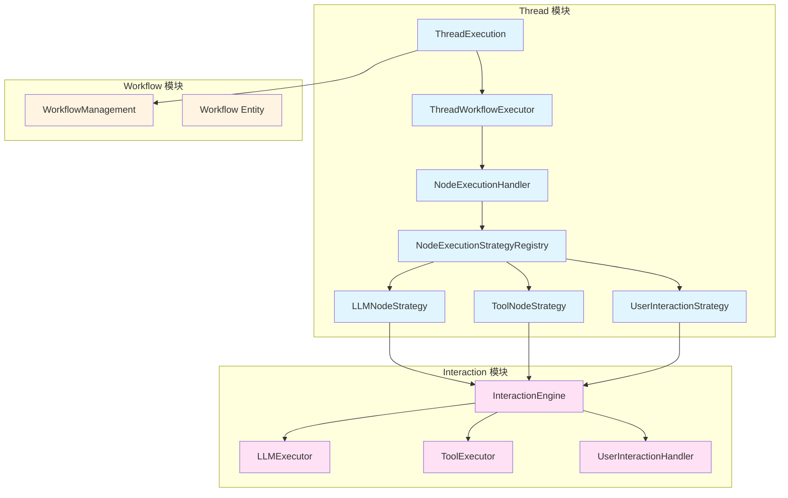
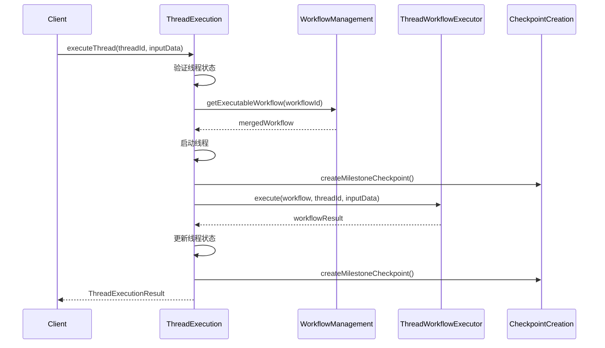
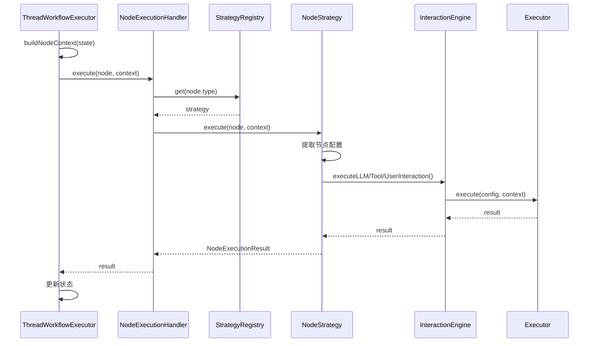
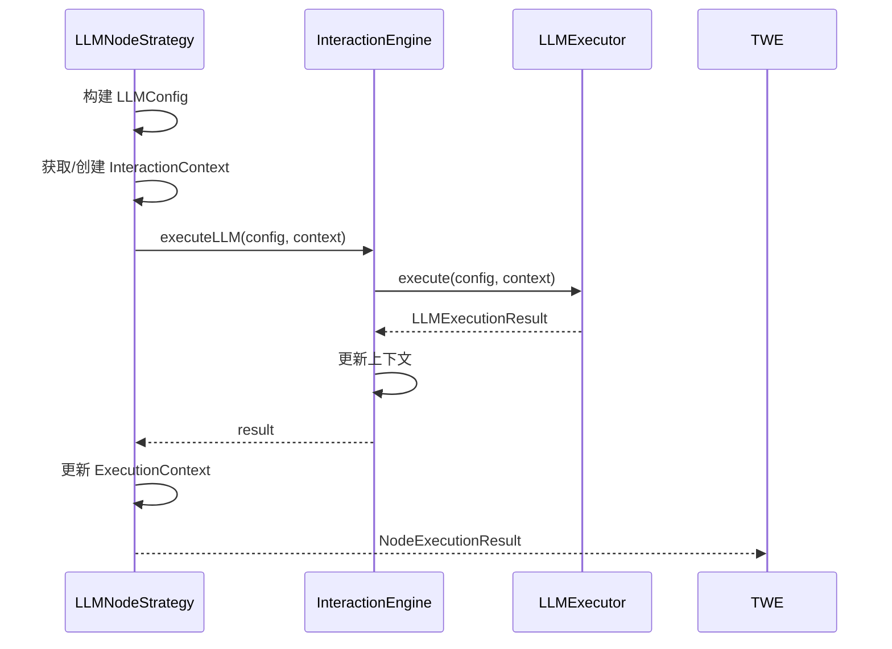
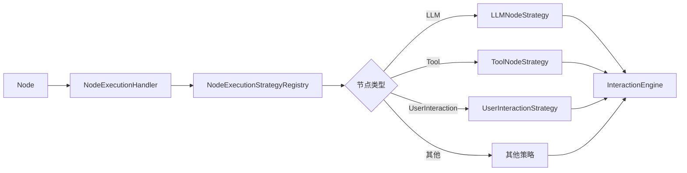

# Thread、Workflow、Interaction 模块关系分析

## 一、概述

本文档分析了当前系统中 Thread、Workflow、Interaction 三个模块之间的关系，重点阐述了 execution 整合到 thread 后的架构变化，以及各模块的职责划分和交互方式。

## 二、架构变化：Execution 整合到 Thread

### 2.1 整合前的架构

在整合前，execution 是一个独立的模块，位于 `src/services/workflow/execution/`，负责工作流的执行逻辑。

**问题**：
- Workflow 模块既包含静态定义，又包含执行逻辑，职责不清晰
- Thread 模块和 Workflow 模块之间存在紧密耦合
- 难以区分工作流的静态定义和动态执行

### 2.2 整合后的架构

整合后，execution 被移动到 Thread 模块下，位于 `src/services/threads/execution/`。

**核心原则**：
- **Workflow 模块**：只负责工作流的静态定义（节点、边、配置等）
- **Thread 模块**：负责工作流的动态执行逻辑（状态管理、节点执行、路由决策）
- **Interaction 模块**：负责具体的交互执行（LLM调用、工具执行、用户交互）

**目录结构变化**：
```
整合前：
src/services/workflow/execution/
  ├── handlers/
  ├── strategies/
  └── context/

整合后：
src/services/threads/execution/
  ├── handlers/
  ├── strategies/
  └── context/
```

## 三、模块职责划分

### 3.1 Workflow 模块

**职责**：
- 工作流的静态定义和管理
- 节点和边的增删改查
- 工作流的生命周期管理（创建、更新、删除）
- 子工作流的引用和合并
- 工作流的验证

**核心组件**：
- [`WorkflowManagement`](src/services/workflow/workflow-management.ts:148)：工作流管理服务
- [`WorkflowMerger`](src/services/workflow/workflow-merger.ts)：工作流合并器
- [`WorkflowValidator`](src/services/workflow/validators/)：工作流验证器
- [`Workflow`](src/domain/workflow/entities/workflow.ts:67)：工作流聚合根实体

**关键方法**：
- `getExecutableWorkflow()`：获取已合并的可执行工作流
- `createWorkflow()`：创建工作流
- `updateWorkflow()`：更新工作流
- `validateSubWorkflowStandards()`：验证子工作流标准

**特点**：
- 纯静态定义，不包含执行逻辑
- 提供只读的工作流图数据
- 支持子工作流的引用和合并

### 3.2 Thread 模块

**职责**：
- 线程的执行编排和生命周期管理
- 工作流节点的执行协调
- 执行状态和历史记录管理
- 检查点的创建和恢复
- 路由决策和错误处理

**核心组件**：
- [`ThreadExecution`](src/services/threads/thread-execution.ts:47)：线程执行编排服务
- [`ThreadWorkflowExecutor`](src/services/threads/thread-workflow-executor.ts:88)：工作流节点协调器
- [`ThreadStateManager`](src/services/threads/thread-state-manager.ts)：状态管理器
- [`ThreadHistoryManager`](src/services/threads/thread-history-manager.ts)：历史记录管理器
- [`ThreadConditionalRouter`](src/services/threads/thread-conditional-router.ts)：条件路由器
- [`NodeExecutionHandler`](src/services/threads/execution/handlers/node-execution-handler.ts:38)：节点执行处理器
- [`NodeExecutionStrategyRegistry`](src/services/threads/execution/strategies/strategy-registry.ts:16)：策略注册表

**关键方法**：
- `executeThread()`：执行线程
- `resumeThreadFromCheckpoint()`：从检查点恢复线程
- `execute()`：执行工作流
- `executeNodeWithRetry()`：执行节点（带重试）

**特点**：
- 负责动态执行逻辑
- 管理执行状态和历史
- 支持检查点和恢复
- 使用策略模式处理不同节点类型

### 3.3 Interaction 模块

**职责**：
- 协调 LLM、Tool、UserInteraction 的执行
- 管理交互上下文
- 委托给具体的 Executor 执行

**核心组件**：
- [`InteractionEngine`](src/services/interaction/interaction-engine.ts:64)：交互引擎
- [`LLMExecutor`](src/services/interaction/executors/llm-executor.ts)：LLM 执行器
- [`ToolExecutor`](src/services/interaction/executors/tool-executor.ts)：工具执行器
- [`UserInteractionHandler`](src/services/interaction/executors/user-interaction-handler.ts)：用户交互处理器
- [`InteractionContext`](src/services/interaction/interaction-context.ts)：交互上下文

**关键方法**：
- `executeLLM()`：执行 LLM 调用
- `executeTool()`：执行工具调用
- `handleUserInteraction()`：处理用户交互

**特点**：
- 纯粹的交互执行逻辑
- 不关心工作流结构
- 可独立测试和替换

## 四、模块间依赖关系

### 4.1 依赖图



### 4.2 依赖规则

**Thread 模块依赖**：
- 依赖 Workflow 模块：获取可执行的工作流定义
- 依赖 Interaction 模块：通过策略模式调用具体的交互执行

**Workflow 模块依赖**：
- 不依赖任何其他服务模块
- 只依赖 Domain 层

**Interaction 模块依赖**：
- 不依赖 Thread 或 Workflow 模块
- 只依赖 Domain 层

**依赖方向**：
```
Thread → Workflow (只读)
Thread → Interaction (通过策略)
Workflow → (无依赖)
Interaction → (无依赖)
```

## 五、调用链路分析

### 5.1 完整执行链路

```
ThreadExecution
    ↓
ThreadWorkflowExecutor
    ↓
NodeExecutionHandler
    ↓
NodeExecutionStrategyRegistry
    ↓
NodeExecutionStrategy (LLM/Tool/UserInteraction)
    ↓
InteractionEngine
    ↓
Executors (LLMExecutor/ToolExecutor/UserInteractionHandler)
```

### 5.2 详细调用流程

#### 5.2.1 线程启动流程



**关键代码位置**：
- [`ThreadExecution.executeThread()`](src/services/threads/thread-execution.ts:81)
- [`WorkflowManagement.getExecutableWorkflow()`](src/services/workflow/workflow-management.ts:616)

#### 5.2.2 节点执行流程



**关键代码位置**：
- [`ThreadWorkflowExecutor.executeNodeWithRetry()`](src/services/threads/thread-workflow-executor.ts:340)
- [`NodeExecutionHandler.execute()`](src/services/threads/execution/handlers/node-execution-handler.ts:50)
- [`LLMNodeStrategy.execute()`](src/services/threads/execution/strategies/llm-node-strategy.ts:32)

#### 5.2.3 LLM 节点执行示例



**关键代码位置**：
- [`LLMNodeStrategy.execute()`](src/services/threads/execution/strategies/llm-node-strategy.ts:32)
- [`InteractionEngine.executeLLM()`](src/services/interaction/interaction-engine.ts:76)

## 六、上下文传递机制

### 6.1 上下文类型

| 上下文类型 | 定义位置 | 用途 | 所在层 |
|-----------|---------|------|--------|
| ThreadWorkflowState | [`src/domain/threads/value-objects/thread-workflow-state.ts`](src/domain/threads/value-objects/thread-workflow-state.ts:35) | 线程工作流状态 | Domain |
| ExecutionContext | [`src/services/threads/execution/context/execution-context.ts`](src/services/threads/execution/context/execution-context.ts:6) | 节点执行上下文 | Services |
| InteractionContext | [`src/services/interaction/interaction-context.ts`](src/services/interaction/interaction-context.ts) | 交互上下文 | Services |

### 6.2 上下文转换流程

```
ThreadWorkflowState (线程状态)
    ↓ buildNodeContext()
ExecutionContext (节点执行上下文)
    ↓ getMetadata('interactionContext')
InteractionContext (交互上下文)
```

### 6.3 上下文详细说明

#### 6.3.1 ThreadWorkflowState

**职责**：
- 表示线程执行过程中的工作流状态
- 提供状态数据的只读访问
- 支持状态验证和快照

**属性**：
```typescript
interface ThreadWorkflowStateProps {
  workflowId: ID;
  currentNodeId?: ID;
  data: Record<string, any>;           // 执行上下文数据
  history: ExecutionHistory[];         // 执行历史
  metadata: Record<string, any>;       // 元数据
  createdAt: Timestamp;
  updatedAt: Timestamp;
}
```

**特点**：
- 纯值对象，不包含状态更新逻辑
- 状态更新由 ThreadStateManager 负责
- 支持快照和恢复

#### 6.3.2 ExecutionContext

**职责**：
- 提供工作流执行的环境
- 管理变量和节点结果
- 提供服务访问接口

**属性**：
```typescript
interface ExecutionContext {
  workflowId: string;
  executionId: string;
  threadId: string;
  localVariables: Map<string, any>;
  
  // 变量管理
  getVariable(key: string): any;
  setVariable(key: string, value: any): void;
  
  // 节点结果管理
  getNodeResult(nodeId: string): any;
  setNodeResult(nodeId: string, result: any): void;
  
  // 服务访问
  getService<T>(serviceName: string): T;
  
  // 元数据
  getMetadata(key: string): any;
  setMetadata(key: string, value: any): void;
}
```

**特点**：
- 由 ThreadWorkflowExecutor 创建
- 传递给 NodeExecutionHandler
- 在 metadata 中存储 InteractionContext

#### 6.3.3 InteractionContext

**职责**：
- 管理交互相关的上下文
- 存储消息、工具调用、LLM调用等
- 跟踪 token 使用情况

**特点**：
- 由 InteractionEngine 创建
- 存储在 ExecutionContext 的 metadata 中
- 在多个节点执行间共享

### 6.4 上下文传递代码示例

**ThreadWorkflowExecutor 创建 ExecutionContext**：
```typescript
// src/services/threads/thread-workflow-executor.ts:437
private buildNodeContext(state: ThreadWorkflowState, threadId: string): any {
  return {
    variables: state.data,
    metadata: state.metadata,
    getVariable: (key: string) => state.getData(key),
    setVariable: (key: string, value: any) => {
      return value;
    },
    getNodeResult: (nodeId: string) => {
      const history = this.historyManager.getNodeHistory(threadId, NodeId.fromString(nodeId));
      return history.length > 0 ? history[history.length - 1]?.result : undefined;
    },
    getService: <T>(serviceName: string): T => {
      if (serviceName === 'FunctionRegistry') {
        return this.functionRegistry as T;
      }
      throw new Error(`服务 ${serviceName} 未找到`);
    },
  };
}
```

**LLMNodeStrategy 获取/创建 InteractionContext**：
```typescript
// src/services/threads/execution/strategies/llm-node-strategy.ts:66
let interactionContext = context.getMetadata('interactionContext') as IInteractionContext;
if (!interactionContext) {
  interactionContext = this.interactionEngine.createContext();
  context.setMetadata('interactionContext', interactionContext);
}
```

## 七、策略模式应用

### 7.1 策略注册表

**位置**：[`src/services/threads/execution/strategies/strategy-registry.ts`](src/services/threads/execution/strategies/strategy-registry.ts:16)

**职责**：
- 管理不同节点类型的执行策略
- 根据节点类型返回对应的策略

**已注册的策略**：
- `LLMNodeStrategy`：处理 LLM 节点
- `ToolNodeStrategy`：处理工具节点
- `UserInteractionStrategy`：处理用户交互节点
- `StartNodeStrategy`：处理起始节点
- `EndNodeStrategy`：处理结束节点
- `ForkNodeStrategy`：处理分支节点
- `JoinNodeStrategy`：处理汇聚节点
- `LoopStartNodeStrategy`：处理循环开始节点
- `LoopEndNodeStrategy`：处理循环结束节点
- `ConditionNodeStrategy`：处理条件节点
- `SubWorkflowNodeStrategy`：处理子工作流节点

### 7.2 策略接口

**位置**：[`src/services/threads/execution/strategies/node-execution-strategy.ts`](src/services/threads/execution/strategies/node-execution-strategy.ts)

```typescript
export interface INodeExecutionStrategy {
  /**
   * 验证节点是否可以执行
   */
  canExecute(node: Node): boolean;
  
  /**
   * 执行节点
   */
  execute(node: Node, context: ExecutionContext): Promise<NodeExecutionResult>;
}
```

### 7.3 策略使用流程



## 八、架构优势

### 8.1 职责分离

**Workflow 模块**：
- 只负责静态定义
- 不包含执行逻辑
- 易于理解和维护

**Thread 模块**：
- 只负责执行逻辑
- 不关心工作流定义细节
- 专注于状态管理和流程控制

**Interaction 模块**：
- 只负责交互执行
- 不关心工作流结构
- 可独立测试和替换

### 8.2 策略模式

**优势**：
- 新增节点类型只需添加新的策略
- 策略之间相互独立
- 易于测试和维护

**示例**：
```typescript
// 注册新策略
strategyRegistry.register(NodeType.custom(), new CustomNodeStrategy());

// 使用策略
const strategy = strategyRegistry.get(node.type);
const result = await strategy.execute(node, context);
```

### 8.3 依赖注入

**优势**：
- 所有组件通过依赖注入管理
- 易于替换和测试
- 支持单例模式

**示例**：
```typescript
constructor(
  @inject(TYPES.ThreadStateManager) stateManager: ThreadStateManager,
  @inject(TYPES.ThreadHistoryManager) historyManager: ThreadHistoryManager,
  @inject(TYPES.CheckpointManagement) checkpointManagement: CheckpointManagement,
  @inject(TYPES.ThreadConditionalRouter) router: ThreadConditionalRouter,
  @inject(TYPES.NodeExecutor) nodeExecutionHandler: INodeExecutionHandler,
  @inject(TYPES.FunctionRegistry) functionRegistry: FunctionRegistry,
  @inject(TYPES.ThreadRepository) threadRepository: IThreadRepository
) {
  // ...
}
```

### 8.4 上下文隔离

**优势**：
- 不同层使用不同的上下文
- 避免层与层之间的耦合
- 易于理解和调试

**上下文层次**：
```
ThreadWorkflowState (Domain 层)
    ↓
ExecutionContext (Services 层)
    ↓
InteractionContext (Services 层)
```

### 8.5 可扩展性

**新增节点类型**：
1. 创建新的节点实体类
2. 创建对应的执行策略
3. 注册策略到策略注册表

**新增交互类型**：
1. 创建新的 Executor
2. 在 InteractionEngine 中添加对应方法
3. 创建对应的节点策略

## 九、潜在问题和改进建议

### 9.1 检查点恢复功能未完成

**问题**：
- [`ThreadWorkflowExecutor.resumeFromCheckpoint()`](src/services/threads/thread-workflow-executor.ts:302) 抛出错误
- 检查点恢复逻辑需要重构

**建议**：
- 实现完整的检查点恢复逻辑
- 支持从任意检查点恢复执行
- 确保状态一致性

### 9.2 InteractionEngine 协调逻辑待完善

**问题**：
- InteractionEngine 当前只是简单的委托
- 缺少复杂的协调逻辑

**建议**：
- 实现多轮对话协调
- 支持工具调用的自动处理
- 添加错误重试机制

### 9.3 上下文传递可能存在性能问题

**问题**：
- InteractionContext 存储在 ExecutionContext 的 metadata 中
- 可能在多个节点执行间传递大量数据

**建议**：
- 优化上下文传递机制
- 考虑使用引用传递而非值传递
- 添加上下文清理机制

### 9.4 错误处理机制不够完善

**问题**：
- 节点执行错误处理较为简单
- 缺少详细的错误分类和恢复策略

**建议**：
- 实现更完善的错误分类
- 添加错误恢复策略
- 支持错误重试和降级

### 9.5 缺少执行监控和追踪

**问题**：
- 缺少详细的执行日志
- 难以追踪执行路径

**建议**：
- 添加详细的执行日志
- 实现执行追踪功能
- 支持执行可视化

## 十、总结

### 10.1 核心设计原则

1. **职责分离**：Workflow 负责静态定义，Thread 负责动态执行，Interaction 负责具体交互
2. **策略模式**：使用策略模式处理不同节点类型，易于扩展
3. **依赖注入**：所有组件通过依赖注入管理，易于测试和替换
4. **上下文隔离**：不同层使用不同的上下文，避免耦合
5. **可扩展性**：新增节点类型和交互类型都很简单

### 10.2 架构优势

- 清晰的职责划分
- 松耦合的模块设计
- 易于测试和维护
- 良好的可扩展性

### 10.3 未来改进方向

- 完善检查点恢复功能
- 增强 InteractionEngine 的协调能力
- 优化上下文传递机制
- 完善错误处理机制
- 添加执行监控和追踪

## 十一、附录

### 11.1 关键文件索引

| 文件路径 | 说明 |
|---------|------|
| [`src/services/threads/thread-execution.ts`](src/services/threads/thread-execution.ts) | 线程执行编排服务 |
| [`src/services/threads/thread-workflow-executor.ts`](src/services/threads/thread-workflow-executor.ts) | 工作流节点协调器 |
| [`src/services/threads/execution/handlers/node-execution-handler.ts`](src/services/threads/execution/handlers/node-execution-handler.ts) | 节点执行处理器 |
| [`src/services/threads/execution/strategies/strategy-registry.ts`](src/services/threads/execution/strategies/strategy-registry.ts) | 策略注册表 |
| [`src/services/workflow/workflow-management.ts`](src/services/workflow/workflow-management.ts) | 工作流管理服务 |
| [`src/services/interaction/interaction-engine.ts`](src/services/interaction/interaction-engine.ts) | 交互引擎 |
| [`src/domain/workflow/entities/workflow.ts`](src/domain/workflow/entities/workflow.ts) | 工作流聚合根实体 |
| [`src/domain/threads/value-objects/thread-workflow-state.ts`](src/domain/threads/value-objects/thread-workflow-state.ts) | 线程工作流状态 |
| [`src/services/threads/execution/context/execution-context.ts`](src/services/threads/execution/context/execution-context.ts) | 执行上下文 |

### 11.2 相关文档

- [`docs/architecture/interaction/thread-executor-integration.md`](docs/architecture/interaction/thread-executor-integration.md) - Thread、Executor、Interaction 集成说明
- [`docs/edge-function-condition-integration.md`](docs/edge-function-condition-integration.md) - 边函数条件集成说明
- [`docs/global-checkpoint-analysis.md`](docs/global-checkpoint-analysis.md) - 全局检查点分析
- [`docs/snapshot-checkpoint-analysis.md`](docs/snapshot-checkpoint-analysis.md) - 快照检查点分析

### 11.3 术语表

| 术语 | 说明 |
|-----|------|
| Thread | 线程，表示工作流的一次执行实例 |
| Workflow | 工作流，表示静态的工作流定义 |
| Execution | 执行，表示工作流的执行逻辑 |
| Interaction | 交互，表示 LLM、工具、用户交互等具体操作 |
| Node | 节点，工作流的基本执行单元 |
| Edge | 边，连接节点的有向边 |
| Strategy | 策略，节点执行的策略模式 |
| Context | 上下文，执行过程中的环境信息 |
| Checkpoint | 检查点，执行状态的快照 |
| State | 状态，线程的执行状态 |
| History | 历史，执行历史记录 |