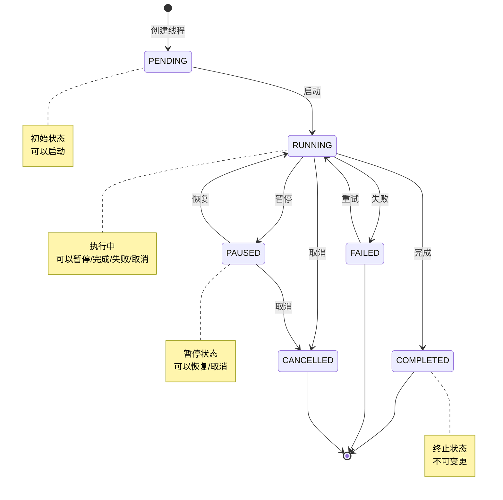
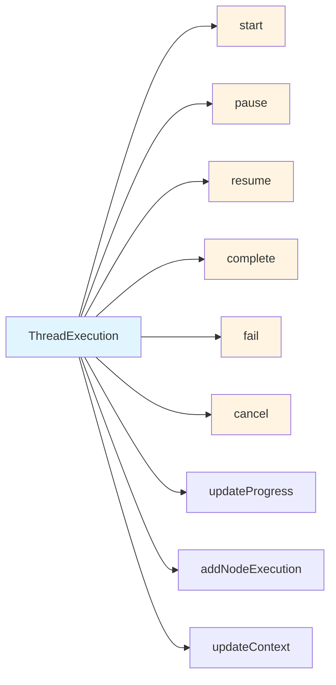
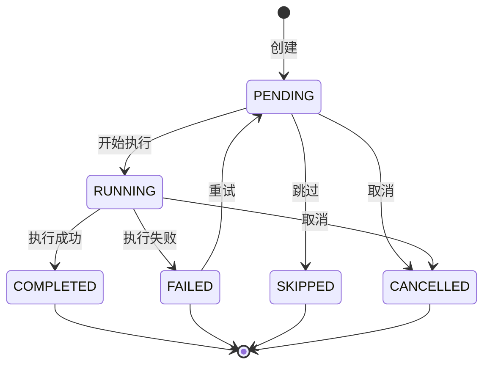
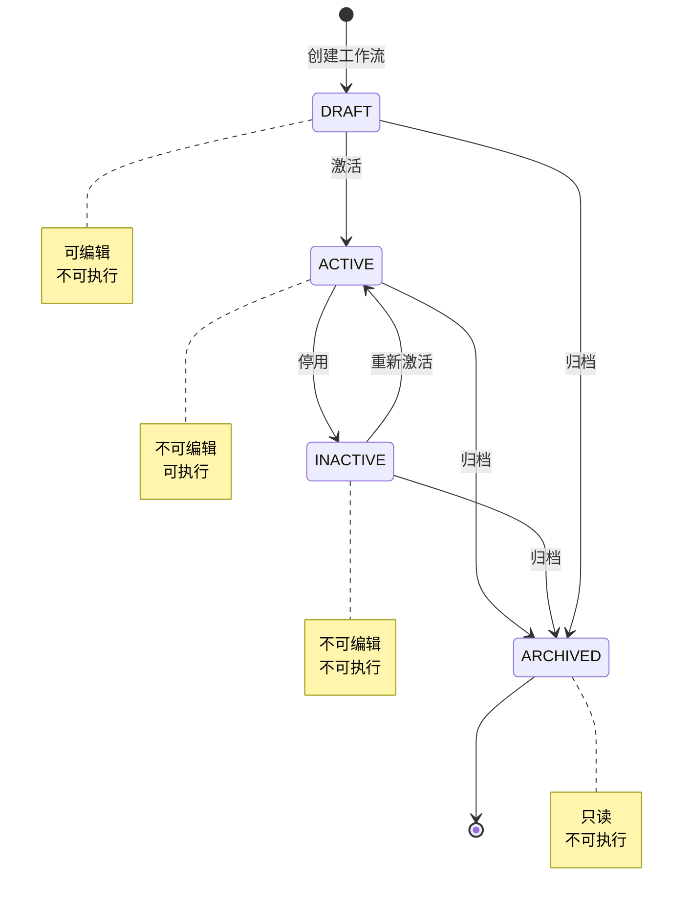
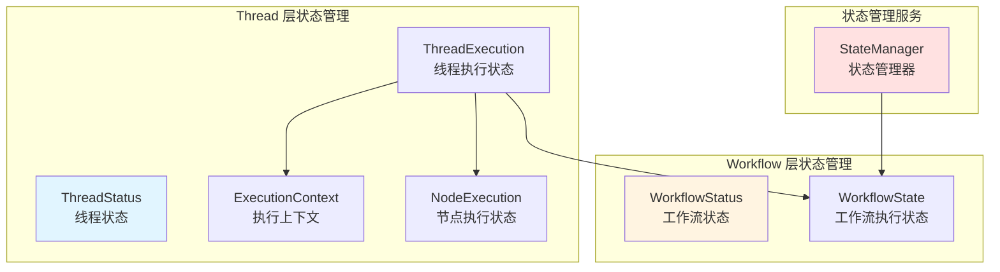
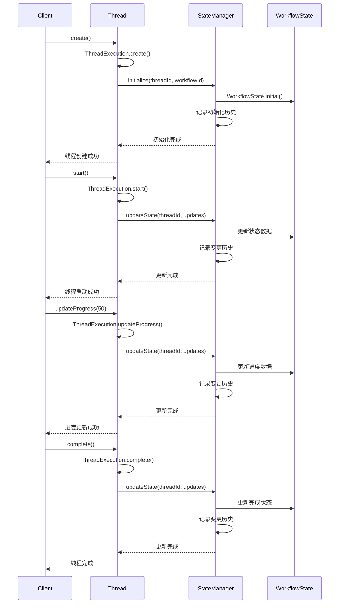

# Thread 和 Workflow 层状态管理设计分析

## 概述

本文档详细分析了 Modular Agent Framework 中 Thread 和 Workflow 层的状态管理逻辑设计，包括状态值对象、执行上下文、节点执行状态以及状态管理服务。

## 一、Thread 层状态管理

### 1.1 ThreadStatus（线程状态）

**位置**：[`src/domain/threads/value-objects/thread-status.ts`](../../src/domain/threads/value-objects/thread-status.ts)

**核心职责**：
- 表示线程的当前生命周期状态
- 提供状态转换的验证逻辑
- 支持状态查询和判断

**状态枚举**：
```typescript
enum ThreadStatusValue {
  PENDING = 'pending',      // 待执行
  RUNNING = 'running',      // 运行中
  PAUSED = 'paused',        // 已暂停
  COMPLETED = 'completed',  // 已完成
  FAILED = 'failed',        // 失败
  CANCELLED = 'cancelled',  // 已取消
}
```

**状态流转图**：


**状态分类方法**：

| 方法 | 说明 | 包含的状态 |
|------|------|-----------|
| `isPending()` | 是否待执行 | PENDING |
| `isRunning()` | 是否运行中 | RUNNING |
| `isPaused()` | 是否暂停 | PAUSED |
| `isCompleted()` | 是否完成 | COMPLETED |
| `isFailed()` | 是否失败 | FAILED |
| `isCancelled()` | 是否取消 | CANCELLED |
| `isTerminal()` | 是否终止 | COMPLETED, FAILED, CANCELLED |
| `isActive()` | 是否活跃 | PENDING, RUNNING, PAUSED |
| `canOperate()` | 可操作 | PENDING, RUNNING, PAUSED |
| `canExecute()` | 可执行 | PENDING, RUNNING |

**设计特点**：
- ✅ **不可变性**：所有状态方法返回新实例
- ✅ **类型安全**：使用枚举确保状态值有效
- ✅ **验证逻辑**：构造时验证状态有效性
- ✅ **状态查询**：提供丰富的状态判断方法

### 1.2 ThreadExecution（线程执行状态）

**位置**：[`src/domain/threads/value-objects/thread-execution.ts`](../../src/domain/threads/value-objects/thread-execution.ts)

**核心职责**：
- 管理线程的执行状态信息
- 跟踪执行进度和时间
- 记录操作历史
- 管理节点执行状态
- 维护执行上下文

**核心属性**：
```typescript
interface ThreadExecutionProps {
  readonly threadId: ID;
  readonly status: ThreadStatus;           // 线程状态
  readonly progress: number;                // 执行进度（0-100）
  readonly currentStep?: string;            // 当前步骤
  readonly startedAt?: Timestamp;           // 开始时间
  readonly completedAt?: Timestamp;         // 完成时间
  readonly errorMessage?: string;           // 错误信息
  readonly retryCount: number;              // 重试次数
  readonly lastActivityAt: Timestamp;       // 最后活动时间
  readonly nodeExecutions: Map<string, NodeExecution>;  // 节点执行状态
  readonly context: ExecutionContext;       // 执行上下文
  readonly operationHistory: OperationRecord[];  // 操作历史
  readonly forkInfo?: ForkInfo;             // Fork 信息
  readonly copyInfo?: CopyInfo;             // Copy 信息
  readonly workflowState?: WorkflowState;   // 工作流状态
}
```

**状态转换方法**：



**关键方法详解**：

#### 1. 生命周期管理
```typescript
// 启动执行
start(): ThreadExecution
  - 前置条件：状态为 PENDING
  - 状态变更：PENDING → RUNNING
  - 记录：开始时间、操作历史

// 暂停执行
pause(): ThreadExecution
  - 前置条件：状态为 RUNNING
  - 状态变更：RUNNING → PAUSED
  - 记录：操作历史

// 恢复执行
resume(): ThreadExecution
  - 前置条件：状态为 PAUSED
  - 状态变更：PAUSED → RUNNING
  - 记录：操作历史

// 完成执行
complete(): ThreadExecution
  - 前置条件：状态为活跃（PENDING/RUNNING/PAUSED）
  - 状态变更：ACTIVE → COMPLETED
  - 记录：完成时间、进度=100、操作历史

// 失败执行
fail(errorMessage: string): ThreadExecution
  - 前置条件：状态为活跃
  - 状态变更：ACTIVE → FAILED
  - 记录：错误信息、完成时间、操作历史

// 取消执行
cancel(): ThreadExecution
  - 前置条件：状态非终止
  - 状态变更：NON-TERMINAL → CANCELLED
  - 记录：完成时间、操作历史
```

#### 2. 进度管理
```typescript
// 更新进度
updateProgress(progress: number, currentStep?: string): ThreadExecution
  - 验证：progress 在 0-100 之间
  - 前置条件：状态为活跃
  - 更新：进度值、当前步骤、最后活动时间

// 增加重试次数
incrementRetryCount(): ThreadExecution
  - 更新：重试次数 + 1
  - 记录：最后活动时间
```

#### 3. 节点执行管理
```typescript
// 添加节点执行状态
addNodeExecution(nodeExecution: NodeExecution): ThreadExecution
  - 添加：新的节点执行记录
  - 更新：最后活动时间

// 更新节点执行状态
updateNodeExecution(nodeExecution: NodeExecution): ThreadExecution
  - 验证：节点执行状态存在
  - 更新：节点执行记录、最后活动时间
```

#### 4. 上下文管理
```typescript
// 更新执行上下文
updateContext(context: ExecutionContext): ThreadExecution
  - 更新：执行上下文
  - 记录：最后活动时间

// 更新工作流状态
updateWorkflowState(workflowState: WorkflowState): ThreadExecution
  - 更新：工作流状态
  - 记录：最后活动时间

// 设置工作流数据
setWorkflowData(key: string, value: any): ThreadExecution
  - 验证：工作流状态存在
  - 更新：工作流数据、更新时间

// 更新当前节点
updateCurrentNode(nodeId: ID): ThreadExecution
  - 验证：工作流状态存在
  - 更新：当前节点ID、更新时间
```

#### 5. 操作历史
```typescript
interface OperationRecord {
  readonly operationId: ID;
  readonly operationType: 'start' | 'pause' | 'resume' | 'complete' | 'fail' | 'cancel' | 'fork' | 'copy';
  readonly timestamp: Timestamp;
  readonly operatorId?: ID;
  readonly reason?: string;
  readonly metadata?: Record<string, unknown>;
}
```

**验证逻辑**：
```typescript
validate(): void {
  // 基本验证
  - 线程ID不能为空
  - 线程状态不能为空
  - 进度必须在 0-100 之间
  - 重试次数不能为负数

  // 时间逻辑验证
  - 开始时间不能晚于完成时间

  // 状态一致性验证
  - 运行中的线程必须有开始时间
  - 已终止的线程必须有完成时间
  - 已终止的线程进度必须为 100
}
```

**设计特点**：
- ✅ **不可变性**：所有修改返回新实例
- ✅ **完整追踪**：记录所有操作历史
- ✅ **状态验证**：确保状态一致性
- ✅ **时间管理**：精确的时间戳记录
- ✅ **错误处理**：详细的错误信息记录

### 1.3 ExecutionContext（执行上下文）

**位置**：[`src/domain/threads/value-objects/execution-context.ts`](../../src/domain/threads/value-objects/execution-context.ts)

**核心职责**：
- 管理执行过程中的变量
- 维护节点级别的上下文
- 提供执行配置
- 支持上下文快照和恢复

**核心属性**：
```typescript
interface ExecutionContextProps {
  readonly variables: Map<string, unknown>;           // 全局变量
  readonly promptContext: PromptContext;              // 提示词上下文
  readonly nodeContexts: Map<string, NodeContext>;    // 节点上下文
  readonly config: ExecutionConfig;                   // 执行配置
}

interface NodeContext {
  readonly nodeId: NodeId;
  readonly variables: Map<string, unknown>;
  readonly metadata: Record<string, unknown>;
  readonly lastAccessedAt: Timestamp;
}

interface ExecutionConfig {
  readonly timeout?: number;
  readonly maxRetries?: number;
  readonly retryDelay?: number;
  readonly enableCaching?: boolean;
  readonly enableLogging?: boolean;
  readonly customSettings?: Record<string, unknown>;
}
```

**变量管理方法**：
```typescript
// 获取变量
getVariable(key: string): unknown | undefined

// 检查变量是否存在
hasVariable(key: string): boolean

// 设置变量（返回新实例）
setVariable(key: string, value: unknown): ExecutionContext

// 批量设置变量
setVariables(variables: Map<string, unknown>): ExecutionContext

// 删除变量
deleteVariable(key: string): ExecutionContext
```

**节点上下文管理**：
```typescript
// 获取节点上下文
getNodeContext(nodeId: NodeId): NodeContext | undefined

// 设置节点上下文
setNodeContext(nodeId: NodeId, context: NodeContext): ExecutionContext

// 更新节点上下文变量
updateNodeContextVariables(nodeId: NodeId, variables: Map<string, unknown>): ExecutionContext
```

**上下文快照**：
```typescript
interface ContextSnapshot {
  readonly variables: Map<string, unknown>;
  readonly nodeContexts: Map<string, NodeContext>;
  readonly promptContext: PromptContext;
  readonly config: ExecutionConfig;
  readonly snapshotAt: Timestamp;
}

// 创建快照
createSnapshot(): ContextSnapshot

// 从快照恢复
static restoreFromSnapshot(snapshot: ContextSnapshot): ExecutionContext
```

**内存管理**：
```typescript
// 计算内存使用量
calculateMemoryUsage(): number
  - 计算变量大小
  - 计算节点上下文大小
  - 返回总字节数
```

**设计特点**：
- ✅ **变量隔离**：全局变量和节点变量分离
- ✅ **不可变性**：所有修改返回新实例
- ✅ **快照支持**：支持上下文快照和恢复
- ✅ **内存监控**：提供内存使用量计算
- ✅ **灵活配置**：支持自定义执行配置

### 1.4 NodeExecution（节点执行状态）

**位置**：[`src/domain/threads/value-objects/node-execution.ts`](../../src/domain/threads/value-objects/node-execution.ts)

**核心职责**：
- 跟踪单个节点的执行状态
- 记录 LLM 调用和工具调用
- 管理执行步骤
- 支持重试机制

**核心属性**：
```typescript
interface NodeExecutionProps {
  readonly nodeId: NodeId;
  readonly status: NodeStatus;                    // 节点状态
  readonly startTime?: Timestamp;                // 开始时间
  readonly endTime?: Timestamp;                  // 结束时间
  readonly duration?: number;                    // 执行时长
  readonly result?: unknown;                     // 执行结果
  readonly error?: NodeExecutionError;           // 错误信息
  readonly llmCalls: LLMCallRecord[];            // LLM 调用记录
  readonly toolCalls: ToolCallRecord[];          // 工具调用记录
  readonly executionSteps: ExecutionStep[];      // 执行步骤
  readonly retryInfo: RetryInfo;                 // 重试信息
  readonly metadata: Record<string, unknown>;    // 元数据
}

interface LLMCallRecord {
  readonly callId: ID;
  readonly model: string;
  readonly prompt: string;
  readonly response: string;
  readonly tokenUsage: {
    readonly promptTokens: number;
    readonly completionTokens: number;
    readonly totalTokens: number;
  };
  readonly cost: number;
  readonly currency: string;
  readonly duration: number;
  readonly timestamp: Timestamp;
  readonly metadata: Record<string, unknown>;
}

interface ToolCallRecord {
  readonly callId: ID;
  readonly toolName: string;
  readonly parameters: Record<string, unknown>;
  readonly result?: unknown;
  readonly error?: Error;
  readonly duration: number;
  readonly timestamp: Timestamp;
  readonly metadata: Record<string, unknown>;
}

interface RetryInfo {
  readonly maxRetries: number;
  readonly currentRetry: number;
  readonly retryDelay: number;
  readonly lastRetryAt?: Timestamp;
  readonly retryReason?: string;
}
```

**节点状态流转**：


**状态转换方法**：
```typescript
// 开始执行
start(): NodeExecution
  - 前置条件：状态允许开始
  - 状态变更：PENDING → RUNNING
  - 记录：开始时间

// 完成执行
complete(result?: unknown): NodeExecution
  - 前置条件：状态为 RUNNING
  - 状态变更：RUNNING → COMPLETED
  - 记录：结果、结束时间、执行时长

// 标记失败
fail(error: NodeExecutionError): NodeExecution
  - 前置条件：状态为 RUNNING
  - 状态变更：RUNNING → FAILED
  - 记录：错误信息、结束时间、执行时长

// 跳过执行
skip(reason?: string): NodeExecution
  - 前置条件：状态允许开始
  - 状态变更：PENDING → SKIPPED
  - 记录：跳过原因、结束时间

// 取消执行
cancel(): NodeExecution
  - 前置条件：状态允许取消
  - 状态变更：ANY → CANCELLED
  - 记录：结束时间、执行时长

// 重试执行
retry(): NodeExecution
  - 前置条件：状态允许重试
  - 验证：未达到最大重试次数
  - 状态变更：FAILED → PENDING
  - 记录：重试次数、重试时间
```

**记录管理**：
```typescript
// 添加 LLM 调用记录
addLLMCall(llmCall: LLMCallRecord): NodeExecution

// 添加工具调用记录
addToolCall(toolCall: ToolCallRecord): NodeExecution

// 添加执行步骤
addExecutionStep(step: ExecutionStep): NodeExecution

// 更新元数据
updateMetadata(metadata: Record<string, unknown>): NodeExecution
```

**快照支持**：
```typescript
interface NodeExecutionSnapshot {
  readonly nodeId: NodeId;
  readonly status: NodeStatus;
  readonly startTime?: Timestamp;
  readonly endTime?: Timestamp;
  readonly duration?: number;
  readonly result?: unknown;
  readonly error?: NodeExecutionError;
  readonly llmCalls: LLMCallRecord[];
  readonly toolCalls: ToolCallRecord[];
  readonly executionSteps: ExecutionStep[];
  readonly retryInfo: RetryInfo;
  readonly metadata: Record<string, unknown>;
  readonly snapshotAt: Timestamp;
}

// 创建快照
createSnapshot(): NodeExecutionSnapshot
```

**设计特点**：
- ✅ **详细追踪**：记录所有执行细节
- ✅ **重试支持**：内置重试机制
- ✅ **成本追踪**：记录 LLM 调用成本
- ✅ **性能监控**：记录执行时长
- ✅ **快照支持**：支持状态快照

## 二、Workflow 层状态管理

### 2.1 WorkflowStatus（工作流状态）

**位置**：[`src/domain/workflow/value-objects/workflow-status.ts`](../../src/domain/workflow/value-objects/workflow-status.ts)

**核心职责**：
- 表示工作流的定义状态
- 控制工作流的编辑和执行权限
- 提供状态转换验证

**状态枚举**：
```typescript
enum WorkflowStatusValue {
  DRAFT = 'draft',      // 草稿
  ACTIVE = 'active',    // 活跃
  INACTIVE = 'inactive',// 非活跃
  ARCHIVED = 'archived',// 已归档
}
```

**状态流转图**：


**状态分类方法**：

| 方法 | 说明 | 包含的状态 |
|------|------|-----------|
| `isDraft()` | 是否草稿 | DRAFT |
| `isActive()` | 是否活跃 | ACTIVE |
| `isInactive()` | 是否非活跃 | INACTIVE |
| `isArchived()` | 是否归档 | ARCHIVED |
| `canOperate()` | 可操作 | ACTIVE |
| `canEdit()` | 可编辑 | DRAFT |
| `canExecute()` | 可执行 | ACTIVE |

**设计特点**：
- ✅ **生命周期管理**：清晰的状态流转
- ✅ **权限控制**：基于状态的操作权限
- ✅ **不可变性**：所有状态方法返回新实例
- ✅ **类型安全**：使用枚举确保状态值有效

### 2.2 WorkflowState（工作流状态）

**位置**：[`src/domain/workflow/value-objects/workflow-state.ts`](../../src/domain/workflow/value-objects/workflow-state.ts)

**核心职责**：
- 管理工作流执行过程中的状态
- 跟踪当前执行节点
- 维护执行上下文数据
- 记录执行历史

**核心属性**：
```typescript
interface WorkflowStateProps {
  readonly workflowId: ID;
  readonly currentNodeId?: ID;                    // 当前节点ID
  readonly data: Record<string, any>;             // 执行上下文数据
  readonly history: ExecutionHistory[];           // 执行历史
  readonly metadata: Record<string, any>;         // 元数据
  readonly createdAt: Timestamp;                  // 创建时间
  readonly updatedAt: Timestamp;                  // 更新时间
}

interface ExecutionHistory {
  readonly nodeId: ID;
  readonly timestamp: Timestamp;
  readonly result?: any;
  readonly status: 'success' | 'failure' | 'pending' | 'running';
  readonly metadata?: Record<string, any>;
}
```

**数据访问方法**：
```typescript
// 获取数据
getData(key?: string): any
  - 如果提供 key：返回指定键的值
  - 如果不提供 key：返回所有数据

// 获取属性对象
toProps(): WorkflowStateProps
```

**验证逻辑**：
```typescript
validate(): void {
  // 基本验证
  - 工作流ID不能为空
  - 执行上下文数据不能为空
  - 执行历史不能为空
  - 执行元数据不能为空
  - 创建时间不能为空
  - 更新时间不能为空

  // 时间逻辑验证
  - 更新时间不能早于创建时间

  // 执行历史验证
  - 每条历史记录必须包含节点ID
  - 每条历史记录必须包含时间戳
  - 每条历史记录必须包含状态
}
```

**设计特点**：
- ✅ **不可变性**：所有属性只读
- ✅ **历史追踪**：完整的执行历史记录
- ✅ **时间管理**：精确的时间戳记录
- ✅ **数据验证**：严格的数据验证逻辑

## 三、StateManager（状态管理器）

**位置**：[`src/application/workflow/services/state-manager.ts`](../../src/application/workflow/services/state-manager.ts)

**核心职责**：
- 管理工作流执行状态
- 提供状态的初始化、获取、更新、清除操作
- 记录状态变更历史
- 验证状态数据

**核心属性**：
```typescript
class StateManager {
  private states: Map<string, WorkflowState>;           // 线程状态映射
  private stateHistory: Map<string, StateChange[]>;     // 状态变更历史
}

interface StateChange {
  readonly type: 'initialize' | 'update' | 'set_current_node';
  readonly timestamp: number;
  readonly before: Record<string, any>;
  readonly after: Record<string, any>;
  readonly updates?: Record<string, any>;
  readonly diff: Record<string, { before: any; after: any }>;
}
```

**核心方法**：

### 3.1 状态初始化
```typescript
initialize(
  threadId: string,
  workflowId: ID,
  initialState: Record<string, any> = {},
  options: StateUpdateOptions = {}
): void
  - 创建初始工作流状态
  - 合并初始数据
  - 记录初始化历史
```

### 3.2 状态获取
```typescript
getState(threadId: string): WorkflowState | null
  - 获取指定线程的状态
  - 如果不存在返回 null

getData(threadId: string, key?: string): any
  - 获取状态数据
  - 支持获取单个键或所有数据
```

### 3.3 状态更新
```typescript
updateState(
  threadId: string,
  updates: Record<string, any>,
  options: StateUpdateOptions = {}
): WorkflowState
  - 更新状态数据
  - 记录变更历史
  - 计算数据差异
  - 返回更新后的状态

setCurrentNodeId(
  threadId: string,
  nodeId: ID,
  options: StateUpdateOptions = {}
): WorkflowState
  - 设置当前节点ID
  - 记录变更历史
  - 返回更新后的状态
```

### 3.4 状态清除
```typescript
clearState(threadId: string): void
  - 清除指定线程的状态

clearAllStates(): void
  - 清除所有状态
```

### 3.5 状态查询
```typescript
hasState(threadId: string): boolean
  - 检查状态是否存在

getAllThreadIds(): string[]
  - 获取所有线程ID

getStateCount(): number
  - 获取状态数量
```

### 3.6 状态历史
```typescript
getStateHistory(threadId: string, limit?: number): StateChange[]
  - 获取状态变更历史
  - 支持限制返回数量

clearStateHistory(threadId?: string): void
  - 清除状态历史
  - 支持清除单个或全部
```

### 3.7 状态验证
```typescript
validateState(threadId: string): StateValidationResult
  - 验证状态数据
  - 返回验证结果
  - 包含错误和警告信息
```

**状态变更记录**：
```typescript
private recordStateChange(
  threadId: string,
  type: StateChange['type'],
  before: Record<string, any>,
  after: Record<string, any>,
  updates?: Record<string, any>
): void
  - 记录状态变更
  - 计算数据差异
  - 限制历史记录数量（最多1000条）
```

**差异计算**：
```typescript
private calculateDiff(
  before: Record<string, any>,
  after: Record<string, any>
): Record<string, { before: any; after: any }>
  - 比较变更前后的数据
  - 计算差异
  - 返回差异对象
```

**设计特点**：
- ✅ **线程隔离**：每个线程有独立的状态
- ✅ **不可变更新**：状态更新返回新实例
- ✅ **历史追踪**：完整的状态变更历史
- ✅ **差异计算**：自动计算数据差异
- ✅ **验证支持**：提供状态验证功能

## 四、状态管理架构

### 4.1 整体架构图



### 4.2 状态层次结构

```
Thread（线程）
├── ThreadStatus（线程状态）
│   ├── PENDING（待执行）
│   ├── RUNNING（运行中）
│   ├── PAUSED（已暂停）
│   ├── COMPLETED（已完成）
│   ├── FAILED（失败）
│   └── CANCELLED（已取消）
│
├── ThreadExecution（线程执行状态）
│   ├── status: ThreadStatus
│   ├── progress: number
│   ├── context: ExecutionContext
│   ├── nodeExecutions: Map<NodeId, NodeExecution>
│   ├── workflowState: WorkflowState
│   └── operationHistory: OperationRecord[]
│
└── ExecutionContext（执行上下文）
    ├── variables: Map<string, unknown>
    ├── nodeContexts: Map<NodeId, NodeContext>
    ├── promptContext: PromptContext
    └── config: ExecutionConfig

Workflow（工作流）
├── WorkflowStatus（工作流状态）
│   ├── DRAFT（草稿）
│   ├── ACTIVE（活跃）
│   ├── INACTIVE（非活跃）
│   └── ARCHIVED（已归档）
│
└── WorkflowState（工作流执行状态）
    ├── currentNodeId: ID
    ├── data: Record<string, any>
    ├── history: ExecutionHistory[]
    └── metadata: Record<string, any>
```

### 4.3 状态流转时序图



## 五、设计原则和最佳实践

### 5.1 不可变性原则

**实现方式**：
- 所有值对象属性使用 `readonly` 修饰
- 所有修改方法返回新实例
- 使用对象展开运算符创建新对象

**优势**：
- ✅ 避免意外的状态修改
- ✅ 简化状态追踪和调试
- ✅ 支持时间旅行调试
- ✅ 提高代码可预测性

**示例**：
```typescript
// ❌ 错误：可变状态
class MutableState {
  status: string;
  setStatus(status: string): void {
    this.status = status;
  }
}

// ✅ 正确：不可变状态
class ImmutableState {
  readonly status: string;
  setStatus(status: string): ImmutableState {
    return new ImmutableState(status);
  }
}
```

### 5.2 状态验证原则

**验证时机**：
- 构造时验证：确保对象创建时就是有效的
- 方法调用前验证：确保操作的前置条件满足
- 状态转换时验证：确保状态转换的合法性

**验证内容**：
- 数据完整性：必填字段不能为空
- 数据有效性：数值范围、格式等
- 业务规则：状态转换规则、时间逻辑等
- 一致性检查：状态与时间、进度的一致性

**示例**：
```typescript
// 构造时验证
constructor(props: ThreadExecutionProps) {
  if (!props.threadId) {
    throw new Error('线程ID不能为空');
  }
  if (props.progress < 0 || props.progress > 100) {
    throw new Error('进度必须在0-100之间');
  }
  this.props = Object.freeze(props);
}

// 方法调用前验证
public start(): ThreadExecution {
  if (!this.props.status.isPending()) {
    throw new Error('只能启动待执行状态的线程');
  }
  // ...
}

// 状态一致性验证
public validate(): void {
  if (this.props.status.isRunning() && !this.props.startedAt) {
    throw new Error('运行中的线程必须有开始时间');
  }
  if (this.props.status.isTerminal() && this.props.progress < 100) {
    throw new Error('已终止的线程进度必须为100');
  }
}
```

### 5.3 历史追踪原则

**追踪内容**：
- 状态变更：记录每次状态变更
- 操作历史：记录所有操作记录
- 执行历史：记录节点执行历史
- 时间戳：精确记录每个事件的时间

**存储策略**：
- 内存存储：快速访问
- 限制数量：避免内存溢出
- 分页查询：支持历史查询

**示例**：
```typescript
interface OperationRecord {
  readonly operationId: ID;
  readonly operationType: 'start' | 'pause' | 'resume' | 'complete' | 'fail' | 'cancel';
  readonly timestamp: Timestamp;
  readonly operatorId?: ID;
  readonly reason?: string;
  readonly metadata?: Record<string, unknown>;
}

interface StateChange {
  readonly type: 'initialize' | 'update' | 'set_current_node';
  readonly timestamp: number;
  readonly before: Record<string, any>;
  readonly after: Record<string, any>;
  readonly diff: Record<string, { before: any; after: any }>;
}
```

### 5.4 线程隔离原则

**实现方式**：
- 每个线程有独立的状态
- 使用线程ID作为状态键
- 状态管理器维护线程状态映射

**优势**：
- ✅ 避免线程间状态污染
- ✅ 支持并发执行
- ✅ 简化状态管理

**示例**：
```typescript
class StateManager {
  private states: Map<string, WorkflowState>;

  initialize(threadId: string, workflowId: ID): void {
    const state = WorkflowState.initial(workflowId);
    this.states.set(threadId, state);
  }

  getState(threadId: string): WorkflowState | null {
    return this.states.get(threadId) || null;
  }
}
```

### 5.5 快照和恢复原则

**快照内容**：
- 当前状态数据
- 执行上下文
- 节点执行状态
- 时间戳信息

**恢复机制**：
- 从快照重建状态
- 验证快照有效性
- 支持部分恢复

**示例**：
```typescript
interface ContextSnapshot {
  readonly variables: Map<string, unknown>;
  readonly nodeContexts: Map<string, NodeContext>;
  readonly promptContext: PromptContext;
  readonly config: ExecutionConfig;
  readonly snapshotAt: Timestamp;
}

class ExecutionContext {
  createSnapshot(): ContextSnapshot {
    return {
      variables: new Map(this.props.variables),
      nodeContexts: new Map(this.props.nodeContexts),
      promptContext: this.props.promptContext,
      config: { ...this.props.config },
      snapshotAt: Timestamp.now(),
    };
  }

  static restoreFromSnapshot(snapshot: ContextSnapshot): ExecutionContext {
    return new ExecutionContext({
      variables: new Map(snapshot.variables),
      nodeContexts: new Map(snapshot.nodeContexts),
      promptContext: snapshot.promptContext,
      config: { ...snapshot.config },
    });
  }
}
```

## 六、性能优化建议

### 6.1 内存优化

**策略**：
- 限制历史记录数量
- 使用弱引用存储大对象
- 定期清理过期状态
- 压缩历史数据

**示例**：
```typescript
// 限制历史记录数量
if (history.length > 1000) {
  history.shift();
}

// 定期清理过期状态
cleanupExpiredStates(maxAge: number): void {
  const now = Date.now();
  for (const [threadId, state] of this.states.entries()) {
    if (now - state.updatedAt.value > maxAge) {
      this.states.delete(threadId);
    }
  }
}
```

### 6.2 查询优化

**策略**：
- 使用索引加速查询
- 缓存常用查询结果
- 支持分页查询
- 延迟加载历史数据

**示例**：
```typescript
// 分页查询历史
getStateHistory(threadId: string, limit?: number): StateChange[] {
  const history = this.stateHistory.get(threadId) || [];
  return limit ? history.slice(-limit) : history;
}

// 缓存常用查询
private cache: Map<string, { data: any; timestamp: number }>;

getData(threadId: string, key?: string): any {
  const cacheKey = `${threadId}:${key || 'all'}`;
  const cached = this.cache.get(cacheKey);

  if (cached && Date.now() - cached.timestamp < 1000) {
    return cached.data;
  }

  const data = this.getDataFromState(threadId, key);
  this.cache.set(cacheKey, { data, timestamp: Date.now() });
  return data;
}
```

### 6.3 并发优化

**策略**：
- 使用不可变数据结构
- 避免锁竞争
- 支持并发读取
- 批量更新操作

**示例**：
```typescript
// 批量更新
batchUpdateStates(updates: Array<{ threadId: string; data: Record<string, any> }>): void {
  for (const { threadId, data } of updates) {
    this.updateState(threadId, data, { recordHistory: false });
  }
  // 批量记录历史
  this.recordBatchHistory(updates);
}
```

## 七、总结

### 7.1 核心设计特点

1. **不可变性**：所有状态对象都是不可变的，修改返回新实例
2. **类型安全**：使用 TypeScript 和枚举确保类型安全
3. **完整追踪**：记录所有状态变更和操作历史
4. **线程隔离**：每个线程有独立的状态空间
5. **验证机制**：多层次的状态验证确保数据一致性
6. **快照支持**：支持状态快照和恢复
7. **性能优化**：提供多种性能优化策略

### 7.2 状态管理层次

| 层级 | 状态对象 | 职责 | 特点 |
|------|---------|------|------|
| **Thread 层** | ThreadStatus | 线程生命周期状态 | 6种状态，支持状态转换 |
| | ThreadExecution | 线程执行状态 | 包含进度、上下文、历史 |
| | ExecutionContext | 执行上下文 | 变量、节点上下文、配置 |
| | NodeExecution | 节点执行状态 | 详细执行记录、重试机制 |
| **Workflow 层** | WorkflowStatus | 工作流定义状态 | 4种状态，控制编辑和执行 |
| | WorkflowState | 工作流执行状态 | 当前节点、数据、历史 |
| **服务层** | StateManager | 状态管理服务 | 线程隔离、历史追踪 |

### 7.3 适用场景

- ✅ 需要精确状态追踪的场景
- ✅ 需要状态恢复和回滚的场景
- ✅ 需要并发执行的场景
- ✅ 需要详细审计日志的场景
- ✅ 需要时间旅行调试的场景

## 八、相关文档

- [Session-Thread-Workflow 关系分析](./session-thread-workflow-relationship-analysis.md)
- [执行引擎架构分析](./execution-engine-architecture-analysis.md)
- [Checkpoint 实体设计分析](./checkpoint-entity-design-analysis.md)

---

**文档版本**：1.0.0
**最后更新**：2025-01-15
**维护者**：架构团队