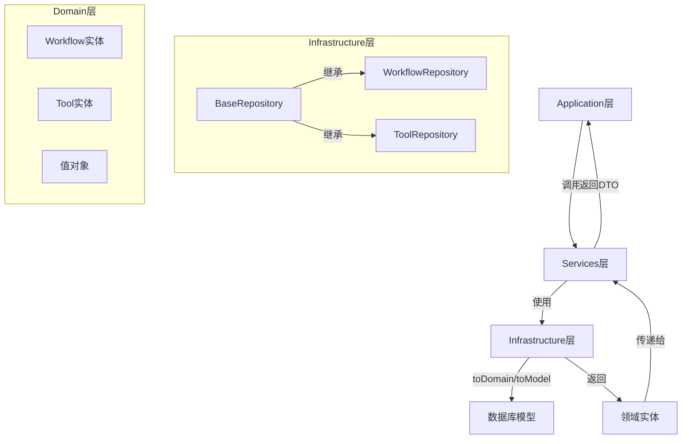

# toDomain方法使用分析报告

基于对项目的深入分析，我已完成对`toDomain`方法的全面调研。以下是详细分析结果：

## 一、使用位置统计

`toDomain`方法在项目中**共出现65次**，主要分布在以下7个仓储类中：

| 仓储类 | 使用次数 | 主要用途 |
|--------|---------|---------|
| [`tool-repository.ts`](src/infrastructure/persistence/repositories/tool-repository.ts) | 15次 | 工具实体转换 |
| [`workflow-repository.ts`](src/infrastructure/persistence/repositories/workflow-repository.ts) | 11次 | 工作流实体转换 |
| [`thread-repository.ts`](src/infrastructure/persistence/repositories/thread-repository.ts) | 11次 | 线程实体转换 |
| [`session-repository.ts`](src/infrastructure/persistence/repositories/session-repository.ts) | 7次 | 会话实体转换 |
| [`llm-response-repository.ts`](src/infrastructure/persistence/repositories/llm-response-repository.ts) | 9次 | LLM响应实体转换 |
| [`llm-request-repository.ts`](src/infrastructure/persistence/repositories/llm-request-repository.ts) | 6次 | LLM请求实体转换 |
| [`checkpoint-repository.ts`](src/infrastructure/persistence/repositories/checkpoint-repository.ts) | 2次 | 检查点实体转换 |
| [`base-repository.ts`](src/infrastructure/persistence/repositories/base-repository.ts) | 4次 | 基类默认实现 |

## 二、核心作用与设计模式

### 2.1 方法定义

**基类实现**（[`base-repository.ts:45`](src/infrastructure/persistence/repositories/base-repository.ts:45)）：
```typescript
protected toDomain(model: TModel): T {
  return model as any;  // 默认简单类型转换
}
```

**子类重写**（以[`workflow-repository.ts:34`](src/infrastructure/persistence/repositories/workflow-repository.ts:34)为例）：
```typescript
protected override toDomain(model: WorkflowModel): Workflow {
  try {
    const definition = WorkflowDefinition.fromProps({
      id: new ID(model.id),
      name: model.name,
      // ... 复杂转换逻辑
    });
    return Workflow.fromProps({ /* ... */ });
  } catch (error) {
    // 统一错误处理
    (customError as any).code = 'MAPPING_ERROR';
    (customError as any).context = { modelId: model.id, operation: 'toDomain' };
    throw customError;
  }
}
```

### 2.2 设计模式

`toDomain`方法是**数据映射器模式（Data Mapper Pattern）**的核心实现：

```mermaid
graph TD
    A[数据库模型 TModel] -->|toDomain()| B[领域实体 T]
    B -->|toModel()| A
    C[BaseRepository] -->|定义接口| D[子类Repository]
    D -->|重写| E[toDomain实现]
    D -->|重写| F[toModel实现]
```

**转换流程**：
1. **输入**：TypeORM数据库模型（如`WorkflowModel`）
2. **处理**：
   - 原始数据类型 → 值对象（`ID`, `Timestamp`, `Version`等）
   - 字符串枚举 → 类型安全枚举（`WorkflowStatus.fromString()`）
   - JSON字段 → 结构化对象（`Metadata.create()`）
   - 关联ID → 值对象数组（`dependencies.map(depId => new ID(depId))`）
3. **输出**：领域驱动设计的实体对象（如`Workflow`）

### 2.3 统一错误处理

所有子类都遵循相同的错误处理模式：
```typescript
catch (error) {
  const errorMessage = `XXX模型转换失败: ${error.message}`;
  const customError = new Error(errorMessage);
  (customError as any).code = 'MAPPING_ERROR';
  (customError as any).context = { modelId: model.id, operation: 'toDomain' };
  throw customError;
}
```

## 三、在架构中的位置与重要性

### 3.1 架构层次



### 3.2 重要性

1. **防腐层（Anti-Corruption Layer）**：隔离数据库模型与领域模型
2. **类型安全**：将原始数据库类型转换为强类型的领域对象
3. **业务规则封装**：在转换过程中应用领域规则（如状态验证、ID格式化）
4. **数据一致性**：确保所有仓储使用统一的转换逻辑

## 四、调用场景分析

`toDomain`主要在以下场景被调用：

1. **查询操作**（最常见）：
   ```typescript
   // 单条查询
   return model ? this.toDomain(model) : null;
   
   // 批量查询
   return models.map(model => this.toDomain(model));
   ```

2. **分页查询**：
   ```typescript
   return {
     items: models.map(model => this.toDomain(model)),
     total,
     totalPages
   };
   ```

3. **保存后返回**：
   ```typescript
   const savedModel = await repository.save(model);
   return this.toDomain(savedModel);
   ```

## 五、改进建议与最佳实践

### 5.1 当前优点

✅ **一致性**：所有仓储遵循相同的转换模式  
✅ **错误处理**：统一的错误码和上下文信息  
✅ **类型安全**：充分利用TypeScript类型系统  
✅ **可扩展性**：基类提供默认实现，子类可重写

### 5.2 改进建议

#### 建议1：提取转换逻辑为独立Mapper类

**当前问题**：转换逻辑与仓储类耦合，导致仓储类过于庞大

**改进方案**：
```typescript
// 新建：src/infrastructure/persistence/mappers/workflow-mapper.ts
export class WorkflowMapper {
  static toDomain(model: WorkflowModel): Workflow {
    // 转换逻辑
  }
  
  static toModel(entity: Workflow): WorkflowModel {
    // 转换逻辑
  }
}

// 仓储类简化
protected override toDomain(model: WorkflowModel): Workflow {
  return WorkflowMapper.toDomain(model);
}
```

#### 建议2：引入转换管道（Transformation Pipeline）

**当前问题**：转换逻辑复杂时，方法会变得冗长

**改进方案**：
```typescript
protected override toDomain(model: WorkflowModel): Workflow {
  return pipe(
    model,
    validateModel,
    extractBasicProps,
    buildDefinition,
    createWorkflow,
    handleErrors('Workflow')
  );
}
```

#### 建议3：增强错误处理

**当前问题**：错误信息不够详细，缺少转换路径追踪

**改进方案**：
```typescript
catch (error) {
  const conversionPath = this.getConversionPath(); // 记录转换路径
  throw new DomainConversionError({
    entityType: 'Workflow',
    modelId: model.id,
    operation: 'toDomain',
    path: conversionPath,
    cause: error
  });
}
```

#### 建议4：性能优化

**当前问题**：批量转换时可能存在性能瓶颈

**改进方案**：
```typescript
// 批量转换优化
protected override toDomainBatch(models: WorkflowModel[]): Workflow[] {
  // 批量提取ID，减少重复操作
  const ids = models.map(m => m.id);
  // 批量转换逻辑
}
```

### 5.3 最佳实践总结

1. **保持单一职责**：转换逻辑只负责数据映射，不包含业务规则
2. **防御性编程**：始终验证输入模型的完整性
3. **不可变性**：转换过程中不修改原始模型对象
4. **文档化**：为复杂转换逻辑添加详细注释
5. **测试覆盖**：为`toDomain`/`toModel`编写单元测试，确保转换正确性

## 六、总结

`toDomain`方法是项目架构中**数据访问层与领域层之间的关键桥梁**，体现了领域驱动设计中"防腐层"的设计思想。通过统一的转换机制，确保了数据库模型与领域模型的清晰分离，同时保持了类型安全和业务规则的一致性。虽然当前实现已经较为完善，但通过提取独立Mapper类、引入转换管道等方式仍可进一步提升可维护性和可测试性。
