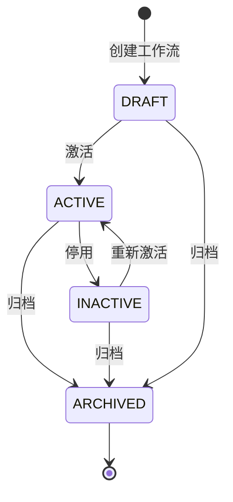
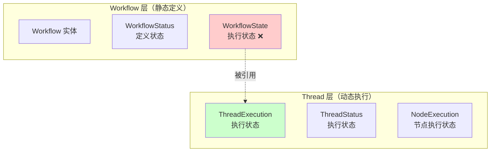
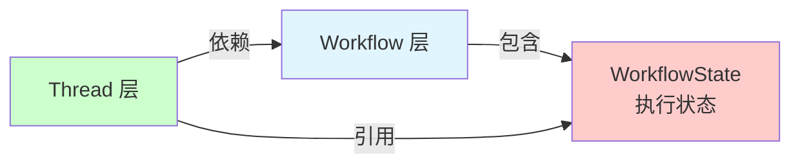
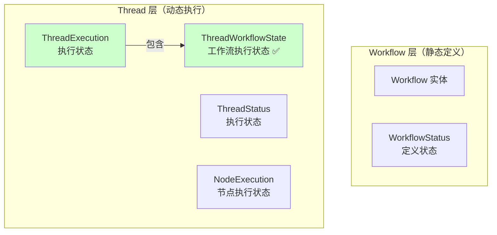
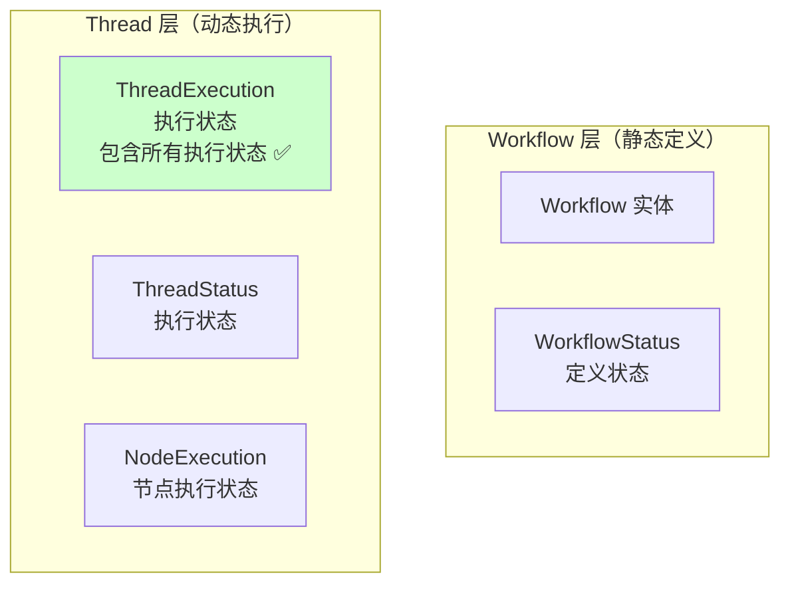
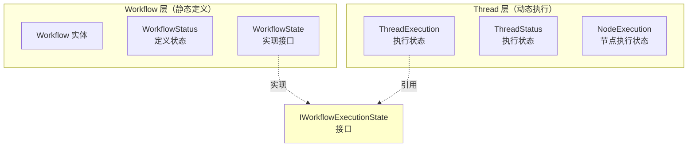

# Workflow 状态管理设计职责分析

## 概述

本文档分析了当前 Workflow 层的状态管理设计是否符合静态定义的职责，并评估是否需要修改工作流状态管理设计。

## 一、当前设计分析

### 1.1 Workflow 实体的职责定义

根据 [`src/domain/workflow/entities/workflow.ts`](../../src/domain/workflow/entities/workflow.ts:50-68) 的注释，Workflow 聚合根的职责如下：

**负责**：
1. 节点和边的基本管理（增删改）
2. 简单的存在性检查
3. 自身状态管理（版本、时间戳）
4. 属性访问
5. 简单的查询方法（如 getIncomingEdges, getOutgoingEdges）

**不负责**：
- 复杂的验证逻辑（由 GraphValidationService 负责）
- 图遍历和算法（由 GraphAlgorithmService 负责）
- 复杂度计算（由 GraphAlgorithmService 负责）
- **执行状态管理（由 Thread 负责）**
- **进度跟踪（由 Thread 负责）**
- UI 相关的布局和可视化
- 持久化细节

### 1.2 当前状态管理组件

#### WorkflowStatus（工作流状态）

**位置**：[`src/domain/workflow/value-objects/workflow-status.ts`](../../src/domain/workflow/value-objects/workflow-status.ts)

**职责**：
- 表示工作流的定义状态（DRAFT, ACTIVE, INACTIVE, ARCHIVED）
- 控制工作流的编辑和执行权限
- 提供状态转换验证

**状态枚举**：
```typescript
enum WorkflowStatusValue {
  DRAFT = 'draft',      // 草稿
  ACTIVE = 'active',    // 活跃
  INACTIVE = 'inactive',// 非活跃
  ARCHIVED = 'archived',// 已归档
}
```

**状态流转**：


**职责评估**：✅ **符合静态定义职责**
- WorkflowStatus 管理的是工作流的**定义状态**，而非执行状态
- 控制的是工作流的**编辑和执行权限**，而非执行过程
- 状态转换反映的是工作流定义的生命周期，而非执行生命周期

#### WorkflowState（工作流状态）

**位置**：[`src/domain/workflow/value-objects/workflow-state.ts`](../../src/domain/workflow/value-objects/workflow-state.ts)

**职责**：
- 管理工作流执行过程中的状态
- 跟踪当前执行节点
- 维护执行上下文数据
- 记录执行历史

**核心属性**：
```typescript
interface WorkflowStateProps {
  readonly workflowId: ID;
  readonly currentNodeId?: ID;                    // 当前节点ID
  readonly data: Record<string, any>;             // 执行上下文数据
  readonly history: ExecutionHistory[];           // 执行历史
  readonly metadata: Record<string, any>;         // 元数据
  readonly createdAt: Timestamp;                  // 创建时间
  readonly updatedAt: Timestamp;                  // 更新时间
}
```

**职责评估**：❌ **不符合静态定义职责**

**问题分析**：

1. **职责混淆**：
   - WorkflowState 管理的是**执行状态**（currentNodeId, data, history）
   - 但它位于 Workflow 层，而 Workflow 应该是**静态定义**
   - 执行状态应该由 Thread 层管理

2. **命名误导**：
   - 名称 `WorkflowState` 容易让人误以为是工作流的状态
   - 实际上它管理的是工作流**执行实例**的状态
   - 应该命名为 `WorkflowExecutionState` 或 `ThreadWorkflowState`

3. **位置错误**：
   - WorkflowState 位于 `src/domain/workflow/value-objects/`
   - 但它管理的是执行时状态，应该位于 `src/domain/threads/value-objects/`

4. **与 Workflow 实体职责冲突**：
   - Workflow 实体明确说明"不负责执行状态管理（由 Thread 负责）"
   - 但 WorkflowState 却在 Workflow 层管理执行状态
   - 这造成了职责冲突

### 1.3 ThreadExecution 的职责

**位置**：[`src/domain/threads/value-objects/thread-execution.ts`](../../src/domain/threads/value-objects/thread-execution.ts)

**职责**：
- 管理线程的执行状态信息
- 跟踪执行进度和时间
- 记录操作历史
- 管理节点执行状态
- 维护执行上下文

**核心属性**：
```typescript
interface ThreadExecutionProps {
  readonly threadId: ID;
  readonly status: ThreadStatus;
  readonly progress: number;
  readonly currentStep?: string;
  readonly startedAt?: Timestamp;
  readonly completedAt?: Timestamp;
  readonly errorMessage?: string;
  readonly retryCount: number;
  readonly lastActivityAt: Timestamp;
  readonly nodeExecutions: Map<string, NodeExecution>;
  readonly context: ExecutionContext;
  readonly operationHistory: OperationRecord[];
  readonly forkInfo?: ForkInfo;
  readonly copyInfo?: CopyInfo;
  readonly workflowState?: WorkflowState;  // ⚠️ 引用了 Workflow 层的执行状态
}
```

**职责评估**：⚠️ **部分符合，但存在依赖问题**

**问题分析**：

1. **跨层依赖**：
   - ThreadExecution 引用了 `workflowState?: WorkflowState`
   - WorkflowState 位于 Workflow 层
   - 这造成了 Thread 层对 Workflow 层的依赖

2. **职责重叠**：
   - ThreadExecution 已经管理了执行状态（status, progress, nodeExecutions）
   - WorkflowState 也管理了执行状态（currentNodeId, data, history）
   - 两者存在职责重叠

3. **数据冗余**：
   - ThreadExecution 有 `nodeExecutions: Map<string, NodeExecution>`
   - WorkflowState 有 `history: ExecutionHistory[]`
   - 两者都记录了节点执行历史，存在数据冗余

## 二、架构问题总结

### 2.1 职责分离不清晰



**问题**：
- WorkflowState 位于 Workflow 层，但管理的是执行状态
- ThreadExecution 位于 Thread 层，但引用了 Workflow 层的 WorkflowState
- 职责分离不清晰，违反了单一职责原则

### 2.2 依赖关系混乱



**问题**：
- Thread 层依赖 Workflow 层是合理的（Thread 需要使用 Workflow 定义）
- 但 Thread 层引用 Workflow 层的执行状态是不合理的
- 执行状态应该完全由 Thread 层管理

### 2.3 数据冗余

| ThreadExecution | WorkflowState | 说明 |
|----------------|---------------|------|
| `nodeExecutions: Map<string, NodeExecution>` | `history: ExecutionHistory[]` | 都记录节点执行历史 |
| `progress: number` | 无 | ThreadExecution 有进度，WorkflowState 没有 |
| `currentStep?: string` | `currentNodeId?: ID` | 都记录当前执行位置 |
| `context: ExecutionContext` | `data: Record<string, any>` | 都管理执行上下文数据 |

**问题**：
- 两个值对象都管理执行状态，存在数据冗余
- 数据不一致的风险
- 维护成本增加

## 三、设计原则分析

### 3.1 DDD 聚合根原则

**原则**：聚合根是唯一的外部访问入口，负责维护聚合内部的一致性。

**当前问题**：
- Workflow 是聚合根，应该只管理静态定义
- WorkflowState 管理执行状态，但位于 Workflow 聚合内
- 执行状态应该由 Thread 聚合管理

### 3.2 单一职责原则（SRP）

**原则**：一个类应该只有一个引起它变化的原因。

**当前问题**：
- WorkflowState 既管理执行状态，又位于 Workflow 层
- 有两个引起它变化的原因：
  1. 工作流定义的变化
  2. 工作流执行的变化

### 3.3 依赖倒置原则（DIP）

**原则**：高层模块不应该依赖低层模块，两者都应该依赖抽象。

**当前问题**：
- Thread 层（高层）依赖 Workflow 层（低层）的 WorkflowState
- 应该定义执行状态的抽象接口

### 3.4 关注点分离（SoC）

**原则**：将系统划分为不同的关注点，每个关注点独立变化。

**当前问题**：
- Workflow 层混合了定义关注点和执行关注点
- 应该将定义和执行完全分离

## 四、改进建议

### 4.1 方案一：将 WorkflowState 移至 Thread 层

**设计思路**：
- 将 WorkflowState 从 Workflow 层移至 Thread 层
- 重命名为 `ThreadWorkflowState` 或 `WorkflowExecutionState`
- ThreadExecution 完全拥有执行状态

**优点**：
- ✅ 职责清晰：Thread 层完全负责执行状态
- ✅ 依赖清晰：Thread 层不再依赖 Workflow 层的执行状态
- ✅ 符合 DDD 原则：Thread 聚合管理执行状态

**缺点**：
- ⚠️ 需要重构现有代码
- ⚠️ 可能影响其他依赖 WorkflowState 的代码

**架构图**：


### 4.2 方案二：合并 WorkflowState 到 ThreadExecution

**设计思路**：
- 将 WorkflowState 的属性合并到 ThreadExecution
- 删除 WorkflowState 值对象
- ThreadExecution 成为唯一的执行状态管理器

**优点**：
- ✅ 简化架构：减少一个值对象
- ✅ 消除冗余：避免数据重复
- ✅ 职责集中：所有执行状态集中管理

**缺点**：
- ⚠️ ThreadExecution 可能变得过于庞大
- ⚠️ 需要重构现有代码

**架构图**：


### 4.3 方案三：定义执行状态抽象接口

**设计思路**：
- 定义 `IWorkflowExecutionState` 接口
- WorkflowState 实现该接口
- ThreadExecution 通过接口引用执行状态
- 保持当前架构，但通过接口解耦

**优点**：
- ✅ 最小化改动：不需要大规模重构
- ✅ 解耦依赖：通过接口解耦
- ✅ 灵活性：可以有多种实现

**缺点**：
- ⚠️ 职责仍然不清晰
- ⚠️ 仍然存在跨层依赖
- ⚠️ 没有解决根本问题

**架构图**：


## 五、推荐方案

### 5.1 推荐方案：方案一 + 方案二的结合

**设计思路**：
1. 将 WorkflowState 从 Workflow 层移至 Thread 层
2. 重命名为 `ThreadWorkflowState`
3. 评估是否需要保留为独立值对象，或合并到 ThreadExecution
4. 如果保留为独立值对象，确保职责清晰
5. 如果合并到 ThreadExecution，确保不会过于庞大

**实施步骤**：

#### 步骤 1：创建 ThreadWorkflowState

```typescript
// src/domain/threads/value-objects/thread-workflow-state.ts

export interface ThreadWorkflowStateProps {
  readonly workflowId: ID;
  readonly currentNodeId?: ID;
  readonly data: Record<string, any>;
  readonly history: ExecutionHistory[];
  readonly metadata: Record<string, any>;
  readonly createdAt: Timestamp;
  readonly updatedAt: Timestamp;
}

export class ThreadWorkflowState extends ValueObject<ThreadWorkflowStateProps> {
  // ... 实现代码
}
```

#### 步骤 2：更新 ThreadExecution

```typescript
// src/domain/threads/value-objects/thread-execution.ts

export interface ThreadExecutionProps {
  readonly threadId: ID;
  readonly status: ThreadStatus;
  readonly progress: number;
  readonly currentStep?: string;
  readonly startedAt?: Timestamp;
  readonly completedAt?: Timestamp;
  readonly errorMessage?: string;
  readonly retryCount: number;
  readonly lastActivityAt: Timestamp;
  readonly nodeExecutions: Map<string, NodeExecution>;
  readonly context: ExecutionContext;
  readonly operationHistory: OperationRecord[];
  readonly forkInfo?: ForkInfo;
  readonly copyInfo?: CopyInfo;
  readonly workflowState?: ThreadWorkflowState;  // ✅ 改为 ThreadWorkflowState
}
```

#### 步骤 3：迁移 WorkflowState 的使用

- 查找所有使用 WorkflowState 的地方
- 替换为 ThreadWorkflowState
- 更新导入路径

#### 步骤 4：删除 WorkflowState

- 删除 `src/domain/workflow/value-objects/workflow-state.ts`
- 更新相关文档

#### 步骤 5：评估是否需要合并

- 评估 ThreadWorkflowState 和 ThreadExecution 的职责
- 如果职责重叠严重，考虑合并
- 如果职责清晰，保持独立

### 5.2 架构对比

**当前架构**：
```
Workflow 层
├── Workflow 实体（静态定义）
├── WorkflowStatus（定义状态）✅
└── WorkflowState（执行状态）❌ 职责错误

Thread 层
├── Thread 实体
├── ThreadExecution（执行状态）
├── ThreadStatus（执行状态）
└── NodeExecution（节点执行状态）

依赖关系：
ThreadExecution → WorkflowState ❌ 跨层依赖
```

**推荐架构**：
```
Workflow 层
├── Workflow 实体（静态定义）
└── WorkflowStatus（定义状态）✅

Thread 层
├── Thread 实体
├── ThreadExecution（执行状态）
├── ThreadStatus（执行状态）
├── NodeExecution（节点执行状态）
└── ThreadWorkflowState（工作流执行状态）✅

依赖关系：
ThreadExecution → ThreadWorkflowState ✅ 同层依赖
```

## 六、重构影响分析

### 6.1 影响范围

**需要修改的文件**：
1. `src/domain/workflow/value-objects/workflow-state.ts` - 删除
2. `src/domain/threads/value-objects/thread-execution.ts` - 更新引用
3. `src/application/workflow/services/state-manager.ts` - 更新引用
4. 所有使用 WorkflowState 的文件 - 更新引用

**可能影响的模块**：
- Workflow 服务
- Thread 服务
- Checkpoint 服务
- History 服务

### 6.2 风险评估

| 风险 | 级别 | 缓解措施 |
|------|------|---------|
| 破坏现有功能 | 高 | 充分测试，逐步迁移 |
| 影响性能 | 低 | 主要是引用变更，性能影响小 |
| 增加复杂度 | 中 | 清晰的文档和注释 |
| 兼容性问题 | 中 | 提供迁移指南 |

### 6.3 迁移策略

**阶段 1：准备阶段**
- 创建 ThreadWorkflowState
- 编写单元测试
- 更新文档

**阶段 2：迁移阶段**
- 逐步替换 WorkflowState 的使用
- 每次替换后进行测试
- 确保功能正常

**阶段 3：清理阶段**
- 删除 WorkflowState
- 清理未使用的代码
- 更新所有文档

## 七、总结

### 7.1 问题总结

当前 Workflow 状态管理设计存在以下问题：

1. **职责混淆**：WorkflowState 管理执行状态，但位于 Workflow 层
2. **跨层依赖**：Thread 层依赖 Workflow 层的执行状态
3. **数据冗余**：ThreadExecution 和 WorkflowState 都管理执行状态
4. **命名误导**：WorkflowState 名称容易引起误解
5. **违反原则**：违反单一职责原则、关注点分离原则

### 7.2 推荐方案

**推荐方案**：将 WorkflowState 移至 Thread 层，重命名为 ThreadWorkflowState

**理由**：
- ✅ 职责清晰：Thread 层完全负责执行状态
- ✅ 依赖清晰：消除跨层依赖
- ✅ 符合原则：符合 DDD、SRP、SoC 原则
- ✅ 易于理解：架构更加清晰

### 7.3 实施建议

1. **优先级**：高
2. **复杂度**：中
3. **风险**：中
4. **收益**：高

**建议**：
- 尽快实施重构
- 采用渐进式迁移策略
- 充分测试确保功能正常
- 更新所有相关文档

## 八、相关文档

- [Thread 和 Workflow 层状态管理分析](./thread-workflow-state-management-analysis.md)
- [Session-Thread-Workflow 关系分析](./session-thread-workflow-relationship-analysis.md)

---

**文档版本**：1.0.0
**最后更新**：2025-01-15
**维护者**：架构团队