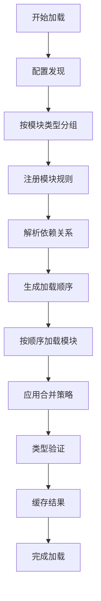

# 配置加载模块实现方案

## 1. 设计目标

基于"基础处理器+模块特定规则"的设计模式，实现一个灵活、可扩展的配置加载系统，能够：

1. **自动发现**：自动扫描和发现配置文件
2. **模块化加载**：按模块类型加载配置，支持特定规则
3. **依赖解析**：处理配置间的依赖关系
4. **类型安全**：提供完整的TypeScript类型支持
5. **性能优化**：支持懒加载和缓存机制

## 2. 架构设计

### 2.1 核心组件

```
ConfigLoadingModule
├── ConfigDiscovery          # 配置发现器
├── ModuleLoader             # 模块加载器
├── DependencyResolver       # 依赖解析器
├── TypeRegistry            # 类型注册表
└── LoadingCache            # 加载缓存
```

### 2.2 设计模式

采用**策略模式**和**工厂模式**的组合：

- **基础处理器**：提供通用的配置加载逻辑
- **模块特定规则**：为不同配置模块定义专门的加载规则
- **规则注册机制**：支持动态注册新的模块规则

## 3. 详细设计

### 3.1 配置发现器 (ConfigDiscovery)

```typescript
interface IConfigDiscovery {
  discoverConfigs(basePath: string): Promise<ConfigFile[]>;
  discoverModuleConfigs(modulePath: string, moduleType: string): Promise<ConfigFile[]>;
}

interface ConfigFile {
  path: string;
  type: string;
  moduleType: string;
  priority: number;
  metadata: Record<string, any>;
}
```

**功能**：
- 扫描指定目录下的配置文件
- 根据文件名和路径识别模块类型
- 支持过滤规则（如忽略`_`开头的文件）
- 提供文件元数据信息

### 3.2 模块加载器 (ModuleLoader)

```typescript
interface IModuleLoader {
  loadModule(configFiles: ConfigFile[]): Promise<ModuleConfig>;
  supports(moduleType: string): boolean;
}

interface ModuleConfig {
  type: string;
  configs: Record<string, any>;
  metadata: ModuleMetadata;
  dependencies: string[];
}

interface ModuleMetadata {
  name: string;
  version: string;
  description: string;
  registry?: string;
}
```

**设计原则**：
- 每种配置模块类型对应一个专门的加载器
- 加载器负责解析特定格式的配置文件
- 处理模块内的配置合并和验证

### 3.3 依赖解析器 (DependencyResolver)

```typescript
interface IDependencyResolver {
  resolveDependencies(modules: Map<string, ModuleConfig>): Promise<LoadingOrder>;
  checkCircularDependency(modules: Map<string, ModuleConfig>): DependencyError[];
}

interface LoadingOrder {
  orderedModules: string[];
  parallelGroups: string[][];
}
```

**功能**：
- 分析模块间的依赖关系
- 生成正确的加载顺序
- 检测循环依赖
- 支持并行加载优化

### 3.4 类型注册表 (TypeRegistry)

```typescript
interface ITypeRegistry {
  registerModuleType(moduleType: string, schema: JSONSchema): void;
  getSchema(moduleType: string): JSONSchema | undefined;
  validateConfig(moduleType: string, config: any): ValidationResult;
}
```

**功能**：
- 注册各模块类型的JSON Schema
- 提供运行时类型验证
- 支持类型推断和自动补全

## 4. 模块特定规则设计

### 4.1 规则定义接口

```typescript
interface IModuleRule {
  moduleType: string;
  patterns: string[];
  priority: number;
  loader: IModuleLoader;
  schema: JSONSchema;
  dependencies?: string[];
  mergeStrategy: MergeStrategy;
}

enum MergeStrategy {
  OVERRIDE = 'override',
  MERGE_DEEP = 'merge_deep',
  MERGE_SHALLOW = 'merge_shallow',
  ARRAY_APPEND = 'array_append'
}
```

### 4.2 预定义模块规则

#### 4.2.1 LLM模块规则

```typescript
const LLMModuleRule: IModuleRule = {
  moduleType: 'llm',
  patterns: [
    'llms/_group.toml',
    'llms/provider/**/common.toml',
    'llms/provider/**/*.toml',
    'llms/groups/*.toml',
    'llms/polling_pools/*.toml'
  ],
  priority: 100,
  loader: new LLMLoader(),
  schema: LLMSchema,
  dependencies: ['global'],
  mergeStrategy: MergeStrategy.MERGE_DEEP
};
```

#### 4.2.2 工具模块规则

```typescript
const ToolModuleRule: IModuleRule = {
  moduleType: 'tools',
  patterns: [
    'tools/__registry__.toml',
    'tools/builtin/*.toml',
    'tools/native/*.toml',
    'tools/rest/*.toml',
    'tools/mcp/*.toml'
  ],
  priority: 90,
  loader: new ToolLoader(),
  schema: ToolSchema,
  dependencies: ['global'],
  mergeStrategy: MergeStrategy.MERGE_DEEP
};
```

#### 4.2.3 工作流模块规则

```typescript
const WorkflowModuleRule: IModuleRule = {
  moduleType: 'workflows',
  patterns: [
    'workflows/__registry__.toml',
    'workflows/*.toml',
    'workflows/examples/*.toml',
    'workflows/state_machine/*.toml'
  ],
  priority: 80,
  loader: new WorkflowLoader(),
  schema: WorkflowSchema,
  dependencies: ['global', 'tools', 'nodes', 'edges'],
  mergeStrategy: MergeStrategy.MERGE_DEEP
};
```

## 5. 实现流程

### 5.1 配置加载主流程



### 5.2 详细步骤

1. **配置发现阶段**
   - 扫描配置目录
   - 识别配置文件类型
   - 收集文件元数据

2. **规则匹配阶段**
   - 根据文件路径匹配模块规则
   - 创建模块加载器实例
   - 建立模块依赖图

3. **依赖解析阶段**
   - 分析模块间依赖关系
   - 检测循环依赖
   - 生成加载顺序

4. **模块加载阶段**
   - 按顺序加载各模块
   - 应用模块特定加载逻辑
   - 处理配置继承和合并

5. **验证和缓存阶段**
   - 执行类型验证
   - 缓存加载结果
   - 注册变更监听

## 6. 基础处理器实现

### 6.1 抽象基础加载器

```typescript
abstract class BaseModuleLoader implements IModuleLoader {
  abstract readonly moduleType: string;
  abstract readonly schema: JSONSchema;
  
  async loadModule(configFiles: ConfigFile[]): Promise<ModuleConfig> {
    // 1. 预处理配置文件
    const processedFiles = await this.preprocessFiles(configFiles);
    
    // 2. 按优先级排序
    const sortedFiles = this.sortByPriority(processedFiles);
    
    // 3. 逐个加载配置
    const configs = await this.loadConfigs(sortedFiles);
    
    // 4. 应用模块特定合并逻辑
    const mergedConfig = await this.mergeConfigs(configs);
    
    // 5. 提取元数据和依赖
    const metadata = this.extractMetadata(mergedConfig);
    const dependencies = this.extractDependencies(mergedConfig);
    
    return {
      type: this.moduleType,
      configs: mergedConfig,
      metadata,
      dependencies
    };
  }
  
  protected abstract preprocessFiles(files: ConfigFile[]): Promise<ConfigFile[]>;
  protected abstract loadConfigs(files: ConfigFile[]): Promise<Record<string, any>[]>;
  protected abstract mergeConfigs(configs: Record<string, any>[]): Promise<Record<string, any>>;
  protected abstract extractMetadata(config: Record<string, any>): ModuleMetadata;
  protected abstract extractDependencies(config: Record<string, any>): string[];
  
  supports(moduleType: string): boolean {
    return moduleType === this.moduleType;
  }
  
  private sortByPriority(files: ConfigFile[]): ConfigFile[] {
    return files.sort((a, b) => b.priority - a.priority);
  }
}
```

### 6.2 LLM模块加载器示例

```typescript
class LLMLoader extends BaseModuleLoader {
  readonly moduleType = 'llm';
  readonly schema = LLMSchema;
  
  protected async preprocessFiles(files: ConfigFile[]): Promise<ConfigFile[]> {
    // 处理继承关系
    const processedFiles = [];
    
    for (const file of files) {
      if (file.path.includes('common.toml')) {
        // 通用配置优先级最高
        file.priority = 1000;
      } else if (file.path.includes('provider/')) {
        // 提供商配置次之
        file.priority = 500;
      } else {
        // 其他配置
        file.priority = 100;
      }
      
      processedFiles.push(file);
    }
    
    return processedFiles;
  }
  
  protected async loadConfigs(files: ConfigFile[]): Promise<Record<string, any>[]> {
    const configs = [];
    
    for (const file of files) {
      const content = await this.loadFile(file.path);
      const processed = await this.applyInheritance(content, file.path);
      configs.push(processed);
    }
    
    return configs;
  }
  
  protected async mergeConfigs(configs: Record<string, any>[]): Promise<Record<string, any>> {
    let result = {};
    
    // 先加载_group配置
    const groupConfig = configs.find(c => c._group);
    if (groupConfig) {
      result = { ...groupConfig };
    }
    
    // 合并提供商配置
    const providerConfigs = configs.filter(c => c.provider);
    for (const config of providerConfigs) {
      const provider = config.provider;
      result[provider] = { ...result[provider], ...config };
    }
    
    // 合并组和轮询池配置
    const otherConfigs = configs.filter(c => !c._group && !c.provider);
    for (const config of otherConfigs) {
      result = this.deepMerge(result, config);
    }
    
    return result;
  }
  
  protected extractMetadata(config: Record<string, any>): ModuleMetadata {
    return {
      name: 'llm',
      version: '1.0.0',
      description: 'LLM配置模块',
      registry: config._registry
    };
  }
  
  protected extractDependencies(config: Record<string, any>): string[] {
    return ['global'];
  }
  
  private async loadFile(path: string): Promise<Record<string, any>> {
    // 实现文件加载逻辑
  }
  
  private async applyInheritance(config: Record<string, any>, filePath: string): Promise<Record<string, any>> {
    // 实现继承处理逻辑
  }
  
  private deepMerge(target: any, source: any): any {
    // 实现深度合并逻辑
  }
}
```

## 7. 配置加载模块主类

```typescript
class ConfigLoadingModule {
  private readonly discovery: IConfigDiscovery;
  private readonly loaders: Map<string, IModuleLoader> = new Map();
  private readonly resolver: IDependencyResolver;
  private readonly registry: ITypeRegistry;
  private readonly cache: ILoadingCache;
  
  constructor(
    discovery: IConfigDiscovery,
    resolver: IDependencyResolver,
    registry: ITypeRegistry,
    cache: ILoadingCache
  ) {
    this.discovery = discovery;
    this.resolver = resolver;
    this.registry = registry;
    this.cache = cache;
  }
  
  registerModuleRule(rule: IModuleRule): void {
    this.loaders.set(rule.moduleType, rule.loader);
    this.registry.registerModuleType(rule.moduleType, rule.schema);
  }
  
  async loadAllConfigs(basePath: string): Promise<Record<string, any>> {
    // 1. 发现所有配置文件
    const allFiles = await this.discovery.discoverConfigs(basePath);
    
    // 2. 按模块类型分组
    const moduleFiles = this.groupByModuleType(allFiles);
    
    // 3. 加载各模块配置
    const modules = new Map<string, ModuleConfig>();
    
    for (const [moduleType, files] of moduleFiles) {
      const loader = this.loaders.get(moduleType);
      if (loader) {
        const moduleConfig = await loader.loadModule(files);
        modules.set(moduleType, moduleConfig);
      }
    }
    
    // 4. 解析依赖关系并生成加载顺序
    const loadingOrder = await this.resolver.resolveDependencies(modules);
    
    // 5. 按顺序合并配置
    const result = await this.mergeInOrder(modules, loadingOrder);
    
    // 6. 缓存结果
    await this.cache.store(result);
    
    return result;
  }
  
  private groupByModuleType(files: ConfigFile[]): Map<string, ConfigFile[]> {
    const groups = new Map<string, ConfigFile[]>();
    
    for (const file of files) {
      if (!groups.has(file.moduleType)) {
        groups.set(file.moduleType, []);
      }
      groups.get(file.moduleType)!.push(file);
    }
    
    return groups;
  }
  
  private async mergeInOrder(
    modules: Map<string, ModuleConfig>, 
    order: LoadingOrder
  ): Promise<Record<string, any>> {
    let result = {};
    
    for (const moduleName of order.orderedModules) {
      const module = modules.get(moduleName);
      if (module) {
        result = { ...result, [moduleName]: module.configs };
      }
    }
    
    return result;
  }
}
```

## 8. 使用示例

```typescript
// 初始化配置加载模块
const discovery = new ConfigDiscovery();
const resolver = new DependencyResolver();
const registry = new TypeRegistry();
const cache = new LoadingCache();

const loadingModule = new ConfigLoadingModule(discovery, resolver, registry, cache);

// 注册模块规则
loadingModule.registerModuleRule(LLMModuleRule);
loadingModule.registerModuleRule(ToolModuleRule);
loadingModule.registerModuleRule(WorkflowModuleRule);

// 加载所有配置
const configs = await loadingModule.loadAllConfigs('./configs');

console.log('LLM配置:', configs.llm);
console.log('工具配置:', configs.tools);
console.log('工作流配置:', configs.workflows);
```

## 9. 扩展性设计

### 9.1 添加新模块类型

```typescript
// 1. 定义新的模块规则
const NewModuleRule: IModuleRule = {
  moduleType: 'new_module',
  patterns: ['new_module/**/*.toml'],
  priority: 70,
  loader: new NewModuleLoader(),
  schema: NewModuleSchema,
  dependencies: ['global'],
  mergeStrategy: MergeStrategy.MERGE_DEEP
};

// 2. 实现专门的加载器
class NewModuleLoader extends BaseModuleLoader {
  readonly moduleType = 'new_module';
  readonly schema = NewModuleSchema;
  
  // 实现模块特定的加载逻辑
}

// 3. 注册规则
loadingModule.registerModuleRule(NewModuleRule);
```

### 9.2 自定义合并策略

```typescript
class CustomMergeStrategy implements IMergeStrategy {
  merge(target: any, source: any): any {
    // 实现自定义合并逻辑
  }
}

// 在模块规则中使用
const CustomModuleRule: IModuleRule = {
  // ...
  mergeStrategy: new CustomMergeStrategy()
};
```

## 10. 性能优化

### 10.1 懒加载机制

```typescript
class LazyConfigLoadingModule extends ConfigLoadingModule {
  private loadedModules = new Set<string>();
  
  async getModule(moduleType: string): Promise<Record<string, any>> {
    if (!this.loadedModules.has(moduleType)) {
      await this.loadModule(moduleType);
      this.loadedModules.add(moduleType);
    }
    
    return this.cache.get(moduleType);
  }
}
```

### 10.2 并行加载优化

```typescript
async loadModulesInParallel(moduleTypes: string[]): Promise<Record<string, any>> {
  // 分析依赖关系，确定可以并行加载的模块组
  const parallelGroups = this.analyzeParallelGroups(moduleTypes);
  
  const results = {};
  
  for (const group of parallelGroups) {
    const groupPromises = group.map(type => this.loadModule(type));
    const groupResults = await Promise.all(groupPromises);
    
    groupResults.forEach(result => {
      Object.assign(results, result);
    });
  }
  
  return results;
}
```

## 11. 总结

这个配置加载模块设计具有以下优势：

1. **模块化**：每种配置类型有专门的加载器和规则
2. **可扩展**：易于添加新的配置模块类型
3. **类型安全**：完整的TypeScript支持和Schema验证
4. **性能优化**：支持懒加载、缓存和并行加载
5. **依赖管理**：自动处理模块间的依赖关系
6. **灵活配置**：支持多种合并策略和加载规则

通过"基础处理器+模块特定规则"的设计模式，实现了既统一又灵活的配置加载系统，为TypeScript模块化智能体框架提供了强大的配置管理能力。