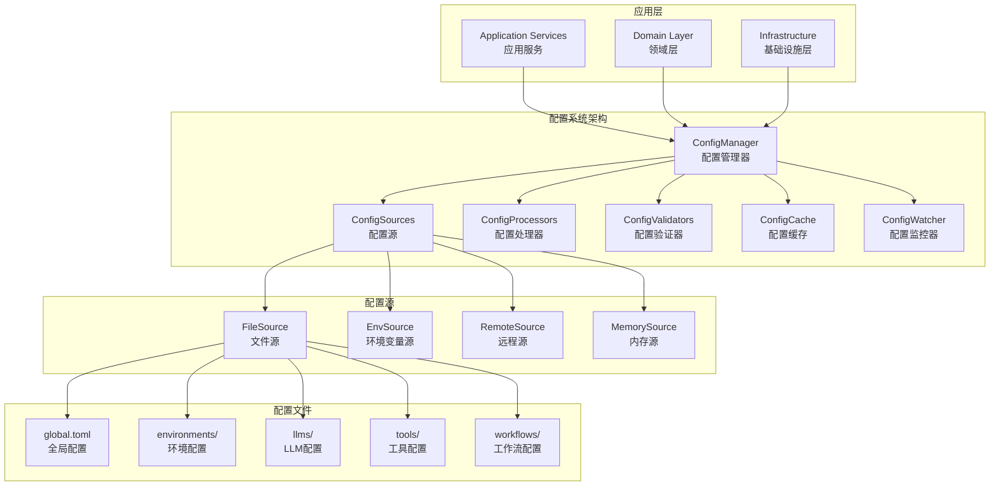

# TypeScript模块化智能体框架配置系统设计

## 1. Python配置系统分析

### 1.1 层次结构特点

基于对Python实现的分析，其配置系统具有以下特点：

1. **分层目录结构**：
   - 按功能模块组织（llms、tools、workflows等）
   - 每个模块内部有子分类（provider、groups等）
   - 使用`_group.yaml`文件定义分组配置
   - 使用`__registry__.yaml`文件定义注册表

2. **继承机制**：
   - 通过`inherits_from`字段指定继承关系
   - 支持跨文件继承（如`gpt-4o.yaml`继承`common.yaml`）
   - 深度合并策略，子配置覆盖父配置

3. **环境变量注入**：
   - 使用`${VARIABLE_NAME}`语法
   - 支持默认值和条件注入

4. **配置验证**：
   - 每个配置文件包含`validation_rules`
   - 支持类型检查和业务规则验证

### 1.2 完整功能模块

Python实现包含以下完整配置模块：
- **全局配置**：系统级配置
- **LLM配置**：提供商、组、轮询池、并发控制等
- **工具配置**：内置、原生、REST、MCP工具
- **工作流配置**：基础工作流、示例、状态机
- **节点配置**：节点定义和函数
- **边配置**：路由函数和示例
- **提示词配置**：系统提示词和用户命令
- **存储配置**：存储类型配置
- **历史配置**：历史回放和检查点
- **插件配置**：插件系统配置
- **触发器配置**：触发器组合和函数

## 1.3 当前实现状态

### 1.3.1 已实现功能 ✅
- 基础配置管理器框架
- 文件、环境变量、内存配置源
- 环境变量注入和继承处理器
- Schema和业务验证器
- 基础目录结构
- 少量示例配置文件

### 1.3.2 部分实现功能 ⚠️
- LLM配置（仅OpenAI提供商）
- 工具配置（仅计算器工具）

### 1.3.3 未实现功能 ❌
- 工作流配置系统
- 节点配置系统
- 边配置系统
- 提示词配置系统
- 存储配置系统
- 历史配置系统
- 插件配置系统
- 触发器配置系统
- 大部分LLM提供商配置
- 大部分工具类型配置

> **详细差距分析请参考**：[配置系统差距分析文档](./config-system-gap-analysis.md)

## 2. TypeScript配置系统设计

### 2.1 目录结构设计

```
configs/
├── global.toml                    # 全局配置
├── environments/                  # 环境特定配置
│   ├── development.toml
│   ├── test.toml
│   └── production.toml
├── llms/                          # LLM配置
│   ├── _group.toml               # LLM分组配置
│   ├── provider/                  # 提供商配置
│   │   ├── openai/
│   │   │   ├── common.toml       # OpenAI通用配置
│   │   │   ├── gpt-4o.toml       # GPT-4o特定配置
│   │   │   └── gpt-4.toml
│   │   ├── anthropic/
│   │   │   ├── common.toml
│   │   │   └── claude-sonnet.toml
│   │   └── gemini/
│   │       ├── common.toml
│   │       └── gemini-pro.toml
│   ├── groups/                    # LLM组配置
│   │   ├── execute_group.toml
│   │   ├── fast_group.toml
│   │   └── thinking_group.toml
│   └── polling_pools/             # 轮询池配置
│       ├── fast_pool.toml
│       └── thinking_pool.toml
├── tools/                         # 工具配置
│   ├── __registry__.toml         # 工具注册表
│   ├── builtin/                   # 内置工具
│   │   ├── calculator.toml
│   │   └── time_tool.toml
│   ├── native/                    # 原生工具
│   │   └── sequentialthinking.toml
│   ├── rest/                      # REST工具
│   │   ├── fetch.toml
│   │   └── weather.toml
│   └── mcp/                       # MCP工具
│       └── database.toml
├── workflows/                     # 工作流配置
│   ├── __registry__.toml
│   ├── base_workflow.toml
│   ├── react_workflow.toml
│   └── examples/
│       ├── conditional_routing.toml
│       └── parallel_processing.toml
├── nodes/                         # 节点配置
│   ├── _group.toml
│   ├── start.toml
│   └── end.toml
├── edges/                         # 边配置
│   ├── _group.toml
│   └── route_functions/
│       ├── builtin.toml
│       └── custom.toml
├── storage/                       # 存储配置
│   └── storage_types.toml
├── prompts/                       # 提示词配置
│   ├── system/
│   └── user_commands/
└── schemas/                       # 配置模式定义
    ├── global.schema.toml
    ├── llm.schema.toml
    ├── tool.schema.toml
    └── workflow.schema.toml
```

### 2.2 配置继承和覆盖机制

#### 2.2.1 继承语法

```toml
# 继承配置示例
inherits_from = ["common.toml", "base_config.toml"]

# 或者指定完整路径
inherits_from = ["../provider/openai/common.toml"]
```

#### 2.2.2 覆盖策略

1. **深度合并**：嵌套对象进行深度合并
2. **数组替换**：数组类型完全替换而非合并
3. **优先级顺序**：
   - 环境变量 > 命令行参数 > 环境特定配置 > 默认配置
   - 后继承的配置覆盖先继承的配置

#### 2.2.3 继承解析器

```typescript
interface ConfigInheritance {
  inherits_from?: string[];
  [key: string]: any;
}

class ConfigInheritanceResolver {
  async resolveInheritance(configPath: string): Promise<Record<string, any>> {
    // 1. 解析inherits_from字段
    // 2. 递归加载父配置
    // 3. 按顺序合并配置
    // 4. 应用当前配置覆盖
  }
}
```

### 2.3 配置加载和解析策略

#### 2.3.1 加载顺序

1. **基础配置**：`global.toml`
2. **模块配置**：各模块的`_group.toml`和`__registry__.toml`
3. **具体配置**：具体的工具、LLM等配置
4. **环境配置**：`environments/{env}.toml`
5. **本地覆盖**：`.env.local`或`local.toml`
6. **运行时注入**：环境变量和命令行参数

#### 2.3.2 配置源实现

```typescript
// 文件配置源
class FileConfigSource implements IConfigSource {
  constructor(
    private readonly basePath: string,
    private readonly format: ConfigFormat
  ) {}
  
  async load(): Promise<Record<string, any>> {
    // 扫描配置目录
    // 解析TOML文件
    // 处理继承关系
  }
}

// 环境变量配置源
class EnvironmentConfigSource implements IConfigSource {
  constructor(
    private readonly prefix: string = "AGENT_",
    private readonly separator: string = "_"
  ) {}
  
  async load(): Promise<Record<string, any>> {
    // 读取环境变量
    // 转换为嵌套对象
    // 类型转换
  }
}
```

### 2.4 配置验证和类型安全机制

#### 2.4.1 TypeScript类型定义

```typescript
// 全局配置类型
interface GlobalConfig {
  log_level: 'DEBUG' | 'INFO' | 'WARN' | 'ERROR';
  log_outputs: LogOutput[];
  env: 'development' | 'test' | 'production';
  debug: boolean;
  hot_reload: boolean;
  checkpoint: CheckpointConfig;
  llm: LLMGlobalConfig;
}

// LLM配置类型
interface LLMConfig {
  provider: string;
  base_url: string;
  api_key?: string;
  models: string[];
  parameters: LLMParameters;
  features: LLMFeatures;
  timeout: number;
  max_retries: number;
}

// 工具配置类型
interface ToolConfig {
  name: string;
  tool_type: 'builtin' | 'native' | 'rest' | 'mcp';
  description: string;
  enabled: boolean;
  timeout: number;
  parameters_schema: JSONSchema;
  metadata?: Record<string, any>;
}
```

#### 2.4.2 JSON Schema验证

```typescript
class SchemaValidator implements IConfigValidator {
  constructor(private readonly schemas: Map<string, JSONSchema>) {}
  
  validate(config: Record<string, any>): ConfigValidationResult {
    // 根据配置类型选择对应Schema
    // 执行验证
    // 返回验证结果
  }
}
```

#### 2.4.3 编译时类型检查

```typescript
// 类型安全的配置访问器
class TypedConfigManager {
  get<T extends keyof GlobalConfig>(key: T): GlobalConfig[T] {
    return this.configManager.get(key);
  }
  
  getLLMConfig(name: string): LLMConfig {
    return this.configManager.get(`llms.${name}`);
  }
  
  getToolConfig(name: string): ToolConfig {
    return this.configManager.get(`tools.${name}`);
  }
}
```

### 2.5 环境变量注入机制

#### 2.5.1 注入语法

```toml
# 基本注入
api_key = "${OPENAI_API_KEY}"

# 带默认值
timeout = "${LLM_TIMEOUT:30}"

# 条件注入
debug = "${DEBUG:true}"

# 嵌套注入
[database]
host = "${DB_HOST:localhost}"
port = "${DB_PORT:5432}"
```

#### 2.5.2 环境变量处理器

```typescript
class EnvironmentProcessor implements IConfigProcessor {
  process(config: Record<string, any>): Record<string, any> {
    // 递归遍历配置对象
    // 识别${VAR}模式
    // 替换为环境变量值
    // 应用默认值和类型转换
  }
  
  private resolveEnvironmentVariable(pattern: string): any {
    const match = pattern.match(/\$\{([^:}]+)(?::([^}]+))?\}/);
    if (!match) return pattern;
    
    const [, varName, defaultValue] = match;
    const value = process.env[varName];
    
    if (value === undefined) {
      if (defaultValue === undefined) {
        throw new Error(`Environment variable ${varName} is required`);
      }
      return this.parseValue(defaultValue);
    }
    
    return this.parseValue(value);
  }
}
```

### 2.6 配置热重载机制

#### 2.6.1 文件监控

```typescript
import chokidar from 'chokidar';

class ConfigWatcher {
  private watchers: Map<string, FSWatcher> = new Map();
  
  watchConfig(path: string, callback: () => void): void {
    const watcher = chokidar.watch(path, {
      ignoreInitial: true,
      persistent: true
    });
    
    watcher.on('change', async () => {
      try {
        await this.reloadConfig(path);
        callback();
      } catch (error) {
        this.logger.error('配置热重载失败', error);
      }
    });
    
    this.watchers.set(path, watcher);
  }
}
```

#### 2.6.2 依赖追踪

```typescript
class ConfigDependencyTracker {
  private dependencies: Map<string, Set<string>> = new Map();
  
  addDependency(configPath: string, dependencyPath: string): void {
    if (!this.dependencies.has(configPath)) {
      this.dependencies.set(configPath, new Set());
    }
    this.dependencies.get(configPath)!.add(dependencyPath);
  }
  
  getDependents(configPath: string): string[] {
    const dependents: string[] = [];
    for (const [path, deps] of this.dependencies) {
      if (deps.has(configPath)) {
        dependents.push(path);
      }
    }
    return dependents;
  }
}
```

### 2.7 配置缓存和性能优化

#### 2.7.1 多级缓存

```typescript
class ConfigCache implements IConfigCache {
  private memoryCache: Map<string, CacheEntry> = new Map();
  private parsedCache: Map<string, any> = new Map();
  
  get(key: string): any {
    // 1. 检查内存缓存
    // 2. 检查解析缓存
    // 3. 返回缓存值或undefined
  }
  
  set(key: string, value: any, ttl?: number): void {
    // 设置内存缓存
    // 设置解析缓存
    // 处理TTL过期
  }
}
```

#### 2.7.2 懒加载策略

```typescript
class LazyConfigLoader {
  private loadedModules: Set<string> = new Set();
  
  async loadModule(moduleName: string): Promise<Record<string, any>> {
    if (this.loadedModules.has(moduleName)) {
      return this.getCachedModule(moduleName);
    }
    
    const config = await this.loadModuleConfig(moduleName);
    this.loadedModules.add(moduleName);
    this.cacheModule(moduleName, config);
    
    return config;
  }
}
```

### 2.8 配置系统架构图



## 3. 实现计划

### 3.1 第一阶段：基础框架
1. 实现配置管理器核心类
2. 实现文件配置源
3. 实现环境变量配置源
4. 实现基础配置处理器

### 3.2 第二阶段：继承和验证
1. 实现配置继承解析器
2. 实现JSON Schema验证器
3. 实现TypeScript类型定义
4. 实现类型安全的配置访问器

### 3.3 第三阶段：高级功能
1. 实现配置热重载
2. 实现多级缓存
3. 实现依赖追踪
4. 实现性能优化

### 3.4 第四阶段：集成和测试
1. 集成到应用层
2. 编写单元测试
3. 编写集成测试
4. 性能测试和优化

## 4. 使用示例

### 4.1 基本使用

```typescript
// 初始化配置管理器
const configManager = new ConfigManager({
  sources: [
    {
      type: ConfigSourceType.FILE,
      priority: 100,
      options: {
        path: 'configs/global.toml',
        format: ConfigFormat.TOML
      }
    },
    {
      type: ConfigSourceType.ENVIRONMENT,
      priority: 200,
      options: {
        prefix: 'AGENT_'
      }
    }
  ]
}, logger);

await configManager.initialize();

// 获取配置
const logLevel = configManager.get<string>('log_level');
const llmConfig = configManager.get<LLMConfig>('llms.openai.gpt-4o');
```

### 4.2 类型安全访问

```typescript
const typedConfig = new TypedConfigManager(configManager);

// 编译时类型检查
const debug: boolean = typedConfig.get('debug');
const timeout: number = typedConfig.getLLMConfig('gpt-4o').timeout;
```

### 4.3 配置监听

```typescript
// 监听配置变更
const unwatch = configManager.watch('llm.openai.timeout', (newValue) => {
  console.log(`LLM超时时间已更新为: ${newValue}`);
});

// 取消监听
unwatch();
```

## 5. 总结

这个配置系统设计具有以下优势：

1. **类型安全**：完整的TypeScript类型定义和编译时检查
2. **灵活继承**：支持多层级配置继承和深度合并
3. **环境适配**：环境变量注入和多环境配置支持
4. **实时更新**：配置热重载和依赖追踪
5. **高性能**：多级缓存和懒加载策略
6. **可扩展**：模块化设计，易于添加新的配置源和处理器

该设计完全符合TypeScript模块化智能体框架的3层架构，为整个系统提供了强大而灵活的配置管理能力。