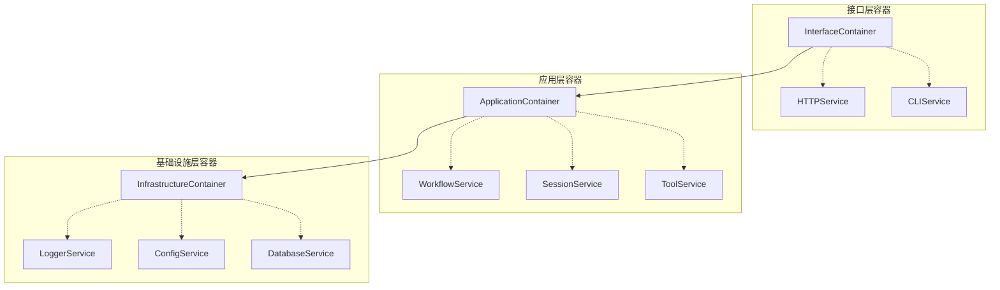

# TypeScript依赖注入容器架构设计文档

## 概述

本文档详细分析了当前TypeScript版本的依赖注入容器实现，并提出了基于分层架构的改进方案。该方案参考了Python版本的成熟实现，结合TypeScript语言特性，设计了一套适合Modular Agent Framework的容器架构。

## 当前容器实现分析

### 现有实现特点

当前的`src/infrastructure/common/container.ts`实现了一个简单的依赖注入容器，具有以下特点：

1. **基础功能完备**：
   - 支持类注册(`register`)
   - 支持实例注册(`registerInstance`)
   - 支持工厂注册(`registerFactory`)
   - 提供基本的资源清理功能(`dispose`)

2. **主要局限性**：
   - **生命周期管理不足**：只支持单例模式，缺乏瞬态和作用域生命周期
   - **依赖解析能力弱**：无法自动解析构造函数依赖，所有依赖必须通过工厂函数手动解析
   - **缺乏分层架构**：没有按架构层次组织服务绑定的机制
   - **配置支持有限**：服务绑定是硬编码的，无法通过配置文件动态注册
   - **缺乏高级特性**：没有循环依赖检测、条件绑定、装饰器支持等

### 与Python版本对比

Python版本的容器架构展示了更成熟的设计：

1. **分层服务绑定**：通过`ContainerBootstrap`分别注册基础设施服务和业务服务
2. **模块化绑定**：每个服务模块有独立的绑定类(如`LoggerServiceBindings`)
3. **生命周期支持**：明确支持单例、瞬态和作用域生命周期
4. **配置驱动**：服务绑定可以基于配置动态调整

## 容器架构改进方案

### 设计原则

1. **分层隔离**：按照Domain + Application + Infrastructure + Interface的架构分层组织容器
2. **生命周期管理**：支持单例、瞬态和作用域三种生命周期
3. **模块化绑定**：每个服务模块有独立的绑定类
4. **配置驱动**：支持通过配置文件动态调整服务绑定
5. **依赖自动解析**：减少手动配置工作

### 分层容器架构



### 核心接口设计

```typescript
// 服务生命周期枚举
export enum ServiceLifetime {
  SINGLETON = 'singleton',
  TRANSIENT = 'transient',
  SCOPED = 'scoped'
}

// 服务注册选项
export interface ServiceRegistrationOptions {
  lifetime: ServiceLifetime;
  dependencies?: string[];
  factory?: () => any;
  instance?: any;
}

// 增强的容器接口
export interface IContainer {
  // 基础注册方法
  register<T>(key: string, implementation: new (...args: any[]) => T, options?: ServiceRegistrationOptions): void;
  registerInstance<T>(key: string, instance: T): void;
  registerFactory<T>(key: string, factory: () => T, options?: ServiceRegistrationOptions): void;
  
  // 解析方法
  get<T>(key: string): T;
  tryGet<T>(key: string): T | null;
  has(key: string): boolean;
  
  // 生命周期管理
  createScope(): IContainer;
  dispose(): void;
  
  // 配置和元数据
  configure(config: ContainerConfiguration): void;
  getRegistrations(): Map<string, ServiceRegistration>;
}
```

## 服务绑定策略

### 生命周期管理策略

#### 单例模式 (SINGLETON)
- **适用场景**：配置管理器、日志服务、数据库连接池
- **实现方式**：在容器级别缓存实例，首次创建后一直保持
- **优点**：节省资源，保持状态一致性
- **缺点**：需要注意线程安全和状态管理

#### 瞬态模式 (TRANSIENT)
- **适用场景**：工作流执行器、消息处理器、临时计算对象
- **实现方式**：每次请求都创建新实例，不缓存
- **优点**：避免状态污染，每次都是干净的状态
- **缺点**：创建开销较大，资源消耗多

#### 作用域模式 (SCOPED)
- **适用场景**：HTTP请求上下文、会话上下文、事务上下文
- **实现方式**：在特定作用域内缓存实例，作用域结束时清理
- **优点**：平衡了资源使用和状态管理
- **缺点**：需要作用域管理机制

### 分层服务绑定

#### 基础设施层服务
```typescript
export class InfrastructureServiceBindings extends ServiceBindings {
  registerServices(container: IContainer, config: any): void {
    // 日志服务 - 单例
    container.registerFactory<ILogger>(
      'ILogger',
      () => new Logger(config.logger),
      { lifetime: ServiceLifetime.SINGLETON }
    );
    
    // 配置管理器 - 单例
    container.registerFactory<IConfigManager>(
      'IConfigManager',
      () => new ConfigManager(config.config),
      { lifetime: ServiceLifetime.SINGLETON }
    );
    
    // 数据库连接 - 单例
    container.registerFactory<IDatabase>(
      'IDatabase',
      () => new Database(config.database),
      { lifetime: ServiceLifetime.SINGLETON }
    );
  }
}
```

#### 应用层服务
```typescript
export class ApplicationServiceBindings extends ServiceBindings {
  registerServices(container: IContainer, config: any): void {
    // 工作流服务 - 单例
    container.registerFactory<IWorkflowService>(
      'IWorkflowService',
      () => new WorkflowService(
        container.get<ILogger>('ILogger'),
        container.get<IConfigManager>('IConfigManager')
      ),
      { lifetime: ServiceLifetime.SINGLETON }
    );
    
    // 工作流执行器 - 瞬态
    container.registerFactory<IWorkflowExecutor>(
      'IWorkflowExecutor',
      () => new WorkflowExecutor(
        container.get<ILogger>('ILogger'),
        container.get<IWorkflowService>('IWorkflowService')
      ),
      { lifetime: ServiceLifetime.TRANSIENT }
    );
  }
}
```

## 配置驱动的服务绑定

### 配置文件结构

```toml
[container.services.logger]
type = "factory"
lifetime = "singleton"
factory = "createLogger"

[container.services.config]
type = "factory"
lifetime = "singleton"
factory = "createConfigManager"

[container.services.workflow]
type = "factory"
lifetime = "singleton"
factory = "createWorkflowService"
dependencies = ["logger", "config"]

[container.services.executor]
type = "factory"
lifetime = "transient"
factory = "createWorkflowExecutor"
dependencies = ["logger", "workflow"]
```

### 配置驱动的绑定加载器

```typescript
export class ConfigurationDrivenBindings extends ServiceBindings {
  registerServices(container: IContainer, config: any): void {
    const servicesConfig = config.container?.services || {};
    
    for (const [serviceName, serviceConfig] of Object.entries(servicesConfig)) {
      this.registerServiceFromConfig(container, serviceName, serviceConfig, config);
    }
  }
  
  private registerServiceFromConfig(
    container: IContainer,
    serviceName: string,
    serviceConfig: any,
    globalConfig: any
  ): void {
    const { type, lifetime, factory, dependencies } = serviceConfig;
    
    if (type === 'factory' && factory) {
      container.registerFactory(
        serviceName,
        () => this.createServiceFromFactory(factory, dependencies, globalConfig),
        { lifetime: ServiceLifetime[lifetime.toUpperCase()] }
      );
    }
  }
}
```

## 容器引导和初始化

### 容器引导器

```typescript
export class ContainerBootstrap {
  static createContainers(config: any): {
    infrastructure: InfrastructureContainer;
    application: ApplicationContainer;
    interface: InterfaceContainer;
  } {
    // 创建基础设施容器
    const infrastructureContainer = new InfrastructureContainer(config);
    
    // 创建应用容器
    const applicationContainer = new ApplicationContainer(
      infrastructureContainer,
      config
    );
    
    // 创建接口容器
    const interfaceContainer = new InterfaceContainer(
      applicationContainer,
      config
    );
    
    return {
      infrastructure: infrastructureContainer,
      application: applicationContainer,
      interface: interfaceContainer
    };
  }
}
```

### 应用程序启动流程

```typescript
async function bootstrap(): Promise<void> {
  try {
    // 加载配置
    const config = await loadConfiguration();
    
    // 创建分层容器
    const containers = ContainerBootstrap.createContainers(config);
    
    // 获取应用实例
    const app = containers.interface.get<Application>('Application');
    
    // 启动应用
    await app.start();
    
    console.log('Modular Agent Framework 启动成功');
  } catch (error) {
    console.error('应用程序启动失败:', error);
    process.exit(1);
  }
}
```

## 高级特性

### 作用域管理

```typescript
export class ScopedContainer extends BaseContainer {
  private scopeId: string;
  
  constructor(parent: IContainer) {
    super(parent);
    this.scopeId = this.generateScopeId();
  }
  
  dispose(): void {
    // 清理作用域内的所有实例
    for (const [key, instance] of this.scopedInstances) {
      if (instance && typeof instance.dispose === 'function') {
        instance.dispose();
      }
    }
    this.scopedInstances.clear();
    super.dispose();
  }
}
```

### 自动依赖解析

```typescript
private resolveDependencies(implementation: any): any[] {
  // 通过反射获取构造函数参数类型
  const paramTypes = Reflect.getMetadata('design:paramtypes', implementation) || [];
  return paramTypes.map((paramType: any) => {
    const serviceName = this.getServiceName(paramType);
    return this.get(serviceName);
  });
}
```

### 装饰器支持

```typescript
export function Injectable(serviceName?: string) {
  return function <T extends { new(...args: any[]): {} }>(constructor: T) {
    Reflect.defineMetadata('injectable', true, constructor);
    if (serviceName) {
      Reflect.defineMetadata('serviceName', serviceName, constructor);
    }
    return constructor;
  };
}

export function Inject(serviceName: string) {
  return function (target: any, propertyKey: string | symbol | undefined, parameterIndex: number) {
    const existingTokens = Reflect.getMetadata('inject-tokens', target) || [];
    existingTokens[parameterIndex] = serviceName;
    Reflect.defineMetadata('inject-tokens', existingTokens, target);
  };
}
```

## 实施建议

### 迁移策略

1. **渐进式迁移**：
   - 保持现有容器接口兼容
   - 逐步添加新功能
   - 分阶段替换现有实现

2. **向后兼容**：
   - 保留现有的注册方法
   - 添加新的生命周期选项
   - 提供迁移指南

3. **测试覆盖**：
   - 为新容器实现编写单元测试
   - 验证分层容器之间的依赖关系
   - 测试不同生命周期的行为

### 性能考虑

1. **实例缓存**：合理使用单例模式减少对象创建开销
2. **延迟初始化**：只在需要时创建服务实例
3. **作用域清理**：及时清理作用域内的实例避免内存泄漏

### 最佳实践

1. **服务设计**：
   - 保持服务接口简洁
   - 避免循环依赖
   - 合理选择生命周期

2. **配置管理**：
   - 使用环境变量覆盖配置
   - 提供默认配置
   - 支持配置验证

3. **错误处理**：
   - 提供清晰的错误信息
   - 支持服务健康检查
   - 实现优雅降级

## 总结

本设计文档提出了一个基于分层架构的TypeScript依赖注入容器方案，该方案具有以下优势：

1. **架构清晰**：按照项目分层组织容器，符合DDD原则
2. **功能完备**：支持多种生命周期、自动依赖解析、配置驱动等高级特性
3. **易于维护**：模块化的服务绑定，便于扩展和测试
4. **性能优化**：合理的缓存策略和作用域管理

通过实施这个方案，项目的依赖注入容器将能够更好地支持Modular Agent Framework的架构需求，为后续的功能扩展提供坚实的基础。