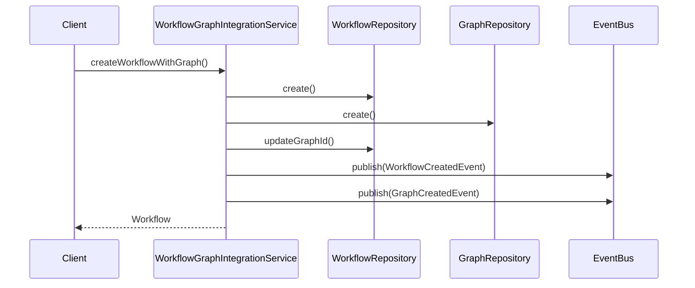
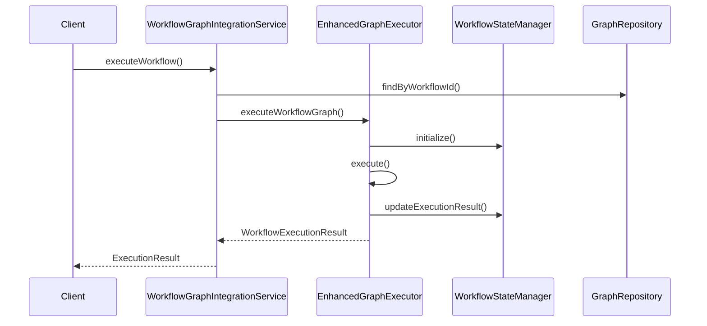

# Workflow 与 Graph 集成层分析

## 概述

本文档分析 Workflow 与 Graph 集成应该在哪个层实现，并提供详细的集成设计方案。基于对当前架构的深入分析，我们将确定最适合的集成层次和实现策略。

## 当前架构层次分析

### 1. 领域层 (Domain Layer)

**职责**：
- 定义核心业务规则和实体
- 包含纯业务逻辑，不依赖技术实现
- Workflow 和 Graph 作为聚合根存在

**当前状态**：
- `src/domain/workflow/entities/workflow.ts` - Workflow 聚合根
- `src/domain/workflow/graph/entities/graph.ts` - Graph 聚合根
- Graph 已作为 Workflow 的子模块存在

**集成可行性**：
- ✅ 可以在领域层定义集成接口
- ✅ 可以定义联合业务规则
- ❌ 不应包含具体实现逻辑

### 2. 应用层 (Application Layer)

**职责**：
- 提供应用服务和业务流程编排
- 协调领域组件之间的交互
- 处理用例和业务流程

**当前状态**：
- 应用层结构较为简单，只有 `src/application/common/application.ts`
- 缺少具体的应用服务实现

**集成可行性**：
- ✅ 最适合实现业务流程编排
- ✅ 可以协调 Workflow 和 Graph 的交互
- ✅ 可以处理跨聚合根的业务用例

### 3. 基础设施层 (Infrastructure Layer)

**职责**：
- 提供技术实现和外部依赖
- 实现领域层定义的接口
- 处理数据持久化和外部服务调用

**当前状态**：
- `src/infrastructure/workflow/` 包含完整的执行引擎
- GraphExecutor 已经实现了 Graph 的执行逻辑
- 包含节点执行器、边评估器等组件

**集成可行性**：
- ✅ 可以实现技术层面的集成
- ✅ 可以处理执行时的协调
- ❌ 不应包含业务逻辑

## 集成层次决策

### 推荐方案：应用层 + 基础设施层分层集成

基于 DDD 架构原则和当前代码结构，推荐采用分层集成策略：

#### 1. 应用层集成（主要集成点）

**理由**：
- Workflow 和 Graph 的交互本质上是业务流程
- 需要协调两个聚合根的业务操作
- 符合应用层的职责定位

**实现内容**：
- 定义 WorkflowGraphIntegrationService
- 实现跨聚合根的业务用例
- 处理事务和一致性

#### 2. 基础设施层集成（技术支持）

**理由**：
- 当前的 GraphExecutor 已经在基础设施层
- 执行引擎需要直接操作 Graph 和 Workflow
- 技术实现细节应放在基础设施层

**实现内容**：
- 优化现有的 GraphExecutor
- 实现 Workflow 与 Graph 的执行协调
- 处理状态管理和持久化

## 详细集成设计方案

### 1. 应用层集成设计

#### 1.1 WorkflowGraphIntegrationService

```typescript
// src/application/workflow/workflow-graph-integration.service.ts
export class WorkflowGraphIntegrationService {
  constructor(
    private workflowRepository: IWorkflowRepository,
    private graphRepository: IGraphRepository,
    private eventBus: IEventBus
  ) {}

  // 创建带图的工作流
  async createWorkflowWithGraph(
    workflowData: CreateWorkflowData,
    graphData: CreateGraphData
  ): Promise<Workflow> {
    // 事务性创建 Workflow 和 Graph
  }

  // 执行工作流（包含图执行）
  async executeWorkflow(workflowId: ID, input: any): Promise<ExecutionResult> {
    // 协调 Workflow 和 Graph 的执行
  }

  // 更新工作流图
  async updateWorkflowGraph(
    workflowId: ID,
    graphUpdates: GraphUpdateData
  ): Promise<void> {
    // 协调 Workflow 和 Graph 的更新
  }

  // 验证工作流图一致性
  async validateWorkflowGraph(workflowId: ID): Promise<ValidationResult> {
    // 验证 Workflow 和 Graph 的一致性
  }
}
```

#### 1.2 应用服务接口

```typescript
// src/domain/workflow/services/workflow-graph-integration.interface.ts
export interface IWorkflowGraphIntegrationService {
  createWorkflowWithGraph(
    workflowData: CreateWorkflowData,
    graphData: CreateGraphData
  ): Promise<Workflow>;
  
  executeWorkflow(workflowId: ID, input: any): Promise<ExecutionResult>;
  
  updateWorkflowGraph(
    workflowId: ID,
    graphUpdates: GraphUpdateData
  ): Promise<void>;
  
  validateWorkflowGraph(workflowId: ID): Promise<ValidationResult>;
}
```

### 2. 基础设施层集成设计

#### 2.1 增强的 GraphExecutor

```typescript
// src/infrastructure/workflow/engine/enhanced-graph-executor.ts
export class EnhancedGraphExecutor extends GraphExecutor {
  constructor(
    nodeExecutorFactory: NodeExecutorFactory,
    conditionEvaluator: ConditionEvaluator,
    stateManager: StateManager,
    private workflowStateManager: WorkflowStateManager
  ) {
    super(nodeExecutorFactory, conditionEvaluator, stateManager);
  }

  // 执行工作流图
  async executeWorkflowGraph(
    workflow: Workflow,
    graph: Graph,
    input: any
  ): Promise<WorkflowExecutionResult> {
    // 1. 初始化工作流执行上下文
    const workflowContext = await this.workflowStateManager.initialize(workflow);
    
    // 2. 执行图
    const graphResult = await this.execute(graph, input);
    
    // 3. 更新工作流状态
    await this.workflowStateManager.updateExecutionResult(
      workflow,
      graphResult
    );
    
    return {
      workflowId: workflow.workflowId,
      graphResult,
      executionTime: workflowContext.executionTime,
      status: workflowContext.status
    };
  }

  // 验证工作流图
  async validateWorkflowGraph(
    workflow: Workflow,
    graph: Graph
  ): Promise<ValidationResult> {
    // 1. 验证图结构
    const graphValidation = await this.validateGraph(graph);
    
    // 2. 验证工作流与图的一致性
    const consistencyValidation = await this.validateConsistency(workflow, graph);
    
    return {
      valid: graphValidation.valid && consistencyValidation.valid,
      errors: [...graphValidation.errors, ...consistencyValidation.errors]
    };
  }
}
```

#### 2.2 WorkflowStateManager

```typescript
// src/infrastructure/workflow/engine/workflow-state-manager.ts
export class WorkflowStateManager {
  async initialize(workflow: Workflow): Promise<WorkflowExecutionContext> {
    // 初始化工作流执行上下文
  }

  async updateExecutionResult(
    workflow: Workflow,
    graphResult: any
  ): Promise<void> {
    // 更新工作流执行结果
  }

  async saveExecutionState(
    workflow: Workflow,
    state: any
  ): Promise<void> {
    // 保存执行状态
  }
}
```

### 3. 领域层集成设计

#### 3.1 联合领域服务

```typescript
// src/domain/workflow/services/workflow-graph-validation.service.ts
export class WorkflowGraphValidationService {
  // 验证工作流与图的一致性
  validateConsistency(workflow: Workflow, graph: Graph): ValidationResult {
    // 验证业务规则
  }

  // 验证工作流图的可执行性
  validateExecutability(workflow: Workflow, graph: Graph): ValidationResult {
    // 验证执行可行性
  }
}
```

#### 3.2 领域事件

```typescript
// src/domain/workflow/events/workflow-graph-executed-event.ts
export class WorkflowGraphExecutedEvent extends DomainEvent {
  constructor(
    public readonly workflowId: ID,
    public readonly graphId: ID,
    public readonly executionResult: any,
    public readonly executionTime: number,
    occurredOn?: Date
  ) {
    super('WorkflowGraphExecuted', occurredOn);
  }
}
```

## 集成流程设计

### 1. 工作流创建流程



### 2. 工作流执行流程



## 事务管理策略

### 1. 领域事务边界

- Workflow 聚合根：管理工作流状态和元数据
- Graph 聚合根：管理图结构和节点边关系
- 集成服务：协调跨聚合根的事务

### 2. 事务实现方案

```typescript
// src/application/common/unit-of-work.ts
export class UnitOfWork {
  async execute<T>(operation: () => Promise<T>): Promise<T> {
    const transaction = await this.beginTransaction();
    try {
      const result = await operation();
      await transaction.commit();
      return result;
    } catch (error) {
      await transaction.rollback();
      throw error;
    }
  }
}
```

## 性能优化考虑

### 1. 缓存策略

- Graph 结构缓存：避免重复加载图结构
- 执行状态缓存：提高执行性能
- 验证结果缓存：避免重复验证

### 2. 异步处理

- 图执行异步化：提高并发性能
- 状态更新异步化：减少阻塞时间
- 事件发布异步化：提高响应速度

## 错误处理策略

### 1. 领域错误

- 业务规则违反：抛出 DomainError
- 一致性检查失败：抛出 ConsistencyError
- 执行失败：抛出 ExecutionError

### 2. 技术错误

- 网络错误：重试机制
- 数据库错误：事务回滚
- 资源不足：降级处理

## 测试策略

### 1. 单元测试

- 领域服务测试：验证业务规则
- 应用服务测试：验证用例流程
- 基础设施测试：验证技术实现

### 2. 集成测试

- 端到端测试：验证完整流程
- 性能测试：验证执行效率
- 并发测试：验证系统稳定性

## 实施计划

### 阶段一：基础集成（1-2周）
1. 创建 WorkflowGraphIntegrationService
2. 实现基本的创建和执行功能
3. 添加事务支持

### 阶段二：增强功能（2-3周）
1. 实现验证和一致性检查
2. 添加性能优化
3. 完善错误处理

### 阶段三：优化完善（1-2周）
1. 性能调优
2. 监控和日志
3. 文档完善

## 总结

通过在应用层实现主要集成逻辑，在基础设施层提供技术支持，在领域层定义业务规则，我们可以实现一个清晰、可维护、高性能的 Workflow 与 Graph 集成方案。这种分层集成策略既符合 DDD 架构原则，又能充分利用现有的代码结构，是一个平衡各方需求的最佳实践。