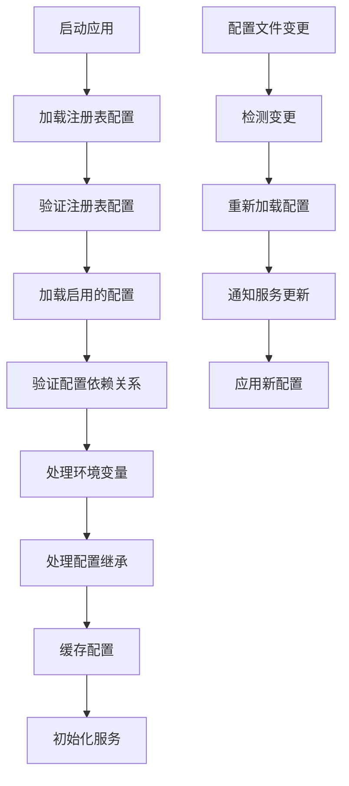

# LLM轮询池和任务组配置设计

## 概述

本文档详细设计了轮询池和任务组的配置文件结构、加载机制和验证规则。设计基于TOML格式，与现有TypeScript项目的配置系统保持一致。

## 配置目录结构

### 整体目录布局

```
configs/llms/
├── pools/                       # 轮询池配置目录
│   ├── fast-pool.toml           # 快速响应轮询池
│   ├── thinking-pool.toml       # 思考任务轮询池
│   ├── plan-pool.toml           # 规划任务轮询池
│   └── high-concurrency-pool.toml # 高并发轮询池
├── task-groups/                 # 任务组配置目录
│   ├── fast-group.toml          # 快速响应任务组
│   ├── thinking-group.toml      # 思考任务组
│   ├── plan-group.toml          # 规划任务组
│   └── execute-group.toml       # 执行任务组
├── wrappers/                    # 包装器配置目录
│   ├── pool-wrappers.toml       # 轮询池包装器配置
│   └── task-group-wrappers.toml # 任务组包装器配置
└── _registry.toml               # 配置注册表
```

## 配置注册表设计

### 注册表结构

注册表文件 `_registry.toml` 负责管理所有配置文件的注册和依赖关系：

```toml
# LLM配置注册表
# 管理所有轮询池、任务组和包装器配置

[registry]
version = "1.0.0"
description = "LLM轮询池和任务组配置注册表"

# 轮询池配置注册
[pools]
fast_pool = { file = "pools/fast-pool.toml", enabled = true }
thinking_pool = { file = "pools/thinking-pool.toml", enabled = true }
plan_pool = { file = "pools/plan-pool.toml", enabled = true }
high_concurrency_pool = { file = "pools/high-concurrency-pool.toml", enabled = false }

# 任务组配置注册
[task_groups]
fast_group = { file = "task-groups/fast-group.toml", enabled = true }
thinking_group = { file = "task-groups/thinking-group.toml", enabled = true }
plan_group = { file = "task-groups/plan-group.toml", enabled = true }
execute_group = { file = "task-groups/execute-group.toml", enabled = true }

# 包装器配置注册
[wrappers]
pool_wrappers = { file = "wrappers/pool-wrappers.toml", enabled = true }
task_group_wrappers = { file = "wrappers/task-group-wrappers.toml", enabled = true }

# 全局配置
[global]
config_validation = "strict"      # strict | lenient
enable_hot_reload = true
reload_interval = 300             # 秒
cache_enabled = true
use_defaults_on_failure = true

# 依赖关系配置
[dependencies]
# 轮询池依赖的任务组
fast_pool = ["fast_group"]
thinking_pool = ["thinking_group"]
plan_pool = ["plan_group"]

# 包装器依赖的轮询池和任务组
pool_wrappers = ["fast_pool", "thinking_pool", "plan_pool"]
task_group_wrappers = ["fast_group", "thinking_group", "plan_group", "execute_group"]
```

## 轮询池配置设计

### 快速响应轮询池配置示例

`configs/llms/pools/fast-pool.toml`：

```toml
# 快速响应轮询池配置
# 适用于需要快速响应的简单任务

[pool]
name = "fast_pool"
description = "快速响应任务专用轮询池"

# 包含的任务组
# 轮询池可以包含多个任务组，按优先级排序
task_groups = ["fast_group"]

# 轮询策略配置
[pool.rotation_strategy]
type = "round_robin"  # round_robin | random | weighted | least_connections

# 轮询策略选项
[pool.rotation_strategy.options]
# 加权轮询的权重配置（当type为weighted时使用）
weights = {}

# 健康检查配置
[pool.health_check]
interval = 30                    # 健康检查间隔（秒）
failure_threshold = 3           # 故障阈值
recovery_time = 60               # 恢复时间（秒）

# 轮询池专用降级策略
[pool.fallback]
strategy = "instance_rotation"   # instance_rotation | pool_fallback
max_instance_attempts = 2       # 每个实例最多尝试次数
fallback_pools = []              # 降级轮询池列表

# 速率限制配置
[pool.rate_limiting]
enabled = true
algorithm = "token_bucket"      # token_bucket | fixed_window

# 令牌桶算法配置
[pool.rate_limiting.token_bucket]
bucket_size = 1000              # 令牌桶大小
refill_rate = 16.67              # 每秒补充令牌数（1000/60 ≈ 16.67）

# 固定窗口算法配置
[pool.rate_limiting.fixed_window]
window_size = 60                 # 窗口大小（秒）
max_requests = 1000              # 最大请求数

# 统计和监控配置
[pool.metrics]
enabled = true
interval = 60                    # 统计信息收集间隔（秒）
retention_period = 86400         # 数据保留时间（秒）

# 元数据
[pool.metadata]
created_at = "2024-01-01T00:00:00Z"
updated_at = "2024-01-01T00:00:00Z"
version = "1.0.0"
```

### 思考任务轮询池配置示例

`configs/llms/pools/thinking-pool.toml`：

```toml
# 思考任务轮询池配置
# 适用于需要深度思考的分析任务

[pool]
name = "thinking_pool"
description = "思考任务专用轮询池"

# 包含的任务组
task_groups = ["thinking_group"]

# 轮询策略配置
[pool.rotation_strategy]
type = "weighted"

# 加权轮询配置
[pool.rotation_strategy.options]
weights = {
    "thinking_group.echelon1" = 10,
    "thinking_group.echelon2" = 5,
    "thinking_group.echelon3" = 1
}

# 健康检查配置
[pool.health_check]
interval = 60                    # 较长的检查间隔
failure_threshold = 2            # 较低的故障阈值
recovery_time = 120              # 较长的恢复时间

# 降级策略
[pool.fallback]
strategy = "pool_fallback"
max_instance_attempts = 1
fallback_pools = ["fast_pool"]   # 降级到快速响应池

# 速率限制配置
[pool.rate_limiting]
enabled = true
algorithm = "token_bucket"

[pool.rate_limiting.token_bucket]
bucket_size = 500               # 较小的令牌桶
refill_rate = 8.33               # 较慢的补充速率

# 元数据
[pool.metadata]
category = "thinking"
priority = "high"
```

## 任务组配置设计

### 快速响应任务组配置示例

`configs/llms/task-groups/fast-group.toml`：

```toml
# 快速响应任务组配置
# 适用于需要快速响应的简单任务

[task_group]
name = "fast_group"
description = "快速响应任务组 - 适用于需要快速响应的简单任务"

# 降级策略
fallback_strategy = "echelon_down"  # echelon_down | group_fallback

# 熔断器配置
[task_group.circuit_breaker]
failure_threshold = 5            # 故障阈值
recovery_time = 60               # 恢复时间（秒）
half_open_requests = 1            # 半开状态请求数

# 降级配置
[task_group.fallback]
strategy = "echelon_down"
fallback_groups = ["fast_group.echelon2", "fast_group.echelon3"]
max_attempts = 3                 # 最大尝试次数
retry_delay = 1.0                # 重试延迟（秒）

# 层级配置
[task_group.echelons]

# 第一层级 - 最高优先级
[task_group.echelons.echelon1]
models = ["openai:gpt-4o", "anthropic:claude-3-5-sonnet"]
concurrency_limit = 10           # 并发限制
rpm_limit = 100                  # 每分钟请求限制
priority = 1                      # 优先级（数字越小优先级越高）
timeout = 30                      # 超时时间（秒）
max_retries = 3                   # 最大重试次数
temperature = 0.7                 # 温度参数
max_tokens = 2000                 # 最大token数

# 第二层级 - 中等优先级
[task_group.echelons.echelon2]
models = ["openai:gpt-4o-mini", "anthropic:claude-3-haiku"]
concurrency_limit = 20
rpm_limit = 200
priority = 2
timeout = 25
max_retries = 3
temperature = 0.7
max_tokens = 2000

# 第三层级 - 最低优先级
[task_group.echelons.echelon3]
models = ["openai:gpt-3.5-turbo"]
concurrency_limit = 50
rpm_limit = 500
priority = 3
timeout = 20
max_retries = 2
temperature = 0.7
max_tokens = 1500

# 统计配置
[task_group.metrics]
enabled = true
collection_interval = 60

# 元数据
[task_group.metadata]
category = "fast_response"
use_case = "simple_tasks"
```

### 思考任务组配置示例

`configs/llms/task-groups/thinking-group.toml`：

```toml
# 思考任务组配置
# 适用于需要深度思考的分析任务

[task_group]
name = "thinking_group"
description = "思考任务组 - 适用于需要深度思考的分析任务"

# 降级策略
fallback_strategy = "echelon_down"

# 熔断器配置
[task_group.circuit_breaker]
failure_threshold = 3            # 较低的故障阈值
recovery_time = 120               # 较长的恢复时间
half_open_requests = 1

# 降级配置
[task_group.fallback]
strategy = "echelon_down"
fallback_groups = ["thinking_group.echelon2", "thinking_group.echelon3"]
max_attempts = 2                 # 较少尝试次数
retry_delay = 2.0                # 较长重试延迟

# 层级配置
[task_group.echelons]

# 第一层级 - 最高优先级（深度思考模型）
[task_group.echelons.echelon1]
models = ["anthropic:claude-3-5-sonnet", "openai:gpt-4"]
concurrency_limit = 5             # 较低的并发限制
rpm_limit = 50                    # 较低的RPM限制
priority = 1
timeout = 60                      # 较长的超时时间
max_retries = 2                   # 较少重试次数
temperature = 0.3                 # 较低的温度
max_tokens = 4000                 # 较多的token数

# 第二层级 - 中等优先级
[task_group.echelons.echelon2]
models = ["openai:gpt-4o", "anthropic:claude-3-sonnet"]
concurrency_limit = 10
rpm_limit = 100
priority = 2
timeout = 45
max_retries = 3
temperature = 0.5
max_tokens = 3000

# 第三层级 - 最低优先级
[task_group.echelons.echelon3]
models = ["openai:gpt-3.5-turbo"]
concurrency_limit = 20
rpm_limit = 200
priority = 3
timeout = 30
max_retries = 3
temperature = 0.7
max_tokens = 2000

# 元数据
[task_group.metadata]
category = "deep_thinking"
use_case = "analysis_tasks"
```

## 包装器配置设计

### 轮询池包装器配置示例

`configs/llms/wrappers/pool-wrappers.toml`：

```toml
# 轮询池包装器配置

[wrappers]

# 快速响应轮询池包装器
fast_pool_wrapper = { 
  type = "pool", 
  pool_name = "fast_pool",
  enabled = true,
  description = "快速响应轮询池包装器"
}

# 思考任务轮询池包装器
thinking_pool_wrapper = { 
  type = "pool", 
  pool_name = "thinking_pool",
  enabled = true,
  description = "思考任务轮询池包装器"
}

# 规划任务轮询池包装器
plan_pool_wrapper = { 
  type = "pool", 
  pool_name = "plan_pool",
  enabled = true,
  description = "规划任务轮询池包装器"
}

# 全局包装器配置
[global]
default_timeout = 30              # 默认超时时间（秒）
max_retries = 3                   # 默认最大重试次数
enable_metrics = true             # 启用指标收集
metrics_interval = 60             # 指标收集间隔（秒）

# 错误处理配置
[global.error_handling]
retry_on_errors = ["timeout", "rate_limit", "network_error"]
max_retry_delay = 10.0            # 最大重试延迟（秒）
backoff_factor = 2.0              # 退避因子

# 缓存配置
[global.cache]
enabled = true
max_size = 1000                   # 最大缓存条目数
ttl = 300                         # 缓存生存时间（秒）

# 日志配置
[global.logging]
level = "info"                    # debug | info | warn | error
format = "json"                   # json | text
enable_request_logging = true
enable_response_logging = false
```

### 任务组包装器配置示例

`configs/llms/wrappers/task-group-wrappers.toml`：

```toml
# 任务组包装器配置

[wrappers]

# 快速响应任务组包装器
fast_group_wrapper = { 
  type = "task_group", 
  task_group_name = "fast_group",
  enabled = true,
  description = "快速响应任务组包装器"
}

# 思考任务组包装器
thinking_group_wrapper = { 
  type = "task_group", 
  task_group_name = "thinking_group",
  enabled = true,
  description = "思考任务组包装器"
}

# 规划任务组包装器
plan_group_wrapper = { 
  type = "task_group", 
  task_group_name = "plan_group",
  enabled = true,
  description = "规划任务组包装器"
}

# 执行任务组包装器
execute_group_wrapper = { 
  type = "task_group", 
  task_group_name = "execute_group",
  enabled = true,
  description = "执行任务组包装器"
}

# 全局配置（继承自pool-wrappers.toml）
[global]
# 可以覆盖或添加特定于任务组的配置
function_calling_enabled = true    # 启用函数调用支持
tool_selection_strategy = "auto"   # auto | manual | priority
```

## 配置加载机制设计

### 配置加载流程



### 配置验证规则

#### 轮询池配置验证
- 名称不能为空且必须唯一
- 任务组列表不能为空
- 健康检查间隔必须大于0
- 故障阈值必须大于0
- 速率限制配置必须有效

#### 任务组配置验证
- 名称不能为空且必须唯一
- 必须包含至少一个层级
- 每个层级必须包含至少一个模型
- 并发限制和RPM限制必须大于0
- 熔断器配置必须有效

#### 包装器配置验证
- 类型必须是有效的包装器类型
- 引用的轮询池或任务组必须存在
- 配置参数必须在有效范围内

### 环境变量处理

配置系统支持环境变量注入：

```toml
# 在配置中使用环境变量
[task_group.echelons.echelon1]
models = ["openai:gpt-4o"]
api_key = "${OPENAI_API_KEY}"     # 从环境变量注入
base_url = "${OPENAI_BASE_URL:https://api.openai.com}"  # 带默认值
```

### 配置继承机制

支持配置继承，避免重复配置：

```toml
# 基础配置
[base_pool]
health_check_interval = 30
failure_threshold = 3
recovery_time = 60

# 具体配置继承基础配置
[pool]
inherits_from = "base_pool"
name = "specific_pool"
# 可以覆盖基础配置中的值
health_check_interval = 60
```

## 热重载机制设计

### 文件监控
- 监控配置目录的文件变更
- 支持递归目录监控
- 过滤非配置文件变更

### 安全重载
- 先验证新配置的有效性
- 原子性配置切换
- 回滚机制防止配置错误

### 服务通知
- 通知相关服务配置变更
- 优雅处理配置更新
- 保持服务可用性

## 配置管理最佳实践

### 版本控制
- 配置文件纳入版本控制
- 使用语义化版本号
- 记录配置变更历史

### 环境管理
- 区分开发、测试、生产环境
- 环境特定的配置覆盖
- 敏感信息的安全管理

### 监控和告警
- 监控配置加载状态
- 检测配置错误
- 配置变更告警

## 总结

本配置设计提供了完整的轮询池和任务组配置方案，具有以下特点：

1. **结构化配置**：清晰的配置层次和分类
2. **类型安全**：强类型的配置验证
3. **环境适配**：支持多环境和变量注入
4. **热重载**：运行时配置更新
5. **扩展性**：支持自定义配置和插件
6. **安全性**：配置验证和错误处理

通过这套配置系统，可以实现灵活的LLM资源管理和优化配置。