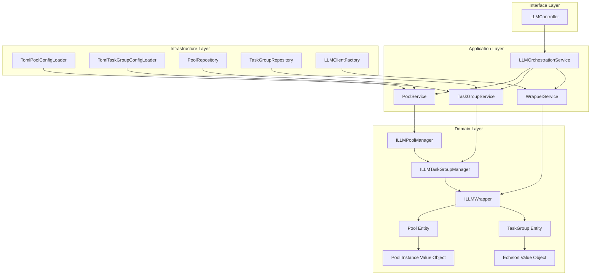

# LLM轮询池和任务组架构设计

## 概述

本文档基于Python实现的核心概念，设计了TypeScript版本的轮询池和任务组架构。设计遵循DDD原则，与现有TypeScript项目架构保持一致，同时实现Python版本的所有核心功能。

## 设计目标

### 功能目标
- 实现轮询池管理：负载均衡、故障转移、健康检查
- 实现任务组管理：层级降级、熔断机制、并发控制
- 提供统一的LLM包装器接口
- 支持配置驱动的实例化
- 实现统计信息和监控功能

### 架构目标
- 遵循DDD分层架构原则
- 与现有TypeScript项目架构集成
- 支持依赖注入和配置管理
- 提供可扩展的设计
- 确保类型安全和错误处理

## 整体架构

### 架构层次图



### 核心设计原则

1. **领域驱动设计**：轮询池和任务组作为核心领域概念
2. **接口隔离**：清晰的接口定义，依赖倒置原则
3. **单一职责**：每个类只负责一个明确的职责
4. **开闭原则**：通过接口和策略模式支持扩展
5. **配置驱动**：使用TOML配置文件，支持环境变量注入

## 目录结构设计

### 领域层 (Domain Layer)

```
src/domain/llm/
├── entities/                    # 领域实体
│   ├── pool.ts                  # 轮询池实体
│   ├── task-group.ts            # 任务组实体
│   └── wrapper.ts               # 包装器实体
├── value-objects/               # 值对象
│   ├── pool-instance.ts         # 池实例值对象
│   ├── echelon.ts              # 层级值对象
│   ├── rotation-strategy.ts    # 轮询策略值对象
│   ├── fallback-strategy.ts    # 降级策略值对象
│   └── health-status.ts         # 健康状态值对象
├── interfaces/                  # 领域接口
│   ├── pool-manager.interface.ts
│   ├── task-group-manager.interface.ts
│   ├── llm-wrapper.interface.ts
│   └── wrapper-factory.interface.ts
└── exceptions/                  # 领域异常
    ├── pool-exceptions.ts
    ├── task-group-exceptions.ts
    └── wrapper-exceptions.ts
```

### 应用层 (Application Layer)

```
src/application/llm/
├── services/                    # 应用服务
│   ├── pool-service.ts          # 轮询池服务
│   ├── task-group-service.ts   # 任务组服务
│   ├── wrapper-service.ts      # 包装器服务
│   └── llm-orchestration-service.ts # LLM编排服务
├── commands/                    # 命令
│   ├── create-pool.command.ts
│   ├── update-pool.command.ts
│   ├── create-task-group.command.ts
│   └── execute-llm.command.ts
├── queries/                     # 查询
│   ├── get-pool-status.query.ts
│   ├── get-task-group-status.query.ts
│   └── get-wrapper-statistics.query.ts
└── dtos/                        # 数据传输对象
    ├── pool-dto.ts
    ├── task-group-dto.ts
    └── wrapper-dto.ts
```

### 基础设施层 (Infrastructure Layer)

```
src/infrastructure/llm/
├── config/                      # 配置管理
│   ├── loaders/                 # 配置加载器
│   │   ├── pool-config-loader.ts
│   │   ├── task-group-config-loader.ts
│   │   └── wrapper-config-loader.ts
│   ├── validators/              # 配置验证器
│   │   ├── pool-config-validator.ts
│   │   ├── task-group-config-validator.ts
│   │   └── wrapper-config-validator.ts
│   ├── registry/                # 配置注册表
│   │   ├── config-registry.ts
│   │   └── hot-reload-manager.ts
│   └── processors/              # 配置处理器
│       ├── environment-processor.ts
│       └── inheritance-processor.ts
├── repositories/                # 仓储实现
│   ├── pool-repository.ts
│   ├── task-group-repository.ts
│   └── wrapper-repository.ts
├── managers/                    # 管理器实现
│   ├── pool-manager.ts
│   ├── task-group-manager.ts
│   └── wrapper-factory.ts
└── wrappers/                    # 包装器实现
    ├── pool-wrapper.ts
    ├── task-group-wrapper.ts
    └── direct-wrapper.ts
```

### 配置目录结构

```
configs/llms/
├── pools/                       # 轮询池配置
│   ├── fast-pool.toml
│   ├── thinking-pool.toml
│   └── plan-pool.toml
├── task-groups/                 # 任务组配置
│   ├── fast-group.toml
│   ├── thinking-group.toml
│   └── plan-group.toml
├── wrappers/                    # 包装器配置
│   ├── pool-wrappers.toml
│   └── task-group-wrappers.toml
└── _registry.toml               # 配置注册表
```

## 核心组件设计

### 领域实体设计

#### 轮询池实体 (Pool Entity)
- **职责**：管理多个LLM实例的集合
- **属性**：名称、描述、任务组列表、轮询策略、健康检查配置
- **行为**：获取实例、释放实例、健康检查、统计信息收集

#### 任务组实体 (TaskGroup Entity)
- **职责**：管理层级模型配置和降级策略
- **属性**：名称、描述、层级配置、熔断器配置、降级策略
- **行为**：选择模型、层级降级、熔断器状态管理

#### 包装器实体 (Wrapper Entity)
- **职责**：统一LLM客户端接口
- **属性**：名称、类型、配置、统计信息
- **行为**：生成响应、流式响应、健康检查、统计信息收集

### 值对象设计

#### 池实例值对象 (Pool Instance)
- **职责**：表示轮询池中的单个LLM实例
- **属性**：实例ID、状态、统计信息、客户端引用

#### 层级值对象 (Echelon)
- **职责**：表示任务组中的模型层级
- **属性**：优先级、模型列表、并发限制、速率限制

#### 轮询策略值对象 (Rotation Strategy)
- **职责**：定义实例轮询策略
- **类型**：轮询、随机、加权轮询、最少连接

### 服务设计

#### 轮询池服务 (Pool Service)
- **职责**：轮询池的业务逻辑管理
- **功能**：创建池、更新配置、健康检查、统计信息收集

#### 任务组服务 (Task Group Service)
- **职责**：任务组的业务逻辑管理
- **功能**：创建任务组、模型选择、降级执行、熔断器管理

#### 包装器服务 (Wrapper Service)
- **职责**：包装器的统一管理
- **功能**：创建包装器、路由请求、错误处理、统计信息聚合

#### LLM编排服务 (LLM Orchestration Service)
- **职责**：协调各个组件的交互
- **功能**：请求路由、负载均衡、故障转移、性能优化

## 配置系统设计

### 配置格式
使用TOML格式，与现有配置系统保持一致，支持：
- 配置继承和环境变量注入
- 类型安全的配置验证
- 热重载机制

### 配置注册表
- **职责**：管理所有配置文件的注册和加载
- **功能**：配置验证、依赖解析、热重载管理

### 配置验证
- **语法验证**：TOML语法正确性
- **语义验证**：配置逻辑正确性
- **依赖验证**：配置之间的依赖关系

## 错误处理设计

### 领域特定异常
- `PoolNotFoundException`：轮询池不存在
- `TaskGroupNotFoundException`：任务组不存在
- `WrapperExecutionException`：包装器执行失败
- `HealthCheckFailedException`：健康检查失败

### 错误处理策略
- **重试机制**：可配置的重试次数和延迟
- **降级策略**：实例降级、层级降级、任务组降级
- **熔断机制**：防止级联故障
- **详细日志**：完整的错误信息和上下文

## 性能考虑

### 客户端缓存
- **实例缓存**：LLM客户端实例的缓存和复用
- **配置缓存**：配置文件的缓存和热重载
- **统计缓存**：统计信息的缓存和聚合

### 异步操作
- **异步接口**：所有操作都支持异步执行
- **并发控制**：可配置的并发限制
- **性能监控**：详细的性能指标收集

### 健康检查
- **定期检查**：可配置的健康检查间隔
- **故障恢复**：自动故障检测和恢复
- **状态监控**：实时状态监控和告警

## 与现有架构的集成

### 复用现有组件
- **ILLMClient接口**：复用现有的LLM客户端接口
- **ModelConfig值对象**：复用模型配置值对象
- **配置系统**：集成现有的TOML配置系统
- **依赖注入**：使用现有的依赖注入容器

### 架构约束
- **领域层**：只能依赖领域层接口
- **基础设施层**：只能依赖领域层
- **应用层**：只能依赖领域层
- **接口层**：只能依赖应用层

## 扩展性设计

### 插件架构
- **策略插件**：支持自定义轮询策略
- **降级插件**：支持自定义降级策略
- **监控插件**：支持自定义监控指标

### 配置扩展
- **自定义配置**：支持用户自定义配置
- **环境适配**：支持不同环境的配置
- **动态配置**：支持运行时配置更新

## 实施计划

### 第一阶段：领域设计
1. 定义领域接口和值对象
2. 设计配置结构和验证规则
3. 创建领域异常和错误处理

### 第二阶段：基础设施实现
1. 实现配置加载器和验证器
2. 实现仓储和管理器
3. 实现包装器和工厂

### 第三阶段：应用服务
1. 实现应用服务和编排服务
2. 实现命令和查询处理器
3. 实现数据传输对象

### 第四阶段：集成测试
1. 编写单元测试和集成测试
2. 性能测试和负载测试
3. 文档编写和示例配置

## 预期收益

### 功能完整性
- 实现Python版本的所有核心功能
- 提供更强大的配置管理
- 支持更灵活的扩展机制

### 架构优势
- 更好的代码组织和维护性
- 更强的类型安全性
- 更好的错误处理和监控

### 性能提升
- 更高效的资源利用
- 更好的故障恢复能力
- 更详细的性能监控

## 风险评估

### 技术风险
- **复杂性增加**：新架构可能增加系统复杂性
- **集成风险**：与现有系统的集成可能存在兼容性问题

### 缓解措施
- **渐进式实施**：分阶段实施，降低风险
- **充分测试**：全面的测试覆盖
- **文档完善**：详细的文档和示例

## 结论

本设计基于DDD原则，为TypeScript项目提供了完整的轮询池和任务组架构。设计充分考虑了与现有架构的集成，同时实现了Python版本的所有核心功能。通过清晰的层次结构和接口设计，确保了系统的可维护性和扩展性。