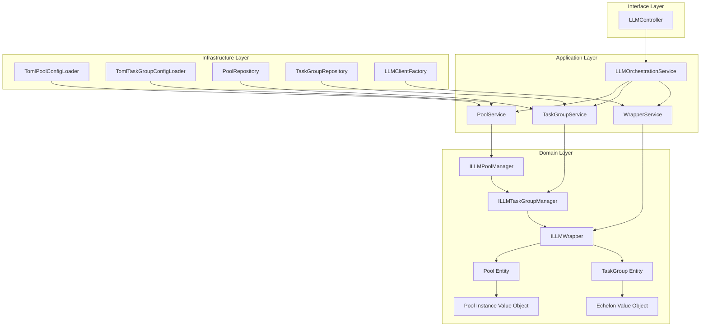

# 轮询池和任务组设计方案

## 概述

本文档描述了基于TypeScript和DDD架构的轮询池(Polling Pool)和任务组(Task Group)设计方案。该设计参考了Python实现的核心概念，但根据TypeScript项目的架构特点进行了适配和优化。

## 1. 核心概念分析

### 1.1 轮询池 (Polling Pool)

轮询池是管理多个LLM实例的集合，提供以下核心功能：
- **负载均衡**: 通过轮询策略分配请求到不同实例
- **故障转移**: 当实例不可用时自动切换到健康实例
- **健康检查**: 定期检查实例健康状态
- **性能监控**: 收集和统计实例性能数据

### 1.2 任务组 (Task Group)

任务组是根据任务类型组织模型的集合，提供以下核心功能：
- **层级管理**: 多层级模型配置，支持优先级降级
- **并发控制**: 限制并发请求数量
- **速率限制**: 控制请求速率
- **熔断机制**: 防止级联故障

### 1.3 包装器 (Wrapper)

包装器提供统一的LLM客户端接口，隐藏底层复杂性：
- **统一接口**: 为不同类型的LLM客户端提供一致的API
- **透明降级**: 自动处理故障和降级逻辑
- **统计收集**: 收集使用统计和性能数据

## 2. 架构设计

### 2.1 整体架构



### 2.2 设计原则

#### DDD原则应用
- **领域驱动**: 轮询池和任务组作为核心领域概念
- **接口隔离**: 清晰的接口定义，依赖倒置
- **单一职责**: 每个类只负责一个明确的职责
- **开闭原则**: 通过接口和策略模式支持扩展

#### 与现有架构的集成
- **复用现有组件**: 利用现有的ILLMClient和ModelConfig
- **配置系统兼容**: 适配现有的TOML配置系统
- **依赖注入集成**: 与现有的容器系统集成

## 3. 接口设计

### 3.1 轮询池管理器接口

```typescript
// src/domain/llm/interfaces/pool-manager.interface.ts
export interface ILLMPoolManager {
  getPool(poolName: string): Promise<Pool | null>;
  createPool(poolConfig: PoolConfig): Promise<Pool>;
  getPoolInstance(poolName: string): Promise<PoolInstance | null>;
  releasePoolInstance(poolName: string, instance: PoolInstance): Promise<void>;
  healthCheck(poolName: string): Promise<PoolHealthStatus>;
}
```

### 3.2 任务组管理器接口

```typescript
// src/domain/llm/interfaces/task-group-manager.interface.ts
export interface ILLMTaskGroupManager {
  getTaskGroup(groupName: string): Promise<TaskGroup | null>;
  createTaskGroup(groupConfig: TaskGroupConfig): Promise<TaskGroup>;
  getModelsForGroup(groupName: string, echelon?: string): Promise<string[]>;
  parseGroupReference(reference: string): [string, string] | null;
  getEchelonConfig(groupName: string, echelon: string): Promise<EchelonConfig | null>;
  getFallbackGroups(groupName: string): Promise<string[]>;
}
```

### 3.3 LLM包装器接口

```typescript
// src/domain/llm/interfaces/llm-wrapper.interface.ts
export interface ILLMWrapper {
  readonly name: string;
  readonly type: 'pool' | 'task_group' | 'direct';
  
  generateResponse(request: LLMRequest): Promise<LLMResponse>;
  generateResponseStream(request: LLMRequest): Promise<AsyncIterable<LLMResponse>>;
  getModelInfo(): Promise<ModelInfo>;
  getStatistics(): Promise<WrapperStatistics>;
  resetStatistics(): Promise<void>;
  healthCheck(): Promise<HealthStatus>;
  supportsFunctionCalling(): boolean;
}
```

## 4. 配置系统设计

### 4.1 配置文件结构

```
configs/
├── llms/
│   ├── pools/                    # 轮询池配置
│   │   ├── fast-pool.toml
│   │   ├── thinking-pool.toml
│   │   └── plan-pool.toml
│   ├── task-groups/              # 任务组配置
│   │   ├── fast-group.toml
│   │   ├── thinking-group.toml
│   │   └── plan-group.toml
│   ├── wrappers/                 # 包装器配置
│   │   ├── pool-wrappers.toml
│   │   └── task-group-wrappers.toml
│   └── _registry.toml           # 配置注册表
```

### 4.2 配置注册表

```toml
# configs/llms/_registry.toml
[registry]
version = "1.0.0"
description = "LLM轮询池和任务组配置注册表"

[pools]
fast_pool = { file = "pools/fast-pool.toml", enabled = true }
thinking_pool = { file = "pools/thinking-pool.toml", enabled = true }
plan_pool = { file = "pools/plan-pool.toml", enabled = true }

[task_groups]
fast_group = { file = "task-groups/fast-group.toml", enabled = true }
thinking_group = { file = "task-groups/thinking-group.toml", enabled = true }
plan_group = { file = "task-groups/plan-group.toml", enabled = true }

[wrappers]
pool_wrappers = { file = "wrappers/pool-wrappers.toml", enabled = true }
task_group_wrappers = { file = "wrappers/task-group-wrappers.toml", enabled = true }
```

### 4.3 轮询池配置示例

```toml
# configs/llms/pools/fast-pool.toml
[pool]
name = "fast_pool"
description = "快速响应任务专用轮询池"
task_groups = ["fast_group"]

[pool.rotation_strategy]
type = "round_robin"
options = {}

[pool.health_check]
interval = 30
failure_threshold = 3
recovery_time = 60

[pool.fallback]
strategy = "instance_rotation"
max_instance_attempts = 2

[pool.rate_limiting]
enabled = true
algorithm = "token_bucket"

[pool.rate_limiting.token_bucket]
bucket_size = 1000
refill_rate = 16.67
```

### 4.4 任务组配置示例

```toml
# configs/llms/task-groups/fast-group.toml
[task_group]
name = "fast_group"
description = "快速响应任务组"
fallback_strategy = "echelon_down"

[task_group.circuit_breaker]
failure_threshold = 5
recovery_time = 60
half_open_requests = 1

[task_group.echelons]

[task_group.echelons.echelon1]
models = ["openai:gpt-4o", "anthropic:claude-3-5-sonnet"]
concurrency_limit = 10
rpm_limit = 100
priority = 1
timeout = 30
max_retries = 3
temperature = 0.7
max_tokens = 2000

[task_group.echelons.echelon2]
models = ["openai:gpt-4o-mini", "anthropic:claude-3-haiku"]
concurrency_limit = 20
rpm_limit = 200
priority = 2
timeout = 25
max_retries = 3
temperature = 0.7
max_tokens = 2000
```

## 5. 实现组件

### 5.1 领域层组件

#### 轮询池实体 (Pool Entity)
```typescript
// src/domain/llm/entities/pool.ts
export class Pool extends Entity<PoolId> {
  private constructor(
    id: PoolId,
    private name: string,
    private description: string,
    private taskGroups: string[],
    private rotationStrategy: RotationStrategy,
    private healthCheckInterval: number,
    private failureThreshold: number,
    private recoveryTime: number,
    private instances: PoolInstance[],
    private status: PoolStatus
  ) {
    super(id);
  }
  
  // 业务方法
  public async getInstance(): Promise<PoolInstance | null> {
    return this.rotationStrategy.selectInstance(this.instances);
  }
  
  public releaseInstance(instance: PoolInstance): void {
    instance.release();
  }
  
  public async healthCheck(): Promise<PoolHealthStatus> {
    // 健康检查逻辑
  }
}
```

#### 任务组实体 (TaskGroup Entity)
```typescript
// src/domain/llm/entities/task-group.ts
export class TaskGroup extends Entity<TaskGroupId> {
  private constructor(
    id: TaskGroupId,
    private name: string,
    private description: string,
    private echelons: Map<string, Echelon>,
    private fallbackStrategy: FallbackStrategy,
    private circuitBreaker: CircuitBreaker
  ) {
    super(id);
  }
  
  // 业务方法
  public getModelsForEchelon(echelonName: string): string[] {
    const echelon = this.echelons.get(echelonName);
    return echelon ? echelon.getModels() : [];
  }
  
  public async executeWithFallback(request: LLMRequest): Promise<LLMResponse> {
    return this.fallbackStrategy.execute(request, this.echelons);
  }
}
```

### 5.2 应用层组件

#### 轮询池服务 (PoolService)
```typescript
// src/application/llm/services/pool.service.ts
export class PoolService implements IPoolService {
  constructor(
    private poolRepository: IPoolRepository,
    private poolConfigLoader: IPoolConfigLoader,
    private logger: ILogger
  ) {}
  
  async createPool(config: PoolConfig): Promise<Pool> {
    // 验证配置
    const validation = await this.poolConfigLoader.validatePoolConfig(config);
    if (!validation.isValid) {
      throw new Error(`无效的池配置: ${validation.errors.join(', ')}`);
    }
    
    // 创建池实例
    const pool = Pool.create(config);
    
    // 保存到仓储
    return await this.poolRepository.save(pool);
  }
  
  async getPoolInstance(poolName: string): Promise<PoolInstance | null> {
    const pool = await this.poolRepository.findByName(poolName);
    if (!pool) {
      throw new Error(`轮询池不存在: ${poolName}`);
    }
    
    return await pool.getInstance();
  }
}
```

### 5.3 基础设施层组件

#### 配置加载器 (ConfigLoader)
```typescript
// src/infrastructure/llm/config/pool-config-loader.ts
export class TomlPoolConfigLoader implements IPoolConfigLoader {
  constructor(
    private tomlParser: TomlParser,
    private validator: ConfigValidator,
    private environmentProcessor: EnvironmentProcessor,
    private inheritanceProcessor: InheritanceProcessor
  ) {}
  
  async loadPoolConfig(configPath: string): Promise<PoolConfig> {
    // 解析TOML文件
    const rawConfig = await this.tomlParser.parse(configPath);
    
    // 处理环境变量
    const processedConfig = this.environmentProcessor.process(rawConfig);
    
    // 处理配置继承
    const finalConfig = await this.inheritanceProcessor.process(processedConfig, configPath);
    
    // 验证配置
    const validation = await this.validatePoolConfig(finalConfig);
    if (!validation.isValid) {
      throw new Error(`配置验证失败: ${validation.errors.join(', ')}`);
    }
    
    return finalConfig;
  }
}
```

## 6. 关键特性

### 6.1 轮询策略

#### 轮询策略接口
```typescript
// src/domain/llm/value-objects/rotation-strategy.ts
export interface RotationStrategy {
  selectInstance(instances: PoolInstance[]): Promise<PoolInstance | null>;
}

export class RoundRobinStrategy implements RotationStrategy {
  private currentIndex = 0;
  
  async selectInstance(instances: PoolInstance[]): Promise<PoolInstance | null> {
    const healthyInstances = instances.filter(i => i.isHealthy());
    if (healthyInstances.length === 0) return null;
    
    const instance = healthyInstances[this.currentIndex % healthyInstances.length];
    this.currentIndex++;
    return instance;
  }
}

export class WeightedRandomStrategy implements RotationStrategy {
  async selectInstance(instances: PoolInstance[]): Promise<PoolInstance | null> {
    const healthyInstances = instances.filter(i => i.isHealthy());
    if (healthyInstances.length === 0) return null;
    
    // 基于权重选择实例
    const weights = healthyInstances.map(i => i.getWeight());
    const totalWeight = weights.reduce((sum, weight) => sum + weight, 0);
    
    let random = Math.random() * totalWeight;
    for (let i = 0; i < healthyInstances.length; i++) {
      random -= weights[i];
      if (random <= 0) {
        return healthyInstances[i];
      }
    }
    
    return healthyInstances[0];
  }
}
```

### 6.2 降级策略

#### 降级策略接口
```typescript
// src/domain/llm/value-objects/fallback-strategy.ts
export interface FallbackStrategy {
  execute(request: LLMRequest, echelons: Map<string, Echelon>): Promise<LLMResponse>;
}

export class EchelonDownStrategy implements FallbackStrategy {
  async execute(request: LLMRequest, echelons: Map<string, Echelon>): Promise<LLMResponse> {
    const sortedEchelons = Array.from(echelons.entries())
      .sort(([, a], [, b]) => a.getPriority() - b.getPriority());
    
    for (const [echelonName, echelon] of sortedEchelons) {
      try {
        return await this.executeWithEchelon(request, echelon);
      } catch (error) {
        // 记录错误，继续尝试下一个层级
        continue;
      }
    }
    
    throw new Error('所有层级都执行失败');
  }
}
```

### 6.3 熔断器机制

```typescript
// src/domain/llm/value-objects/circuit-breaker.ts
export class CircuitBreaker {
  private state: 'CLOSED' | 'OPEN' | 'HALF_OPEN' = 'CLOSED';
  private failureCount = 0;
  private lastFailureTime?: Date;
  
  constructor(
    private failureThreshold: number,
    private recoveryTime: number,
    private halfOpenRequests: number
  ) {}
  
  async execute<T>(operation: () => Promise<T>): Promise<T> {
    if (this.state === 'OPEN') {
      if (this.shouldAttemptReset()) {
        this.state = 'HALF_OPEN';
      } else {
        throw new Error('熔断器处于开启状态');
      }
    }
    
    try {
      const result = await operation();
      this.onSuccess();
      return result;
    } catch (error) {
      this.onFailure();
      throw error;
    }
  }
  
  private onSuccess(): void {
    this.failureCount = 0;
    this.state = 'CLOSED';
  }
  
  private onFailure(): void {
    this.failureCount++;
    this.lastFailureTime = new Date();
    
    if (this.failureCount >= this.failureThreshold) {
      this.state = 'OPEN';
    }
  }
  
  private shouldAttemptReset(): boolean {
    return this.lastFailureTime !== undefined &&
           Date.now() - this.lastFailureTime.getTime() >= this.recoveryTime;
  }
}
```

## 7. 性能优化

### 7.1 客户端缓存

```typescript
// src/infrastructure/llm/client-cache.ts
export class LLMClientCache {
  private cache = new Map<string, ILLMClient>();
  private ttl = new Map<string, number>();
  
  get(key: string): ILLMClient | undefined {
    const client = this.cache.get(key);
    const expiry = this.ttl.get(key);
    
    if (!client || !expiry || Date.now() > expiry) {
      this.cache.delete(key);
      this.ttl.delete(key);
      return undefined;
    }
    
    return client;
  }
  
  set(key: string, client: ILLMClient, ttlMs: number = 300000): void {
    this.cache.set(key, client);
    this.ttl.set(key, Date.now() + ttlMs);
  }
  
  clear(): void {
    this.cache.clear();
    this.ttl.clear();
  }
}
```

### 7.2 连接池管理

```typescript
// src/infrastructure/llm/connection-pool.ts
export class ConnectionPool {
  private available: ILLMClient[] = [];
  private inUse = new Set<ILLMClient>();
  
  constructor(
    private factory: () => Promise<ILLMClient>,
    private maxSize: number = 10,
    private minSize: number = 2
  ) {}
  
  async acquire(): Promise<ILLMClient> {
    if (this.available.length > 0) {
      const client = this.available.pop()!;
      this.inUse.add(client);
      return client;
    }
    
    if (this.inUse.size < this.maxSize) {
      const client = await this.factory();
      this.inUse.add(client);
      return client;
    }
    
    throw new Error('连接池已满');
  }
  
  release(client: ILLMClient): void {
    if (this.inUse.has(client)) {
      this.inUse.delete(client);
      this.available.push(client);
    }
  }
}
```

## 8. 监控和统计

### 8.1 性能指标收集

```typescript
// src/domain/llm/services/metrics-collector.ts
export class MetricsCollector {
  private metrics = new Map<string, MetricData>();
  
  recordRequest(wrapperName: string, duration: number, success: boolean): void {
    const existing = this.metrics.get(wrapperName) || {
      totalRequests: 0,
      successfulRequests: 0,
      failedRequests: 0,
      totalDuration: 0,
      averageDuration: 0
    };
    
    existing.totalRequests++;
    existing.totalDuration += duration;
    existing.averageDuration = existing.totalDuration / existing.totalRequests;
    
    if (success) {
      existing.successfulRequests++;
    } else {
      existing.failedRequests++;
    }
    
    this.metrics.set(wrapperName, existing);
  }
  
  getMetrics(wrapperName: string): MetricData | undefined {
    return this.metrics.get(wrapperName);
  }
  
  getAllMetrics(): Map<string, MetricData> {
    return new Map(this.metrics);
  }
}
```

### 8.2 健康检查

```typescript
// src/domain/llm/services/health-checker.ts
export class HealthChecker {
  constructor(
    private interval: number,
    private logger: ILogger
  ) {}
  
  async startHealthCheck(pools: Pool[]): Promise<void> {
    setInterval(async () => {
      for (const pool of pools) {
        try {
          const status = await pool.healthCheck();
          this.logger.debug(`池 ${pool.getName()} 健康检查完成`, status);
        } catch (error) {
          this.logger.error(`池 ${pool.getName()} 健康检查失败`, error);
        }
      }
    }, this.interval * 1000);
  }
}
```

## 9. 错误处理

### 9.1 领域异常

```typescript
// src/domain/llm/exceptions/
export class PoolNotFoundException extends DomainError {
  constructor(poolName: string) {
    super(`轮询池不存在: ${poolName}`);
  }
}

export class TaskGroupNotFoundException extends DomainError {
  constructor(groupName: string) {
    super(`任务组不存在: ${groupName}`);
  }
}

export class NoHealthyInstanceException extends DomainError {
  constructor(poolName: string) {
    super(`轮询池 ${poolName} 中没有健康的实例`);
  }
}
```

### 9.2 错误恢复策略

```typescript
// src/domain/llm/services/error-recovery.ts
export class ErrorRecoveryService {
  async handlePoolError(error: Error, poolName: string): Promise<void> {
    if (error instanceof NoHealthyInstanceException) {
      // 触发紧急健康检查
      await this.triggerEmergencyHealthCheck(poolName);
    } else if (error instanceof ConnectionException) {
      // 标记实例为不健康
      await this.markInstanceUnhealthy(error.instanceId);
    }
  }
  
  private async triggerEmergencyHealthCheck(poolName: string): Promise<void> {
    // 紧急健康检查逻辑
  }
  
  private async markInstanceUnhealthy(instanceId: string): Promise<void> {
    // 标记实例不健康逻辑
  }
}
```

## 10. 实施计划

### 10.1 实施阶段

#### 第一阶段：核心接口和实体
- 定义所有接口
- 实现核心实体和值对象
- 创建基础配置结构

#### 第二阶段：管理器和服务
- 实现轮询池和任务组管理器
- 创建应用层服务
- 实现配置加载器

#### 第三阶段：包装器和工厂
- 实现轮询池和任务组包装器
- 创建包装器工厂
- 集成现有LLM客户端

#### 第四阶段：高级特性
- 实现轮询和降级策略
- 添加熔断器机制
- 实现监控和统计

#### 第五阶段：优化和测试
- 性能优化
- 全面测试
- 文档完善

### 10.2 迁移策略

1. **渐进式迁移**: 逐步替换现有LLM客户端使用
2. **兼容性保证**: 保持与现有API的兼容性
3. **配置迁移**: 提供工具迁移现有配置
4. **监控和回滚**: 实施监控和快速回滚机制

## 11. 总结

本设计方案基于DDD架构原则，提供了完整的轮询池和任务组实现方案。主要特点包括：

- **清晰的架构分层**: 遵循DDD的领域、应用、基础设施分层
- **灵活的配置系统**: 基于TOML的配置文件，支持继承和环境变量
- **强大的故障处理**: 多层次的降级和熔断机制
- **高性能设计**: 连接池、缓存和异步处理
- **完善的监控**: 详细的统计和健康检查

该设计既保持了与Python实现的核心概念一致性，又充分利用了TypeScript的类型安全和DDD架构的优势。