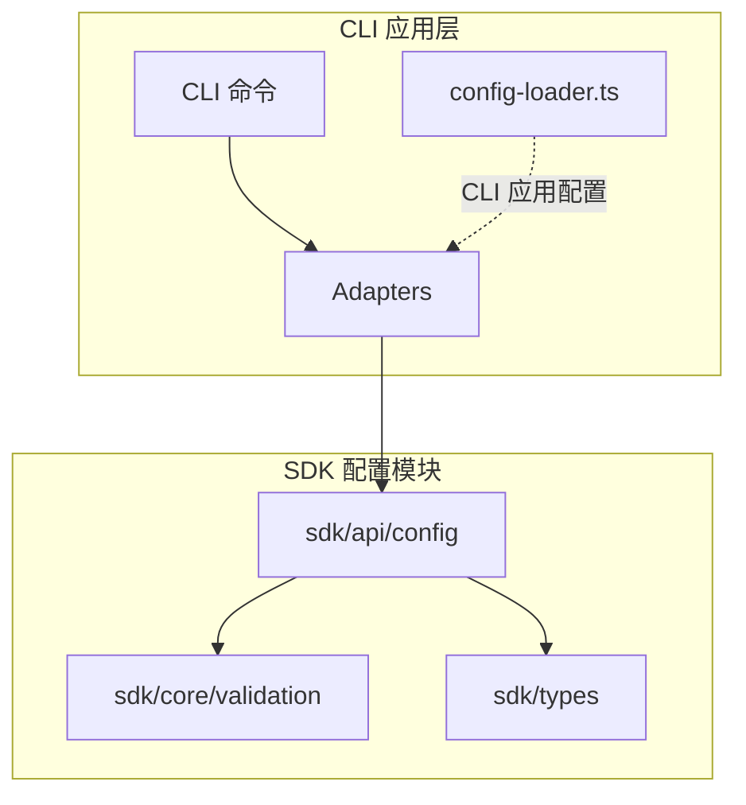
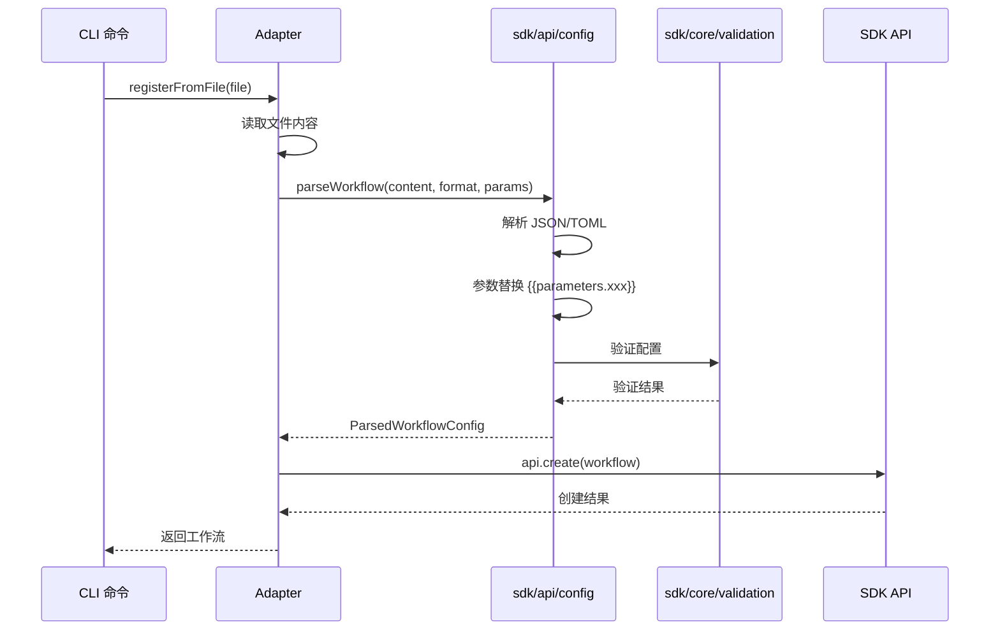

# CLI 应用配置集成方案

## 问题分析

### 1. 当前 `config-loader.ts` 的设计问题

**文件位置**: `apps/cli-app/src/config/config-loader.ts`

**问题描述**:
- 当前实现使用 `cosmiconfig` 和 `zod` 来加载 CLI 应用的运行时配置（如 apiUrl、apiKey、logLevel 等）
- 这个配置是**CLI 应用自身的配置**，用于控制 CLI 工具的行为
- 与 `sdk/api/config` 模块**职责完全不同**，不存在设计错误

**当前配置内容**:
```typescript
{
  apiUrl: string;           // API 服务地址
  apiKey: string;           // API 密钥
  defaultTimeout: number;   // 默认超时时间
  verbose: boolean;         // 详细输出
  debug: boolean;           // 调试模式
  logLevel: string;         // 日志级别
  outputFormat: string;     // 输出格式
  maxConcurrentThreads: number; // 最大并发线程数
}
```

### 2. Adapters 中配置解析的问题

**文件位置**: 
- `apps/cli-app/src/adapters/workflow-adapter.ts`
- `apps/cli-app/src/adapters/template-adapter.ts`

**问题描述**:
- Adapters 中直接使用 `parseJson` 和 `parseToml` 进行简单的文件解析
- **缺少配置验证**：没有使用 `sdk/api/config` 提供的验证功能
- **缺少参数替换**：没有支持 `{{parameters.xxx}}` 语法
- **缺少类型安全**：返回类型为 `any`，没有使用 SDK 提供的类型定义

**当前实现**:
```typescript
// workflow-adapter.ts:107-126
private parseWorkflowFile(content: string, filePath: string): any {
  const ext = filePath.split('.').pop()?.toLowerCase();
  
  try {
    switch (ext) {
      case 'json':
        return parseJson(content);  // 仅解析，无验证
      case 'toml':
        return parseToml(content);  // 仅解析，无验证
      default:
        // 简单的格式检测
    }
  } catch (error) {
    throw new Error(`解析工作流文件失败: ...`);
  }
}
```

### 3. `sdk/api/config` 模块的职责

**核心功能**:
- 解析工作流、节点模板、触发器模板、脚本等配置文件
- 提供配置验证功能（使用 `sdk/core/validation`）
- 支持参数化配置（`{{parameters.xxx}}`）
- 提供类型安全的配置定义

**关键导出**:
```typescript
// 纯函数式解析接口（推荐）
parseWorkflow(content, format, parameters?)
parseNodeTemplate(content, format)
parseTriggerTemplate(content, format)
parseScript(content, format)

// 批量解析
parseBatchWorkflows(contents, format, parameters?)
parseBatchNodeTemplates(contents, format)
parseBatchTriggerTemplates(contents, format)
parseBatchScripts(contents, format)

// 验证函数
validateWorkflowConfig(config)
validateNodeTemplateConfig(config)
validateTriggerTemplateConfig(config)
validateScriptConfig(config)
```

## 正确的集成方案

### 方案概述

**核心原则**:
1. **保持 `config-loader.ts` 不变**：它负责 CLI 应用自身的配置，与 SDK 配置模块无关
2. **重构 Adapters**：使用 `sdk/api/config` 模块提供的解析和验证功能
3. **添加参数支持**：支持运行时参数替换
4. **增强类型安全**：使用 SDK 提供的类型定义

### 架构设计



### 数据流



## 详细实施计划

### 阶段 1: 重构 WorkflowAdapter

**目标**: 使用 `sdk/api/config` 模块解析和验证工作流配置

**步骤**:

1. **更新导入语句**
   ```typescript
   import { 
     parseWorkflow,
     ConfigFormat,
     type ParsedWorkflowConfig 
   } from '@modular-agent/sdk';
   ```

2. **重构 `registerFromFile` 方法**
   ```typescript
   async registerFromFile(
     filePath: string, 
     parameters?: Record<string, any>
   ): Promise<any> {
     try {
       const { sdk } = await import('@modular-agent/sdk');
       const fullPath = resolve(process.cwd(), filePath);
       const content = await readFile(fullPath, 'utf-8');
       
       // 检测文件格式
       const format = this.detectFormat(filePath);
       
       // 使用 SDK 解析和验证
       const parsedConfig = parseWorkflow(content, format, parameters);
       
       // 获取工作流定义
       const workflow = parsedConfig.config;
       
       // 注册到 SDK
       const api = sdk.workflows;
       await api.create(workflow);
       
       logger.success(`工作流已注册: ${workflow.id}`);
       return workflow;
     } catch (error) {
       logger.error(`注册工作流失败: ${error instanceof Error ? error.message : String(error)}`);
       throw error;
     }
   }
   ```

3. **添加格式检测方法**
   ```typescript
   private detectFormat(filePath: string): ConfigFormat {
     const ext = filePath.split('.').pop()?.toLowerCase();
     return ext === 'toml' ? ConfigFormat.TOML : ConfigFormat.JSON;
   }
   ```

4. **移除旧的 `parseWorkflowFile` 方法**

### 阶段 2: 重构 TemplateAdapter

**目标**: 使用 `sdk/api/config` 模块解析和验证模板配置

**步骤**:

1. **更新导入语句**
   ```typescript
   import { 
     parseNodeTemplate,
     parseTriggerTemplate,
     ConfigFormat,
     type ParsedNodeTemplateConfig,
     type ParsedTriggerTemplateConfig 
   } from '@modular-agent/sdk';
   ```

2. **重构 `registerNodeTemplateFromFile` 方法**
   ```typescript
   async registerNodeTemplateFromFile(filePath: string): Promise<any> {
     return this.executeWithErrorHandling(async () => {
       const fullPath = resolve(process.cwd(), filePath);
       const content = await readFile(fullPath, 'utf-8');
       
       const format = this.detectFormat(filePath);
       const parsedConfig = parseNodeTemplate(content, format);
       const template = parsedConfig.config;
       
       const api = this.sdk.nodeTemplates;
       await api.create(template);
       
       this.logger.success(`节点模板已注册: ${template.id}`);
       return template;
     }, '注册节点模板');
   }
   ```

3. **重构 `registerTriggerTemplateFromFile` 方法**
   ```typescript
   async registerTriggerTemplateFromFile(filePath: string): Promise<any> {
     return this.executeWithErrorHandling(async () => {
       const fullPath = resolve(process.cwd(), filePath);
       const content = await readFile(fullPath, 'utf-8');
       
       const format = this.detectFormat(filePath);
       const parsedConfig = parseTriggerTemplate(content, format);
       const template = parsedConfig.config;
       
       const api = this.sdk.triggerTemplates;
       await api.create(template);
       
       this.logger.success(`触发器模板已注册: ${template.id}`);
       return template;
     }, '注册触发器模板');
   }
   ```

4. **添加格式检测方法**
   ```typescript
   private detectFormat(filePath: string): ConfigFormat {
     const ext = filePath.split('.').pop()?.toLowerCase();
     return ext === 'toml' ? ConfigFormat.TOML : ConfigFormat.JSON;
   }
   ```

5. **移除旧的 `parseTemplateFile` 方法**

### 阶段 3: 添加参数支持

**目标**: 支持工作流配置中的参数替换

**步骤**:

1. **更新 CLI 命令以接受参数**
   ```typescript
   // apps/cli-app/src/commands/workflow/index.ts
   workflowCmd
     .command('register <file>')
     .description('从文件注册工作流')
     .option('-v, --verbose', '详细输出')
     .option('-p, --params <params>', '运行时参数 (JSON 格式)')
     .action(async (file, options: CommandOptions) => {
       try {
         logger.info(`正在注册工作流: ${file}`);
         
         // 解析参数
         const parameters = options.params 
           ? JSON.parse(options.params) 
           : undefined;
         
         const adapter = new WorkflowAdapter();
         const workflow = await adapter.registerFromFile(file, parameters);
         
         console.log(formatWorkflow(workflow, { verbose: options.verbose }));
       } catch (error) {
         logger.error(`注册失败: ${error instanceof Error ? error.message : String(error)}`);
         process.exit(1);
       }
     });
   ```

2. **更新 WorkflowAdapter 接口**
   ```typescript
   async registerFromFile(
     filePath: string,
     parameters?: Record<string, any>
   ): Promise<any>
   ```

### 阶段 4: 增强错误处理

**目标**: 提供更友好的错误信息

**步骤**:

1. **捕获验证错误**
   ```typescript
   try {
     const parsedConfig = parseWorkflow(content, format, parameters);
     // ...
   } catch (error) {
     if (error instanceof Error && error.message.includes('validation')) {
       // 格式化验证错误
       logger.error('配置验证失败:');
       // 解析并显示具体的验证错误
     }
     throw error;
   }
   ```

2. **添加配置文件格式提示**
   ```typescript
   if (error instanceof Error) {
     if (error.message.includes('Unexpected token')) {
       logger.error('配置文件格式错误，请检查 JSON/TOML 语法');
     } else if (error.message.includes('validation')) {
       logger.error('配置验证失败，请检查配置内容');
     }
   }
   ```

### 阶段 5: 添加批量操作支持

**目标**: 支持批量注册工作流和模板

**步骤**:

1. **添加批量注册方法到 WorkflowAdapter**
   ```typescript
   async registerBatchFromFiles(
     filePaths: string[],
     parameters?: Record<string, any>
   ): Promise<any[]> {
     const results = [];
     for (const filePath of filePaths) {
       try {
         const workflow = await this.registerFromFile(filePath, parameters);
         results.push({ success: true, workflow, filePath });
       } catch (error) {
         results.push({ 
           success: false, 
           error: error instanceof Error ? error.message : String(error),
           filePath 
         });
       }
     }
     return results;
   }
   ```

2. **添加批量注册命令**
   ```typescript
   workflowCmd
     .command('register-batch <pattern>')
     .description('批量注册工作流 (支持 glob 模式)')
     .option('-p, --params <params>', '运行时参数 (JSON 格式)')
     .action(async (pattern, options: CommandOptions) => {
       // 实现批量注册逻辑
     });
   ```

### 阶段 6: 添加配置验证命令

**目标**: 提供独立的配置验证功能

**步骤**:

1. **添加验证命令**
   ```typescript
   workflowCmd
     .command('validate <file>')
     .description('验证工作流配置文件')
     .action(async (file) => {
       try {
         const adapter = new WorkflowAdapter();
         const result = await adapter.validateWorkflowFile(file);
         
         if (result.valid) {
           logger.success('配置验证通过');
         } else {
           logger.error('配置验证失败:');
           result.errors.forEach(err => {
             logger.error(`  - ${err.message} (${err.field})`);
           });
           process.exit(1);
         }
       } catch (error) {
         logger.error(`验证失败: ${error instanceof Error ? error.message : String(error)}`);
         process.exit(1);
       }
     });
   ```

2. **实现验证方法**
   ```typescript
   async validateWorkflowFile(filePath: string): Promise<{
     valid: boolean;
     errors: any[];
   }> {
     try {
       const fullPath = resolve(process.cwd(), filePath);
       const content = await readFile(fullPath, 'utf-8');
       const format = this.detectFormat(filePath);
       
       const parsedConfig = parseWorkflow(content, format);
       
       // 使用 SDK 的验证功能
       const { validateWorkflowConfig } = await import('@modular-agent/sdk');
       const validationResult = validateWorkflowConfig(parsedConfig.config);
       
       if (validationResult.isOk()) {
         return { valid: true, errors: [] };
       } else {
         return { valid: false, errors: validationResult.error };
       }
     } catch (error) {
       return { 
         valid: false, 
         errors: [{ message: error instanceof Error ? error.message : String(error) }] 
       };
     }
   }
   ```

## 实施优先级

### 高优先级（必须实施）
1. ✅ 阶段 1: 重构 WorkflowAdapter
2. ✅ 阶段 2: 重构 TemplateAdapter
3. ✅ 阶段 3: 添加参数支持

### 中优先级（建议实施）
4. ⚠️ 阶段 4: 增强错误处理
5. ⚠️ 阶段 6: 添加配置验证命令

### 低优先级（可选实施）
6. 💡 阶段 5: 添加批量操作支持

## 预期收益

### 1. 配置验证
- ✅ 自动验证配置文件的完整性和正确性
- ✅ 提供详细的错误信息，帮助快速定位问题
- ✅ 防止无效配置被注册到系统

### 2. 参数化配置
- ✅ 支持运行时参数替换
- ✅ 提高配置的灵活性和复用性
- ✅ 支持不同环境使用不同参数

### 3. 类型安全
- ✅ 使用 TypeScript 类型定义
- ✅ 编译时类型检查
- ✅ 更好的 IDE 自动补全

### 4. 代码质量
- ✅ 减少重复代码
- ✅ 统一配置处理逻辑
- ✅ 更易于维护和扩展

## 风险评估

### 低风险
- ✅ `config-loader.ts` 保持不变，不影响现有功能
- ✅ 向后兼容，现有配置文件仍然可用

### 中风险
- ⚠️ 需要更新测试用例
- ⚠️ 需要更新文档

### 缓解措施
- 逐步实施，每个阶段独立测试
- 保留旧方法作为过渡期备用
- 提供迁移指南

## 总结

**核心结论**:
1. `config-loader.ts` 的设计是正确的，它负责 CLI 应用自身的配置
2. 需要重构的是 Adapters 中的配置解析逻辑
3. 应该使用 `sdk/api/config` 模块提供的解析和验证功能
4. 添加参数支持和增强错误处理

**实施建议**:
- 按优先级逐步实施
- 每个阶段完成后进行测试
- 更新相关文档和测试用例