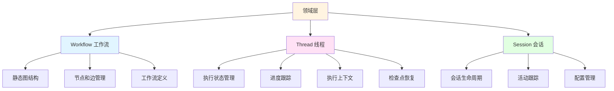
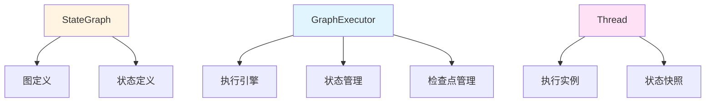
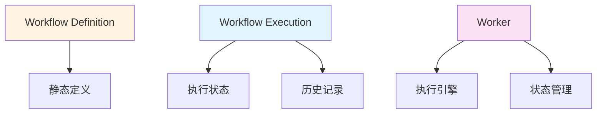
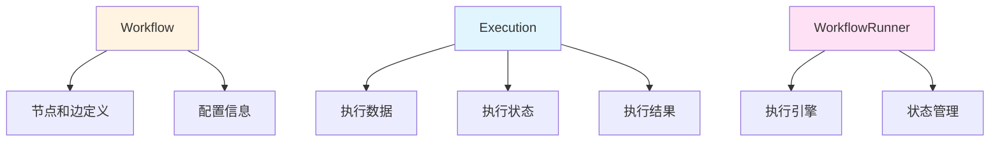
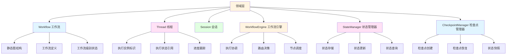
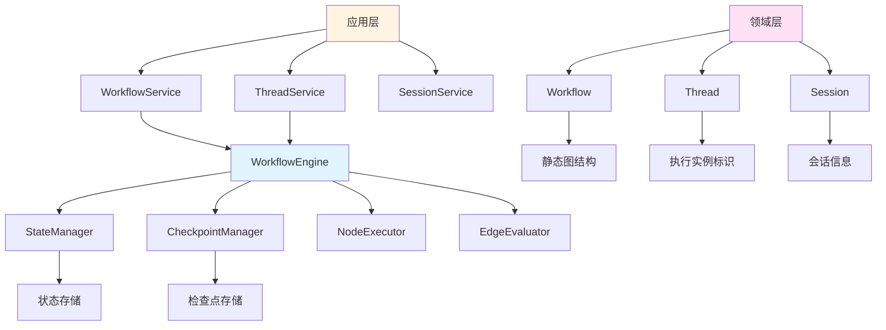

# 工作流架构层次分析与调整建议

## 概述

本文档分析当前项目的工作流架构层次划分，评估其合理性，并提出调整建议。重点分析 Workflow、Thread、Session 三个核心层次的职责划分和状态管理机制。

## 一、当前架构层次分析

### 1.1 当前层次结构



### 1.2 各层次职责分析

#### Workflow（工作流）

**位置**：`src/domain/workflow/entities/workflow.ts`

**职责**：
- 静态图结构管理（节点和边的增删改）
- 工作流定义（名称、描述、类型、配置等）
- 基本的图查询（获取节点、边、入边、出边等）
- 版本和时间戳管理

**优点**：
- 职责单一，专注于静态图结构
- 符合 DDD 原则，作为聚合根管理节点和边
- 支持多个执行实例并发执行

**不足**：
- 缺少工作流级别的执行状态管理
- 没有执行引擎协调工作流执行

#### Thread（线程）

**位置**：`src/domain/threads/entities/thread.ts`

**职责**：
- 串行执行流程协调
- 执行状态管理（pending、running、paused、completed、failed、cancelled）
- 进度跟踪（progress、currentStep）
- 执行上下文管理（ExecutionContext）
- 检查点恢复（restoreFromCheckpoint）
- 状态快照（getStateSnapshot）

**优点**：
- 作为执行实例，包含完整的执行状态
- 支持检查点和恢复功能
- 职责清晰，专注于执行协调

**不足**：
- 状态管理逻辑较为复杂
- 缺少统一的状态管理抽象
- 检查点逻辑与 Thread 耦合度高

#### Session（会话）

**位置**：`src/domain/sessions/entities/session.ts`

**职责**：
- 会话生命周期管理
- 活动跟踪（messageCount、threadCount、lastActivityAt）
- 配置管理（SessionConfig）
- 超时和过期检查

**优点**：
- 职责清晰，专注于会话管理
- 与会话相关的业务逻辑集中管理

**不足**：
- 状态管理分散在 Session 和 Thread 中
- 缺少统一的状态管理策略

## 二、与主流框架对比

### 2.1 LangGraph 架构



**特点**：
- StateGraph：包含图定义和状态定义
- GraphExecutor：独立的执行引擎，负责状态管理和检查点
- Thread：执行实例，包含状态快照

**对比分析**：
- 当前项目的 Workflow 类似于 StateGraph 的图定义部分
- 缺少独立的 GraphExecutor 执行引擎
- Thread 同时承担了执行实例和状态管理的职责

### 2.2 Temporal 架构



**特点**：
- Workflow Definition：纯粹的静态定义
- Workflow Execution：独立的执行实例，包含完整的状态和历史
- Worker：独立的执行引擎

**对比分析**：
- 当前项目的 Workflow 类似于 Workflow Definition
- Thread 类似于 Workflow Execution
- 缺少独立的 Worker 执行引擎

### 2.3 n8n 架构



**特点**：
- Workflow：节点和边定义
- Execution：独立的执行实例
- WorkflowRunner：独立的执行引擎

**对比分析**：
- 当前项目的 Workflow 类似于 n8n 的 Workflow
- Thread 类似于 Execution
- 缺少独立的 WorkflowRunner 执行引擎

## 三、架构合理性评估

### 3.1 优点

1. **职责分离清晰**
   - Workflow：静态图结构定义
   - Thread：执行实例和状态管理
   - Session：会话生命周期管理

2. **支持并发执行**
   - 多个 Thread 可以并发执行同一个 Workflow
   - 每个 Thread 有独立的执行状态

3. **符合 DDD 原则**
   - 每个层次都是独立的聚合根
   - 边界清晰，职责明确

4. **状态管理集中**
   - Thread 包含完整的执行状态
   - 支持检查点和恢复

### 3.2 不足

1. **缺少执行引擎**
   - 没有独立的 WorkflowEngine 协调执行
   - 执行逻辑分散在各个服务中

2. **状态管理复杂**
   - Thread 中的状态管理逻辑较为复杂
   - 缺少统一的状态管理抽象

3. **检查点耦合度高**
   - 检查点逻辑与 Thread 耦合
   - 不利于扩展和维护

4. **缺少工作流级别状态**
   - Workflow 只有静态定义，没有执行状态
   - 无法跟踪工作流的整体执行情况

## 四、调整建议

### 4.1 推荐架构



### 4.2 具体调整方案

#### 方案一：添加 WorkflowEngine（推荐）

**目标**：提供统一的工作流执行引擎，协调工作流执行

**实现**：
```typescript
// src/domain/workflow/services/workflow-engine.ts
export class WorkflowEngine {
  constructor(
    private nodeExecutor: INodeExecutor,
    private edgeEvaluator: IEdgeEvaluator,
    private stateManager: StateManager,
    private checkpointManager: CheckpointManager
  ) {}
  
  async execute(
    workflow: Workflow,
    thread: Thread,
    initialState: Record<string, any>
  ): Promise<void> {
    // 初始化状态
    await this.stateManager.initialize(thread.threadId, initialState);
    
    // 执行工作流
    let currentNodeId = this.findStartNode(workflow);
    
    while (currentNodeId) {
      // 创建检查点
      await this.checkpointManager.createCheckpoint(
        thread.threadId,
        currentNodeId
      );
      
      // 执行节点
      const node = workflow.getNode(currentNodeId);
      const currentState = await this.stateManager.getState(thread.threadId);
      const result = await this.nodeExecutor.execute(node, currentState);
      
      // 更新状态
      await this.stateManager.updateState(thread.threadId, result.output);
      
      // 评估边
      const edges = workflow.getOutgoingEdges(currentNodeId);
      const nextNodeId = await this.edgeEvaluator.evaluate(edges, currentState);
      
      // 更新进度
      thread.updateProgress(this.calculateProgress(workflow, nextNodeId));
      
      currentNodeId = nextNodeId;
    }
    
    // 完成执行
    thread.complete();
  }
}
```

**优点**：
- 职责清晰，专注于执行协调
- 支持统一的状态管理和检查点
- 便于扩展和维护

#### 方案二：添加 StateManager

**目标**：提供统一的状态管理抽象

**实现**：
```typescript
// src/domain/workflow/services/state-manager.ts
export class StateManager {
  private states: Map<string, WorkflowState> = new Map();
  
  async initialize(
    threadId: string,
    initialState: Record<string, any>
  ): Promise<void> {
    const state = WorkflowState.create(initialState);
    this.states.set(threadId, state);
  }
  
  async getState(threadId: string): Promise<WorkflowState> {
    return this.states.get(threadId);
  }
  
  async updateState(
    threadId: string,
    updates: Record<string, any>
  ): Promise<void> {
    const currentState = this.states.get(threadId);
    const newState = currentState.update(updates);
    this.states.set(threadId, newState);
  }
  
  async clearState(threadId: string): Promise<void> {
    this.states.delete(threadId);
  }
}
```

**优点**：
- 统一的状态管理
- 支持状态快照和恢复
- 便于实现状态持久化

#### 方案三：简化 Thread

**目标**：简化 Thread 的职责，专注于执行实例标识

**调整内容**：
```typescript
// src/domain/threads/entities/thread.ts
export class Thread extends Entity {
  // 保留基本属性
  private readonly props: ThreadProps;
  
  // 移除复杂的状态管理逻辑
  // 移除检查点恢复逻辑
  // 移除状态快照逻辑
  
  // 保留基本的生命周期方法
  start(): void
  pause(): void
  resume(): void
  complete(): void
  fail(errorMessage: string): void
  cancel(): void
  
  // 状态管理委托给 StateManager
  // 检查点管理委托给 CheckpointManager
}
```

**优点**：
- 职责更加清晰
- 减少代码复杂度
- 提高可维护性

#### 方案四：增强 Workflow

**目标**：添加工作流级别的状态管理

**实现**：
```typescript
// src/domain/workflow/entities/workflow.ts
export class Workflow extends Entity {
  private readonly props: WorkflowProps;
  
  // 添加工作流级别状态
  private executionStats: {
    totalExecutions: number;
    successfulExecutions: number;
    failedExecutions: number;
    averageExecutionTime: number;
  };
  
  // 记录执行统计
  recordExecution(success: boolean, duration: number): void {
    this.executionStats.totalExecutions++;
    if (success) {
      this.executionStats.successfulExecutions++;
    } else {
      this.executionStats.failedExecutions++;
    }
    this.executionStats.averageExecutionTime = 
      (this.executionStats.averageExecutionTime * (this.executionStats.totalExecutions - 1) + duration) / 
      this.executionStats.totalExecutions;
  }
}
```

**优点**：
- 支持工作流级别的监控和统计
- 便于实现工作流优化
- 提供更全面的视图

### 4.3 调整后的架构



## 五、实施计划

### 阶段一：添加基础设施（高优先级）

1. **创建 StateManager**
   - 实现状态管理抽象
   - 支持状态存储、更新、查询
   - 编写单元测试

2. **创建 CheckpointManager**
   - 实现检查点管理
   - 支持检查点创建、恢复、删除
   - 编写单元测试

3. **创建 WorkflowEngine**
   - 实现基本的执行协调逻辑
   - 集成 StateManager 和 CheckpointManager
   - 编写集成测试

### 阶段二：重构 Thread（中优先级）

1. **简化 Thread**
   - 移除复杂的状态管理逻辑
   - 移除检查点恢复逻辑
   - 更新相关测试

2. **迁移状态管理**
   - 将状态管理迁移到 StateManager
   - 将检查点管理迁移到 CheckpointManager
   - 更新依赖代码

3. **更新 ThreadService**
   - 集成 WorkflowEngine
   - 更新执行逻辑
   - 编写集成测试

### 阶段三：增强 Workflow（低优先级）

1. **添加工作流级别状态**
   - 添加执行统计
   - 实现统计更新逻辑
   - 编写单元测试

2. **优化性能**
   - 实现状态缓存
   - 优化检查点性能
   - 添加性能测试

## 六、预期收益

### 6.1 技术收益

1. **架构更清晰**
   - 职责分离更加明确
   - 层次结构更加清晰
   - 便于理解和维护

2. **可扩展性更强**
   - 易于添加新功能
   - 支持插件化扩展
   - 便于集成新特性

3. **可测试性更好**
   - 各个组件可以独立测试
   - 便于编写单元测试
   - 提高代码覆盖率

### 6.2 业务收益

1. **功能更强大**
   - 支持统一的状态管理
   - 支持完善的检查点机制
   - 支持工作流级别的监控

2. **性能更优**
   - 状态管理更加高效
   - 检查点性能更好
   - 执行效率更高

3. **可靠性更高**
   - 支持工作流持久化
   - 支持故障恢复
   - 提高系统稳定性

## 七、风险评估

### 7.1 技术风险

1. **重构复杂度**
   - 风险：Thread 重构可能影响现有功能
   - 缓解：逐步重构，充分测试

2. **性能影响**
   - 风险：新增层次可能影响性能
   - 缓解：性能测试，优化实现

3. **兼容性问题**
   - 风险：API 变更可能影响现有代码
   - 缓解：保持向后兼容，提供迁移指南

### 7.2 业务风险

1. **开发成本**
   - 风险：重构需要投入开发资源
   - 缓解：分阶段实施，优先高价值功能

2. **学习成本**
   - 风险：新架构需要团队学习
   - 缓解：提供文档和培训

## 八、结论

当前项目的层次划分基本合理，Workflow 作为静态图结构定义，Thread 作为执行实例，Session 作为会话管理，这种职责分离是清晰的。但是存在以下改进空间：

1. **缺少执行引擎**：需要添加 WorkflowEngine 统一协调执行
2. **状态管理分散**：需要添加 StateManager 统一管理状态
3. **检查点耦合度高**：需要添加 CheckpointManager 独立管理检查点
4. **Workflow 缺少执行状态**：需要添加工作流级别的状态管理

通过实施上述调整，可以进一步提升架构的清晰度、可扩展性和可维护性，使系统更加健壮和灵活。

### 关键要点

1. **保持现有层次**：Workflow、Thread、Session 的职责划分基本合理
2. **添加执行引擎**：WorkflowEngine 统一协调工作流执行
3. **统一状态管理**：StateManager 统一管理执行状态
4. **独立检查点管理**：CheckpointManager 独立管理检查点
5. **简化 Thread**：Thread 专注于执行实例标识

### 下一步行动

1. 创建 StateManager 和 CheckpointManager
2. 创建 WorkflowEngine
3. 逐步重构 Thread，迁移状态管理逻辑
4. 增强 Workflow，添加执行状态管理