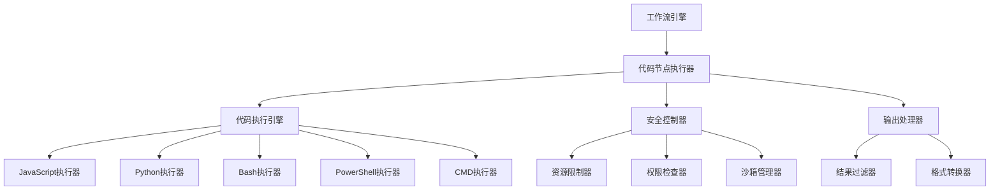

# 代码执行节点设计方案

## 项目概述

本项目为图工作流系统设计并实现了代码执行节点，支持在工作流中执行多种类型的代码，包括JavaScript、Python、Bash、PowerShell和CMD脚本。该设计遵循现有的架构模式，提供了灵活、安全、可扩展的代码执行能力。

## 文档结构

本设计方案包含以下文档：

1. **[设计文档](./code-execution-node-design.md)** - 整体架构设计和需求分析
2. **[实现指南](./implementation-guide.md)** - 详细的实现步骤和代码示例
3. **[安全性设计](./security-design.md)** - 全面的安全机制和威胁防护
4. **[使用示例](./usage-examples.md)** - 实际使用场景和最佳实践

## 核心特性

### 多语言支持
- **JavaScript**: 使用VM2沙箱环境，支持ES6+语法
- **Python**: 支持Python 3.x，包含常用标准库
- **Bash**: 支持Shell脚本执行
- **PowerShell**: 支持Windows PowerShell脚本
- **CMD**: 支持Windows CMD批处理

### 安全性保障
- **多层防护**: 输入验证、权限控制、资源限制、沙箱执行
- **威胁检测**: 静态代码分析、危险操作检测
- **资源控制**: CPU、内存、磁盘、网络访问限制
- **审计日志**: 完整的执行记录和异常监控

### 灵活配置
- **参数传递**: 支持从工作流上下文传递参数
- **结果处理**: 支持多种输出格式（文本、JSON、二进制）
- **超时控制**: 可配置的执行超时时间
- **环境设置**: 自定义环境变量和工作目录

## 架构概览



## 实现组件

### 核心组件

1. **CodeNodeExecutor** - 代码节点执行器
   - 负责节点的整体执行流程
   - 处理参数传递和结果返回
   - 协调各个子组件的工作

2. **CodeExecutionEngine** - 代码执行引擎
   - 管理不同语言的执行器
   - 提供统一的执行接口
   - 处理语言特定的逻辑

3. **SecurityController** - 安全控制器
   - 实施安全策略和检查
   - 监控资源使用情况
   - 记录安全事件

### 语言执行器

每种语言都有专门的执行器实现：

- **JavaScriptExecutor**: 使用VM2提供安全的JS执行环境
- **PythonExecutor**: 通过子进程执行Python代码
- **BashExecutor**: 执行Shell脚本
- **PowerShellExecutor**: 执行PowerShell脚本
- **CmdExecutor**: 执行CMD批处理

### 安全组件

- **ResourceLimiter**: 资源使用限制
- **PermissionChecker**: 权限验证
- **SandboxManager**: 沙箱环境管理
- **AuditLogger**: 审计日志记录

## 使用流程

1. **配置节点**: 在工作流中添加代码执行节点，配置语言、代码和参数
2. **安全检查**: 系统自动进行安全验证和权限检查
3. **代码执行**: 在沙箱环境中执行代码
4. **结果处理**: 处理执行结果并返回到工作流上下文
5. **审计记录**: 记录执行详情和安全事件

## 配置示例

### 基本配置

```json
{
  "id": "dataProcessing",
  "type": "code",
  "properties": {
    "language": "javascript",
    "code": "const input = context.input || [];\nreturn input.map(x => x * 2);",
    "parameters": {
      "input": "{{previousNode.result}}"
    },
    "timeout": 5000,
    "security": {
      "allowFileSystemAccess": false,
      "allowNetworkAccess": false,
      "maxMemory": 64000000
    }
  }
}
```

### 高级配置

```json
{
  "id": "complexAnalysis",
  "type": "code",
  "properties": {
    "language": "python",
    "code": "import json\nimport statistics\n\ndata = context.get('data', [])\nvalues = [item['value'] for item in data]\nresult = {\n    'mean': statistics.mean(values),\n    'median': statistics.median(values),\n    'std_dev': statistics.stdev(values)\n}\nprint(json.dumps(result))",
    "parameters": {
      "data": "{{dataSource.result}}"
    },
    "timeout": 30000,
    "environment": {
      "PYTHONPATH": "/usr/local/lib/python3.8/site-packages"
    },
    "workingDirectory": "/tmp/workspace",
    "security": {
      "allowFileSystemAccess": true,
      "allowNetworkAccess": false,
      "maxMemory": 128000000,
      "maxCpuTime": 10000,
      "allowedPaths": ["/tmp/workspace", "/data/input"]
    },
    "output": {
      "format": "json",
      "captureStdout": true,
      "captureStderr": true
    }
  }
}
```

## 安全考虑

### 威胁防护

1. **代码注入防护**: 静态代码分析和危险操作检测
2. **资源耗尽防护**: CPU、内存、磁盘使用限制
3. **权限提升防护**: 最小权限原则和沙箱隔离
4. **数据泄露防护**: 敏感信息过滤和输出清理

### 安全配置

```json
{
  "security": {
    "allowFileSystemAccess": false,
    "allowNetworkAccess": false,
    "maxMemory": 64000000,
    "maxCpuTime": 5000,
    "allowedPaths": [],
    "blockedCommands": ["rm", "dd", "mkfs", "wget", "curl"]
  }
}
```

## 性能优化

### 优化策略

1. **代码优化**: 使用高效算法和数据结构
2. **资源管理**: 及时释放不需要的资源
3. **并发控制**: 限制并发执行数量
4. **缓存机制**: 缓存常用计算结果

### 监控指标

- 执行时间
- 内存使用
- CPU使用率
- 成功/失败率
- 资源队列长度

## 扩展性

### 添加新语言支持

1. 实现`CodeExecutor`接口
2. 在`CodeExecutionEngine`中注册新执行器
3. 添加语言特定的安全检查
4. 更新配置模式

### 自定义安全策略

1. 实现`SecurityPolicy`接口
2. 在`SecurityController`中注册新策略
3. 配置策略参数
4. 测试策略有效性

## 测试策略

### 测试类型

1. **单元测试**: 测试各个组件的功能
2. **集成测试**: 测试组件间的协作
3. **安全测试**: 测试安全机制的有效性
4. **性能测试**: 测试系统性能和资源使用

### 测试覆盖

- 正常执行流程
- 异常处理机制
- 安全边界条件
- 资源限制场景
- 并发执行情况

## 部署建议

### 环境要求

- Node.js 14+ (JavaScript执行)
- Python 3.8+ (Python执行)
- Bash 4.0+ (Shell执行)
- PowerShell 5.0+ (PowerShell执行)
- Docker 20.0+ (容器沙箱)

### 配置建议

1. **生产环境**: 启用所有安全检查，限制资源使用
2. **开发环境**: 放宽部分限制，便于调试
3. **测试环境**: 模拟生产配置，进行全面测试

## 监控和维护

### 监控指标

- 执行成功率
- 平均执行时间
- 资源使用情况
- 安全事件数量
- 错误类型分布

### 维护任务

1. **定期更新**: 更新依赖库和安全补丁
2. **日志分析**: 分析执行日志发现异常
3. **性能调优**: 根据监控数据优化性能
4. **安全审查**: 定期进行安全评估

## 未来规划

### 短期目标

1. 完善现有语言支持
2. 增强安全机制
3. 优化性能表现
4. 扩展测试覆盖

### 长期目标

1. 支持更多编程语言
2. 提供可视化调试工具
3. 实现分布式执行
4. 集成机器学习模型

## 总结

代码执行节点的设计遵循了模块化、安全性和可扩展性的原则，为图工作流系统提供了强大的代码执行能力。通过多层安全防护和灵活的配置选项，用户可以在保证安全的前提下，实现复杂的数据处理和计算任务。

该设计方案不仅满足了当前的需求，还为未来的扩展和优化留下了充足的空间，是一个可持续发展的解决方案。