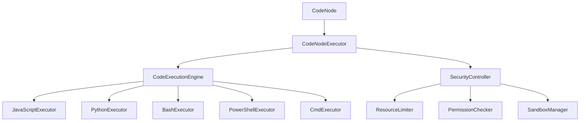

# 代码执行节点设计方案

## 概述

本文档描述了在图工作流系统中新增代码执行节点的设计方案，该节点支持执行多种类型的代码，包括JavaScript、Python、Bash脚本、PowerShell脚本和CMD脚本。

## 需求分析

### 功能需求

1. **多语言支持**：支持执行JavaScript、Python、Bash、PowerShell和CMD脚本
2. **参数传递**：支持从工作流上下文向代码传递参数
3. **结果返回**：支持将代码执行结果返回到工作流上下文
4. **错误处理**：支持捕获和处理代码执行错误
5. **超时控制**：支持设置代码执行超时时间
6. **安全性控制**：支持限制代码执行的权限和资源使用

### 非功能需求

1. **安全性**：防止恶意代码执行，限制系统资源访问
2. **性能**：支持高效的代码执行和资源管理
3. **可扩展性**：易于添加新的代码执行类型
4. **可靠性**：确保代码执行的稳定性和错误恢复

## 架构设计

### 整体架构

代码执行节点采用分层架构设计，包括：

1. **节点类型层**：定义代码执行节点的类型和属性
2. **节点执行器层**：实现节点的执行逻辑
3. **代码执行器层**：实现不同类型代码的执行引擎
4. **安全性控制层**：提供代码执行的安全控制机制

### 组件关系图



## 详细设计

### 1. 节点类型定义

在 `src/domain/workflow/graph/value-objects/node-type.ts` 中添加新的节点类型：

```typescript
export enum NodeTypeValue {
  // ... 现有类型
  CODE = 'code'
}
```

添加对应的工厂方法和类型检查方法。

### 2. 节点执行器实现

创建 `src/infrastructure/workflow/nodes/executors/code-node-executor.ts`：

```typescript
@injectable()
export class CodeNodeExecutor implements INodeExecutor {
  constructor(
    @inject('CodeExecutionEngine') private codeExecutionEngine: CodeExecutionEngine,
    @inject('SecurityController') private securityController: SecurityController
  ) {}

  async execute(node: Node, context: ExecutionContext): Promise<any> {
    // 获取代码配置
    const config = this.extractCodeConfig(node);
    
    // 安全性检查
    await this.securityController.validateExecution(config, context);
    
    // 准备执行环境
    const executionContext = this.prepareExecutionContext(node, context);
    
    // 执行代码
    const result = await this.codeExecutionEngine.execute(
      config.language,
      config.code,
      executionContext
    );
    
    // 处理结果
    return this.processResult(result, node, context);
  }
}
```

### 3. 代码执行引擎

创建 `src/infrastructure/external/code-execution/code-execution-engine.ts`：

```typescript
@injectable()
export class CodeExecutionEngine {
  private executors: Map<string, CodeExecutor> = new Map();

  constructor(
    @inject('JavaScriptExecutor') jsExecutor: JavaScriptExecutor,
    @inject('PythonExecutor') pythonExecutor: PythonExecutor,
    @inject('BashExecutor') bashExecutor: BashExecutor,
    @inject('PowerShellExecutor') psExecutor: PowerShellExecutor,
    @inject('CmdExecutor') cmdExecutor: CmdExecutor
  ) {
    this.registerExecutors(jsExecutor, pythonExecutor, bashExecutor, psExecutor, cmdExecutor);
  }

  async execute(language: string, code: string, context: CodeExecutionContext): Promise<CodeExecutionResult> {
    const executor = this.executors.get(language);
    if (!executor) {
      throw new Error(`Unsupported code language: ${language}`);
    }
    
    return await executor.execute(code, context);
  }
}
```

### 4. 语言特定执行器

为每种语言创建专门的执行器：

#### JavaScript执行器
`src/infrastructure/external/code-execution/executors/javascript-executor.ts`

#### Python执行器
`src/infrastructure/external/code-execution/executors/python-executor.ts`

#### Bash执行器
`src/infrastructure/external/code-execution/executors/bash-executor.ts`

#### PowerShell执行器
`src/infrastructure/external/code-execution/executors/powershell-executor.ts`

#### CMD执行器
`src/infrastructure/external/code-execution/executors/cmd-executor.ts`

### 5. 安全性控制

创建 `src/infrastructure/external/code-execution/security/security-controller.ts`：

```typescript
@injectable()
export class SecurityController {
  constructor(
    @inject('ResourceLimiter') private resourceLimiter: ResourceLimiter,
    @inject('PermissionChecker') private permissionChecker: PermissionChecker,
    @inject('SandboxManager') private sandboxManager: SandboxManager
  ) {}

  async validateExecution(config: CodeExecutionConfig, context: ExecutionContext): Promise<void> {
    // 检查执行权限
    await this.permissionChecker.checkExecutionPermission(config, context);
    
    // 检查资源限制
    await this.resourceLimiter.checkResourceLimits(config);
    
    // 检查代码安全性
    await this.sandboxManager.validateCode(config.code, config.language);
  }
}
```

## 配置模式

### 节点配置结构

```typescript
interface CodeNodeConfig {
  language: 'javascript' | 'python' | 'bash' | 'powershell' | 'cmd';
  code: string;
  parameters?: Record<string, any>;
  timeout?: number;
  environment?: Record<string, string>;
  workingDirectory?: string;
  security?: {
    allowFileSystemAccess: boolean;
    allowNetworkAccess: boolean;
    maxMemory: number;
    maxCpuTime: number;
  };
  output?: {
    format: 'text' | 'json' | 'binary';
    captureStdout: boolean;
    captureStderr: boolean;
  };
}
```

### 示例配置

#### JavaScript示例
```json
{
  "language": "javascript",
  "code": "const input = context.input; const result = input.map(x => x * 2); return result;",
  "parameters": {
    "input": "{{previousNode.result}}"
  },
  "timeout": 5000,
  "output": {
    "format": "json",
    "captureStdout": true,
    "captureStderr": true
  }
}
```

#### Python示例
```json
{
  "language": "python",
  "code": "import json\ninput_data = json.loads(context['input'])\nresult = [x * 2 for x in input_data]\nprint(json.dumps(result))",
  "parameters": {
    "input": "{{previousNode.result}}"
  },
  "timeout": 10000,
  "security": {
    "allowFileSystemAccess": false,
    "allowNetworkAccess": false,
    "maxMemory": 128000000,
    "maxCpuTime": 5000
  }
}
```

## 安全性设计

### 1. 沙箱执行

- 使用容器或虚拟机隔离执行环境
- 限制文件系统访问权限
- 限制网络访问权限
- 限制系统资源使用

### 2. 代码检查

- 静态代码分析检测危险操作
- 禁止使用危险的系统调用
- 检查代码中的敏感信息

### 3. 资源限制

- 内存使用限制
- CPU时间限制
- 执行超时限制
- 文件大小限制

### 4. 权限控制

- 基于角色的执行权限控制
- 代码执行审计日志
- 异常行为检测和告警

## 实现计划

### 阶段1：基础架构
1. 创建代码执行节点类型定义
2. 实现基础的节点执行器
3. 创建代码执行引擎框架

### 阶段2：语言支持
1. 实现JavaScript执行器
2. 实现Python执行器
3. 实现Bash执行器

### 阶段3：扩展支持
1. 实现PowerShell执行器
2. 实现CMD执行器
3. 添加更多语言支持

### 阶段4：安全性增强
1. 实现沙箱执行环境
2. 添加资源限制机制
3. 实现代码安全检查

### 阶段5：测试和优化
1. 创建全面的测试用例
2. 性能优化和调优
3. 文档完善和示例

## 使用示例

### 工作流定义

```json
{
  "nodes": [
    {
      "id": "start",
      "type": "start",
      "properties": {}
    },
    {
      "id": "dataProcessing",
      "type": "code",
      "properties": {
        "language": "python",
        "code": "import pandas as pd\ndata = pd.DataFrame(context['input'])\nresult = data.describe().to_dict()\nreturn result",
        "parameters": {
          "input": "{{start.data}}"
        },
        "timeout": 30000
      }
    },
    {
      "id": "end",
      "type": "end",
      "properties": {}
    }
  ],
  "edges": [
    {
      "id": "edge1",
      "fromNodeId": "start",
      "toNodeId": "dataProcessing"
    },
    {
      "id": "edge2",
      "fromNodeId": "dataProcessing",
      "toNodeId": "end"
    }
  ]
}
```

## 总结

代码执行节点的设计遵循了现有的架构模式，提供了灵活、安全、可扩展的代码执行能力。通过分层架构和模块化设计，可以轻松添加新的语言支持和功能扩展。安全性设计确保了代码执行的安全性和可控性，为用户提供了强大的代码执行能力同时保证了系统的安全性。