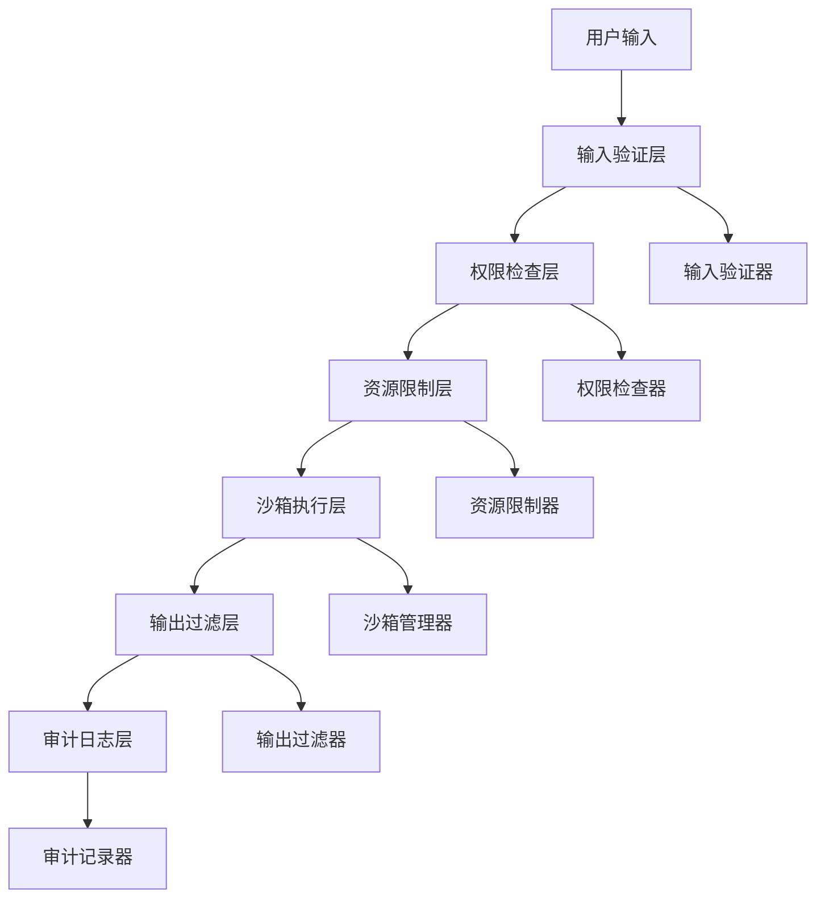

# 代码执行节点安全性设计

## 概述

代码执行节点允许在工作流中执行各种类型的代码，这带来了潜在的安全风险。本文档详细描述了代码执行节点的安全性设计，包括威胁模型、安全机制和最佳实践。

## 威胁模型

### 潜在威胁

1. **代码注入攻击**：恶意用户通过代码执行节点注入恶意代码
2. **资源耗尽攻击**：恶意代码消耗大量系统资源导致服务不可用
3. **权限提升攻击**：代码尝试获取超出授权的系统权限
4. **数据泄露**：代码尝试访问敏感数据或系统信息
5. **网络攻击**：代码尝试发起网络连接或攻击其他系统
6. **文件系统攻击**：代码尝试访问、修改或删除系统文件

### 攻击向量

1. **直接代码注入**：用户直接在节点配置中提供恶意代码
2. **参数注入**：通过上下文参数注入恶意内容
3. **环境变量注入**：通过环境变量传递恶意配置
4. **依赖库攻击**：利用第三方库的漏洞
5. **侧信道攻击**：通过执行时间、资源使用等信息推断系统状态

## 安全架构

### 多层防护



### 安全组件

1. **输入验证层**：验证代码和参数的合法性
2. **权限检查层**：检查用户执行权限和代码权限
3. **资源限制层**：限制CPU、内存、磁盘等资源使用
4. **沙箱执行层**：在隔离环境中执行代码
5. **输出过滤层**：过滤和清理执行结果
6. **审计日志层**：记录所有执行活动和异常

## 详细安全机制

### 1. 输入验证

#### 代码静态分析

```typescript
export class CodeValidator {
  private readonly dangerousPatterns = {
    javascript: [
      /require\s*\(/,
      /import\s+.*\s+from/,
      /process\./,
      /global\./,
      /eval\s*\(/,
      /Function\s*\(/,
      /setTimeout/,
      /setInterval/,
      /fs\./,
      /child_process\./
    ],
    python: [
      /import\s+os/,
      /import\s+subprocess/,
      /import\s+shutil/,
      /exec\s*\(/,
      /eval\s*\(/,
      /__import__\s*\(/,
      /open\s*\(/,
      /file\s*\(/,
      /input\s*\(/,
      /raw_input\s*\(/,
      /os\.system/,
      /subprocess\.call/
    ],
    bash: [
      /rm\s+-rf/,
      />\s*\/dev\/null/,
      /&&\s*rm/,
      /\|\|\s*rm/,
      /wget/,
      /curl/,
      /nc\s+-l/,
      /chmod\s+777/
    ]
  };

  async validateCode(code: string, language: string): Promise<ValidationResult> {
    const patterns = this.dangerousPatterns[language] || [];
    const errors: string[] = [];
    
    for (const pattern of patterns) {
      if (pattern.test(code)) {
        errors.push(`Dangerous operation detected: ${pattern.source}`);
      }
    }
    
    // 检查代码长度
    if (code.length > this.maxCodeLength) {
      errors.push(`Code too long: ${code.length} > ${this.maxCodeLength}`);
    }
    
    // 检查复杂度
    const complexity = this.calculateComplexity(code);
    if (complexity > this.maxComplexity) {
      errors.push(`Code too complex: ${complexity} > ${this.maxComplexity}`);
    }
    
    return {
      valid: errors.length === 0,
      errors
    };
  }

  private calculateComplexity(code: string): number {
    // 简单的复杂度计算：循环、递归、嵌套等
    const loops = (code.match(/for\s*\(|while\s*\(/g) || []).length;
    const recursion = (code.match(/function\s+\w+\s*\([^)]*\)\s*{[\s\S]*?\1\s*\(/g) || []).length;
    const nesting = this.calculateNestingLevel(code);
    
    return loops * 2 + recursion * 3 + nesting;
  }
}
```

#### 参数验证

```typescript
export class ParameterValidator {
  async validateParameters(
    parameters: Record<string, any>,
    schema: ParameterSchema
  ): Promise<ValidationResult> {
    const errors: string[] = [];
    
    for (const [key, value] of Object.entries(parameters)) {
      const paramSchema = schema.properties[key];
      if (!paramSchema) {
        errors.push(`Unexpected parameter: ${key}`);
        continue;
      }
      
      // 类型检查
      if (!this.validateType(value, paramSchema.type)) {
        errors.push(`Invalid type for parameter ${key}: expected ${paramSchema.type}`);
      }
      
      // 值范围检查
      if (paramSchema.enum && !paramSchema.enum.includes(value)) {
        errors.push(`Invalid value for parameter ${key}: must be one of ${paramSchema.enum.join(', ')}`);
      }
      
      // 长度检查
      if (paramSchema.maxLength && String(value).length > paramSchema.maxLength) {
        errors.push(`Parameter ${key} too long: ${String(value).length} > ${paramSchema.maxLength}`);
      }
      
      // 模式检查
      if (paramSchema.pattern && !new RegExp(paramSchema.pattern).test(String(value))) {
        errors.push(`Parameter ${key} does not match required pattern`);
      }
    }
    
    return {
      valid: errors.length === 0,
      errors
    };
  }
}
```

### 2. 权限控制

#### 基于角色的访问控制

```typescript
export class PermissionChecker {
  async checkExecutionPermission(
    config: CodeExecutionConfig,
    context: ExecutionContext
  ): Promise<void> {
    const user = context.getUser();
    const permissions = await this.getUserPermissions(user.id);
    
    // 检查基本执行权限
    if (!permissions.includes('code:execute')) {
      throw new Error('User does not have code execution permission');
    }
    
    // 检查语言特定权限
    const languagePermission = `code:execute:${config.language}`;
    if (!permissions.includes(languagePermission)) {
      throw new Error(`User does not have ${config.language} execution permission`);
    }
    
    // 检查资源使用权限
    if (config.security.maxMemory > this.getMaxAllowedMemory(user.role)) {
      throw new Error('Requested memory exceeds allowed limit');
    }
    
    // 检查时间限制权限
    if (config.timeout > this.getMaxAllowedTimeout(user.role)) {
      throw new Error('Requested timeout exceeds allowed limit');
    }
  }

  async checkRateLimit(context: ExecutionContext): Promise<void> {
    const user = context.getUser();
    const key = `code_execution_rate:${user.id}`;
    const current = await this.rateLimiter.get(key);
    const limit = this.getExecutionRateLimit(user.role);
    
    if (current >= limit) {
      throw new Error('Rate limit exceeded');
    }
    
    await this.rateLimiter.incr(key);
    await this.rateLimiter.expire(key, 60); // 1分钟窗口
  }
}
```

#### 权限等级定义

```typescript
export enum PermissionLevel {
  GUEST = 'guest',
  USER = 'user',
  DEVELOPER = 'developer',
  ADMIN = 'admin'
}

export const PERMISSION_LIMITS = {
  [PermissionLevel.GUEST]: {
    maxMemory: 64 * 1024 * 1024, // 64MB
    maxTimeout: 5000, // 5秒
    maxExecutionsPerMinute: 5,
    allowedLanguages: ['javascript'],
    allowFileSystemAccess: false,
    allowNetworkAccess: false
  },
  [PermissionLevel.USER]: {
    maxMemory: 128 * 1024 * 1024, // 128MB
    maxTimeout: 10000, // 10秒
    maxExecutionsPerMinute: 10,
    allowedLanguages: ['javascript', 'python'],
    allowFileSystemAccess: false,
    allowNetworkAccess: false
  },
  [PermissionLevel.DEVELOPER]: {
    maxMemory: 256 * 1024 * 1024, // 256MB
    maxTimeout: 30000, // 30秒
    maxExecutionsPerMinute: 30,
    allowedLanguages: ['javascript', 'python', 'bash'],
    allowFileSystemAccess: true,
    allowNetworkAccess: false
  },
  [PermissionLevel.ADMIN]: {
    maxMemory: 512 * 1024 * 1024, // 512MB
    maxTimeout: 60000, // 60秒
    maxExecutionsPerMinute: 100,
    allowedLanguages: ['javascript', 'python', 'bash', 'powershell', 'cmd'],
    allowFileSystemAccess: true,
    allowNetworkAccess: true
  }
};
```

### 3. 资源限制

#### 资源监控和限制

```typescript
export class ResourceLimiter {
  async checkResourceLimits(config: CodeExecutionConfig): Promise<void> {
    // 检查内存限制
    if (config.security.maxMemory > this.systemMaxMemory) {
      throw new Error(`Memory limit exceeds system maximum: ${config.security.maxMemory} > ${this.systemMaxMemory}`);
    }
    
    // 检查CPU时间限制
    if (config.security.maxCpuTime > this.systemMaxCpuTime) {
      throw new Error(`CPU time limit exceeds system maximum: ${config.security.maxCpuTime} > ${this.systemMaxCpuTime}`);
    }
    
    // 检查并发执行限制
    const currentExecutions = await this.getCurrentExecutionCount();
    if (currentExecutions >= this.maxConcurrentExecutions) {
      throw new Error('System execution limit reached');
    }
  }

  async monitorExecution(executionId: string): Promise<ResourceUsage> {
    return new Promise((resolve, reject) => {
      const monitor = setInterval(async () => {
        try {
          const usage = await this.getResourceUsage(executionId);
          
          // 检查内存使用
          if (usage.memory > usage.limit.memory) {
            await this.killExecution(executionId);
            clearInterval(monitor);
            reject(new Error('Memory limit exceeded'));
            return;
          }
          
          // 检查CPU时间
          if (usage.cpuTime > usage.limit.cpuTime) {
            await this.killExecution(executionId);
            clearInterval(monitor);
            reject(new Error('CPU time limit exceeded'));
            return;
          }
          
          // 检查执行时间
          if (Date.now() - usage.startTime > usage.limit.timeout) {
            await this.killExecution(executionId);
            clearInterval(monitor);
            reject(new Error('Execution timeout'));
            return;
          }
          
          if (usage.completed) {
            clearInterval(monitor);
            resolve(usage);
          }
        } catch (error) {
          clearInterval(monitor);
          reject(error);
        }
      }, 1000); // 每秒检查一次
    });
  }
}
```

### 4. 沙箱执行

#### 容器沙箱

```typescript
export class ContainerSandbox implements Sandbox {
  async createSandbox(config: SandboxConfig): Promise<SandboxInstance> {
    const containerConfig = {
      Image: 'code-execution-sandbox:latest',
      Cmd: ['/bin/sh'],
      WorkingDir: '/workspace',
      Memory: config.security.maxMemory,
      CpuQuota: config.security.maxCpuTime * 1000, // 转换为微秒
      NetworkMode: config.security.allowNetworkAccess ? 'bridge' : 'none',
      ReadonlyRootfs: true,
      Tmpfs: {
        '/tmp': 'noexec,nosuid,size=100m'
      },
      User: 'nobody', // 非root用户
      SecurityOpt: [
        'no-new-privileges:true',
        'seccomp=unconfined' // 可以使用更严格的seccomp配置
      ],
      HostConfig: {
        Mounts: [
          {
            Type: 'tmpfs',
            Target: '/workspace',
            TmpfsOptions: {
              'size': '100m',
              'mode': '1777'
            }
          }
        ]
      }
    };
    
    const container = await this.dockerClient.createContainer(containerConfig);
    await container.start();
    
    return new ContainerSandboxInstance(container, config);
  }
}

export class ContainerSandboxInstance implements SandboxInstance {
  constructor(
    private container: Container,
    private config: SandboxConfig
  ) {}

  async executeCode(code: string, language: string): Promise<ExecutionResult> {
    const scriptPath = `/workspace/script.${this.getFileExtension(language)}`;
    const wrappedCode = this.wrapCode(code, language);
    
    // 写入代码文件
    await this.container.putContent(scriptPath, wrappedCode);
    
    // 准备执行命令
    const command = this.getExecutionCommand(language, scriptPath);
    
    // 执行代码
    const exec = await this.container.exec({
      Cmd: command,
      AttachStdout: true,
      AttachStderr: true,
      User: 'nobody'
    });
    
    const stream = await exec.start({
      hijack: true,
      stdin: false
    });
    
    // 收集输出
    const result = await this.collectOutput(stream);
    
    // 清理文件
    await this.container.removePath(scriptPath);
    
    return result;
  }

  private wrapCode(code: string, language: string): string {
    switch (language) {
      case 'javascript':
        return this.wrapJavaScriptCode(code);
      case 'python':
        return this.wrapPythonCode(code);
      case 'bash':
        return this.wrapBashCode(code);
      default:
        return code;
    }
  }

  private wrapJavaScriptCode(code: string): string {
    return `
const context = ${JSON.stringify(this.config.parameters)};
let result;

try {
  ${code}
} catch (error) {
  console.error('Execution error:', error.message);
  process.exit(1);
}

if (result !== undefined) {
  console.log(JSON.stringify(result));
}
`;
  }

  private wrapPythonCode(code: string): string {
    return `
import sys
import json
import traceback

context = ${JSON.stringify(this.config.parameters)}

try:
    ${code}
    
    if 'result' in locals():
        if isinstance(result, (dict, list, tuple)):
            print(json.dumps(result))
        else:
            print(str(result))
            
except Exception as e:
    print(f"Error: {str(e)}", file=sys.stderr)
    traceback.print_exc(file=sys.stderr)
    sys.exit(1)
`;
  }
}
```

#### VM2 JavaScript沙箱

```typescript
export class JavaScriptSandbox {
  async execute(code: string, context: ExecutionContext): Promise<ExecutionResult> {
    const vm = new VM({
      timeout: context.timeout,
      sandbox: this.createSandbox(context),
      eval: false,
      wasm: false,
      fixAsync: true
    });
    
    try {
      const result = vm.run(code);
      return {
        success: true,
        result,
        stdout: '',
        stderr: ''
      };
    } catch (error) {
      return {
        success: false,
        result: null,
        stdout: '',
        stderr: error instanceof Error ? error.message : String(error)
      };
    }
  }

  private createSandbox(context: ExecutionContext): any {
    return {
      context: context.parameters,
      console: {
        log: (...args: any[]) => {
          // 安全的console.log实现
          return args.map(arg => this.sanitizeValue(arg)).join(' ');
        },
        error: (...args: any[]) => {
          // 安全的console.error实现
          return args.map(arg => this.sanitizeValue(arg)).join(' ');
        }
      },
      Math: Math,
      Date: Date,
      RegExp: RegExp,
      String: String,
      Number: Number,
      Boolean: Boolean,
      Array: Array,
      Object: Object,
      JSON: JSON,
      // 禁用危险对象
      process: undefined,
      global: undefined,
      require: undefined,
      import: undefined,
      eval: undefined,
      Function: undefined,
      setTimeout: undefined,
      setInterval: undefined,
      setImmediate: undefined,
      clearImmediate: undefined
    };
  }

  private sanitizeValue(value: any): any {
    if (typeof value === 'object' && value !== null) {
      // 防止原型污染
      return JSON.parse(JSON.stringify(value));
    }
    return value;
  }
}
```

### 5. 输出过滤

```typescript
export class OutputFilter {
  async filterOutput(output: string, config: OutputConfig): Promise<string> {
    let filtered = output;
    
    // 移除敏感信息
    filtered = this.removeSensitiveInfo(filtered);
    
    // 限制输出长度
    if (filtered.length > config.maxLength) {
      filtered = filtered.substring(0, config.maxLength) + '... [truncated]';
    }
    
    // 过滤危险内容
    filtered = this.filterDangerousContent(filtered);
    
    // 格式化输出
    if (config.format === 'json') {
      filtered = this.formatAsJson(filtered);
    }
    
    return filtered;
  }

  private removeSensitiveInfo(output: string): string {
    const sensitivePatterns = [
      /password[=:]\s*[^\s\n]+/gi,
      /token[=:]\s*[^\s\n]+/gi,
      /key[=:]\s*[^\s\n]+/gi,
      /secret[=:]\s*[^\s\n]+/gi,
      /\/home\/[^\/\s]+/g,
      /\/Users\/[^\/\s]+/g
    ];
    
    let filtered = output;
    for (const pattern of sensitivePatterns) {
      filtered = filtered.replace(pattern, '[REDACTED]');
    }
    
    return filtered;
  }

  private filterDangerousContent(output: string): string {
    // 过滤可能的路径遍历
    const pathTraversalPattern = /\.\.[\/\\]/g;
    let filtered = output.replace(pathTraversalPattern, '[FILTERED]');
    
    // 过滤可能的命令注入
    const commandInjectionPatterns = [
      /&&\s*rm\s+/gi,
      /\|\|\s*rm\s+/gi,
      /;\s*rm\s+/gi,
      /`[^`]*`/g,
      /\$[^$]*\$/g
    ];
    
    for (const pattern of commandInjectionPatterns) {
      filtered = filtered.replace(pattern, '[FILTERED]');
    }
    
    return filtered;
  }
}
```

### 6. 审计日志

```typescript
export class AuditLogger {
  async logExecution(execution: CodeExecution): Promise<void> {
    const auditEntry = {
      timestamp: new Date().toISOString(),
      executionId: execution.id,
      userId: execution.userId,
      nodeId: execution.nodeId,
      language: execution.config.language,
      codeHash: this.hashCode(execution.config.code),
      parameters: this.sanitizeParameters(execution.config.parameters),
      security: execution.config.security,
      result: {
        success: execution.result.success,
        executionTime: execution.result.executionTime,
        exitCode: execution.result.exitCode
      },
      resourceUsage: execution.resourceUsage,
      violations: execution.violations || []
    };
    
    await this.auditRepository.save(auditEntry);
    
    // 检查异常行为
    await this.checkAnomalies(execution);
  }

  private async checkAnomalies(execution: CodeExecution): Promise<void> {
    // 检查异常长的执行时间
    if (execution.result.executionTime > this.getAverageExecutionTime(execution.config.language) * 3) {
      await this.alertManager.sendAlert({
        type: 'ANOMALOUS_EXECUTION_TIME',
        executionId: execution.id,
        userId: execution.userId,
        details: {
          actualTime: execution.result.executionTime,
          averageTime: this.getAverageExecutionTime(execution.config.language)
        }
      });
    }
    
    // 检查频繁失败
    const recentFailures = await this.getRecentFailures(execution.userId, 24 * 60 * 60 * 1000); // 24小时
    if (recentFailures > 10) {
      await this.alertManager.sendAlert({
        type: 'FREQUENT_FAILURES',
        userId: execution.userId,
        details: {
          failureCount: recentFailures,
          timeWindow: '24h'
        }
      });
    }
  }
}
```

## 安全最佳实践

### 1. 配置建议

```typescript
export const SECURITY_DEFAULTS = {
  // 默认安全配置
  defaultSecurity: {
    allowFileSystemAccess: false,
    allowNetworkAccess: false,
    maxMemory: 64 * 1024 * 1024, // 64MB
    maxCpuTime: 5000, // 5秒
    allowedPaths: [],
    blockedCommands: [
      'rm', 'dd', 'mkfs', 'fdisk', 'mount', 'umount',
      'wget', 'curl', 'nc', 'telnet', 'ssh',
      'chmod', 'chown', 'sudo', 'su'
    ]
  },
  
  // 语言特定限制
  languageLimits: {
    javascript: {
      maxCodeLength: 10000,
      maxComplexity: 50,
      timeout: 10000
    },
    python: {
      maxCodeLength: 15000,
      maxComplexity: 100,
      timeout: 30000
    },
    bash: {
      maxCodeLength: 5000,
      maxComplexity: 20,
      timeout: 5000
    }
  }
};
```

### 2. 监控和告警

```typescript
export class SecurityMonitor {
  async monitorSystem(): Promise<void> {
    // 监控系统资源使用
    const systemUsage = await this.getSystemResourceUsage();
    if (systemUsage.memory > 0.9) {
      await this.alertManager.sendAlert({
        type: 'HIGH_MEMORY_USAGE',
        details: systemUsage
      });
    }
    
    // 监控执行队列
    const queueSize = await this.getExecutionQueueSize();
    if (queueSize > 100) {
      await this.alertManager.sendAlert({
        type: 'HIGH_QUEUE_SIZE',
        details: { queueSize }
      });
    }
    
    // 监控失败率
    const failureRate = await this.getFailureRate();
    if (failureRate > 0.1) { // 10%失败率
      await this.alertManager.sendAlert({
        type: 'HIGH_FAILURE_RATE',
        details: { failureRate }
      });
    }
  }
}
```

### 3. 定期安全审查

1. **代码审查**：定期审查代码执行器的实现
2. **配置审查**：定期检查安全配置的有效性
3. **日志分析**：分析执行日志发现异常模式
4. **渗透测试**：定期进行安全渗透测试
5. **依赖更新**：及时更新安全相关的依赖库

## 总结

代码执行节点的安全性设计采用了多层防护机制，从输入验证到输出过滤，从权限控制到资源限制，从沙箱执行到审计监控，全方位保障系统的安全性。通过合理的安全配置和持续的监控，可以在提供强大代码执行能力的同时，有效防范各种安全威胁。