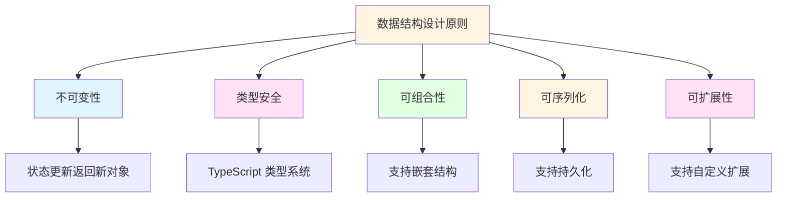
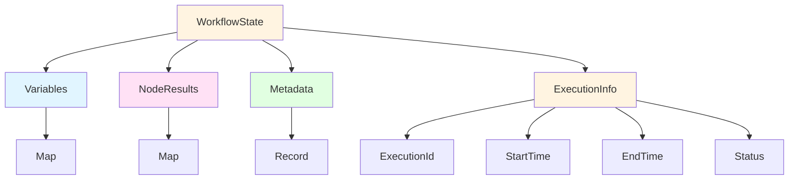
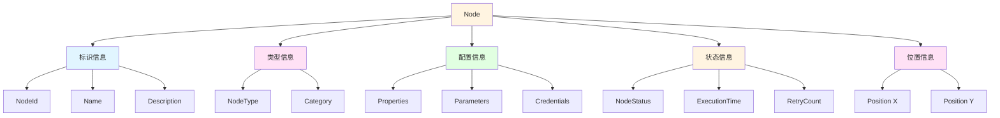
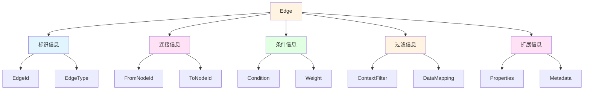
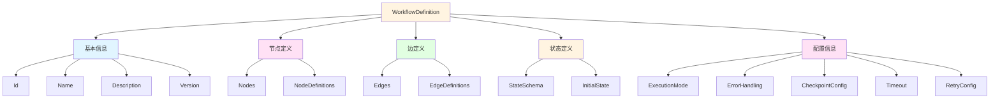
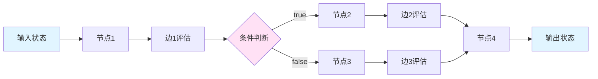
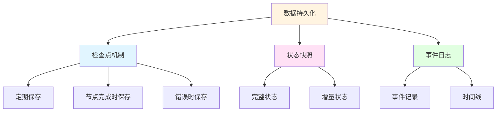

# 图工作流数据结构设计

## 概述

本文档详细分析图工作流的数据结构设计，包括状态管理、节点结构、边结构、工作流定义等核心数据结构的设计原则和实现方式。

## 一、数据结构设计原则

### 1.1 核心设计原则



#### 原则一：不可变性（Immutability）

**定义**：数据对象一旦创建就不能被修改，所有修改操作都返回新的对象。

**优势**：
- 避免意外的副作用
- 简化状态管理
- 便于时间旅行调试
- 支持撤销/重做功能

**实现示例**：
```typescript
// 不可变状态设计
class WorkflowState {
  constructor(
    public readonly variables: Map<string, any>,
    public readonly nodeResults: Map<string, any>,
    public readonly metadata: Record<string, any>
  ) {}
  
  // 更新变量，返回新的状态对象
  updateVariable(key: string, value: any): WorkflowState {
    const newVariables = new Map(this.variables);
    newVariables.set(key, value);
    
    return new WorkflowState(
      newVariables,
      this.nodeResults,
      this.metadata
    );
  }
  
  // 更新节点结果，返回新的状态对象
  updateNodeResult(nodeId: string, result: any): WorkflowState {
    const newNodeResults = new Map(this.nodeResults);
    newNodeResults.set(nodeId, result);
    
    return new WorkflowState(
      this.variables,
      newNodeResults,
      this.metadata
    );
  }
}
```

#### 原则二：类型安全（Type Safety）

**定义**：使用 TypeScript 类型系统确保数据结构的正确性。

**优势**：
- 编译时错误检测
- 智能代码提示
- 重构安全性
- 文档即代码

**实现示例**：
```typescript
// 类型安全的状态定义
interface WorkflowState {
  // 基本类型
  readonly id: string;
  readonly name: string;
  readonly status: WorkflowStatus;
  
  // 复杂类型
  readonly variables: Map<string, any>;
  readonly nodeResults: Map<NodeId, NodeExecutionResult>;
  readonly metadata: Record<string, unknown>;
  
  // 可选类型
  readonly error?: Error;
  readonly retryCount?: number;
}

// 使用枚举确保状态值的正确性
enum WorkflowStatus {
  PENDING = 'pending',
  RUNNING = 'running',
  COMPLETED = 'completed',
  FAILED = 'failed',
  CANCELLED = 'cancelled',
}
```

#### 原则三：可组合性（Composability）

**定义**：数据结构可以组合成更复杂的结构。

**优势**：
- 代码复用
- 灵活性
- 可维护性

**实现示例**：
```typescript
// 可组合的状态结构
interface BaseState {
  readonly id: string;
  readonly timestamp: number;
}

interface VariableState extends BaseState {
  readonly variables: Map<string, any>;
}

interface NodeState extends BaseState {
  readonly nodeResults: Map<string, any>;
}

// 组合状态
interface WorkflowState extends VariableState, NodeState {
  readonly status: WorkflowStatus;
  readonly metadata: Record<string, any>;
}
```

#### 原则四：可序列化（Serializability）

**定义**：数据结构可以序列化为 JSON 或其他格式，便于持久化和传输。

**优势**：
- 支持状态持久化
- 支持跨进程通信
- 支持调试和监控

**实现示例**：
```typescript
// 可序列化的状态设计
interface SerializableState {
  toJSON(): string;
  static fromJSON(json: string): SerializableState;
}

class WorkflowState implements SerializableState {
  toJSON(): string {
    return JSON.stringify({
      variables: Object.fromEntries(this.variables),
      nodeResults: Object.fromEntries(this.nodeResults),
      metadata: this.metadata,
    });
  }
  
  static fromJSON(json: string): WorkflowState {
    const data = JSON.parse(json);
    return new WorkflowState(
      new Map(Object.entries(data.variables)),
      new Map(Object.entries(data.nodeResults)),
      data.metadata
    );
  }
}
```

#### 原则五：可扩展性（Extensibility）

**定义**：数据结构可以轻松扩展新的字段和功能。

**优势**：
- 适应需求变化
- 支持插件化
- 向后兼容

**实现示例**：
```typescript
// 可扩展的状态设计
interface BaseState {
  readonly id: string;
  readonly timestamp: number;
}

interface ExtendedState extends BaseState {
  readonly customFields?: Record<string, any>;
}

// 使用扩展字段
const state: ExtendedState = {
  id: 'workflow-1',
  timestamp: Date.now(),
  customFields: {
    priority: 'high',
    tags: ['urgent', 'important'],
  },
};
```

## 二、状态数据结构设计

### 2.1 状态管理架构



### 2.2 LangGraph 风格的状态设计

**特点**：
- 使用 Annotation 定义状态结构
- 支持 reducer 函数处理状态更新
- 支持默认值

**实现示例**：
```typescript
import { Annotation } from "@langchain/langgraph";

// 定义状态注解
const StateAnnotation = Annotation.Root({
  // 简单字段
  input: Annotation<string>,
  output: Annotation<string>,
  
  // 带有 reducer 的字段
  messages: Annotation<BaseMessage[]>({
    reducer: (x, y) => x.concat(y),
    default: () => [],
  }),
  
  // 嵌套对象
  metadata: Annotation<Record<string, any>>({
    reducer: (x, y) => ({ ...x, ...y }),
    default: () => ({}),
  }),
  
  // 带有复杂 reducer 的字段
  counters: Annotation<Record<string, number>>({
    reducer: (x, y) => {
      const result = { ...x };
      for (const key in y) {
        result[key] = (result[key] || 0) + y[key];
      }
      return result;
    },
    default: () => ({}),
  }),
});

// 使用状态
type State = typeof StateAnnotation.State;

function nodeA(state: State): Partial<State> {
  return {
    messages: [new HumanMessage("Hello")],
    metadata: { step: "A" },
  };
}

function nodeB(state: State): Partial<State> {
  return {
    messages: [new AIMessage("Hi there!")],
    metadata: { step: "B" },
  };
}
```

### 2.3 当前项目的状态设计

**特点**：
- 使用值对象封装状态
- 支持不可变性
- 支持类型安全

**实现示例**：
```typescript
// src/domain/workflow/value-objects/workflow-state.ts
export class WorkflowState extends ValueObject<WorkflowStateProps> {
  // 变量存储
  private readonly variables: Map<string, any>;
  
  // 节点执行结果
  private readonly nodeResults: Map<string, any>;
  
  // 元数据
  private readonly metadata: Record<string, any>;
  
  constructor(props: WorkflowStateProps) {
    super(props);
    this.variables = new Map(props.variables || []);
    this.nodeResults = new Map(props.nodeResults || []);
    this.metadata = props.metadata || {};
  }
  
  // 获取变量
  getVariable(key: string): any {
    return this.variables.get(key);
  }
  
  // 设置变量，返回新的状态
  setVariable(key: string, value: any): WorkflowState {
    const newVariables = new Map(this.variables);
    newVariables.set(key, value);
    
    return new WorkflowState({
      ...this.props,
      variables: Array.from(newVariables.entries()),
    });
  }
  
  // 获取节点结果
  getNodeResult(nodeId: string): any {
    return this.nodeResults.get(nodeId);
  }
  
  // 设置节点结果，返回新的状态
  setNodeResult(nodeId: string, result: any): WorkflowState {
    const newNodeResults = new Map(this.nodeResults);
    newNodeResults.set(nodeId, result);
    
    return new WorkflowState({
      ...this.props,
      nodeResults: Array.from(newNodeResults.entries()),
    });
  }
  
  // 获取元数据
  getMetadata(key: string): any {
    return this.metadata[key];
  }
  
  // 设置元数据，返回新的状态
  setMetadata(key: string, value: any): WorkflowState {
    return new WorkflowState({
      ...this.props,
      metadata: { ...this.metadata, [key]: value },
    });
  }
}
```

### 2.4 状态更新模式

#### 模式一：直接更新

```typescript
// 直接更新状态
const newState = state.setVariable("key", "value");
```

#### 模式二：批量更新

```typescript
// 批量更新状态
const newState = state
  .setVariable("key1", "value1")
  .setVariable("key2", "value2")
  .setNodeResult("node1", result1);
```

#### 模式三：条件更新

```typescript
// 条件更新状态
const newState = condition
  ? state.setVariable("key", "value")
  : state;
```

#### 模式四：函数式更新

```typescript
// 函数式更新状态
const newState = state.updateVariable("counter", (value) => value + 1);
```

## 三、节点数据结构设计

### 3.1 节点属性结构



### 3.2 节点类型分类

```typescript
// 节点类型枚举
enum NodeType {
  // 执行节点
  LLM = 'llm',
  TOOL = 'tool',
  CODE = 'code',
  FUNCTION = 'function',
  
  // 控制流节点
  CONDITION = 'condition',
  SWITCH = 'switch',
  LOOP = 'loop',
  PARALLEL = 'parallel',
  
  // 数据节点
  INPUT = 'input',
  OUTPUT = 'output',
  TRANSFORM = 'transform',
  MERGE = 'merge',
  SPLIT = 'split',
  
  // 特殊节点
  START = 'start',
  END = 'end',
  ERROR = 'error',
  TIMEOUT = 'timeout',
}
```

### 3.3 节点数据结构实现

```typescript
// src/domain/workflow/entities/node.ts
export interface NodeProps {
  // 标识
  readonly id: NodeId;
  readonly type: NodeType;
  readonly name?: string;
  readonly description?: string;
  
  // 位置信息（用于可视化）
  readonly position?: { x: number; y: number };
  
  // 配置属性
  readonly properties: Record<string, any>;
  
  // 状态
  readonly status: NodeStatus;
  
  // 时间戳
  readonly createdAt: Timestamp;
  readonly updatedAt: Timestamp;
  readonly version: Version;
}

export abstract class Node extends Entity {
  protected readonly props: NodeProps;
  
  // 获取节点 ID
  public get nodeId(): NodeId {
    return this.props.id;
  }
  
  // 获取节点类型
  public get type(): NodeType {
    return this.props.type;
  }
  
  // 获取节点名称
  public get name(): string | undefined {
    return this.props.name;
  }
  
  // 获取节点描述
  public get description(): string | undefined {
    return this.props.description;
  }
  
  // 获取节点位置
  public get position(): { x: number; y: number } | undefined {
    return this.props.position;
  }
  
  // 获取节点属性
  public get properties(): Record<string, any> {
    return this.props.properties;
  }
  
  // 获取节点状态
  public get status(): NodeStatus {
    return this.props.status;
  }
  
  // 执行节点
  public abstract execute(context: NodeContext): Promise<NodeExecutionResult>;
  
  // 验证节点配置
  public abstract validate(): ValidationResult;
  
  // 获取节点元数据
  public abstract getMetadata(): NodeMetadata;
  
  // 获取输入 Schema
  public abstract getInputSchema(): Record<string, any>;
  
  // 获取输出 Schema
  public abstract getOutputSchema(): Record<string, any>;
}
```

### 3.4 节点执行结果

```typescript
// 节点执行结果接口
export interface NodeExecutionResult {
  readonly success: boolean;
  readonly output?: any;
  readonly error?: string;
  readonly metadata?: Record<string, any>;
  readonly executionTime?: number;
}

// 节点元数据接口
export interface NodeMetadata {
  readonly id: string;
  readonly type: string;
  readonly name?: string;
  readonly description?: string;
  readonly parameters: NodeParameter[];
  readonly status?: string;
}

// 节点参数接口
export interface NodeParameter {
  readonly name: string;
  readonly type: string;
  readonly required: boolean;
  readonly description: string;
  readonly defaultValue?: any;
}
```

## 四、边数据结构设计

### 4.1 边属性结构



### 4.2 边类型分类

```typescript
// 边类型枚举
enum EdgeType {
  // 普通边
  SEQUENCE = 'sequence',
  
  // 条件边
  CONDITIONAL = 'conditional',
  
  // 异常边
  ERROR = 'error',
  TIMEOUT = 'timeout',
  
  // 异步边
  ASYNCHRONOUS = 'asynchronous',
  
  // 默认边
  DEFAULT = 'default',
}
```

### 4.3 边数据结构实现

```typescript
// src/domain/workflow/value-objects/edge/edge-value-object.ts
export interface EdgeValueObjectProps {
  // 标识
  readonly id: EdgeId;
  readonly type: EdgeType;
  
  // 连接关系
  readonly fromNodeId: NodeId;
  readonly toNodeId: NodeId;
  
  // 条件表达式
  readonly condition?: string;
  
  // 权重（用于多边选择）
  readonly weight?: number;
  
  // 扩展属性
  readonly properties: Record<string, unknown>;
  
  // 上下文过滤器
  readonly contextFilter: EdgeContextFilter;
}

export class EdgeValueObject extends ValueObject<EdgeValueObjectProps> {
  // 获取边 ID
  public get id(): EdgeId {
    return this.props.id;
  }
  
  // 获取边类型
  public get type(): EdgeType {
    return this.props.type;
  }
  
  // 获取源节点 ID
  public get fromNodeId(): NodeId {
    return this.props.fromNodeId;
  }
  
  // 获取目标节点 ID
  public get toNodeId(): NodeId {
    return this.props.toNodeId;
  }
  
  // 获取条件表达式
  public get condition(): string | undefined {
    return this.props.condition;
  }
  
  // 获取权重
  public get weight(): number | undefined {
    return this.props.weight;
  }
  
  // 获取边属性
  public get properties(): Record<string, unknown> {
    return this.props.properties;
  }
  
  // 获取上下文过滤器
  public get contextFilter(): EdgeContextFilter {
    return this.props.contextFilter;
  }
  
  // 检查是否需要条件评估
  public requiresConditionEvaluation(): boolean {
    return this.props.type.requiresConditionEvaluation();
  }
  
  // 过滤上下文
  public filterContext(context: PromptContext): PromptContext {
    return this.props.contextFilter.applyFilter(context);
  }
}
```

### 4.4 上下文过滤器

```typescript
// src/domain/workflow/value-objects/context/edge-context-filter.ts
export interface EdgeContextFilterProps {
  readonly includeFields?: string[];
  readonly excludeFields?: string[];
  readonly transformRules?: TransformRule[];
}

export interface TransformRule {
  readonly sourceField: string;
  readonly targetField: string;
  readonly transform?: (value: any) => any;
}

export class EdgeContextFilter extends ValueObject<EdgeContextFilterProps> {
  // 应用过滤器
  public applyFilter(context: PromptContext): PromptContext {
    let filteredContext = context;
    
    // 应用包含字段过滤
    if (this.props.includeFields && this.props.includeFields.length > 0) {
      filteredContext = this.includeFields(filteredContext, this.props.includeFields);
    }
    
    // 应用排除字段过滤
    if (this.props.excludeFields && this.props.excludeFields.length > 0) {
      filteredContext = this.excludeFields(filteredContext, this.props.excludeFields);
    }
    
    // 应用转换规则
    if (this.props.transformRules && this.props.transformRules.length > 0) {
      filteredContext = this.applyTransformRules(filteredContext, this.props.transformRules);
    }
    
    return filteredContext;
  }
  
  private includeFields(context: PromptContext, fields: string[]): PromptContext {
    // 实现字段包含逻辑
    return context;
  }
  
  private excludeFields(context: PromptContext, fields: string[]): PromptContext {
    // 实现字段排除逻辑
    return context;
  }
  
  private applyTransformRules(context: PromptContext, rules: TransformRule[]): PromptContext {
    // 实现转换规则逻辑
    return context;
  }
}
```

## 五、工作流数据结构设计

### 5.1 工作流定义结构



### 5.2 工作流定义实现

```typescript
// src/domain/workflow/value-objects/workflow-definition.ts
export interface WorkflowDefinitionProps {
  // 基本信息
  readonly id: WorkflowId;
  readonly name: string;
  readonly description?: string;
  readonly version: string;
  
  // 节点定义
  readonly nodes: NodeDefinition[];
  
  // 边定义
  readonly edges: EdgeDefinition[];
  
  // 状态定义
  readonly stateSchema: StateSchema;
  readonly initialState?: Record<string, any>;
  
  // 配置
  readonly config: WorkflowConfig;
}

export interface NodeDefinition {
  readonly id: string;
  readonly type: NodeType;
  readonly name?: string;
  readonly description?: string;
  readonly position?: { x: number; y: number };
  readonly properties: Record<string, any>;
}

export interface EdgeDefinition {
  readonly id: string;
  readonly type: EdgeType;
  readonly fromNodeId: string;
  readonly toNodeId: string;
  readonly condition?: string;
  readonly weight?: number;
  readonly properties?: Record<string, any>;
}

export interface StateSchema {
  readonly fields: StateField[];
}

export interface StateField {
  readonly name: string;
  readonly type: string;
  readonly required: boolean;
  readonly defaultValue?: any;
  readonly reducer?: string;
}

export interface WorkflowConfig {
  readonly executionMode: ExecutionMode;
  readonly errorHandlingStrategy: ErrorHandlingStrategy;
  readonly checkpointConfig?: CheckpointConfig;
  readonly timeout?: number;
  readonly retryConfig?: RetryConfig;
}

export class WorkflowDefinition extends ValueObject<WorkflowDefinitionProps> {
  // 获取工作流 ID
  public get id(): WorkflowId {
    return this.props.id;
  }
  
  // 获取工作流名称
  public get name(): string {
    return this.props.name;
  }
  
  // 获取节点定义
  public get nodes(): NodeDefinition[] {
    return this.props.nodes;
  }
  
  // 获取边定义
  public get edges(): EdgeDefinition[] {
    return this.props.edges;
  }
  
  // 获取状态 Schema
  public get stateSchema(): StateSchema {
    return this.props.stateSchema;
  }
  
  // 获取初始状态
  public get initialState(): Record<string, any> {
    return this.props.initialState || {};
  }
  
  // 获取配置
  public get config(): WorkflowConfig {
    return this.props.config;
  }
  
  // 根据节点 ID 获取节点定义
  public getNodeById(nodeId: string): NodeDefinition | undefined {
    return this.props.nodes.find(node => node.id === nodeId);
  }
  
  // 根据源节点 ID 获取边定义
  public getEdgesByFromNode(fromNodeId: string): EdgeDefinition[] {
    return this.props.edges.filter(edge => edge.fromNodeId === fromNodeId);
  }
  
  // 根据目标节点 ID 获取边定义
  public getEdgesByToNode(toNodeId: string): EdgeDefinition[] {
    return this.props.edges.filter(edge => edge.toNodeId === toNodeId);
  }
}
```

### 5.3 工作流配置

```typescript
// 执行模式
enum ExecutionMode {
  SEQUENTIAL = 'sequential',
  PARALLEL = 'parallel',
  HYBRID = 'hybrid',
}

// 错误处理策略
enum ErrorHandlingStrategy {
  STOP = 'stop',
  CONTINUE = 'continue',
  RETRY = 'retry',
  SKIP = 'skip',
}

// 检查点配置
interface CheckpointConfig {
  readonly enabled: boolean;
  readonly interval?: number;
  readonly onNodeCompletion?: boolean;
  readonly onError?: boolean;
}

// 重试配置
interface RetryConfig {
  readonly maxRetries: number;
  readonly retryDelay: number;
  readonly backoffMultiplier?: number;
  readonly retryableErrors?: string[];
}
```

## 六、数据流设计

### 6.1 数据流架构



### 6.2 数据流实现

```typescript
// 数据流处理器
class DataFlowProcessor {
  constructor(
    private nodeExecutor: NodeExecutor,
    private edgeEvaluator: EdgeEvaluator
  ) {}
  
  async process(
    workflow: WorkflowDefinition,
    initialState: Record<string, any>
  ): Promise<Record<string, any>> {
    let currentState = initialState;
    let currentNodeId = this.findStartNode(workflow);
    
    while (currentNodeId) {
      // 执行节点
      const node = workflow.getNodeById(currentNodeId)!;
      const nodeResult = await this.nodeExecutor.execute(node, currentState);
      
      // 更新状态
      currentState = this.updateState(currentState, nodeResult);
      
      // 评估边
      const edges = workflow.getEdgesByFromNode(currentNodeId);
      const nextNodeId = await this.edgeEvaluator.evaluate(edges, currentState);
      
      // 移动到下一个节点
      currentNodeId = nextNodeId;
    }
    
    return currentState;
  }
  
  private findStartNode(workflow: WorkflowDefinition): string {
    const startNode = workflow.nodes.find(node => node.type === NodeType.START);
    return startNode?.id || workflow.nodes[0].id;
  }
  
  private updateState(
    currentState: Record<string, any>,
    nodeResult: NodeExecutionResult
  ): Record<string, any> {
    return {
      ...currentState,
      ...nodeResult.output,
    };
  }
}
```

## 七、数据持久化设计

### 7.1 持久化策略



### 7.2 检查点实现

```typescript
// 检查点接口
interface Checkpoint {
  readonly id: string;
  readonly workflowId: string;
  readonly executionId: string;
  readonly state: Record<string, any>;
  readonly currentNodeId: string;
  readonly timestamp: number;
}

// 检查点管理器
class CheckpointManager {
  private checkpoints: Map<string, Checkpoint> = new Map();
  
  // 创建检查点
  async createCheckpoint(
    workflowId: string,
    executionId: string,
    state: Record<string, any>,
    currentNodeId: string
  ): Promise<Checkpoint> {
    const checkpoint: Checkpoint = {
      id: this.generateCheckpointId(),
      workflowId,
      executionId,
      state: JSON.parse(JSON.stringify(state)), // 深拷贝
      currentNodeId,
      timestamp: Date.now(),
    };
    
    this.checkpoints.set(checkpoint.id, checkpoint);
    return checkpoint;
  }
  
  // 恢复检查点
  async restoreCheckpoint(checkpointId: string): Promise<Checkpoint | null> {
    return this.checkpoints.get(checkpointId) || null;
  }
  
  // 删除检查点
  async deleteCheckpoint(checkpointId: string): Promise<void> {
    this.checkpoints.delete(checkpointId);
  }
  
  private generateCheckpointId(): string {
    return `checkpoint-${Date.now()}-${Math.random().toString(36).substr(2, 9)}`;
  }
}
```

## 八、最佳实践总结

### 8.1 设计原则

1. **不可变性优先**：所有状态更新都返回新的对象
2. **类型安全**：充分利用 TypeScript 类型系统
3. **可组合性**：支持数据结构的组合和扩展
4. **可序列化**：支持数据的持久化和传输
5. **可扩展性**：支持自定义字段和功能

### 8.2 实现建议

1. **使用值对象**：封装数据，提供类型安全
2. **使用 Map 而不是 Object**：支持任意类型的键
3. **提供不可变 API**：所有修改方法返回新对象
4. **支持序列化**：实现 toJSON 和 fromJSON 方法
5. **提供验证**：在创建和更新时验证数据

### 8.3 性能优化

1. **使用不可变数据结构库**：如 Immer、Immutable.js
2. **实现状态缓存**：缓存频繁访问的状态
3. **使用增量更新**：只更新变化的部分
4. **实现懒加载**：延迟加载不必要的数据
5. **使用对象池**：重用对象减少 GC 压力

## 九、与当前项目的对比

### 9.1 当前项目优势

1. **完整的领域模型**：定义了清晰的节点、边、状态等实体
2. **类型安全**：充分利用 TypeScript 类型系统
3. **不可变性**：使用值对象封装数据
4. **分层架构**：遵循 DDD 原则
5. **配置驱动**：支持 TOML 配置文件

### 9.2 改进建议

1. **实现状态注解机制**：类似 LangGraph 的 Annotation
2. **支持 reducer 函数**：处理复杂的状态更新逻辑
3. **增强序列化能力**：支持更高效的数据序列化
4. **实现检查点机制**：支持工作流的持久化和恢复
5. **优化性能**：使用不可变数据结构库

## 十、总结

数据结构设计是图工作流系统的基础，良好的数据结构设计可以提升系统的可维护性、可扩展性和性能。通过遵循不可变性、类型安全、可组合性、可序列化和可扩展性等设计原则，可以构建出高质量的图工作流数据结构。

### 关键要点

1. **状态管理**：使用不可变状态，支持状态更新和持久化
2. **节点设计**：支持多种节点类型，提供灵活的配置
3. **边设计**：支持多种边类型，实现灵活的路由控制
4. **工作流定义**：提供完整的工作流定义和配置
5. **数据流**：实现清晰的数据流处理机制

### 下一步行动

1. 实现状态注解机制
2. 支持 reducer 函数
3. 增强序列化能力
4. 实现检查点机制
5. 优化性能