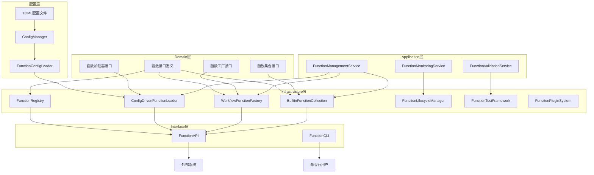

# Functions架构优化分析与建议

## 概述

本文档基于对Python实现中functions目录的分析和TypeScript新架构的评估，提出了针对函数系统的架构优化建议。这些建议旨在使TypeScript实现不仅具有与Python实现相同的功能完整性，还具有更好的现代化架构特性和扩展能力。

## 架构设计原则符合性评估

### TypeScript项目设计原则

根据`AGENTS.md`文档，TypeScript项目遵循以下设计原则：

1. **3层架构**：Domain + Application + Infrastructure + Interface
2. **严格依赖规则**：
   - Domain层不能依赖任何其他层
   - Infrastructure层只能依赖Domain层
   - Application层只能依赖Domain层
   - Interface层只能依赖Application层
3. **配置驱动架构**：使用TOML配置和环境变量注入
4. **依赖注入模式**：使用inversify进行依赖注入
5. **领域定义集中化**：所有领域定义必须放在Domain层

### 当前架构设计评估

**符合的方面**：
- ✅ 函数接口定义在Domain层
- ✅ 函数实现在Infrastructure层
- ✅ 使用依赖注入装饰器
- ✅ 基础抽象类减少重复代码

**需要改进的方面**：
- ❌ 缺乏配置驱动的函数加载机制
- ❌ 函数集合类缺失，不符合Python实现的便捷性
- ❌ 没有利用项目的配置系统
- ❌ 缺乏与现有依赖注入容器的集成

## 架构优化空间分析

### 1. 配置系统集成优化

当前项目已有完善的配置系统，支持TOML配置文件和环境变量注入。函数加载机制应该充分利用这一系统：

```toml
# configs/functions/__registry__.toml
[metadata]
name = "functions_registry"
version = "1.0.0"
description = "工作流函数注册表"

[function_types.condition]
class_path = "src.domain.workflow.functions.condition:IConditionFunction"
description = "条件函数类型"
enabled = true
config_directory = "conditions"
config_files = [
    "has-tool-calls.toml",
    "has-errors.toml",
    "no-tool-calls.toml"
]

[function_types.node]
class_path = "src.domain.workflow.functions.node:INodeFunction"
description = "节点函数类型"
enabled = true
config_directory = "nodes"
config_files = [
    "llm-node.toml",
    "tool-call-node.toml"
]

[function_types.routing]
class_path = "src.domain.workflow.functions.routing:IRoutingFunction"
description = "路由函数类型"
enabled = true
config_directory = "routing"
config_files = [
    "has-tool-calls-routing.toml"
]

[function_types.trigger]
class_path = "src.domain.workflow.functions.trigger:ITriggerFunction"
description = "触发器函数类型"
enabled = true
config_directory = "triggers"
config_files = [
    "time-trigger.toml"
]
```

### 2. 依赖注入容器集成优化

当前项目使用自定义的分层容器系统，函数加载机制应该与这一系统集成：

```typescript
// src/infrastructure/container/bindings/function-bindings.ts
export class FunctionServiceBindings extends ServiceBindings {
  registerServices(container: IContainer, config: ContainerConfiguration): void {
    // 注册函数注册表
    container.register('FunctionRegistry', FunctionRegistry, ServiceLifetime.Singleton);
    
    // 注册函数加载器
    container.register('FunctionLoader', WorkflowFunctionLoader, ServiceLifetime.Singleton);
    
    // 注册函数集合
    container.register('FunctionCollection', BuiltinFunctionCollection, ServiceLifetime.Singleton);
    
    // 注册函数工厂
    container.register('FunctionFactory', WorkflowFunctionFactory, ServiceLifetime.Singleton);
  }
}
```

### 3. 应用层服务协调优化

应该在Application层添加函数管理服务，协调函数的加载、注册和使用：

```typescript
// src/application/workflow/services/function-management-service.ts
@injectable()
export class FunctionManagementService {
  constructor(
    @inject('FunctionLoader') private readonly functionLoader: IWorkflowFunctionLoader,
    @inject('FunctionRegistry') private readonly functionRegistry: FunctionRegistry,
    @inject('FunctionFactory') private readonly functionFactory: IWorkflowFunctionFactory,
    @inject('Logger') private readonly logger: ILogger
  ) {}

  async initializeFunctions(): Promise<void> {
    this.logger.info('正在初始化工作流函数...');
    
    // 加载所有函数
    const functions = await this.functionLoader.loadFunctions();
    
    this.logger.info(`成功加载 ${functions.length} 个工作流函数`);
  }

  async getFunction(functionId: string): Promise<IWorkflowFunction | null> {
    return await this.functionLoader.loadFunctionById(functionId);
  }

  async createFunctionInstance(functionId: string, config?: any): Promise<IWorkflowFunction> {
    return this.functionFactory.createFunction(functionId, config);
  }
}
```

## 架构优化建议

### 1. 采用配置驱动的函数加载机制

**优化点**：
- 利用项目现有的配置系统
- 支持动态启用/禁用函数
- 支持自定义函数配置
- 与环境变量注入集成

**实现方案**：
```typescript
// src/infrastructure/workflow/functions/loaders/config-driven-function-loader.ts
@injectable()
export class ConfigDrivenFunctionLoader implements IWorkflowFunctionLoader {
  constructor(
    @inject('ConfigManager') private readonly configManager: IConfigManager,
    @inject('FunctionRegistry') private readonly registry: FunctionRegistry,
    @inject('Logger') private readonly logger: ILogger
  ) {}

  async loadFunctions(type?: WorkflowFunctionType): Promise<IWorkflowFunction[]> {
    // 从配置加载函数定义
    const functionConfigs = await this.configManager.getConfig('functions');
    
    // 根据配置动态加载函数
    for (const [functionType, config] of Object.entries(functionConfigs)) {
      if (config.enabled) {
        await this.loadFunctionType(functionType, config);
      }
    }
    
    return this.registry.getAllFunctions();
  }
}
```

### 2. 实现函数生命周期管理

**优化点**：
- 支持函数的初始化和清理
- 支持函数的热重载
- 支持函数的版本管理
- 支持函数的依赖管理

**实现方案**：
```typescript
// src/infrastructure/workflow/functions/lifecycle/function-lifecycle-manager.ts
@injectable()
export class FunctionLifecycleManager {
  private functionInstances: Map<string, IWorkflowFunction> = new Map();
  
  async initializeFunction(functionId: string, config?: any): Promise<IWorkflowFunction> {
    // 检查是否已初始化
    if (this.functionInstances.has(functionId)) {
      return this.functionInstances.get(functionId)!;
    }
    
    // 创建新实例
    const functionInstance = await this.createFunctionInstance(functionId, config);
    
    // 初始化函数
    await functionInstance.initialize(config);
    
    // 缓存实例
    this.functionInstances.set(functionId, functionInstance);
    
    return functionInstance;
  }
  
  async cleanupFunction(functionId: string): Promise<void> {
    const functionInstance = this.functionInstances.get(functionId);
    if (functionInstance) {
      await functionInstance.cleanup();
      this.functionInstances.delete(functionId);
    }
  }
}
```

### 3. 增强函数元数据管理

**优化点**：
- 支持函数的标签和分类
- 支持函数的依赖关系
- 支持函数的使用统计
- 支持函数的性能监控

**实现方案**：
```typescript
// src/domain/workflow/functions/function-metadata.ts
export interface EnhancedFunctionMetadata extends FunctionMetadata {
  category: string;
  tags: string[];
  dependencies?: string[];
  examples?: FunctionExample[];
  performance?: FunctionPerformanceMetrics;
  usage?: FunctionUsageStatistics;
}

export interface FunctionPerformanceMetrics {
  averageExecutionTime: number;
  maxExecutionTime: number;
  minExecutionTime: number;
  successRate: number;
  totalExecutions: number;
}

export interface FunctionUsageStatistics {
  lastUsed: Date;
  usageCount: number;
  popularWorkflows: string[];
}
```

### 4. 实现函数验证和测试框架

**优化点**：
- 支持函数的单元测试
- 支持函数的集成测试
- 支持函数的性能测试
- 支持函数的兼容性测试

**实现方案**：
```typescript
// src/infrastructure/workflow/functions/testing/function-test-framework.ts
@injectable()
export class FunctionTestFramework {
  async validateFunction(function: IWorkflowFunction): Promise<ValidationResult> {
    const errors: string[] = [];
    
    // 验证元数据
    const metadata = function.getMetadata();
    if (!metadata.id || !metadata.name) {
      errors.push('函数必须包含有效的ID和名称');
    }
    
    // 验证参数
    const parameters = function.getParameters();
    if (!parameters || parameters.length === 0) {
      errors.push('函数必须定义至少一个参数');
    }
    
    // 验证配置
    const configValidation = function.validateConfig({});
    if (!configValidation.valid) {
      errors.push(...configValidation.errors);
    }
    
    return {
      valid: errors.length === 0,
      errors
    };
  }
  
  async testFunction(function: IWorkflowFunction, testCases: FunctionTestCase[]): Promise<TestResult[]> {
    const results: TestResult[] = [];
    
    for (const testCase of testCases) {
      try {
        const result = await this.executeFunctionTest(function, testCase);
        results.push(result);
      } catch (error) {
        results.push({
          testCase: testCase.name,
          passed: false,
          error: error instanceof Error ? error.message : String(error)
        });
      }
    }
    
    return results;
  }
}
```

### 5. 优化函数执行上下文

**优化点**：
- 提供更丰富的上下文信息
- 支持上下文的持久化和恢复
- 支持上下文的监控和调试
- 支持上下文的版本控制

**实现方案**：
```typescript
// src/domain/workflow/execution/enhanced-execution-context.ts
export interface EnhancedExecutionContext extends ExecutionContext {
  // 函数执行信息
  getCurrentFunction(): IWorkflowFunction;
  getExecutionHistory(): FunctionExecutionRecord[];
  
  // 性能监控
  startPerformanceTimer(): void;
  endPerformanceTimer(): number;
  
  // 调试支持
  setDebugMode(enabled: boolean): void;
  logExecution(message: string, data?: any): void;
  
  // 错误处理
  setErrorHandler(handler: ErrorHandler): void;
  getLastError(): Error | null;
}
```

### 6. 实现函数插件系统

**优化点**：
- 支持函数的动态扩展
- 支持函数的插件化开发
- 支持函数的市场化分发
- 支持函数的版本管理

**实现方案**：
```typescript
// src/infrastructure/workflow/functions/plugins/function-plugin-system.ts
@injectable()
export class FunctionPluginSystem {
  private plugins: Map<string, FunctionPlugin> = new Map();
  
  async loadPlugin(pluginPath: string): Promise<void> {
    const plugin = await this.importPlugin(pluginPath);
    
    // 验证插件
    const validation = await this.validatePlugin(plugin);
    if (!validation.valid) {
      throw new Error(`插件验证失败: ${validation.errors.join(', ')}`);
    }
    
    // 注册插件
    this.plugins.set(plugin.id, plugin);
    
    // 注册插件提供的函数
    for (const functionDefinition of plugin.functions) {
      await this.registerPluginFunction(functionDefinition);
    }
  }
  
  async unloadPlugin(pluginId: string): Promise<void> {
    const plugin = this.plugins.get(pluginId);
    if (plugin) {
      // 注销插件提供的函数
      for (const functionDefinition of plugin.functions) {
        await this.unregisterPluginFunction(functionDefinition.id);
      }
      
      // 清理插件资源
      await plugin.cleanup();
      
      // 移除插件
      this.plugins.delete(pluginId);
    }
  }
}
```

## 优化后的架构设计



## 优化后的迁移计划

### 第一阶段：基础架构优化
1. 实现配置驱动的函数加载机制
2. 集成依赖注入容器
3. 实现函数生命周期管理
4. 补充缺失的函数实现

### 第二阶段：功能增强
1. 增强函数元数据管理
2. 实现函数验证和测试框架
3. 优化函数执行上下文
4. 实现函数集合类

### 第三阶段：高级特性
1. 实现函数插件系统
2. 添加函数性能监控
3. 实现函数热重载
4. 添加函数版本管理

### 第四阶段：集成和测试
1. 集成到应用服务
2. 编写完整的测试套件
3. 性能优化和调优
4. 文档和示例完善

## 具体实现建议

### 1. 配置文件结构

建议在`configs/functions/`目录下创建以下配置文件：

```
configs/functions/
├── __registry__.toml          # 函数注册表配置
├── conditions/
│   ├── has-tool-calls.toml    # 条件函数配置
│   ├── has-errors.toml
│   └── no-tool-calls.toml
├── nodes/
│   ├── llm-node.toml          # 节点函数配置
│   ├── tool-call-node.toml
│   └── data-transform-node.toml
├── routing/
│   └── has-tool-calls-routing.toml  # 路由函数配置
└── triggers/
    └── time-trigger.toml      # 触发器函数配置
```

### 2. 依赖注入配置

在`src/infrastructure/container/bindings/`目录下创建`function-bindings.ts`：

```typescript
export class FunctionServiceBindings extends ServiceBindings {
  registerServices(container: IContainer, config: ContainerConfiguration): void {
    // 函数核心服务
    container.register('FunctionRegistry', FunctionRegistry, ServiceLifetime.Singleton);
    container.register('FunctionLoader', ConfigDrivenFunctionLoader, ServiceLifetime.Singleton);
    container.register('FunctionFactory', WorkflowFunctionFactory, ServiceLifetime.Singleton);
    container.register('FunctionCollection', BuiltinFunctionCollection, ServiceLifetime.Singleton);
    
    // 函数生命周期管理
    container.register('FunctionLifecycleManager', FunctionLifecycleManager, ServiceLifetime.Singleton);
    
    // 函数测试和验证
    container.register('FunctionTestFramework', FunctionTestFramework, ServiceLifetime.Singleton);
    
    // 函数插件系统
    container.register('FunctionPluginSystem', FunctionPluginSystem, ServiceLifetime.Singleton);
  }
}
```

### 3. 应用层服务

在`src/application/workflow/services/`目录下创建以下服务：

```typescript
// function-management-service.ts - 函数管理服务
// function-validation-service.ts - 函数验证服务
// function-monitoring-service.ts - 函数监控服务
```

### 4. 接口层API

在`src/interfaces/workflow/`目录下创建以下API：

```typescript
// function-api.ts - 函数REST API
// function-cli.ts - 函数命令行接口
```

## 总结

通过以上优化，新的函数架构将具有以下优势：

1. **更好的可扩展性**：通过配置驱动和插件系统，支持动态扩展
2. **更好的可维护性**：通过分层架构和依赖注入，降低耦合度
3. **更好的可测试性**：通过测试框架和模拟机制，提高测试覆盖率
4. **更好的可观测性**：通过监控和日志系统，提供完整的运行时信息
5. **更好的用户体验**：通过丰富的元数据和示例，提高开发效率

这些优化将使TypeScript实现不仅具有与Python实现相同的功能完整性，还具有更好的现代化架构特性和扩展能力。同时，这些建议充分考虑了TypeScript项目的设计原则和现有架构，确保了优化方案的可实施性和一致性。