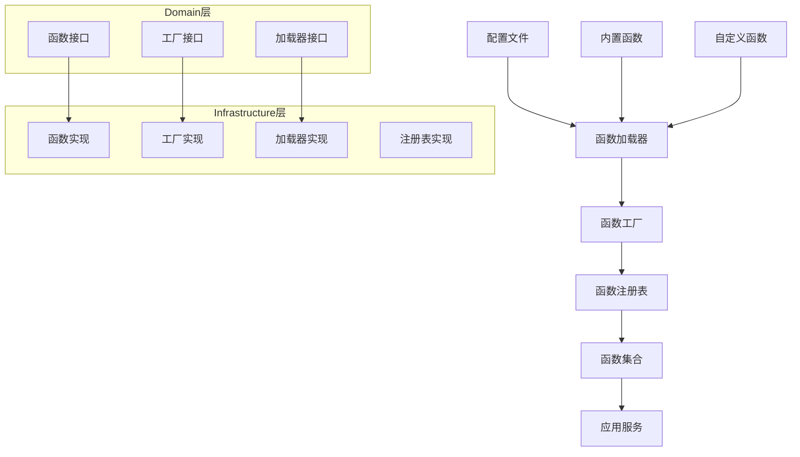

# Python Functions目录迁移到TypeScript新架构分析报告

## 概述

本文档分析了Python实现中`python-impl/src/core/workflow/graph/functions`目录的功能，并提供了如何将其迁移到新的TypeScript架构的详细方案。当前TypeScript实现在`src/infrastructure/workflow/functions`目录中硬编码了所有的function，本文档分析了如何改进这一设计，并评估了domain层是否需要补充相应的实现。

## 1. Python实现分析

### 1.1 目录结构

Python实现中的functions目录结构如下：

```
python-impl/src/core/workflow/graph/functions/
├── conditions/
│   ├── __init__.py
│   └── builtin.py
├── nodes/
│   ├── __init__.py
│   └── builtin.py
├── routing/
│   ├── __init__.py
│   └── builtin.py
└── triggers/
    ├── __init__.py
    └── builtin.py
```

### 1.2 功能特点

1. **统一的接口设计**：所有函数类型都实现了统一的`IFunction`接口，提供了元数据、生命周期管理和验证能力。

2. **分类管理**：按照功能类型分为conditions、nodes、routing和triggers四类。

3. **内置函数集合**：每个类型都有一个`BuiltinXxxFunctions`类，提供静态方法获取所有内置函数。

4. **完整的元数据支持**：每个函数都有详细的元数据，包括ID、名称、描述、版本、参数等。

5. **生命周期管理**：支持初始化和清理操作。

6. **配置验证**：支持配置和参数的验证。

### 1.3 具体函数实现

#### 条件函数 (Conditions)
- `HasToolCallsCondition`: 检查是否有工具调用
- `NoToolCallsCondition`: 检查是否没有工具调用
- `HasToolResultsCondition`: 检查是否有工具结果
- `HasErrorsCondition`: 检查是否有错误
- `MaxIterationsReachedCondition`: 检查是否达到最大迭代次数

#### 节点函数 (Nodes)
- `LLMNodeFunction`: 执行LLM推理
- `ToolCallNodeFunction`: 执行工具调用
- `ConditionCheckNodeFunction`: 执行条件检查
- `DataTransformNodeFunction`: 执行数据转换

#### 路由函数 (Routing)
- `HasToolCallsRouteFunction`: 基于工具调用状态的路由
- `NoToolCallsRouteFunction`: 基于无工具调用状态的路由
- `HasToolResultsRouteFunction`: 基于工具结果状态的路由
- `MaxIterationsReachedRouteFunction`: 基于迭代次数的路由
- `HasErrorsRouteFunction`: 基于错误状态的路由

#### 触发器函数 (Triggers)
- `TimeTriggerFunction`: 基于时间条件的触发器
- `StateTriggerFunction`: 基于状态条件的触发器
- `EventTriggerFunction`: 基于事件类型的触发器
- `ToolErrorTriggerFunction`: 基于工具错误数量的触发器
- `IterationLimitTriggerFunction`: 基于迭代次数限制的触发器

## 2. TypeScript实现分析

### 2.1 目录结构

TypeScript实现中的functions目录结构如下：

```
src/infrastructure/workflow/functions/
├── base/
│   └── base-workflow-function.ts
├── builtin/
│   ├── conditions/
│   │   ├── has-errors.function.ts
│   │   └── has-tool-calls.function.ts
│   ├── nodes/
│   │   └── llm-node.function.ts
│   ├── routing/
│   │   └── has-tool-calls-routing.function.ts
│   ├── triggers/
│   │   └── time-trigger.function.ts
│   └── index.ts
├── registry/
│   └── function-registry.ts
└── index.ts
```

### 2.2 功能特点

1. **基础抽象类**：提供了`BaseWorkflowFunction`抽象类，减少重复代码。

2. **依赖注入**：使用`@injectable()`装饰器支持依赖注入。

3. **注册表模式**：实现了`FunctionRegistry`类，用于管理函数的注册和查询。

4. **类型安全**：使用TypeScript的类型系统提供更好的类型安全。

5. **模块化导出**：通过index.ts文件统一导出所有函数。

### 2.3 当前实现的不足

1. **硬编码问题**：所有函数都是硬编码在builtin目录下，缺乏动态加载机制。

2. **函数集合缺失**：缺少类似Python中的`BuiltinXxxFunctions`类，无法方便地获取所有同类型函数。

3. **加载机制不完善**：没有自动发现和加载函数的机制。

4. **配置驱动不足**：缺乏基于配置的函数加载和注册机制。

## 3. 差异对比分析

### 3.1 架构设计差异

| 方面 | Python实现 | TypeScript实现 |
|------|------------|----------------|
| 接口设计 | 统一的IFunction接口 | 分类型的IWorkflowFunction接口 |
| 生命周期管理 | 完整的initialize/cleanup | 基础的initialize/cleanup |
| 元数据管理 | FunctionMetadata类 | FunctionMetadata接口 |
| 函数集合 | BuiltinXxxFunctions静态类 | 缺失 |
| 注册机制 | IFunctionRegistry接口 | FunctionRegistry实现类 |
| 加载方式 | 静态导入 | 硬编码导入 |

### 3.2 功能完整性差异

1. **Python实现更完整**：包含了所有类型的函数实现，而TypeScript实现只实现了部分函数。

2. **元数据支持**：Python实现提供了更丰富的元数据支持。

3. **验证机制**：Python实现有更完善的配置和参数验证机制。

4. **函数集合**：Python实现提供了便捷的函数集合类，TypeScript实现缺失。

## 4. 需要迁移的功能和组件

### 4.1 缺失的函数实现

1. **条件函数**：
   - `NoToolCallsConditionFunction`
   - `HasToolResultsConditionFunction`
   - `MaxIterationsReachedConditionFunction`

2. **节点函数**：
   - `ToolCallNodeFunction`
   - `ConditionCheckNodeFunction`
   - `DataTransformNodeFunction`

3. **路由函数**：
   - `NoToolCallsRoutingFunction`
   - `HasToolResultsRoutingFunction`
   - `MaxIterationsReachedRoutingFunction`
   - `HasErrorsRoutingFunction`

4. **触发器函数**：
   - `StateTriggerFunction`
   - `EventTriggerFunction`
   - `ToolErrorTriggerFunction`
   - `IterationLimitTriggerFunction`

### 4.2 缺失的组件

1. **函数集合类**：
   - `BuiltinConditionFunctions`
   - `BuiltinNodeFunctions`
   - `BuiltinRouteFunctions`
   - `BuiltinTriggerFunctions`

2. **函数加载器**：
   - 自动发现和加载函数的机制
   - 基于配置的函数加载

3. **函数工厂**：
   - 动态创建函数实例的工厂类

## 5. Domain层补充实现分析

### 5.1 当前Domain层实现

当前Domain层已经定义了基本的接口：

```typescript
// src/domain/workflow/interfaces/workflow-functions.ts
export interface IWorkflowFunction {
  readonly id: string;
  readonly name: string;
  readonly description: string;
  readonly version: string;
  readonly type: WorkflowFunctionType;
  readonly isAsync: boolean;
  
  getParameters(): FunctionParameter[];
  getReturnType(): string;
  validateConfig(config: any): ValidationResult;
  getMetadata(): FunctionMetadata;
  initialize(config?: any): boolean;
  cleanup(): boolean;
}

export interface IConditionFunction extends IWorkflowFunction {
  evaluate(context: any, config: any): Promise<boolean>;
}

export interface INodeFunction extends IWorkflowFunction {
  execute(context: any, config: any): Promise<any>;
}

export interface IRoutingFunction extends IWorkflowFunction {
  route(context: any, config: any): Promise<string | string[]>;
}

export interface ITriggerFunction extends IWorkflowFunction {
  check(context: any, config: any): Promise<boolean>;
}
```

### 5.2 需要补充的Domain层实现

1. **函数工厂接口**：
```typescript
export interface IWorkflowFunctionFactory {
  createFunction(functionId: string, config?: any): IWorkflowFunction;
  createConditionFunction(name: string, config?: any): IConditionFunction;
  createNodeFunction(name: string, config?: any): INodeFunction;
  createRoutingFunction(name: string, config?: any): IRoutingFunction;
  createTriggerFunction(name: string, config?: any): ITriggerFunction;
}
```

2. **函数加载器接口**：
```typescript
export interface IWorkflowFunctionLoader {
  loadFunctions(type?: WorkflowFunctionType): Promise<IWorkflowFunction[]>;
  loadFunctionById(functionId: string): Promise<IWorkflowFunction | null>;
  loadFunctionByName(name: string): Promise<IWorkflowFunction | null>;
}
```

3. **函数集合接口**：
```typescript
export interface IWorkflowFunctionCollection {
  getConditionFunctions(): IConditionFunction[];
  getNodeFunctions(): INodeFunction[];
  getRoutingFunctions(): IRoutingFunction[];
  getTriggerFunctions(): ITriggerFunction[];
  getFunctionByName(name: string): IWorkflowFunction | null;
}
```

4. **函数元数据增强**：
```typescript
export interface EnhancedFunctionMetadata extends FunctionMetadata {
  category: string;
  tags: string[];
  dependencies?: string[];
  examples?: FunctionExample[];
}

export interface FunctionExample {
  name: string;
  description: string;
  config: any;
  expectedResult: any;
}
```

## 6. 函数加载和注册机制设计

### 6.1 整体架构



### 6.2 函数加载器实现

```typescript
// src/infrastructure/workflow/functions/loaders/workflow-function-loader.ts
import { injectable, inject } from 'inversify';
import { 
    IWorkflowFunctionLoader,
    IWorkflowFunction,
    WorkflowFunctionType,
    ILogger 
} from '../../../../domain/workflow/interfaces/workflow-functions';
import { FunctionRegistry } from '../registry/function-registry';

@injectable()
export class WorkflowFunctionLoader implements IWorkflowFunctionLoader {
    constructor(
        @inject('FunctionRegistry') private readonly registry: FunctionRegistry,
        @inject('Logger') private readonly logger: ILogger
    ) {}

    async loadFunctions(type?: WorkflowFunctionType): Promise<IWorkflowFunction[]> {
        // 加载内置函数
        await this.loadBuiltinFunctions();
        
        // 加载自定义函数
        await this.loadCustomFunctions();
        
        // 根据类型过滤
        if (type) {
            return this.registry.getFunctionsByType(type);
        }
        
        return this.registry.getAllFunctions();
    }

    async loadFunctionById(functionId: string): Promise<IWorkflowFunction | null> {
        // 确保函数已加载
        await this.loadFunctions();
        return this.registry.getFunction(functionId);
    }

    async loadFunctionByName(name: string): Promise<IWorkflowFunction | null> {
        // 确保函数已加载
        await this.loadFunctions();
        return this.registry.getFunctionByName(name);
    }

    private async loadBuiltinFunctions(): Promise<void> {
        // 动态导入并注册所有内置函数
        const conditionFunctions = await import('../builtin/conditions');
        const nodeFunctions = await import('../builtin/nodes');
        const routingFunctions = await import('../builtin/routing');
        const triggerFunctions = await import('../builtin/triggers');

        // 注册条件函数
        Object.values(conditionFunctions).forEach(func => {
            if (this.isWorkflowFunction(func)) {
                this.registry.registerFunction(new func());
            }
        });

        // 注册节点函数
        Object.values(nodeFunctions).forEach(func => {
            if (this.isWorkflowFunction(func)) {
                this.registry.registerFunction(new func());
            }
        });

        // 注册路由函数
        Object.values(routingFunctions).forEach(func => {
            if (this.isWorkflowFunction(func)) {
                this.registry.registerFunction(new func());
            }
        });

        // 注册触发器函数
        Object.values(triggerFunctions).forEach(func => {
            if (this.isWorkflowFunction(func)) {
                this.registry.registerFunction(new func());
            }
        });
    }

    private async loadCustomFunctions(): Promise<void> {
        // 从配置文件加载自定义函数
        // 实现自定义函数的动态加载逻辑
    }

    private isWorkflowFunction(obj: any): obj is IWorkflowFunction {
        return obj && typeof obj === 'function' && 
               obj.prototype instanceof BaseWorkflowFunction;
    }
}
```

### 6.3 函数集合实现

```typescript
// src/infrastructure/workflow/functions/collections/builtin-function-collection.ts
import { injectable, inject } from 'inversify';
import { 
    IWorkflowFunctionCollection,
    IConditionFunction,
    INodeFunction,
    IRoutingFunction,
    ITriggerFunction,
    IWorkflowFunction,
    WorkflowFunctionType
} from '../../../../domain/workflow/interfaces/workflow-functions';
import { FunctionRegistry } from '../registry/function-registry';

@injectable()
export class BuiltinFunctionCollection implements IWorkflowFunctionCollection {
    constructor(
        @inject('FunctionRegistry') private readonly registry: FunctionRegistry
    ) {}

    getConditionFunctions(): IConditionFunction[] {
        return this.registry.getFunctionsByType(WorkflowFunctionType.CONDITION) as IConditionFunction[];
    }

    getNodeFunctions(): INodeFunction[] {
        return this.registry.getFunctionsByType(WorkflowFunctionType.NODE) as INodeFunction[];
    }

    getRoutingFunctions(): IRoutingFunction[] {
        return this.registry.getFunctionsByType(WorkflowFunctionType.ROUTING) as IRoutingFunction[];
    }

    getTriggerFunctions(): ITriggerFunction[] {
        return this.registry.getFunctionsByType(WorkflowFunctionType.TRIGGER) as ITriggerFunction[];
    }

    getFunctionByName(name: string): IWorkflowFunction | null {
        return this.registry.getFunctionByName(name);
    }

    // 便捷方法，类似Python实现
    getAllConditionFunctions(): IConditionFunction[] {
        return this.getConditionFunctions();
    }

    getAllNodeFunctions(): INodeFunction[] {
        return this.getNodeFunctions();
    }

    getAllRoutingFunctions(): IRoutingFunction[] {
        return this.getRoutingFunctions();
    }

    getAllTriggerFunctions(): ITriggerFunction[] {
        return this.getTriggerFunctions();
    }
}
```

### 6.4 函数工厂实现

```typescript
// src/infrastructure/workflow/functions/factories/workflow-function-factory.ts
import { injectable, inject } from 'inversify';
import { 
    IWorkflowFunctionFactory,
    IWorkflowFunction,
    IConditionFunction,
    INodeFunction,
    IRoutingFunction,
    ITriggerFunction,
    WorkflowFunctionType
} from '../../../../domain/workflow/interfaces/workflow-functions';
import { FunctionRegistry } from '../registry/function-registry';

@injectable()
export class WorkflowFunctionFactory implements IWorkflowFunctionFactory {
    constructor(
        @inject('FunctionRegistry') private readonly registry: FunctionRegistry
    ) {}

    createFunction(functionId: string, config?: any): IWorkflowFunction {
        const func = this.registry.getFunction(functionId);
        if (!func) {
            throw new Error(`函数不存在: ${functionId}`);
        }
        
        // 创建新实例
        const instance = this.createInstance(func.constructor);
        if (config) {
            instance.initialize(config);
        }
        
        return instance;
    }

    createConditionFunction(name: string, config?: any): IConditionFunction {
        const func = this.registry.getConditionFunction(name);
        if (!func) {
            throw new Error(`条件函数不存在: ${name}`);
        }
        
        const instance = this.createInstance(func.constructor) as IConditionFunction;
        if (config) {
            instance.initialize(config);
        }
        
        return instance;
    }

    createNodeFunction(name: string, config?: any): INodeFunction {
        const func = this.registry.getNodeFunction(name);
        if (!func) {
            throw new Error(`节点函数不存在: ${name}`);
        }
        
        const instance = this.createInstance(func.constructor) as INodeFunction;
        if (config) {
            instance.initialize(config);
        }
        
        return instance;
    }

    createRoutingFunction(name: string, config?: any): IRoutingFunction {
        const func = this.registry.getRoutingFunction(name);
        if (!func) {
            throw new Error(`路由函数不存在: ${name}`);
        }
        
        const instance = this.createInstance(func.constructor) as IRoutingFunction;
        if (config) {
            instance.initialize(config);
        }
        
        return instance;
    }

    createTriggerFunction(name: string, config?: any): ITriggerFunction {
        const func = this.registry.getTriggerFunction(name);
        if (!func) {
            throw new Error(`触发器函数不存在: ${name}`);
        }
        
        const instance = this.createInstance(func.constructor) as ITriggerFunction;
        if (config) {
            instance.initialize(config);
        }
        
        return instance;
    }

    private createInstance(constructor: any): IWorkflowFunction {
        return new constructor();
    }
}
```

## 7. 迁移计划

### 7.1 第一阶段：补充缺失的函数实现

1. **实现缺失的条件函数**：
   - `NoToolCallsConditionFunction`
   - `HasToolResultsConditionFunction`
   - `MaxIterationsReachedConditionFunction`

2. **实现缺失的节点函数**：
   - `ToolCallNodeFunction`
   - `ConditionCheckNodeFunction`
   - `DataTransformNodeFunction`

3. **实现缺失的路由函数**：
   - `NoToolCallsRoutingFunction`
   - `HasToolResultsRoutingFunction`
   - `MaxIterationsReachedRoutingFunction`
   - `HasErrorsRoutingFunction`

4. **实现缺失的触发器函数**：
   - `StateTriggerFunction`
   - `EventTriggerFunction`
   - `ToolErrorTriggerFunction`
   - `IterationLimitTriggerFunction`

### 7.2 第二阶段：完善Domain层接口

1. **添加函数工厂接口**：
   - `IWorkflowFunctionFactory`

2. **添加函数加载器接口**：
   - `IWorkflowFunctionLoader`

3. **添加函数集合接口**：
   - `IWorkflowFunctionCollection`

4. **增强函数元数据**：
   - `EnhancedFunctionMetadata`
   - `FunctionExample`

### 7.3 第三阶段：实现加载和注册机制

1. **实现函数加载器**：
   - `WorkflowFunctionLoader`

2. **实现函数集合**：
   - `BuiltinFunctionCollection`

3. **实现函数工厂**：
   - `WorkflowFunctionFactory`

4. **完善注册表功能**：
   - 增强现有的`FunctionRegistry`

### 7.4 第四阶段：集成和测试

1. **集成到应用服务**：
   - 修改`WorkflowService`使用新的加载机制

2. **添加配置支持**：
   - 支持通过配置文件加载自定义函数

3. **编写单元测试**：
   - 为所有新组件编写测试

4. **编写集成测试**：
   - 测试整个函数加载和执行流程

## 8. 配置驱动的函数加载

### 8.1 配置文件结构

```toml
[functions.builtin]
enabled = true
auto_load = true

[functions.custom]
enabled = true
directory = "./custom-functions"

[functions.custom.condition_check]
file = "./custom-functions/condition-check.js"
name = "custom_condition_check"
type = "condition"
description = "自定义条件检查函数"

[functions.custom.data_transform]
file = "./custom-functions/data-transform.js"
name = "custom_data_transform"
type = "node"
description = "自定义数据转换函数"
```

### 8.2 配置加载器实现

```typescript
// src/infrastructure/workflow/functions/loaders/config-function-loader.ts
import { injectable, inject } from 'inversify';
import { IWorkflowFunctionLoader, IWorkflowFunction } from '../../../../domain/workflow/interfaces/workflow-functions';
import { IConfigLoader } from '../../../config/loading/types';
import { FunctionRegistry } from '../registry/function-registry';

@injectable()
export class ConfigFunctionLoader implements IWorkflowFunctionLoader {
    constructor(
        @inject('ConfigLoader') private readonly configLoader: IConfigLoader,
        @inject('FunctionRegistry') private readonly registry: FunctionRegistry
    ) {}

    async loadFunctions(type?: WorkflowFunctionType): Promise<IWorkflowFunction[]> {
        const config = await this.configLoader.loadConfig('functions');
        
        // 加载内置函数
        if (config.builtin?.enabled) {
            await this.loadBuiltinFunctions();
        }
        
        // 加载自定义函数
        if (config.custom?.enabled) {
            await this.loadCustomFunctions(config.custom);
        }
        
        // 根据类型过滤
        if (type) {
            return this.registry.getFunctionsByType(type);
        }
        
        return this.registry.getAllFunctions();
    }

    private async loadCustomFunctions(config: any): Promise<void> {
        // 实现基于配置的自定义函数加载
    }
}
```

## 9. 总结

通过以上分析，我们可以看出Python实现中的functions目录具有更完整的功能和更灵活的设计。为了将Python实现迁移到TypeScript新架构，我们需要：

1. **补充缺失的函数实现**：实现所有Python中存在但TypeScript中缺失的函数。

2. **完善Domain层接口**：添加函数工厂、加载器和集合等接口。

3. **实现动态加载机制**：替代当前硬编码的方式，支持动态加载和注册。

4. **添加配置驱动支持**：支持通过配置文件加载和管理函数。

5. **保持架构一致性**：确保新的实现符合TypeScript项目的分层架构原则。

这样的迁移将使TypeScript实现具有与Python实现相同的功能完整性和灵活性，同时保持TypeScript的类型安全和现代化架构优势。