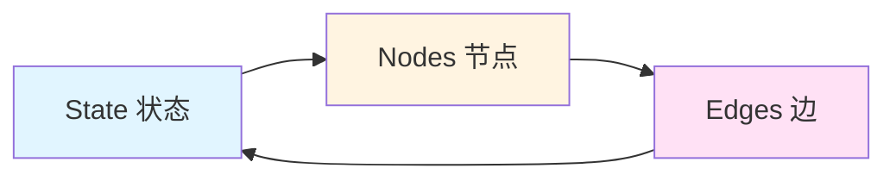
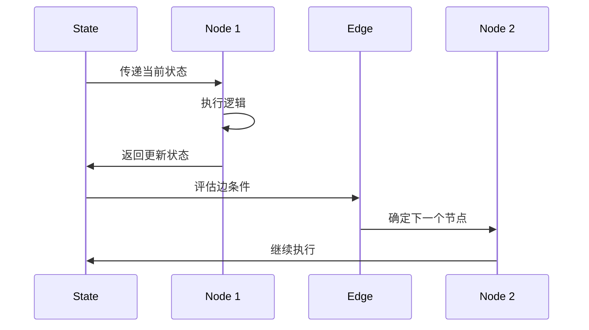
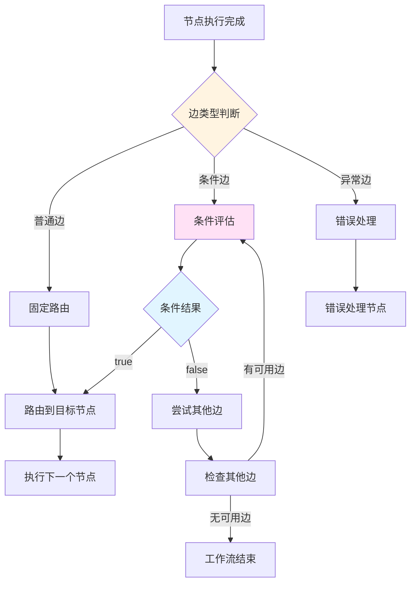
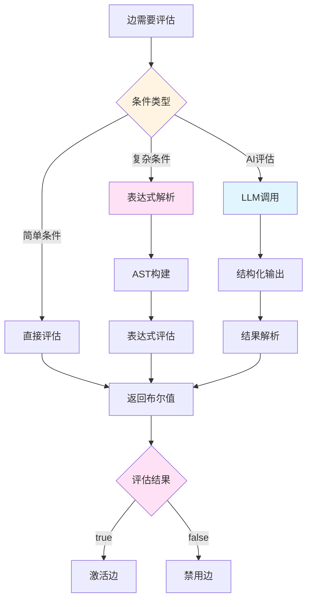
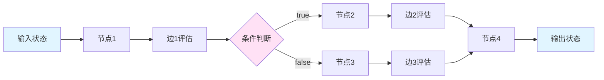

# 图工作流实现思路分析

## 概述

本文档基于对主流图工作流框架（LangGraph、Temporal、n8n）的深入研究，结合当前项目的架构设计，总结了基于节点和边的图工作流实现思路、路由控制机制、条件评估逻辑和数据结构设计。

## 一、图工作流核心概念

### 1.1 基本组成要素

图工作流由三个核心组件构成：



#### State（状态）
- **定义**：共享的数据结构，表示应用程序的当前快照
- **作用**：在节点之间传递数据，维护工作流的执行上下文
- **特性**：
  - 不可变性：每次节点执行返回新的状态
  - 可组合性：支持复杂的状态结构
  - 持久化：支持检查点和恢复

#### Nodes（节点）
- **定义**：执行具体业务逻辑的函数或对象
- **职责**：
  - 接收当前状态作为输入
  - 执行计算或副作用
  - 返回更新后的状态
- **类型**：
  - 执行节点：执行具体任务（LLM调用、工具执行等）
  - 控制流节点：控制流程走向（条件判断、循环等）
  - 数据转换节点：处理和转换数据

#### Edges（边）
- **定义**：确定下一个要执行的节点
- **类型**：
  - 普通边：固定的节点转换
  - 条件边：基于状态动态选择下一个节点
  - 异常边：处理错误和异常情况
- **职责**：
  - 定义节点之间的连接关系
  - 控制执行流程
  - 实现条件分支和循环

### 1.2 执行模型



## 二、节点和边的路由控制机制

### 2.1 路由控制模式

#### 模式一：条件边路由（Conditional Edges）

**实现思路**：
- 在节点执行后，根据状态动态选择下一个节点
- 路由函数接收状态，返回目标节点ID
- 支持多分支路由

**示例代码**（基于 LangGraph）：
```typescript
// 路由函数
function routeDecision(state: typeof StateAnnotation.State) {
  if (state.decision === "story") {
    return "llmCall1";
  } else if (state.decision === "joke") {
    return "llmCall2";
  } else if (state.decision === "poem") {
    return "llmCall3";
  }
}

// 构建工作流
const workflow = new StateGraph(StateAnnotation)
  .addNode("llmCall1", llmCall1)
  .addNode("llmCall2", llmCall2)
  .addNode("llmCall3", llmCall3)
  .addNode("router", routerNode)
  .addEdge("__start__", "router")
  .addConditionalEdges("router", routeDecision, ["llmCall1", "llmCall2", "llmCall3"])
  .compile();
```

**当前项目实现**：
```typescript
// src/domain/workflow/value-objects/edge/edge-value-object.ts
export class EdgeValueObject extends ValueObject<EdgeValueObjectProps> {
  // 检查是否需要条件评估
  public requiresConditionEvaluation(): boolean {
    return this.props.type.requiresConditionEvaluation();
  }
  
  // 过滤上下文
  public filterContext(context: PromptContext): PromptContext {
    return this.props.contextFilter.applyFilter(context);
  }
}
```

#### 模式二：基于状态的路由

**实现思路**：
- 路由决策基于状态的特定字段
- 支持复杂的条件表达式
- 可以组合多个条件

**示例代码**：
```typescript
// 基于工具调用结果的路由
const routeMessage = (state: typeof StateAnnotation.State) => {
  const { messages } = state;
  const lastMessage = messages[messages.length - 1] as AIMessage;
  
  if (!lastMessage?.tool_calls?.length) {
    return END; // 没有工具调用，结束
  }
  return "tools"; // 有工具调用，继续执行工具节点
};
```

#### 模式三：多路分支路由（Switch）

**实现思路**：
- 支持多个输出路径
- 每个路径有独立的条件
- 类似编程语言中的 switch-case

**示例代码**（基于 n8n）：
```json
{
  "name": "Switch",
  "type": "n8n-nodes-base.switch",
  "parameters": {
    "mode": "rules",
    "rules": [
      {
        "conditions": {
          "string": [
            {"value1": "={{$json.status}}", "value2": "success"}
          ]
        },
        "output": "success"
      },
      {
        "conditions": {
          "string": [
            {"value1": "={{$json.status}}", "value2": "error"}
          ]
        },
        "output": "error"
      }
    ]
  }
}
```

### 2.2 路由控制架构



### 2.3 当前项目的路由控制实现

**优势**：
1. **类型安全**：使用 TypeScript 类型系统确保路由决策的正确性
2. **上下文过滤**：支持边级别的上下文过滤
3. **多种边类型**：支持普通边、条件边、异常边、异步边等
4. **配置驱动**：通过配置文件定义路由逻辑

**改进建议**：
1. 引入通用的条件路由器，避免硬编码
2. 支持表达式评估，实现更灵活的条件判断
3. 增强路由决策的可视化和调试能力

## 三、条件评估逻辑的实现方式

### 3.1 条件评估模式

#### 模式一：纯函数评估

**特点**：
- 条件函数只返回布尔值
- 不包含路由逻辑
- 高度可复用

**示例代码**：
```typescript
// 纯粹的条件评估函数
async function hasErrors(state: State): Promise<boolean> {
  return state.errors && state.errors.length > 0;
}

async function hasToolCalls(state: State): Promise<boolean> {
  const lastMessage = state.messages[state.messages.length - 1];
  return lastMessage?.tool_calls?.length > 0;
}
```

#### 模式二：结构化输出评估

**特点**：
- 使用 LLM 生成结构化输出
- 支持复杂的语义判断
- 适用于需要 AI 决策的场景

**示例代码**（基于 LangGraph）：
```typescript
// 定义评估结果的 Schema
const feedbackSchema = z.object({
  grade: z.enum(["funny", "not funny"]).describe(
    "Decide if the joke is funny or not."
  ),
  feedback: z.string().describe(
    "If the joke is not funny, provide feedback on how to improve it."
  ),
});

// 使用 LLM 进行评估
const evaluator = llm.withStructuredOutput(feedbackSchema);
const grade = await evaluator.invoke(`Grade the joke ${state.joke}`);

// 基于评估结果进行路由
if (grade.grade === "funny") {
  return "Accepted";
} else {
  return "Rejected + Feedback";
}
```

#### 模式三：表达式评估

**特点**：
- 支持复杂的布尔表达式
- 可以引用状态中的任意字段
- 支持逻辑运算符（AND、OR、NOT）

**示例代码**：
```typescript
// 表达式评估器
class ExpressionEvaluator {
  evaluate(expression: string, context: Record<string, any>): boolean {
    // 解析表达式
    const ast = this.parse(expression);
    // 评估表达式
    return this.evaluateAST(ast, context);
  }
}

// 使用示例
const evaluator = new ExpressionEvaluator();
const result = evaluator.evaluate(
  "state.errors.length > 0 && state.retryCount < 3",
  { state: { errors: [{ message: "error" }], retryCount: 2 } }
);
```

### 3.2 条件评估架构



### 3.3 当前项目的条件评估实现

**现有实现**：
- [`EdgeValueObject`](src/domain/workflow/value-objects/edge/edge-value-object.ts:26) 支持条件表达式
- [`EdgeContextFilter`](src/domain/workflow/value-objects/context/edge-context-filter.ts) 支持上下文过滤
- 条件函数模块提供可复用的条件评估逻辑

**改进建议**：
1. 实现表达式评估器，支持复杂的条件表达式
2. 集成 LLM 评估能力，支持语义级别的条件判断
3. 提供条件评估的可视化调试工具

## 四、图工作流数据结构设计

### 4.1 状态管理设计

#### 设计原则
1. **不可变性**：状态更新返回新的状态对象
2. **可组合性**：支持复杂的状态结构
3. **类型安全**：使用 TypeScript 类型系统确保类型安全
4. **持久化**：支持状态的序列化和反序列化

#### 状态结构示例

**LangGraph 风格**：
```typescript
import { Annotation } from "@langchain/langgraph";

const StateAnnotation = Annotation.Root({
  // 简单字段
  foo: Annotation<string>,
  
  // 带有 reducer 的字段
  bar: Annotation<string[]>({
    reducer: (a, b) => [...a, ...b],
    default: () => [],
  }),
  
  // 嵌套对象
  metadata: Annotation<Record<string, any>>({
    reducer: (a, b) => ({ ...a, ...b }),
    default: () => ({}),
  }),
});
```

**当前项目风格**：
```typescript
// src/domain/workflow/value-objects/workflow-state.ts
export class WorkflowState extends ValueObject<WorkflowStateProps> {
  // 状态字段
  public readonly variables: Map<string, any>;
  public readonly nodeResults: Map<string, any>;
  public readonly metadata: Record<string, any>;
  
  // 状态更新方法
  public updateVariable(key: string, value: any): WorkflowState {
    const newVariables = new Map(this.variables);
    newVariables.set(key, value);
    return new WorkflowState({
      ...this.props,
      variables: newVariables,
    });
  }
}
```

### 4.2 节点数据结构设计

#### 节点属性
```typescript
interface NodeProps {
  // 标识
  id: NodeId;
  type: NodeType;
  name?: string;
  description?: string;
  
  // 位置信息（用于可视化）
  position?: { x: number; y: number };
  
  // 配置属性
  properties: Record<string, any>;
  
  // 状态
  status: NodeStatus;
  
  // 时间戳
  createdAt: Timestamp;
  updatedAt: Timestamp;
  version: Version;
}
```

#### 节点类型分类
```typescript
enum NodeType {
  // 执行节点
  LLM = 'llm',
  TOOL = 'tool',
  CODE = 'code',
  
  // 控制流节点
  CONDITION = 'condition',
  LOOP = 'loop',
  PARALLEL = 'parallel',
  
  // 数据节点
  INPUT = 'input',
  OUTPUT = 'output',
  TRANSFORM = 'transform',
  
  // 特殊节点
  START = 'start',
  END = 'end',
  ERROR = 'error',
}
```

### 4.3 边数据结构设计

#### 边属性
```typescript
interface EdgeValueObjectProps {
  // 标识
  id: EdgeId;
  type: EdgeType;
  
  // 连接关系
  fromNodeId: NodeId;
  toNodeId: NodeId;
  
  // 条件表达式
  condition?: string;
  
  // 权重（用于多边选择）
  weight?: number;
  
  // 扩展属性
  properties: Record<string, unknown>;
  
  // 上下文过滤器
  contextFilter: EdgeContextFilter;
}
```

#### 边类型分类
```typescript
enum EdgeType {
  // 普通边
  SEQUENCE = 'sequence',
  
  // 条件边
  CONDITIONAL = 'conditional',
  
  // 异常边
  ERROR = 'error',
  TIMEOUT = 'timeout',
  
  // 异步边
  ASYNCHRONOUS = 'asynchronous',
  
  // 默认边
  DEFAULT = 'default',
}
```

### 4.4 工作流数据结构设计

#### 工作流定义
```typescript
interface WorkflowDefinition {
  // 基本信息
  id: string;
  name: string;
  description?: string;
  version: string;
  
  // 节点定义
  nodes: NodeDefinition[];
  
  // 边定义
  edges: EdgeDefinition[];
  
  // 状态定义
  stateSchema: StateSchema;
  
  // 配置
  config: WorkflowConfig;
}
```

#### 工作流配置
```typescript
interface WorkflowConfig {
  // 执行模式
  executionMode: ExecutionMode;
  
  // 错误处理策略
  errorHandlingStrategy: ErrorHandlingStrategy;
  
  // 检查点配置
  checkpointConfig?: CheckpointConfig;
  
  // 超时配置
  timeout?: number;
  
  // 重试配置
  retryConfig?: RetryConfig;
}
```

### 4.5 数据流设计



## 五、最佳实践总结

### 5.1 设计原则

1. **单一职责**：节点专注于执行逻辑，边专注于路由控制
2. **配置驱动**：通过配置文件定义工作流，避免硬编码
3. **类型安全**：充分利用 TypeScript 类型系统
4. **可测试性**：每个组件都应该可以独立测试
5. **可扩展性**：支持自定义节点类型和边类型

### 5.2 实现建议

1. **使用不可变状态**：每次状态更新返回新的状态对象
2. **支持状态持久化**：实现检查点机制，支持工作流恢复
3. **提供丰富的边类型**：支持普通边、条件边、异常边等
4. **实现表达式评估器**：支持复杂的条件表达式
5. **集成 LLM 能力**：支持语义级别的条件判断

### 5.3 性能优化

1. **惰性评估**：只在需要时评估条件
2. **缓存机制**：缓存条件评估结果
3. **并行执行**：支持并行节点执行
4. **增量更新**：只更新变化的状态字段

## 六、与当前项目的对比分析

### 6.1 当前项目优势

1. **完整的领域模型**：定义了清晰的节点、边、状态等实体
2. **类型安全**：充分利用 TypeScript 类型系统
3. **分层架构**：遵循 DDD 原则，分层清晰
4. **配置驱动**：支持 TOML 配置文件
5. **上下文过滤**：支持边级别的上下文过滤

### 6.2 改进建议

1. **引入通用路由器**：实现类似 LangGraph 的 `addConditionalEdges` 机制
2. **实现表达式评估器**：支持复杂的条件表达式
3. **增强状态管理**：实现类似 LangGraph 的 `Annotation` 机制
4. **集成 LLM 评估**：支持语义级别的条件判断
5. **完善函数集成**：将函数模块与执行器、评估器集成

### 6.3 实施优先级

**高优先级**：
1. 实现表达式评估器
2. 引入通用条件路由器
3. 完善状态管理机制

**中优先级**：
1. 集成 LLM 评估能力
2. 实现函数驱动的执行器
3. 增强可视化调试能力

**低优先级**：
1. 性能优化
2. 监控和日志增强
3. 文档完善

## 七、参考资源

### 7.1 主流框架

1. **LangGraph**：https://github.com/langchain-ai/langgraphjs
   - StateGraph API
   - 条件边机制
   - 状态持久化

2. **Temporal**：https://temporal.io/
   - 工作流编排
   - 条件等待机制
   - 持久化执行

3. **n8n**：https://n8n.io/
   - 可视化工作流
   - 节点和边设计
   - 条件分支

### 7.2 当前项目文档

1. [`condition-routing.md`](./condition-routing.md)：条件路由重构方案
2. [`workflow-functions-integration-analysis.md`](./workflow-functions-integration-analysis.md)：函数模块集成分析
3. [`code-node.md`](./code-node.md)：代码节点实现
4. [`functions-architecture-optimization.md`](./functions-architecture-optimization.md)：函数架构优化

## 八、结论

基于对主流图工作流框架的深入研究和当前项目的架构分析，我们总结了以下关键发现：

1. **核心概念一致**：所有框架都基于 State、Nodes、Edges 三个核心概念
2. **路由控制灵活**：支持多种路由模式，包括条件边、状态路由、多路分支
3. **条件评估多样**：支持纯函数、结构化输出、表达式评估等多种方式
4. **数据结构清晰**：状态、节点、边都有清晰的数据结构定义
5. **当前项目基础良好**：具备完整的领域模型和类型安全的设计

通过引入通用路由器、表达式评估器和 LLM 评估能力，可以进一步提升当前项目的灵活性和可扩展性，使其达到主流框架的水平。