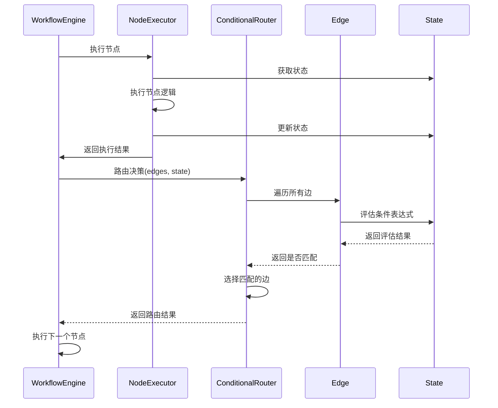
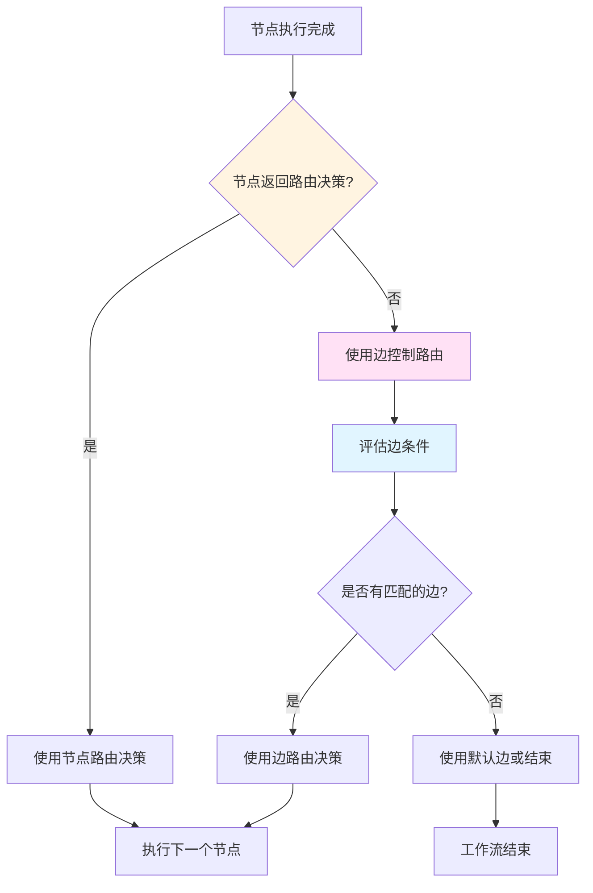

# 路由控制设计分析：边控制 vs 节点控制

## 一、当前项目的路由控制设计

### 1.1 当前实现：边控制路由

基于代码分析，当前项目主要采用**边控制路由**的设计模式。

#### 核心证据

**1. EdgeValueObject（边值对象）**
- 位置：[`src/domain/workflow/value-objects/edge/edge-value-object.ts`](src/domain/workflow/value-objects/edge/edge-value-object.ts)
- 边包含条件表达式：`condition?: string`
- 边有类型系统，支持条件边（`CONDITIONAL`）
- 边提供条件评估相关方法：
  - `requiresConditionEvaluation()` - 判断是否需要条件评估
  - `getConditionExpression()` - 获取条件表达式

**2. ConditionalRouter（条件路由器）**
- 位置：[`src/domain/workflow/services/conditional-router.ts`](src/domain/workflow/services/conditional-router.ts)
- 路由器接收边列表和状态作为输入
- 遍历所有边，评估每条边的条件表达式
- 根据边的条件评估结果决定路由目标
- 支持单路路由（`route`）和多路路由（`routeMultiple`）

**3. NodeType（节点类型）**
- 位置：[`src/domain/workflow/value-objects/node/node-type.ts`](src/domain/workflow/value-objects/node/node-type.ts)
- 虽然定义了 `DECISION` 和 `CONDITION` 节点类型
- 但这些节点类型主要用于标识，实际路由逻辑在边中
- `canHaveMultipleOutputs()` 方法表明决策节点可以有多条输出边

#### 执行流程



### 1.2 边控制路由的特点

**优势：**
1. **关注点分离**：节点专注于业务逻辑，边专注于路由控制
2. **图结构清晰**：路由关系在图中直观可见
3. **易于可视化**：可以在图形界面中直接编辑路由规则
4. **配置驱动**：路由规则可以通过配置文件定义
5. **类型安全**：使用 TypeScript 类型系统确保路由决策的正确性

**劣势：**
1. **复杂路由受限**：对于需要复杂计算的路由决策，边的能力有限
2. **条件表达式复杂**：复杂的条件表达式难以维护
3. **缺乏灵活性**：路由逻辑与节点执行逻辑分离，某些场景下不够灵活

## 二、节点控制路由设计

### 2.1 设计概念

节点控制路由是指路由决策由节点内部逻辑决定，节点执行后返回下一个要执行的节点ID。

### 2.2 实现方式

```typescript
// 节点执行结果包含路由决策
interface NodeExecutionResult {
  readonly success: boolean;
  readonly output?: any;
  readonly error?: string;
  readonly metadata?: Record<string, any>;
  readonly executionTime?: number;
  readonly nextNodeId?: string;  // 节点决定下一个节点
  readonly nextNodeIds?: string[];  // 支持多路路由
}

// 节点内部决定路由
class DecisionNode extends Node {
  async execute(context: NodeContext): Promise<NodeExecutionResult> {
    const decision = this.makeDecision(context);
    
    return {
      success: true,
      output: decision,
      nextNodeId: decision.targetNodeId  // 节点决定路由
    };
  }
}
```

### 2.3 节点控制路由的特点

**优势：**
1. **逻辑集中**：路由逻辑与节点执行逻辑在一起，易于理解
2. **灵活性高**：可以使用任意复杂的逻辑决定路由
3. **适合复杂场景**：对于需要复杂计算或外部调用的路由决策更合适
4. **代码复用**：可以在节点内部复用路由逻辑

**劣势：**
1. **图结构不清晰**：路由关系隐藏在节点代码中
2. **难以可视化**：无法在图形界面中直观显示路由规则
3. **耦合度高**：节点需要知道其他节点的存在
4. **测试困难**：路由逻辑与业务逻辑耦合，难以单独测试

## 三、主流框架对比

### 3.1 LangGraph - 边控制路由

```typescript
// LangGraph 使用边控制路由
const workflow = new StateGraph(StateAnnotation)
  .addNode("llmCall1", llmCall1)
  .addNode("llmCall2", llmCall2)
  .addNode("router", routerNode)
  .addEdge("__start__", "router")
  .addConditionalEdges("router", routeDecision, ["llmCall1", "llmCall2"])
  .compile();

// 路由函数基于状态返回目标节点ID
function routeDecision(state: typeof StateAnnotation.State) {
  if (state.decision === "story") {
    return "llmCall1";
  } else if (state.decision === "joke") {
    return "llmCall2";
  }
}
```

**特点：**
- 使用 `addConditionalEdges` 定义条件边
- 路由函数基于状态返回目标节点ID
- 路由逻辑与节点执行逻辑分离

### 3.2 n8n - 节点控制路由

```json
{
  "name": "Switch",
  "type": "n8n-nodes-base.switch",
  "parameters": {
    "mode": "rules",
    "rules": [
      {
        "conditions": {
          "string": [
            {"value1": "={{$json.status}}", "value2": "success"}
          ]
        },
        "output": "success"
      },
      {
        "conditions": {
          "string": [
            {"value1": "={{$json.status}}", "value2": "error"}
          ]
        },
        "output": "error"
      }
    ]
  }
}
```

**特点：**
- 使用专门的 Switch 节点控制路由
- 节点内部定义路由规则
- 路由逻辑集中在节点中

### 3.3 Temporal - 代码控制路由

```typescript
// Temporal 工作流代码直接控制路由
export async function sampleWorkflow(input: Input): Promise<Output> {
  const result1 = await activities.activity1(input);
  
  if (result1.condition) {
    return await activities.activity2(result1);
  } else {
    return await activities.activity3(result1);
  }
}
```

**特点：**
- 工作流代码直接控制路由
- 使用条件语句和循环控制流程
- 路由逻辑嵌入在工作流代码中

## 四、设计对比分析

### 4.1 对比表格

| 维度 | 边控制路由 | 节点控制路由 |
|------|-----------|-------------|
| **关注点分离** | ✅ 节点专注业务，边专注路由 | ❌ 路由与业务耦合 |
| **图结构清晰度** | ✅ 路由关系直观可见 | ❌ 路由关系隐藏在代码中 |
| **可视化能力** | ✅ 易于图形化编辑 | ❌ 难以图形化编辑 |
| **配置驱动** | ✅ 可通过配置定义 | ❌ 需要编写代码 |
| **复杂路由能力** | ⚠️ 受限于表达式能力 | ✅ 支持任意复杂逻辑 |
| **灵活性** | ⚠️ 相对固定 | ✅ 高度灵活 |
| **类型安全** | ✅ TypeScript 类型保护 | ⚠️ 需要额外类型定义 |
| **测试性** | ✅ 路由逻辑可独立测试 | ⚠️ 与业务逻辑耦合 |
| **学习曲线** | ✅ 简单直观 | ⚠️ 需要理解节点逻辑 |
| **维护性** | ✅ 路由规则集中管理 | ⚠️ 分散在各个节点中 |

### 4.2 适用场景

**边控制路由适合：**
- 简单的条件判断（基于状态字段）
- 固定的路由规则
- 需要可视化编辑的场景
- 配置驱动的工作流
- 团队协作，需要清晰的图结构

**节点控制路由适合：**
- 复杂的路由决策（需要复杂计算）
- 需要调用外部服务的路由
- 需要AI决策的路由
- 动态路由（运行时决定）
- 需要高度灵活性的场景

## 五、推荐设计：混合模式

### 5.1 设计原则

基于当前项目的架构和需求，推荐采用**边控制为主，节点控制为辅**的混合模式。

### 5.2 架构设计



### 5.3 实现方案

**1. 扩展 NodeExecutionResult 接口**

```typescript
export interface NodeExecutionResult {
  readonly success: boolean;
  readonly output?: any;
  readonly error?: string;
  readonly metadata?: Record<string, any>;
  readonly executionTime?: number;
  
  // 新增：节点路由决策
  readonly routingDecision?: {
    readonly nextNodeId?: string;
    readonly nextNodeIds?: string[];
    readonly reason?: string;
  };
}
```

**2. 扩展 ConditionalRouter**

```typescript
export class ConditionalRouter {
  /**
   * 路由到下一个节点（支持节点路由决策）
   * @param edges 边列表
   * @param state 工作流状态
   * @param nodeRoutingDecision 节点路由决策（可选）
   * @param options 路由选项
   * @returns 路由结果
   */
  async route(
    edges: EdgeValueObject[],
    state: WorkflowState,
    nodeRoutingDecision?: NodeExecutionResult['routingDecision'],
    options: RoutingOptions = {}
  ): Promise<RoutingResult | null> {
    // 优先使用节点路由决策
    if (nodeRoutingDecision) {
      return this.applyNodeRoutingDecision(
        nodeRoutingDecision,
        edges,
        state,
        options
      );
    }
    
    // 否则使用边控制路由
    return this.routeByEdges(edges, state, options);
  }
  
  /**
   * 应用节点路由决策
   */
  private async applyNodeRoutingDecision(
    decision: NonNullable<NodeExecutionResult['routingDecision']>,
    edges: EdgeValueObject[],
    state: WorkflowState,
    options: RoutingOptions
  ): Promise<RoutingResult | null> {
    // 验证节点路由决策是否有效
    if (decision.nextNodeId) {
      const edge = edges.find(e => e.toNodeId.value === decision.nextNodeId);
      if (edge) {
        return {
          targetNodeId: decision.nextNodeId,
          edgeId: edge.id.value,
          conditionResult: true,
          metadata: {
            source: 'node',
            reason: decision.reason
          }
        };
      }
    }
    
    // 如果节点路由决策无效，回退到边控制路由
    return this.routeByEdges(edges, state, options);
  }
  
  /**
   * 通过边控制路由
   */
  private async routeByEdges(
    edges: EdgeValueObject[],
    state: WorkflowState,
    options: RoutingOptions
  ): Promise<RoutingResult | null> {
    // 现有的边控制路由逻辑
    // ...
  }
}
```

**3. 更新 WorkflowEngine**

```typescript
export class WorkflowEngine {
  private async executeNodeWithRetry(
    node: Node,
    context: NodeContext,
    options: WorkflowExecutionOptions
  ): Promise<NodeExecutionResult> {
    // 执行节点
    const result = await this.nodeExecutor.execute(node, context);
    
    // 获取节点的输出边
    const edges = this.workflow.getEdgesFromNode(node.nodeId);
    
    // 路由决策（优先使用节点路由决策）
    const routingResult = await this.conditionalRouter.route(
      edges,
      context.state,
      result.routingDecision,  // 传入节点路由决策
      {
        useDefaultEdge: true,
        recordHistory: true,
        verboseLogging: options.verboseLogging
      }
    );
    
    // 更新状态
    if (routingResult) {
      context.state = this.stateManager.setCurrentNodeId(
        context.state,
        NodeId.from(routingResult.targetNodeId)
      );
    }
    
    return result;
  }
}
```

### 5.4 使用示例

**示例1：简单路由（边控制）**

```typescript
// 定义边
const edge1 = EdgeValueObject.create({
  id: EdgeId.generate(),
  type: EdgeType.conditional(),
  fromNodeId: NodeId.from('node-1'),
  toNodeId: NodeId.from('node-2'),
  condition: 'state.status === "success"',
  properties: {},
  contextFilter: EdgeContextFilter.default()
});

// 节点不返回路由决策，使用边控制
class TaskNode extends Node {
  async execute(context: NodeContext): Promise<NodeExecutionResult> {
    // 执行业务逻辑
    const result = await this.doWork(context);
    
    return {
      success: true,
      output: result
      // 不返回 routingDecision，使用边控制
    };
  }
}
```

**示例2：复杂路由（节点控制）**

```typescript
// 节点返回路由决策
class ComplexDecisionNode extends Node {
  async execute(context: NodeContext): Promise<NodeExecutionResult> {
    // 复杂的路由决策逻辑
    const decision = await this.makeComplexDecision(context);
    
    return {
      success: true,
      output: decision,
      routingDecision: {
        nextNodeId: decision.targetNodeId,
        reason: `基于复杂分析选择节点 ${decision.targetNodeId}`
      }
    };
  }
  
  private async makeComplexDecision(context: NodeContext): Promise<{targetNodeId: string}> {
    // 可以调用外部服务
    const externalResult = await this.callExternalService(context);
    
    // 可以使用AI决策
    const aiDecision = await this.useAIForDecision(context, externalResult);
    
    // 可以进行复杂计算
    const calculated = this.calculateRoute(context, aiDecision);
    
    return calculated;
  }
}
```

### 5.5 设计优势

**1. 灵活性**
- 简单场景使用边控制，保持图结构清晰
- 复杂场景使用节点控制，提供足够的灵活性

**2. 向后兼容**
- 现有的边控制路由逻辑完全保留
- 节点路由决策是可选的，不影响现有代码

**3. 渐进式增强**
- 可以逐步将复杂的路由逻辑迁移到节点控制
- 不需要一次性重构所有路由逻辑

**4. 最佳实践**
- 遵循"简单优先"原则
- 提供清晰的指导：何时使用边控制，何时使用节点控制

## 六、实施建议

### 6.1 实施步骤

**阶段1：扩展接口（低风险）**
1. 扩展 `NodeExecutionResult` 接口，添加 `routingDecision` 字段
2. 扩展 `ConditionalRouter`，支持节点路由决策
3. 更新 `WorkflowEngine`，优先使用节点路由决策

**阶段2：文档和示例（中风险）**
1. 编写路由控制设计文档
2. 提供边控制和节点控制的使用示例
3. 编写最佳实践指南

**阶段3：逐步迁移（低风险）**
1. 识别适合使用节点控制的复杂路由场景
2. 逐步将复杂路由逻辑迁移到节点控制
3. 保持简单路由使用边控制

### 6.2 使用指南

**何时使用边控制路由：**
- ✅ 基于状态字段的简单条件判断
- ✅ 固定的路由规则
- ✅ 需要可视化编辑
- ✅ 配置驱动的工作流

**何时使用节点控制路由：**
- ✅ 需要复杂计算的路由决策
- ✅ 需要调用外部服务的路由
- ✅ 需要AI决策的路由
- ✅ 动态路由（运行时决定）

### 6.3 注意事项

1. **避免过度使用节点控制**：简单路由应该使用边控制，保持图结构清晰
2. **文档化节点路由决策**：节点返回的路由决策应该有清晰的 `reason` 字段
3. **验证节点路由决策**：路由器应该验证节点返回的路由决策是否有效
4. **提供回退机制**：如果节点路由决策无效，应该回退到边控制路由

## 七、结论

### 7.1 当前设计评估

当前项目采用**边控制路由**的设计，这是一个合理的选择，具有以下优势：
- 关注点分离清晰
- 图结构直观
- 易于可视化和配置驱动
- 适合大多数简单到中等复杂度的路由场景

### 7.2 改进建议

为了支持更复杂的路由场景，建议采用**混合模式**：
- **边控制为主**：保持现有的边控制路由逻辑，用于简单路由
- **节点控制为辅**：扩展接口，支持节点返回路由决策，用于复杂路由

### 7.3 预期效果

采用混合模式后，项目将获得：
- ✅ 保持图结构的清晰性（边控制）
- ✅ 支持复杂的路由决策（节点控制）
- ✅ 向后兼容现有代码
- ✅ 提供灵活性和可扩展性
- ✅ 遵循"简单优先"的最佳实践

这种设计既保持了当前项目的优势，又为未来的复杂场景提供了足够的灵活性。