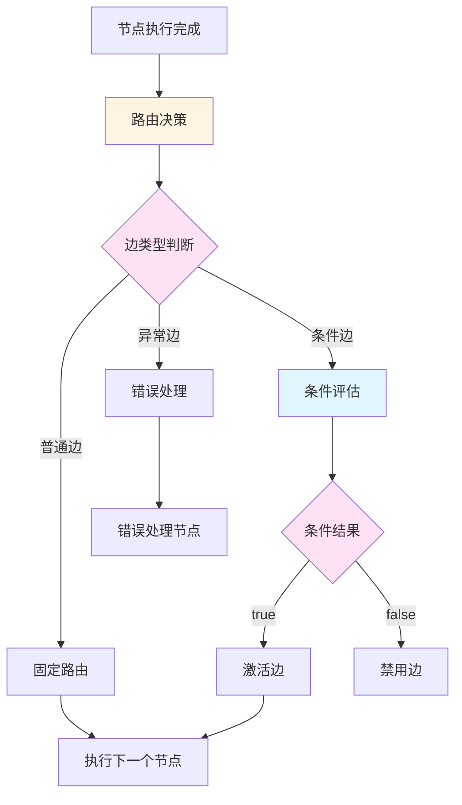
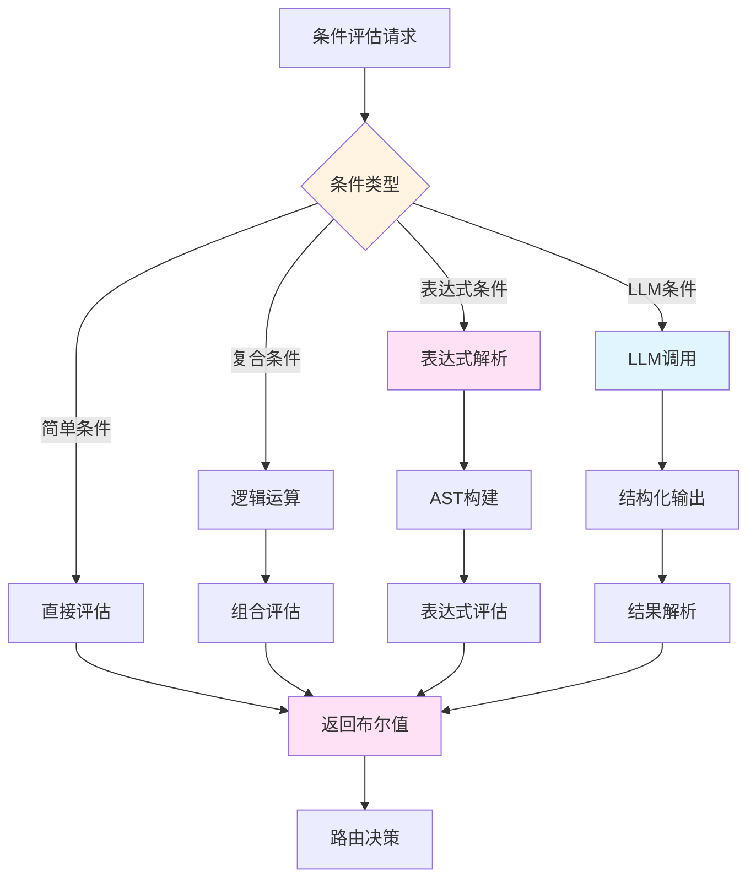

# 路由控制机制详细分析

## 概述

本文档深入分析图工作流中的路由控制机制，包括节点和边的路由策略、条件评估逻辑、以及如何实现灵活的工作流控制。

## 一、路由控制基础

### 1.1 路由控制的核心概念

路由控制是图工作流的核心机制，决定了工作流在节点之间的执行顺序和路径选择。



### 1.2 路由决策的时机

路由决策在以下时机触发：

1. **节点执行完成后**：根据节点输出决定下一个节点
2. **异常发生时**：根据错误类型选择错误处理路径
3. **超时发生时**：根据超时配置选择超时处理路径
4. **外部事件触发时**：根据事件类型选择响应路径

## 二、边类型与路由策略

### 2.1 普通边（Sequence Edge）

**特点**：
- 固定的节点转换关系
- 不需要条件评估
- 执行顺序确定

**实现示例**：
```typescript
// LangGraph 实现
workflow.addEdge("nodeA", "nodeB");

// 当前项目实现
const edge = EdgeValueObject.create({
  id: EdgeId.generate(),
  type: EdgeType.sequence(),
  fromNodeId: NodeId.from("nodeA"),
  toNodeId: NodeId.from("nodeB"),
  condition: undefined,
  properties: {},
  contextFilter: EdgeContextFilter.create({}),
});
```

**使用场景**：
- 顺序执行的任务
- 不需要条件判断的流程
- 简单的线性工作流

### 2.2 条件边（Conditional Edge）

**特点**：
- 基于状态动态选择下一个节点
- 支持复杂的条件表达式
- 可以有多个输出路径

**实现模式**：

#### 模式一：基于布尔值的路由

```typescript
// 路由函数
function routeByBoolean(state: State): string {
  if (state.hasError) {
    return "errorHandler";
  }
  return "nextStep";
}

// 构建工作流
workflow.addConditionalEdges("currentNode", routeByBoolean, {
  "errorHandler": errorHandlerNode,
  "nextStep": nextStepNode,
});
```

#### 模式二：基于枚举值的路由

```typescript
// 路由函数
function routeByEnum(state: State): string {
  switch (state.status) {
    case "success":
      return "successHandler";
    case "failure":
      return "failureHandler";
    case "pending":
      return "pendingHandler";
    default:
      return "defaultHandler";
  }
}

// 构建工作流
workflow.addConditionalEdges("currentNode", routeByEnum, {
  "successHandler": successHandlerNode,
  "failureHandler": failureHandlerNode,
  "pendingHandler": pendingHandlerNode,
  "defaultHandler": defaultHandlerNode,
});
```

#### 模式三：基于复杂表达式的路由

```typescript
// 路由函数
function routeByExpression(state: State): string {
  if (state.errors.length > 0 && state.retryCount < 3) {
    return "retry";
  } else if (state.errors.length > 0) {
    return "errorHandler";
  } else if (state.needsApproval) {
    return "approval";
  } else {
    return "complete";
  }
}

// 构建工作流
workflow.addConditionalEdges("currentNode", routeByExpression, {
  "retry": retryNode,
  "errorHandler": errorHandlerNode,
  "approval": approvalNode,
  "complete": completeNode,
});
```

**当前项目实现**：
```typescript
// src/domain/workflow/value-objects/edge/edge-value-object.ts
export class EdgeValueObject extends ValueObject<EdgeValueObjectProps> {
  // 检查是否需要条件评估
  public requiresConditionEvaluation(): boolean {
    return this.props.type.requiresConditionEvaluation();
  }
  
  // 获取条件表达式
  public getConditionExpression(): string | undefined {
    return this.props.condition;
  }
  
  // 过滤上下文
  public filterContext(context: PromptContext): PromptContext {
    return this.props.contextFilter.applyFilter(context);
  }
}
```

### 2.3 异常边（Error Edge）

**特点**：
- 专门处理错误和异常
- 可以捕获特定类型的错误
- 支持错误恢复和重试

**实现示例**：
```typescript
// 错误边定义
const errorEdge = EdgeValueObject.create({
  id: EdgeId.generate(),
  type: EdgeType.error(),
  fromNodeId: NodeId.from("riskyNode"),
  toNodeId: NodeId.from("errorHandler"),
  condition: "error.type === 'ValidationError'",
  properties: {
    retryCount: 3,
    retryDelay: 1000,
  },
  contextFilter: EdgeContextFilter.create({}),
});

// 错误处理节点
async function errorHandler(state: State): Promise<Partial<State>> {
  const error = state.lastError;
  
  if (error.retryable && state.retryCount < 3) {
    return {
      retryCount: state.retryCount + 1,
      nextNode: "riskyNode", // 重试
    };
  } else {
    return {
      status: "failed",
      errorMessage: error.message,
    };
  }
}
```

**使用场景**：
- 需要错误恢复的工作流
- 支持重试机制的任务
- 需要记录和监控错误的场景

### 2.4 超时边（Timeout Edge）

**特点**：
- 处理节点执行超时
- 支持超时配置
- 可以触发备用流程

**实现示例**：
```typescript
// 超时边定义
const timeoutEdge = EdgeValueObject.create({
  id: EdgeId.generate(),
  type: EdgeType.timeout(),
  fromNodeId: NodeId.from("slowNode"),
  toNodeId: NodeId.from("timeoutHandler"),
  condition: undefined,
  properties: {
    timeout: 30000, // 30秒超时
  },
  contextFilter: EdgeContextFilter.create({}),
});

// 超时处理节点
async function timeoutHandler(state: State): Promise<Partial<State>> {
  return {
    status: "timeout",
    message: "节点执行超时",
    fallbackNode: "alternativeNode",
  };
}
```

### 2.5 异步边（Asynchronous Edge）

**特点**：
- 支持异步节点执行
- 可以并行执行多个节点
- 支持结果聚合

**实现示例**：
```typescript
// 异步边定义
const asyncEdge = EdgeValueObject.create({
  id: EdgeId.generate(),
  type: EdgeType.asynchronous(),
  fromNodeId: NodeId.from("parallelStart"),
  toNodeId: NodeId.from("parallelTask"),
  condition: undefined,
  properties: {
    parallel: true,
    maxConcurrency: 5,
  },
  contextFilter: EdgeContextFilter.create({}),
});

// 并行执行节点
async function parallelExecutor(state: State): Promise<Partial<State>> {
  const tasks = state.tasks.map(task => executeTask(task));
  const results = await Promise.all(tasks);
  
  return {
    results: results,
    status: "completed",
  };
}
```

## 三、条件评估逻辑

### 3.1 条件评估的类型

#### 类型一：简单布尔条件

```typescript
// 简单条件评估
function evaluateSimpleCondition(state: State): boolean {
  return state.hasError;
}

// 使用
if (evaluateSimpleCondition(state)) {
  return "errorHandler";
}
```

#### 类型二：复合条件

```typescript
// 复合条件评估
function evaluateComplexCondition(state: State): boolean {
  return (
    state.errors.length > 0 &&
    state.retryCount < 3 &&
    state.priority === "high"
  );
}

// 使用
if (evaluateComplexCondition(state)) {
  return "retry";
}
```

#### 类型三：表达式条件

```typescript
// 表达式评估器
class ExpressionEvaluator {
  evaluate(expression: string, context: Record<string, any>): boolean {
    // 解析表达式
    const ast = this.parse(expression);
    // 评估表达式
    return this.evaluateAST(ast, context);
  }
  
  private parse(expression: string): ASTNode {
    // 实现表达式解析
    // 支持：AND, OR, NOT, 比较运算符, 函数调用等
  }
  
  private evaluateAST(node: ASTNode, context: Record<string, any>): boolean {
    // 实现AST评估
  }
}

// 使用
const evaluator = new ExpressionEvaluator();
const result = evaluator.evaluate(
  "state.errors.length > 0 && state.retryCount < 3",
  { state }
);
```

#### 类型四：LLM 评估条件

```typescript
// LLM 评估器
class LLMConditionEvaluator {
  constructor(private llm: LLMClient) {}
  
  async evaluate(prompt: string, context: Record<string, any>): Promise<boolean> {
    const response = await this.llm.invoke({
      messages: [
        {
          role: "system",
          content: "你是一个条件评估专家。请根据给定的上下文评估条件是否满足。",
        },
        {
          role: "user",
          content: `条件：${prompt}\n上下文：${JSON.stringify(context)}`,
        },
      ],
      responseFormat: { type: "json_object" },
    });
    
    const result = JSON.parse(response.content);
    return result.satisfied;
  }
}

// 使用
const evaluator = new LLMConditionEvaluator(llm);
const result = await evaluator.evaluate(
  "这个笑话是否有趣？",
  { joke: state.joke }
);
```

### 3.2 条件评估的实现架构



### 3.3 条件评估的最佳实践

1. **保持简单**：优先使用简单的布尔条件
2. **避免嵌套**：避免过深的条件嵌套
3. **使用常量**：将魔法值提取为常量
4. **提供默认值**：为条件评估提供默认值
5. **记录日志**：记录条件评估的结果和原因

## 四、路由控制的高级特性

### 4.1 多路分支路由

**实现方式**：
```typescript
// Switch 节点实现
class SwitchNode extends Node {
  async execute(context: NodeContext): Promise<NodeExecutionResult> {
    const cases = this.properties.cases;
    const value = context.getVariable("value");
    
    for (const case_ of cases) {
      if (this.evaluateCondition(case_.condition, context)) {
        return {
          success: true,
          output: {
            nextNode: case_.targetNode,
          },
        };
      }
    }
    
    // 默认分支
    return {
      success: true,
      output: {
        nextNode: this.properties.defaultNode,
      },
    };
  }
}
```

### 4.2 循环控制

**实现方式**：
```typescript
// 循环控制节点
class LoopNode extends Node {
  async execute(context: NodeContext): Promise<NodeExecutionResult> {
    const maxIterations = this.properties.maxIterations;
    const currentIteration = context.getVariable("iteration") || 0;
    
    if (currentIteration >= maxIterations) {
      return {
        success: true,
        output: {
          nextNode: this.properties.exitNode,
        },
      };
    }
    
    if (this.evaluateLoopCondition(context)) {
      return {
        success: true,
        output: {
          nextNode: this.properties.loopNode,
          iteration: currentIteration + 1,
        },
      };
    }
    
    return {
      success: true,
      output: {
        nextNode: this.properties.exitNode,
      },
    };
  }
}
```

### 4.3 并行执行

**实现方式**：
```typescript
// 并行执行节点
class ParallelNode extends Node {
  async execute(context: NodeContext): Promise<NodeExecutionResult> {
    const tasks = this.properties.tasks;
    
    // 并行执行所有任务
    const results = await Promise.all(
      tasks.map(task => this.executeTask(task, context))
    );
    
    return {
      success: true,
      output: {
        results: results,
        nextNode: this.properties.nextNode,
      },
    };
  }
}
```

### 4.4 动态路由

**实现方式**：
```typescript
// 动态路由节点
class DynamicRouterNode extends Node {
  async execute(context: NodeContext): Promise<NodeExecutionResult> {
    const routingFunction = this.properties.routingFunction;
    
    // 动态计算下一个节点
    const nextNode = await routingFunction(context);
    
    return {
      success: true,
      output: {
        nextNode: nextNode,
      },
    };
  }
}
```

## 五、当前项目的路由控制实现

### 5.1 现有实现分析

**优势**：
1. **类型安全**：使用 TypeScript 类型系统确保路由决策的正确性
2. **上下文过滤**：支持边级别的上下文过滤
3. **多种边类型**：支持普通边、条件边、异常边、异步边等
4. **配置驱动**：通过配置文件定义路由逻辑

**不足**：
1. **缺少通用路由器**：每个条件边都需要单独实现路由逻辑
2. **表达式评估不完善**：不支持复杂的条件表达式
3. **LLM 评估未集成**：不支持语义级别的条件判断
4. **调试能力不足**：缺少路由决策的可视化和调试工具

### 5.2 改进建议

#### 建议1：实现通用条件路由器

```typescript
// 通用条件路由器
class ConditionalRouter {
  constructor(
    private conditionEvaluator: ConditionEvaluator,
    private edgeRepository: EdgeRepository
  ) {}
  
  async route(
    fromNodeId: NodeId,
    state: State
  ): Promise<NodeId | null> {
    // 获取所有从该节点出发的边
    const edges = await this.edgeRepository.findByFromNode(fromNodeId);
    
    // 评估每条边的条件
    for (const edge of edges) {
      if (edge.requiresConditionEvaluation()) {
        const condition = edge.getConditionExpression();
        const result = await this.conditionEvaluator.evaluate(
          condition,
          state
        );
        
        if (result) {
          return edge.toNodeId;
        }
      } else {
        // 普通边，直接返回
        return edge.toNodeId;
      }
    }
    
    return null; // 没有可用的边
  }
}
```

#### 建议2：实现表达式评估器

```typescript
// 表达式评估器
class ExpressionEvaluator {
  evaluate(expression: string, context: Record<string, any>): boolean {
    // 支持的表达式语法：
    // - 简单比较：state.value > 10
    // - 逻辑运算：state.a && state.b
    // - 函数调用：hasErrors(state)
    // - 复杂表达式：state.errors.length > 0 && state.retryCount < 3
    
    const ast = this.parse(expression);
    return this.evaluateAST(ast, context);
  }
  
  private parse(expression: string): ASTNode {
    // 实现表达式解析
    // 可以使用现有的解析库，如 expr-eval、mathjs 等
  }
  
  private evaluateAST(node: ASTNode, context: Record<string, any>): boolean {
    // 实现 AST 评估
  }
}
```

#### 建议3：集成 LLM 评估能力

```typescript
// LLM 条件评估器
class LLMConditionEvaluator {
  constructor(private llmClient: LLMClient) {}
  
  async evaluate(
    prompt: string,
    context: Record<string, any>
  ): Promise<boolean> {
    const response = await this.llmClient.invoke({
      messages: [
        {
          role: "system",
          content: "你是一个条件评估专家。请根据给定的上下文评估条件是否满足。",
        },
        {
          role: "user",
          content: `条件：${prompt}\n上下文：${JSON.stringify(context)}`,
        },
      ],
      responseFormat: { type: "json_object" },
    });
    
    const result = JSON.parse(response.content);
    return result.satisfied;
  }
}
```

#### 建议4：增强调试能力

```typescript
// 路由决策记录器
class RoutingDecisionLogger {
  logDecision(
    fromNodeId: NodeId,
    toNodeId: NodeId,
    condition: string,
    result: boolean,
    state: State
  ): void {
    console.log({
      timestamp: new Date().toISOString(),
      fromNode: fromNodeId.toString(),
      toNode: toNodeId.toString(),
      condition: condition,
      result: result,
      stateSnapshot: this.createStateSnapshot(state),
    });
  }
  
  private createStateSnapshot(state: State): Record<string, any> {
    // 创建状态快照，用于调试
    return {
      variables: Object.fromEntries(state.variables),
      nodeResults: Object.fromEntries(state.nodeResults),
    };
  }
}
```

## 六、实施计划

### 阶段一：基础改进（高优先级）

1. **实现通用条件路由器**
   - 创建 `ConditionalRouter` 类
   - 集成到工作流执行引擎
   - 编写单元测试

2. **实现表达式评估器**
   - 创建 `ExpressionEvaluator` 类
   - 支持基本的表达式语法
   - 编写单元测试

3. **增强边配置**
   - 支持更丰富的条件表达式
   - 添加边权重配置
   - 支持边优先级

### 阶段二：高级特性（中优先级）

1. **集成 LLM 评估能力**
   - 创建 `LLMConditionEvaluator` 类
   - 支持语义级别的条件判断
   - 编写集成测试

2. **实现多路分支路由**
   - 创建 `SwitchNode` 类
   - 支持多个条件分支
   - 编写单元测试

3. **实现循环控制**
   - 创建 `LoopNode` 类
   - 支持循环和迭代
   - 编写单元测试

### 阶段三：优化和完善（低优先级）

1. **增强调试能力**
   - 创建 `RoutingDecisionLogger` 类
   - 实现路由决策可视化
   - 添加性能监控

2. **性能优化**
   - 实现条件评估缓存
   - 优化路由决策算法
   - 添加性能测试

3. **文档完善**
   - 编写 API 文档
   - 提供使用示例
   - 创建最佳实践指南

## 七、总结

路由控制是图工作流的核心机制，决定了工作流的执行流程和灵活性。通过实现通用条件路由器、表达式评估器和 LLM 评估能力，可以大幅提升当前项目的路由控制能力，使其达到主流框架的水平。

### 关键要点

1. **路由控制的核心**：基于状态动态选择下一个节点
2. **边类型的多样性**：支持普通边、条件边、异常边、超时边、异步边
3. **条件评估的灵活性**：支持简单条件、复合条件、表达式条件、LLM 条件
4. **配置驱动的重要性**：通过配置文件定义路由逻辑，避免硬编码
5. **类型安全的必要性**：充分利用 TypeScript 类型系统确保正确性

### 下一步行动

1. 实现通用条件路由器
2. 实现表达式评估器
3. 集成 LLM 评估能力
4. 增强调试和监控能力
5. 完善文档和示例