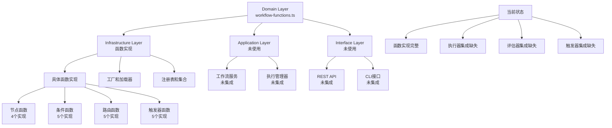

# 工作流函数模块集成分析

## 概述

本文档分析了 `src/domain/workflow/interfaces/workflow-functions.ts` 接口在实际项目中的使用情况，以及函数模块如何与工作流系统集成。

## 分析目标

- 分析工作流函数接口在实际项目中的使用情况
- 评估函数模块如何应用于节点、边和触发器
- 识别集成缺失和优化机会

## 接口定义概览

### 核心接口体系

文件定义了工作流函数的核心接口体系：

- **`IWorkflowFunction`** - 基础工作流函数接口
- **`IConditionFunction`** - 条件函数接口
- **`INodeFunction`** - 节点执行函数接口  
- **`IRoutingFunction`** - 路由函数接口
- **`ITriggerFunction`** - 触发器函数接口
- **`IWorkflowFunctionFactory`** - 函数工厂接口
- **`IWorkflowFunctionLoader`** - 函数加载器接口
- **`IWorkflowFunctionCollection`** - 函数集合接口

## 实际使用情况分析

### ✅ 基础设施层实现（完整）

**1. 基础抽象类实现**
- [`BaseWorkflowFunction`](src/infrastructure/workflow/functions/base/base-workflow-function.ts:14) 实现了 [`IWorkflowFunction`](src/domain/workflow/interfaces/workflow-functions.ts:53) 接口

**2. 具体函数实现**
- **节点函数**（4个实现）：LLM节点、工具调用节点、数据转换节点、条件检查节点
- **条件函数**（5个实现）：检查工具调用、检查错误、检查迭代限制等
- **路由函数**（5个实现）：基于工具调用结果的路由、基于错误的路由等
- **触发器函数**（5个实现）：时间触发器、事件触发器、状态触发器等

**3. 支持组件实现**
- [`WorkflowFunctionFactory`](src/infrastructure/workflow/functions/factories/workflow-function-factory.ts:19) 实现了 [`IWorkflowFunctionFactory`](src/domain/workflow/interfaces/workflow-functions.ts:100)
- [`WorkflowFunctionLoader`](src/infrastructure/workflow/functions/loaders/workflow-function-loader.ts:15) 实现了 [`IWorkflowFunctionLoader`](src/domain/workflow/interfaces/workflow-functions.ts:111)
- [`BuiltinFunctionCollection`](src/infrastructure/workflow/functions/collections/builtin-function-collection.ts:17) 实现了 [`IWorkflowFunctionCollection`](src/domain/workflow/interfaces/workflow-functions.ts:120)

### ❌ 应用层和接口层使用情况

**当前使用情况分析：**
- **应用层**：目前没有直接使用这些接口的代码
- **接口层**：目前没有直接使用这些接口的代码
- **基础设施层**：所有接口都有完整的实现和使用

### ❌ 工作流执行系统集成缺失

**1. 节点执行器集成缺失**
- [`LLMNodeExecutor`](src/infrastructure/workflow/nodes/executors/llm-node-executor.ts:6) - 硬编码执行逻辑，未使用函数接口
- [`ToolNodeExecutor`](src/infrastructure/workflow/nodes/executors/tool-node-executor.ts:7) - 硬编码执行逻辑，未使用函数接口

**2. 边评估器集成缺失**
- [`ConditionEvaluator`](src/infrastructure/workflow/edges/evaluators/condition-evaluator.ts:6) - 硬编码条件评估逻辑，未使用函数接口

**3. 触发器系统集成缺失**
- [`BaseTrigger`](src/domain/workflow/extensions/triggers/base-trigger.ts:40) - 独立触发器系统，未使用函数接口

## 架构层级分析



## 发现的问题

### 1. 架构层级依赖不完整
- 函数接口定义在领域层，但应用层和接口层没有使用
- 基础设施层有完整实现，但与其他组件集成不完整

### 2. 功能集成不完整
- 节点执行器没有使用函数接口，导致无法动态替换执行逻辑
- 边评估器没有使用函数接口，导致条件评估逻辑无法复用
- 触发器系统没有使用函数接口，导致触发器检查逻辑无法统一管理

### 3. 代码重复
- 相似的逻辑在多个执行器和评估器中重复实现
- 缺少统一的函数执行机制

## 建议的集成方案

### 方案一：函数驱动的节点执行器

```typescript
class FunctionDrivenNodeExecutor implements INodeExecutor {
  constructor(private functionFactory: IWorkflowFunctionFactory) {}
  
  async execute(node: Node, context: ExecutionContext): Promise<any> {
    const functionName = node.properties.functionName;
    const config = node.properties.config;
    
    // 使用函数工厂创建并执行函数
    const nodeFunction = this.functionFactory.createNodeFunction(functionName, config);
    return await nodeFunction.execute(context, config);
  }
}
```

### 方案二：函数驱动的边评估器

```typescript
class FunctionDrivenEdgeEvaluator implements IEdgeEvaluator {
  constructor(private functionFactory: IWorkflowFunctionFactory) {}
  
  async evaluate(edge: Edge, context: ExecutionContext): Promise<boolean> {
    const functionName = edge.properties.conditionFunction;
    const config = edge.properties.config;
    
    // 使用函数工厂创建并执行条件函数
    const conditionFunction = this.functionFactory.createConditionFunction(functionName, config);
    return await conditionFunction.evaluate(context, config);
  }
}
```

### 方案三：函数驱动的触发器

```typescript
class FunctionDrivenTrigger extends BaseTrigger {
  constructor(private functionFactory: IWorkflowFunctionFactory, config: TriggerConfig) {
    super(config);
  }
  
  async checkCondition(context: TriggerContext): Promise<boolean> {
    const functionName = this.config.functionName;
    const config = this.config.functionConfig;
    
    // 使用函数工厂创建并执行触发器函数
    const triggerFunction = this.functionFactory.createTriggerFunction(functionName, config);
    return await triggerFunction.check(context, config);
  }
}
```

## 集成优势

### 1. 统一管理
- 所有执行逻辑通过函数接口统一管理
- 便于监控、调试和扩展

### 2. 动态替换
- 可以动态替换节点执行逻辑、边评估逻辑和触发器检查逻辑
- 支持热更新和A/B测试

### 3. 代码复用
- 减少重复代码，提高代码复用率
- 统一的错误处理和日志记录

### 4. 配置驱动
- 通过配置文件即可修改执行逻辑
- 支持不同环境的差异化配置

## 实施计划

### 阶段一：集成节点执行器
1. 创建函数驱动的节点执行器
2. 修改现有节点配置，添加函数名称字段
3. 更新工作流执行策略，使用新的执行器

### 阶段二：集成边评估器
1. 创建函数驱动的边评估器
2. 修改边配置，支持函数条件
3. 更新边评估逻辑

### 阶段三：集成触发器系统
1. 创建函数驱动的触发器
2. 修改触发器配置，支持函数检查
3. 更新触发器管理器

### 阶段四：完善应用层集成
1. 在工作流服务中集成函数管理
2. 在REST API中暴露函数注册、查询、执行等功能
3. 优化架构依赖关系

## 结论

函数模块具备**完整的接口体系**和**基础设施实现**，但需要**完善与工作流执行系统的集成**。通过实现函数驱动的执行器、评估器和触发器，可以构建更加灵活、可扩展的工作流系统。

### 关键发现

1. **函数实现完整**：基础设施层有19个具体函数实现
2. **集成缺失严重**：应用层和接口层未使用函数接口
3. **架构优化机会**：通过函数驱动集成可以大幅提升系统灵活性

### 建议优先级

1. **高优先级**：集成节点执行器和边评估器
2. **中优先级**：集成触发器系统
3. **低优先级**：完善应用层和接口层集成

通过实施上述集成方案，可以实现真正意义上的函数驱动工作流执行系统，为未来的功能扩展和性能优化奠定坚实基础。