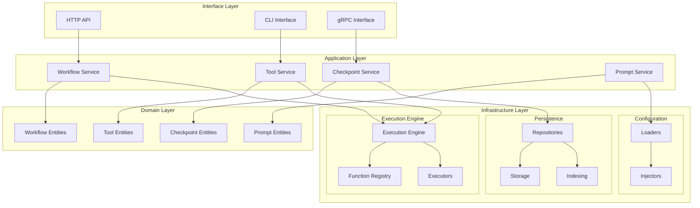

# 基础设施层模块结构分析报告

## 概述

本报告分析了 `src/infrastructure` 目录下的模块结构，重点关注 `tools`、`workflow`、`threads/checkpoints` 和 `prompts` 模块的设计问题，并提出改进建议。

## 当前架构分析

### 1. 架构设计原则

项目采用简化的 3 层架构：
- **Domain 层**: 纯业务逻辑和领域实体
- **Application 层**: 应用服务和业务流程编排
- **Infrastructure 层**: 技术实现细节
- **Interface 层**: 外部接口适配

依赖规则：Infrastructure 只能依赖 Domain，不能依赖 Application 或 Interface 层。

### 2. 当前模块结构

```
src/infrastructure/
├── tools/
│   ├── adapters/
│   ├── executors/
│   └── registries/
├── workflow/
│   ├── edges/
│   ├── functions/
│   ├── nodes/
│   └── strategies/
├── threads/
│   └── checkpoints/
│       └── repositories/
└── prompts/
    ├── repositories/
    └── services/
```

## 识别的设计问题

### 1. Tools 模块问题

#### 问题 1.1: 职责混乱
```typescript
// src/infrastructure/tools/registries/function-registry.ts
export class FunctionRegistry {
  private functions: Map<string, Function> = new Map();
  private functionSchemas: Map<string, any> = new Map();
  
  // 这个类既处理函数注册，又处理验证和执行
  async callFunction(name: string, ...args: any[]): Promise<any> {
    // 执行逻辑不应该在注册表中
  }
  
  validateFunctionCall(name: string, args: any[]): { valid: boolean; errors: string[] } {
    // 验证逻辑应该分离
  }
}
```

**问题**: FunctionRegistry 违反了单一职责原则，既负责注册管理，又负责执行和验证。

#### 问题 1.2: 与 Workflow 模块职责重叠
```typescript
// tools/registries/function-registry.ts
// workflow/functions/registry/function-registry.ts
// 两个模块都有 FunctionRegistry 类，但实现不同
```

**问题**: 两个模块都实现了函数注册表，但职责不清晰，造成代码重复和混淆。

### 2. Workflow 模块问题

#### 问题 2.1: 过度复杂的层次结构
```
workflow/
├── functions/
│   ├── base/
│   ├── builtin/
│   │   ├── conditions/
│   │   ├── nodes/
│   │   ├── routing/
│   │   └── triggers/
│   ├── collections/
│   ├── common/
│   ├── factories/
│   ├── loaders/
│   └── registry/
```

**问题**: 目录层次过深，增加了维护复杂度，许多子目录只有少量文件。

#### 问题 2.2: 基础设施层包含业务逻辑
```typescript
// src/infrastructure/workflow/functions/builtin/nodes/llm-node.function.ts
// 这类文件包含了具体的业务逻辑实现，应该放在 Application 层
```

**问题**: Infrastructure 层包含了太多业务逻辑实现，违反了分层架构原则。

### 3. Threads/Checkpoints 模块问题

#### 问题 3.1: 模块职责不清晰
```typescript
// src/infrastructure/threads/checkpoints/repositories/memory-checkpoint-repository.ts
// 907 行的单一文件，包含了太多职责
```

**问题**: 单个文件过大，包含了存储、索引、统计、备份等多种职责。

#### 问题 3.2: 缺乏抽象
```typescript
// 只有 MemoryThreadCheckpointRepository 实现
// 缺乏其他存储方式的抽象接口
```

**问题**: 缺乏存储抽象，难以扩展到其他存储方式。

### 4. Prompts 模块问题

#### 问题 4.1: 跨层依赖
```typescript
// src/infrastructure/prompts/index.ts
export { PromptLoader } from '../config/loading/loaders/prompt-loader';
// 依赖了 config 模块，可能违反依赖规则
```

**问题**: 可能存在不正确的跨层依赖。

#### 问题 4.2: 职责单一但实现不完整
```typescript
// src/infrastructure/prompts/repositories/prompt-repository.ts
async save(prompt: Prompt): Promise<void> {
  throw new Error('提示词仓库不支持保存操作');
}
```

**问题**: 实现不完整，只读操作限制了模块的实用性。

## 模块间职责重叠和冲突

### 1. 函数注册表重复

**Tools 模块**和 **Workflow 模块**都实现了函数注册表：

- `tools/registries/function-registry.ts`: 通用函数注册
- `workflow/functions/registry/function-registry.ts`: 工作流函数注册

**冲突**: 两个注册表职责重叠，但实现不兼容，可能导致函数管理混乱。

### 2. 执行器模式不一致

**Tools 模块**有执行器模式：
```typescript
// tools/executors/
├── builtin-executor.ts
├── mcp-executor.ts
├── native-executor.ts
└── rest-executor.ts
```

**Workflow 模块**也有执行器：
```typescript
// workflow/nodes/executors/
├── condition-node-executor.ts
├── human-relay-node-executor.ts
├── llm-node-executor.ts
├── tool-node-executor.ts
└── wait-node-executor.ts
```

**冲突**: 两个模块都实现了执行器模式，但设计理念不同，缺乏统一性。

## DDD 原则符合性检查

### 1. 违反依赖倒置原则

**问题**: Infrastructure 层直接依赖具体实现，而不是抽象接口。

**示例**:
```typescript
// 应该依赖接口，而不是具体实现
export class FunctionRegistry {
  private functions: Map<string, Function> = new Map();
  // 直接使用 Function 类型，而不是接口
}
```

### 2. 违反单一职责原则

**问题**: 多个类承担了过多职责。

**示例**:
- `FunctionRegistry` 既管理注册又处理执行
- `MemoryThreadCheckpointRepository` 包含存储、索引、统计等多种职责

### 3. 领域逻辑泄露

**问题**: Infrastructure 层包含了太多领域逻辑。

**示例**:
```typescript
// workflow/functions/builtin/ 目录下的文件包含了具体的业务逻辑
// 这些应该放在 Application 层
```

## 模块间依赖关系分析

### 1. 正确的依赖关系

```
Infrastructure → Domain (正确)
Infrastructure ← Application (错误)
Infrastructure ← Interface (错误)
```

### 2. 发现的问题依赖

1. **跨层依赖**: Prompts 模块可能依赖了 Config 模块
2. **循环依赖风险**: Tools 和 Workflow 模块之间可能存在循环依赖
3. **水平依赖**: Infrastructure 模块之间的依赖关系不清晰

## 重构建议

### 1. 模块职责重新划分

#### 建议 1.1: 统一函数管理
```
infrastructure/
├── execution/           # 统一的执行引擎
│   ├── executors/
│   ├── registry/
│   └── adapters/
├── persistence/         # 持久化抽象
│   ├── repositories/
│   ├── storage/
│   └── indexing/
└── configuration/       # 配置管理
    ├── loaders/
    └── injectors/
```

#### 建议 1.2: 分离业务逻辑
将业务逻辑从 Infrastructure 层移到 Application 层：

```
application/
├── workflow/
│   ├── functions/
│   ├── nodes/
│   └── execution/
├── tools/
│   ├── management/
│   └── execution/
└── checkpoints/
    ├── management/
    └── restoration/
```

### 2. 具体重构步骤

#### 步骤 1: 创建统一执行引擎
```typescript
// infrastructure/execution/execution-engine.ts
export interface IExecutionEngine {
  execute<T>(request: ExecutionRequest<T>): Promise<ExecutionResult<T>>;
  registerExecutor<T>(type: string, executor: IExecutor<T>): void;
}

export interface IExecutor<T> {
  execute(request: ExecutionRequest<T>): Promise<ExecutionResult<T>>;
  canHandle(request: ExecutionRequest<any>): boolean;
}
```

#### 步骤 2: 抽象持久化层
```typescript
// infrastructure/persistence/repository.ts
export interface IRepository<T, ID> {
  save(entity: T): Promise<T>;
  findById(id: ID): Promise<T | null>;
  delete(id: ID): Promise<void>;
  find(criteria: SearchCriteria): Promise<T[]>;
}

// infrastructure/persistence/storage.ts
export interface IStorage {
  get<T>(key: string): Promise<T | null>;
  set<T>(key: string, value: T): Promise<void>;
  delete(key: string): Promise<void>;
  exists(key: string): Promise<boolean>;
}
```

#### 步骤 3: 重构函数注册表
```typescript
// infrastructure/execution/registry.ts
export interface IFunctionRegistry {
  register(name: string, function: IFunction): void;
  unregister(name: string): void;
  get(name: string): IFunction | null;
  list(): IFunction[];
}

export interface IFunction {
  name: string;
  execute(context: ExecutionContext, params: any): Promise<any>;
  validate(params: any): ValidationResult;
}
```

### 3. 架构改进图



## 总结

### 主要问题

1. **职责混乱**: 多个模块承担了过多职责
2. **代码重复**: Tools 和 Workflow 模块存在功能重叠
3. **层次不清**: Infrastructure 层包含了太多业务逻辑
4. **依赖混乱**: 模块间依赖关系不清晰

### 改进方向

1. **统一执行引擎**: 创建统一的执行和注册机制
2. **分离关注点**: 将业务逻辑移到 Application 层
3. **抽象持久化**: 创建统一的持久化抽象
4. **清晰依赖**: 明确模块间的依赖关系

### 预期收益

1. **降低复杂度**: 减少模块间的耦合
2. **提高可维护性**: 清晰的职责划分
3. **增强可扩展性**: 统一的抽象接口
4. **改善测试性**: 更好的依赖注入和模拟支持

这些重构建议将帮助建立一个更加清晰、可维护和可扩展的基础设施层架构。