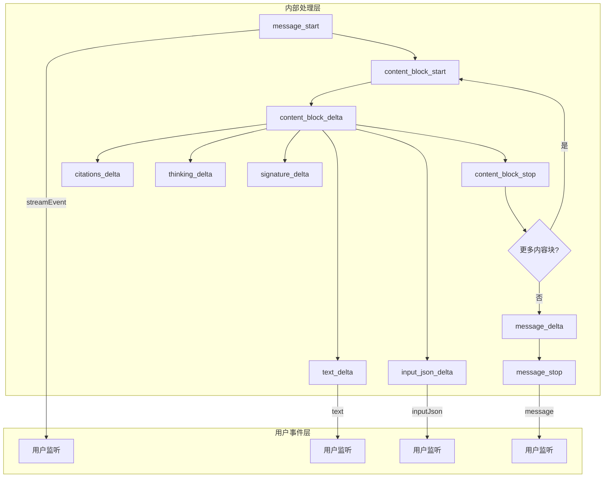

# MessageStream 与 Anthropic SDK 对比分析报告

## 1. 概述

本文档对比分析 `packages/common-utils/src/llm/message-stream.ts` 与 Anthropic SDK v0.71.2 的 MessageStream 实现差异，重点关注事件系统、消息累积机制和流处理能力。

---

## 2. 事件类型分层架构

Anthropic SDK 采用**分层事件架构**，区分内部原始事件和对外暴露的用户事件：

### 2.1 内部原始事件（6个 - API 层面）

这些事件来自 Anthropic API 的 SSE 流，SDK 内部用它们来构建消息：

| 事件类型 | 定义位置 | 说明 |
|---------|---------|------|
| `message_start` | [`RawMessageStartEvent`](ref/anthropic-sdk-v0.71.2/src/resources/messages/messages.ts:675-679) | 消息开始，包含完整消息快照 |
| `message_delta` | [`RawMessageDeltaEvent`](ref/anthropic-sdk-v0.71.2/src/resources/messages/messages.ts:642-665) | 消息级别变更（stop_reason, usage等） |
| `message_stop` | [`RawMessageStopEvent`](ref/anthropic-sdk-v0.71.2/src/resources/messages/messages.ts:681-683) | 消息结束 |
| `content_block_start` | [`RawContentBlockStartEvent`](ref/anthropic-sdk-v0.71.2/src/resources/messages/messages.ts:622-634) | 内容块开始 |
| `content_block_delta` | [`RawContentBlockDeltaEvent`](ref/anthropic-sdk-v0.71.2/src/resources/messages/messages.ts:614-620) | 内容块增量（文本、JSON、思考等） |
| `content_block_stop` | [`RawContentBlockStopEvent`](ref/anthropic-sdk-v0.71.2/src/resources/messages/messages.ts:636-640) | 内容块结束 |

**这些事件主要用于 SDK 内部消息累积，不需要全部对外暴露。**

### 2.2 对外暴露的用户事件（12个）

定义在 [`MessageStreamEvents`](ref/anthropic-sdk-v0.71.2/src/lib/MessageStream.ts:20-34) 接口中：

| 事件 | 触发时机 | 必要性 |
|------|---------|--------|
| `connect` | 连接建立时 | 可选 - 用于连接状态感知 |
| `streamEvent` | 每个原始事件触发 | **推荐** - 提供原始事件+快照 |
| `text` | 收到 text_delta 时 | **核心** - 文本流主要消费方式 |
| `citation` | 收到 citations_delta 时 | 可选 - 仅特定模型支持 |
| `inputJson` | 收到 input_json_delta 时 | **推荐** - 工具参数实时解析 |
| `thinking` | 收到 thinking_delta 时 | 可选 - 仅特定模型支持 |
| `signature` | 收到 signature_delta 时 | 可选 - 仅特定模型支持 |
| `message` | message_stop 时 | **核心** - 完整消息可用 |
| `contentBlock` | content_block_stop 时 | 可选 - 内容块完成通知 |
| `finalMessage` | 流结束时 | **核心** - 最终消息确认 |
| `error` | 发生错误时 | **核心** - 错误处理 |
| `abort` | 流中止时 | **核心** - 中止处理 |
| `end` | 流结束时 | **核心** - 流结束通知 |

### 2.3 Anthropic SDK 事件处理流程



在 [`MessageStream.#addStreamEvent`](ref/anthropic-sdk-v0.71.2/src/lib/MessageStream.ts:430-491) 中：

1. **所有原始事件**都先调用 [`#accumulateMessage`](ref/anthropic-sdk-v0.71.2/src/lib/MessageStream.ts:538-652) 更新消息快照
2. **所有原始事件**都触发 `streamEvent` 事件（携带原始事件和快照）
3. **特定原始事件**触发对应的用户友好事件

---

## 3. 现有实现与 Anthropic SDK 的差异对比

### 3.1 事件类型定义对比

#### 现有实现（6个用户事件）
```typescript
// packages/common-utils/src/llm/message-stream-events.ts:12-18
export type MessageStreamEventType =
  | 'streamEvent'       // 流事件
  | 'text'              // 文本增量
  | 'toolCall'          // 工具调用
  | 'error'             // 错误
  | 'abort'             // 中止
  | 'end';              // 结束
```

#### Anthropic SDK（12个用户事件）
```typescript
// ref/anthropic-sdk-v0.71.2/src/lib/MessageStream.ts:20-34
export interface MessageStreamEvents {
  connect: () => void;
  streamEvent: (event: MessageStreamEvent, snapshot: Message) => void;
  text: (textDelta: string, textSnapshot: string) => void;
  citation: (citation: TextCitation, citationsSnapshot: TextCitation[]) => void;
  inputJson: (partialJson: string, jsonSnapshot: unknown) => void;
  thinking: (thinkingDelta: string, thinkingSnapshot: string) => void;
  signature: (signature: string) => void;
  message: (message: Message) => void;
  contentBlock: (content: ContentBlock) => void;
  finalMessage: (message: Message) => void;
  error: (error: AnthropicError) => void;
  abort: (error: APIUserAbortError) => void;
  end: () => void;
}
```

**核心缺失（推荐添加）：**
- `streamEvent` - 统一暴露原始事件+快照 ✅ **重要**
- `inputJson` - 工具参数实时解析 ✅ **重要**
- `message` - 完整消息接收 ✅ **重要**
- `finalMessage` - 最终消息确认 ✅ **重要**

**可选添加（特定场景）：**
- `connect` - 连接建立（可选）
- `citation` - 引用增量（仅特定模型）
- `thinking` - 思考内容（仅特定模型）
- `signature` - 签名（仅特定模型）
- `contentBlock` - 内容块完成（可选）

### 3.2 事件参数差异

#### 现有实现
```typescript
// 文本事件传递事件对象
interface MessageStreamTextEvent {
  type: 'text';
  delta: string;
  snapshot: string;  // 只是文本快照
}

// streamEvent 只传递事件数据，缺少消息快照
interface MessageStreamStreamEvent {
  type: 'streamEvent';
  event: {
    type: string;
    data: any;
  };
  snapshot: LLMMessage | null;  // 有但可能不完整
}
```

#### Anthropic SDK
```typescript
// 文本事件传递展开参数
text: (textDelta: string, textSnapshot: string) => void;

// streamEvent 同时传递原始事件和消息快照
streamEvent: (event: MessageStreamEvent, snapshot: Message) => void;
```

**关键差异：**
- Anthropic SDK 的 `streamEvent` 始终携带 **完整消息快照**
- Anthropic SDK 的事件监听器接收 **展开参数**（更简洁），现有实现接收 **事件对象**
- 现有实现的 `snapshot` 在 `streamEvent` 中可能为 null，不够可靠

### 3.3 消息累积机制对比

#### 现有实现 [`accumulateMessage`](packages/common-utils/src/llm/message-stream.ts:378-520)

**问题：**
1. 使用 `switch` 语句处理事件，但缺少 `index` 字段处理（Anthropic 的 delta 事件包含 `index` 指明是哪个内容块）
2. 工具输入解析逻辑复杂，使用 `JSON_BUF_PROPERTY` 模式但实现不完整
3. 缺少对 `server_tool_use` 类型的支持
4. `message_delta` 处理不完整，缺少 usage 字段的完整更新

```typescript
// 现有实现的问题：没有使用 event.index 来定位内容块
case 'content_block_delta': {
  const lastBlock = this.currentMessageSnapshot.content[this.currentMessageSnapshot.content.length - 1];
  // 应该使用 event.index 而不是总是取最后一个
}
```

#### Anthropic SDK [`#accumulateMessage`](ref/anthropic-sdk-v0.71.2/src/lib/MessageStream.ts:538-652)

**优势：**
1. 使用 `event.index` 精确定位内容块
2. 使用 `partialParse` 进行增量 JSON 解析
3. 通过非枚举属性 `JSON_BUF_PROPERTY` 存储原始 JSON 缓冲区
4. 完整的 usage 字段更新逻辑

```typescript
// Anthropic 的正确做法
case 'content_block_delta': {
  const snapshotContent = snapshot.content.at(event.index);  // 使用 index 定位
  // ...
  case 'input_json_delta': {
    let jsonBuf = (snapshotContent as any)[JSON_BUF_PROPERTY] || '';
    jsonBuf += event.delta.partial_json;
    newContent.input = partialParse(jsonBuf);  // 增量解析
  }
}
```

### 3.4 流事件处理流程对比

#### 现有实现流程
```
原始事件 → accumulateMessage() → 更新内部状态 → 选择性触发高层事件
```

**问题：** 没有统一的 `streamEvent` 触发，原始事件被"吞掉"了

#### Anthropic SDK 流程
```
原始事件 → #accumulateMessage() → 更新消息快照 → 触发 streamEvent(事件, 快照) → 触发特定事件
```

**优势：** 用户可以同时监听原始事件和高层抽象事件

### 3.5 AsyncIterable 实现对比

#### 现有实现
```typescript
// packages/common-utils/src/llm/message-stream.ts:533-591
[Symbol.asyncIterator](): AsyncIterator<InternalStreamEvent>
```
- 迭代的是 `InternalStreamEvent`（内部格式）
- 需要手动转换

#### Anthropic SDK
```typescript
// ref/anthropic-sdk-v0.71.2/src/lib/MessageStream.ts:654-713
[Symbol.asyncIterator](): AsyncIterator<MessageStreamEvent>
```
- 直接迭代 `MessageStreamEvent`（原始 API 事件）
- 更符合用户预期

**注意：** 这里的 `MessageStreamEvent` 指的是**原始 API 事件**（6个之一），不是用户事件。这是为了让用户能够直接访问底层流数据。

### 3.6 工具调用处理对比

#### 现有实现
- 在 `content_block_stop` 时触发 `toolCall` 事件
- 只处理 `tool_use` 类型，缺少 `server_tool_use` 支持
- JSON 解析在 `content_block_stop` 时一次性完成

#### Anthropic SDK
- 提供 `tracksToolInput` 类型守卫函数
- 支持 `tool_use` 和 `server_tool_use`
- 使用 `partialParse` 进行增量 JSON 解析
- 在 `inputJson` 事件中实时传递解析进度

---

## 4. 关键改进建议（按优先级排序）

### 4.1 高优先级：核心事件增强

**1. 改进 `streamEvent` 事件**
- 始终传递 `(event, snapshot)` 两个参数
- 确保 `snapshot` 是完整的当前消息状态
- 这是用户访问原始事件的主要入口

**2. 添加 `inputJson` 事件**
- 在收到 `input_json_delta` 时触发
- 传递 `(partialJson, parsedSnapshot)`
- 支持工具参数的实时解析和验证

**3. 添加 `message` 事件**
- 在 `message_stop` 时触发
- 传递完整的 `LLMMessage` 对象
- 替代现有的 `toolCall` 事件（不够通用）

**4. 添加 `finalMessage` 事件**
- 在流正常结束时触发
- 传递最终完整消息
- 与 `end` 事件区分（`end` 在错误/中止时也会触发）

### 4.2 中优先级：消息累积机制改进

**1. 使用 `index` 定位内容块**
```typescript
// 当前实现（有问题）
const lastBlock = this.currentMessageSnapshot.content[
  this.currentMessageSnapshot.content.length - 1
];

// 改进后
const targetBlock = this.currentMessageSnapshot.content.at(event.index);
```

**2. 引入增量 JSON 解析**
- 在 `input_json_delta` 处理中使用 `partial-json-parser`
- 实时解析工具参数，提供部分解析结果

**3. 完善 usage 更新**
- 处理 `message_delta` 中的所有 usage 字段
- 包括缓存相关的 token 统计

### 4.3 低优先级：可选增强

**1. 添加 `connect` 事件**
- 在建立连接时触发
- 用于连接状态监控

**2. 考虑添加模型特定事件**
- `citation` - 仅当使用支持引用的模型时
- `thinking` / `signature` - 仅当使用 Extended Thinking 时

**3. 改进 AsyncIterable**
- 直接迭代原始 API 事件类型
- 提供更底层的访问能力

---

## 5. 实施计划（分阶段）

### 阶段 1: 核心事件增强（高优先级）
- [ ] 修改 `streamEvent` 事件参数，始终传递 `(event, snapshot)`
- [ ] 添加 `inputJson` 事件，支持工具参数实时解析
- [ ] 添加 `message` 事件，在 `message_stop` 时触发
- [ ] 添加 `finalMessage` 事件，在流正常结束时触发
- [ ] 保持现有事件（`text`, `toolCall`, `error`, `abort`, `end`）向后兼容

### 阶段 2: 消息累积机制修复（中优先级）
- [ ] 重构 `accumulateMessage` 方法，使用 `event.index` 定位内容块
- [ ] 引入 `partial-json-parser` 进行增量 JSON 解析
- [ ] 完善 `message_delta` 中的 usage 字段处理

### 阶段 3: 可选增强（低优先级）
- [ ] 添加 `connect` 事件
- [ ] 根据模型能力选择性触发 `citation`, `thinking`, `signature` 事件
- [ ] 改进 AsyncIterable 实现，直接迭代原始事件

### 阶段 4: 测试和验证
- [ ] 添加单元测试覆盖新事件
- [ ] 验证与 Anthropic API 的兼容性
- [ ] 性能测试确保无回归

---

## 6. 代码示例对比

### 现有使用方式
```typescript
const stream = new MessageStream();
stream.on('text', (event) => {
  console.log(event.delta);  // 访问增量
  console.log(event.snapshot); // 访问快照
});
stream.on('toolCall', (event) => {
  console.log(event.toolCall); // 工具调用信息
});
```

### 改进后的使用方式（类似 Anthropic SDK）
```typescript
const stream = new MessageStream();

// 监听所有原始事件（调试/监控用）
stream.on('streamEvent', (event, snapshot) => {
  console.log('原始事件:', event.type);
  console.log('消息快照:', snapshot);
});

// 监听文本增量（主要使用方式）
stream.on('text', (delta, snapshot) => {
  console.log('文本增量:', delta);
  console.log('完整文本:', snapshot);
});

// 监听工具参数实时解析（新功能）
stream.on('inputJson', (partialJson, parsedSnapshot) => {
  console.log('JSON片段:', partialJson);
  console.log('当前解析结果:', parsedSnapshot);
});

// 监听完整消息（替代 toolCall）
stream.on('message', (message) => {
  console.log('完整消息:', message);
});

// 监听最终消息
stream.on('finalMessage', (message) => {
  console.log('最终消息:', message);
});
```

---

## 7. 总结

### 架构理解

Anthropic SDK 采用**分层事件架构**：
- **内部层**：6 个原始 API 事件（`message_start`, `message_delta` 等）用于消息累积
- **用户层**：12 个用户友好事件（`text`, `inputJson`, `message` 等）对外暴露

### 核心差距（需要改进）

1. **`streamEvent` 事件不完善**
   - 当前：只传递事件数据，snapshot 可能为 null
   - 目标：始终传递 `(event, snapshot)`，snapshot 保证完整

2. **缺少 `inputJson` 事件**
   - 当前：只能在 `toolCall` 时获取完整工具参数
   - 目标：实时获取工具参数解析进度

3. **消息累积机制问题**
   - 当前：未使用 `event.index`，总是取最后一个内容块
   - 目标：精确定位内容块，支持增量 JSON 解析

### 不需要迁移的内容

- **6 个原始 API 事件**（`message_start`, `message_delta` 等）- 这些是内部实现细节，通过 `streamEvent` 暴露即可
- **模型特定事件**（`citation`, `thinking`, `signature`）- 根据实际需求选择性添加
- **`server_tool_use` 支持** - 如果当前项目不使用 Anthropic 的 server tools，可暂不实现

### 建议实施顺序

1. **立即实施**：修复 `streamEvent`，添加 `message` 和 `finalMessage`
2. **短期实施**：添加 `inputJson` 事件，修复 `index` 定位问题
3. **按需实施**：其他可选事件根据实际业务需求添加