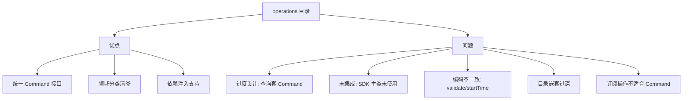

# sdk/api/operations 目录设计分析

## 一、当前结构概览

```
operations/
├── core/                          # 核心操作
│   ├── execution/commands/        # 工作流执行（4个command）
│   ├── llm/commands/              # LLM生成（2个command）
│   ├── scripts/commands/          # 脚本执行（3个command）
│   └── tools/commands/            # 工具执行（3个command）
├── management/                    # 管理操作
│   ├── checkpoints/commands/      # 检查点管理（4个command）
│   └── triggers/commands/         # 触发器管理（3个command）
└── monitoring/                    # 监控操作
    ├── events/commands/           # 事件监听/查询（6个command）
    ├── messages/commands/         # 消息查询（5个command）
    └── state/commands/            # 状态变量查询（4个command）
```

共计 **34个 Command 文件**，按 `core / management / monitoring` 三大类组织。

## 二、设计优点

### 1. 清晰的领域分类
三层分类（core/management/monitoring）与 [`CommandMetadata.category`](sdk/api/core/command.ts:17) 的枚举值 `execution | monitoring | management` 对应，语义一致。

### 2. 统一的 Command 接口
所有操作都继承 [`BaseCommand<T>`](sdk/api/core/command.ts:82)，遵循统一的 `execute() / validate() / getMetadata()` 契约，便于通过 [`CommandExecutor`](sdk/api/core/command-executor.ts:26) 统一执行和中间件处理。

### 3. 支持依赖注入
大部分 command 的构造函数都支持注入依赖（如 `threadRegistry`、`eventManager`），默认使用全局单例，测试时可替换，可测试性好。

### 4. 每个 command 职责单一
每个文件只做一件事，符合单一职责原则。

## 三、设计问题

### 问题1：过度的目录嵌套 — 冗余的 `commands/` 层

每个子领域下都有一个 `commands/` 目录，但该目录下**只有 command 文件**，没有其他类型的文件（如 query、handler 等）。这导致路径冗长且无信息增益：

```
operations/monitoring/events/commands/get-event-stats-command.ts
                              ^^^^^^^^ 这一层是多余的
```

**建议**：去掉 `commands/` 层，直接放在领域目录下：
```
operations/monitoring/events/get-event-stats-command.ts
```

### 问题2：Command 模式的滥用 — 查询操作不适合 Command

Command 模式的核心价值在于：**封装可执行、可撤销、可排队的操作**。但 operations 中大量 command 是**纯查询**操作：

| Command | 本质 |
|---------|------|
| [`GetMessagesCommand`](sdk/api/operations/monitoring/messages/commands/get-messages-command.ts:30) | 查询消息列表 |
| [`GetVariableCommand`](sdk/api/operations/monitoring/state/commands/get-variable-command.ts:26) | 读取变量值 |
| [`GetEventStatsCommand`](sdk/api/operations/monitoring/events/commands/get-event-stats-command.ts:39) | 统计事件 |
| [`HasVariableCommand`](sdk/api/operations/monitoring/state/commands/index.ts:4) | 检查变量是否存在 |
| [`GetCheckpointsCommand`](sdk/api/operations/management/checkpoints/commands/index.ts:3) | 查询检查点列表 |

这些查询操作：
- 不需要 `undo()`
- 不需要 `validate()` 的复杂验证（通常只检查 ID 非空）
- 不需要中间件链的 before/after 处理
- 包装成 Command 增加了不必要的样板代码

**建议**：采用 CQRS 思想，将查询操作与命令操作分离。查询可以直接作为简单函数或 Query 类，不必强制套用 Command 接口。

### 问题3：validate() 在 execute() 中重复调用

[`CommandExecutor.execute()`](sdk/api/core/command-executor.ts:62) 已经在执行前调用 `command.validate()`，但多个 command 实现（如 [`GetEventStatsCommand.execute()`](sdk/api/operations/monitoring/events/commands/get-event-stats-command.ts:78)、[`GetVariableCommand.execute()`](sdk/api/operations/monitoring/state/commands/get-variable-command.ts:70)、[`EnableTriggerCommand.execute()`](sdk/api/operations/management/triggers/commands/enable-trigger-command.ts:69)）在 `execute()` 内部又重复调用了 `this.validate()`。

这导致：
- 验证逻辑被执行两次
- 不一致的编码风格（有些 command 重复调用，有些不调用）

**建议**：统一约定 — 验证由 `CommandExecutor` 负责，command 的 `execute()` 不再自行调用 `validate()`。

### 问题4：startTime 计时不一致

[`BaseCommand`](sdk/api/core/command.ts:82) 已提供 `startTime` 和 `getExecutionTime()` 方法，但部分 command（如 [`GetEventStatsCommand`](sdk/api/operations/monitoring/events/commands/get-event-stats-command.ts:79)、[`GetMessagesCommand`](sdk/api/operations/monitoring/messages/commands/get-messages-command.ts:79)）在 `execute()` 中自行声明 `const startTime = Date.now()` 而不使用基类的方法。

另一些 command（如 [`ExecuteWorkflowCommand`](sdk/api/operations/core/execution/commands/execute-workflow-command.ts:36)、[`PauseThreadCommand`](sdk/api/operations/core/execution/commands/pause-thread-command.ts:20)）则正确使用了 `this.getExecutionTime()`。

**建议**：统一使用基类的 `getExecutionTime()`，消除重复的计时逻辑。

### 问题5：OnEventCommand 等不适合 Command 模式

[`OnEventCommand`](sdk/api/operations/monitoring/events/commands/on-event-command.ts:25) 注册事件监听器，返回 `() => void`（取消订阅函数）。这本质上是一个**订阅操作**，不是一次性的命令执行。将其包装为 Command：
- 语义不匹配（Command 暗示一次性执行）
- 返回的取消函数被包在 `ExecutionResult` 中，使用不便
- 无法利用 Command 的 undo/redo 语义

类似的还有 [`OffEventCommand`](sdk/api/operations/monitoring/events/commands/index.ts:3)、[`OnceEventCommand`](sdk/api/operations/monitoring/events/commands/index.ts:2)。

**建议**：事件订阅/取消订阅应作为 API 层的直接方法，不需要 Command 包装。

### 问题6：operations 与 resources 的职责边界模糊

当前 api 层有两个并行的组织：
- [`resources/`](sdk/api/resources) — 直接封装 Registry 的 CRUD 方法（如 `WorkflowRegistryAPI`、`ThreadRegistryAPI`）
- [`operations/`](sdk/api/operations) — 用 Command 模式封装操作

但 [`SDK`](sdk/api/core/sdk.ts:21) 主类只引用了 `resources`，完全没有引用 `operations`。operations 中的 command 只在测试和示例中被使用，[`ExecutionBuilder`](sdk/api/builders/execution-builder.ts:116) 中对 Command 的使用也被注释掉了（TODO 状态）。

这意味着 **operations 目录目前处于未集成状态**，是一个半成品。

### 问题7：ExecuteBatchCommand 命名冲突

[`core/tools/commands/`](sdk/api/operations/core/tools/commands/index.ts:7) 和 [`core/scripts/commands/`](sdk/api/operations/core/scripts/commands/index.ts:7) 都导出了 `ExecuteBatchCommand`，在 [`index.ts`](sdk/api/index.ts:62) 中需要用别名区分：

```typescript
export { ExecuteBatchCommand as ExecuteToolBatchCommand } from './operations/core/tools/commands';
export { ExecuteBatchCommand as ExecuteScriptBatchCommand } from './operations/core/scripts/commands';
```

**建议**：在源头就使用有区分度的命名，如 `ExecuteToolBatchCommand` 和 `ExecuteScriptBatchCommand`。

### 问题8：category 类型与实际分类不完全匹配

[`CommandMetadata.category`](sdk/api/core/command.ts:17) 定义了三个值：`execution | monitoring | management`。但 `core/` 目录下的 command 全部标记为 `execution`，包括 LLM 生成、工具执行、脚本执行。目录结构用 `core` 分类，元数据用 `execution` 分类，两套分类体系不一致。

## 四、整体评价



**总体结论**：operations 目录的**架构意图是好的**（统一操作接口、支持中间件），但存在**过度设计**和**未完成集成**两个核心问题。查询操作不应强制使用 Command 模式，事件订阅也不适合 Command 语义。此外，编码风格不一致（validate 重复调用、计时方式不统一）降低了代码质量。

## 五、改进建议总结

| # | 问题 | 建议 |
|---|------|------|
| 1 | 冗余 commands/ 层 | 去掉 commands/ 中间层 |
| 2 | 查询滥用 Command | 引入 Query 概念或直接用函数 |
| 3 | validate 重复调用 | 统一由 Executor 负责验证 |
| 4 | startTime 不一致 | 统一使用基类 getExecutionTime |
| 5 | 订阅操作不适合 Command | 事件订阅作为直接 API 方法 |
| 6 | 未集成到 SDK 主类 | 完成集成或重新评估必要性 |
| 7 | 命名冲突 | 源头使用有区分度的命名 |
| 8 | category 与目录分类不一致 | 统一分类体系 |