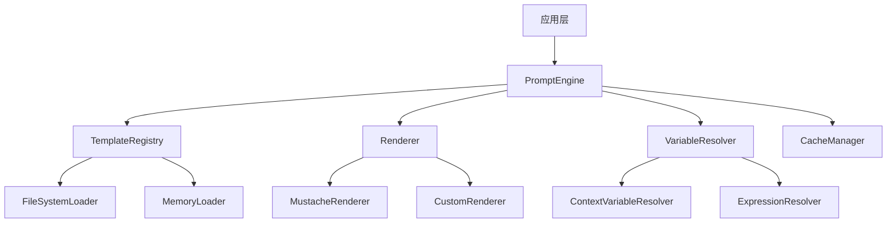

# 提示词模块分析报告

## 1. 当前项目中的提示词消息构建和模板操作现状

### 1.1 现有代码分析

#### 消息构建
- **MessageBuilder** (`sdk/core/messages/message-builder.ts`): 提供基础消息构建功能
  - `buildUserMessage()`: 构建用户消息
  - `buildAssistantMessage()`: 构建助手消息（支持工具调用和思考）
  - `buildToolMessage()`: 构建工具结果消息
  - `buildSystemMessage()`: 构建系统消息
  - `buildToolDescriptionMessage()`: 构建工具描述消息

#### 消息辅助工具
- **MessageHelper** (`sdk/core/llm/message-helper.ts`): 提供消息提取、过滤等辅助功能
  - `extractSystemMessage()`: 提取系统消息
  - `filterSystemMessages()`: 过滤系统消息
  - `extractAndFilterSystemMessages()`: 提取并分离系统消息
  - `getLastUserMessage()`: 获取最后一条用户消息

#### 模板变量替换
- **Payload Generator** (`sdk/core/execution/handlers/hook-handlers/utils/payload-generator.ts`):
  - `resolveTemplateVariable()`: 解析 `{{variable}}` 格式的模板变量
  - 支持从评估上下文中获取变量值
  - 支持布尔值和数字转换

#### 配置中的提示词模板
- **配置文件** (`configs/prompts/`): 包含丰富的提示词模板配置
  - 使用 TOML 格式定义模板
  - 支持复合模板（引用其他模板片段）
  - 支持变量占位符（如 `{{user_input}}`）
  - 目录结构：`templates/`, `system/`, `rules/`, `user_commands/`

### 1.2 使用场景和痛点

#### 使用场景
1. **LLM节点配置**: 在 `NodeBuilder.llm()` 和 `WorkflowBuilder.addLLMNode()` 中直接使用 `prompt` 字符串
2. **用户交互节点**: 在 `UserInteractionHandler` 中使用 `prompt` 字段和 `{{input}}` 占位符
3. **Hook事件载荷**: 使用 `{{variable}}` 模板变量替换
4. **配置文件**: 通过 TOML 模板定义复杂的提示词组合

#### 痛点分析
1. **分散的实现**: 提示词构建逻辑分散在多个文件中，缺乏统一接口
2. **有限的模板功能**: 当前仅支持简单的 `{{variable}}` 替换，缺乏条件逻辑、循环、模板继承等高级功能
3. **配置与代码耦合**: 应用层难以自定义提示词模板，需要修改 SDK 核心代码
4. **缺乏类型安全**: 模板变量没有类型检查和编译时验证
5. **性能问题**: 每次执行时都需要解析模板，缺乏缓存机制
6. **测试困难**: 没有专门的测试工具验证模板渲染结果

### 1.3 添加专门提示词模块的必要性和收益

#### 必要性
1. **统一接口**: 为所有提示词相关操作提供统一、一致的 API
2. **可扩展性**: 允许应用层添加自定义模板引擎和渲染器
3. **解耦**: 将提示词逻辑从 SDK 核心中分离，便于独立演进
4. **标准化**: 建立标准的提示词模板格式和最佳实践

#### 收益
1. **开发效率**: 提供高级模板功能，减少重复代码
2. **维护性**: 集中管理提示词逻辑，便于调试和优化
3. **灵活性**: 应用层可以轻松替换或扩展模板引擎
4. **性能**: 通过缓存和预编译提升模板渲染性能
5. **可测试性**: 提供专门的测试工具和验证机制

## 2. 提示词模块架构设计

### 2.1 位置选择：packages/prompt-engine

**理由**:
1. **独立于 SDK 核心**: 允许应用层在不修改 SDK 的情况下使用或替换
2. **可复用性**: 其他包（如 script-executors、tool-executors）也可以使用
3. **依赖关系**: 依赖于 `@modular-agent/types` 和 `@modular-agent/common-utils`，不依赖 SDK 核心
4. **符合项目结构**: 与现有的 `packages/common-utils`、`packages/types` 等保持一致

### 2.2 核心组件设计



### 2.3 模块结构

```
packages/prompt-engine/
├── src/
│   ├── index.ts                    # 主导出
│   ├── types/                      # 类型定义
│   │   ├── template.ts
│   │   ├── context.ts
│   │   └── render-options.ts
│   ├── engine/                     # 核心引擎
│   │   ├── prompt-engine.ts
│   │   └── prompt-engine-factory.ts
│   ├── registry/                   # 模板注册表
│   │   ├── template-registry.ts
│   │   ├── loader/                 # 加载器
│   │   │   ├── file-system-loader.ts
│   │   │   ├── memory-loader.ts
│   │   │   └── loader-interface.ts
│   │   └── cache/                  # 缓存
│   │       ├── cache-manager.ts
│   │       └── lru-cache.ts
│   ├── renderer/                   # 渲染器
│   │   ├── renderer-interface.ts
│   │   ├── mustache-renderer.ts    # Mustache 实现
│   │   ├── handlebars-renderer.ts  # Handlebars 实现
│   │   └── simple-renderer.ts      # 简单 {{var}} 替换
│   ├── resolver/                   # 变量解析器
│   │   ├── variable-resolver.ts
│   │   ├── context-resolver.ts
│   │   ├── expression-resolver.ts
│   │   └── path-resolver.ts
│   ├── builder/                    # 构建器（可选）
│   │   ├── prompt-builder.ts
│   │   └── message-builder-ext.ts  # 扩展 MessageBuilder
│   ├── utils/                      # 工具函数
│   │   ├── template-validator.ts
│   │   ├── variable-extractor.ts
│   │   └── format-utils.ts
│   └── config/                     # 配置
│       ├── toml-parser.ts          # TOML 解析器
│       └── config-loader.ts
├── __tests__/                      # 测试
├── package.json
├── tsconfig.json
└── README.md
```

### 2.4 关键接口设计

#### PromptEngine 接口
```typescript
interface PromptEngine {
  // 模板管理
  registerTemplate(name: string, template: string | TemplateDefinition): void;
  getTemplate(name: string): TemplateDefinition | null;
  loadTemplatesFromDirectory(path: string): Promise<void>;
  
  // 渲染
  render(templateName: string, context: RenderContext): Promise<string>;
  renderTemplate(template: string, context: RenderContext): Promise<string>;
  
  // 变量解析
  resolveVariable(path: string, context: RenderContext): any;
  
  // 缓存管理
  clearCache(): void;
  enableCache(enable: boolean): void;
}
```

#### TemplateDefinition 接口
```typescript
interface TemplateDefinition {
  name: string;
  content: string;
  format?: 'mustache' | 'handlebars' | 'simple';
  metadata?: Record<string, any>;
  variables?: VariableDefinition[];
  parts?: TemplatePart[]; // 用于复合模板
}

interface VariableDefinition {
  name: string;
  type: 'string' | 'number' | 'boolean' | 'object' | 'array';
  required?: boolean;
  defaultValue?: any;
  description?: string;
}
```

### 2.5 与现有系统的集成

1. **替换 MessageBuilder 中的硬编码提示词**: 使用模板引擎动态生成
2. **增强 UserInteractionHandler**: 支持更复杂的模板语法
3. **集成到 NodeTemplateBuilder**: 允许节点配置引用模板名称而非硬编码提示词
4. **提供 SDK 适配器**: 在 SDK 中提供默认的 PromptEngine 实例，应用层可以替换

## 3. 实施计划

### 阶段 1: 基础框架 (1-2 周)
1. 创建 `packages/prompt-engine` 包结构
2. 实现核心类型定义和接口
3. 实现简单的渲染器（{{variable}} 替换）
4. 实现基本的模板注册表
5. 编写单元测试

### 阶段 2: 高级功能 (1-2 周)
1. 实现 Mustache 或 Handlebars 渲染器
2. 实现变量解析器（支持路径如 `user.name`）
3. 实现表达式解析器（支持简单运算）
4. 实现模板缓存机制
5. 添加 TOML 配置文件支持

### 阶段 3: 集成与适配 (1 周)
1. 创建 SDK 适配器层
2. 替换现有代码中的硬编码提示词
3. 更新配置加载逻辑以使用新引擎
4. 提供迁移指南

### 阶段 4: 优化与文档 (1 周)
1. 性能优化和基准测试
2. 编写完整文档和示例
3. 创建集成测试
4. 发布到内部包仓库

## 4. 待办事项列表

### 4.1 立即行动项
- [ ] 创建 `packages/prompt-engine` 目录结构
- [ ] 初始化 package.json 和 tsconfig.json
- [ ] 定义核心类型接口
- [ ] 实现 TemplateRegistry 基础版本
- [ ] 实现 SimpleRenderer（{{variable}} 替换）
- [ ] 编写基础单元测试

### 4.2 后续开发项
- [ ] 实现 MustacheRenderer
- [ ] 实现 VariableResolver 支持路径解析
- [ ] 实现 FileSystemLoader 加载 TOML 配置
- [ ] 实现 LRU 缓存机制
- [ ] 创建 PromptEngineFactory 单例模式
- [ ] 编写集成测试示例

### 4.3 集成项
- [ ] 创建 SDK 适配器：`sdk/core/prompt/prompt-adapter.ts`
- [ ] 更新 MessageBuilder 支持模板渲染
- [ ] 更新 UserInteractionHandler 使用模板引擎
- [ ] 更新 NodeTemplateBuilder 支持模板引用
- [ ] 提供应用层配置示例

### 4.4 文档项
- [ ] 编写 API 文档
- [ ] 创建使用示例
- [ ] 编写迁移指南
- [ ] 更新项目文档中的提示词部分

## 5. 风险与缓解措施

### 风险 1: 性能影响
- **缓解**: 实现缓存机制，预编译模板，提供性能基准测试

### 风险 2: 向后兼容性
- **缓解**: 保持现有 API 不变，提供适配层，逐步迁移

### 风险 3: 学习曲线
- **缓解**: 提供详细文档和示例，保持接口简单直观

### 风险 4: 依赖增加
- **缓解**: 保持依赖最小化，可选高级渲染器作为 peer dependency

## 6. 结论

添加专门的提示词模块是必要的，它将：
1. 统一分散的提示词逻辑
2. 提供强大的模板功能
3. 提高代码可维护性
4. 增强应用层灵活性

建议在 `packages/prompt-engine` 中实现，采用分层架构，逐步替换现有实现。