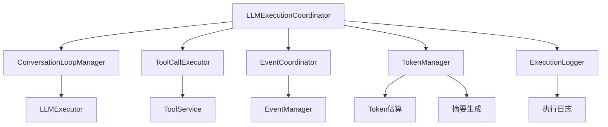

# Tool Call解析与LLMExecutionCoordinator重构分析

## 当前项目Tool Call解析机制

### 1. Tool Call解析流程

#### LLM响应解析
- **位置**: [`OpenAIChatClient.parseResponse()`](sdk/core/llm/clients/openai-chat.ts:125)
- **解析逻辑**:
  ```typescript
  toolCalls: message.tool_calls ? this.parseToolCalls(message.tool_calls) : undefined
  ```
- **工具调用结构转换**:
  ```typescript
  private parseToolCalls(toolCalls: any[]): LLMToolCall[] {
    return toolCalls.map(call => ({
      id: call.id,
      type: call.type,
      function: {
        name: call.function.name,
        arguments: call.function.arguments
      }
    }));
  }
  ```

#### LLM执行器处理
- **位置**: [`LLMExecutor.executeLLMCall()`](sdk/core/execution/llm-executor.ts:127)
- **格式标准化**:
  ```typescript
  toolCalls: finalResult.toolCalls?.map(tc => ({
    id: tc.id,
    name: tc.function.name,
    arguments: tc.function.arguments
  }))
  ```

#### 工具调用执行
- **位置**: [`LLMExecutionCoordinator.executeToolCalls()`](sdk/core/execution/coordinators/llm-execution-coordinator.ts:265)
- **执行流程**:
  1. 触发`TOOL_CALL_STARTED`事件
  2. 调用`ToolService.execute()`执行工具
  3. 解析工具参数: `JSON.parse(toolCall.arguments)`
  4. 处理执行结果和错误
  5. 添加工具结果到对话历史
  6. 触发相应事件

### 2. 与Mini-Agent对比分析

#### 相似之处
1. **工具调用循环**: 两者都支持多轮LLM-工具交互
2. **工具执行**: 都通过工具服务/注册表执行工具
3. **错误处理**: 都捕获工具执行异常并转换为标准格式
4. **消息历史管理**: 都维护完整的对话历史

#### 主要差异

| 特性 | 当前项目 | Mini-Agent |
|------|----------|------------|
| **架构设计** | 分层协调架构 | 单体Agent模式 |
| **职责分离** | 高度分离(协调器、执行器、服务) | 集中在Agent类中 |
| **事件系统** | 完整的事件驱动架构 | 无事件系统 |
| **工具类型** | 支持4种工具类型(STATELESS, STATEFUL, REST, MCP) | 单一工具接口 |
| **Token管理** | 通过ConversationManager管理 | 内置Token估算和摘要功能 |
| **日志记录** | 通过事件系统记录 | 内置详细日志记录 |
| **配置管理** | Profile管理系统 | 直接配置 |

#### Mini-Agent的优势特性
1. **Token管理**: 内置Token估算和自动摘要功能
2. **详细日志**: 完整的请求/响应/工具执行日志
3. **可视化输出**: 丰富的终端颜色和格式化输出
4. **参数截断**: 自动截断长参数避免输出过长

## LLMExecutionCoordinator职责分析

### 当前职责总结
1. **流程协调**: 管理LLM调用和工具调用的完整循环
2. **状态管理**: 通过ConversationManager管理对话状态
3. **事件触发**: 触发各种执行事件
4. **错误处理**: 处理LLM和工具执行错误
5. **Token监控**: 监控Token使用情况

### 职责复杂度评估

#### 高复杂度职责
- **工具调用循环管理**: 处理多轮LLM-工具交互
- **事件触发逻辑**: 分散在多个执行阶段
- **状态管理**: 与ConversationManager紧密耦合
- **错误处理**: 需要处理LLM和工具两层错误

#### 潜在问题
1. **单一职责原则违反**: 协调器承担过多职责
2. **测试复杂性**: 需要模拟多个依赖组件
3. **扩展困难**: 新功能可能进一步增加复杂度
4. **维护成本**: 修改一个功能可能影响多个逻辑

## 重构建议

### 方案1: 职责分离重构

#### 建议拆分组件
1. **ToolCallExecutor**
   - 职责: 专门处理工具调用执行
   - 包含: 工具调用解析、执行、结果处理
   - 位置: `sdk/core/execution/tool-call-executor.ts`

2. **ConversationLoopManager**
   - 职责: 管理LLM-工具调用循环
   - 包含: 循环控制、迭代计数、退出条件
   - 位置: `sdk/core/execution/conversation-loop-manager.ts`

3. **EventCoordinator**
   - 职责: 专门处理事件触发
   - 包含: 事件触发逻辑、事件数据构建
   - 位置: `sdk/core/execution/event-coordinator.ts`

#### 重构后的LLMExecutionCoordinator
```typescript
class LLMExecutionCoordinator {
  constructor(
    private llmExecutor: LLMExecutor,
    private toolCallExecutor: ToolCallExecutor,
    private conversationLoopManager: ConversationLoopManager,
    private eventCoordinator: EventCoordinator
  ) { }

  async executeLLM(params: LLMExecutionParams): Promise<LLMExecutionResponse> {
    // 简化的协调逻辑
    return this.conversationLoopManager.executeLoop(params);
  }
}
```

### 方案2: 功能增强重构

#### 建议新增功能
1. **Token管理**: 集成类似Mini-Agent的Token估算和摘要功能
2. **详细日志**: 添加执行过程的详细日志记录
3. **参数验证**: 在工具调用前验证参数格式
4. **执行监控**: 添加执行时间和性能监控

#### 具体实现建议
```typescript
// Token管理集成
interface TokenManager {
  estimateTokens(messages: LLMMessage[]): number;
  shouldSummarize(currentTokens: number, limit: number): boolean;
  createSummary(messages: LLMMessage[]): Promise<string>;
}

// 增强的协调器
class EnhancedLLMExecutionCoordinator {
  private tokenManager: TokenManager;
  private logger: ExecutionLogger;
  
  async executeLLM(params: LLMExecutionParams): Promise<LLMExecutionResponse> {
    // Token检查
    const tokens = this.tokenManager.estimateTokens(conversationState.getMessages());
    if (this.tokenManager.shouldSummarize(tokens, this.tokenLimit)) {
      await this.tokenManager.createSummary(conversationState.getMessages());
    }
    
    // 记录执行开始
    this.logger.logExecutionStart(params);
    
    // 原有逻辑...
  }
}
```

### 方案3: 混合重构

结合职责分离和功能增强，创建更模块化的架构：



## 具体实施建议

### 第一阶段: 职责分离
1. 提取`ToolCallExecutor`类
2. 提取`ConversationLoopManager`类  
3. 提取`EventCoordinator`类
4. 重构`LLMExecutionCoordinator`为协调入口

### 第二阶段: 功能增强
1. 实现`TokenManager`集成
2. 添加`ExecutionLogger`
3. 增强参数验证和错误处理

### 第三阶段: 优化整合
1. 优化组件间接口
2. 添加单元测试
3. 性能优化和监控

## 结论

当前项目的tool call解析机制设计良好，但`LLMExecutionCoordinator`确实承担了过多职责。参考Mini-Agent的实现，建议采用职责分离的重构方案，同时集成Token管理和详细日志功能，以提升系统的可维护性、可测试性和可观测性。