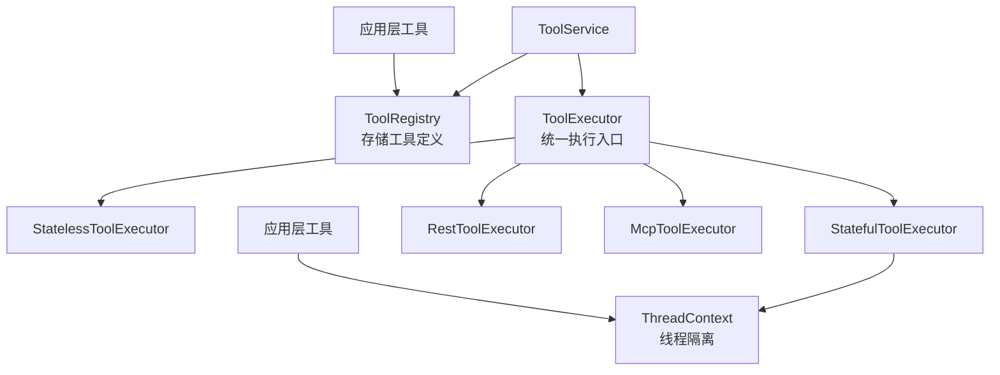
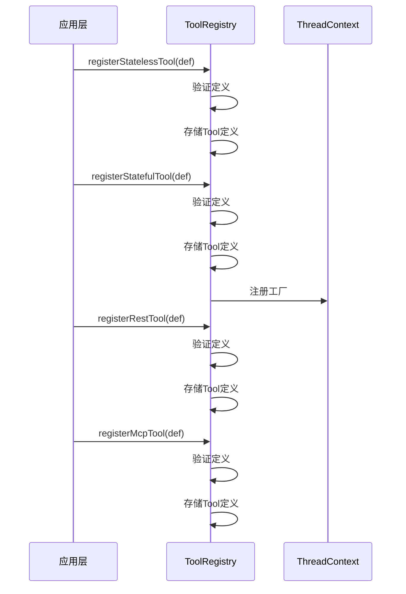
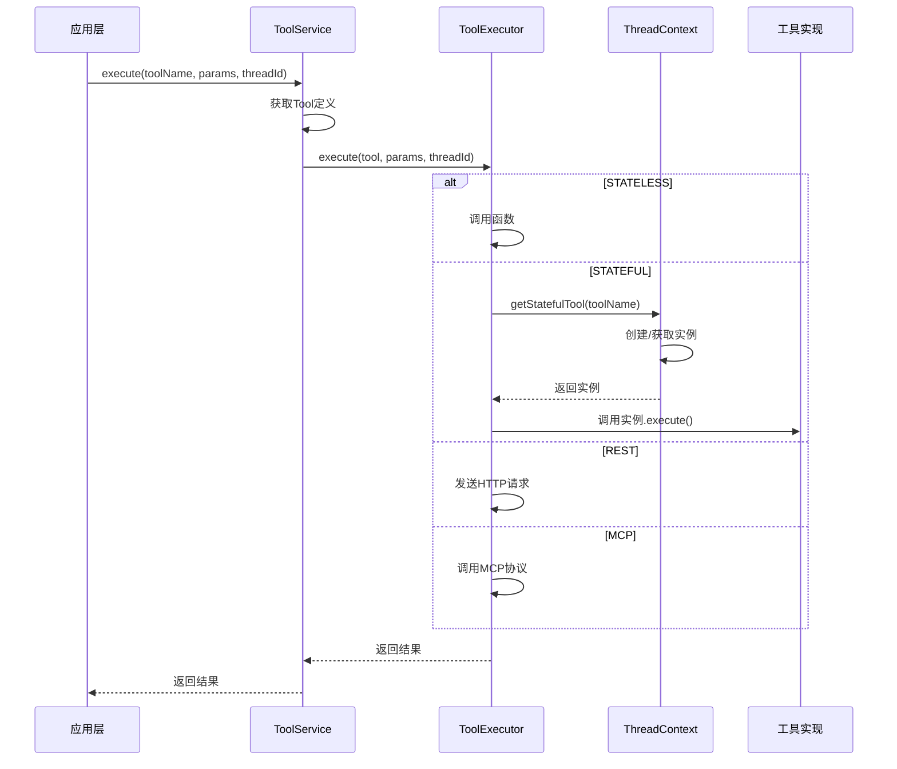

# 工具执行器改造设计文档

## 背景和目标

### 当前问题
1. `BuiltinToolExecutor` 包含硬编码的工具实现（calculator、datetime、string等）
2. 工具实现与执行器耦合，无法灵活扩展
3. 应用层无法自定义内置工具行为

### 改造目标
1. **SDK仅提供执行框架**：不内置任何工具实现
2. **支持4种工具类型**：
   - STATELESS（无状态工具）：应用层提供的纯函数
   - STATEFUL（有状态工具）：应用层提供的类/对象，通过ThreadContext隔离
   - REST（REST工具）：SDK提供HTTP执行逻辑
   - MCP（MCP工具）：SDK提供MCP协议逻辑
3. **简化注册方式**：仅接受函数式注册，避免过度复杂
4. **保持向后兼容**：现有工具配置继续支持

## 架构设计

### 整体架构



### 组件职责

| 组件 | 职责 |
|------|------|
| **ToolService** | 对外API，组合Registry和Executor |
| **ToolRegistry** | 存储和管理工具定义（4种类型） |
| **ToolExecutor** | 统一执行入口，根据工具类型分发到具体执行器 |
| **StatelessToolExecutor** | 执行无状态函数工具 |
| **StatefulToolExecutor** | 通过ThreadContext执行有状态工具实例 |
| **RestToolExecutor** | SDK提供HTTP请求逻辑 |
| **McpToolExecutor** | SDK提供MCP协议逻辑 |
| **ThreadContext** | 管理有状态工具的线程隔离 |

## 工具类型定义

### 1. STATELESS（无状态工具）

**特点**：
- 纯函数，无副作用
- 无状态，可任意次调用
- 应用层提供函数实现

**定义方式**：
```typescript
// 函数方式
registerStatelessTool('calculator', {
  name: 'calculator',
  description: '计算器工具',
  parameters: { /* JSON Schema */ },
  execute: async (params) => { /* 实现 */ }
});
```

### 2. STATEFUL（有状态工具）

**特点**：
- 需要保持状态（如数据库连接、会话）
- 通过ThreadContext实现线程隔离
- 应用层提供工厂函数

**定义方式**：
```typescript
// 工厂函数方式
registerStatefulTool('database', {
  name: 'database',
  description: '数据库工具',
  parameters: { /* JSON Schema */ },
  create: () => new DatabaseTool() // 返回工具实例
});
```

### 3. REST（REST工具）

**特点**：
- SDK提供HTTP执行逻辑
- 应用层只提供配置（URL、headers等）
- 支持参数化请求

**定义方式**：
```typescript
// 配置方式
registerRestTool('weather', {
  name: 'weather',
  description: '天气查询',
  parameters: { /* JSON Schema */ },
  config: {
    baseUrl: 'https://api.weather.com',
    headers: { 'Authorization': 'Bearer xxx' }
  }
});
```

### 4. MCP（MCP工具）

**特点**：
- SDK提供MCP协议逻辑
- 应用层只提供配置（serverName、serverUrl等）
- 支持MCP标准协议

**定义方式**：
```typescript
// 配置方式
registerMcpTool('database', {
  name: 'database',
  description: '数据库操作',
  parameters: { /* JSON Schema */ },
  config: {
    serverName: 'postgres-server',
    serverUrl: 'http://localhost:3000'
  }
});
```

## ThreadContext 设计

### 目的
- 隔离有状态工具在不同线程间的实例
- 防止状态污染和竞争条件

### 实现

```typescript
class ThreadContext {
  private threadId: ID;
  private statefulTools: Map<string, any> = new Map();
  private factories: Map<string, StatefulToolFactory> = new Map();

  // 注册工厂
  registerStatefulTool(toolName: string, factory: StatefulToolFactory): void;

  // 获取实例（懒加载）
  getStatefulTool(toolName: string): any;

  // 清理实例
  cleanupStatefulTool(toolName: string): void;
  cleanupAll(): void;
}

class ThreadContextManager {
  static getOrCreateContext(threadId: ID): ThreadContext;
  static cleanupContext(threadId: ID): void;
}
```

### 使用流程

1. **注册阶段**：应用层注册有状态工具工厂
2. **执行阶段**：
   - 获取当前线程ID
   - 通过ThreadContext获取或创建工具实例
   - 调用实例的execute方法
   - 同一线程内复用实例
3. **清理阶段**：线程结束时清理所有实例

## 数据结构设计

### Tool 类型（更新）

```typescript
export enum ToolType {
  STATELESS = 'STATELESS',  // 无状态工具（原BUILTIN）
  STATEFUL = 'STATEFUL',    // 有状态工具（原NATIVE）
  REST = 'REST',            // REST工具
  MCP = 'MCP'               // MCP工具
}

export interface Tool {
  id: ID;
  name: string;
  type: ToolType;
  description: string;
  parameters: ToolParameters;
  metadata?: ToolMetadata;
  
  // 类型特定配置
  config?: {
    // STATELESS: 无需额外配置
    // STATEFUL: 工厂函数（运行时注册）
    // REST: { baseUrl, headers, ... }
    // MCP: { serverName, serverUrl, ... }
  };
}
```

### 工具定义辅助接口

```typescript
// 无状态工具定义
export interface StatelessToolDefinition {
  name: string;
  description: string;
  parameters: ToolParameters;
  execute: (parameters: Record<string, any>) => Promise<any>;
}

// 有状态工具工厂
export interface StatefulToolFactory {
  create(): any; // 返回工具实例
}

export interface StatefulToolDefinition {
  name: string;
  description: string;
  parameters: ToolParameters;
  factory: StatefulToolFactory;
}

// REST工具配置
export interface RestToolConfig {
  baseUrl?: string;
  headers?: Record<string, string>;
  timeout?: number;
}

export interface RestToolDefinition {
  name: string;
  description: string;
  parameters: ToolParameters;
  config: RestToolConfig;
}

// MCP工具配置
export interface McpToolConfig {
  serverName: string;
  serverUrl?: string;
  timeout?: number;
}

export interface McpToolDefinition {
  name: string;
  description: string;
  parameters: ToolParameters;
  config: McpToolConfig;
}
```

## 执行流程

### 工具注册流程



### 工具执行流程



## 实施步骤

### 阶段1：基础结构
1. 创建 `ThreadContext` 类（线程隔离）
2. 更新 `ToolType` 枚举（4种类型）
3. 更新 `Tool` 类型定义（添加config字段）

### 阶段2：执行器改造
1. 删除 `BuiltinToolExecutor`（合并到STATELESS）
2. 删除 `NativeToolExecutor`（重命名为STATEFUL）
3. 保留并改造 `RestToolExecutor`（SDK提供HTTP逻辑）
4. 保留并改造 `McpToolExecutor`（SDK提供MCP协议逻辑）
5. 创建统一 `ToolExecutor`（分发到具体执行器）

### 阶段3：注册表改造
1. 改造 `ToolRegistry` 支持4种工具类型
2. 添加注册辅助方法（registerStatelessTool等）
3. 集成 ThreadContext 管理

### 阶段4：服务层集成
1. 更新 `ToolService` 集成新架构
2. 更新导出接口
3. 编写示例和测试

### 阶段5：清理和文档
1. 删除旧执行器文件
2. 更新文档
3. 编写迁移指南

## 向后兼容

### 现有工具迁移

```typescript
// 原 BuiltinTool（硬编码）
// 迁移为 STATELESS（应用层提供函数）

// 原 NativeTool（metadata.executor）
// 迁移为 STATEFUL（应用层提供工厂）

// 原 RestTool（metadata.customFields）
// 迁移为 REST（config字段）

// 原 McpTool（metadata.customFields）
// 迁移为 MCP（config字段）
```

### 配置兼容

现有 `configs/tools/__registry__.toml` 配置继续支持，通过适配器转换为新格式。

## 优势

1. **职责清晰**：SDK只提供框架，不实现具体工具
2. **灵活扩展**：应用层可以自由定义工具
3. **线程安全**：有状态工具通过ThreadContext隔离
4. **类型安全**：TypeScript强类型支持
5. **向后兼容**：现有配置和工具继续支持
6. **简化维护**：删除硬编码实现，减少SDK体积

## 风险和对策

| 风险 | 对策 |
|------|------|
| 应用层工具质量参差不齐 | 提供工具开发指南和最佳实践 |
| 有状态工具内存泄漏 | ThreadContext自动清理，提供cleanup机制 |
| 性能开销 | 懒加载实例，线程内复用 |
| 迁移成本高 | 提供兼容层和迁移工具 |
