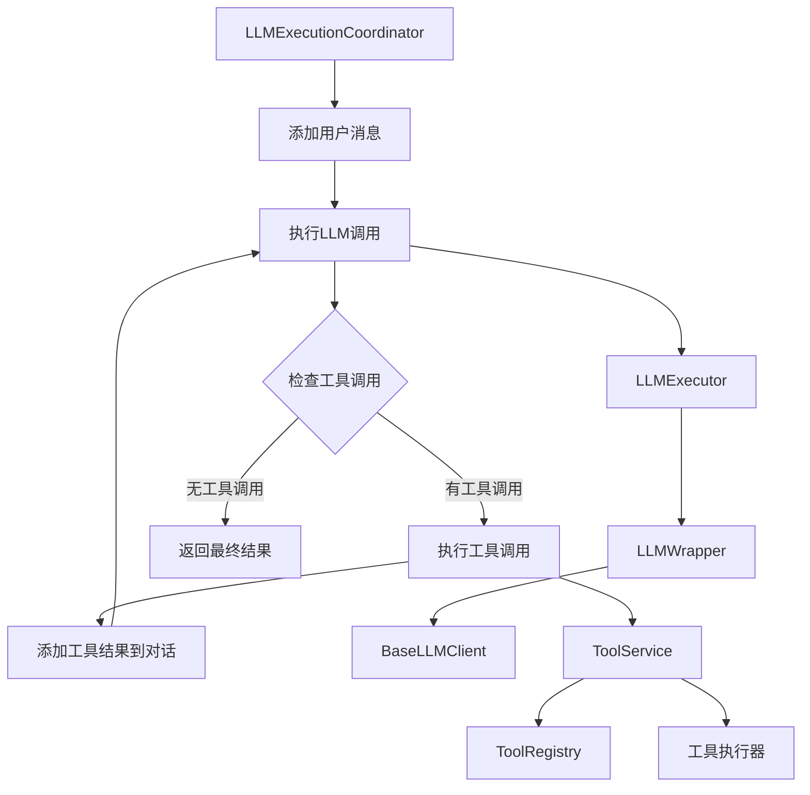

# Tool模块与LLM模块集成分析

## 架构概述

本项目中的tool模块与llm模块通过分层架构实现紧密集成，采用事件驱动的协调模式来管理复杂的LLM调用和工具执行循环。

## 核心集成组件

### 1. LLM执行协调器 (LLMExecutionCoordinator)
**位置**: `sdk/core/execution/coordinators/llm-execution-coordinator.ts`

**核心职责**:
- 协调LLM调用和工具调用的完整流程
- 处理多轮对话循环 (LLM → 工具 → LLM)
- 管理对话状态和消息历史
- 触发相关事件进行监控

**关键集成点**:
```typescript
constructor(
  private llmExecutor: LLMExecutor,
  private toolService: ToolService = toolService,
  private eventManager?: EventManager
) { }
```

### 2. 工具服务 (ToolService)
**位置**: `sdk/core/services/tool-service.ts`

**核心职责**:
- 统一的工具注册和管理接口
- 工具执行的分发和协调
- 支持多种工具类型 (STATELESS, STATEFUL, REST, MCP)

**工具执行器架构**:
- `StatelessToolExecutor` - 无状态工具
- `StatefulToolExecutor` - 有状态工具  
- `RestToolExecutor` - REST API工具
- `McpToolExecutor` - MCP协议工具

### 3. LLM执行器 (LLMExecutor)
**位置**: `sdk/core/execution/llm-executor.ts`

**核心职责**:
- 执行单次LLM调用
- 处理流式和非流式生成
- 委托给LLMWrapper进行实际调用

### 4. LLM包装器 (LLMWrapper)
**位置**: `sdk/core/llm/wrapper.ts`

**核心职责**:
- 统一的LLM调用接口
- Profile管理和客户端工厂协调
- 错误处理和性能统计

## 集成流程

### 工具调用循环流程



### 详细执行步骤

1. **初始化阶段**
   - LLMExecutionCoordinator接收LLMExecutor和ToolService依赖
   - 准备对话管理器(ConversationManager)

2. **LLM调用循环**
   - 添加用户消息到对话历史
   - 调用LLMExecutor执行LLM调用
   - LLMExecutor委托给LLMWrapper
   - LLMWrapper使用ClientFactory创建具体LLM客户端
   - 返回包含工具调用的LLM响应

3. **工具执行阶段**
   - 解析LLM响应中的工具调用
   - 通过ToolService执行每个工具
   - ToolService根据工具类型选择对应执行器
   - 将工具执行结果添加到对话历史

4. **循环控制**
   - 如果还有工具调用，继续LLM调用
   - 最大迭代次数限制防止无限循环
   - 最终返回LLM的文本响应

## 工具定义格式转换

### 工具转换器 (Tool Converter)
**位置**: `sdk/utils/llm/tool-converter.ts`

**支持的LLM提供商格式**:
- **OpenAI**: `{ type: 'function', function: { name, description, parameters } }`
- **Anthropic**: `{ name, description, input_schema }`
- **Gemini**: `{ functionDeclarations: [{ name, description, parameters }] }`

**转换流程**:
```typescript
// 在LLM调用前转换工具定义
const openAITools = convertToolsToOpenAIFormat(tools);
const request = {
  messages: conversationState.getMessages(),
  tools: openAITools,
  // ... 其他参数
};
```

## 事件系统集成

### 关键事件类型
- `MESSAGE_ADDED` - 消息添加事件
- `TOOL_CALL_STARTED` - 工具调用开始
- `TOOL_CALL_COMPLETED` - 工具调用完成
- `TOOL_CALL_FAILED` - 工具调用失败
- `TOKEN_USAGE_WARNING` - Token使用警告
- `CONVERSATION_STATE_CHANGED` - 对话状态变化

### 事件触发时机
- 每次消息添加(用户、助手、工具)
- 工具调用开始、完成、失败
- Token使用量超过阈值
- 对话状态变化

## 设计原则和模式

### 1. 分离关注点
- **LLMExecutionCoordinator**: 流程协调，不持有状态
- **ToolService**: 工具管理，统一的执行接口
- **LLMExecutor**: LLM调用，无状态单例
- **工具执行器**: 特定类型的工具执行逻辑

### 2. 依赖注入
所有组件通过构造函数接收依赖，便于测试和替换：
```typescript
// 易于测试的依赖注入模式
const coordinator = new LLMExecutionCoordinator(
  mockLLMExecutor,
  mockToolService,
  mockEventManager
);
```

### 3. 无状态设计
关键组件采用无状态设计：
- LLMExecutionCoordinator: 状态通过参数传入
- LLMExecutor: 无状态单例
- 工具执行器: 根据工具类型选择，不持有业务状态

### 4. 事件驱动
通过事件系统实现松耦合：
- 执行状态通过事件通知
- 支持监控和扩展
- 不阻塞主执行流程

### 5. 错误处理分层
- LLM错误: 包装成LLMError，包含provider信息
- 工具错误: 包装成ToolError，包含工具信息
- 执行错误: 统一的错误处理模式

## 扩展性设计

### 工具类型扩展
支持四种工具类型，易于添加新类型：
- STATELESS: 无状态函数
- STATEFUL: 有状态实例
- REST: HTTP API调用
- MCP: Model Context Protocol

### LLM提供商扩展
通过ClientFactory模式支持新LLM提供商：
```typescript
// 新提供商只需实现BaseLLMClient接口
class NewProviderClient extends BaseLLMClient {
  protected doGenerate(request: LLMRequest): Promise<LLMResult> {
    // 实现具体逻辑
  }
}
```

## 总结

tool模块与llm模块的集成采用了精心设计的协调模式，通过LLMExecutionCoordinator作为核心协调器，实现了：

1. **完整的工具调用循环** - 支持多轮LLM-工具交互
2. **统一的工具管理** - 通过ToolService提供一致的工具执行接口
3. **灵活的LLM集成** - 支持多种LLM提供商和工具格式
4. **可观测性** - 通过事件系统提供完整的执行监控
5. **扩展性** - 易于添加新工具类型和LLM提供商

这种设计确保了工具和LLM的紧密集成，同时保持了组件的独立性和可测试性。