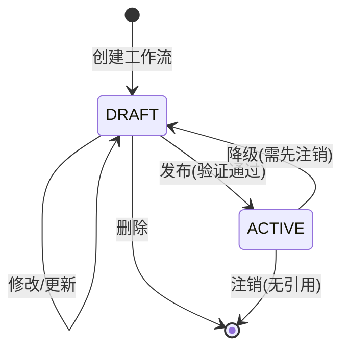

# WorkflowRegistry拆分实施计划

## 📋 概述

将现有的单一[`WorkflowRegistry`](sdk/core/services/workflow-registry.ts:49-674)拆分为两个独立的注册器：
- **DraftWorkflowRegistry**: 草稿工作流注册器，支持可选验证和修改
- **ActiveWorkflowRegistry**: 活跃工作流注册器，强制验证且不可变

## 🎯 目标

1. **启用WorkflowStatus**: 使[`WorkflowStatus`](packages/types/src/workflow/enums.ts:21-24)枚举真正发挥作用
2. **分离关注点**: 开发阶段和生产阶段使用不同的注册器
3. **提高安全性**: 生产环境工作流不可变，防止意外修改
4. **保持兼容性**: 通过兼容层确保现有代码正常运行

## 📐 架构设计

### 核心组件

```
┌─────────────────────────────────────────────────────────┐
│              WorkflowRegistryManager                      │
│                    (统一访问层)                           │
└──────────────┬──────────────────────┬───────────────────┘
               │                      │
               ▼                      ▼
┌──────────────────────┐  ┌──────────────────────┐
│  DraftWorkflowRegistry│  │ ActiveWorkflowRegistry│
│                       │  │                       │
│  - 可选验证           │  │  - 强制验证           │
│  - 可修改             │  │  - 不可变             │
│  - 按需预处理         │  │  - 立即预处理         │
│  - status: DRAFT      │  │  - status: ACTIVE     │
└──────────────────────┘  └──────────────────────┘
```

### 状态转换流程



## 📝 实施步骤

### 阶段1: 准备工作

#### 1.1 创建类型定义文件

**文件**: `packages/types/src/workflow/registry-interfaces.ts`

```typescript
/**
 * 工作流注册器接口定义
 */

import type { WorkflowDefinition, WorkflowSummary, ProcessedWorkflowDefinition } from './definition';
import type { WorkflowReferenceInfo, WorkflowReferenceRelation } from './reference';
import type { WorkflowHierarchy } from './hierarchy';

/**
 * 工作流注册器基础接口
 */
export interface IWorkflowRegistry {
  // 查询方法
  get(workflowId: string): WorkflowDefinition | undefined;
  getByName(name: string): WorkflowDefinition | undefined;
  getByTags(tags: string[]): WorkflowDefinition[];
  getByCategory(category: string): WorkflowDefinition[];
  list(): WorkflowSummary[];
  search(keyword: string): WorkflowSummary[];
  has(workflowId: string): boolean;
  size(): number;
  
  // 预处理相关
  ensureProcessed(workflowId: string): Promise<ProcessedWorkflowDefinition>;
  getProcessed(workflowId: string): ProcessedWorkflowDefinition | undefined;
}

/**
 * 草稿工作流注册器接口
 */
export interface IDraftWorkflowRegistry extends IWorkflowRegistry {
  // 注册方法
  register(workflow: WorkflowDefinition, options?: {
    skipValidation?: boolean;
  }): void;
  
  registerBatch(workflows: WorkflowDefinition[], options?: {
    skipValidation?: boolean;
  }): void;
  
  // 修改方法
  update(workflowId: string, workflow: WorkflowDefinition): void;
  
  // 删除方法
  unregister(workflowId: string): void;
  unregisterBatch(workflowIds: string[]): void;
  clear(): void;
  
  // 验证方法
  validate(workflow: WorkflowDefinition): { valid: boolean; errors: string[] };
  validateBatch(workflows: WorkflowDefinition[]): { valid: boolean; errors: string[] }[];
  
  // 发布到Active
  publish(workflowId: string): Promise<void>;
  publishBatch(workflowIds: string[]): Promise<void>;
}

/**
 * 活跃工作流注册器接口
 */
export interface IActiveWorkflowRegistry extends IWorkflowRegistry {
  // 注册方法（强制验证）
  register(workflow: WorkflowDefinition): void;
  registerBatch(workflows: WorkflowDefinition[]): void;
  
  // 删除方法（需要检查引用）
  unregister(workflowId: string, options?: {
    force?: boolean;
    checkReferences?: boolean;
  }): void;
  unregisterBatch(workflowIds: string[]): void;
  
  // 查询活跃状态
  getActiveWorkflows(): string[];
  isWorkflowActive(workflowId: string): boolean;
  
  // 引用管理
  checkWorkflowReferences(workflowId: string): WorkflowReferenceInfo;
  hasReferences(workflowId: string): boolean;
  getReferenceRelations(workflowId: string): WorkflowReferenceRelation[];
  
  // 层次结构
  getWorkflowHierarchy(workflowId: string): WorkflowHierarchy;
  getParentWorkflow(workflowId: string): string | null;
  getChildWorkflows(workflowId: string): string[];
  
  // 导入导出
  export(workflowId: string): string;
  import(json: string): string;
}
```

#### 1.2 更新WorkflowDefinition类型

**文件**: `packages/types/src/workflow/definition.ts`

```typescript
export interface WorkflowDefinition {
  // ... 现有字段
  /** 工作流状态 */
  status?: WorkflowStatus;
}
```

#### 1.3 更新WorkflowSummary类型

**文件**: `packages/types/src/workflow/definition.ts`

```typescript
export interface WorkflowSummary {
  // ... 现有字段
  /** 工作流状态 */
  status?: WorkflowStatus;
}
```

### 阶段2: 实现核心注册器

#### 2.1 实现DraftWorkflowRegistry

**文件**: `sdk/core/services/draft-workflow-registry.ts`

**关键方法**:
- `register(workflow, options)`: 可选验证，允许覆盖
- `update(workflowId, workflow)`: 更新草稿工作流
- `publish(workflowId)`: 发布到Active注册器
- `validate(workflow)`: 基本验证

**实现要点**:
1. 自动设置`status = WorkflowStatus.DRAFT`
2. 支持`skipValidation`选项
3. 允许ID覆盖（支持修改）
4. 预处理按需进行（调用`ensureProcessed`时）

#### 2.2 实现ActiveWorkflowRegistry

**文件**: `sdk/core/services/active-workflow-registry.ts`

**关键方法**:
- `register(workflow)`: 强制验证，不可覆盖
- `unregister(workflowId, options)`: 检查引用后删除
- `checkWorkflowReferences(workflowId)`: 检查引用关系
- `getWorkflowHierarchy(workflowId)`: 获取层次结构

**实现要点**:
1. 自动设置`status = WorkflowStatus.ACTIVE`
2. 强制验证，无跳过选项
3. ID冲突时抛出错误（不可变）
4. 立即预处理所有类型的工作流
5. 完整的引用管理和层次结构支持

**迁移策略**: 从现有[`WorkflowRegistry`](sdk/core/services/workflow-registry.ts:49-674)中提取相关逻辑

#### 2.3 实现WorkflowRegistryManager

**文件**: `sdk/core/services/workflow-registry-manager.ts`

**关键方法**:
- `getDraftRegistry()`: 获取草稿注册器
- `getActiveRegistry()`: 获取活跃注册器
- `get(workflowId)`: 统一查询（优先Active）
- `listAll()`: 列出所有工作流
- `listByStatus(status)`: 按状态过滤

**实现要点**:
1. 管理两个注册器实例
2. 提供统一的查询接口
3. 协调两个注册器之间的交互

### 阶段3: 实现状态转换

#### 3.1 实现WorkflowStatusTransition

**文件**: `sdk/core/services/workflow-status-transition.ts`

**关键方法**:
- `createDraft(workflow, options)`: 创建草稿
- `updateDraft(workflowId, workflow)`: 更新草稿
- `publishToActive(workflowId, options)`: 发布到生产
- `demoteToDraft(workflowId, options)`: 降级到草稿
- `deleteDraft(workflowId)`: 删除草稿
- `deleteActive(workflowId, options)`: 删除活跃
- `getStatus(workflowId)`: 获取状态

**实现要点**:
1. 状态转换验证
2. 错误处理和类型定义
3. 强制模式支持

#### 3.2 定义错误类型

**文件**: `packages/types/src/workflow/transition-errors.ts`

```typescript
export enum TransitionErrorType {
  WORKFLOW_NOT_FOUND = 'WORKFLOW_NOT_FOUND',
  INVALID_STATUS = 'INVALID_STATUS',
  VALIDATION_FAILED = 'VALIDATION_FAILED',
  WORKFLOW_EXISTS = 'WORKFLOW_EXISTS',
  HAS_REFERENCES = 'HAS_REFERENCES',
  TRANSITION_NOT_ALLOWED = 'TRANSITION_NOT_ALLOWED'
}

export class WorkflowTransitionError extends Error {
  constructor(
    public type: TransitionErrorType,
    message: string,
    public workflowId: string,
    public currentStatus?: WorkflowStatus,
    public targetStatus?: WorkflowStatus
  ) {
    super(message);
    this.name = 'WorkflowTransitionError';
  }
}
```

### 阶段4: 实现兼容层

#### 4.1 实现LegacyWorkflowRegistry

**文件**: `sdk/core/services/legacy-workflow-registry.ts`

**关键方法**:
- `register(workflow)`: 兼容旧API，路由到ActiveRegistry
- `registerBatch(workflows)`: 批量注册
- `get(workflowId)`: 统一查询
- `ensureProcessed(workflowId)`: 预处理
- `unregister(workflowId, options)`: 注销

**实现要点**:
1. 保持现有API签名不变
2. 内部使用WorkflowRegistryManager
3. 默认行为：注册到ActiveRegistry（保持原有行为）
4. 查询时优先从ActiveRegistry查询

#### 4.2 更新全局单例

**文件**: `sdk/core/services/workflow-registry.ts`

```typescript
// 保持全局单例名称不变
export const workflowRegistry = new LegacyWorkflowRegistry({
  maxRecursionDepth: 10
});

// 导出新的管理器供新代码使用
export const workflowRegistryManager = new WorkflowRegistryManager();
```

### 阶段5: 更新核心执行代码

#### 5.1 更新ExecutionContext

**文件**: `sdk/core/execution/context/execution-context.ts`

**修改内容**:
```typescript
// 旧代码
const workflowRegistry = SingletonRegistry.get<WorkflowRegistry>('workflowRegistry');

// 新代码
const workflowRegistryManager = SingletonRegistry.get<WorkflowRegistryManager>('workflowRegistryManager');
const activeRegistry = workflowRegistryManager.getActiveRegistry();
```

**影响范围**:
- 第77行: 获取WorkflowRegistry
- 第84行: 设置到ThreadRegistry
- 第88行: 注册到ComponentRegistry
- 第131行: getWorkflowRegistry()方法

#### 5.2 更新ThreadExecutor

**文件**: `sdk/core/execution/thread-executor.ts`

**修改内容**:
```typescript
// 第77行
this.workflowRegistry = this.executionContext.getWorkflowRegistry();
// 改为
this.activeRegistry = this.executionContext.getActiveRegistry();
```

#### 5.3 更新ThreadBuilder

**文件**: `sdk/core/execution/thread-builder.ts`

**修改内容**:
```typescript
// 第148行
this.registerWorkflowTriggers(threadContext, processedWorkflow);
// 确保使用ActiveRegistry获取工作流
```

#### 5.4 更新WorkflowReferenceManager

**文件**: `sdk/core/execution/managers/workflow-reference-manager.ts`

**修改内容**:
```typescript
// 第20-23行
constructor(
  private workflowRegistry: IActiveWorkflowRegistry,  // 改为接口类型
  private threadRegistry: ThreadRegistry
) { }
```

### 阶段6: 更新API层

#### 6.1 更新WorkflowRegistryAPI

**文件**: `sdk/api/resources/workflows/workflow-registry-api.ts`

**修改内容**:
```typescript
export class WorkflowRegistryAPI extends GenericResourceAPI<WorkflowDefinition, string, WorkflowFilter> {
  private draftRegistry: IDraftWorkflowRegistry;
  private activeRegistry: IActiveWorkflowRegistry;
  
  constructor(dependencies: APIDependencies) {
    super(dependencies);
    this.draftRegistry = dependencies.workflowRegistryManager.getDraftRegistry();
    this.activeRegistry = dependencies.workflowRegistryManager.getActiveRegistry();
  }
  
  // 根据status参数路由到不同的注册器
  async create(workflow: WorkflowDefinition, options?: { status?: WorkflowStatus }): Promise<WorkflowDefinition> {
    if (options?.status === WorkflowStatus.ACTIVE) {
      this.activeRegistry.register(workflow);
    } else {
      this.draftRegistry.register(workflow);
    }
    return workflow;
  }
  
  // 更新方法（仅Draft支持）
  async update(id: string, workflow: WorkflowDefinition): Promise<WorkflowDefinition> {
    this.draftRegistry.update(id, workflow);
    return workflow;
  }
  
  // 发布方法
  async publish(id: string): Promise<void> {
    await this.draftRegistry.publish(id);
  }
  
  // 降级方法
  async demote(id: string): Promise<void> {
    await this.activeRegistry.demoteToDraft(id);
  }
}
```

#### 6.2 更新SDKAPIDependencies

**文件**: `sdk/api/core/sdk-api-dependencies.ts`

**修改内容**:
```typescript
// 第35-37行
getWorkflowRegistry(): any {
  return this.executionContext.getWorkflowRegistry();
}

// 改为
getWorkflowRegistryManager(): WorkflowRegistryManager {
  return this.executionContext.getWorkflowRegistryManager();
}
```

### 阶段7: 更新测试代码

#### 7.1 更新核心集成测试

**文件**: `sdk/tests/thread-build-execution-integration.test.ts`

**修改策略**:
```typescript
// 旧代码
workflowRegistry.register(workflow);

// 新代码（生产测试）
activeRegistry.register(workflow);

// 或（开发测试）
draftRegistry.register(workflow, { skipValidation: true });
```

**影响范围**: 76处调用

#### 7.2 更新工作流预处理测试

**文件**: `sdk/tests/workflow/workflow-preprocessing-integration.test.ts`

**修改策略**: 同上

#### 7.3 更新检查点测试

**文件**: `sdk/tests/checkpoint/**/*.test.ts`

**修改策略**: 同上

#### 7.4 更新API测试

**文件**: `sdk/api/__tests__/**/*.test.ts`

**修改策略**: 同上

### 阶段8: 文档和示例

#### 8.1 更新API文档

**文件**: `docs/sdk/api-layer-modules-analysis.md`

**新增内容**:
- DraftWorkflowRegistry使用指南
- ActiveWorkflowRegistry使用指南
- WorkflowStatusTransition使用指南
- 状态转换最佳实践

#### 8.2 创建迁移指南

**文件**: `docs/migration/workflow-registry-migration-guide.md`

**内容**:
- 迁移步骤
- 代码示例
- 常见问题
- 最佳实践

#### 8.3 更新README

**文件**: `sdk/README.md`

**新增内容**:
- 工作流状态管理
- 草稿和活跃工作流区别
- 使用示例

## 🧪 测试策略

### 单元测试

#### DraftWorkflowRegistry测试

**文件**: `sdk/core/services/__tests__/draft-workflow-registry.test.ts`

**测试用例**:
- [ ] 注册草稿工作流（带验证）
- [ ] 注册草稿工作流（跳过验证）
- [ ] 更新草稿工作流
- [ ] 覆盖已存在的草稿工作流
- [ ] 发布到Active注册器
- [ ] 批量发布
- [ ] 删除草稿工作流
- [ ] 验证方法
- [ ] 预处理按需进行

#### ActiveWorkflowRegistry测试

**文件**: `sdk/core/services/__tests__/active-workflow-registry.test.ts`

**测试用例**:
- [ ] 注册活跃工作流（强制验证）
- [ ] 注册重复ID（应失败）
- [ ] 注销活跃工作流（无引用）
- [ ] 注销活跃工作流（有引用，应失败）
- [ ] 强制注销
- [ ] 引用管理
- [ ] 层次结构查询
- [ ] 导入导出
- [ ] 立即预处理

#### WorkflowStatusTransition测试

**文件**: `sdk/core/services/__tests__/workflow-status-transition.test.ts`

**测试用例**:
- [ ] 创建草稿
- [ ] 更新草稿
- [ ] 发布到Active（验证通过）
- [ ] 发布到Active（验证失败）
- [ ] 发布到Active（ID已存在）
- [ ] 降级到Draft（无引用）
- [ ] 降级到Draft（有引用）
- [ ] 删除草稿
- [ ] 删除活跃
- [ ] 获取状态
- [ ] 强制模式操作

#### WorkflowRegistryManager测试

**文件**: `sdk/core/services/__tests__/workflow-registry-manager.test.ts`

**测试用例**:
- [ ] 获取注册器实例
- [ ] 统一查询（优先Active）
- [ ] 列出所有工作流
- [ ] 按状态过滤

#### LegacyWorkflowRegistry测试

**文件**: `sdk/core/services/__tests__/legacy-workflow-registry.test.ts`

**测试用例**:
- [ ] 兼容register方法
- [ ] 兼容get方法
- [ ] 兼容ensureProcessed方法
- [ ] 兼容unregister方法
- [ ] 向后兼容性验证

### 集成测试

#### 状态转换集成测试

**文件**: `sdk/tests/workflow/workflow-status-transition-integration.test.ts`

**测试场景**:
- [ ] 完整的开发到发布流程
- [ ] 发布失败后的回滚
- [ ] 降级和重新发布
- [ ] 批量操作
- [ ] 并发操作

#### 执行引擎集成测试

**文件**: `sdk/tests/workflow/workflow-registry-split-integration.test.ts`

**测试场景**:
- [ ] 使用Draft工作流执行（应失败）
- [ ] 使用Active工作流执行
- [ ] 状态转换后的执行
- [ ] 引用关系验证

## 📊 文件清单

### 新增文件

| 文件路径 | 描述 | 优先级 |
|---------|------|-------|
| `packages/types/src/workflow/registry-interfaces.ts` | 注册器接口定义 | P0 |
| `packages/types/src/workflow/transition-errors.ts` | 状态转换错误类型 | P0 |
| `sdk/core/services/draft-workflow-registry.ts` | 草稿工作流注册器 | P0 |
| `sdk/core/services/active-workflow-registry.ts` | 活跃工作流注册器 | P0 |
| `sdk/core/services/workflow-registry-manager.ts` | 注册器管理器 | P0 |
| `sdk/core/services/workflow-status-transition.ts` | 状态转换器 | P0 |
| `sdk/core/services/legacy-workflow-registry.ts` | 兼容层 | P0 |
| `sdk/core/services/__tests__/draft-workflow-registry.test.ts` | Draft注册器测试 | P1 |
| `sdk/core/services/__tests__/active-workflow-registry.test.ts` | Active注册器测试 | P1 |
| `sdk/core/services/__tests__/workflow-status-transition.test.ts` | 状态转换测试 | P1 |
| `sdk/core/services/__tests__/workflow-registry-manager.test.ts` | 管理器测试 | P1 |
| `sdk/core/services/__tests__/legacy-workflow-registry.test.ts` | 兼容层测试 | P1 |
| `sdk/tests/workflow/workflow-status-transition-integration.test.ts` | 状态转换集成测试 | P1 |
| `sdk/tests/workflow/workflow-registry-split-integration.test.ts` | 拆分集成测试 | P1 |
| `docs/migration/workflow-registry-migration-guide.md` | 迁移指南 | P2 |

### 修改文件

| 文件路径 | 修改内容 | 优先级 |
|---------|---------|-------|
| `packages/types/src/workflow/definition.ts` | 添加status字段 | P0 |
| `packages/types/src/workflow/definition.ts` | 更新WorkflowSummary | P0 |
| `sdk/core/services/workflow-registry.ts` | 添加兼容层导出 | P0 |
| `sdk/core/execution/context/execution-context.ts` | 更新注册器获取逻辑 | P1 |
| `sdk/core/execution/thread-executor.ts` | 更新注册器引用 | P1 |
| `sdk/core/execution/thread-builder.ts` | 更新注册器引用 | P1 |
| `sdk/core/execution/managers/workflow-reference-manager.ts` | 更新接口类型 | P1 |
| `sdk/api/resources/workflows/workflow-registry-api.ts` | 添加状态管理API | P1 |
| `sdk/api/core/sdk-api-dependencies.ts` | 添加管理器获取方法 | P1 |
| `sdk/tests/thread-build-execution-integration.test.ts` | 更新测试代码 | P2 |
| `sdk/tests/workflow/workflow-preprocessing-integration.test.ts` | 更新测试代码 | P2 |
| `sdk/tests/checkpoint/**/*.test.ts` | 更新测试代码 | P2 |
| `sdk/api/__tests__/**/*.test.ts` | 更新测试代码 | P2 |
| `docs/sdk/api-layer-modules-analysis.md` | 更新API文档 | P2 |
| `sdk/README.md` | 添加使用说明 | P2 |

## 🔄 回滚计划

### 触发条件

1. 核心功能测试失败率 > 10%
2. 性能下降 > 20%
3. 破坏性变更影响 > 5%的现有代码
4. 无法解决的兼容性问题

### 回滚步骤

1. **立即回滚**
   ```bash
   git revert <commit-hash>
   ```

2. **数据恢复**
   - 恢复原有的WorkflowRegistry实现
   - 清理新增的注册器实例
   - 恢复全局单例

3. **验证回滚**
   - 运行所有测试
   - 验证核心功能
   - 检查性能指标

4. **问题分析**
   - 记录失败原因
   - 分析根本原因
   - 制定修复方案

## 📈 成功标准

### 功能标准

- [ ] 所有新功能按设计实现
- [ ] 所有单元测试通过（100%）
- [ ] 所有集成测试通过（100%）
- [ ] 向后兼容性验证通过

### 性能标准

- [ ] 注册性能下降 < 10%
- [ ] 查询性能下降 < 5%
- [ ] 内存使用增加 < 15%

### 质量标准

- [ ] 代码覆盖率 > 90%
- [ ] 无TypeScript错误
- [ ] 无ESLint警告
- [ ] 文档完整度 > 95%

## 🎓 最佳实践

### 开发阶段

1. **使用DraftWorkflowRegistry**
   ```typescript
   draftRegistry.register(workflow, { skipValidation: true });
   draftRegistry.update('workflow-id', updatedWorkflow);
   ```

2. **快速迭代**
   - 跳过验证以加快开发速度
   - 频繁修改和测试
   - 使用草稿状态进行实验

### 生产阶段

1. **使用ActiveWorkflowRegistry**
   ```typescript
   activeRegistry.register(workflow);
   ```

2. **确保质量**
   - 强制验证确保工作流正确性
   - 不可变设计防止意外修改
   - 立即预处理确保性能

### 状态转换

1. **发布流程**
   ```typescript
   await draftRegistry.publish('workflow-id');
   ```

2. **降级流程**
   ```typescript
   await activeRegistry.demoteToDraft('workflow-id');
   ```

3. **强制操作**
   ```typescript
   await transition.publishToActive('workflow-id', { force: true });
   ```

## 🔍 注意事项

### 重要提醒

1. **不要直接修改Active工作流**
   - Active工作流是不可变的
   - 如需修改，先降级到Draft，修改后再发布

2. **验证是关键**
   - Draft阶段可以跳过验证，但发布前必须验证
   - Active阶段强制验证，确保生产质量

3. **引用管理**
   - 删除Active工作流前检查引用
   - 使用force选项时要谨慎

4. **性能考虑**
   - Active工作流会立即预处理
   - Draft工作流按需预处理
   - 合理选择注册器以优化性能

### 常见陷阱

1. **忘记设置状态**
   - 注册器会自动设置status
   - 手动设置会被覆盖

2. **混淆注册器**
   - Draft用于开发，Active用于生产
   - 不要在生产环境使用Draft

3. **忽略验证**
   - 跳过验证仅用于开发
   - 发布前必须验证

4. **并发问题**
   - 状态转换不是原子操作
   - 避免并发修改同一工作流

## 📚 参考资料

### 相关文档

- [WorkflowRegistry实现](sdk/core/services/workflow-registry.ts)
- [WorkflowDefinition类型](packages/types/src/workflow/definition.ts)
- [WorkflowStatus枚举](packages/types/src/workflow/enums.ts)
- [API层模块分析](docs/sdk/api-layer-modules-analysis.md)

### 设计模式

- **策略模式**: Draft和Active使用不同的验证策略
- **状态模式**: WorkflowStatus管理工作流状态
- **外观模式**: WorkflowRegistryManager提供统一接口
- **适配器模式**: LegacyWorkflowRegistry提供向后兼容

## ✅ 检查清单

### 实施前

- [ ] 代码审查完成
- [ ] 测试计划制定
- [ ] 回滚方案准备
- [ ] 文档更新准备

### 实施中

- [ ] 按阶段执行
- [ ] 每阶段测试通过
- [ ] 代码审查通过
- [ ] 文档同步更新

### 实施后

- [ ] 所有测试通过
- [ ] 性能验证通过
- [ ] 文档完整
- [ ] 团队培训完成

## 📞 支持

如有问题，请联系：
- 架构团队
- 核心开发团队
- 测试团队

---

**文档版本**: 1.0  
**最后更新**: 2024  
**维护者**: 架构团队