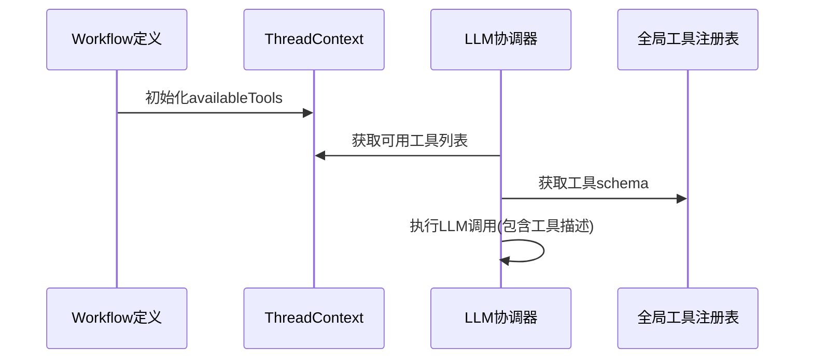
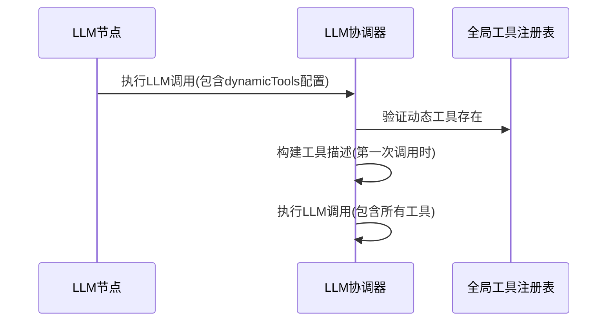

# Workflow工具注册机制设计方案

## 设计目标

1. **以Workflow为唯一配置来源** - 工具注册逻辑完全通过workflow定义配置
2. **简化架构** - 不引入新的节点类型，利用现有LLM节点配置
3. **避免状态复杂性** - 不维护动态工具状态，通过消息数组管理工具描述
4. **防止提示词重复** - 工具描述只添加一次到消息数组

## 核心设计

### 1. Workflow级别的可用工具配置

在WorkflowDefinition中添加`availableTools`属性：

```typescript
// 在sdk/types/workflow.ts中扩展WorkflowDefinition
export interface WorkflowDefinition {
  // ... 现有属性
  id: ID;
  name: string;
  description?: string;
  nodes: Node[];
  edges: Edge[];
  variables?: WorkflowVariable[];
  
  // 新增：可用工具配置
  availableTools?: {
    // 初始可用工具集合（工具ID或名称）
    initial: Set<string>;
  };
  
  // ... 其他现有属性
}
```

### 2. LLM节点配置扩展

在LLMNodeConfig中添加动态工具配置：

```typescript
// 在sdk/types/node.ts中扩展LLMNodeConfig
export interface LLMNodeConfig {
  /** 引用的LLM Profile ID */
  profileId: ID;
  /** 提示词 */
  prompt?: string;
  /** 可选的参数覆盖（覆盖Profile中的parameters） */
  parameters?: Record<string, any>;
  /** 最大工具调用次数（默认10，由LLM模块控制） */
  maxToolCalls?: number;
  
  // 新增：动态工具配置
  dynamicTools?: {
    /** 要动态添加的工具ID或名称 */
    toolIds: string[];
    /** 工具描述模板（可选） */
    descriptionTemplate?: string;
  };
}
```

### 3. 工具描述管理策略

**关键原则：工具描述只添加一次到消息数组**

```typescript
// 在sdk/core/execution/coordinators/llm-execution-coordinator.ts中实现
export class LLMExecutionCoordinator {
  // ... 现有代码
  
  private async executeLLMLoop(
    params: LLMExecutionParams,
    conversationState: ConversationManager,
    threadContext: ThreadContext
  ): Promise<string> {
    const { prompt, profileId, parameters, tools, threadId, nodeId } = params;
    
    // 步骤1：检查是否需要添加工具描述
    const shouldAddToolDescriptions = this.shouldAddToolDescriptions(conversationState);
    
    if (shouldAddToolDescriptions) {
      // 构建工具描述消息（只添加一次）
      const toolDescriptions = this.buildToolDescriptions(params.dynamicTools);
      const enhancedPrompt = prompt + toolDescriptions;
      
      const userMessage = {
        role: 'user' as const,
        content: enhancedPrompt
      };
      conversationState.addMessage(userMessage);
    } else {
      // 使用原始提示词
      const userMessage = {
        role: 'user' as const,
        content: prompt
      };
      conversationState.addMessage(userMessage);
    }
    
    // ... 后续LLM调用循环
  }
  
  /**
   * 检查是否需要添加工具描述
   * 只在第一次LLM调用时添加，避免重复
   */
  private shouldAddToolDescriptions(conversationState: ConversationManager): boolean {
    const messages = conversationState.getMessages();
    // 如果消息数组为空，说明是第一次调用，需要添加工具描述
    return messages.length === 0;
  }
  
  /**
   * 构建工具描述文本
   */
  private buildToolDescriptions(dynamicTools?: any): string {
    if (!dynamicTools?.toolIds || dynamicTools.toolIds.length === 0) {
      return '';
    }
    
    const toolService = this.toolService;
    const toolDescriptions = dynamicTools.toolIds
      .map(id => {
        const tool = toolService.getTool(id);
        if (!tool) return null;
        
        const description = dynamicTools.descriptionTemplate 
          ? dynamicTools.descriptionTemplate.replace('{toolName}', tool.name).replace('{toolDescription}', tool.description)
          : `- ${tool.name}: ${tool.description}`;
          
        return description;
      })
      .filter(Boolean)
      .join('\n');
    
    return toolDescriptions.length > 0 ? `\n\n可用工具:\n${toolDescriptions}` : '';
  }
  
  /**
   * 获取可用工具schema（包含静态和动态工具）
   */
  private getAvailableTools(workflowTools: Set<string>, dynamicTools?: any): any[] {
    const toolService = this.toolService;
    const allToolIds = new Set(workflowTools);
    
    // 添加动态工具
    if (dynamicTools?.toolIds) {
      dynamicTools.toolIds.forEach((id: string) => allToolIds.add(id));
    }
    
    return Array.from(allToolIds)
      .map(id => toolService.getTool(id))
      .filter(Boolean)
      .map(tool => ({
        name: tool.name,
        description: tool.description,
        parameters: tool.parameters
      }));
  }
}
```

### 4. ThreadContext简化

ThreadContext不再维护动态工具状态，只提供workflow配置的工具：

```typescript
// 在sdk/core/execution/context/thread-context.ts中简化
export class ThreadContext implements LifecycleCapable {
  // ... 现有属性
  
  /**
   * 可用工具集合（从workflow配置）
   */
  private availableTools: Set<string> = new Set();
  
  /**
   * 初始化可用工具（从workflow配置）
   */
  initializeAvailableTools(workflow: WorkflowDefinition): void {
    if (workflow.availableTools?.initial) {
      this.availableTools = new Set(workflow.availableTools.initial);
    }
  }
  
  /**
   * 获取可用工具列表
   */
  getAvailableTools(): string[] {
    return Array.from(this.availableTools);
  }
  
  /**
   * 检查工具是否可用
   */
  isToolAvailable(toolId: string): boolean {
    return this.availableTools.has(toolId);
  }
}
```

## 执行流程

### 1. 静态工具配置流程



### 2. 动态工具使用流程



## 关键优势

### 1. 架构简化
- **不引入新节点类型** - 利用现有LLM节点配置
- **无复杂状态管理** - 不维护动态工具状态
- **职责清晰** - 每个组件职责单一

### 2. 避免提示词重复
- **工具描述只添加一次** - 在第一次LLM调用时添加到消息数组
- **后续调用使用原消息** - 避免重复添加工具描述
- **状态自然管理** - 通过消息数组长度判断是否需要添加

### 3. 安全性保障
- **工具可用性检查** - 所有工具调用前验证是否在可用集合中
- **全局工具验证** - 动态工具必须在全局注册表中存在

### 4. 配置灵活性
- **workflow级别配置** - 定义初始可用工具集合
- **节点级别配置** - LLM节点可以动态指定额外工具
- **描述模板支持** - 支持自定义工具描述格式

## 使用示例

### Workflow定义示例
```typescript
const workflow: WorkflowDefinition = {
  id: 'workflow-1',
  name: '数据分析工作流',
  nodes: [...],
  availableTools: {
    initial: new Set(['calculator', 'data-query'])
  }
};
```

### LLM节点配置示例
```typescript
const llmNode: Node = {
  id: 'llm-1',
  type: NodeType.LLM,
  name: '分析数据',
  config: {
    profileId: 'gpt-4',
    prompt: '请分析以下数据...',
    dynamicTools: {
      toolIds: ['chart-generator', 'report-writer'],
      descriptionTemplate: '工具 {toolName}: {toolDescription}'
    }
  }
};
```

## 实施步骤

### 阶段1：类型扩展
1. 扩展WorkflowDefinition添加availableTools配置
2. 扩展LLMNodeConfig添加dynamicTools配置

### 阶段2：执行逻辑更新
1. 更新LLMExecutionCoordinator支持工具描述管理
2. 实现工具可用性检查和过滤
3. 更新ThreadContext简化工具状态管理

### 阶段3：验证和测试
1. 添加workflow验证规则
2. 编写单元测试验证工具描述不重复
3. 集成测试验证完整流程

这个简化方案避免了ADD_TOOL节点的复杂度，通过LLM节点的配置直接实现动态工具添加，同时解决了提示词重复的问题，提供了更简洁且有效的工具注册机制。