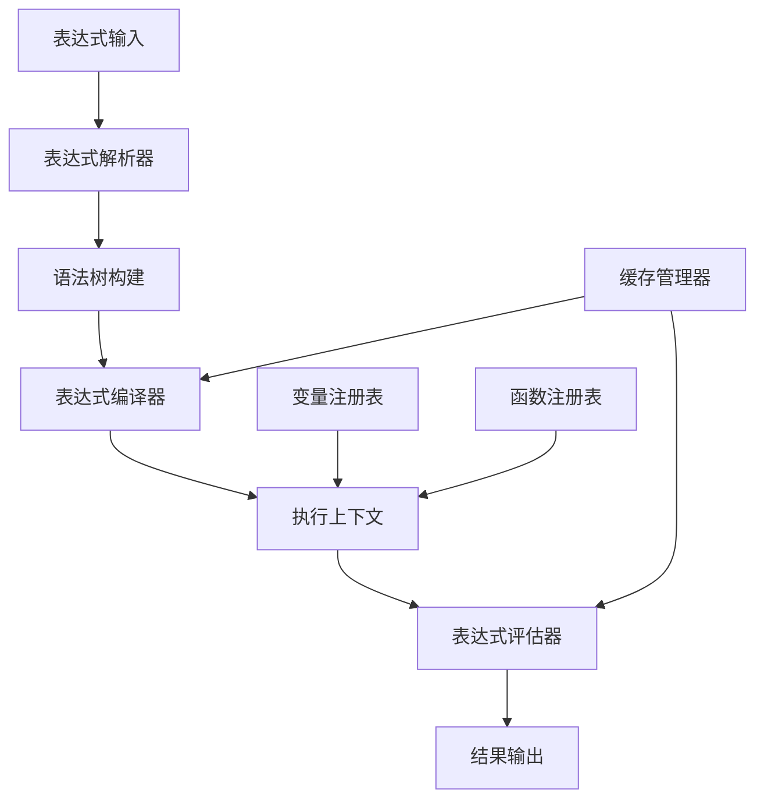

# 路由函数表达式引擎优化设计

## 背景分析

### 当前实现问题

当前的路由函数表达式评估功能较为基础，主要问题包括：

1. **表达式解析简单**：使用字符串匹配和简单的函数构造
2. **错误处理不足**：表达式评估失败时缺乏详细的错误信息
3. **性能瓶颈**：复杂的条件评估可能影响工作流执行性能
4. **功能限制**：不支持复杂的数学运算、函数调用等高级功能

### 优化目标

- 提升表达式评估的性能和准确性
- 支持更复杂的表达式语法
- 提供更好的错误诊断和调试信息
- 支持表达式缓存和预编译

## 架构设计

### 1. 表达式引擎架构



### 2. 核心组件设计

#### 2.1 表达式解析器 (ExpressionParser)

**职责**：
- 解析表达式字符串
- 构建抽象语法树（AST）
- 语法验证和错误检查

**接口设计**：
```typescript
interface ExpressionParser {
  parse(expression: string): ASTNode;
  validate(expression: string): ValidationResult;
}
```

#### 2.2 表达式编译器 (ExpressionCompiler)

**职责**：
- 将AST编译为可执行的字节码
- 优化表达式执行计划
- 支持预编译和缓存

**接口设计**：
```typescript
interface ExpressionCompiler {
  compile(ast: ASTNode): CompiledExpression;
  optimize(expression: CompiledExpression): CompiledExpression;
}
```

#### 2.3 表达式评估器 (ExpressionEvaluator)

**职责**：
- 执行编译后的表达式
- 管理执行上下文
- 处理变量和函数调用

**接口设计**：
```typescript
interface ExpressionEvaluator {
  evaluate(expression: CompiledExpression, context: EvaluationContext): EvaluationResult;
  setVariable(name: string, value: any): void;
  registerFunction(name: string, func: Function): void;
}
```

## 详细设计

### 1. 表达式语法扩展

#### 支持的操作符

```typescript
// 算术操作符
+, -, *, /, %, **

// 比较操作符
==, !=, >, <, >=, <=, ===, !==

// 逻辑操作符
&&, ||, !

// 位操作符
&, |, ^, ~, <<, >>, >>>

// 字符串操作符
+, includes, startsWith, endsWith

// 数组操作符
[], length, map, filter, reduce
```

#### 支持的函数

```typescript
// 数学函数
abs, ceil, floor, round, max, min, random

// 字符串函数
substring, replace, trim, toUpperCase, toLowerCase

// 数组函数
push, pop, shift, unshift, slice, splice

// 日期函数
now, formatDate, addDays, diffDays

// 自定义函数
用户自定义的业务函数
```

### 2. 缓存机制设计

#### 2.1 表达式缓存

```typescript
interface ExpressionCache {
  // 缓存编译后的表达式
  get(expression: string): CompiledExpression | null;
  set(expression: string, compiled: CompiledExpression): void;
  clear(): void;
  size(): number;
}
```

#### 2.2 变量缓存

```typescript
interface VariableCache {
  // 缓存变量值，避免重复获取
  get(variablePath: string): any;
  set(variablePath: string, value: any): void;
  invalidate(variablePath: string): void;
}
```

### 3. 错误处理改进

#### 3.1 详细的错误信息

```typescript
interface ExpressionError {
  type: 'syntax' | 'runtime' | 'type' | 'variable';
  message: string;
  position: { line: number; column: number };
  expression: string;
  context: Record<string, any>;
}
```

#### 3.2 错误恢复策略

```typescript
interface ErrorRecovery {
  // 语法错误：尝试自动修复
  recoverSyntaxError(error: ExpressionError): string;
  
  // 运行时错误：提供默认值
  recoverRuntimeError(error: ExpressionError): any;
  
  // 类型错误：自动类型转换
  recoverTypeError(error: ExpressionError): any;
}
```

## 实现计划

### 阶段一：基础表达式引擎

**目标**：实现核心表达式解析和评估功能

**任务**：
1. 设计AST节点类型
2. 实现递归下降解析器
3. 实现基本的表达式评估
4. 添加基础错误处理

**预计时间**：2周

### 阶段二：性能优化

**目标**：提升表达式评估性能

**任务**：
1. 实现表达式编译和字节码生成
2. 添加表达式缓存机制
3. 实现变量缓存
4. 性能基准测试

**预计时间**：2周

### 阶段三：功能扩展

**目标**：支持高级表达式功能

**任务**：
1. 添加数学函数库
2. 实现字符串和数组操作
3. 支持自定义函数注册
4. 添加调试和日志功能

**预计时间**：2周

### 阶段四：集成测试

**目标**：与现有路由函数集成

**任务**：
1. 替换现有表达式评估逻辑
2. 性能对比测试
3. 功能回归测试
4. 文档更新

**预计时间**：1周

## 技术选型

### 方案一：自研表达式引擎

**优势**：
- 完全控制，可定制性强
- 轻量级，无外部依赖
- 与现有代码风格一致

**劣势**：
- 开发成本较高
- 需要维护和测试

### 方案二：集成现有库

**候选库**：
- **math.js**：功能强大，但体积较大
- **expr-eval**：轻量级，功能适中
- **jsep**：专注于解析，需要配合评估器

**建议**：考虑使用 **expr-eval**，平衡功能和体积

## 性能预期

### 基准测试目标

| 场景 | 当前性能 | 优化后目标 | 提升比例 |
|------|----------|------------|----------|
| 简单表达式 | 1000次/秒 | 5000次/秒 | 5倍 |
| 复杂表达式 | 100次/秒 | 500次/秒 | 5倍 |
| 变量访问 | 2000次/秒 | 10000次/秒 | 5倍 |

### 内存使用优化

- 表达式缓存：减少重复解析
- 变量缓存：避免重复获取
- 对象池：重用临时对象

## 风险评估

### 技术风险

1. **性能不达标**：表达式引擎可能无法达到预期性能
   - **缓解措施**：分阶段实现，持续性能测试

2. **兼容性问题**：新引擎可能与现有表达式不兼容
   - **缓解措施**：保持向后兼容，提供迁移工具

3. **复杂性过高**：引擎实现过于复杂，难以维护
   - **缓解措施**：模块化设计，文档完善

### 项目风险

1. **时间延期**：开发时间可能超出预期
   - **缓解措施**：设置里程碑，定期检查进度

2. **资源不足**：开发人员可能不足
   - **缓解措施**：优先实现核心功能，分阶段交付

## 验收标准

### 功能验收

- [ ] 支持所有现有表达式语法
- [ ] 性能提升达到预期目标
- [ ] 错误处理完善，提供详细错误信息
- [ ] 缓存机制有效工作
- [ ] 与现有路由函数无缝集成

### 质量验收

- [ ] 单元测试覆盖率 > 90%
- [ ] 性能测试通过基准要求
- [ ] 集成测试无回归问题
- [ ] 文档完整且准确

## 后续规划

### 短期优化（3个月内）

1. 实现基础表达式引擎
2. 完成性能优化
3. 集成到路由函数

### 中期扩展（6个月内）

1. 支持更多内置函数
2. 添加表达式调试工具
3. 实现表达式可视化

### 长期愿景（1年内）

1. 支持DSL定义复杂业务规则
2. 实现表达式版本管理
3. 提供表达式性能分析工具

## 总结

路由函数表达式引擎优化是提升工作流系统性能的重要改进。通过实现专业的表达式引擎，可以显著提升路由决策的性能和准确性，同时为未来的功能扩展奠定基础。

建议采用分阶段实施策略，优先实现核心功能，确保与现有系统的兼容性，逐步优化和完善功能。