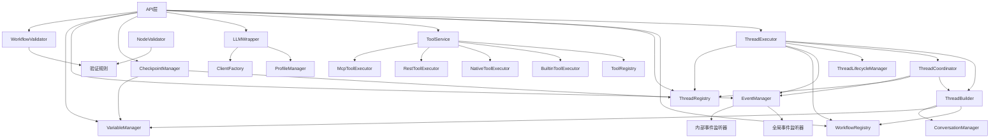

# SDK Core层模块内外界限分析

## 核心概念澄清

### workflow与thread关系
- **workflow**: 静态定义，包含node、edge、trigger等组件
- **thread**: 执行实例，由ThreadExecutor实际执行
- **关系**: workflow提供蓝图，thread是执行载体

### 内部模块 vs 外部配置模块

## 一、内部模块（不接受外部配置，不暴露到API）

### 1. 执行协调类（完全内部）

#### ThreadCoordinator
- **作用**: 处理Fork/Join/Copy操作，协调子线程执行
- **特点**: 通过内部事件与ThreadExecutor解耦
- **暴露方式**: 不直接暴露，通过ThreadExecutor间接使用
- **位置**: `sdk/core/execution/thread-coordinator.ts`

#### ThreadBuilder
- **作用**: 从WorkflowDefinition构建ThreadContext
- **特点**: 内部构建逻辑，不接受外部配置
- **暴露方式**: 不直接暴露，由ThreadExecutor调用
- **位置**: `sdk/core/execution/thread-builder.ts`

#### ThreadLifecycleManager
- **作用**: 管理线程状态转换
- **特点**: 状态机管理，内部使用
- **暴露方式**: 不直接暴露，由ThreadExecutor调用
- **位置**: `sdk/core/execution/thread-lifecycle-manager.ts`

#### Router
- **作用**: 条件路由选择
- **特点**: 内部路由逻辑
- **暴露方式**: 不直接暴露，执行过程中自动调用
- **位置**: `sdk/core/execution/router.ts`

### 2. 执行器类（完全内部）

#### LLMExecutor
- **作用**: 协调LLM调用和工具执行的循环
- **特点**: 内部执行逻辑，不接受外部配置
- **暴露方式**: 不直接暴露，由节点执行器调用
- **位置**: `sdk/core/execution/llm-executor.ts`

#### ConversationManager
- **作用**: 管理提示词上下文消息
- **特点**: 消息历史管理，Token统计
- **暴露方式**: 不直接暴露，由LLMExecutor使用
- **位置**: `sdk/core/execution/conversation.ts`

#### 各类NodeExecutor
- **StartNodeExecutor, EndNodeExecutor, LLMNodeExecutor, ToolNodeExecutor等**
- **作用**: 具体节点执行逻辑
- **特点**: 内部执行，不接受外部配置
- **暴露方式**: 不暴露，由NodeExecutorFactory创建
- **位置**: `sdk/core/execution/executors/node/`

#### 各类TriggerExecutor
- **PauseThreadExecutor, ResumeThreadExecutor, SendNotificationExecutor等**
- **作用**: 触发器执行逻辑
- **特点**: 内部执行，不接受外部配置
- **暴露方式**: 不暴露，由TriggerExecutorFactory创建
- **位置**: `sdk/core/execution/executors/trigger/`

### 3. 上下文类（完全内部）

#### ExecutionContext
- **作用**: 依赖注入容器，管理组件生命周期
- **特点**: 内部组件管理，不接受外部配置
- **暴露方式**: 不暴露，内部使用
- **位置**: `sdk/core/execution/context/execution-context.ts`

#### WorkflowContext
- **作用**: 工作流执行上下文
- **特点**: 内部状态管理
- **暴露方式**: 不暴露，内部使用
- **位置**: `sdk/core/execution/context/workflow-context.ts`

#### ThreadContext
- **作用**: 线程执行上下文
- **特点**: 内部状态管理
- **暴露方式**: 不暴露，内部使用
- **位置**: `sdk/core/execution/context/thread-context.ts`

---

## 二、外部配置模块（接受外部配置，暴露到API）

### 1. 主执行入口

#### ThreadExecutor（核心）
- **作用**: 主执行模块，负责执行单个ThreadContext
- **特点**: 接受workflowId和options，对外主要执行入口
- **暴露方式**: 直接暴露为API主要方法
- **配置项**: 
  - workflowRegistry（可选）
  - 执行选项（timeout、maxSteps等）
- **位置**: `sdk/core/execution/thread-executor.ts`
- **API方法**:
  ```typescript
  executeWorkflow(workflowId: string, options?: ExecuteOptions): Promise<ThreadResult>
  executeThread(threadId: string): Promise<ThreadResult>
  ```

### 2. 注册管理类

#### WorkflowRegistry
- **作用**: 工作流注册、查询、更新、删除
- **特点**: 接受工作流定义，支持版本管理
- **暴露方式**: 直接暴露为API
- **配置项**:
  - enableVersioning: 是否启用版本管理
  - maxVersions: 最大版本数
  - 自定义验证器
- **位置**: `sdk/core/execution/registrys/workflow-registry.ts`
- **API方法**:
  ```typescript
  registerWorkflow(workflow: WorkflowDefinition): Promise<void>
  getWorkflow(workflowId: string): Promise<WorkflowDefinition | null>
  updateWorkflow(workflowId: string, workflow: WorkflowDefinition): Promise<void>
  deleteWorkflow(workflowId: string): Promise<void>
  ```

#### ThreadRegistry
- **作用**: 线程注册、查询、删除
- **特点**: 线程实例管理
- **暴露方式**: 直接暴露为API
- **配置项**: 无（纯管理功能）
- **位置**: `sdk/core/execution/registrys/thread-registry.ts`
- **API方法**:
  ```typescript
  getThread(threadId: string): Promise<Thread | null>
  getThreads(filter?: ThreadFilter): Promise<Thread[]>
  deleteThread(threadId: string): Promise<void>
  ```

### 3. 工具管理类

#### ToolService
- **作用**: 统一工具执行接口
- **特点**: 支持多种工具类型（builtin、native、REST、MCP）
- **暴露方式**: 直接暴露为API
- **配置项**:
  - 工具定义
  - 执行选项（timeout、retry等）
- **位置**: `sdk/core/tools/tool-service.ts`
- **API方法**:
  ```typescript
  registerTool(tool: Tool): Promise<void>
  executeTool(toolName: string, parameters: any): Promise<ToolExecutionResult>
  ```

#### ToolRegistry
- **作用**: 工具注册表管理
- **特点**: 工具定义存储和查询
- **暴露方式**: 通过ToolService暴露，或独立暴露
- **配置项**: 无（纯注册功能）
- **位置**: `sdk/core/tools/tool-registry.ts`

### 4. LLM配置类

#### LLMWrapper
- **作用**: 统一LLM调用接口
- **特点**: 支持多提供商（OpenAI、Anthropic、Gemini等）
- **暴露方式**: 直接暴露为API
- **配置项**:
  - Profile配置
  - 请求参数
- **位置**: `sdk/core/llm/wrapper.ts`
- **API方法**:
  ```typescript
  generate(request: LLMRequest): Promise<LLMResult>
  generateStream(request: LLMRequest): Promise<AsyncIterable<LLMStreamEvent>>
  ```

#### ProfileManager
- **作用**: LLM Profile管理
- **特点**: Profile注册、查询、更新
- **暴露方式**: 通过LLMWrapper暴露，或独立暴露
- **配置项**: Profile定义
- **位置**: `sdk/core/llm/profile-manager.ts`
- **API方法**:
  ```typescript
  registerProfile(profile: LLMProfile): Promise<void>
  getProfile(profileId: string): Promise<LLMProfile | null>
  setDefaultProfile(profileId: string): Promise<void>
  ```

### 5. 状态管理类

#### CheckpointManager
- **作用**: 检查点创建、查询、恢复
- **特点**: 支持状态快照和恢复
- **暴露方式**: 直接暴露为API
- **配置项**:
  - storage: 存储实现（MemoryStorage、FileStorage等）
  - 自动检查点间隔
- **位置**: `sdk/core/execution/managers/checkpoint-manager.ts`
- **API方法**:
  ```typescript
  createCheckpoint(threadId: string): Promise<Checkpoint>
  restoreFromCheckpoint(checkpointId: string): Promise<Thread>
  getCheckpoint(checkpointId: string): Promise<Checkpoint | null>
  ```

#### VariableManager
- **作用**: 线程变量管理
- **特点**: 变量CRUD操作
- **暴露方式**: 直接暴露为API
- **配置项**: 无（纯管理功能）
- **位置**: `sdk/core/execution/managers/variable-manager.ts`
- **API方法**:
  ```typescript
  setVariable(threadId: string, variable: ThreadVariable): Promise<void>
  getVariable(threadId: string, name: string): Promise<any>
  ```

### 6. 事件管理类

#### EventManager（部分暴露）
- **作用**: 事件监听和分发
- **特点**: 全局事件对外暴露，内部事件不暴露
- **暴露方式**: 仅暴露全局事件方法
- **配置项**: 无（纯事件管理）
- **位置**: `sdk/core/execution/managers/event-manager.ts`
- **API方法**:
  ```typescript
  // 暴露的方法（全局事件）
  on(eventType: EventType, listener: EventListener): () => void
  emit(event: BaseEvent): Promise<void>
  
  // 不暴露的方法（内部事件）
  // onInternal(eventType: InternalEventType, listener: EventListener): () => void
  // emitInternal(event: BaseInternalEvent): Promise<void>
  ```

### 7. 验证类

#### WorkflowValidator
- **作用**: 工作流定义验证
- **特点**: 验证工作流结构合法性
- **暴露方式**: 直接暴露为API
- **配置项**: 验证规则（可扩展）
- **位置**: `sdk/core/validation/workflow-validator.ts`
- **API方法**:
  ```typescript
  validateWorkflow(workflow: WorkflowDefinition): Promise<ValidationResult>
  ```

#### NodeValidator
- **作用**: 节点定义验证
- **特点**: 验证节点配置合法性
- **暴露方式**: 直接暴露为API
- **配置项**: 验证规则（可扩展）
- **位置**: `sdk/core/validation/node-validator.ts`
- **API方法**:
  ```typescript
  validateNode(node: Node): Promise<ValidationResult>
  ```

---

## 三、模块依赖关系



---

## 四、API层设计原则

### 1. 暴露原则
- **直接暴露**: ThreadExecutor、WorkflowRegistry、ToolService、LLMWrapper、CheckpointManager、EventManager（全局事件）、VariableManager、WorkflowValidator
- **间接暴露**: 通过主要模块暴露相关功能
- **不暴露**: 所有内部执行器、协调器、构建器、上下文类

### 2. 配置原则
- **接受外部配置**: 注册类、管理类、配置类
- **不接受外部配置**: 执行器类、协调器类、构建器类
- **混合模式**: EventManager（仅暴露全局事件部分）

### 3. 依赖原则
- API层只依赖Core层的外部配置模块
- API层不直接依赖内部模块
- 内部模块之间的依赖由Core层自行管理

---

## 五、API层功能清单（基于正确理解）

### 一级API（直接暴露）
1. **ThreadExecutorAPI**: 工作流执行入口
2. **WorkflowRegistryAPI**: 工作流管理
3. **ThreadRegistryAPI**: 线程管理
4. **ToolServiceAPI**: 工具管理
5. **LLMWrapperAPI**: LLM调用
6. **ProfileManagerAPI**: Profile管理
7. **CheckpointManagerAPI**: 检查点管理
8. **EventManagerAPI**: 事件监听（全局事件）
9. **VariableManagerAPI**: 变量管理
10. **WorkflowValidatorAPI**: 验证管理

### 二级API（组合暴露）
1. **ExecuteAPI**: 组合ThreadExecutor + WorkflowRegistry
2. **MonitorAPI**: 组合EventManager + ThreadRegistry
3. **ConfigAPI**: 组合ProfileManager + ToolService
4. **StateAPI**: 组合CheckpointManager + VariableManager

---

## 六、实现建议

### 第一阶段（核心执行）
1. 实现ThreadExecutorAPI（主执行入口）
2. 实现WorkflowRegistryAPI（工作流管理）
3. 实现ThreadRegistryAPI（线程查询）
4. 实现WorkflowValidatorAPI（验证功能）

### 第二阶段（功能增强）
1. 实现ToolServiceAPI（工具管理）
2. 实现LLMWrapperAPI（LLM调用）
3. 实现ProfileManagerAPI（Profile管理）
4. 实现EventManagerAPI（事件监听）

### 第三阶段（状态管理）
1. 实现CheckpointManagerAPI（检查点）
2. 实现VariableManagerAPI（变量管理）
3. 实现组合API（ExecuteAPI、MonitorAPI等）
4. 实现高级功能（批量操作、模板等）
