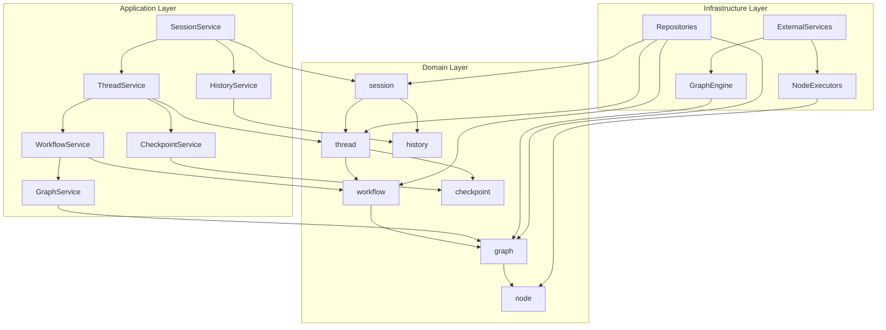

# Python层次化架构分析与Rust新架构重新设计

## Python架构的层次关系深度分析

基于对Python实现的深入分析，我发现了一个清晰的层次化架构设计：

### 1. 架构层次关系

```
Session (最顶层协调器)
├── Thread (workflow的包装)
│   ├── Workflow (业务逻辑层)
│   │   └── Graph (底层执行引擎)
│   │       ├── Node (执行单元)
│   │       │   ├── LLMNode (集成prompt和llm)
│   │       │   ├── ToolNode (集成tools)
│   │       │   └── ConditionNode (条件判断)
│   │       └── Edge (连接关系)
│   └── Checkpoint (thread的子模块)
└── History (session的子模块)
```

### 2. 各层次的职责分析

#### Session层 - 最顶层协调器
- **职责**：用户会话管理，线程协调，全局状态管理
- **特点**：
  - 管理多个Thread的生命周期
  - 处理用户交互和请求
  - 维护会话级别的历史记录
  - 提供统一的会话上下文

#### Thread层 - Workflow包装
- **职责**：工作流实例管理，执行状态跟踪，检查点管理
- **特点**：
  - 包装Workflow，提供执行上下文
  - 管理工作流的执行状态
  - 提供检查点机制支持暂停/恢复
  - 支持分支和并行执行

#### Workflow层 - 业务逻辑层
- **职责**：工作流定义，业务规则，流程编排
- **特点**：
  - 纯数据容器，不包含执行逻辑
  - 定义业务流程和规则
  - 提供工作流的元数据和配置

#### Graph层 - 底层执行引擎
- **职责**：图结构管理，节点执行，状态流转
- **特点**：
  - 管理节点和边的拓扑结构
  - 提供执行引擎和状态管理
  - 支持条件分支和循环
  - 集成各种类型的节点

#### Node层 - 执行单元
- **职责**：具体功能实现，外部系统集成
- **特点**：
  - LLMNode：集成LLM调用和提示词系统
  - ToolNode：集成工具调用和结果处理
  - ConditionNode：提供条件判断逻辑

### 3. 子模块关系

#### Checkpoint作为Thread的子模块
- **职责**：状态快照，执行恢复，错误恢复
- **特点**：
  - 保存Thread的执行状态
  - 支持手动和自动检查点
  - 提供错误恢复机制

#### History作为Session的子模块
- **职责**：历史记录，审计跟踪，统计分析
- **特点**：
  - 记录Session的所有操作
  - 提供令牌使用统计
  - 支持成本分析

## 架构设计合理性评估

### 优点

1. **清晰的层次结构**
   - 每层职责明确，符合单一职责原则
   - 层次间依赖关系清晰，便于理解和维护
   - 支持渐进式复杂度管理

2. **良好的封装性**
   - 上层对下层实现细节透明
   - 每层提供稳定的接口
   - 便于独立测试和替换

3. **灵活的扩展性**
   - 可以独立扩展各层功能
   - 支持新的节点类型和工具
   - 便于添加新的执行策略

4. **强大的状态管理**
   - 多层次的状态管理机制
   - 支持暂停/恢复和错误恢复
   - 完整的历史记录和审计

5. **用户友好的交互模型**
   - Session提供自然的用户交互边界
   - Thread支持复杂的执行流程
   - 支持分支和并行执行

### 潜在问题

1. **层次深度较深**
   - 可能导致调用链较长
   - 性能开销相对较大
   - 调试复杂度增加

2. **状态同步复杂性**
   - 多层状态需要保持一致性
   - 状态传播和同步机制复杂
   - 可能出现状态不一致问题

3. **资源管理挑战**
   - 多层资源需要协调管理
   - 内存和计算资源消耗较大
   - 生命周期管理复杂

## 基于新理解的Rust架构重新设计

### 设计原则

1. **保持层次化结构**：维持Python架构的清晰层次关系
2. **利用Rust特性**：充分利用Rust的类型系统和所有权模型
3. **简化依赖关系**：减少不必要的层次间依赖
4. **优化性能**：减少运行时开销，提高执行效率

### 新架构设计

#### 1. Domain层重新组织

```rust
// src/domain/mod.rs
pub mod session;
pub mod thread;
pub mod workflow;
pub mod graph;
pub mod node;
pub mod checkpoint;
pub mod history;
pub mod common;

// 重新导出，保持层次关系
pub use session::*;
pub use thread::*;
pub use workflow::*;
pub use graph::*;
pub use node::*;
pub use checkpoint::*;
pub use history::*;
```

#### 2. 层次化实体设计

```rust
// src/domain/session/entities.rs
pub struct Session {
    pub id: SessionId,
    pub user_id: Option<UserId>,
    pub thread_ids: Vec<ThreadId>,
    pub status: SessionStatus,
    pub context: SessionContext,
    pub history: SessionHistory,
    pub created_at: Timestamp,
    pub updated_at: Timestamp,
}

// src/domain/thread/entities.rs
pub struct Thread {
    pub id: ThreadId,
    pub session_id: SessionId,
    pub workflow_id: WorkflowId,
    pub status: ThreadStatus,
    pub checkpoints: Vec<CheckpointId>,
    pub current_checkpoint: Option<CheckpointId>,
    pub metadata: ThreadMetadata,
    pub created_at: Timestamp,
    pub updated_at: Timestamp,
}

// src/domain/workflow/entities.rs
pub struct Workflow {
    pub id: WorkflowId,
    pub graph_id: GraphId,
    pub name: String,
    pub description: Option<String>,
    pub version: Version,
    pub metadata: WorkflowMetadata,
    pub created_at: Timestamp,
}

// src/domain/graph/entities.rs
pub struct Graph {
    pub id: GraphId,
    pub nodes: HashMap<NodeId, Node>,
    pub edges: Vec<Edge>,
    pub entry_point: Option<NodeId>,
    pub state: GraphState,
    pub metadata: GraphMetadata,
}

// src/domain/node/entities.rs
pub struct Node {
    pub id: NodeId,
    pub node_type: NodeType,
    pub config: NodeConfig,
    pub position: Position,
    pub metadata: NodeMetadata,
}

pub enum NodeType {
    LLM(LLMNodeConfig),
    Tool(ToolNodeConfig),
    Condition(ConditionNodeConfig),
    Wait(WaitNodeConfig),
}
```

#### 3. Application层服务设计

```rust
// src/application/session/service.rs
pub struct SessionService {
    session_repository: Arc<dyn SessionRepository>,
    thread_service: Arc<dyn ThreadService>,
    history_service: Arc<dyn HistoryService>,
}

impl SessionService {
    pub async fn create_session(&self, request: CreateSessionRequest) -> Result<Session, SessionError> {
        // 创建会话逻辑
    }
    
    pub async fn add_thread(&self, session_id: SessionId, workflow_id: WorkflowId) -> Result<ThreadId, SessionError> {
        // 添加线程到会话
    }
    
    pub async fn get_session_history(&self, session_id: SessionId) -> Result<Vec<HistoryEntry>, SessionError> {
        // 获取会话历史
    }
}

// src/application/thread/service.rs
pub struct ThreadService {
    thread_repository: Arc<dyn ThreadRepository>,
    workflow_service: Arc<dyn WorkflowService>,
    checkpoint_service: Arc<dyn CheckpointService>,
}

impl ThreadService {
    pub async fn create_thread(&self, request: CreateThreadRequest) -> Result<Thread, ThreadError> {
        // 创建线程逻辑
    }
    
    pub async fn execute_workflow(&self, thread_id: ThreadId) -> Result<ThreadExecutionResult, ThreadError> {
        // 执行工作流
    }
    
    pub async fn create_checkpoint(&self, thread_id: ThreadId, checkpoint_type: CheckpointType) -> Result<CheckpointId, ThreadError> {
        // 创建检查点
    }
}

// src/application/workflow/service.rs
pub struct WorkflowService {
    workflow_repository: Arc<dyn WorkflowRepository>,
    graph_service: Arc<dyn GraphService>,
}

impl WorkflowService {
    pub async fn create_workflow(&self, request: CreateWorkflowRequest) -> Result<Workflow, WorkflowError> {
        // 创建工作流逻辑
    }
    
    pub async fn validate_workflow(&self, workflow: &Workflow) -> Result<ValidationResult, WorkflowError> {
        // 验证工作流
    }
}

// src/application/graph/service.rs
pub struct GraphService {
    graph_repository: Arc<dyn GraphRepository>,
    node_registry: Arc<dyn NodeRegistry>,
}

impl GraphService {
    pub async fn execute_graph(&self, graph_id: GraphId, input: GraphInput) -> Result<GraphOutput, GraphError> {
        // 执行图逻辑
    }
}
```

#### 4. Infrastructure层实现

```rust
// src/infrastructure/graph/engine.rs
pub struct GraphEngine {
    node_executors: HashMap<NodeType, Box<dyn NodeExecutor>>,
    state_manager: Arc<dyn StateManager>,
}

impl GraphEngine {
    pub async fn execute(&self, graph: &Graph, input: GraphInput) -> Result<GraphOutput, GraphError> {
        // 图执行引擎实现
    }
}

// src/infrastructure/node/executors/llm_executor.rs
pub struct LLMNodeExecutor {
    llm_client: Arc<dyn LLMClient>,
    prompt_service: Arc<dyn PromptService>,
}

impl NodeExecutor for LLMNodeExecutor {
    async fn execute(&self, node: &Node, context: &ExecutionContext) -> Result<NodeOutput, NodeExecutionError> {
        // LLM节点执行实现
    }
}

// src/infrastructure/node/executors/tool_executor.rs
pub struct ToolNodeExecutor {
    tool_registry: Arc<dyn ToolRegistry>,
}

impl NodeExecutor for ToolNodeExecutor {
    async fn execute(&self, node: &Node, context: &ExecutionContext) -> Result<NodeOutput, NodeExecutionError> {
        // 工具节点执行实现
    }
}
```

### 5. 依赖关系优化



### 6. 关键技术决策

#### 6.1 状态管理策略
```rust
// 使用Rust的所有权系统管理状态
pub struct SessionState {
    pub session: Session,
    pub threads: HashMap<ThreadId, ThreadState>,
}

pub struct ThreadState {
    pub thread: Thread,
    pub workflow_state: Option<WorkflowState>,
    pub checkpoints: HashMap<CheckpointId, CheckpointState>,
}

// 状态转换使用类型系统保证安全
impl SessionState {
    pub fn add_thread(&mut self, thread: Thread) -> Result<(), StateError> {
        // 使用Rust的类型系统确保状态转换安全
        if self.threads.contains_key(&thread.id) {
            return Err(StateError::ThreadAlreadyExists);
        }
        
        self.threads.insert(thread.id, ThreadState::new(thread));
        Ok(())
    }
}
```

#### 6.2 错误处理策略
```rust
// 分层错误处理
#[derive(Debug, thiserror::Error)]
pub enum SessionError {
    #[error("Session not found: {0}")]
    NotFound(SessionId),
    
    #[error("Thread error: {0}")]
    ThreadError(#[from] ThreadError),
    
    #[error("State error: {0}")]
    StateError(#[from] StateError),
}

#[derive(Debug, thiserror::Error)]
pub enum ThreadError {
    #[error("Workflow execution failed: {0}")]
    WorkflowError(#[from] WorkflowError),
    
    #[error("Checkpoint error: {0}")]
    CheckpointError(#[from] CheckpointError),
}
```

#### 6.3 异步处理策略
```rust
// 使用tokio提供异步执行
pub struct AsyncGraphEngine {
    executor: Arc<dyn NodeExecutor>,
    state_manager: Arc<dyn StateManager>,
}

impl AsyncGraphEngine {
    pub async fn execute_parallel(&self, graph: &Graph, input: GraphInput) -> Result<GraphOutput, GraphError> {
        // 并行执行多个节点
        let futures: Vec<_> = graph
            .get_ready_nodes()
            .into_iter()
            .map(|node| self.executor.execute(node, &context))
            .collect();
        
        let results = futures::future::join_all(futures).await;
        
        // 处理结果
        self.process_results(results).await
    }
}
```

## 实施建议

### 1. 分阶段实施

#### 第一阶段：核心层次
- 实现Domain层的核心实体
- 建立基本的Application服务
- 实现简单的Graph执行引擎

#### 第二阶段：功能完善
- 添加Checkpoint和History功能
- 实现LLM和Tool节点
- 完善错误处理和状态管理

#### 第三阶段：性能优化
- 优化执行引擎性能
- 实现并行执行
- 添加缓存和优化机制

#### 第四阶段：高级功能
- 实现分支和并行Thread
- 添加监控和指标
- 完善CLI和HTTP接口

### 2. 测试策略

#### 单元测试
- 每个实体独立测试
- 服务层模拟依赖测试
- 错误处理边界测试

#### 集成测试
- 层次间交互测试
- 端到端执行测试
- 状态一致性测试

#### 性能测试
- 执行引擎性能测试
- 内存使用测试
- 并发执行测试

## 总结

Python的层次化架构设计是合理的，具有清晰的职责分离和良好的扩展性。在Rust新架构中，我们应该：

1. **保持层次结构**：维持Session → Thread → Workflow → Graph → Node的清晰层次
2. **利用Rust优势**：使用类型系统和所有权模型提高安全性和性能
3. **简化依赖**：减少不必要的层次间依赖，提高模块独立性
4. **优化执行**：利用Rust的零成本抽象和异步特性提高执行效率

这种设计既保持了Python架构的优点，又充分利用了Rust的特性，能够构建一个高性能、类型安全、易于维护的多智能体框架。