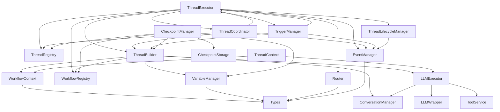

# SDK Core Execution 模块依赖关系分析报告

## 执行摘要

本报告分析了 `sdk/core/execution` 目录中各个模块的依赖关系和依赖获取方式，识别出了多个架构层面的问题和风险点，主要包括循环依赖、紧耦合、依赖管理混乱等问题。

## 1. 模块依赖关系总览

### 1.1 核心模块及其职责

| 模块名称 | 主要职责 | 依赖数量 | 被依赖数量 |
|---------|---------|---------|-----------|
| ThreadExecutor | Thread执行引擎，负责执行单个ThreadContext | 9 | 2 |
| ThreadCoordinator | Fork/Join协调器，管理子线程执行和合并 | 4 | 1 |
| ThreadBuilder | Thread构建器，从WorkflowDefinition创建ThreadContext | 5 | 3 |
| ThreadContext | Thread执行上下文，封装运行时组件 | 2 | 5 |
| ThreadRegistry | ThreadContext注册表，内存存储和查询 | 1 | 4 |
| WorkflowRegistry | 工作流注册器，管理工作流定义 | 1 | 3 |
| WorkflowContext | 工作流上下文，提供工作流执行时的共享上下文 | 0 | 3 |
| EventManager | 事件管理器，管理事件监听和分发 | 0 | 6 |
| VariableManager | 变量管理器，管理Thread变量 | 0 | 3 |
| Router | 条件路由器，根据条件选择下一个节点 | 0 | 2 |
| TriggerManager | 触发器管理器，管理触发器注册和执行 | 3 | 1 |
| LLMExecutor | LLM执行器，协调LLM调用和工具执行 | 3 | 2 |
| ConversationManager | 对话管理器，管理消息历史和Token统计 | 0 | 3 |
| CheckpointManager | 检查点管理器，创建和管理检查点 | 5 | 0 |

### 1.2 依赖关系图



## 2. 依赖获取方式分析

### 2.1 构造函数注入

**优点**：
- 依赖关系明确，易于测试
- 符合依赖倒置原则
- 便于使用Mock对象进行单元测试

**缺点**：
- 构造函数参数列表可能过长
- 需要手动管理依赖的创建和传递

**使用场景**：
- ThreadCoordinator 通过构造函数接收 ThreadRegistry, ThreadBuilder, ThreadExecutor, EventManager
- TriggerManager 通过构造函数接收 EventManager, ThreadExecutor, ThreadBuilder
- LLMExecutor 通过构造函数接收 ConversationManager

### 2.2 内部实例化

**优点**：
- 使用简单，不需要外部传递依赖
- 模块自给自足

**缺点**：
- 紧耦合，难以替换实现
- 不利于单元测试（无法注入Mock）
- 可能导致重复实例化

**使用场景**：
- ThreadExecutor 在构造函数中直接 `new ThreadRegistry()`, `new ThreadBuilder()`, `new Router()` 等
- ThreadBuilder 在构造函数中直接 `new VariableManager()`
- CheckpointManager 在构造函数中直接 `new MemoryStorage()`, `new ThreadRegistry()` 等

### 2.3 可选参数+默认实例化

**优点**：
- 灵活性高，可以外部注入也可以内部创建
- 向后兼容

**缺点**：
- 行为不一致，可能导致难以调试的问题
- 依赖关系不够明确

**使用场景**：
- ThreadExecutor 的构造函数接收可选的 workflowRegistry 参数，如果不提供则内部创建
- CheckpointManager 的所有依赖都是可选参数，如果不提供则内部创建

### 2.4 静态工厂方法

**优点**：
- 创建逻辑集中管理
- 可以隐藏复杂的创建过程

**缺点**：
- 仍然是紧耦合
- 难以扩展和定制

**使用场景**：
- NodeExecutorFactory 使用静态方法 createExecutor() 创建节点执行器
- 使用静态 Map 存储节点类型到执行器类的映射

## 3. 识别的问题和风险点

### 3.1 循环依赖问题 ⚠️ **高风险**

#### 问题描述
```typescript
// ThreadExecutor 依赖 ThreadCoordinator
this.threadCoordinator = new ThreadCoordinator(
  this.threadRegistry, 
  this.threadBuilder, 
  this,  // 传递自身实例
  this.eventManager
);

// ThreadCoordinator 依赖 ThreadExecutor
constructor(
  private threadRegistry: ThreadRegistry,
  private threadBuilder: ThreadBuilder,
  private threadExecutor: ThreadExecutor,  // 依赖 ThreadExecutor
  private eventManager: EventManager
) {}
```

**风险**：
- 可能导致初始化时的循环引用问题
- 增加代码复杂度和维护成本
- 可能导致内存泄漏
- 难以进行单元测试

**影响范围**：
- ThreadExecutor 和 ThreadCoordinator 之间的双向依赖
- 影响 Fork/Join 功能的稳定性和可测试性

### 3.2 紧耦合问题 ⚠️ **中高风险**

#### 问题描述
多个模块直接在内部实例化其他模块，导致紧耦合：

```typescript
// ThreadExecutor 构造函数
constructor(workflowRegistry?: WorkflowRegistry) {
  this.workflowRegistry = workflowRegistry || new WorkflowRegistry();
  this.threadRegistry = new ThreadRegistry();
  this.threadBuilder = new ThreadBuilder(this.workflowRegistry);
  this.router = new Router();
  this.eventManager = new EventManager();
  this.lifecycleManager = new ThreadLifecycleManager(this.eventManager);
  this.threadCoordinator = new ThreadCoordinator(this.threadRegistry, this.threadBuilder, this, this.eventManager);
  this.triggerManager = new TriggerManager(this.eventManager, this, this.threadBuilder);
}
```

**风险**：
- 难以替换实现（如无法轻松切换 EventManager 的实现）
- 不利于单元测试（无法注入 Mock 对象）
- 违反依赖倒置原则
- 模块难以独立使用

**影响范围**：
- ThreadExecutor 与所有执行相关模块的耦合
- CheckpointManager 与存储、注册表等模块的耦合

### 3.3 重复实例化问题 ⚠️ **中等风险**

#### 问题描述
同一个依赖在不同地方被多次实例化：

```typescript
// ThreadExecutor 中创建 WorkflowRegistry
this.workflowRegistry = workflowRegistry || new WorkflowRegistry();

// CheckpointManager 中也创建 WorkflowRegistry
this.workflowRegistry = workflowRegistry || new WorkflowRegistry();

// ThreadBuilder 中也使用 WorkflowRegistry
constructor(workflowRegistry: WorkflowRegistry) {
  this.workflowRegistry = workflowRegistry;
}
```

**风险**：
- 资源浪费（多个实例占用更多内存）
- 状态不一致（不同实例之间的数据不同步）
- 配置难以统一管理

**影响范围**：
- WorkflowRegistry 在多个地方被独立实例化
- ThreadRegistry 在 ThreadExecutor 和 CheckpointManager 中分别实例化

### 3.4 依赖管理混乱问题 ⚠️ **中等风险**

#### 问题描述
依赖获取方式不统一，有的通过构造函数注入，有的内部实例化：

```typescript
// 方式1：构造函数注入（推荐）
constructor(private eventManager: EventManager) {}

// 方式2：内部实例化（不推荐）
constructor() {
  this.eventManager = new EventManager();
}

// 方式3：可选参数+默认实例化（混合）
constructor(eventManager?: EventManager) {
  this.eventManager = eventManager || new EventManager();
}
```

**风险**：
- 代码风格不一致，增加维护成本
- 行为难以预测（取决于是否传入依赖）
- 测试复杂度增加

**影响范围**：
- 整个 execution 模块的依赖管理策略
- 新开发人员难以理解和遵循统一模式

### 3.5 缺乏依赖注入容器 ⚠️ **中等风险**

#### 问题描述
没有使用依赖注入容器来管理依赖：

```typescript
// 当前做法：手动创建和管理依赖
const workflowRegistry = new WorkflowRegistry();
const threadRegistry = new ThreadRegistry();
const threadBuilder = new ThreadBuilder(workflowRegistry);
const eventManager = new EventManager();
const threadExecutor = new ThreadExecutor(workflowRegistry);

// 理想做法：使用 DI 容器
const container = new DIContainer();
container.register(WorkflowRegistry);
container.register(ThreadRegistry);
container.register(ThreadBuilder);
container.register(EventManager);
container.register(ThreadExecutor);

const threadExecutor = container.resolve(ThreadExecutor);
```

**风险**：
- 依赖关系难以追踪和管理
- 手动管理依赖生命周期容易出错
- 难以实现高级特性（如作用域、拦截器等）

**影响范围**：
- 整个 SDK 的架构设计
- 可扩展性和可维护性

### 3.6 静态工厂方法的局限性 ⚠️ **低风险**

#### 问题描述
NodeExecutorFactory 使用静态方法和静态 Map：

```typescript
export class NodeExecutorFactory {
  private static executorMap: Map<NodeType, new () => NodeExecutor> = new Map();
  
  static createExecutor(nodeType: NodeType): NodeExecutor {
    // ...
  }
}
```

**风险**：
- 难以扩展和定制（静态方法不易重写）
- 无法进行依赖注入
- 测试时需要修改静态状态

**影响范围**：
- 节点执行器的创建和扩展
- 自定义节点类型的支持

## 4. 依赖获取方式合理性评估

### 4.1 构造函数注入：⭐⭐⭐⭐⭐ **推荐**

**适用场景**：
- 核心服务类之间的依赖
- 需要测试和 Mock 的依赖
- 生命周期较长的依赖

**示例**：
```typescript
// 好的实践
constructor(
  private threadRegistry: ThreadRegistry,
  private threadBuilder: ThreadBuilder,
  private threadExecutor: ThreadExecutor,
  private eventManager: EventManager
) {}
```

### 4.2 内部实例化：⭐⭐ **不推荐**

**适用场景**：
- 纯工具类（无外部依赖）
- 临时对象（生命周期短）
- 配置简单的辅助对象

**反例**：
```typescript
// 不好的实践
constructor() {
  this.eventManager = new EventManager();  // 难以测试和替换
  this.router = new Router();              // 紧耦合
}
```

### 4.3 可选参数+默认实例化：⭐⭐⭐ **谨慎使用**

**适用场景**：
- 向后兼容的场景
- 可选的依赖增强
- 默认行为明确的场景

**建议**：
```typescript
// 谨慎使用，最好有明确的文档说明
constructor(eventManager?: EventManager) {
  this.eventManager = eventManager || new EventManager();
}
```

### 4.4 静态工厂方法：⭐⭐⭐ **适度使用**

**适用场景**：
- 创建逻辑简单的对象
- 不需要依赖注入的场景
- 工具类的创建

**改进建议**：
```typescript
// 考虑改为实例方法，便于扩展和测试
export class NodeExecutorFactory {
  private executorMap: Map<NodeType, new () => NodeExecutor> = new Map();
  
  createExecutor(nodeType: NodeType): NodeExecutor {
    // ...
  }
}
```

## 5. 优化建议和解决方案

### 5.1 解决循环依赖问题

#### 方案1：引入事件驱动机制（推荐）

```typescript
// 定义 Fork/Join 事件
interface ForkEvent {
  type: 'FORK';
  parentThreadId: string;
  forkConfig: any;
}

interface JoinEvent {
  type: 'JOIN';
  parentThreadId: string;
  childThreadIds: string[];
  joinStrategy: JoinStrategy;
}

// ThreadExecutor 发布事件
class ThreadExecutor {
  constructor(private eventManager: EventManager) {}
  
  async executeFork(parentThread: ThreadContext, forkConfig: any) {
    const event: ForkEvent = {
      type: 'FORK',
      parentThreadId: parentThread.getThreadId(),
      forkConfig
    };
    
    // 发布事件，由 ThreadCoordinator 监听处理
    await this.eventManager.emit(event);
  }
}

// ThreadCoordinator 监听事件
class ThreadCoordinator {
  constructor(private eventManager: EventManager) {
    this.eventManager.on('FORK', this.handleFork.bind(this));
    this.eventManager.on('JOIN', this.handleJoin.bind(this));
  }
  
  private async handleFork(event: ForkEvent) {
    // 处理 Fork 逻辑
  }
}
```

**优点**：
- 彻底消除循环依赖
- 解耦 ThreadExecutor 和 ThreadCoordinator
- 提高可测试性

**缺点**：
- 需要引入事件机制
- 调试复杂度增加

#### 方案2：使用依赖注入容器

```typescript
// 定义接口
interface IThreadCoordinator {
  fork(parentThread: ThreadContext, forkConfig: any): Promise<string[]>;
  join(parentThread: ThreadContext, childThreadIds: string[], joinStrategy: JoinStrategy): Promise<JoinResult>;
}

// ThreadExecutor 依赖接口而非具体实现
class ThreadExecutor {
  constructor(
    private threadCoordinator: IThreadCoordinator,
    private eventManager: EventManager
  ) {}
}

// 使用 DI 容器解决循环依赖
const container = new DIContainer();
container.register(ThreadRegistry);
container.register(ThreadBuilder);
container.register(EventManager);
container.register(ThreadCoordinator).as(IThreadCoordinator);
container.register(ThreadExecutor).dependsOn(IThreadCoordinator, EventManager);
```

**优点**：
- 依赖关系清晰
- 便于测试和替换实现
- 支持循环依赖解析

**缺点**：
- 需要引入 DI 容器
- 增加学习成本

### 5.2 减少紧耦合

#### 方案1：统一使用构造函数注入

```typescript
// 重构 ThreadExecutor
class ThreadExecutor {
  constructor(
    private threadRegistry: ThreadRegistry,
    private threadBuilder: ThreadBuilder,
    private lifecycleManager: ThreadLifecycleManager,
    private router: Router,
    private eventManager: EventManager,
    private threadCoordinator: ThreadCoordinator,
    private triggerManager: TriggerManager,
    private workflowRegistry: WorkflowRegistry
  ) {}
}

// 使用工厂或 DI 容器创建
const threadExecutor = new ThreadExecutor(
  threadRegistry,
  threadBuilder,
  lifecycleManager,
  router,
  eventManager,
  threadCoordinator,
  triggerManager,
  workflowRegistry
);
```

**优点**：
- 依赖关系明确
- 便于测试（可以注入 Mock）
- 符合 SOLID 原则

**缺点**：
- 构造函数参数较多
- 创建代码较繁琐

#### 方案2：引入配置对象模式

```typescript
interface ExecutionConfig {
  threadRegistry?: ThreadRegistry;
  threadBuilder?: ThreadBuilder;
  lifecycleManager?: ThreadLifecycleManager;
  router?: Router;
  eventManager?: EventManager;
  threadCoordinator?: ThreadCoordinator;
  triggerManager?: TriggerManager;
  workflowRegistry?: WorkflowRegistry;
}

class ThreadExecutor {
  private threadRegistry: ThreadRegistry;
  private threadBuilder: ThreadBuilder;
  // ... 其他依赖
  
  constructor(config: ExecutionConfig = {}) {
    this.threadRegistry = config.threadRegistry || new ThreadRegistry();
    this.threadBuilder = config.threadBuilder || new ThreadBuilder(this.workflowRegistry);
    // ... 其他依赖的初始化
  }
}

// 使用
const threadExecutor = new ThreadExecutor({
  eventManager: customEventManager,
  workflowRegistry: customWorkflowRegistry
});
```

**优点**：
- 参数列表简洁
- 可以只覆盖需要的依赖
- 向后兼容

**缺点**：
- 类型检查较弱（所有依赖都是可选的）
- 内部仍有 new 操作

### 5.3 避免重复实例化

#### 方案1：使用单例模式

```typescript
class WorkflowRegistry {
  private static instance: WorkflowRegistry;
  
  private constructor() {}
  
  static getInstance(): WorkflowRegistry {
    if (!this.instance) {
      this.instance = new WorkflowRegistry();
    }
    return this.instance;
  }
}

// 使用
const workflowRegistry = WorkflowRegistry.getInstance();
```

**优点**：
- 确保只有一个实例
- 简单易实现

**缺点**：
- 难以测试（全局状态）
- 不支持多实例场景
- 违反依赖注入原则

#### 方案2：使用依赖注入容器管理生命周期

```typescript
// 注册为单例
container.register(WorkflowRegistry).asSingleton();

// 在需要的地方注入
class ThreadExecutor {
  constructor(
    @inject(WorkflowRegistry) private workflowRegistry: WorkflowRegistry
  ) {}
}

class CheckpointManager {
  constructor(
    @inject(WorkflowRegistry) private workflowRegistry: WorkflowRegistry
  ) {}
}
```

**优点**：
- 生命周期由容器管理
- 支持多种生命周期（单例、作用域、瞬态）
- 便于测试

**缺点**：
- 需要 DI 容器支持
- 增加注解和配置

#### 方案3：手动管理共享实例

```typescript
// 在应用入口创建共享实例
const workflowRegistry = new WorkflowRegistry();
const threadRegistry = new ThreadRegistry();

// 传递给所有需要的地方
const threadExecutor = new ThreadExecutor(workflowRegistry, threadRegistry);
const checkpointManager = new CheckpointManager(
  undefined, 
  threadRegistry, 
  undefined, 
  workflowRegistry
);
const threadBuilder = new ThreadBuilder(workflowRegistry);
```

**优点**：
- 明确控制实例共享
- 不需要额外框架

**缺点**：
- 手动管理繁琐
- 容易遗漏传递

### 5.4 统一依赖管理策略

#### 方案1：制定依赖管理规范

```markdown
# SDK 依赖管理规范

## 原则

1. **优先使用构造函数注入**
   - 所有外部依赖必须通过构造函数注入
   - 禁止在构造函数中直接 new 依赖对象

2. **依赖接口而非实现**
   - 定义清晰的接口
   - 依赖抽象而不是具体实现

3. **避免循环依赖**
   - 使用事件驱动或中介者模式解耦
   - 必要时引入 DI 容器

4. **统一生命周期管理**
   - 使用 DI 容器管理对象生命周期
   - 避免手动创建单例

5. **明确依赖方向**
   - 遵循分层架构的依赖方向
   - 禁止反向依赖

## 实践指南

### ✅ 推荐做法

```typescript
// 1. 构造函数注入
class MyService {
  constructor(
    private dependency: IDependency
  ) {}
}

// 2. 依赖接口
interface IDependency {
  doSomething(): void;
}

class Dependency implements IDependency {
  doSomething(): void {}
}

// 3. 使用工厂或 DI 容器
const service = container.resolve(MyService);
```

### ❌ 避免做法

```typescript
// 1. 内部实例化
class MyService {
  private dependency = new Dependency(); // 不好！
}

// 2. 静态方法
class MyService {
  static create() {
    return new MyService(new Dependency()); // 难以测试！
  }
}

// 3. 循环依赖
class ServiceA {
  constructor(private serviceB: ServiceB) {}
}

class ServiceB {
  constructor(private serviceA: ServiceA) {} // 循环依赖！
}
```
```

#### 方案2：引入依赖注入容器

```typescript
// 1. 安装 DI 容器库
// npm install tsyringe reflect-metadata

// 2. 配置容器
import 'reflect-metadata';
import { container } from 'tsyringe';

// 3. 注册依赖
container.register(WorkflowRegistry, { useClass: WorkflowRegistry });
container.register(ThreadRegistry, { useClass: ThreadRegistry });
container.register(EventManager, { useClass: EventManager });

// 4. 使用构造函数注入
import { injectable, inject } from 'tsyringe';

@injectable()
class ThreadExecutor {
  constructor(
    @inject(WorkflowRegistry) private workflowRegistry: WorkflowRegistry,
    @inject(ThreadRegistry) private threadRegistry: ThreadRegistry,
    @inject(EventManager) private eventManager: EventManager
  ) {}
}

// 5. 解析依赖
const threadExecutor = container.resolve(ThreadExecutor);
```

**优点**：
- 自动管理依赖关系
- 支持循环依赖解析
- 便于测试（可以替换实现）
- 生命周期管理

**缺点**：
- 需要学习和配置
- 增加运行时开销
- 需要装饰器和反射支持

#### 方案3：使用工厂模式

```typescript
// 定义工厂接口
interface IExecutionFactory {
  createThreadExecutor(): ThreadExecutor;
  createThreadCoordinator(): ThreadCoordinator;
  createThreadBuilder(): ThreadBuilder;
  createCheckpointManager(): CheckpointManager;
}

// 实现工厂
class ExecutionFactory implements IExecutionFactory {
  private workflowRegistry: WorkflowRegistry;
  private threadRegistry: ThreadRegistry;
  private eventManager: EventManager;
  
  constructor() {
    this.workflowRegistry = new WorkflowRegistry();
    this.threadRegistry = new ThreadRegistry();
    this.eventManager = new EventManager();
  }
  
  createThreadExecutor(): ThreadExecutor {
    const threadBuilder = this.createThreadBuilder();
    const lifecycleManager = new ThreadLifecycleManager(this.eventManager);
    const router = new Router();
    const threadCoordinator = this.createThreadCoordinator();
    const triggerManager = new TriggerManager(this.eventManager, null as any, threadBuilder);
    
    return new ThreadExecutor(
      this.workflowRegistry,
      this.threadRegistry,
      threadBuilder,
      lifecycleManager,
      router,
      this.eventManager,
      threadCoordinator,
      triggerManager
    );
  }
  
  createThreadCoordinator(): ThreadCoordinator {
    return new ThreadCoordinator(
      this.threadRegistry,
      this.createThreadBuilder(),
      null as any,  // 需要解决循环依赖
      this.eventManager
    );
  }
  
  createThreadBuilder(): ThreadBuilder {
    return new ThreadBuilder(this.workflowRegistry);
  }
  
  createCheckpointManager(): CheckpointManager {
    return new CheckpointManager(
      undefined,
      this.threadRegistry,
      this.createThreadBuilder(),
      undefined,
      this.workflowRegistry
    );
  }
}

// 使用
const factory = new ExecutionFactory();
const threadExecutor = factory.createThreadExecutor();
```

**优点**：
- 创建逻辑集中管理
- 可以处理复杂的创建顺序
- 便于配置和定制

**缺点**：
- 工厂本身可能变得复杂
- 仍然存在循环依赖问题
- 需要手动管理依赖关系

### 5.5 改进静态工厂方法

#### 方案：改为实例工厂

```typescript
// 定义执行器接口
interface INodeExecutor {
  execute(thread: Thread, node: Node): Promise<NodeExecutionResult>;
  validate(node: Node): boolean;
}

// 工厂接口
interface INodeExecutorFactory {
  createExecutor(nodeType: NodeType): INodeExecutor;
  registerExecutor(nodeType: NodeType, executorClass: new () => INodeExecutor): void;
  isSupported(nodeType: NodeType): boolean;
}

// 实现工厂类
class NodeExecutorFactory implements INodeExecutorFactory {
  private executorMap: Map<NodeType, new () => INodeExecutor> = new Map();
  
  constructor() {
    this.initializeDefaults();
  }
  
  private initializeDefaults(): void {
    this.executorMap.set(NodeType.START, StartNodeExecutor);
    this.executorMap.set(NodeType.END, EndNodeExecutor);
    this.executorMap.set(NodeType.VARIABLE, VariableNodeExecutor);
    // ... 其他默认执行器
  }
  
  createExecutor(nodeType: NodeType): INodeExecutor {
    const ExecutorClass = this.executorMap.get(nodeType);
    if (!ExecutorClass) {
      throw new Error(`No executor found for node type: ${nodeType}`);
    }
    return new ExecutorClass();
  }
  
  registerExecutor(nodeType: NodeType, executorClass: new () => INodeExecutor): void {
    this.executorMap.set(nodeType, executorClass);
  }
  
  isSupported(nodeType: NodeType): boolean {
    return this.executorMap.has(nodeType);
  }
}

// 使用
const factory = new NodeExecutorFactory();
const executor = factory.createExecutor(NodeType.LLM);

// 注册自定义执行器
factory.registerExecutor(NodeType.CUSTOM, CustomNodeExecutor);
```

**优点**：
- 支持实例化（便于测试）
- 可以扩展和定制
- 依赖关系明确

**缺点**：
- 需要管理工厂实例
- 比静态方法稍复杂

## 6. 实施建议

### 6.1 短期改进（1-2周）

1. **解决循环依赖**
   - 将 ThreadCoordinator 对 ThreadExecutor 的依赖改为事件驱动
   - 或者引入中介者模式

2. **统一构造函数注入**
   - 重构 ThreadExecutor，将所有内部 new 操作改为构造函数参数
   - 创建工厂类来管理复杂的创建逻辑

3. **消除重复实例化**
   - 在应用入口创建共享实例
   - 手动传递给所有需要的地方

### 6.2 中期改进（3-4周）

1. **引入依赖注入容器**
   - 评估并选择合适的 DI 框架（如 tsyringe、inversify）
   - 逐步迁移现有代码

2. **定义清晰的接口**
   - 为所有核心服务定义接口
   - 依赖接口而非实现

3. **完善工厂模式**
   - 将静态工厂改为实例工厂
   - 支持自定义和扩展

### 6.3 长期改进（1-2月）

1. **架构重构**
   - 重新设计模块划分
   - 引入分层架构和依赖规则

2. **测试驱动开发**
   - 编写完整的单元测试
   - 确保重构不破坏现有功能

3. **文档和培训**
   - 编写依赖管理规范
   - 团队培训和代码审查

## 7. 风险评估

| 问题 | 风险等级 | 影响范围 | 修复难度 | 优先级 |
|-----|---------|---------|---------|--------|
| 循环依赖 | 高 | ThreadExecutor ↔ ThreadCoordinator | 中 | P0 |
| 紧耦合 | 中高 | 整个 execution 模块 | 中 | P0 |
| 重复实例化 | 中 | WorkflowRegistry, ThreadRegistry | 低 | P1 |
| 依赖管理混乱 | 中 | 所有模块 | 中 | P1 |
| 缺乏 DI 容器 | 中 | 架构层面 | 高 | P2 |
| 静态工厂方法 | 低 | NodeExecutorFactory | 低 | P2 |

## 8. 结论

sdk/core/execution 模块的依赖关系存在多个架构层面的问题，主要包括：

1. **循环依赖** 是最严重的问题，需要立即解决
2. **紧耦合** 导致模块难以测试和扩展
3. **依赖管理混乱** 增加了维护成本
4. **缺乏统一的依赖注入机制** 限制了架构的灵活性

建议按照优先级逐步改进，首先解决循环依赖和紧耦合问题，然后引入依赖注入容器，最终建立清晰的依赖管理规范。

---

**报告生成时间**：2024年
**分析范围**：sdk/core/execution 目录
**分析工具**：代码静态分析 + 架构审查