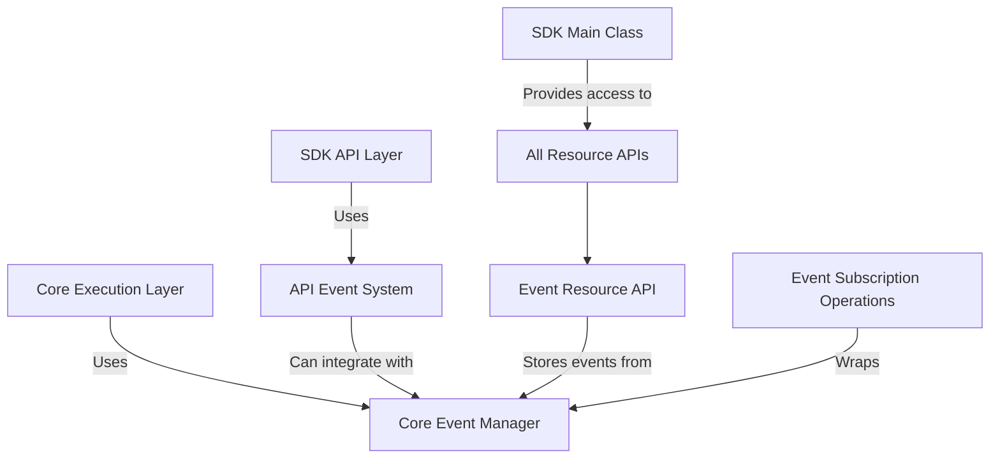

# SDK API 事件管理机制分析报告

## 概述

当前 `sdk/api` 模块实现了两层事件管理机制：
1. **API层事件系统** - 面向外部用户的通用事件发布/订阅机制
2. **核心层事件管理器** - 面向内部工作流执行的专用事件管理

这两个系统相互独立但可以协同工作，为不同的使用场景提供事件管理能力。

## 1. API层事件系统 (`sdk/api/common/api-event-system.ts`)

### 1.1 核心组件

#### `APIEventBus` 类
- **职责**: 提供统一的事件发布和订阅机制
- **设计模式**: Observer模式 + Event Bus模式
- **主要方法**:
  - `on(eventType, listener)`: 订阅事件，返回取消订阅函数
  - `once(eventType, listener)`: 订阅一次性事件
  - `off(eventType, listener)`: 取消订阅事件
  - `emit(event)`: 发布事件（异步）
  - `clear(eventType?)`: 清除监听器

#### `APIEventBuilder` 类
- **职责**: 创建标准化的事件数据
- **链式调用**: 支持流畅的事件构建语法
- **必填字段**: 事件类型（type）是必需的

### 1.2 事件类型定义 (`sdk/api/types/event-types.ts`)

#### `APIEventType` 枚举
包含以下类别：
- **资源事件**: `RESOURCE_CREATED`, `RESOURCE_UPDATED`, `RESOURCE_DELETED`, `RESOURCE_ACCESSED`
- **错误事件**: `ERROR_OCCURRED`, `VALIDATION_FAILED`
- **性能事件**: `SLOW_QUERY`, `CACHE_HIT`, `CACHE_MISS`
- **操作事件**: `OPERATION_STARTED`, `OPERATION_COMPLETED`, `OPERATION_FAILED`
- **系统事件**: `SYSTEM_READY`, `SYSTEM_SHUTDOWN`

#### `APIEventData` 接口
```typescript
interface APIEventData {
  type: APIEventType;
  timestamp: number;
  eventId: string;
  resourceType?: string;
  resourceId?: string;
  operation?: string;
  data?: Record<string, any>;
  error?: Error;
}
```

### 1.3 使用示例
```typescript
// 创建事件总线
const eventBus = createEventBus();

// 订阅事件
const unsubscribe = eventBus.on(APIEventType.RESOURCE_CREATED, (event) => {
  console.log('资源创建:', event.resourceId);
});

// 发布事件
const event = new APIEventBuilder()
  .type(APIEventType.RESOURCE_CREATED)
  .resourceType('Workflow')
  .resourceId('wf-123')
  .build();
await eventBus.emit(event);

// 取消订阅
unsubscribe();
```

## 2. 核心层事件管理器 (`sdk/core/services/event-manager.ts`)

### 2.1 核心组件

#### `EventManager` 类
- **职责**: 管理工作流执行过程中的事件，仅支持全局事件
- **单例模式**: 导出全局实例 `eventManager`
- **高级特性**:
  - 优先级支持（priority）
  - 过滤器支持（filter）
  - 超时控制（timeout）
  - 事件传播控制（stopPropagation）
  - 等待特定事件（waitFor）

### 2.2 事件类型定义 (`sdk/types/events.ts`)

#### `EventType` 枚举
包含丰富的事件类型，覆盖工作流执行的各个方面：
- **线程事件**: `THREAD_STARTED`, `THREAD_COMPLETED`, `THREAD_FAILED`, `THREAD_PAUSED` 等
- **节点事件**: `NODE_STARTED`, `NODE_COMPLETED`, `NODE_FAILED`, `NODE_CUSTOM_EVENT`
- **工具事件**: `TOOL_CALL_STARTED`, `TOOL_CALL_COMPLETED`, `TOOL_CALL_FAILED`
- **消息事件**: `MESSAGE_ADDED`
- **检查点事件**: `CHECKPOINT_CREATED`
- **子图事件**: `SUBGRAPH_STARTED`, `SUBGRAPH_COMPLETED`
- **变量事件**: `VARIABLE_CHANGED`
- **用户交互事件**: `USER_INTERACTION_REQUESTED`, `USER_INTERACTION_RESPONDED`
- **HumanRelay事件**: `HUMAN_RELAY_REQUESTED`, `HUMAN_RELAY_RESPONDED`

#### 事件接口层次结构
- `BaseEvent`: 基础事件接口
- 具体事件类型: 如 `ThreadStartedEvent`, `NodeCompletedEvent` 等
- `Event`: 所有事件类型的联合类型

### 2.3 高级功能

#### 监听器选项
```typescript
eventManager.on(EventType.NODE_COMPLETED, listener, {
  priority: 10,           // 优先级（数字越大优先级越高）
  filter: (event) => event.nodeId === 'specific-node', // 过滤器
  timeout: 5000          // 超时时间（毫秒）
});
```

#### 事件传播控制
```typescript
eventManager.on(EventType.NODE_STARTED, (event) => {
  if (someCondition) {
    eventManager.stopPropagation(event); // 停止后续监听器执行
  }
});
```

#### 等待特定事件
```typescript
// 等待特定事件触发，带超时
const event = await eventManager.waitFor(EventType.THREAD_COMPLETED, 10000);
```

## 3. 事件订阅操作 (`sdk/api/operations/subscriptions/events/`)

### 3.1 操作类设计
- `OnEventSubscription`: 注册事件监听器
- `OffEventSubscription`: 取消事件监听器  
- `OnceEventSubscription`: 注册一次性事件监听器

### 3.2 继承关系
所有订阅操作类都继承自 `BaseSubscription`，提供统一的订阅接口和元数据管理。

### 3.3 依赖注入
这些操作类通过依赖注入使用 `eventManager` 实例，便于测试和配置。

## 4. 事件资源API (`sdk/api/resources/events/event-resource-api.ts`)

### 4.1 核心功能
- **事件历史管理**: 存储和查询事件历史记录
- **事件过滤**: 支持按事件类型、线程ID、工作流ID等条件过滤
- **统计分析**: 提供事件统计信息（按类型、线程、工作流等维度）
- **时间线查询**: 获取特定线程或工作流的事件时间线
- **搜索功能**: 支持关键词搜索事件
- **导入导出**: 支持事件历史的JSON导入导出

### 4.2 继承关系
继承自 `GenericResourceAPI<BaseEvent, string, EventFilter>`，提供统一的CRUD接口。

### 4.3 限制说明
- 事件不能通过API直接创建、更新或删除（由系统自动生成）
- 主要用于查询和分析已发生的事件

## 5. 系统架构关系



## 6. 使用场景对比

| 特性 | API事件系统 | 核心事件管理器 |
|------|------------|---------------|
| **目标用户** | 外部API用户 | 内部工作流执行 |
| **事件类型** | 通用业务事件 | 工作流执行事件 |
| **复杂度** | 简单 | 复杂（支持优先级、过滤器、超时等） |
| **持久化** | 无 | 通过EventResourceAPI可持久化 |
| **传播控制** | 无 | 支持stopPropagation |
| **等待机制** | 无 | 支持waitFor |

## 7. 集成方式

### 7.1 从API层到核心层
虽然两个系统独立，但可以通过以下方式集成：
- 在API事件监听器中调用核心事件管理器的方法
- 将核心事件转换为API事件进行发布

### 7.2 事件资源API与核心事件管理器
- `EventResourceAPI` 可以监听核心事件并存储到历史记录中
- 提供查询接口供外部使用

## 8. 最佳实践建议

1. **外部集成**: 使用API事件系统进行外部系统集成
2. **内部监控**: 使用核心事件管理器进行工作流执行监控
3. **调试分析**: 使用EventResourceAPI进行事件历史分析和调试
4. **性能考虑**: 核心事件管理器支持优先级和过滤器，适合高性能场景
5. **错误处理**: 两个系统都提供了完善的错误处理机制

## 9. 总结

当前SDK的事件管理机制采用了分层设计：
- **API层**提供简单易用的通用事件系统，适合外部集成
- **核心层**提供功能丰富的专用事件管理器，适合内部工作流监控
- **资源层**提供事件历史管理和查询能力，支持调试和分析

这种设计既保证了外部API的简洁性，又满足了内部复杂事件处理的需求，是一个良好的分层架构实践。